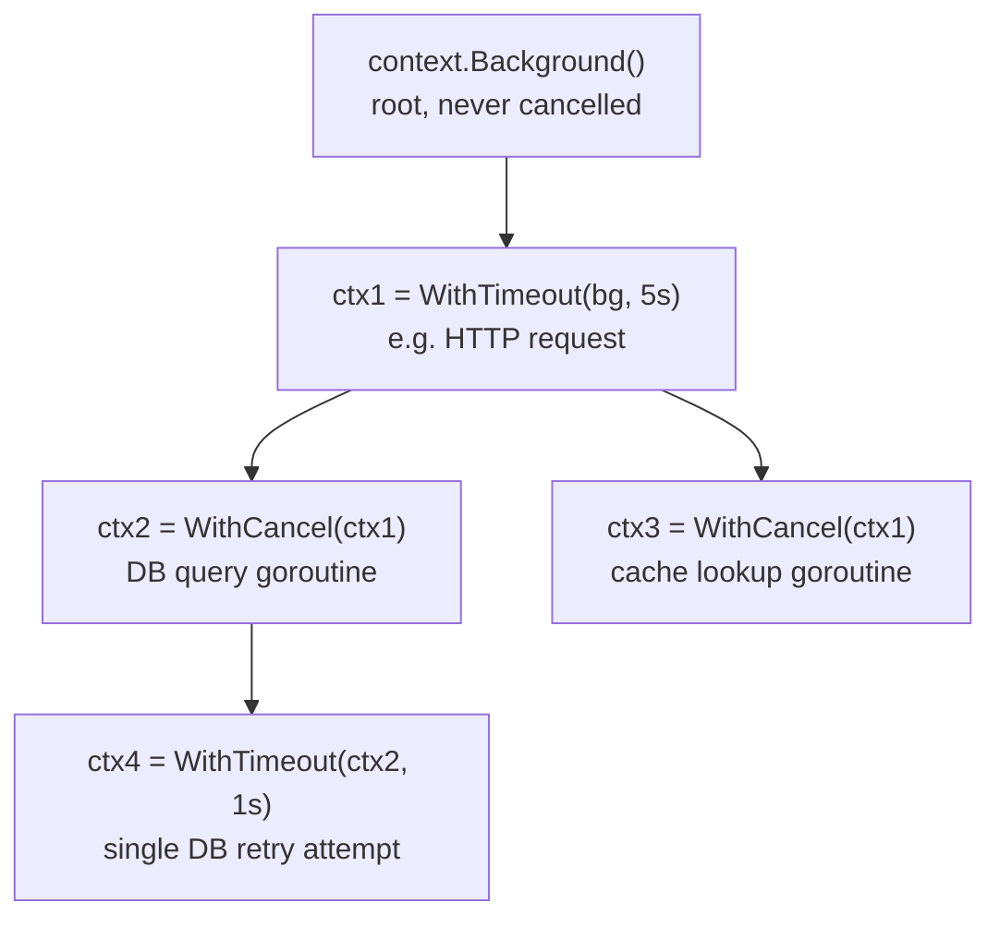
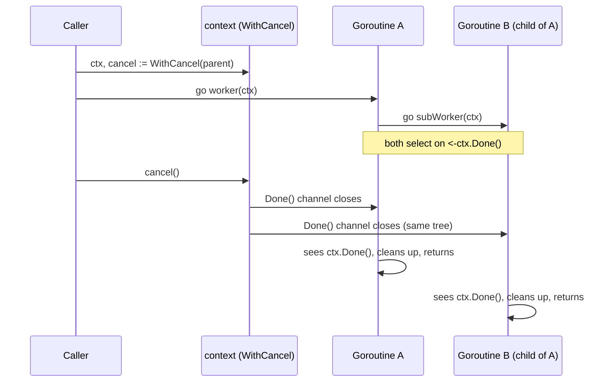

# Go context.Context — Cancellation, Deadlines, and Propagation

---

## Context Tree / Propagation Model

Every `context.Context` is derived from a parent — cancelling a parent cancels every descendant. There is no way to cancel "upward" or affect siblings.



**Propagation rules:**
- Cancelling `ctx1` (timeout fires, or explicit cancel) cancels `ctx2`, `ctx3`, `ctx4` — the entire subtree.
- Cancelling `ctx2` cancels `ctx4` but does **not** affect `ctx3` (sibling) or `ctx1` (parent).
- A child's deadline is capped by its parent's — `WithTimeout(ctx1, 10s)` where `ctx1` already has a 5s deadline still fires at 5s, not 10s.
- Values set with `context.WithValue` are visible to all descendants, never to parents or siblings.

```go
bg := context.Background()
ctx1, cancel1 := context.WithTimeout(bg, 5*time.Second)
defer cancel1()

ctx2, cancel2 := context.WithCancel(ctx1)
defer cancel2()

cancel1() // cancels ctx1 AND ctx2 (and any children of ctx2)
<-ctx2.Done()
fmt.Println(ctx2.Err()) // context.Canceled — inherited from parent
```

---

## WithCancel / WithTimeout / WithDeadline

| Function | Cancels when | `Err()` after firing | Use when |
|----------|--------------|------------------------|----------|
| `WithCancel(parent)` | `cancel()` called explicitly | `context.Canceled` | You control the cancellation trigger (user action, first-error-wins, shutdown signal) |
| `WithTimeout(parent, d)` | `d` elapses, or `cancel()` called early | `context.DeadlineExceeded` (or `Canceled` if cancelled early) | You know a relative max duration ("this call gets 3s") |
| `WithDeadline(parent, t)` | wall-clock time `t` is reached, or `cancel()` called early | `context.DeadlineExceeded` (or `Canceled` if cancelled early) | You know an absolute point in time (e.g., "must finish before the client's own deadline") |

`WithTimeout(parent, d)` is implemented as `WithDeadline(parent, time.Now().Add(d))` — identical mechanics, different ergonomics.

```go
// WithCancel — manual trigger
ctx, cancel := context.WithCancel(context.Background())
go func() {
    if userClickedStop() {
        cancel()
    }
}()

// WithTimeout — relative duration
ctx, cancel := context.WithTimeout(context.Background(), 3*time.Second)
defer cancel() // ALWAYS defer cancel, even if the timeout fires naturally — releases timer resources

// WithDeadline — absolute time (e.g. propagate an upstream deadline)
deadline := time.Now().Add(500 * time.Millisecond)
ctx, cancel := context.WithDeadline(context.Background(), deadline)
defer cancel()
```

**Always call `cancel()`, even on success.** Every `WithCancel`/`WithTimeout`/`WithDeadline` starts an internal goroutine or timer that only stops when `cancel()` runs or the parent is cancelled — skipping `defer cancel()` leaks that resource until the parent context (possibly `Background()`, i.e. never) is cancelled.

---

## context.Value — Anti-Patterns and When It's Appropriate

`context.Value` is a loosely-typed, per-request key-value bag propagated down the call tree. It is **not** a general-purpose parameter-passing mechanism.

### Anti-Patterns

```go
// BAD: passing required business parameters through context
ctx = context.WithValue(ctx, "userID", 123)         // string key — collides across packages
ctx = context.WithValue(ctx, "db", dbConn)          // dependency injection via context — hides the dependency
func process(ctx context.Context) {
    userID := ctx.Value("userID").(int)              // no compile-time safety, panics if missing/wrong type
}
```

Why this is bad:
- **Hidden dependencies** — a function's signature no longer tells you what it needs; you have to read the body to find `ctx.Value` calls.
- **No type safety** — `ctx.Value` returns `any`; a typo'd key or wrong type assertion is a runtime panic, not a compile error.
- **String keys collide** — two packages both using `"userID"` as a key will silently overwrite each other unless you use unexported custom key types.
- **Required inputs should be parameters.** If a function cannot do its job without a value, put it in the signature.

### When It's Actually Appropriate

Request-scoped metadata that's optional, cross-cutting, and doesn't change the function's core logic — tracing IDs, request-scoped loggers, auth principal for audit logging.

```go
type ctxKey int
const requestIDKey ctxKey = iota // unexported type + const — prevents collisions across packages

func WithRequestID(ctx context.Context, id string) context.Context {
    return context.WithValue(ctx, requestIDKey, id)
}

func RequestIDFromContext(ctx context.Context) (string, bool) {
    id, ok := ctx.Value(requestIDKey).(string)
    return id, ok
}

// Usage: middleware injects it, deep handlers/loggers optionally read it
func LoggingMiddleware(next http.Handler) http.Handler {
    return http.HandlerFunc(func(w http.ResponseWriter, r *http.Request) {
        id := uuid.NewString()
        ctx := WithRequestID(r.Context(), id)
        next.ServeHTTP(w, r.WithContext(ctx))
    })
}

func handler(w http.ResponseWriter, r *http.Request) {
    if id, ok := RequestIDFromContext(r.Context()); ok {
        log.Printf("[%s] handling request", id)
    }
}
```

**Rule:** if removing the value from context would break correctness (not just observability/tracing), it belongs in the function signature instead.

---

## Cancellation Propagation Through Goroutine Trees



Closing the `Done()` channel is a broadcast — every goroutine holding that context (or any context derived from it) observes it in the same instant. There's no ordering guarantee for which goroutine notices first, but all of them eventually do.

```go
func worker(ctx context.Context, id int) {
    for {
        select {
        case <-ctx.Done():
            fmt.Printf("worker %d: stopping, %v\n", id, ctx.Err())
            return
        case <-time.After(500 * time.Millisecond):
            fmt.Printf("worker %d: working\n", id)
        }
    }
}

func main() {
    ctx, cancel := context.WithTimeout(context.Background(), 2*time.Second)
    defer cancel()

    for i := 1; i <= 3; i++ {
        go worker(ctx, i) // all 3 share the same ctx tree — all stop together at 2s
    }
    <-ctx.Done()
    time.Sleep(100 * time.Millisecond) // give workers time to print their stop message
}
```

---

## errgroup — Fan-Out with Early Cancellation on First Error

`golang.org/x/sync/errgroup` runs a group of goroutines, collects the first non-nil error, and (with `WithContext`) cancels the shared context as soon as any goroutine fails — so siblings stop early instead of finishing wasted work.

```go
package main

import (
    "context"
    "fmt"
    "net/http"
    "time"

    "golang.org/x/sync/errgroup"
)

func fetch(ctx context.Context, url string) (int, error) {
    req, err := http.NewRequestWithContext(ctx, http.MethodGet, url, nil)
    if err != nil {
        return 0, err
    }
    resp, err := http.DefaultClient.Do(req)
    if err != nil {
        return 0, fmt.Errorf("fetching %s: %w", url, err)
    }
    defer resp.Body.Close()
    return resp.StatusCode, nil
}

func fetchAll(ctx context.Context, urls []string) ([]int, error) {
    g, ctx := errgroup.WithContext(ctx) // derived ctx is cancelled on first error
    statuses := make([]int, len(urls))

    for i, url := range urls {
        i, url := i, url // capture loop vars (pre Go 1.22 requirement; harmless on 1.22+)
        g.Go(func() error {
            status, err := fetch(ctx, url) // uses the errgroup's ctx — sees cancellation
            if err != nil {
                return err
            }
            statuses[i] = status
            return nil
        })
    }

    if err := g.Wait(); err != nil { // blocks until all goroutines return; returns first error
        return nil, err
    }
    return statuses, nil
}

func main() {
    ctx, cancel := context.WithTimeout(context.Background(), 5*time.Second)
    defer cancel()

    urls := []string{
        "https://example.com",
        "https://httpstat.us/500", // will fail
        "https://example.org",
    }

    statuses, err := fetchAll(ctx, urls)
    if err != nil {
        fmt.Println("failed:", err) // other in-flight fetches are cancelled via ctx as soon as this returns
        return
    }
    fmt.Println(statuses)
}
```

**Why this matters operationally:** without `errgroup.WithContext`, a failed goroutine in a fan-out just returns an error while its siblings keep running to completion — wasting downstream calls, DB connections, and time. `WithContext` turns "one failure" into "stop everything else immediately."

### errgroup with Limited Concurrency (Go 1.24+ / recent x/sync)

```go
g, ctx := errgroup.WithContext(ctx)
g.SetLimit(10) // cap concurrent goroutines — acts like a worker pool with early-cancel semantics

for _, item := range items {
    item := item
    g.Go(func() error {
        return process(ctx, item)
    })
}
if err := g.Wait(); err != nil {
    // handle first error; all others already cancelled via ctx
}
```

---

## Context in HTTP Servers

`net/http` gives every incoming request a context tied to the connection. When the client disconnects (closes the connection, hits a browser timeout, or the load balancer cuts it), `r.Context()` is cancelled automatically — your handler can react instead of doing wasted work.

```go
func handler(w http.ResponseWriter, r *http.Request) {
    ctx := r.Context() // cancelled automatically if the client disconnects

    result, err := slowDBQuery(ctx)
    if err != nil {
        if errors.Is(err, context.Canceled) {
            // client already gone — don't bother writing a response
            log.Printf("client disconnected before query finished")
            return
        }
        http.Error(w, err.Error(), http.StatusInternalServerError)
        return
    }
    json.NewEncoder(w).Encode(result)
}

func slowDBQuery(ctx context.Context) (Result, error) {
    row := db.QueryRowContext(ctx, "SELECT ...") // aborts the query server-side too, not just client-side
    // ...
}
```

Adding a server-side timeout on top of client disconnect handling:

```go
func withTimeout(next http.HandlerFunc, d time.Duration) http.HandlerFunc {
    return func(w http.ResponseWriter, r *http.Request) {
        ctx, cancel := context.WithTimeout(r.Context(), d)
        defer cancel()
        next(w, r.WithContext(ctx))
    }
}

http.HandleFunc("/report", withTimeout(reportHandler, 10*time.Second))
```

`http.TimeoutHandler` does something similar built-in, but writes a fallback response on timeout — useful for guaranteeing a response even if the handler ignores `ctx.Done()`.

---

## Common Mistakes

### 1. Storing Contexts in Structs

```go
// BAD — a context captured at construction time becomes stale;
// cancellation from a later, different request-scoped context is invisible to it
type Service struct {
    ctx context.Context // don't do this
}

func NewService(ctx context.Context) *Service {
    return &Service{ctx: ctx}
}

func (s *Service) DoWork() error {
    return doSomething(s.ctx) // wrong context — not the caller's actual request context
}
```

```go
// GOOD — pass context explicitly through every call that needs it
type Service struct{}

func (s *Service) DoWork(ctx context.Context) error {
    return doSomething(ctx)
}
```

The one narrow exception the stdlib itself allows: types with an explicit "lives across the whole program, not tied to a single request" lifetime (rare — most services don't have this).

### 2. Passing nil Context

```go
// BAD — panics inside anything that calls ctx.Done(), ctx.Value(), etc.
resp, err := http.NewRequestWithContext(nil, http.MethodGet, url, nil)
```

```go
// GOOD — always pass a real context; use context.TODO() only as a temporary
// placeholder while refactoring, never in shipped code
resp, err := http.NewRequestWithContext(context.Background(), http.MethodGet, url, nil)
```

### 3. Context Leak from Missing cancel()

```go
// BAD — cancel is never called; the internal timer goroutine for WithTimeout
// leaks until the parent (context.Background(), i.e. forever) is done
func fetch(url string) {
    ctx, _ := context.WithTimeout(context.Background(), 5*time.Second) // cancel discarded!
    req, _ := http.NewRequestWithContext(ctx, http.MethodGet, url, nil)
    http.DefaultClient.Do(req)
}
```

```go
// GOOD
func fetch(url string) {
    ctx, cancel := context.WithTimeout(context.Background(), 5*time.Second)
    defer cancel() // always — even though the timeout would eventually fire on its own,
                    // defer cancel() releases the timer immediately on the success path
    req, _ := http.NewRequestWithContext(ctx, http.MethodGet, url, nil)
    http.DefaultClient.Do(req)
}
```

`go vet` catches the common case of an unused cancel func with the `lostcancel` check — run it in CI.

```bash
go vet ./...
# ./main.go:12:2: the cancel function returned by context.WithTimeout should be called, not discarded, to avoid a context leak
```

---

## Real-World Example: Queue Consumer with Per-Message Timeout (Nack/Requeue on Timeout)

Models a RabbitMQ-style consumer: each message gets a bounded processing timeout; on timeout the message is nacked and requeued instead of acked, and a shutdown signal stops the consumer loop gracefully.

```go
package main

import (
    "context"
    "errors"
    "fmt"
    "log"
    "math/rand"
    "os/signal"
    "syscall"
    "time"
)

// Message models an incoming queue delivery (e.g., amqp.Delivery in a real RabbitMQ client).
type Message struct {
    ID   string
    Body []byte
}

// Queue is a minimal interface a real client (amqp091-go, etc.) would satisfy.
type Queue interface {
    Consume(ctx context.Context) (<-chan Message, error)
    Ack(id string) error
    Nack(id string, requeue bool) error
}

const perMessageTimeout = 2 * time.Second

func handleMessage(ctx context.Context, m Message) error {
    // Simulate variable processing time — sometimes exceeds the timeout.
    workDone := make(chan error, 1)
    go func() {
        delay := time.Duration(rand.Intn(3000)) * time.Millisecond
        time.Sleep(delay)
        workDone <- nil // pretend processing succeeded
    }()

    select {
    case err := <-workDone:
        return err
    case <-ctx.Done():
        return ctx.Err() // context.DeadlineExceeded (per-message timeout) or context.Canceled (shutdown)
    }
}

func consume(ctx context.Context, q Queue) error {
    deliveries, err := q.Consume(ctx)
    if err != nil {
        return fmt.Errorf("starting consumer: %w", err)
    }

    for {
        select {
        case <-ctx.Done():
            log.Println("shutdown signal received, stopping consumer loop")
            return ctx.Err()

        case m, ok := <-deliveries:
            if !ok {
                return errors.New("delivery channel closed unexpectedly")
            }

            msgCtx, cancel := context.WithTimeout(ctx, perMessageTimeout)
            err := handleMessage(msgCtx, m)
            cancel() // release the per-message timer immediately, don't wait for defer at loop scope

            switch {
            case err == nil:
                if ackErr := q.Ack(m.ID); ackErr != nil {
                    log.Printf("ack failed for %s: %v", m.ID, ackErr)
                }
            case errors.Is(err, context.DeadlineExceeded):
                log.Printf("message %s timed out after %v, nacking + requeueing", m.ID, perMessageTimeout)
                if nackErr := q.Nack(m.ID, true); nackErr != nil { // requeue=true
                    log.Printf("nack failed for %s: %v", m.ID, nackErr)
                }
            case errors.Is(err, context.Canceled):
                // Shutdown mid-message — requeue so another consumer (or this one, after restart) picks it up.
                log.Printf("message %s cancelled by shutdown, nacking + requeueing", m.ID)
                _ = q.Nack(m.ID, true)
            default:
                log.Printf("message %s failed: %v, nacking without requeue (poison message)", m.ID, err)
                _ = q.Nack(m.ID, false) // don't requeue — avoid infinite redelivery of a bad message
            }
        }
    }
}

func main() {
    ctx, stop := signal.NotifyContext(context.Background(), syscall.SIGTERM, syscall.SIGINT)
    defer stop()

    var q Queue // real implementation would wrap amqp091-go's Channel
    if err := consume(ctx, q); err != nil && !errors.Is(err, context.Canceled) {
        log.Fatalf("consumer exited: %v", err)
    }
}
```

**Key decisions in this pattern:**
- Per-message context is derived from the loop's `ctx` — a shutdown signal cancels in-flight message processing too, not just future deliveries.
- `context.DeadlineExceeded` (message-specific timeout) and `context.Canceled` (process shutdown) are handled differently: both requeue, but only the timeout case is a "this message specifically is slow" signal versus "we're shutting down."
- A generic processing error nacks **without** requeue — requeueing a poison message that always fails causes an infinite redelivery loop; that's what a dead-letter exchange/queue is for in production.

---

## Quick Reference

```
Root context, never cancelled           → context.Background()
Manual cancellation trigger             → context.WithCancel
Relative max duration                   → context.WithTimeout
Absolute wall-clock deadline            → context.WithDeadline
Request-scoped optional metadata only   → context.WithValue + unexported key type
Cancel entire subtree                   → cancel() on an ancestor context
React to client disconnect in HTTP      → r.Context()
Fan-out, stop all on first error        → errgroup.WithContext + g.Go + g.Wait
Cap fan-out concurrency                 → errgroup.SetLimit(n)
Always after WithCancel/Timeout/Deadline → defer cancel()
Never                                    → store ctx in a struct field, pass nil context
Catch missing cancel() in CI             → go vet (lostcancel check)
Per-message timeout + safe redelivery    → context.WithTimeout(ctx, d) per item + nack(requeue) on DeadlineExceeded
```
