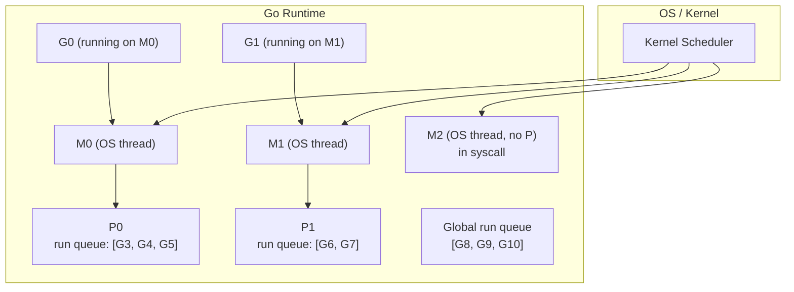
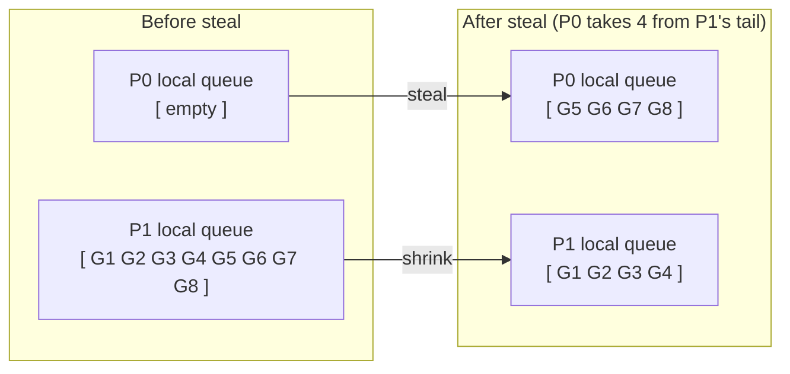
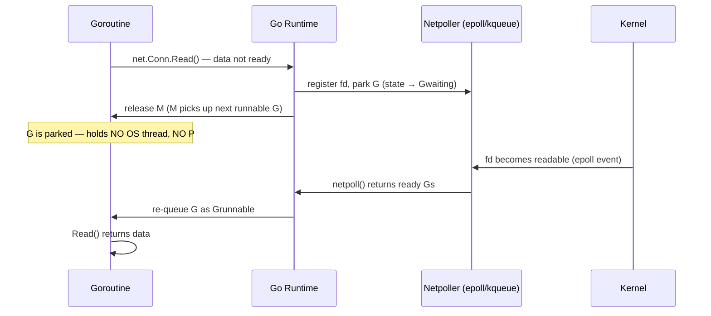
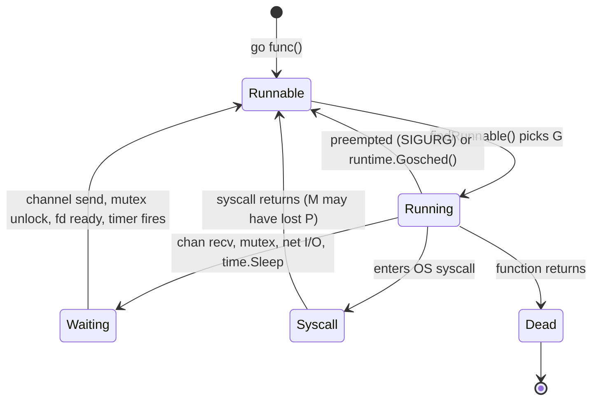

# Go Runtime Scheduler

<div class="prereq-chips">
  <span class="prereq-chip">Go — Concurrency</span>
  <span class="prereq-chip">Go — Sync Primitives</span>
</div>

Go runs thousands of goroutines on a handful of OS threads. This page explains the machinery that makes that work: the G/M/P model, the scheduling loop, work stealing, async preemption, and the netpoller.

## M:N Threading Model

Most languages map goroutines (or green threads) to OS threads 1:1. That's simple but expensive: every goroutine that blocks on I/O occupies an OS thread, each of which needs ~1 MB of stack and involves the kernel scheduler.

Go uses **M:N threading** — N goroutines multiplexed onto M OS threads, where M ≪ N.

| Model | Thread per goroutine | Stack per goroutine | Blocking cost |
|-------|---------------------|--------------------|-|
| 1:1 (Java threads, pthreads) | Yes | ~1 MB (OS default) | Blocks an OS thread |
| M:N (Go goroutines) | No | 2 KB initial, grows dynamically | Parks the goroutine, OS thread is reused |

A Go program doing 50,000 concurrent HTTP requests uses ~50,000 goroutines but typically only `runtime.NumCPU()` OS threads. The kernel never sees the goroutine count — it only sees the OS threads.

## The G, M, and P

The scheduler is built on three abstractions:

**G — Goroutine.** A lightweight execution unit. Holds:
- Its own stack (starts at 2 KB, grows/shrinks by copying)
- Program counter (where it's currently executing)
- State: `_Grunnable`, `_Grunning`, `_Gwaiting`, `_Gdead`, `_Gsyscall`
- A pointer to the goroutine function and deferred calls

**M — Machine (OS thread).** A real OS thread managed by the Go runtime. An M:
- Executes Go code when it holds a P
- Can call into cgo directly (no P needed, but can't run goroutines)
- Blocks when it enters a long syscall; the runtime detects this and hands the P to another M

**P — Processor.** A logical CPU context. The P is the **permit to run Go code** — an M without a P sits idle. Each P owns:
- A local run queue (ring buffer, max 256 goroutines)
- A pointer to the currently-running G
- Per-P caches (memory allocator mcache, defer pool)

`GOMAXPROCS` controls how many Ps exist. Default: `runtime.NumCPU()`.



The rule: **M must hold a P to run goroutines**. When M0 completes G0, it picks the next G from P0's local queue.

## The Scheduling Loop

The core scheduling loop runs inside each M:

```
schedule() → findRunnable() → execute(G) → [G yields or parks] → schedule()
```

`findRunnable()` checks sources in priority order:

<div class="stepper">
  <div class="stepper-panels">
    <div class="stepper-panel active">
      <strong>1. Every 61 ticks: check the global run queue.</strong> This prevents global-queue starvation. If P0's local queue is always full of fresh goroutines, goroutines sitting in the global queue would wait forever without this periodic check. One G is dequeued from the global queue every 61 scheduling cycles.
    </div>
    <div class="stepper-panel">
      <strong>2. Check the local run queue.</strong> P's own ring buffer holds up to 256 goroutines. Dequeue from the head (FIFO). This is the fast path — no locking, no coordination with other Ps needed.
    </div>
    <div class="stepper-panel">
      <strong>3. Work steal from another P (or netpoll).</strong> If the local queue is empty and the global queue is empty: steal half the goroutines from a randomly chosen P's local queue (from its tail). If nothing to steal, check the netpoller for ready network I/O. If still nothing, the M parks itself.
    </div>
  </div>
  <div class="stepper-controls">
    <button class="stepper-prev">← Prev</button>
    <span class="stepper-dots"></span>
    <span class="stepper-label"></span>
    <button class="stepper-next">Next →</button>
  </div>
</div>

## Work Stealing

When P0 runs out of work, it steals **half** the goroutines from a victim P's **tail**.



**Why steal from the tail?** P1 consumes its queue from the head. Stealing from the tail means P0 takes the goroutines P1 was least likely to run next — the "coldest" entries in the queue. This minimizes cache contention: P1's head goroutines stay warm in cache, P0 gets goroutines that haven't been touched recently.

<div class="quiz-card">
  <p class="quiz-q">P0's local queue is empty. P1 has 8 goroutines queued (G1–G8, G1 at head). How many does P0 steal, and which ones?</p>
  <button class="quiz-reveal">Reveal answer</button>
  <div class="quiz-a" hidden>P0 steals 4 — half of 8. It takes from P1's tail, so it gets G5, G6, G7, G8. P1 keeps G1–G4 and continues running from G1. This keeps P1's "hot" goroutines in its local cache while giving P0 a full batch of work to run.</div>
</div>

## Async Preemption (Go 1.14)

Before Go 1.14, the scheduler was **cooperative**: a goroutine yielded only at function calls (which the compiler inserted yield checks into). A tight loop with no function calls could monopolize its P indefinitely:

```go
// Before Go 1.14: this goroutine never yields
go func() {
    for {
        // no function calls → no preemption point → P is stuck
        i++
    }
}()
```

**Go 1.14 added signal-based async preemption.** The `sysmon` goroutine (runs outside the P/M scheduler, on its own OS thread) detects when an M has been running the same G for >10ms and sends it `SIGURG`. The signal handler modifies the goroutine's stack frame to inject a call to `asyncPreempt`, which cooperatively parks the goroutine and returns the P to the scheduler.

```go
// Go 1.14+: this goroutine will be preempted after ~10ms even with no function calls
go func() {
    for {
        i++ // SIGURG can interrupt here now
    }
}()
```

**Caveat: `runtime.LockOSThread()`**

```go
runtime.LockOSThread()
// G is now pinned to its M — preemption still happens, but the M won't be reused
// by other goroutines. Required for: cgo with thread-local storage, OS-level
// thread affinity, GUI toolkits (must run on main thread).
defer runtime.UnlockOSThread()
```

When a G calls `LockOSThread()`, its M is reserved exclusively for that G. The M won't be handed to another G even if the G parks. Use sparingly — each locked G consumes a dedicated OS thread.

## The Netpoller

Network I/O in Go is non-blocking at the OS level, but **blocking at the goroutine level**. The netpoller bridges these two worlds.

When a goroutine calls `net.Conn.Read()` and the data isn't ready:



The key insight: **while waiting for I/O, the goroutine holds no OS thread and no P**. The M is free to run other goroutines immediately. This is why Go can handle tens of thousands of concurrent connections with only `GOMAXPROCS` OS threads.

<div class="quiz-card">
  <p class="quiz-q">A goroutine calls <code>net.Conn.Read()</code> and the data hasn't arrived yet. Which resources does it hold while waiting?</p>
  <button class="quiz-reveal">Reveal answer</button>
  <div class="quiz-a" hidden>None. The goroutine's state transitions to <code>_Gwaiting</code> and it's moved off the run queue into the netpoller's wait list. It releases both its P (returned to the scheduler so another goroutine can run) and its M (which picks up the next runnable goroutine immediately). The goroutine only holds its own stack memory — no OS thread, no CPU time.</div>
</div>

## Goroutine State Machine



Notable transitions:
- **Running → Waiting**: the G parks itself (e.g., blocks on a channel receive). It releases the P.
- **Running → Syscall**: M enters kernel mode. `sysmon` watches this; if the syscall takes >20µs, it hands the P to another M (called "hand-off").
- **Syscall → Runnable**: syscall returns. If the original P is gone, the M tries to acquire any idle P; if none available, G goes to the global run queue and M parks.

## GOMAXPROCS

`GOMAXPROCS` sets the number of Ps — the maximum number of goroutines that can execute Go code simultaneously.

```go
prev := runtime.GOMAXPROCS(4) // set to 4, returns old value
fmt.Println(runtime.NumCPU()) // physical core count (not affected by GOMAXPROCS)
```

<div class="tab-group">
  <div class="tab-buttons">
    <button data-tab="cpu" class="active">CPU-bound</button>
    <button data-tab="io">I/O-bound</button>
    <button data-tab="one">GOMAXPROCS=1</button>
  </div>
  <div class="tab-panels">
    <div class="tab-panel active" data-tab-panel="cpu">
      <strong>CPU-bound work:</strong> GOMAXPROCS directly controls parallelism. Set to <code>runtime.NumCPU()</code> (the default) for maximum throughput. More Ps than cores → context switch overhead with no benefit. Less Ps → CPU cores sit idle.
      <pre><code>// CPU-bound: saturate all cores
runtime.GOMAXPROCS(runtime.NumCPU())</code></pre>
    </div>
    <div class="tab-panel" data-tab-panel="io">
      <strong>I/O-bound work:</strong> GOMAXPROCS barely matters. Goroutines spend most of their time parked in the netpoller — not consuming a P. Even GOMAXPROCS=1 handles thousands of concurrent connections because goroutines aren't actually running simultaneously; they're waiting for the kernel. The bottleneck is network latency, not CPU.
    </div>
    <div class="tab-panel" data-tab-panel="one">
      <strong>GOMAXPROCS=1:</strong> Only one goroutine runs at a time (no parallelism), but concurrency still works — goroutines yield at channel ops, syscalls, and preemption points, giving other goroutines a turn. Useful for reproducing race conditions that hide under parallelism, or for single-core environments.
      <pre><code>// Reproduces data races that parallelism masks
runtime.GOMAXPROCS(1)</code></pre>
    </div>
  </div>
</div>

## Visualizing Scheduler Decisions

**`runtime/trace` — full fidelity**

```bash
# Instrument your program:
f, _ := os.Create("trace.out")
trace.Start(f)
defer trace.Stop()

# Run, then view:
go tool trace trace.out
```

The trace viewer (Chrome-based) shows:
- Per-goroutine timeline: Runnable → Running → Waiting states
- GC phases (mark, sweep, STW pauses)
- Syscall blocks and their duration
- Netpoller wakeups
- Which P/M each goroutine ran on

**`GODEBUG=schedtrace=1000` — lightweight text dump**

```bash
GODEBUG=schedtrace=1000 ./myapp
# prints one line per second:
# SCHED 1000ms: gomaxprocs=8 idleprocs=6 threads=10 spinningthreads=0 \
#   idlethreads=3 runqueue=0 [0 0 0 0 0 0 0 0]
```

Fields: `runqueue` = global run queue depth; `[0 0 0 0 ...]` = per-P local queue lengths. High global queue + idle Ps → work isn't being distributed — check if goroutines are pinned or GOMAXPROCS is too low.

**`GODEBUG=scheddetail=1`** (combine with `schedtrace`) dumps per-goroutine state, useful for deadlock analysis.

---

<div class="quiz-card">
  <p class="quiz-q">You call <code>runtime.LockOSThread()</code> inside a goroutine, then the goroutine blocks on a channel receive. What happens to the OS thread?</p>
  <button class="quiz-reveal">Reveal answer</button>
  <div class="quiz-a" hidden>The goroutine parks and its state becomes <code>_Gwaiting</code>. But because of <code>LockOSThread()</code>, the OS thread (M) is reserved exclusively for this goroutine — it cannot be handed to other goroutines. The M sits idle until the goroutine becomes runnable again. This is why <code>LockOSThread()</code> should be used only when necessary: it pins one OS thread per goroutine for the goroutine's entire life (or until <code>UnlockOSThread()</code>).</div>
</div>

<div class="quiz-card">
  <p class="quiz-q">GOMAXPROCS=4, and your program has 10,000 goroutines all doing <code>time.Sleep(1 * time.Second)</code> simultaneously. How many OS threads are actively running?</p>
  <button class="quiz-reveal">Reveal answer</button>
  <div class="quiz-a" hidden>Very few — likely just 4 or fewer. <code>time.Sleep</code> parks the goroutine (<code>_Gwaiting</code>) with a timer registered in the runtime. The 10,000 goroutines are all waiting, consuming no P and no M. When their timers fire, they move back to <code>_Grunnable</code> and compete for one of the 4 Ps. GOMAXPROCS controls running goroutines, not waiting ones.</div>
</div>

<div class="quiz-card">
  <p class="quiz-q">How does work stealing prevent a situation where one P has a backlog of 200 goroutines while another P sits idle?</p>
  <button class="quiz-reveal">Reveal answer</button>
  <div class="quiz-a" hidden>When P1's local queue is empty and the global queue is empty, <code>findRunnable()</code> calls <code>stealWork()</code>, which picks a random victim P (P0 with its 200 goroutines) and atomically moves half — 100 goroutines — from P0's tail to P1's local queue. P1 is now fully loaded and P0 still has 100 goroutines. The steal is lock-free (uses CAS on the ring buffer indices), so it's cheap. Without work stealing, P1 would park its M while P0 is overloaded.</div>
</div>
