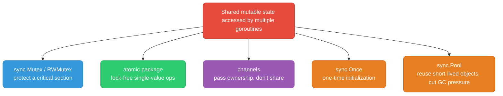

# Go sync Primitives

Concurrency correctness tools for backend/infra engineers: `sync.Mutex`, `sync.RWMutex`, `sync.Once`, `sync.Pool`, `sync.WaitGroup`, `errgroup`, `sync.Map`, and `atomic`. When to reach for a mutex vs a channel.

<div class="quiz-progress" data-quiz-progress>
  <span class="quiz-progress-label">0/0 checks</span>
  <span class="quiz-progress-bar"><span class="quiz-progress-fill"></span></span>
</div>

---

## Mental Model



**Go proverb:** "Don't communicate by sharing memory; share memory by communicating." Channels are the idiomatic default. Mutexes are for protecting state that must live in one place (caches, counters, config). Reach for the simplest tool that makes the data race go away — verify with `go test -race`.

<div class="quiz-card">
  <p class="quiz-q">What happens if you call <code>Lock()</code> on a <code>sync.Mutex</code> that is already locked by the <em>same</em> goroutine?</p>
  <button class="quiz-reveal">Reveal answer</button>
  <div class="quiz-a" hidden>The goroutine deadlocks immediately — it blocks on its own lock and can never call <code>Unlock()</code> to release it. Go mutexes are <em>not</em> reentrant (unlike Java's synchronized or C++ recursive_mutex). The runtime will detect this as a deadlock only if all other goroutines are also blocked (<code>fatal error: all goroutines are asleep - deadlock!</code>). If other goroutines are still running, the goroutine just leaks forever. The fix is to either restructure to avoid re-acquiring the same lock, extract an unlocked helper function, or — if reentrancy is genuinely needed — use a separate design (e.g., a goroutine-owned state machine pattern).</div>
</div>

---

## sync.Mutex vs sync.RWMutex

`Mutex` is exclusive — one holder at a time, readers and writers alike. `RWMutex` allows N concurrent readers OR 1 writer. `RWMutex.RLock()` still blocks if a writer holds the lock (or is waiting, to prevent writer starvation).

```go
type Config struct {
    mu   sync.RWMutex
    data map[string]string
}

func (c *Config) Get(key string) string {
    c.mu.RLock()         // multiple readers can hold this simultaneously
    defer c.mu.RUnlock()
    return c.data[key]
}

func (c *Config) Set(key, value string) {
    c.mu.Lock()          // exclusive — blocks all readers and writers
    defer c.mu.Unlock()
    c.data[key] = value
}
```

### Read-heavy vs write-heavy: benchmark guidance

`RWMutex` has higher per-call overhead than `Mutex` (atomic ops to track reader count). It only pays off when reads dominate and hold time is non-trivial.

```go
func BenchmarkMutexRead(b *testing.B) {
    var mu sync.Mutex
    data := map[string]int{"k": 1}
    b.RunParallel(func(pb *testing.PB) {
        for pb.Next() {
            mu.Lock()
            _ = data["k"]
            mu.Unlock()
        }
    })
}

func BenchmarkRWMutexRead(b *testing.B) {
    var mu sync.RWMutex
    data := map[string]int{"k": 1}
    b.RunParallel(func(pb *testing.PB) {
        for pb.Next() {
            mu.RLock()
            _ = data["k"]
            mu.RUnlock()
        }
    })
}
```

| Workload | Result | Why |
|----------|--------|-----|
| 100% reads, 8+ goroutines, GOMAXPROCS>1 | `RWMutex` wins, often 3-6x throughput | Readers proceed in parallel; `Mutex` serializes everyone |
| 100% reads, 1-2 goroutines | `Mutex` wins or ties | Not enough contention to amortize `RWMutex`'s extra bookkeeping |
| Mixed 90% read / 10% write, high contention | `RWMutex` still wins, margin shrinks | Writer waits for all readers to drain — write latency increases under read load |
| Write-heavy (>30% writes) | `Mutex` wins or ties | `RWMutex` writer starvation avoidance adds overhead with no read-parallelism payoff |
| Very short critical section (single map read, few ns) | `Mutex` can win even at moderate read ratios | Lock/unlock overhead dominates over actual work; `RWMutex`'s extra atomics aren't amortized |

<div class="toggle-switch">
  <div class="toggle-buttons">
    <button data-toggle-opt="mutex" class="active state-ok">sync.Mutex</button>
    <button data-toggle-opt="rwmutex" class="state-warn">sync.RWMutex</button>
  </div>
  <div class="toggle-panel active" data-toggle-panel="mutex">
    <strong>Use sync.Mutex when:</strong> you have mixed read/write access, or when reads are infrequent or very short (single map lookup, counter increment). Mutex is simpler to reason about, has lower per-call overhead (no reader-count bookkeeping), and is never wrong — just occasionally suboptimal for read-heavy workloads. It's also the right choice for any struct where <code>Get</code> mutates internal state (e.g., LRU recency ordering on access).
  </div>
  <div class="toggle-panel" data-toggle-panel="rwmutex">
    <strong>Use sync.RWMutex when:</strong> reads heavily outnumber writes AND the critical section does non-trivial work (map iteration, JSON marshal, computation — not a single field read). RWMutex allows N concurrent readers, which pays off at GOMAXPROCS &gt; 1. Caveat: a waiting writer blocks all new readers (writer-starvation prevention), so write latency increases under heavy read load. Never use RWMutex before profiling confirms read contention is the bottleneck.
  </div>
</div>

**Rule of thumb:** default to `Mutex`. Switch to `RWMutex` only after profiling shows read contention is the bottleneck AND the critical section does non-trivial work (JSON marshal, map iteration, computation) — not a single map lookup. Run `go test -bench=. -cpu=1,4,8` to see how the crossover point shifts with core count.

<div class="quiz-card">
  <p class="quiz-q">Can multiple goroutines hold an <code>RLock</code> on a <code>sync.RWMutex</code> at the same time? What happens when a writer is waiting to acquire the write lock?</p>
  <button class="quiz-reveal">Reveal answer</button>
  <div class="quiz-a" hidden>Yes — multiple goroutines can hold <code>RLock</code> simultaneously; that's the entire point of <code>RWMutex</code>. However, once a goroutine calls <code>Lock()</code> to acquire the write lock, Go blocks all <em>new</em> <code>RLock()</code> callers immediately, even if there are no current readers. The writer then waits for all existing readers to call <code>RUnlock()</code>. This "writer blocks new readers" rule prevents writer starvation (a scenario where a constant stream of new readers would starve the writer indefinitely). The tradeoff: under heavy read load, a write request increases read latency for all subsequent callers until the write completes.</div>
</div>

---

## sync.Once — Lazy Singleton Initialization

Guarantees a function runs exactly once, even under concurrent first-access. Internally uses an atomic fast-path check plus a mutex for the slow path — so post-init calls are nearly free (single atomic load).

```go
type AppConfig struct {
    DBHost string
    APIKey string
}

var (
    cfg      *AppConfig
    cfgOnce  sync.Once
    cfgErr   error
)

// GetConfig lazily loads config on first call. Safe for concurrent callers —
// only one goroutine executes the load; the rest block until it completes.
func GetConfig() (*AppConfig, error) {
    cfgOnce.Do(func() {
        cfg, cfgErr = loadConfigFromDisk("/etc/app/config.yaml")
    })
    return cfg, cfgErr
}

func loadConfigFromDisk(path string) (*AppConfig, error) {
    data, err := os.ReadFile(path)
    if err != nil {
        return nil, fmt.Errorf("read config: %w", err)
    }
    var c AppConfig
    if err := yaml.Unmarshal(data, &c); err != nil {
        return nil, fmt.Errorf("parse config: %w", err)
    }
    return &c, nil
}
```

**Gotcha:** if `loadConfigFromDisk` fails, `cfgOnce.Do` still marks itself as "done" — the function will never run again, and every subsequent call returns the cached error forever. If retryable initialization is needed, don't use `sync.Once` for the failure path — wrap with your own retry/reset logic, or use `golang.org/x/sync/singleflight` if you want deduped-but-retryable calls.

<div class="quiz-card">
  <p class="quiz-q">What happens if the function passed to <code>sync.Once.Do()</code> panics — does the <code>Once</code> consider itself "done"?</p>
  <button class="quiz-reveal">Reveal answer</button>
  <div class="quiz-a" hidden>Yes — if the function panics, <code>sync.Once</code> still marks itself as done. The panic propagates to the calling goroutine (and can be recovered there), but the internal "done" flag is set before the function executes. This means subsequent calls to <code>Do()</code> are no-ops — the panicking function will never run again. This is the same problem as a failing initialization: the error (or panic) is effectively permanent for the lifetime of the <code>Once</code>. If you need "retry until success" semantics, you need your own mechanism (a mutex + boolean flag, or <code>singleflight</code> for deduped concurrent attempts).</div>
</div>

---

## sync.Pool — Object Reuse to Reduce GC Pressure

`sync.Pool` holds a per-P (per-CPU) cache of reusable objects. It reduces allocations, not memory usage — objects can be dropped by the GC at any time, so the pool is a cache, not a fixed-size store. Never assume a `Get` returns a "fresh" zeroed object; reset it yourself.

### Buffer pooling in an HTTP handler

```go
var bufPool = sync.Pool{
    New: func() any {
        // Pre-size to avoid repeated grow() calls for typical response sizes.
        return new(bytes.Buffer)
    },
}

func renderHandler(w http.ResponseWriter, r *http.Request) {
    buf := bufPool.Get().(*bytes.Buffer)
    buf.Reset()               // MUST reset — pool doesn't zero objects for you
    defer bufPool.Put(buf)

    if err := renderTemplate(buf, buildViewModel(r)); err != nil {
        http.Error(w, "render failed", http.StatusInternalServerError)
        return
    }

    w.Header().Set("Content-Type", "text/html; charset=utf-8")
    w.Write(buf.Bytes())
    // buf returned to the pool for the next request on this goroutine's P.
}
```

**Impact:** for a JSON API doing ~50k req/s, pooling response buffers commonly cuts allocation rate and GC CPU time by 30-50% (measured via `go tool pprof -alloc_objects`). Without pooling, each request allocates a fresh buffer that grows via repeated `append` — pure garbage by the time the response is flushed.

**Rules:**
- Never `Put` an object that's still referenced elsewhere (use-after-return-to-pool is a live data race).
- Don't pool objects with wildly varying sizes — a pool that occasionally returns a 10MB buffer for a 1KB request wastes memory. Consider bucketed pools (small/medium/large) if size variance is high.
- `sync.Pool` is not for connection pools, worker pools, or anything with lifecycle semantics (open/close, health checks) — those need explicit pool management (`database/sql`, custom worker pools).

<div class="quiz-card">
  <p class="quiz-q">What happens to objects stored in a <code>sync.Pool</code> during a GC cycle — and why does this make Pool unsafe for items that hold OS resources?</p>
  <button class="quiz-reveal">Reveal answer</button>
  <div class="quiz-a" hidden>The GC is permitted to evict <em>all</em> objects from a <code>sync.Pool</code> at any GC cycle — the pool provides no guarantees about how long an object will live between a <code>Put</code> and a subsequent <code>Get</code>. This is by design: the pool is a cache to reduce allocation pressure, not a reliable object store. For items holding OS resources (file descriptors, network connections, database connections), eviction without closing is a resource leak — the GC collects the Go object but the OS resource (fd, socket) stays open until the finalizer runs (if one exists) or the process exits. For these, use an explicit pool with lifecycle management (<code>database/sql</code>'s connection pool, a channel-based worker pool with <code>defer conn.Close()</code>).</div>
</div>

---

## sync.WaitGroup — Fan-Out Pattern

`WaitGroup` counts outstanding goroutines. `Add(n)` increments, `Done()` decrements, `Wait()` blocks until zero.

```go
func fetchAll(ctx context.Context, urls []string) []Result {
    results := make([]Result, len(urls))
    var wg sync.WaitGroup

    wg.Add(len(urls))            // Add BEFORE spawning — see misuse note below
    for i, url := range urls {
        go func(i int, url string) {
            defer wg.Done()
            results[i] = fetch(ctx, url)
        }(i, url)
    }
    wg.Wait()
    return results
}
```

### Common misuse: Add() inside the goroutine vs outside

```go
// WRONG — race between wg.Wait() and wg.Add() inside the goroutine.
// If the main goroutine reaches Wait() before any child goroutine calls
// Add(1), WaitGroup counter is 0 and Wait() returns immediately —
// some fetches never happen, or worse: "sync: WaitGroup is reused before
// previous Wait has returned" panic if counter hits 0 mid-flight.
func broken(urls []string) {
    var wg sync.WaitGroup
    for _, url := range urls {
        go func(url string) {
            wg.Add(1)           // too late — race with Wait()
            defer wg.Done()
            fetch(url)
        }(url)
    }
    wg.Wait()
}

// CORRECT — Add() happens-before the goroutine starts, in the parent.
func correct(urls []string) {
    var wg sync.WaitGroup
    for _, url := range urls {
        wg.Add(1)               // called synchronously in the loop
        go func(url string) {
            defer wg.Done()
            fetch(url)
        }(url)
    }
    wg.Wait()
}
```

**Rule:** always call `Add` in the same goroutine that will eventually call `Wait`, and always before the `go` statement that spawns the worker. `Done` (i.e. `Add(-1)`) is fine inside the goroutine via `defer`.

<div class="quiz-card">
  <p class="quiz-q">Why must <code>wg.Add(1)</code> be called <em>before</em> the <code>go func()</code> statement rather than as the first line inside the goroutine?</p>
  <button class="quiz-reveal">Reveal answer</button>
  <div class="quiz-a" hidden>There is a race between goroutine scheduling and <code>wg.Wait()</code>. If <code>Add(1)</code> is called inside the goroutine, the main goroutine might reach <code>wg.Wait()</code> before the new goroutine is scheduled and calls <code>Add(1)</code>. At that moment the counter is 0, so <code>Wait()</code> returns immediately — before the goroutine has started, let alone finished. Worse, if the goroutine does call <code>Add(1)</code> after <code>Wait()</code> has already returned and the WaitGroup is being reused, you get a panic: "sync: WaitGroup is reused before previous Wait has returned." Calling <code>Add</code> in the spawning goroutine, synchronously before <code>go</code>, establishes a happens-before relationship: the goroutine is guaranteed to be counted before <code>Wait()</code> could return.</div>
</div>

---

## golang.org/x/sync/errgroup — Fan-Out with Error Propagation

`WaitGroup` has no concept of errors or cancellation. `errgroup.Group` adds both: first non-nil error is captured, and `WithContext` cancels a derived context so sibling goroutines can bail out early.

```go
package main

import (
    "context"
    "fmt"
    "net/http"
    "time"

    "golang.org/x/sync/errgroup"
)

type FetchResult struct {
    URL        string
    StatusCode int
}

func fetchAllOrFail(parent context.Context, urls []string) ([]FetchResult, error) {
    ctx, cancel := context.WithTimeout(parent, 5*time.Second)
    defer cancel()

    g, ctx := errgroup.WithContext(ctx) // derived ctx canceled on first error
    results := make([]FetchResult, len(urls))

    for i, url := range urls {
        i, url := i, url // capture loop vars (pre-Go 1.22 idiom; harmless on 1.22+)
        g.Go(func() error {
            req, err := http.NewRequestWithContext(ctx, http.MethodGet, url, nil)
            if err != nil {
                return fmt.Errorf("build request for %s: %w", url, err)
            }
            resp, err := http.DefaultClient.Do(req)
            if err != nil {
                return fmt.Errorf("fetch %s: %w", url, err) // cancels ctx for siblings
            }
            defer resp.Body.Close()
            results[i] = FetchResult{URL: url, StatusCode: resp.StatusCode}
            return nil
        })
    }

    if err := g.Wait(); err != nil {
        return nil, err // first error observed; other goroutines already canceled
    }
    return results, nil
}
```

**Bounded concurrency** — `errgroup.Group.SetLimit(n)` (Go 1.20+) caps in-flight goroutines, useful when fanning out over thousands of items against a rate-limited downstream:

```go
g, ctx := errgroup.WithContext(ctx)
g.SetLimit(20) // at most 20 concurrent fetches; g.Go blocks past the limit

for _, url := range urls {
    url := url
    g.Go(func() error {
        return processOne(ctx, url)
    })
}
_ = g.Wait()
```

**When to use `errgroup` over raw `WaitGroup`:** any time "if one fails, stop the rest and return the error" is the desired semantics — which is most fan-out I/O in backend services (parallel downstream calls, parallel file uploads, parallel shard queries).

<div class="quiz-card">
  <p class="quiz-q">What is <code>errgroup.SetLimit(n)</code> for, and what does <code>g.Go()</code> do when the limit is already reached?</p>
  <button class="quiz-reveal">Reveal answer</button>
  <div class="quiz-a" hidden><code>SetLimit(n)</code> caps the number of goroutines that <code>errgroup</code> runs concurrently. When you call <code>g.Go(f)</code> and <code>n</code> goroutines are already in flight, <code>g.Go</code> <em>blocks</em> the calling goroutine until one of the running goroutines finishes (and the slot is freed). This gives you a bounded fan-out with the same error-propagation semantics — useful when fanning out over thousands of items against a rate-limited API or a fixed connection pool. Without <code>SetLimit</code>, every <code>g.Go</code> spawns immediately, potentially overwhelming downstream services. The limit does <em>not</em> change cancellation behavior: the first error still cancels the shared context and all in-flight goroutines see it.</div>
</div>

---

## sync.Map — When It's Actually Appropriate

`sync.Map` is a specialized concurrent map optimized for two access patterns per the standard library docs:
1. Entries are written once and read many times (stable keys, e.g. a type registry).
2. Many goroutines access **disjoint** sets of keys (low key contention).

It is **not** a general-purpose faster replacement for `map` + `Mutex`/`RWMutex`.

```go
var typeRegistry sync.Map // key: string, value: reflect.Type

func Register(name string, t reflect.Type) {
    typeRegistry.Store(name, t) // written once at startup, effectively
}

func Lookup(name string) (reflect.Type, bool) {
    v, ok := typeRegistry.Load(name) // read-heavy, hot path
    if !ok {
        return nil, false
    }
    return v.(reflect.Type), true
}
```

| Scenario | Use |
|----------|-----|
| Write-once/read-many registry (plugins, type maps, route tables built at startup) | `sync.Map` |
| Frequent updates to the same small set of keys (counters, session store, cache with evictions) | `map` + `RWMutex` — `sync.Map`'s internal dirty-map promotion degrades under write-heavy contention on shared keys |
| Need iteration order, `len()`, or atomic multi-key transactions | `map` + `Mutex` — `sync.Map` has no `Len()`, `Range` is a live unordered snapshot, no way to atomically read+modify multiple keys |
| Type safety matters | `map[K]V` + mutex (generics) — `sync.Map` is `any`/`any`, requires type assertions everywhere |
| Uncertain / default choice | `map` + `RWMutex` — simpler to reason about, easier to profile, works well in the vast majority of services |

**In practice:** most backend services should default to `map` + `RWMutex`. Reach for `sync.Map` only after profiling shows lock contention on a write-once-read-often structure specifically.

<div class="quiz-card">
  <p class="quiz-q"><code>sync.Map</code> is optimized for two specific access patterns. What are they — and why does it degrade under write-heavy workloads on shared keys?</p>
  <button class="quiz-reveal">Reveal answer</button>
  <div class="quiz-a" hidden><code>sync.Map</code> is optimized for: (1) entries written once and read many times (stable key sets), and (2) goroutines accessing largely disjoint key sets with low cross-goroutine key contention. Internally, it maintains two maps: a read-only "clean" map accessed without locks, and a "dirty" map protected by a mutex for new writes. On a read miss from the clean map, it falls through to the dirty map under a lock and eventually promotes the dirty map to clean (copying all entries). Under write-heavy workloads on shared keys, this promotion happens frequently, requiring a full copy under a mutex — worse than a plain <code>map + RWMutex</code> in both latency and memory. It also has no <code>Len()</code> method and no atomic multi-key operations.</div>
</div>

---

## atomic Package Basics

For single-value counters/flags, atomic operations avoid mutex overhead entirely — no lock, no goroutine scheduling interaction, just a CPU-level atomic instruction (CAS, LOAD, STORE).

```go
import "sync/atomic"

type Stats struct {
    requests atomic.Int64 // Go 1.19+ typed atomics — no manual int64 alignment needed
    errors   atomic.Int64
}

func (s *Stats) RecordRequest(isError bool) {
    s.requests.Add(1)
    if isError {
        s.errors.Add(1)
    }
}

func (s *Stats) ErrorRate() float64 {
    reqs := s.requests.Load()
    if reqs == 0 {
        return 0
    }
    return float64(s.errors.Load()) / float64(reqs)
}
```

### CompareAndSwap for lock-free state transitions

```go
type CircuitBreaker struct {
    state atomic.Int32 // 0=closed, 1=open, 2=half-open
}

const (
    stateClosed   = 0
    stateOpen     = 1
    stateHalfOpen = 2
)

// TryOpen transitions closed -> open exactly once, even if called
// concurrently by many goroutines observing failures simultaneously.
func (cb *CircuitBreaker) TryOpen() bool {
    return cb.state.CompareAndSwap(stateClosed, stateOpen)
    // returns true only for the single goroutine that wins the race;
    // all others get false and skip duplicate side effects (e.g. alerting)
}
```

**When atomic is enough vs when you need a mutex:**

| Need | Tool |
|------|------|
| Single counter, flag, or pointer swap | `atomic.Int64` / `atomic.Bool` / `atomic.Pointer[T]` |
| Read-modify-write across multiple related fields (must be consistent together) | `Mutex` — atomics on individual fields can't give you a consistent joint view |
| Lock-free single-writer-wins semantics (leader election flag, breaker state) | `atomic.CompareAndSwap` |
| Building a new data structure (lock-free queue, etc.) | Don't — use existing library (`container/list` + mutex, or a proven lock-free library). Hand-rolled lock-free structures are a common source of subtle bugs. |

<div class="quiz-card">
  <p class="quiz-q">When is <code>atomic.CompareAndSwap</code> more appropriate than a mutex — and what makes it safe to use without a lock?</p>
  <button class="quiz-reveal">Reveal answer</button>
  <div class="quiz-a" hidden><code>CompareAndSwap(addr, old, new)</code> atomically reads the value at <code>addr</code>, checks it equals <code>old</code>, and if so writes <code>new</code> — all as a single CPU instruction (CMPXCHG on x86). No goroutine scheduling or lock acquisition is involved, making it faster than a mutex for single-value state transitions. It's appropriate when: (1) you need "exactly one goroutine wins a race" semantics (circuit breaker transitioning closed→open, leader election flag), and (2) the operation involves only a single memory location. It fails (returns false) if another goroutine changed the value concurrently, so callers typically loop until success or give up. It's <em>not</em> appropriate when multiple related fields must be updated consistently — for that, you need a mutex to get a consistent joint view across all fields.</div>
</div>

---

## Mutex vs Channel — Decision Table

Both eliminate data races. The choice is about what the data represents, not raw performance (though mutexes are generally faster for simple state protection — channels have queueing and scheduling overhead).

| Criterion | Reach for Mutex | Reach for Channel |
|-----------|------------------|--------------------|
| What's being protected | Shared state that many goroutines read/write in place (cache, config, counters, connection pool internals) | Ownership transfer — one goroutine produces a value, another consumes it and now owns it |
| Access pattern | Synchronous, in-process access to a data structure | Communication between goroutines with distinct roles (producer/consumer, pipeline stages) |
| Need for backpressure / flow control | Not naturally expressed | Buffered channels give you backpressure for free (blocks producer when full) |
| Need for cancellation / timeout | Awkward — must combine with `context` manually around lock acquisition | Native — `select` with `ctx.Done()` or `time.After` |
| Need for fan-in/fan-out orchestration | Requires manual bookkeeping (WaitGroup + mutex-protected result slice) | Natural — worker pool reads from input chan, writes to output chan |
| Held duration | Short and bounded — never hold a lock across I/O or a channel send/receive | N/A |
| Contention with many readers | `RWMutex` scales well | Channels serialize through the receiver goroutine, no read/write distinction |
| Risk of misuse | Deadlock via lock ordering, forgetting `Unlock`, holding across calls that reacquire | Deadlock via unbuffered send with no receiver, closing a channel twice, sending on closed channel (panic) |
| Idiomatic Go guidance | Use when protecting a piece of *state* | Use when coordinating goroutine *behavior/flow* |

**Practical heuristic:** if you're protecting a struct's fields so multiple goroutines can safely call methods on it concurrently — mutex. If you're building a pipeline, worker pool, or need one goroutine to signal/hand off to another — channel. Many production systems use both: a mutex-protected cache *inside* a service, with channels used to fan work out to that service's workers.

<div class="quiz-card">
  <p class="quiz-q">Why are channels the better choice for backpressure and cancellation, while mutexes are better for in-place shared state? Give a concrete example of each.</p>
  <button class="quiz-reveal">Reveal answer</button>
  <div class="quiz-a" hidden>Channels model <em>ownership transfer</em> and <em>communication</em>: a buffered channel blocks the producer when full — that IS backpressure, requiring no extra logic. A <code>select</code> with <code>ctx.Done()</code> or <code>time.After</code> is native to channels. Example: a worker pool where jobs flow through a channel; when all workers are busy, the producer blocks on send, naturally throttling intake. Mutexes model <em>shared state</em>: a cache where many goroutines read and occasionally write a map needs all readers to see the same memory at the same time — passing ownership through a channel every time would be wasteful. Example: a rate limiter struct with an atomic counter or RWMutex-protected token bucket. Mixing both is common: a mutex-protected in-memory cache served by goroutines that receive requests via channels.</div>
</div>

---

## Full Example: Thread-Safe LRU-Style Cache with sync.RWMutex

Fixed-capacity cache with O(1) get/put using a doubly linked list (via `container/list`) for recency tracking, guarded by `RWMutex`. Reads take the read lock; but note LRU `Get` must also mutate recency order, so in a true LRU every `Get` is actually a write — this implementation documents that tradeoff explicitly.

```go
package cache

import (
    "container/list"
    "sync"
)

// entry is the value stored in each list.Element.
type entry struct {
    key   string
    value any
}

// LRUCache is a fixed-capacity, thread-safe LRU cache.
//
// NOTE on RWMutex choice: classic LRU semantics require moving the accessed
// entry to the front on every Get, which mutates internal state. That makes
// Get a write operation, not a read — so RWMutex provides no read-parallelism
// benefit for Get here. We still use RWMutex because:
//   1. Stats()/Len() are true read-only operations that benefit from RLock.
//   2. It documents intent and keeps the door open for a read-only "peek"
//      API that doesn't touch recency order.
// If your workload is pure Get-heavy with no need for strict recency movement
// on every access, a plain Mutex is simpler and just as fast.
type LRUCache struct {
    mu       sync.RWMutex
    capacity int
    ll       *list.List               // front = most recently used
    items    map[string]*list.Element // key -> list element wrapping *entry
}

func NewLRUCache(capacity int) *LRUCache {
    if capacity <= 0 {
        capacity = 128
    }
    return &LRUCache{
        capacity: capacity,
        ll:       list.New(),
        items:    make(map[string]*list.Element, capacity),
    }
}

// Get returns the value for key and marks it most-recently-used.
// This mutates ll, so it takes the exclusive lock despite being a "read" API.
func (c *LRUCache) Get(key string) (any, bool) {
    c.mu.Lock()
    defer c.mu.Unlock()

    elem, ok := c.items[key]
    if !ok {
        return nil, false
    }
    c.ll.MoveToFront(elem)
    return elem.Value.(*entry).value, true
}

// Put inserts or updates key, evicting the least-recently-used entry if the
// cache is at capacity.
func (c *LRUCache) Put(key string, value any) {
    c.mu.Lock()
    defer c.mu.Unlock()

    if elem, ok := c.items[key]; ok {
        elem.Value.(*entry).value = value
        c.ll.MoveToFront(elem)
        return
    }

    elem := c.ll.PushFront(&entry{key: key, value: value})
    c.items[key] = elem

    if c.ll.Len() > c.capacity {
        c.evictOldest()
    }
}

// evictOldest removes the least-recently-used entry. Caller must hold c.mu.
func (c *LRUCache) evictOldest() {
    oldest := c.ll.Back()
    if oldest == nil {
        return
    }
    c.ll.Remove(oldest)
    delete(c.items, oldest.Value.(*entry).key)
}

// Len is a genuine read-only operation — benefits from RLock.
func (c *LRUCache) Len() int {
    c.mu.RLock()
    defer c.mu.RUnlock()
    return c.ll.Len()
}

// Peek reads a value WITHOUT updating recency — safe to expose as RLock
// since it doesn't mutate ll or items.
func (c *LRUCache) Peek(key string) (any, bool) {
    c.mu.RLock()
    defer c.mu.RUnlock()

    elem, ok := c.items[key]
    if !ok {
        return nil, false
    }
    return elem.Value.(*entry).value, true
}
```

```go
// Usage
cache := NewLRUCache(1000)
cache.Put("user:123", userObj)

if v, ok := cache.Get("user:123"); ok {
    user := v.(*User)
    _ = user
}

// Concurrent-safe: fine to call from many goroutines
var wg sync.WaitGroup
for i := 0; i < 50; i++ {
    wg.Add(1)
    go func(i int) {
        defer wg.Done()
        cache.Put(fmt.Sprintf("key:%d", i), i)
    }(i)
}
wg.Wait()
```

**Test with the race detector before trusting any of this:**

```bash
go test -race ./cache/...
```

<div class="quiz-card">
  <p class="quiz-q">In the LRU cache implementation, why does <code>Get</code> take the exclusive write lock (<code>mu.Lock()</code>) rather than the read lock (<code>mu.RLock()</code>), even though it's conceptually a "read" operation?</p>
  <button class="quiz-reveal">Reveal answer</button>
  <div class="quiz-a" hidden>Classic LRU semantics require moving the accessed entry to the front of the recency list on every <code>Get</code> — this mutates the doubly linked list (<code>ll.MoveToFront(elem)</code>). Even though no value changes, the internal data structure is modified. Holding an <code>RLock</code> only guarantees other readers won't see a write; it provides no protection against concurrent writers mutating the list while multiple readers also call <code>MoveToFront</code> — that's a data race. The implementation is explicit about this tradeoff and notes that <code>RWMutex</code> still benefits other truly read-only methods like <code>Peek</code> and <code>Len</code>, while keeping the door open for a "peek without recency update" API that genuinely benefits from read parallelism.</div>
</div>

---

## Quick Reference

| Primitive | Purpose | Gotcha |
|-----------|---------|--------|
| `sync.Mutex` | Exclusive access to shared state | Never copy a struct containing a locked mutex; don't hold across I/O |
| `sync.RWMutex` | Concurrent reads, exclusive writes | Only wins when reads dominate AND critical section is non-trivial |
| `sync.Once` | Run init exactly once | Failure is cached forever — no automatic retry |
| `sync.Pool` | Reduce allocation/GC churn for short-lived objects | Must `Reset()` yourself; objects can vanish between GC cycles; not for connection pools |
| `sync.WaitGroup` | Wait for N goroutines to finish | `Add()` must happen before `go`, in the parent goroutine |
| `errgroup.Group` | Fan-out with first-error-wins + cancellation | Remember `SetLimit` for bounded concurrency against rate-limited downstreams |
| `sync.Map` | Concurrent map for write-once/read-many or disjoint-key access | Degrades under write-heavy contention on shared keys; no `Len()` |
| `atomic.Int64` / `CompareAndSwap` | Lock-free single-value ops | Can't give a consistent view across multiple fields — use a mutex for that |
