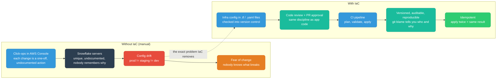
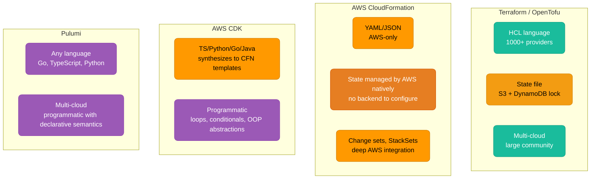
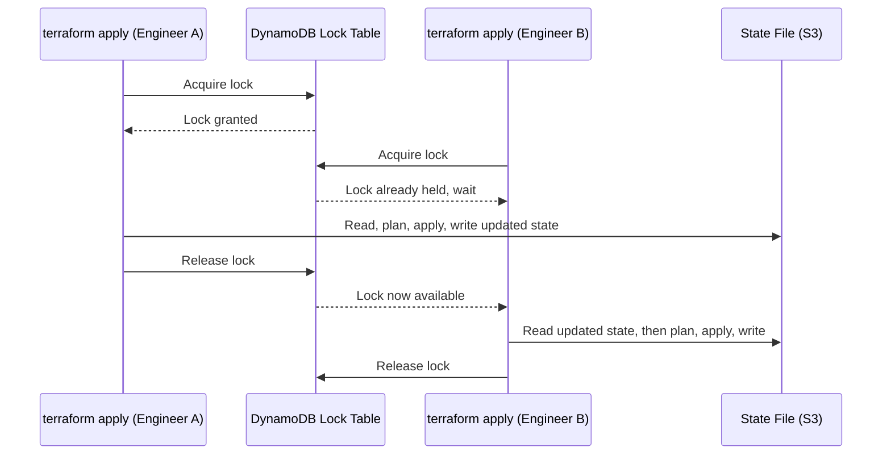
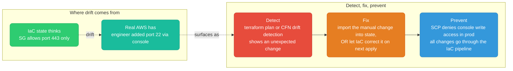
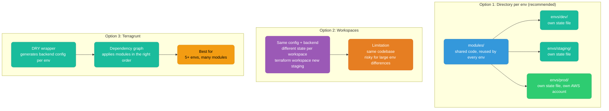
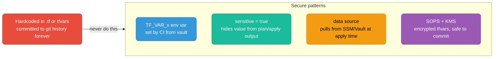

# Infrastructure as Code (IaC)

Managing infrastructure through versioned, reviewable code — the same discipline applied to application code.

<div class="quiz-progress" data-quiz-progress>
  <span class="quiz-progress-label">0/0 checks</span>
  <span class="quiz-progress-bar"><span class="quiz-progress-fill"></span></span>
</div>

---

## Why IaC



<div class="quiz-card">
  <p class="quiz-q">Someone claims the main benefit of IaC over click-ops is that it's faster to spin up infrastructure. Based on this section, what's the more important benefit?</p>
  <button class="quiz-reveal">Reveal answer</button>
  <div class="quiz-a" hidden>Reproducibility and idempotency, not raw speed. Click-ops produces snowflake servers and config drift (prod != staging != dev), which breeds fear of change because nobody knows what will break. IaC's payoff is that infra is versioned, auditable, and reviewable like application code, and that applying the same config twice produces the same result — that's what actually removes the fear, not just the time saved per change.</div>
</div>

---

## Declarative vs Imperative

```mermaid
graph TD
    classDef blue fill:#3498db,stroke:#2980b9,color:#fff,rx:8
    classDef green fill:#2ecc71,stroke:#27ae60,color:#fff,rx:8
    classDef red fill:#e74c3c,stroke:#c0392b,color:#fff,rx:8
    classDef orange fill:#e67e22,stroke:#d35400,color:#fff,rx:8
    classDef purple fill:#9b59b6,stroke:#8e44ad,color:#fff,rx:8
    classDef teal fill:#1abc9c,stroke:#16a085,color:#fff,rx:8
    classDef dark fill:#2c3e50,stroke:#1a252f,color:#fff,rx:8
    classDef yellow fill:#f39c12,stroke:#d68910,color:#000,rx:8
    classDef k8s fill:#326ce5,stroke:#254ea8,color:#fff,rx:8
    classDef aws fill:#ff9900,stroke:#cc7a00,color:#000,rx:8
    subgraph Declarative["Declarative: Terraform, CloudFormation, Pulumi"]
        D1["Describe desired end state<br/>e.g. 3 EC2 instances, one SG"]:::blue --> D2["Tool figures out HOW<br/>diffs desired vs actual"]:::teal
        D2 --> D3["Tool tracks state internally<br/>knows what already exists"]:::purple
    end

    subgraph Imperative["Imperative: Ansible, shell scripts, AWS CLI"]
        I1["Describe the steps in order<br/>e.g. create instance, then attach EIP"]:::orange --> I2["Order matters<br/>idempotency is your problem"]:::orange
        I2 --> I3["Running twice may break things<br/>e.g. duplicate resources"]:::red
    end
```



| | Declarative | Imperative |
|--|-------------|-----------|
| You specify | What you want | How to do it |
| Idempotency | Built-in | Your responsibility |
| Diff/preview | Native (terraform plan, cdk diff) | Manual |
| Best for | Static infra (VPCs, DBs, LBs) | Config management, bootstrapping |

<div class="quiz-card">
  <p class="quiz-q">You run the same imperative shell script twice against the same environment. Why might that break something, when running `terraform apply` twice never does?</p>
  <button class="quiz-reveal">Reveal answer</button>
  <div class="quiz-a" hidden>Because idempotency is the imperative tool's own responsibility, not something it gets for free. An imperative script just replays steps in order — nothing stops it from trying to create the same resource a second time. A declarative tool tracks state internally and diffs desired vs actual before acting, so a repeat apply with nothing changed simply does nothing.</div>
</div>

---

## Tools Comparison



| | Terraform | CloudFormation | CDK | Pulumi |
|--|-----------|---------------|-----|--------|
| Language | HCL | YAML/JSON | TS/Python/Go/Java | Any language |
| State | S3+DynamoDB (recommended) | AWS-managed | AWS-managed (via CFN) | Pulumi Cloud / self-hosted |
| Cloud | Multi-cloud | AWS only | AWS only | Multi-cloud |
| Preview | `terraform plan` | Change sets | `cdk diff` | `pulumi preview` |
| Best for | Multi-cloud, OSS ecosystem | AWS-native, managed service preferred | Devs preferring real code over YAML | Teams wanting full language features |

The two most-compared tools in practice are Terraform and CloudFormation — one is multi-cloud with a state file you own, the other is AWS-native with state you never have to think about:

<div class="tab-group">
  <div class="tab-buttons">
    <button data-tab="tf" class="active">Terraform / OpenTofu</button>
    <button data-tab="cfn">AWS CloudFormation</button>
  </div>
  <div class="tab-panels">
    <div class="tab-panel active" data-tab-panel="tf">
      <strong>You own the state file and the backend.</strong> Provision an S3 bucket plus a DynamoDB lock table yourself (or use Terraform Cloud) before day one — that's what stores current world-state and arbitrates concurrent applies. In exchange you get HCL, 1000+ providers, and a config that works the same way across every cloud, plus <code>terraform plan</code> as a real diff before every apply.
    </div>
    <div class="tab-panel" data-tab-panel="cfn">
      <strong>AWS owns state for you.</strong> No backend to design, no lock table to provision, no separate mechanism to get right — CloudFormation manages it natively. The tradeoff is lock-in: it only understands AWS resources, written in YAML/JSON, and its preview is a Change Set rather than a raw diff. What it buys you is the deepest native AWS integration, including StackSets for rolling the same stack out across many AWS accounts at once.
    </div>
  </div>
</div>

<div class="quiz-card">
  <p class="quiz-q">A team is deciding between Terraform and CloudFormation and wants to skip ever provisioning a state backend themselves. Which tool gives them that, and what do they give up for it?</p>
  <button class="quiz-reveal">Reveal answer</button>
  <div class="quiz-a" hidden>CloudFormation — AWS manages state natively, so there's no S3 bucket or DynamoDB lock table to design and operate. The tradeoff is lock-in: CloudFormation is AWS-only, while Terraform's self-managed state is exactly what lets it stay multi-cloud with 1000+ providers.</div>
</div>

---

## State Management

State tracks what the tool thinks currently exists. Without it, the tool can't compute what to create, update, or destroy.

```mermaid
sequenceDiagram
    participant Dev as terraform apply
    participant State as State File (S3)
    participant Real as Real AWS

    Dev->>State: Read current state
    Dev->>Real: Refresh, query real infra
    Note over Dev: Diff, desired (code) vs actual (real)
    rect rgb(40, 60, 45)
    Note over Dev: Execution plan, + create, ~ update, - destroy
    Dev->>Real: Execute API calls
    Dev->>State: Write updated state
    end
```



<div class="stepper">
  <div class="stepper-panels">
    <div class="stepper-panel active">
      <strong>1. Read current state.</strong> The tool loads what it last recorded about the world — not necessarily what's actually there right now.
    </div>
    <div class="stepper-panel">
      <strong>2. Refresh.</strong> It queries real AWS directly, because the recorded state can be stale — someone may have changed something outside the tool since the last run.
    </div>
    <div class="stepper-panel">
      <strong>3. Diff.</strong> Desired (what the code says) is compared against actual (what refresh just found), not just against the old state file.
    </div>
    <div class="stepper-panel">
      <strong>4. Build the execution plan.</strong> Every difference becomes a line: <code>+</code> create, <code>~</code> update, <code>-</code> destroy.
    </div>
    <div class="stepper-panel">
      <strong>5. Execute and record.</strong> API calls run against real AWS, and only once they succeed does the tool write the new state back — so state always reflects the last known-good apply.
    </div>
  </div>
  <div class="stepper-controls">
    <button class="stepper-prev">← Prev</button>
    <span class="stepper-dots"></span>
    <span class="stepper-label"></span>
    <button class="stepper-next">Next →</button>
  </div>
</div>

**Remote state with locking:**

```hcl
terraform {
  backend "s3" {
    bucket         = "my-tf-state"
    key            = "prod/terraform.tfstate"
    region         = "us-east-1"
    encrypt        = true
    dynamodb_table = "tf-state-lock"  # prevents concurrent applies corrupting state
  }
}
```

**Why the lock matters:** an S3 bucket alone stores state, but it doesn't stop two people from reading, planning, and writing to it at the same time. The DynamoDB table is what actually serializes concurrent applies — one gets the lock and proceeds, the other waits instead of racing to write conflicting state:



<div class="stepper">
  <div class="stepper-panels">
    <div class="stepper-panel active">
      <strong>1. Engineer A applies first.</strong> A's <code>terraform apply</code> grabs the DynamoDB lock before doing anything else.
    </div>
    <div class="stepper-panel">
      <strong>2. Engineer B is blocked, not racing.</strong> B's apply, started seconds later, tries for the same lock and simply waits — it never gets a chance to read a state file that A is mid-write on.
    </div>
    <div class="stepper-panel">
      <strong>3. A finishes and releases.</strong> A's plan executes against real AWS, the new state is written to S3, and only then is the lock released.
    </div>
    <div class="stepper-panel">
      <strong>4. B proceeds against fresh state.</strong> B now reads the state file A just updated — including A's changes — before computing its own plan, so B is never planning against stale data.
    </div>
  </div>
  <div class="stepper-controls">
    <button class="stepper-prev">← Prev</button>
    <span class="stepper-dots"></span>
    <span class="stepper-label"></span>
    <button class="stepper-next">Next →</button>
  </div>
</div>

<div class="quiz-card">
  <p class="quiz-q">The S3 backend is configured, but `dynamodb_table` is left out. Two engineers happen to run `terraform apply` on the same stack at the same moment. What actually goes wrong?</p>
  <button class="quiz-reveal">Reveal answer</button>
  <div class="quiz-a" hidden>Nothing serializes them. S3 alone stores state, but it has no locking mechanism built into this workflow — that's exactly what the dynamodb_table entry exists to prevent. Both applies can read the same starting state, compute independent plans, and write their results back with no coordination, corrupting the state file instead of one cleanly waiting for the other.</div>
</div>

---

## Drift

Drift = actual infra differs from what IaC thinks it is. Caused by manual console/CLI changes outside the IaC workflow.



<div class="stepper">
  <div class="stepper-panels">
    <div class="stepper-panel active">
      <strong>1. Manual change happens.</strong> An engineer opens port 22 via the AWS console — outside the IaC workflow entirely, no PR, no plan.
    </div>
    <div class="stepper-panel">
      <strong>2. Drift surfaces.</strong> The next <code>terraform plan</code> (or a CloudFormation drift-detection run) shows an unexpected change that no commit produced.
    </div>
    <div class="stepper-panel">
      <strong>3. Decide.</strong> Either import the manual change into state so IaC adopts it as the new source of truth, or take no action and let the next apply correct it.
    </div>
    <div class="stepper-panel">
      <strong>4. Prevent.</strong> An SCP denies manual console-write access in production, so this class of drift can't happen again — every change has to go through the pipeline.
    </div>
  </div>
  <div class="stepper-controls">
    <button class="stepper-prev">← Prev</button>
    <span class="stepper-dots"></span>
    <span class="stepper-label"></span>
    <button class="stepper-next">Next →</button>
  </div>
</div>

**Prevention is the goal:** SCPs (Service Control Policies) that deny all manual writes in production accounts. No human IAM write permissions in prod — changes must go through the pipeline.

<div class="quiz-card">
  <p class="quiz-q">terraform plan shows a drifted security group rule (someone opened port 22 by hand). Nobody imports it and nobody edits the .tf code. What happens on the next terraform apply?</p>
  <button class="quiz-reveal">Reveal answer</button>
  <div class="quiz-a" hidden>IaC corrects it — the next apply pushes real infra back in line with what the code says, silently closing port 22 again. "Fix" in this section means one of two choices: import the manual change into state (adopt it), or do nothing and let IaC revert it on the next apply. Skipping the decision doesn't leave the manual change in place — it just means the revert happens automatically instead of on purpose.</div>
</div>

---

## Environment Isolation



| Option | State isolation | DRY | Separate AWS accounts | Best for |
|--------|----------------|-----|----------------------|----------|
| Directories | Full | Partial | Yes | Small-medium teams |
| Workspaces | Yes (per workspace) | Full | No | Similar envs, simple configs |
| Terragrunt | Full | Full | Yes | Large teams, many environments |

**Recommendation:** Directories + shared modules. Terragrunt when you hit 5+ environments.

<div class="quiz-card">
  <p class="quiz-q">Workspaces give each environment its own state, so why does this section call them "risky for large env differences" compared to directories?</p>
  <button class="quiz-reveal">Reveal answer</button>
  <div class="quiz-a" hidden>Because workspaces share the same config and the same backend — only the state differs per workspace. That's fine when dev/staging/prod are structurally similar, but it means the environments can't diverge much without conditionals creeping into one shared codebase, and it's easy to be in the wrong workspace and apply against the wrong environment with no separate-account boundary to catch the mistake. Directories give full state isolation plus separate AWS accounts per env, at the cost of only partial DRY.</div>
</div>

---

## Secrets in IaC



```hcl
variable "db_password" {
  type      = string
  sensitive = true   # hidden from CLI output and logs
}

# Pull from AWS SSM at apply time — never stored in config
data "aws_ssm_parameter" "db_password" {
  name            = "/prod/db/password"
  with_decryption = true
}
```

```bash
# .gitignore
*.tfvars
terraform.tfstate
terraform.tfstate.backup
.terraform/
```

<div class="quiz-card">
  <p class="quiz-q">Of the four secure patterns shown, which one is the only one that actually lets you commit a tfvars file to git — the exact thing the "never do this" arrow warns against for plain tfvars?</p>
  <button class="quiz-reveal">Reveal answer</button>
  <div class="quiz-a" hidden>SOPS + KMS. It encrypts the tfvars file itself, so the committed file is safe even though it's in git — unlike a plain hardcoded .tfvars, which is why that file also shows up in the .gitignore list. The other three patterns (env var from CI/vault, sensitive=true, a data source pulling at apply time) all work by keeping the secret out of the file entirely rather than making the file itself safe to commit.</div>
</div>

---

## count vs for_each

```mermaid
graph TD
    classDef blue fill:#3498db,stroke:#2980b9,color:#fff,rx:8
    classDef green fill:#2ecc71,stroke:#27ae60,color:#fff,rx:8
    classDef red fill:#e74c3c,stroke:#c0392b,color:#fff,rx:8
    classDef orange fill:#e67e22,stroke:#d35400,color:#fff,rx:8
    classDef purple fill:#9b59b6,stroke:#8e44ad,color:#fff,rx:8
    classDef teal fill:#1abc9c,stroke:#16a085,color:#fff,rx:8
    classDef dark fill:#2c3e50,stroke:#1a252f,color:#fff,rx:8
    classDef yellow fill:#f39c12,stroke:#d68910,color:#000,rx:8
    classDef k8s fill:#326ce5,stroke:#254ea8,color:#fff,rx:8
    classDef aws fill:#ff9900,stroke:#cc7a00,color:#000,rx:8
    subgraph CountDanger["count: index-based — dangerous for removals"]
        C1["users = [alice, bob, carol]"]:::blue --> C2["index 0 = alice<br/>index 1 = bob<br/>index 2 = carol"]:::blue
        C2 --> C3["Remove bob<br/>index 1 shifts to carol<br/>destroy + recreate carol AND alice"]:::red
    end

    subgraph ForEachSafe["for_each: key-based — safe for removals"]
        F1["users = {alice, bob, carol}"]:::teal --> F2["key alice<br/>key bob<br/>key carol"]:::teal
        F2 --> F3["Remove bob<br/>only bob's resource destroyed<br/>alice and carol untouched"]:::green
    end
```



**Rule:** Always `for_each` for dynamic resources. Only `count` for simple enable/disable: `count = var.enable_monitoring ? 1 : 0`.

<div class="quiz-card">
  <p class="quiz-q">A count-based list has [alice, bob, carol] at indexes 0, 1, 2. You remove bob. Which resources does Terraform actually destroy and recreate — just bob's?</p>
  <button class="quiz-reveal">Reveal answer</button>
  <div class="quiz-a" hidden>No — carol's, and by extension alice's identity in the chain, get disturbed too. Removing bob shifts carol from index 2 down to index 1, and since count-based resources are identified by index rather than by name, Terraform sees "index 1" now pointing at a different logical user and destroys + recreates it. for_each avoids this entirely because each resource is keyed by name (alice/bob/carol), so removing bob only ever touches bob's resource.</div>
</div>

---

## Lifecycle Rules

```hcl
resource "aws_instance" "web" {
  lifecycle {
    create_before_destroy = true   # new resource created BEFORE old destroyed (zero downtime)
    prevent_destroy       = true   # blocks destroy — protects prod DBs, S3 buckets
    ignore_changes        = [tags] # ignore attrs managed externally (AWS auto-tags)
    replace_triggered_by  = [aws_security_group.web.id]  # force replace when dependency changes
  }
}
```

| Rule | Use for |
|------|---------|
| `create_before_destroy` | EC2, ECS services — must have no downtime during replacement |
| `prevent_destroy` | Production databases, S3 buckets — protect from accidental destroy |
| `ignore_changes` | Tags/attrs managed by AWS or external tools |
| `replace_triggered_by` | Force replacement when a dependency changes but Terraform wouldn't detect it |

<div class="quiz-card">
  <p class="quiz-q">A production RDS resource has `prevent_destroy = true`. Someone runs `terraform destroy` against that stack. What happens?</p>
  <button class="quiz-reveal">Reveal answer</button>
  <div class="quiz-a" hidden>Terraform blocks the destroy on that resource instead of carrying it out. prevent_destroy exists specifically to protect production databases and S3 buckets from an accidental (or careless) destroy — the operation fails rather than deleting the resource.</div>
</div>

---

## Ansible

Ansible handles **configuration management** — what goes _inside_ the infrastructure that Terraform provisions.

| File | Topics | Level |
|------|--------|-------|
| [ansible/README.md](./ansible/README.md) | Architecture, how Ansible works, SSH internals, Mermaid diagrams, ansible.cfg | SDE-1 |
| [ansible/core-concepts.md](./ansible/core-concepts.md) | Inventory, playbooks, modules, tasks, handlers, variables, facts, Jinja2 templates | SDE-1 |
| [ansible/cloud-integration.md](./ansible/cloud-integration.md) | AWS SSM + SSH, GCP OS Login + IAP, dynamic inventory, cloud modules | SDE-1/2 |
| [ansible/advanced.md](./ansible/advanced.md) | Roles, collections, Vault, AWX/Tower, performance tuning, Molecule testing | SDE-2 |

**Terraform vs Ansible in one line:** Terraform creates the VM. Ansible configures what's inside it.

**Read order:** ansible/README.md → core-concepts → cloud-integration → advanced
