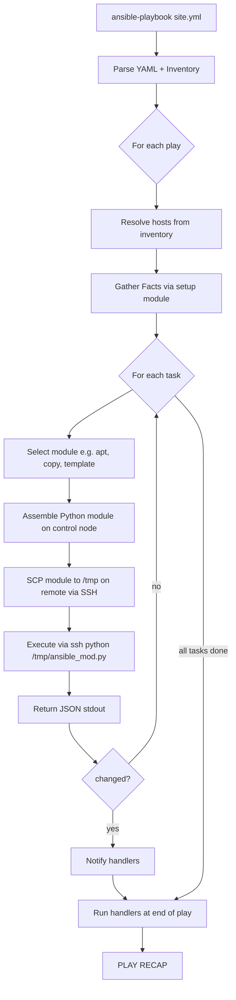
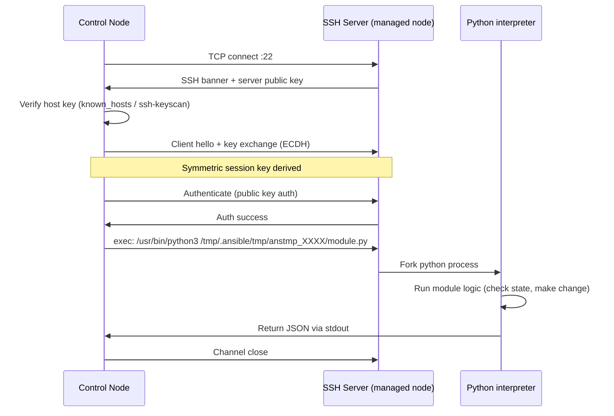

# Ansible

Ansible is an agentless automation tool. You write YAML that describes the desired state, and Ansible connects to remote machines (SSH on Linux, WinRM on Windows) to make that state real — no daemon, no agent, no open port beyond what already exists.

---

## Index

| File | Topics | Level |
|------|--------|-------|
| [README.md](./README.md) | Architecture, SSH internals, how Ansible works | SDE-1 |
| [core-concepts.md](./core-concepts.md) | Inventory, playbooks, modules, tasks, handlers, variables, facts, templates | SDE-1 |
| [cloud-integration.md](./cloud-integration.md) | AWS SSM + SSH, GCP OS Login + IAP, dynamic inventory, cloud modules | SDE-1/2 |
| [advanced.md](./advanced.md) | Roles, collections, Vault, AWX/Tower, performance (forks/pipelining), testing | SDE-2 |

**Read order:** README → core-concepts → cloud-integration → advanced

---

## How Ansible Works

Ansible is a **push-based** configuration management tool. The control node (your laptop, CI server) pushes instructions to managed nodes — managed nodes need nothing installed.

### The Execution Flow

```
ansible-playbook site.yml -i inventory.ini
         │
         ▼
  1. Parse playbook + inventory
         │
         ▼
  2. Build play list (hosts × tasks)
         │
         ▼
  3. For each play:
     a. Gather Facts (optional)
     b. For each task → select module
     c. Assemble Python module code
     d. Copy module to /tmp on remote
     e. Execute module via SSH
     f. Collect JSON result
     g. Evaluate changed / failed / ok
     h. Fire handlers if notified
         │
         ▼
  4. Print PLAY RECAP
```



### Key Design Points

- **Agentless** — Python must exist on the managed node (Python 3.x). That's it.
- **Idempotent** — Running a playbook twice produces the same result. Modules check state before acting.
- **Push model** — Control node initiates all connections. Compare to Puppet/Chef which pull from a server.
- **YAML** — Human-readable. No domain-specific language to learn.
- **Modules** — Over 3000 built-in modules. Each is a self-contained Python script.

---

## SSH Internals

### What Happens When Ansible SSHes



### Authentication Methods (in order of preference)

| Method | How | When to use |
|--------|-----|-------------|
| SSH agent forwarding | `ssh-agent` holds key, Ansible uses socket | Dev/local runs |
| Private key file | `--private-key ~/.ssh/id_rsa` | CI/CD, stable environments |
| Bastion/jump host | `ProxyJump bastion.example.com` | Private subnets |
| Password auth | `--ask-pass` | Legacy, avoid |
| AWS SSM (no SSH) | SSM agent on instance, no port 22 | AWS cloud — see cloud-integration.md |
| GCP IAP tunnel | `gcloud compute ssh` via IAP proxy | GCP — see cloud-integration.md |

### SSH Config Integration

Ansible reads `~/.ssh/config`. Put complex connection rules there:

```ini
# ~/.ssh/config
Host bastion
  HostName bastion.example.com
  User ec2-user
  IdentityFile ~/.ssh/bastion.pem

Host 10.0.*.*
  ProxyJump bastion
  User ec2-user
  IdentityFile ~/.ssh/app.pem
  StrictHostKeyChecking no
```

```ini
# inventory.ini — Ansible picks up the SSH config automatically
[web]
10.0.1.10
10.0.1.11
```

### SSH Multiplexing (ControlMaster)

By default each task opens a new SSH connection. With many tasks this is slow. Ansible can reuse a connection:

```ini
# ansible.cfg
[ssh_connection]
ssh_args = -o ControlMaster=auto -o ControlPath=/tmp/ansible-ssh-%h-%p-%r -o ControlPersist=60s
pipelining = True
```

`pipelining = True` sends module code over stdin instead of SCP — removes a round trip per task. **Fastest option for large fleets.**

---

## Architecture Overview

```mermaid
graph TD
    subgraph ControlNode
        A[ansible-playbook]
        B[Inventory Plugin]
        C[Module Library]
        D[Jinja2 Templating]
        E[Vault Decryption]
        F[ansible.cfg]
    end

    subgraph ManagedLinux
        G[sshd port 22]
        H[Python 3.x]
        I[/tmp module drop zone]
    end

    subgraph ManagedWindows
        J[WinRM 5985/5986]
        K[PowerShell]
    end

    subgraph CloudNoSSH
        L[AWS SSM Agent]
        M[GCP IAP Tunnel]
    end

    A --> B
    A --> C
    A --> D
    A --> E
    B -->|resolves hosts| A
    F -->|config| A

    A -->|SSH| G
    G --> H
    H --> I

    A -->|WinRM| J
    J --> K

    A -->|SSM API| L
    A -->|IAP proxy| M
```

---

## Ansible vs Other IaC Tools

| | Ansible | Terraform | Chef/Puppet |
|--|---------|-----------|-------------|
| Model | Push (agentless) | Declarative (API) | Pull (agent) |
| State | No state file | terraform.tfstate | Puppet DB / Chef server |
| Target | OS-level (packages, files, services) | Cloud infrastructure (VMs, VPCs, DNS) | OS-level (like Ansible) |
| Language | YAML + Jinja2 | HCL | Ruby DSL |
| Agent | None (just Python on remote) | None | Required |
| Best for | Config management, app deploys, ad-hoc | Infrastructure provisioning | Large enterprises with existing investment |

**Rule of thumb:** Use Terraform to create the VM, use Ansible to configure what's inside it.

---

## Installation

```bash
# macOS
brew install ansible

# Ubuntu/Debian
sudo apt update && sudo apt install -y ansible

# pip (any platform, latest version)
pip install ansible

# verify
ansible --version
# ansible [core 2.16.x]
```

### Required on Managed Node

```bash
# Python 3.6+ must exist
python3 --version

# If not present (RHEL minimal image)
sudo dnf install -y python3
```

---

## First Run — Ad-hoc Commands

Ad-hoc commands run a single module without a playbook. Good for testing connectivity and one-off tasks.

```bash
# Test connectivity
ansible all -i "10.0.1.10," -m ping

# Run shell command
ansible web -i inventory.ini -m shell -a "uptime"

# Install a package
ansible web -i inventory.ini -m apt -a "name=nginx state=present" --become

# Copy a file
ansible web -i inventory.ini -m copy -a "src=./nginx.conf dest=/etc/nginx/nginx.conf" --become

# Restart service
ansible web -i inventory.ini -m service -a "name=nginx state=restarted" --become
```

### Flags

| Flag | Meaning |
|------|---------|
| `-i inventory.ini` | Inventory file or host string |
| `-m ping` | Module to use |
| `-a "args"` | Module arguments |
| `--become` | Privilege escalation (sudo) |
| `--become-user root` | Escalate to specific user |
| `-u ec2-user` | SSH user |
| `--private-key ~/.ssh/key.pem` | SSH key |
| `-v / -vv / -vvv` | Verbosity (more v = more detail) |
| `--check` | Dry run — show what would change |
| `--diff` | Show file diffs |
| `--limit web01` | Run against subset of inventory |
| `--tags deploy` | Run only tagged tasks |
| `--skip-tags testing` | Skip tagged tasks |

---

## ansible.cfg — Configuration File

Ansible searches for config in this order (first found wins):
1. `ANSIBLE_CONFIG` env var
2. `./ansible.cfg` (current directory)
3. `~/.ansible.cfg`
4. `/etc/ansible/ansible.cfg`

```ini
[defaults]
inventory         = ./inventory
remote_user       = ec2-user
private_key_file  = ~/.ssh/prod.pem
host_key_checking = False          # disable for dynamic cloud IPs
forks             = 20             # parallel connections (default 5)
timeout           = 30
retry_files_enabled = False
stdout_callback   = yaml           # prettier output

[privilege_escalation]
become            = True
become_method     = sudo
become_user       = root

[ssh_connection]
pipelining        = True
ssh_args          = -o ControlMaster=auto -o ControlPath=/tmp/ansible-ssh-%h-%p-%r -o ControlPersist=60s
```

---

## Read Next

- [core-concepts.md](./core-concepts.md) — Inventory, playbooks, modules, variables, facts, Jinja2 templates
- [cloud-integration.md](./cloud-integration.md) — AWS SSM, GCP IAP, dynamic inventory
- [advanced.md](./advanced.md) — Roles, collections, Vault, AWX, testing
