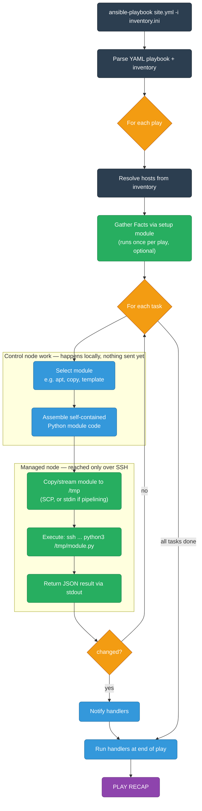
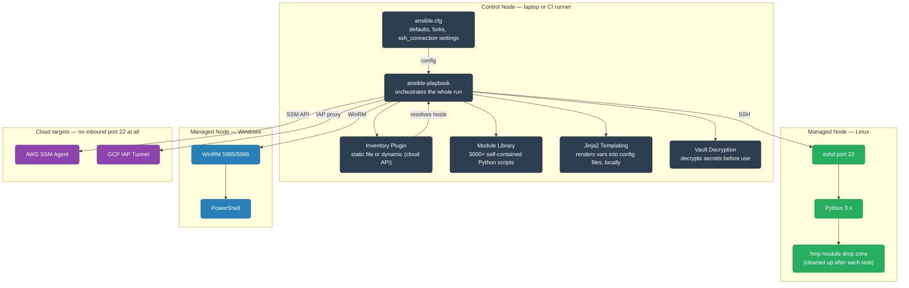

# Ansible

Ansible is an agentless automation tool. You write YAML that describes the desired state, and Ansible connects to remote machines (SSH on Linux, WinRM on Windows) to make that state real — no daemon, no agent, no open port beyond what already exists.

<div class="quiz-progress" data-quiz-progress>
  <span class="quiz-progress-label">0/0 checks</span>
  <span class="quiz-progress-bar"><span class="quiz-progress-fill"></span></span>
</div>

---

## Index

| File | Topics | Level |
|------|--------|-------|
| [README.md](./README.md) | Architecture, SSH internals, how Ansible works | SDE-1 |
| [core-concepts.md](./core-concepts.md) | Inventory, playbooks, modules, tasks, handlers, variables, facts, templates | SDE-1 |
| [cloud-integration.md](./cloud-integration.md) | AWS SSM + SSH, GCP OS Login + IAP, dynamic inventory, cloud modules | SDE-1/2 |
| [advanced.md](./advanced.md) | Roles, collections, Vault, AWX/Tower, performance (forks/pipelining), testing | SDE-2 |

**Read order:** README → core-concepts → cloud-integration → advanced

---

## How Ansible Works

Ansible is a **push-based** configuration management tool. The control node (your laptop, CI server) pushes instructions to managed nodes — managed nodes need nothing installed.

### The Execution Flow

Walk it one stage at a time — this is the same flow the mermaid diagram below shows all at once, but broken apart so the control-node-side work and the managed-node-side work don't blur together:

<div class="stepper">
  <div class="stepper-panels">
    <div class="stepper-panel active">
      <strong>1. Parse + build the play list.</strong> <code>ansible-playbook site.yml -i inventory.ini</code> parses the playbook and inventory, then builds the play list — the full matrix of hosts × tasks it's about to run. All of this happens on the control node; nothing has touched the network yet.
    </div>
    <div class="stepper-panel">
      <strong>2. Gather facts (optional).</strong> For each play, Ansible can run the built-in <code>setup</code> module first so later tasks and templates can reference discovered host variables (OS, IP addresses, memory, etc.).
    </div>
    <div class="stepper-panel">
      <strong>3. Select the module + assemble it locally.</strong> For each task, Ansible picks the right module (<code>apt</code>, <code>copy</code>, <code>template</code>, ...) and assembles it into a self-contained Python script — still entirely on the control node. Nothing exists on the managed node yet.
    </div>
    <div class="stepper-panel">
      <strong>4. SSH connect + push the module.</strong> The control node opens the SSH connection (see SSH Internals below) and copies — or, with pipelining, streams via stdin — the assembled module to a temp path under <code>/tmp</code> on the remote host. This <em>is</em> the push: the managed node never requested anything.
    </div>
    <div class="stepper-panel">
      <strong>5. Execute remotely.</strong> Ansible runs something like <code>ssh ... python3 /tmp/.ansible/tmp/anstmp_XXXX/module.py</code>. <code>sshd</code> forks a Python interpreter on the managed node, which actually executes the module logic — checking current state, then making the change if one is needed.
    </div>
    <div class="stepper-panel">
      <strong>6. Collect the JSON result.</strong> The module writes its result as JSON to stdout. That JSON travels back over the same SSH channel, and it's exactly what Ansible parses to decide <code>changed</code> / <code>failed</code> / <code>ok</code> for the task.
    </div>
    <div class="stepper-panel">
      <strong>7. Cleanup.</strong> By default Ansible deletes the temp module file it copied over, leaving no trace on the managed node once the task finishes. (Set <code>ANSIBLE_KEEP_REMOTE_FILES=1</code> to keep it around for debugging a misbehaving module.)
    </div>
    <div class="stepper-panel">
      <strong>8. Handlers + recap.</strong> Once every task in the play has run, any task that reported <code>changed</code> and had a <code>notify</code> fires its handler. The run ends with the <code>PLAY RECAP</code> summary.
    </div>
  </div>
  <div class="stepper-controls">
    <button class="stepper-prev">← Prev</button>
    <span class="stepper-dots"></span>
    <span class="stepper-label"></span>
    <button class="stepper-next">Next →</button>
  </div>
</div>

Here's the same flow as a single diagram, with the control-node-only work and the managed-node work (reached only over SSH) grouped so the push boundary is visible:



### Key Design Points

- **Agentless** — Python must exist on the managed node (Python 3.x). That's it.
- **Idempotent** — Running a playbook twice produces the same result. Modules check state before acting.
- **Push model** — Control node initiates all connections. Compare to Puppet/Chef which pull from a server.
- **YAML** — Human-readable. No domain-specific language to learn.
- **Modules** — Over 3000 built-in modules. Each is a self-contained Python script.

That third point is worth putting side by side with the alternative:

<div class="toggle-switch">
  <div class="toggle-buttons">
    <button data-toggle-opt="push" class="active">Push (Ansible)</button>
    <button data-toggle-opt="pull" class="">Pull (Puppet/Chef)</button>
  </div>
  <div class="toggle-panel active" data-toggle-panel="push">
    The control node initiates every connection: it assembles the module, opens the SSH connection, pushes the module over, and pulls back the result. Nothing has to be pre-installed or already running on the managed node beyond Python itself — there's no resident process waiting for instructions.
  </div>
  <div class="toggle-panel" data-toggle-panel="pull">
    The managed node runs a persistent agent that periodically calls home to a central server (Puppet Master / Chef Server) and pulls down its own latest configuration. That resident agent is exactly what Ansible's agentless model avoids — see "Ansible vs Other IaC Tools" further down for the fuller comparison.
  </div>
</div>

<div class="quiz-card">
  <p class="quiz-q">A teammate insists Ansible must be running some background service on the managed nodes, since every playbook run just works instantly with no setup call beforehand. What's wrong with that assumption?</p>
  <button class="quiz-reveal">Reveal answer</button>
  <div class="quiz-a" hidden>
    Nothing is running there ahead of time. The control node does all the work — it parses the playbook, assembles each module into a self-contained Python script locally, and pushes that script over on demand for every single task via SSH. The managed node only needs Python 3.x already present; it never runs a resident Ansible process and never calls out to anything — the control node always initiates the connection, which is exactly the push model.
  </div>
</div>

---

## SSH Internals

### What Happens When Ansible SSHes

```mermaid
sequenceDiagram
    participant C as Control Node
    participant S as SSH Server (managed node)
    participant P as Python interpreter

    rect rgb(44, 62, 80)
    Note over C,S: Phase 1 — transport setup
    C->>S: TCP connect :22
    S->>C: SSH banner + server public key
    C->>C: Verify host key (known_hosts / ssh-keyscan)
    C->>S: Client hello + key exchange (ECDH)
    Note over C,S: Symmetric session key derived
    end

    rect rgb(52, 73, 94)
    Note over C,S: Phase 2 — authentication
    C->>S: Authenticate (public key auth)
    S->>C: Auth success
    end

    rect rgb(39, 116, 96)
    Note over C,P: Phase 3 — push and execute, the agentless part
    C->>S: exec, run /usr/bin/python3 /tmp/.ansible/tmp/anstmp_XXXX/module.py
    S->>P: Fork python process
    P->>P: Run module logic (check state, make change)
    P->>C: Return JSON via stdout
    C->>S: Channel close
    end
```



### Authentication Methods (in order of preference)

| Method | How | When to use |
|--------|-----|-------------|
| SSH agent forwarding | `ssh-agent` holds key, Ansible uses socket | Dev/local runs |
| Private key file | `--private-key ~/.ssh/id_rsa` | CI/CD, stable environments |
| Bastion/jump host | `ProxyJump bastion.example.com` | Private subnets |
| Password auth | `--ask-pass` | Legacy, avoid |
| AWS SSM (no SSH) | SSM agent on instance, no port 22 | AWS cloud — see cloud-integration.md |
| GCP IAP tunnel | `gcloud compute ssh` via IAP proxy | GCP — see cloud-integration.md |

### SSH Config Integration

Ansible reads `~/.ssh/config`. Put complex connection rules there:

```ini
# ~/.ssh/config
Host bastion
  HostName bastion.example.com
  User ec2-user
  IdentityFile ~/.ssh/bastion.pem

Host 10.0.*.*
  ProxyJump bastion
  User ec2-user
  IdentityFile ~/.ssh/app.pem
  StrictHostKeyChecking no
```

```ini
# inventory.ini — Ansible picks up the SSH config automatically
[web]
10.0.1.10
10.0.1.11
```

### SSH Multiplexing (ControlMaster)

By default each task opens a new SSH connection. With many tasks this is slow. Ansible can reuse a connection:

```ini
# ansible.cfg
[ssh_connection]
ssh_args = -o ControlMaster=auto -o ControlPath=/tmp/ansible-ssh-%h-%p-%r -o ControlPersist=60s
pipelining = True
```

`pipelining = True` sends module code over stdin instead of SCP — removes a round trip per task. **Fastest option for large fleets.**

<div class="quiz-card">
  <p class="quiz-q">With the default settings (no ControlMaster reuse, no pipelining), does a 10-task play open one SSH connection or ten?</p>
  <button class="quiz-reveal">Reveal answer</button>
  <div class="quiz-a" hidden>
    Ten — by default each task opens a brand-new SSH connection, which is exactly what makes large playbooks feel slow. <code>ControlMaster</code>/<code>ControlPersist</code> reuses one connection across tasks instead of reconnecting each time, and <code>pipelining = True</code> goes a step further by sending the module code itself over stdin rather than copying it via SCP — removing an extra round trip per task on top of the reused connection.
  </div>
</div>

---

## Architecture Overview



Three genuinely different ways the control node reaches a managed node — worth flipping between rather than reading as one dense diagram:

<div class="tab-group">
  <div class="tab-buttons">
    <button data-tab="linux" class="active">Linux (SSH)</button>
    <button data-tab="windows">Windows (WinRM)</button>
    <button data-tab="cloud">Cloud, no SSH (SSM / IAP)</button>
  </div>
  <div class="tab-panels">
    <div class="tab-panel active" data-tab-panel="linux">
      Standard path. The control node opens a normal SSH connection to port 22, the module is copied or streamed to <code>/tmp</code>, and a Python interpreter on the box executes it. This is the flow the SSH Internals sequence diagram above walks through in full.
    </div>
    <div class="tab-panel" data-tab-panel="windows">
      Windows has no OpenSSH-by-default story the way Linux does, so Ansible talks WinRM instead, on port 5985 (HTTP) or 5986 (HTTPS). Modules run as PowerShell on the remote end rather than Python — same push model, different transport and different interpreter.
    </div>
    <div class="tab-panel" data-tab-panel="cloud">
      No inbound port 22 (or 5985) needs to be open at all. AWS targets go through the SSM Agent already running on the instance; GCP targets go through an IAP tunnel. Both are covered in depth in <code>cloud-integration.md</code> — the point here is that the push model doesn't strictly require SSH, just <em>some</em> control-node-initiated channel to run Python on the other end.
    </div>
  </div>
</div>

<div class="quiz-card">
  <p class="quiz-q">Where does Jinja2 template rendering actually happen — on the control node, or on the managed node right before the file is written?</p>
  <button class="quiz-reveal">Reveal answer</button>
  <div class="quiz-a" hidden>
    On the control node. The diagram places Jinja2 Templating and Vault Decryption inside the Control Node box, alongside the module library and ansible.cfg — templates are fully rendered (and any Vault-encrypted variables decrypted) locally, before anything is ever pushed. The managed node just receives the finished file; it never sees template syntax or encrypted values.
  </div>
</div>

---

## Ansible vs Other IaC Tools

| | Ansible | Terraform | Chef/Puppet |
|--|---------|-----------|-------------|
| Model | Push (agentless) | Declarative (API) | Pull (agent) |
| State | No state file | terraform.tfstate | Puppet DB / Chef server |
| Target | OS-level (packages, files, services) | Cloud infrastructure (VMs, VPCs, DNS) | OS-level (like Ansible) |
| Language | YAML + Jinja2 | HCL | Ruby DSL |
| Agent | None (just Python on remote) | None | Required |
| Best for | Config management, app deploys, ad-hoc | Infrastructure provisioning | Large enterprises with existing investment |

**Rule of thumb:** Use Terraform to create the VM, use Ansible to configure what's inside it.

<div class="quiz-card">
  <p class="quiz-q">Ansible keeps no state file, unlike Terraform's terraform.tfstate. So how does it know a task doesn't need to make any change on the second run?</p>
  <button class="quiz-reveal">Reveal answer</button>
  <div class="quiz-a" hidden>
    It doesn't consult a stored state file at all — idempotency is built into each module itself. Every module checks the actual current state on the managed node before acting (the same idempotent property called out in Key Design Points above), so "nothing to do" is discovered fresh on every run rather than looked up from a record of the previous one.
  </div>
</div>

---

## Installation

```bash
# macOS
brew install ansible

# Ubuntu/Debian
sudo apt update && sudo apt install -y ansible

# pip (any platform, latest version)
pip install ansible

# verify
ansible --version
# ansible [core 2.16.x]
```

### Required on Managed Node

```bash
# Python 3.6+ must exist
python3 --version

# If not present (RHEL minimal image)
sudo dnf install -y python3
```

---

## First Run — Ad-hoc Commands

Ad-hoc commands run a single module without a playbook. Good for testing connectivity and one-off tasks.

```bash
# Test connectivity
ansible all -i "10.0.1.10," -m ping

# Run shell command
ansible web -i inventory.ini -m shell -a "uptime"

# Install a package
ansible web -i inventory.ini -m apt -a "name=nginx state=present" --become

# Copy a file
ansible web -i inventory.ini -m copy -a "src=./nginx.conf dest=/etc/nginx/nginx.conf" --become

# Restart service
ansible web -i inventory.ini -m service -a "name=nginx state=restarted" --become
```

### Flags

| Flag | Meaning |
|------|---------|
| `-i inventory.ini` | Inventory file or host string |
| `-m ping` | Module to use |
| `-a "args"` | Module arguments |
| `--become` | Privilege escalation (sudo) |
| `--become-user root` | Escalate to specific user |
| `-u ec2-user` | SSH user |
| `--private-key ~/.ssh/key.pem` | SSH key |
| `-v / -vv / -vvv` | Verbosity (more v = more detail) |
| `--check` | Dry run — show what would change |
| `--diff` | Show file diffs |
| `--limit web01` | Run against subset of inventory |
| `--tags deploy` | Run only tagged tasks |
| `--skip-tags testing` | Skip tagged tasks |

---

## ansible.cfg — Configuration File

Ansible searches for config in this order (first found wins):
1. `ANSIBLE_CONFIG` env var
2. `./ansible.cfg` (current directory)
3. `~/.ansible.cfg`
4. `/etc/ansible/ansible.cfg`

```ini
[defaults]
inventory         = ./inventory
remote_user       = ec2-user
private_key_file  = ~/.ssh/prod.pem
host_key_checking = False          # disable for dynamic cloud IPs
forks             = 20             # parallel connections (default 5)
timeout           = 30
retry_files_enabled = False
stdout_callback   = yaml           # prettier output

[privilege_escalation]
become            = True
become_method     = sudo
become_user       = root

[ssh_connection]
pipelining        = True
ssh_args          = -o ControlMaster=auto -o ControlPath=/tmp/ansible-ssh-%h-%p-%r -o ControlPersist=60s
```

<div class="quiz-card">
  <p class="quiz-q">You've set the ANSIBLE_CONFIG env var, and there's also a ./ansible.cfg sitting in your current directory. Which one does Ansible actually load?</p>
  <button class="quiz-reveal">Reveal answer</button>
  <div class="quiz-a" hidden>
    The one from ANSIBLE_CONFIG — it's first in the search order, and Ansible stops at the first config it finds. ./ansible.cfg only gets used when ANSIBLE_CONFIG isn't set; the home-directory (~/.ansible.cfg) and /etc/ansible/ansible.cfg fallbacks are lower priority still.
  </div>
</div>

---

## Read Next

- [core-concepts.md](./core-concepts.md) — Inventory, playbooks, modules, variables, facts, Jinja2 templates
- [cloud-integration.md](./cloud-integration.md) — AWS SSM, GCP IAP, dynamic inventory
- [advanced.md](./advanced.md) — Roles, collections, Vault, AWX, testing
