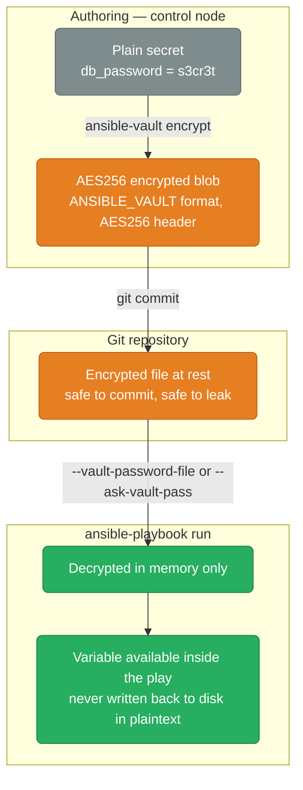
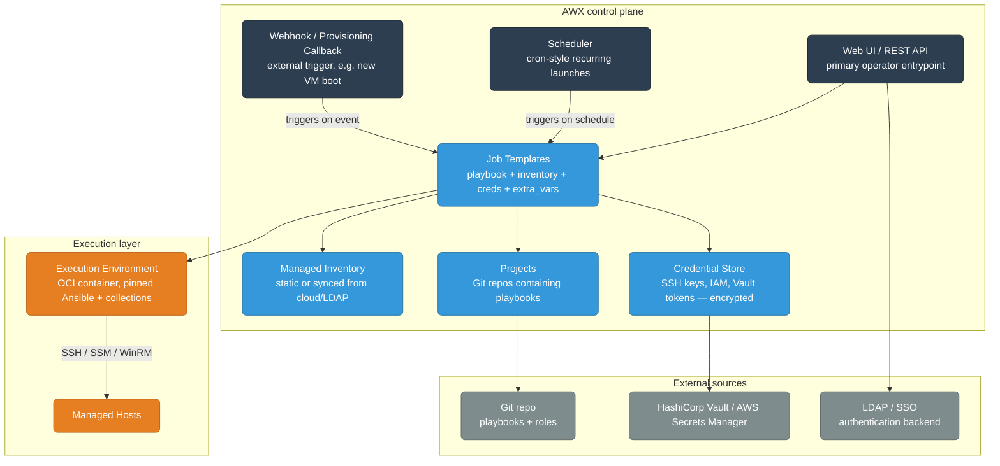
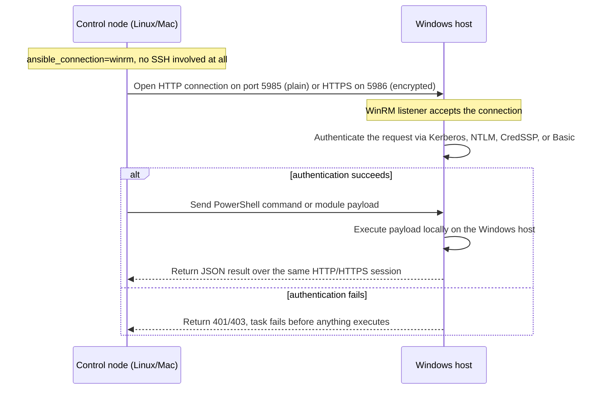

# Ansible Advanced

Roles, collections, Ansible Vault, AWX/Tower, performance tuning, and testing strategies.

<div class="quiz-progress" data-quiz-progress>
  <span class="quiz-progress-label">0/0 checks</span>
  <span class="quiz-progress-bar"><span class="quiz-progress-fill"></span></span>
</div>

---

## Roles

A role is a reusable, self-contained unit of automation. Instead of one giant playbook, you split work into roles and compose them.

### Role Directory Structure

```
roles/
└── nginx/
    ├── defaults/
    │   └── main.yml        # lowest precedence variables (overridable)
    ├── vars/
    │   └── main.yml        # higher precedence variables (rarely overridden)
    ├── tasks/
    │   ├── main.yml        # entry point — import other task files here
    │   ├── install.yml
    │   └── configure.yml
    ├── handlers/
    │   └── main.yml        # handlers for this role
    ├── templates/
    │   └── nginx.conf.j2   # Jinja2 templates
    ├── files/
    │   └── index.html      # static files
    ├── meta/
    │   └── main.yml        # role metadata + dependencies
    └── README.md
```

### Role: defaults/main.yml

```yaml
# roles/nginx/defaults/main.yml
nginx_user: www-data
nginx_worker_processes: "{{ ansible_processor_count }}"
nginx_worker_connections: 1024
nginx_port: 80
ssl_enabled: false
ssl_cert_path: /etc/ssl/certs/nginx.crt
ssl_key_path: /etc/ssl/private/nginx.key
```

### Role: tasks/main.yml

```yaml
# roles/nginx/tasks/main.yml
---
- name: Include OS-specific variables
  ansible.builtin.include_vars: "{{ ansible_os_family | lower }}.yml"

- name: Install nginx
  ansible.builtin.import_tasks: install.yml

- name: Configure nginx
  ansible.builtin.import_tasks: configure.yml

- name: Start nginx
  ansible.builtin.service:
    name: nginx
    state: started
    enabled: true
```

### Role: tasks/configure.yml

```yaml
# roles/nginx/tasks/configure.yml
---
- name: Create nginx config directory
  ansible.builtin.file:
    path: /etc/nginx/conf.d
    state: directory
    mode: "0755"

- name: Deploy main nginx config
  ansible.builtin.template:
    src: nginx.conf.j2
    dest: /etc/nginx/nginx.conf
    owner: root
    mode: "0644"
    validate: nginx -t -c %s      # validate before replacing
  notify: Reload nginx

- name: Deploy site configs
  ansible.builtin.template:
    src: "site.conf.j2"
    dest: "/etc/nginx/conf.d/{{ item.name }}.conf"
    mode: "0644"
  loop: "{{ nginx_vhosts }}"
  notify: Reload nginx
  when: nginx_vhosts is defined
```

### Role: meta/main.yml

```yaml
# roles/nginx/meta/main.yml
galaxy_info:
  author: yourname
  description: Install and configure nginx
  license: MIT
  min_ansible_version: "2.14"
  platforms:
    - name: Ubuntu
      versions: ["22.04", "20.04"]
    - name: EL
      versions: ["8", "9"]

dependencies:
  - role: common            # runs before this role
  - role: ssl_certs
    vars:
      domain: "{{ app_domain }}"
    when: ssl_enabled
```

### Using Roles in a Playbook

```yaml
# site.yml
---
- name: Configure web servers
  hosts: web
  become: true

  roles:
    - common                    # simple role reference
    - role: nginx               # explicit form
      vars:
        nginx_port: 443
        ssl_enabled: true
    - role: myapp
      tags: app                 # all tasks in role get this tag

  # roles run before tasks
  tasks:
    - name: Final smoke test
      ansible.builtin.uri:
        url: "http://localhost/health"
```

### Creating a Role with ansible-galaxy

```bash
ansible-galaxy role init roles/nginx
ansible-galaxy role init roles/myapp --offline
```

<div class="quiz-card">
  <p class="quiz-q">In the <code>site.yml</code> example above, <code>roles:</code> is listed before <code>tasks:</code> in the play. If a play instead listed <code>tasks:</code> first in the YAML file and <code>roles:</code> second, would the tasks run before the roles?</p>
  <button class="quiz-reveal">Reveal answer</button>
  <div class="quiz-a" hidden>
    No. Regardless of the order the two blocks appear in the YAML, Ansible
    always runs every role listed under <code>roles:</code> to completion
    before running any task listed under a play's own <code>tasks:</code>
    section. Ordering within <code>roles:</code> and within <code>tasks:</code>
    matters; the relative position of the two block <em>keys</em> in the file
    does not.
  </div>
</div>

---

## Collections

Collections are the packaging format for distributing roles, modules, plugins, and playbooks together. Introduced in Ansible 2.9.

```
namespace.collection_name
amazon.aws         # AWS modules (official)
google.cloud       # GCP modules (official)
community.general  # hundreds of community modules
ansible.posix      # POSIX-focused modules (mount, sysctl, etc.)
```

### Installing Collections

```bash
# From Ansible Galaxy
ansible-galaxy collection install amazon.aws
ansible-galaxy collection install community.general

# Pin version
ansible-galaxy collection install amazon.aws:==7.0.0

# From requirements file
ansible-galaxy collection install -r requirements.yml
```

```yaml
# requirements.yml
collections:
  - name: amazon.aws
    version: ">=7.0.0"
  - name: google.cloud
    version: ">=1.3.0"
  - name: community.general
  - name: ansible.posix

roles:
  - name: geerlingguy.nginx
    version: "3.1.0"
```

```bash
# Install all requirements
ansible-galaxy install -r requirements.yml
ansible-galaxy collection install -r requirements.yml
```

### Using Collection Modules

```yaml
# FQCN (Fully Qualified Collection Name) — always preferred
- amazon.aws.ec2_instance:
    name: web01

# Short name (only works if collection is in ansible.cfg)
- ec2_instance:
    name: web01
```

```ini
# ansible.cfg — set collection search path
[defaults]
collections_paths = ./collections:~/.ansible/collections
```

<div class="quiz-card">
  <p class="quiz-q">Why does <code>amazon.aws.ec2_instance</code> (FQCN) get recommended over the short name <code>ec2_instance</code>, when both run the exact same module?</p>
  <button class="quiz-reveal">Reveal answer</button>
  <div class="quiz-a" hidden>
    The short name only resolves if the collection happens to be discoverable
    via <code>collections_paths</code> in <code>ansible.cfg</code> — move the
    playbook to a different project, or have two collections ship a module
    with the same short name, and it silently resolves to the wrong one (or
    fails to resolve at all). The FQCN pins the exact namespace and
    collection, so the playbook behaves identically no matter which machine
    or CI runner executes it.
  </div>
</div>

---

## Ansible Vault

Vault encrypts sensitive data at rest. Encrypted files live in your repo — secrets never travel in plaintext.



### Encrypting Files

```bash
# Encrypt an entire file
ansible-vault encrypt group_vars/all/vault.yml

# Create new encrypted file
ansible-vault create group_vars/production/vault.yml

# Edit encrypted file (opens $EDITOR)
ansible-vault edit group_vars/production/vault.yml

# View without decrypting to disk
ansible-vault view group_vars/production/vault.yml

# Re-key (change password)
ansible-vault rekey group_vars/production/vault.yml

# Decrypt to plain text
ansible-vault decrypt group_vars/production/vault.yml
```

### Encrypting Individual Values (inline)

```bash
# Encrypt a single string
ansible-vault encrypt_string 's3cr3tpassword' --name 'db_password'

# Output — paste into vars file
db_password: !vault |
  $ANSIBLE_VAULT;1.1;AES256
  3036343832353065363465383834306462623035313630363261353666323766313865313164626233
  ...
```

```yaml
# group_vars/production/vault.yml
vault_db_password: !vault |
  $ANSIBLE_VAULT;1.1;AES256
  303634383235306536346538383430...

# group_vars/production/vars.yml (plain — references vault var)
db_password: "{{ vault_db_password }}"
```

### Running Playbooks with Vault

```bash
# Interactive password prompt
ansible-playbook site.yml --ask-vault-pass

# Password from file (CI/CD)
ansible-playbook site.yml --vault-password-file ~/.vault_pass

# Password from environment variable
export ANSIBLE_VAULT_PASSWORD_FILE=~/.vault_pass
ansible-playbook site.yml

# Multiple vault IDs (different passwords for different environments)
ansible-playbook site.yml \
  --vault-id dev@~/.vault_dev \
  --vault-id prod@~/.vault_prod
```

### Multiple Vault IDs

```bash
# Encrypt with a specific vault ID label
ansible-vault encrypt_string 's3cr3t' \
  --vault-id prod@~/.vault_prod \
  --name db_password

# The encrypted value is tagged with vault ID
db_password: !vault |
  $ANSIBLE_VAULT;1.2;AES256;prod
  ...
```

### Vault Best Practices

```
group_vars/
├── all/
│   └── vars.yml           # plain variables
├── production/
│   ├── vars.yml           # plain — references vault_ prefixed vars
│   └── vault.yml          # encrypted — contains vault_ prefixed vars
└── staging/
    ├── vars.yml
    └── vault.yml
```

Convention: prefix all vault variables with `vault_`, reference them from plain vars files. This way you can view `vars.yml` without decrypting anything.

<div class="quiz-card">
  <p class="quiz-q">Why prefix vault variables with <code>vault_</code> and reference them from a separate plain <code>vars.yml</code>, instead of just encrypting the whole <code>vars.yml</code> file directly?</p>
  <button class="quiz-reveal">Reveal answer</button>
  <div class="quiz-a" hidden>
    Encrypting the entire vars file hides even the non-secret variable
    <em>names</em> and structure from anyone browsing the repo — a reviewer
    can't tell what variables exist without a vault password. Splitting into
    a plain <code>vars.yml</code> (which just references
    <code>vault_</code>-prefixed names) and an encrypted
    <code>vault.yml</code> (which holds the actual secret values) means the
    variable names, structure, and diffs stay reviewable in plaintext, while
    only the sensitive values themselves ever need decrypting.
  </div>
</div>

---

## AWX / Ansible Tower

AWX is the open-source version of Red Hat Ansible Automation Platform (AAP/Tower). It provides a web UI, REST API, RBAC, schedules, and centralized credentials for Ansible.



### Key AWX Concepts

| Concept | Description |
|---------|-------------|
| Organization | Top-level tenant. Users, teams, inventories scoped per org |
| Project | A Git repository containing playbooks |
| Inventory | Static or dynamic inventory (synced from cloud/LDAP) |
| Credential | SSH key, AWS IAM, Vault token — stored encrypted |
| Job Template | Playbook + inventory + credential + extra_vars |
| Workflow | DAG of job templates with conditional branches |
| Execution Environment | OCI container image with Ansible + dependencies |
| Notification | Slack/email/webhook on job success/failure |

### AWX via kubectl (K8s install)

```bash
# Install AWX Operator
kubectl apply -k github.com/ansible/awx-operator/config/default?ref=2.x.x

# Create AWX instance
cat <<EOF | kubectl apply -f -
apiVersion: awx.ansible.com/v1beta1
kind: AWX
metadata:
  name: awx
spec:
  service_type: ClusterIP
  ingress_type: ingress
  hostname: awx.example.com
EOF

# Get admin password
kubectl get secret awx-admin-password -o jsonpath='{.data.password}' | base64 -d
```

### Execution Environments (EE)

EEs replaced the old Python venv approach. A job always runs in a container with pinned Ansible + collections + Python deps.

```yaml
# execution-environment.yml
version: 3
images:
  base_image:
    name: registry.redhat.io/ansible-automation-platform/ee-minimal-rhel8:latest

dependencies:
  galaxy:
    collections:
      - name: amazon.aws
        version: ">=7.0.0"
      - name: community.general
  python:
    - boto3>=1.28
    - botocore>=1.31
  system:
    - git [platform:rpm]

build_arg_defaults:
  EE_BASE_IMAGE: quay.io/ansible/awx-ee:latest
```

```bash
# Build EE image
pip install ansible-builder
ansible-builder build -t my-ee:1.0 -f execution-environment.yml
docker push my-registry/my-ee:1.0
```

<div class="quiz-card">
  <p class="quiz-q">What replaced the old Python-venv approach for running Ansible jobs in AWX, and what specific problem does it solve?</p>
  <button class="quiz-reveal">Reveal answer</button>
  <div class="quiz-a" hidden>
    The Execution Environment (EE) — an OCI container image with a pinned
    version of Ansible, its Python dependencies, and its collections all
    baked in. A venv on the AWX host still shared the host's system Python
    and OS packages, so two projects needing different Ansible or collection
    versions could conflict. An EE isolates every job in its own container
    image, so each project can pin exactly the Ansible/collection/Python
    versions it needs without fighting any other project on the same
    controller.
  </div>
</div>

---

## Performance Tuning

### forks and Pipelining

`forks` and pipelining tune two completely different axes of the same problem — how many hosts run at once, versus how many SSH round trips each host needs per task. They're independent knobs and, in practice, you want both turned up together rather than picking one.

<div class="tab-group">
  <div class="tab-buttons">
    <button data-tab="forks-only" class="active">forks only</button>
    <button data-tab="pipelining-only">pipelining only</button>
    <button data-tab="both">both (recommended)</button>
  </div>
  <div class="tab-panels">
    <div class="tab-panel active" data-tab-panel="forks-only">
      <p>Increases how many hosts Ansible connects to and runs a task on
      <strong>simultaneously</strong> — the batch width, not the speed of any
      single host. Default is <code>5</code>, which is painfully small once a
      fleet grows past a couple dozen hosts.</p>
      <pre><code class="language-ini"># ansible.cfg
[defaults]
forks = 50    # default is 5 — increase dramatically for large fleets</code></pre>
      <pre><code class="language-bash"># Override at runtime
ansible-playbook site.yml -f 50</code></pre>
      <p>Good for: wide fleets where each individual host's per-task round
      trip is already fast. Doesn't help if every host is slow because of
      the repeated SCP-upload-then-execute pattern — that's pipelining's job,
      not this one.</p>
    </div>
    <div class="tab-panel" data-tab-panel="pipelining-only">
      <p>Cuts the per-task overhead on <strong>each</strong> host. Without
      pipelining, Ansible SCP-uploads the module to the remote host, then
      runs it — two separate SSH round trips per task. With pipelining, the
      module is sent over stdin of a single SSH session — one round trip.
      Roughly a 3–5x speedup for playbooks with many small tasks, but it
      doesn't change how many hosts run in parallel.</p>
      <pre><code class="language-ini">[ssh_connection]
pipelining = True    # ~3-5x faster for many tasks</code></pre>
      <p><strong>Requires:</strong> <code>requiretty</code> must be disabled
      in <code>/etc/sudoers</code> (or use <code>Defaults !requiretty</code>)
      — sudo refuses to run a piped-in command if it insists on an
      interactive tty.</p>
    </div>
    <div class="tab-panel" data-tab-panel="both">
      <p>Since forks controls fleet width and pipelining controls per-host
      round trips, they compound rather than compete: <code>forks = 50</code>
      for parallelism, <code>pipelining = True</code> for per-task speed.
      Layer SSH <code>ControlPersist</code> (below) and fact caching on top
      and a run against hundreds of hosts goes from "roughly one SSH exec per
      task, serialized across batches of 5 hosts at a time" to "50 hosts
      running at once, one round trip per task, one TCP connection reused
      for the whole play."</p>
      <pre><code class="language-ini"># ansible.cfg
[defaults]
forks = 50

[ssh_connection]
pipelining = True</code></pre>
      <p>There's no tradeoff to weigh here — unlike some tuning knobs, these
      two don't conflict or compete for the same resource, so the "both"
      configuration is the default recommendation for any fleet past a
      handful of hosts.</p>
    </div>
  </div>
</div>

<div class="quiz-card">
  <p class="quiz-q">You set <code>pipelining = True</code> but every task under <code>become: true</code> now fails. Increasing <code>forks</code> at the same time doesn't fix it. What's the likely missing piece?</p>
  <button class="quiz-reveal">Reveal answer</button>
  <div class="quiz-a" hidden>
    <code>requiretty</code> is still enabled in <code>/etc/sudoers</code> on
    the managed hosts. Pipelining sends the module over stdin instead of
    opening a real interactive shell, and sudo's <code>requiretty</code>
    setting refuses to elevate privileges without a tty — so every
    <code>become</code> task fails specifically because of the pipelining
    change, not the fork count. Disable it with <code>Defaults !requiretty</code>
    (or remove the <code>requiretty</code> line entirely) before turning
    pipelining on for privileged tasks.
  </div>
</div>

### SSH ControlMaster (Persistent Connections)

```ini
[ssh_connection]
ssh_args = -o ControlMaster=auto -o ControlPath=/tmp/ansible-ssh-%h-%p-%r -o ControlPersist=60s
```

Reuses the SSH connection for all tasks on a host within 60 seconds instead of opening a new TCP connection per task.

### Fact Caching

Gathering facts adds ~0.5-2s per host. Cache them to skip on subsequent runs.

```ini
[defaults]
gathering          = smart          # skip if cached, gather if not
fact_caching       = jsonfile
fact_caching_connection = /tmp/ansible_facts_cache
fact_caching_timeout = 86400        # 24 hours in seconds
```

```ini
# Redis cache (better for distributed teams)
fact_caching       = redis
fact_caching_connection = localhost:6379:0
fact_caching_timeout = 86400
```

### Async Tasks

Run slow tasks in the background, poll for completion:

```yaml
- name: Long-running backup (don't block)
  ansible.builtin.command: /usr/local/bin/backup.sh
  async: 3600          # max time to wait (seconds)
  poll: 0              # 0 = fire and forget, check later
  register: backup_job

# ... other tasks run here in parallel ...

- name: Wait for backup to complete
  ansible.builtin.async_status:
    jid: "{{ backup_job.ansible_job_id }}"
  register: backup_result
  until: backup_result.finished
  retries: 60
  delay: 30
```

### Strategy Plugins

```yaml
- hosts: web
  strategy: free          # each host runs independently, don't wait for others
  # strategy: linear     # default — all hosts complete task N before task N+1
  # strategy: host_pinned # like free but respects serial
```

### Rolling Updates with serial

```yaml
- hosts: web
  serial: "25%"         # update 25% of fleet at a time
  # serial: 2           # 2 hosts at a time
  # serial: [1, 5, 10]  # canary: 1, then 5, then 10 at a time
  max_fail_percentage: 10
```

---

## Testing Ansible

### Molecule — Unit/Integration Testing for Roles

```bash
pip install molecule molecule-docker
cd roles/nginx
molecule init scenario --driver-name docker
```

```yaml
# molecule/default/molecule.yml
driver:
  name: docker
platforms:
  - name: ubuntu22
    image: geerlingguy/docker-ubuntu2204-ansible
    pre_build_image: true
  - name: centos9
    image: geerlingguy/docker-centos9-ansible
    pre_build_image: true

provisioner:
  name: ansible
  inventory:
    host_vars:
      ubuntu22:
        nginx_port: 80
      centos9:
        nginx_port: 8080

verifier:
  name: ansible
```

```yaml
# molecule/default/converge.yml
---
- name: Converge
  hosts: all
  become: true
  roles:
    - role: nginx
```

```yaml
# molecule/default/verify.yml
---
- name: Verify
  hosts: all
  tasks:
    - name: Check nginx is running
      ansible.builtin.service_facts:

    - name: Assert nginx is active
      ansible.builtin.assert:
        that:
          - ansible_facts.services['nginx.service'].state == 'running'
          - ansible_facts.services['nginx.service'].status == 'enabled'

    - name: Check nginx responds
      ansible.builtin.uri:
        url: "http://localhost:{{ nginx_port }}/"
        status_code: 200
```

`molecule test` drives all four lifecycle stages in order, end to end:

<div class="stepper">
  <div class="stepper-panels">
    <div class="stepper-panel active">
      <strong>1. Create.</strong> The driver (Docker here) spins up the test
      instances defined under <code>platforms</code> in
      <code>molecule.yml</code> — <code>ubuntu22</code> and
      <code>centos9</code> in the example above, each from a pre-built image.
      Nothing role-specific has run yet; these are just bare containers.
    </div>
    <div class="stepper-panel">
      <strong>2. Converge.</strong> Molecule runs
      <code>converge.yml</code> against every created instance, applying the
      role under test exactly like a real playbook run — same modules, same
      idempotency expectations, same <code>host_vars</code> overrides (e.g.
      <code>nginx_port: 8080</code> on <code>centos9</code>).
    </div>
    <div class="stepper-panel">
      <strong>3. Verify.</strong> Molecule runs <code>verify.yml</code>,
      which makes assertions about the <em>outcome</em> of convergence rather
      than re-running the role — checking that the service is active and
      enabled, and that it actually answers on the expected port.
    </div>
    <div class="stepper-panel">
      <strong>4. Destroy.</strong> The test instances are torn down
      unconditionally, success or failure, so the next run always starts
      from a clean, known state instead of inheriting leftover state from a
      previous test.
    </div>
  </div>
  <div class="stepper-controls">
    <button class="stepper-prev">← Prev</button>
    <span class="stepper-dots"></span>
    <span class="stepper-label"></span>
    <button class="stepper-next">Next →</button>
  </div>
</div>

```bash
# Full test cycle
molecule test            # create → converge → verify → destroy
molecule converge        # only provision (for iterative dev)
molecule verify          # only run verifier
molecule login           # SSH into test container
molecule destroy         # tear down
```

<div class="quiz-card">
  <p class="quiz-q">You're iterating on a role, making a small change and re-testing repeatedly. Running the full <code>molecule test</code> after every single change works but feels slow. What should you run instead, and why?</p>
  <button class="quiz-reveal">Reveal answer</button>
  <div class="quiz-a" hidden>
    <code>molecule converge</code> on its own. <code>molecule test</code>
    always runs the full create → converge → verify → destroy cycle,
    including tearing down and recreating the containers from scratch every
    time. <code>molecule converge</code> re-applies the role against the
    <em>already-running</em> test instances — no destroy, no recreate — so
    the inner dev loop is dramatically faster. Save the full
    <code>molecule test</code> for CI or a final check before committing.
  </div>
</div>

### ansible-lint

```bash
pip install ansible-lint

# Lint playbook
ansible-lint site.yml

# Lint all YAML in project
ansible-lint

# With config
cat .ansible-lint
warn_list:
  - no-changed-when
  - command-instead-of-shell
skip_list:
  - yaml[line-length]
```

### --check and --diff

```bash
# Dry run — show what would change, don't apply
ansible-playbook site.yml --check

# Show diffs for file changes
ansible-playbook site.yml --check --diff

# Both together (most useful for reviewing before apply)
ansible-playbook site.yml --check --diff -v
```

---

## Directory Layout — Production Project

```
project/
├── ansible.cfg
├── requirements.yml             # collections + roles
├── site.yml                     # master playbook (imports others)
├── webservers.yml               # play for web tier
├── dbservers.yml                # play for db tier
│
├── inventories/
│   ├── production/
│   │   ├── hosts.yml            # static inventory or dynamic plugin config
│   │   ├── group_vars/
│   │   │   ├── all/
│   │   │   │   ├── vars.yml
│   │   │   │   └── vault.yml    # encrypted
│   │   │   └── web/
│   │   │       └── vars.yml
│   │   └── host_vars/
│   │       └── web01.example.com.yml
│   └── staging/
│       └── ...
│
├── roles/
│   ├── common/
│   ├── nginx/
│   └── myapp/
│
├── collections/                 # vendored collections (for air-gapped)
│   └── ansible_collections/
│
└── molecule/                    # integration tests (or per-role)
```

---

## Debugging Playbooks

```bash
# Increase verbosity
ansible-playbook site.yml -v      # task results
ansible-playbook site.yml -vv     # file diffs + module args
ansible-playbook site.yml -vvv    # connection details
ansible-playbook site.yml -vvvv   # SSH debug output

# Run specific tasks by tag
ansible-playbook site.yml --tags "nginx,ssl"
ansible-playbook site.yml --skip-tags "slow_task"

# Run from a specific task
ansible-playbook site.yml --start-at-task "Deploy app config"

# Step through interactively
ansible-playbook site.yml --step

# Debug module — print variables
- ansible.builtin.debug:
    var: my_variable

- ansible.builtin.debug:
    msg: "Value is {{ my_variable }}, type is {{ my_variable | type_debug }}"

# Pause and inspect
- ansible.builtin.pause:
    prompt: "Check the state, press Enter to continue"

# Print all variables for a host
- ansible.builtin.debug:
    var: hostvars[inventory_hostname]
```

---

## Common Patterns

### Conditional Role Include

```yaml
roles:
  - role: monitoring
    when: monitoring_enabled | default(true) | bool
```

### Environment-Specific Variables

```bash
# Override for specific environment
ansible-playbook site.yml \
  -i inventories/production/ \
  -e "@overrides/production.yml" \
  --vault-password-file ~/.vault_prod
```

### Idempotency Guard — Run Once

```yaml
- name: Initialize database schema
  ansible.builtin.command: /opt/app/bin/db-migrate.sh
  args:
    creates: /var/lib/app/.db_initialized   # file acts as lock
  run_once: true
  delegate_to: "{{ groups['db'][0] }}"
```

### Wait for Service to be Ready

```yaml
- name: Wait for app port to open
  ansible.builtin.wait_for:
    host: "{{ ansible_host }}"
    port: 8080
    delay: 5
    timeout: 120
    state: started
```

<div class="quiz-card">
  <p class="quiz-q">In the "Idempotency Guard" pattern above, the task has both <code>run_once: true</code> and <code>delegate_to: "{{ groups['db'][0] }}"</code>. If <code>delegate_to</code> were removed but <code>run_once: true</code> stayed, what would actually happen?</p>
  <button class="quiz-reveal">Reveal answer</button>
  <div class="quiz-a" hidden>
    The migration would still run exactly once for the whole play — but on
    whichever host happens to be first in the current batch, which isn't
    necessarily a database host at all, and isn't guaranteed to stay
    consistent as the inventory changes. <code>run_once</code> only limits
    <em>how many times</em> a task executes across the play; it says nothing
    about <em>which</em> host it executes on. <code>delegate_to</code> is
    what pins it to a specific, deliberate target — here, the first member of
    the <code>db</code> group — instead of an arbitrary one.
  </div>
</div>

---

## Windows Support (WinRM)

Ansible manages Windows hosts via WinRM (Windows Remote Management), not SSH.



### Setup on Windows host (run as Administrator)

```powershell
# Enable WinRM and configure for Ansible
$url = "https://raw.githubusercontent.com/ansible/ansible/devel/examples/scripts/ConfigureRemotingForAnsible.ps1"
$file = "$env:temp\ConfigureRemotingForAnsible.ps1"
(New-Object -TypeName System.Net.WebClient).DownloadFile($url, $file)
powershell.exe -ExecutionPolicy ByPass -File $file
```

### Inventory for Windows

```ini
[windows]
win-server-01.example.com
win-server-02.example.com

[windows:vars]
ansible_user=Administrator
ansible_password="{{ vault_win_password }}"
ansible_connection=winrm
ansible_winrm_transport=ntlm         # or kerberos, credssp, basic
ansible_winrm_server_cert_validation=ignore
ansible_port=5986
```

### Windows modules

```yaml
# Install Windows feature
- ansible.windows.win_feature:
    name: Web-Server                  # IIS
    state: present
    include_management_tools: true

# Manage Windows service
- ansible.windows.win_service:
    name: W3SVC
    state: started
    start_mode: auto

# Copy file
- ansible.windows.win_copy:
    src: files/app.exe
    dest: C:\Apps\app.exe

# Run command
- ansible.windows.win_command:
    cmd: C:\Apps\setup.exe /quiet

# PowerShell script
- ansible.windows.win_shell: |
    Get-Service | Where-Object {$_.Status -eq 'Stopped'}

# Registry
- ansible.windows.win_regedit:
    path: HKLM:\SOFTWARE\MyApp
    name: Version
    data: "2.0"
    type: string

# Chocolatey package manager
- chocolatey.chocolatey.win_chocolatey:
    name: googlechrome
    state: present
```

```bash
pip install pywinrm           # required on control node
ansible-galaxy collection install ansible.windows
ansible-galaxy collection install chocolatey.chocolatey
```

<div class="quiz-card">
  <p class="quiz-q">Someone tries to manage a Windows host by just pointing regular SSH-based inventory vars at it (default connection settings, port 22). Why does this fail even if the host is reachable on the network?</p>
  <button class="quiz-reveal">Reveal answer</button>
  <div class="quiz-a" hidden>
    Ansible talks to Windows over WinRM — HTTP on port 5985 or HTTPS on port
    5986 — not SSH. Nothing is listening for an SSH handshake on a default
    Windows host, and even if it were, Ansible's default connection plugin
    doesn't know how to speak WinRM's authentication (Kerberos/NTLM/CredSSP/
    Basic) unless <code>ansible_connection=winrm</code> and the matching
    <code>ansible_winrm_transport</code> and <code>ansible_port</code> are
    set explicitly in the inventory. Windows hosts need their own dedicated
    inventory group with these vars — they can't just inherit the SSH
    defaults used for Linux hosts.
  </div>
</div>

---

## Lookup Plugins

Lookups pull data from external sources into variables at playbook parse time (on the control node, not the remote).

```yaml
# Read a file
vars:
  ssh_pub_key: "{{ lookup('file', '~/.ssh/id_rsa.pub') }}"

# Environment variable
  home_dir: "{{ lookup('env', 'HOME') }}"

# AWS SSM Parameter Store
  db_pass: "{{ lookup('amazon.aws.aws_ssm', '/prod/db/password', region='us-east-1') }}"

# HashiCorp Vault
  secret: "{{ lookup('community.hashi_vault.hashi_vault', 'secret/data/myapp token=s.xxxx') }}"

# Read lines from a file as a list
  server_list: "{{ lookup('file', 'servers.txt').splitlines() }}"

# URL (fetch remote content)
  latest_version: "{{ lookup('url', 'https://api.github.com/repos/org/repo/releases/latest') | from_json | json_query('tag_name') }}"

# Pipe (run command on control node)
  git_hash: "{{ lookup('pipe', 'git rev-parse --short HEAD') }}"

# CSV file
  # data/users.csv: name,uid,group
  user_info: "{{ lookup('csvfile', 'alice file=data/users.csv delimiter=, col=1') }}"
```

### query() vs lookup()

`lookup()` returns a comma-joined string for multi-value results.  
`query()` always returns a list — preferred with `loop`:

```yaml
- name: Loop over all matching files
  ansible.builtin.debug:
    msg: "{{ item }}"
  loop: "{{ query('fileglob', '/etc/ssl/certs/*.crt') }}"
```

<div class="quiz-card">
  <p class="quiz-q"><code>lookup('file', '~/.ssh/id_rsa.pub')</code> reads a path from the filesystem. Which filesystem — the control node's, or the managed remote host's?</p>
  <button class="quiz-reveal">Reveal answer</button>
  <div class="quiz-a" hidden>
    The control node's. Lookups run at playbook <em>parse time</em>, before
    any connection to a managed host is even opened — so
    <code>~/.ssh/id_rsa.pub</code> has to exist on the machine running
    <code>ansible-playbook</code>, not on the target server. This is also
    why <code>lookup('pipe', 'git rev-parse --short HEAD')</code> runs
    <code>git</code> locally on the control node, and why a lookup can't be
    used to read a file that only exists on a remote host — that needs the
    <code>slurp</code> module instead, which actually executes on the
    managed node.
  </div>
</div>

---

## Advanced Filters and Tests

### selectattr / rejectattr — filter list of dicts

```yaml
vars:
  users:
    - { name: alice, active: true,  role: admin }
    - { name: bob,   active: false, role: user }
    - { name: carol, active: true,  role: user }

tasks:
  - name: Only active users
    debug:
      var: users | selectattr('active') | list
    # → [alice, carol]

  - name: Active admins only
    debug:
      var: users | selectattr('active') | selectattr('role', 'equalto', 'admin') | list
    # → [alice]

  - name: Inactive users
    debug:
      var: users | rejectattr('active') | list
    # → [bob]
```

### map — extract attribute from list

```yaml
  - name: List of usernames only
    debug:
      var: users | map(attribute='name') | list
    # → ['alice', 'bob', 'carol']

  - name: List of names uppercased
    debug:
      var: users | map(attribute='name') | map('upper') | list
```

### Tests — use with `is`

```yaml
when: my_var is defined
when: my_var is not defined
when: my_var is none
when: my_path is file
when: my_path is directory
when: my_string is match('^web.*')     # regex match from start
when: my_string is search('prod')      # regex search anywhere
when: my_var is number
when: my_list is iterable
when: 'admin' in my_roles_list
```

### Other useful filters

```yaml
# Combine dicts (right takes precedence)
"{{ defaults | combine(overrides, recursive=True) }}"

# Extract keys from list of dicts
"{{ items | map(attribute='id') | list }}"

# Flatten nested list
"{{ [[1,2],[3,[4,5]]] | flatten }}"
"{{ [[1,2],[3,[4,5]]] | flatten(levels=1) }}"

# Zip two lists
"{{ ['a','b'] | zip(['x','y']) | list }}"  # → [['a','x'],['b','y']]

# Product (cartesian)
"{{ regions | product(instance_types) | list }}"

# Unique
"{{ my_list | unique | sort }}"

# Random item from list
"{{ my_list | random }}"

# Format strings
"{{ '%s-%s' | format(env, region) }}"

# to_yaml / to_json — for debug or writing config files
"{{ my_dict | to_nice_yaml }}"
"{{ my_dict | to_nice_json }}"

# from_yaml / from_json — parse strings
"{{ raw_yaml_string | from_yaml }}"
```

---

## Custom Modules

When no built-in module fits, write your own in Python. Modules run on the managed node.

### Minimal module structure

```python
# library/my_module.py
from ansible.module_utils.basic import AnsibleModule

def run_module():
    argument_spec = dict(
        name=dict(type='str', required=True),
        state=dict(type='str', default='present', choices=['present', 'absent']),
        value=dict(type='int', required=False, default=0),
    )

    module = AnsibleModule(
        argument_spec=argument_spec,
        supports_check_mode=True,       # implement dry-run
    )

    name  = module.params['name']
    state = module.params['state']

    # Check current state
    current = get_current_state(name)   # your logic here
    changed = False

    if module.check_mode:
        module.exit_json(changed=(current != state), msg="Would change state")

    if state == 'present' and current != 'present':
        do_create(name, module.params['value'])
        changed = True
    elif state == 'absent' and current == 'present':
        do_delete(name)
        changed = True

    module.exit_json(
        changed=changed,
        name=name,
        state=state,
        msg=f"Resource {name} is {state}",
    )

def main():
    run_module()

if __name__ == '__main__':
    main()
```

### Using the custom module

```
project/
├── library/
│   └── my_module.py      # auto-discovered by Ansible
└── playbook.yml
```

```yaml
- name: Use custom module
  my_module:
    name: "myresource"
    state: present
    value: 42
  register: result
```

### Module return values

```python
module.exit_json(changed=False, msg="Already present", data={...})
module.fail_json(msg="Something went wrong", rc=1)
```

`exit_json` → task succeeds. `fail_json` → task fails, play stops (unless `ignore_errors: true`).

<div class="quiz-card">
  <p class="quiz-q">The module above sets <code>supports_check_mode=True</code>. Is that alone enough to make <code>ansible-playbook --check</code> a safe dry run for this module?</p>
  <button class="quiz-reveal">Reveal answer</button>
  <div class="quiz-a" hidden>
    No. <code>supports_check_mode=True</code> only tells Ansible the module
    is <em>capable</em> of behaving correctly in check mode — it doesn't do
    anything by itself. The module's own code still has to check
    <code>module.check_mode</code> and return early via <code>exit_json</code>
    <em>before</em> calling <code>do_create()</code> or <code>do_delete()</code>,
    exactly as this example does. Skip that guard, or put it in the wrong
    place, and <code>--check</code> will happily make real changes on the
    managed node while the operator believes they only previewed a diff.
  </div>
</div>

---

## Tags — Deep Dive

Tags let you run or skip subsets of a playbook without changing the file.

```yaml
- name: Install packages
  ansible.builtin.apt:
    name: nginx
  tags: [install, nginx]

- name: Configure nginx
  ansible.builtin.template:
    src: nginx.conf.j2
    dest: /etc/nginx/nginx.conf
  tags: [configure, nginx]

- name: Always run this
  ansible.builtin.debug:
    msg: "This runs even with --tags"
  tags: always                      # 'always' is a special tag — runs regardless

- name: Never run by default
  ansible.builtin.command: /usr/local/bin/dangerous.sh
  tags: never                       # only runs if explicitly --tags never
```

```bash
# Run only nginx-tagged tasks
ansible-playbook site.yml --tags nginx

# Run install and configure
ansible-playbook site.yml --tags "install,configure"

# Skip slow tasks
ansible-playbook site.yml --skip-tags slow

# List all tags in a playbook
ansible-playbook site.yml --list-tags

# List tasks that would run
ansible-playbook site.yml --tags nginx --list-tasks
```

### Tag inheritance

Tags cascade: role tags apply to all tasks in the role, play tags apply to all tasks in the play.

```yaml
- hosts: web
  tags: web_tier             # all tasks in play inherit this tag
  roles:
    - role: nginx
      tags: nginx            # all tasks in role also get 'nginx' tag
```

<div class="quiz-card">
  <p class="quiz-q">A task is tagged <code>never</code>. What happens when you run <code>ansible-playbook site.yml</code> with no <code>--tags</code> flag at all? What about <code>ansible-playbook site.yml --tags never</code>?</p>
  <button class="quiz-reveal">Reveal answer</button>
  <div class="quiz-a" hidden>
    With no <code>--tags</code> flag, the <code>never</code>-tagged task is
    skipped — that's the entire point of the tag, unlike a normal task which
    runs by default. It only runs if <code>never</code> is explicitly
    requested with <code>--tags never</code> (or the task's other tags are
    explicitly requested). This is the mirror image of <code>always</code>,
    which runs unconditionally regardless of which <code>--tags</code> are
    passed — <code>never</code> requires explicit opt-in, <code>always</code>
    can't be opted out of via tags at all.
  </div>
</div>

---

## Delegation and local_action

Run a task on a different host than the play target. Classic use: register a backend with a load balancer, or run a DB migration once from a specific host.

```yaml
# delegate_to — run task on this host instead of current target
- name: Remove from load balancer before deploy
  ansible.builtin.uri:
    url: "http://lb.internal/api/deregister/{{ inventory_hostname }}"
    method: POST
  delegate_to: lb.internal          # runs on lb.internal, not the web server

# delegate_to localhost — run on control node
- name: Create DNS record in Route53
  amazon.aws.route53:
    zone: example.com
    record: "{{ inventory_hostname }}.example.com"
    type: A
    value: "{{ ansible_host }}"
  delegate_to: localhost
  run_once: true

# local_action — shorthand for delegate_to: localhost
- name: Write deployment log locally
  local_action:
    module: ansible.builtin.lineinfile
    path: /var/log/deployments.log
    line: "{{ inventory_hostname }} deployed at {{ ansible_date_time.iso8601 }}"
```

### delegate_facts

```yaml
- name: Gather facts from DB server, store on web server's vars
  ansible.builtin.setup:
  delegate_to: db01.internal
  delegate_facts: true           # facts stored under hostvars['db01.internal']
```

<div class="quiz-card">
  <p class="quiz-q">In the Route53 example above, the task has <code>delegate_to: localhost</code> — so it runs on the control node. Inside that same task, <code>{{ inventory_hostname }}</code> is used to build the DNS record name. Whose hostname does that variable actually resolve to?</p>
  <button class="quiz-reveal">Reveal answer</button>
  <div class="quiz-a" hidden>
    The original play target — the web server the play is currently looping
    over — not <code>localhost</code>. <code>delegate_to</code> changes only
    <em>where the task executes</em>; it does not change which host's
    variables and facts are in scope for templating inside that task. That's
    exactly why this pattern works: you get to run the API call from the
    control node while still referring to the web server whose DNS record
    you're creating. (Contrast with <code>delegate_facts: true</code> below,
    which is the opposite kind of exception — it changes where gathered
    facts get <em>stored</em>, not where the task runs.)
  </div>
</div>

---

## CI/CD Integration

### GitHub Actions

```yaml
# .github/workflows/deploy.yml
name: Deploy
on:
  push:
    branches: [main]

jobs:
  deploy:
    runs-on: ubuntu-latest
    steps:
      - uses: actions/checkout@v4

      - name: Install Ansible
        run: pip install ansible boto3

      - name: Install collections
        run: ansible-galaxy collection install -r requirements.yml

      - name: Write SSH key
        run: |
          mkdir -p ~/.ssh
          echo "${{ secrets.DEPLOY_KEY }}" > ~/.ssh/deploy.pem
          chmod 600 ~/.ssh/deploy.pem

      - name: Write Vault password
        run: echo "${{ secrets.VAULT_PASS }}" > ~/.vault_pass

      - name: Deploy
        env:
          AWS_ACCESS_KEY_ID:     ${{ secrets.AWS_ACCESS_KEY_ID }}
          AWS_SECRET_ACCESS_KEY: ${{ secrets.AWS_SECRET_ACCESS_KEY }}
        run: |
          ansible-playbook site.yml \
            -i inventory_aws_ec2.yml \
            --vault-password-file ~/.vault_pass \
            -e "env=production"
```

### Jenkins Pipeline

```groovy
// Jenkinsfile
pipeline {
    agent { label 'ansible' }

    environment {
        VAULT_PASS = credentials('ansible-vault-pass')
        AWS_CREDS  = credentials('aws-prod')
    }

    stages {
        stage('Lint') {
            steps {
                sh 'ansible-lint site.yml'
            }
        }
        stage('Check') {
            steps {
                withCredentials([[$class: 'AmazonWebServicesCredentialsBinding', credentialsId: 'aws-prod']]) {
                    sh '''
                        echo "${VAULT_PASS}" > /tmp/.vault_pass
                        ansible-playbook site.yml \
                          -i inventory_aws_ec2.yml \
                          --vault-password-file /tmp/.vault_pass \
                          --check --diff
                    '''
                }
            }
        }
        stage('Deploy') {
            when { branch 'main' }
            steps {
                sh 'ansible-playbook site.yml -i inventory_aws_ec2.yml --vault-password-file /tmp/.vault_pass'
            }
        }
    }
    post {
        always { sh 'rm -f /tmp/.vault_pass' }
    }
}
```

### Running in a container (Execution Environment)

```dockerfile
# Dockerfile for Ansible runner
FROM python:3.11-slim
RUN pip install ansible boto3 botocore pywinrm \
 && ansible-galaxy collection install amazon.aws google.cloud community.general
WORKDIR /ansible
ENTRYPOINT ["ansible-playbook"]
```

```yaml
# GitLab CI
deploy:
  image: my-registry/ansible-runner:latest
  script:
    - ansible-playbook site.yml -i inventory_aws_ec2.yml
  variables:
    ANSIBLE_VAULT_PASSWORD_FILE: /tmp/vault_pass
```

---

## Callback Plugins

Callback plugins hook into Ansible events (task start, result, play end) for custom output or notifications.

### Built-in callbacks

```ini
# ansible.cfg
[defaults]
stdout_callback    = yaml          # prettier output (yaml|json|debug|dense|minimal)
callback_whitelist = timer,profile_tasks,mail
```

| Callback | What it does |
|----------|--------------|
| `timer` | Print total playbook runtime at end |
| `profile_tasks` | Show time each task took |
| `profile_roles` | Show time each role took |
| `mail` | Email on failure |
| `slack` | Post to Slack on play end |
| `json` | Machine-readable JSON output (for CI parsing) |
| `log_plays` | Log all play output to `/var/log/ansible.log` |

### Slack callback

```ini
# ansible.cfg
[defaults]
callback_whitelist = community.general.slack

[callback_slack]
webhook_url = https://hooks.slack.com/services/T.../B.../xxx
channel     = #deployments
username    = ansible-bot
```

### Custom callback plugin

```python
# callback_plugins/my_notify.py
from ansible.plugins.callback import CallbackBase

class CallbackModule(CallbackBase):
    CALLBACK_VERSION = 2.0
    CALLBACK_TYPE    = 'notification'
    CALLBACK_NAME    = 'my_notify'

    def v2_playbook_on_stats(self, stats):
        hosts = sorted(stats.processed.keys())
        for h in hosts:
            s = stats.summarize(h)
            if s['failures'] or s['unreachable']:
                self._post_alert(f"FAILED: {h} — {s}")

    def _post_alert(self, msg):
        import requests
        requests.post(os.environ['ALERT_WEBHOOK'], json={'text': msg})
```

<div class="quiz-card">
  <p class="quiz-q"><code>stdout_callback = yaml</code> and <code>callback_whitelist = timer,profile_tasks,mail</code> are both set in the same <code>ansible.cfg</code>. Do these conflict — is Ansible being told to use two different output formats at once?</p>
  <button class="quiz-reveal">Reveal answer</button>
  <div class="quiz-a" hidden>
    No — they control different things. <code>stdout_callback</code> picks
    the single plugin responsible for the main console output stream (here,
    <code>yaml</code> instead of the default line-by-line format).
    <code>callback_whitelist</code> enables <em>additional</em> callbacks
    that run alongside it — <code>timer</code>, <code>profile_tasks</code>,
    and <code>mail</code> here — which don't replace the stdout formatter,
    they just also hook into the same events (task start, result, play end)
    to print extra summaries or send notifications. Only one plugin can be
    the <code>stdout_callback</code>; any number of whitelisted callbacks can
    run in parallel with it.
  </div>
</div>

---

## `failed_when` and `changed_when`

Control when Ansible considers a task failed or changed — essential for `command`/`shell` tasks which are always `changed`.

```yaml
# command module doesn't know if something changed — mark it explicitly
- name: Check if service config is valid
  ansible.builtin.command: nginx -t
  register: nginx_check
  changed_when: false                         # never marks as changed (read-only)
  failed_when: nginx_check.rc != 0

# Custom failure condition
- name: Run database migration
  ansible.builtin.command: /opt/app/bin/migrate
  register: migrate_result
  changed_when: "'0 migrations applied' not in migrate_result.stdout"
  failed_when:
    - migrate_result.rc != 0
    - "'already up to date' not in migrate_result.stdout"   # not a failure

# Shell with pipe — rc is always 0 from grep when match found
- name: Check process count
  ansible.builtin.shell: ps aux | grep nginx | grep -v grep | wc -l
  register: nginx_procs
  changed_when: false
  failed_when: nginx_procs.stdout | int < 2
```

<div class="quiz-card">
  <p class="quiz-q">The <code>nginx -t</code> task above sets <code>changed_when: false</code> even though it makes no changes to the system at all. Why is this line necessary — wouldn't Ansible figure that out on its own?</p>
  <button class="quiz-reveal">Reveal answer</button>
  <div class="quiz-a" hidden>
    No — the <code>command</code> and <code>shell</code> modules have no
    idea what the command they ran actually did. Unlike modules such as
    <code>ansible.builtin.template</code> or <code>ansible.builtin.service</code>,
    which compare state before and after and report <code>changed</code>
    accurately, <code>command</code>/<code>shell</code> default to reporting
    <code>changed: true</code> on every successful run, purely because they
    executed something. Without <code>changed_when: false</code> here, a
    read-only validation check like <code>nginx -t</code> would show up as a
    "change" on every single playbook run — polluting diffs, breaking
    idempotency reporting, and making <code>--check</code> mode output
    misleading.
  </div>
</div>
