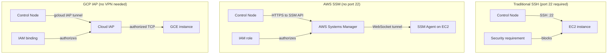
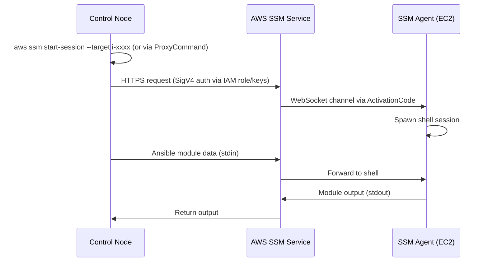
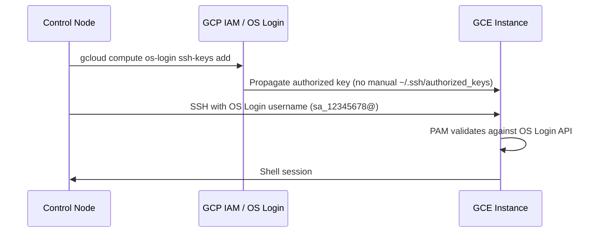
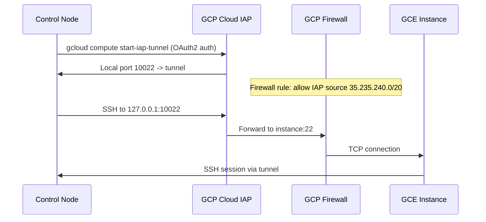
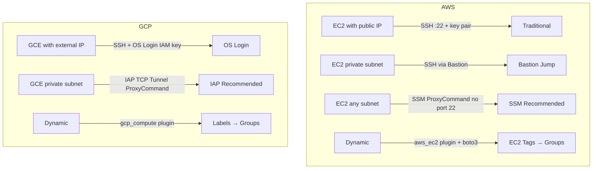

# Ansible Cloud Integration

How Ansible connects to cloud instances without managing SSH keys manually — AWS SSM, EC2 dynamic inventory, GCP OS Login and IAP tunnels.

---

## The Cloud Problem

Cloud VMs are ephemeral. IPs change, instances get replaced, you may have hundreds of nodes across regions. Static inventory breaks. Port 22 may be locked down by security policy.



---

## AWS — Two Approaches

### Approach 1: Traditional SSH via EC2

Use when you have VPN/bastion access to instances.

```ini
# inventory.ini
[web]
10.0.1.10
10.0.1.11

[web:vars]
ansible_user=ec2-user
ansible_ssh_private_key_file=~/.ssh/ec2-key.pem
```

For private subnet instances via bastion:

```ini
# inventory.ini
[web]
10.0.1.10

[web:vars]
ansible_user=ec2-user
ansible_ssh_private_key_file=~/.ssh/app.pem
ansible_ssh_common_args='-o ProxyJump=ec2-user@52.x.x.x -o StrictHostKeyChecking=no -i ~/.ssh/bastion.pem'
```

Or use SSH config (cleaner):

```ini
# ~/.ssh/config
Host bastion
  HostName 52.x.x.x
  User ec2-user
  IdentityFile ~/.ssh/bastion.pem

Host 10.0.*.*
  ProxyJump bastion
  User ec2-user
  IdentityFile ~/.ssh/app.pem
```

```ini
# ansible.cfg
[defaults]
remote_user = ec2-user
```

---

### Approach 2: AWS SSM Session Manager (Recommended for AWS)

No port 22. No security group rule. No SSH key management. Ansible speaks to SSM via HTTPS, SSM tunnels to the agent on the instance.



#### Prerequisites

```bash
# 1. Install AWS CLI and Session Manager plugin on control node
brew install awscli
# Download session manager plugin from AWS docs
# https://docs.aws.amazon.com/systems-manager/latest/userguide/session-manager-working-with-install-plugin.html

# 2. Install boto3 (for dynamic inventory)
pip install boto3 botocore

# 3. EC2 instance needs:
#    - SSM Agent installed (pre-installed on Amazon Linux 2, Ubuntu 20.04+)
#    - IAM instance profile with AmazonSSMManagedInstanceCore policy
#    - Outbound HTTPS to ssm.region.amazonaws.com

# Verify SSM connectivity
aws ssm start-session --target i-0123456789abcdef0
```

#### IAM Policy for EC2 Instance Profile

```json
{
  "Version": "2012-10-17",
  "Statement": [{
    "Effect": "Allow",
    "Action": [
      "ssm:DescribeAssociation",
      "ssm:GetDeployablePatchSnapshotForInstance",
      "ssm:GetDocument",
      "ssm:GetManifest",
      "ssm:GetParameter",
      "ssm:GetParameters",
      "ssm:ListAssociations",
      "ssm:ListInstanceAssociations",
      "ssm:PutInventory",
      "ssm:PutComplianceItems",
      "ssm:PutConfigurePackageResult",
      "ssm:UpdateAssociationStatus",
      "ssm:UpdateInstanceAssociationStatus",
      "ssm:UpdateInstanceInformation",
      "ssmmessages:CreateControlChannel",
      "ssmmessages:CreateDataChannel",
      "ssmmessages:OpenControlChannel",
      "ssmmessages:OpenDataChannel",
      "ec2messages:AcknowledgeMessage",
      "ec2messages:DeleteMessage",
      "ec2messages:FailMessage",
      "ec2messages:GetEndpoint",
      "ec2messages:GetMessages",
      "ec2messages:SendReply"
    ],
    "Resource": "*"
  }]
}
```

#### ansible.cfg for SSM

```ini
[defaults]
inventory          = ./inventory_aws_ec2.yml
remote_user        = ec2-user
host_key_checking  = False

[ssh_connection]
# Route SSH through SSM session
ssh_args = -o StrictHostKeyChecking=no -o UserKnownHostsFile=/dev/null -o ProxyCommand='aws ssm start-session --target %h --document-name AWS-StartSSHSession --parameters portNumber=%p'
```

#### Inventory Using Instance IDs

```ini
# inventory.ini — use EC2 instance IDs as hosts
[web]
i-0123456789abcdef0
i-0987654321fedcba0

[web:vars]
ansible_user=ec2-user
ansible_ssh_common_args='-o StrictHostKeyChecking=no -o ProxyCommand="aws ssm start-session --target %h --document-name AWS-StartSSHSession --parameters portNumber=%p"'
```

---

## AWS Dynamic Inventory

Static inventory breaks at scale. Use the `aws_ec2` plugin to query EC2 automatically.

```yaml
# inventory_aws_ec2.yml
plugin: amazon.aws.aws_ec2
regions:
  - us-east-1
  - us-west-2

# Filter only running instances
filters:
  instance-state-name: running
  tag:Environment: production

# Use private IP (inside VPC) or instance ID (for SSM)
hostnames:
  - ip-address          # private IP for SSH
  # - instance-id       # for SSM, uncomment this

# Group instances by tag
keyed_groups:
  - key: tags.Role
    prefix: role
  - key: tags.Environment
    prefix: env
  - key: placement.region
    prefix: aws_region
  - key: instance_type
    prefix: type

# Add all EC2 tags as host vars
compose:
  ansible_host: private_ip_address
  # For SSM: ansible_host: instance_id

# Group by tag:Name
groups:
  web_servers: "'web' in tags.get('Name', '')"
  db_servers: "'db' in tags.get('Name', '')"
```

```bash
# Test dynamic inventory
ansible-inventory -i inventory_aws_ec2.yml --list
ansible-inventory -i inventory_aws_ec2.yml --graph

# Use it
ansible-playbook -i inventory_aws_ec2.yml site.yml

# Target by tag group
ansible role_web -i inventory_aws_ec2.yml -m ping
```

#### Install Required Collection

```bash
ansible-galaxy collection install amazon.aws
pip install boto3 botocore
```

---

## AWS Cloud Modules

Common modules from `amazon.aws` collection:

```yaml
# EC2 instance management
- amazon.aws.ec2_instance:
    name: "web-server"
    instance_type: t3.medium
    image_id: ami-0abcdef1234567890
    region: us-east-1
    vpc_subnet_id: subnet-abc123
    security_groups:
      - web-sg
    iam_instance_profile: SSMInstanceProfile
    tags:
      Environment: production
      Role: web
    state: running

# Security groups
- amazon.aws.ec2_security_group:
    name: web-sg
    description: Web server security group
    vpc_id: vpc-abc123
    rules:
      - proto: tcp
        from_port: 443
        to_port: 443
        cidr_ip: 0.0.0.0/0
    region: us-east-1

# S3 bucket
- amazon.aws.s3_bucket:
    name: my-app-bucket
    region: us-east-1
    versioning: true
    encryption: AES256

# Upload to S3
- amazon.aws.aws_s3:
    bucket: my-app-bucket
    object: /releases/app-v1.0.jar
    src: /opt/build/app.jar
    mode: put

# RDS instance
- amazon.aws.rds_instance:
    db_instance_identifier: prod-db
    db_instance_class: db.t3.medium
    engine: postgres
    master_username: admin
    master_user_password: "{{ vault_db_password }}"
    allocated_storage: 100
    region: us-east-1

# Get SSM Parameter Store values
- amazon.aws.aws_ssm_parameter_store:
    name: "/myapp/prod/db_password"
    region: us-east-1
  register: db_pass

- ansible.builtin.debug:
    msg: "DB password fetched from SSM Parameter Store"
```

---

## GCP — Two Approaches

### Approach 1: OS Login + Standard SSH

GCP OS Login ties SSH access to IAM. No need to distribute SSH keys — Google manages the public key.



#### Setup

```bash
# 1. Enable OS Login on the VM (or at project level)
gcloud compute instances add-metadata vm-name \
  --metadata enable-oslogin=TRUE

# Or project-wide:
gcloud compute project-info add-metadata \
  --metadata enable-oslogin=TRUE

# 2. Grant IAM role to the user/service account running Ansible
gcloud projects add-iam-policy-binding PROJECT_ID \
  --member="user:devops@example.com" \
  --role="roles/compute.osLogin"

# For admin (sudo) access:
gcloud projects add-iam-policy-binding PROJECT_ID \
  --member="user:devops@example.com" \
  --role="roles/compute.osAdminLogin"

# 3. Add your SSH key to OS Login
gcloud compute os-login ssh-keys add \
  --key-file ~/.ssh/id_rsa.pub

# 4. Get your OS Login username
gcloud compute os-login describe-profile
# Returns: posixAccounts[0].username = sa_12345678
```

```ini
# inventory.ini
[web]
10.0.1.10
10.0.1.11

[web:vars]
ansible_user=sa_12345678        # OS Login username from gcloud
ansible_python_interpreter=/usr/bin/python3
```

---

### Approach 2: GCP IAP TCP Tunneling (Recommended)

Identity-Aware Proxy creates an authenticated TCP tunnel to private VMs — no VPN, no public IP needed.



#### Setup

```bash
# 1. Firewall rule — allow SSH only from IAP source range
gcloud compute firewall-rules create allow-ssh-iap \
  --network=default \
  --direction=INGRESS \
  --action=ALLOW \
  --rules=tcp:22 \
  --source-ranges=35.235.240.0/20    # GCP IAP source IPs

# 2. Grant IAP accessor role
gcloud projects add-iam-policy-binding PROJECT_ID \
  --member="user:devops@example.com" \
  --role="roles/iap.tunnelResourceAccessor"

# 3. Test tunnel manually
gcloud compute start-iap-tunnel INSTANCE_NAME 22 \
  --local-host-port=localhost:10022 \
  --zone=us-central1-a &

ssh -p 10022 -i ~/.ssh/gcp.pem username@localhost
```

#### ansible.cfg for IAP

```ini
[defaults]
remote_user = your_username
private_key_file = ~/.ssh/gcp.pem

[ssh_connection]
# Route all SSH via IAP tunnel using gcloud as ProxyCommand
ssh_args = -o StrictHostKeyChecking=no -o UserKnownHostsFile=/dev/null -o ProxyCommand='gcloud compute start-iap-tunnel %h %p --listen-on-stdin --zone=us-central1-a --quiet'
```

This uses `%h` (hostname) and `%p` (port) so Ansible can connect to any instance by name.

#### Inventory Using Instance Names

```ini
# inventory.ini
[web]
web-instance-1
web-instance-2

[web:vars]
ansible_user=sa_12345678
ansible_ssh_common_args='-o StrictHostKeyChecking=no -o ProxyCommand="gcloud compute start-iap-tunnel %h %p --listen-on-stdin --zone=us-central1-a --quiet"'
```

---

## GCP Dynamic Inventory

```yaml
# inventory_gcp.yml
plugin: google.cloud.gcp_compute
projects:
  - my-project-id
zones:
  - us-central1-a
  - us-central1-b
auth_kind: serviceaccount
service_account_file: /path/to/service-account.json

# Filter by labels
filters:
  - labels.environment = production

# Group by label
keyed_groups:
  - key: labels.role
    prefix: role
  - key: zone
    prefix: zone

# Use IAP name, not IP
hostnames:
  - name

# Set ansible_host for IAP tunneling
compose:
  ansible_host: name                          # instance name for IAP
  # ansible_host: networkInterfaces[0].networkIP  # internal IP for direct SSH
```

```bash
# Install collection
ansible-galaxy collection install google.cloud
pip install requests google-auth

# Test
ansible-inventory -i inventory_gcp.yml --list
ansible-inventory -i inventory_gcp.yml --graph
```

---

## GCP Cloud Modules

```yaml
# GCE instance
- google.cloud.gcp_compute_instance:
    name: web-server
    machine_type: n2-standard-2
    zone: us-central1-a
    project: my-project-id
    auth_kind: serviceaccount
    service_account_file: /path/to/sa.json
    disks:
      - auto_delete: true
        boot: true
        initialize_params:
          source_image: projects/debian-cloud/global/images/family/debian-11
    network_interfaces:
      - network: global/networks/default
    metadata:
      enable-oslogin: "TRUE"
    labels:
      environment: production
      role: web
    state: present

# GCS bucket
- google.cloud.gcp_storage_bucket:
    name: my-gcs-bucket
    project: my-project-id
    auth_kind: serviceaccount
    service_account_file: /path/to/sa.json
    location: US
    storage_class: STANDARD

# Upload to GCS
- google.cloud.gcp_storage_object:
    action: upload
    bucket: my-gcs-bucket
    src: /opt/build/app.jar
    dest: releases/app-v1.0.jar
    project: my-project-id
    auth_kind: serviceaccount
    service_account_file: /path/to/sa.json

# Firewall rule
- google.cloud.gcp_compute_firewall:
    name: allow-https
    network: global/networks/default
    allowed:
      - ip_protocol: tcp
        ports:
          - "443"
    source_ranges:
      - 0.0.0.0/0
    project: my-project-id
    auth_kind: serviceaccount
    service_account_file: /path/to/sa.json
```

---

## Multi-Cloud Comparison



| Concern | AWS | GCP |
|---------|-----|-----|
| No port 22 | SSM Session Manager | Cloud IAP |
| Key management | EC2 Key Pairs / SSM | OS Login (IAM-managed) |
| Private subnet access | SSM or Bastion | IAP (no VPN needed) |
| Dynamic inventory | `amazon.aws.aws_ec2` | `google.cloud.gcp_compute` |
| Auth method | IAM role / access keys | Service account / ADC |
| Audit trail | CloudTrail + SSM session logs | Cloud Audit Logs + IAP logs |

---

## Secrets from Cloud Parameter Stores

Don't put secrets in playbooks. Pull them from cloud secret stores at runtime.

### AWS Parameter Store

```yaml
- name: Fetch secrets from SSM Parameter Store
  amazon.aws.aws_ssm_parameter_store:
    name: "{{ item }}"
    region: us-east-1
  register: secrets
  loop:
    - /app/prod/db_password
    - /app/prod/api_key

- name: Set as facts
  ansible.builtin.set_fact:
    db_password: "{{ secrets.results[0].value }}"
    api_key: "{{ secrets.results[1].value }}"
  no_log: true                    # don't print values in output
```

### AWS Secrets Manager

```yaml
- name: Fetch from Secrets Manager
  community.aws.aws_secret:
    name: prod/myapp/credentials
    region: us-east-1
  register: secret_data

- name: Parse JSON secret
  ansible.builtin.set_fact:
    db_creds: "{{ secret_data.secret | from_json }}"
  no_log: true
```

### GCP Secret Manager

```yaml
- name: Fetch GCP secret
  google.cloud.gcp_secretmanager_secret_version_info:
    secret: my-db-password
    project: my-project-id
    auth_kind: serviceaccount
    service_account_file: /path/to/sa.json
  register: gcp_secret

- name: Decode secret value
  ansible.builtin.set_fact:
    db_password: "{{ gcp_secret.payload.data | b64decode }}"
  no_log: true
```

---

## Full Example: AWS SSM Playbook

A complete, production-ready playbook for AWS using SSM (no port 22):

```yaml
# site.yml
---
- name: Configure web servers via SSM
  hosts: role_web                         # from dynamic inventory tag
  become: true
  gather_facts: true

  vars_files:
    - group_vars/all.yml

  pre_tasks:
    - name: Fetch DB password from Parameter Store
      amazon.aws.aws_ssm_parameter_store:
        name: "/{{ env }}/app/db_password"
        region: "{{ aws_region }}"
      register: db_password_param
      no_log: true

    - name: Set DB password fact
      ansible.builtin.set_fact:
        db_password: "{{ db_password_param.value }}"
      no_log: true

  roles:
    - common
    - nginx
    - myapp

  post_tasks:
    - name: Smoke test
      ansible.builtin.uri:
        url: "http://localhost/health"
        status_code: 200
      retries: 3
      delay: 10
```

```ini
# ansible.cfg
[defaults]
inventory          = ./inventory_aws_ec2.yml
remote_user        = ec2-user
host_key_checking  = False
forks              = 20

[ssh_connection]
ssh_args = -o StrictHostKeyChecking=no -o UserKnownHostsFile=/dev/null -o ProxyCommand='aws ssm start-session --target %h --document-name AWS-StartSSHSession --parameters portNumber=%p'
pipelining = True
```

```bash
# Run
AWS_PROFILE=prod ansible-playbook site.yml \
  -e "env=prod" \
  --check          # dry run first
  
AWS_PROFILE=prod ansible-playbook site.yml \
  -e "env=prod"
```

---

## Read Next

- [advanced.md](./advanced.md) — Roles, collections, Vault, AWX/Tower, performance, testing
