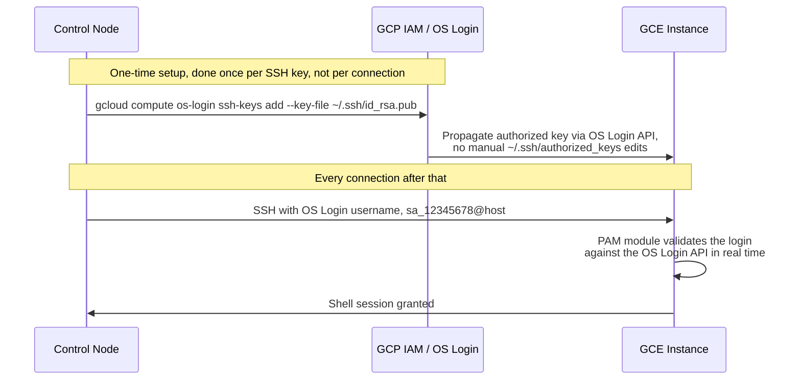
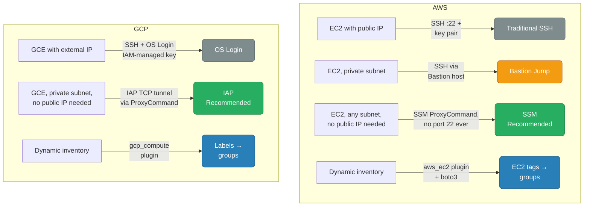

# Ansible Cloud Integration

How Ansible connects to cloud instances without managing SSH keys manually — AWS SSM, EC2 dynamic inventory, GCP OS Login and IAP tunnels.

<div class="quiz-progress" data-quiz-progress>
  <span class="quiz-progress-label">0/0 checks</span>
  <span class="quiz-progress-bar"><span class="quiz-progress-fill"></span></span>
</div>

---

## The Cloud Problem

Cloud VMs are ephemeral. IPs change, instances get replaced, you may have hundreds of nodes across regions. Static inventory breaks. Port 22 may be locked down by security policy.

```mermaid
graph TD
    classDef blocked fill:#c0392b,stroke:#922b21,color:#fff,rx:6
    classDef control fill:#34495e,stroke:#212f3c,color:#fff,rx:6
    classDef broker fill:#8e44ad,stroke:#6c3483,color:#fff,rx:6
    classDef target fill:#2980b9,stroke:#1f618d,color:#fff,rx:6
    classDef auth fill:#f39c12,stroke:#ba6018,color:#fff,rx:6

    subgraph "Traditional SSH — port 22 must be reachable"
        A["Control Node"]:::control -->|"SSH :22,<br/>direct TCP"| B["EC2 instance"]:::target
        C["Security policy /<br/>compliance requirement"]:::blocked -.->|"often blocks<br/>inbound :22 outright"| B
    end

    subgraph "AWS SSM Session Manager — no port 22, ever"
        D["Control Node"]:::control -->|"HTTPS to SSM API,<br/>SigV4-signed"| E["AWS Systems<br/>Manager service"]:::broker
        E -->|"WebSocket tunnel,<br/>control-node-initiated"| F["SSM Agent<br/>on EC2"]:::target
        G["IAM role /<br/>access keys"]:::auth -->|"authorizes the<br/>caller identity"| E
    end

    subgraph "GCP Cloud IAP — no VPN, no public IP"
        H["Control Node"]:::control -->|"gcloud IAP tunnel,<br/>OAuth2-authenticated"| I["Cloud IAP"]:::broker
        I -->|"authorized TCP,<br/>forwarded to :22"| J["GCE instance"]:::target
        K["IAM binding<br/>(iap.tunnelResourceAccessor)"]:::auth -->|authorizes| I
    end
```



<div class="quiz-card">
  <p class="quiz-q">Port 22 is locked down by security policy on your entire EC2 fleet. Does that mean Ansible simply can't manage these instances anymore?</p>
  <button class="quiz-reveal">Reveal answer</button>
  <div class="quiz-a" hidden>No — it means the traditional-SSH path is out, not Ansible itself. Both AWS SSM and GCP IAP replace the direct inbound SSH connection with a control-node-initiated outbound call to a cloud API (HTTPS to the SSM service, or an OAuth2-authenticated IAP tunnel), which an IAM role or IAM binding authorizes. Neither ever needs a listener reachable on port 22 from the control node's network — the whole point of both paths is dodging that exact security requirement.</div>
</div>

---

## AWS — Two Approaches

<div class="toggle-switch">
  <div class="toggle-buttons">
    <button data-toggle-opt="ssh" class="active state-warn">Traditional SSH</button>
    <button data-toggle-opt="ssm" class="state-ok">SSM Session Manager</button>
  </div>
  <div class="toggle-panel active" data-toggle-panel="ssh">
    Needs a security group rule opening port 22, an EC2 key pair (or a bastion host with its own key pair and <code>ProxyJump</code> config) distributed to every operator, and a network path — VPN, public IP, or bastion — from the control node to the instance. Use it when you already have VPN/bastion access to instances.
  </div>
  <div class="toggle-panel" data-toggle-panel="ssm">
    No port 22. No security group rule. No SSH key management. Ansible speaks to SSM via HTTPS; SSM tunnels to the agent on the instance, which needs the SSM Agent installed, an IAM instance profile with <code>AmazonSSMManagedInstanceCore</code>, and outbound HTTPS to <code>ssm.region.amazonaws.com</code>. Recommended for AWS.
  </div>
</div>

### Approach 1: Traditional SSH via EC2

Use when you have VPN/bastion access to instances.

```ini
# inventory.ini
[web]
10.0.1.10
10.0.1.11

[web:vars]
ansible_user=ec2-user
ansible_ssh_private_key_file=~/.ssh/ec2-key.pem
```

For private subnet instances via bastion:

```ini
# inventory.ini
[web]
10.0.1.10

[web:vars]
ansible_user=ec2-user
ansible_ssh_private_key_file=~/.ssh/app.pem
ansible_ssh_common_args='-o ProxyJump=ec2-user@52.x.x.x -o StrictHostKeyChecking=no -i ~/.ssh/bastion.pem'
```

Or use SSH config (cleaner):

```ini
# ~/.ssh/config
Host bastion
  HostName 52.x.x.x
  User ec2-user
  IdentityFile ~/.ssh/bastion.pem

Host 10.0.*.*
  ProxyJump bastion
  User ec2-user
  IdentityFile ~/.ssh/app.pem
```

```ini
# ansible.cfg
[defaults]
remote_user = ec2-user
```

---

### Approach 2: AWS SSM Session Manager (Recommended for AWS)

No port 22. No security group rule. No SSH key management. Ansible speaks to SSM via HTTPS, SSM tunnels to the agent on the instance.

```mermaid
sequenceDiagram
    participant C as Control Node
    participant SSM as AWS SSM Service
    participant A as SSM Agent (EC2)

    rect rgb(44, 62, 80)
    Note over C,A: Phase 1 — authenticate and open the channel, no inbound port ever opens
    C->>C: aws ssm start-session --target i-xxxx, or via Ansible's ProxyCommand
    C->>SSM: HTTPS request, SigV4 auth via IAM role or access keys
    SSM->>A: WebSocket channel opened via ActivationCode
    A->>A: Spawn shell session
    end

    rect rgb(52, 73, 94)
    Note over C,A: Phase 2 — Ansible's module traffic rides the same tunnel
    C->>SSM: Ansible module data on stdin
    SSM->>A: Forward to shell
    A->>SSM: Module output on stdout
    SSM->>C: Return output
    end
```



<div class="stepper">
  <div class="stepper-panels">
    <div class="stepper-panel active">
      <strong>1. Control node initiates.</strong> <code>aws ssm start-session --target i-xxxx</code> — or, in practice, Ansible's <code>ProxyCommand</code> running that same call transparently — authenticates with SigV4 using the local IAM role or access keys. No SSH keypair is involved at all.
    </div>
    <div class="stepper-panel">
      <strong>2. SSM brokers the channel.</strong> AWS Systems Manager checks the caller's IAM permissions against the instance's registered SSM Agent and opens a WebSocket channel via an activation code. The instance is never directly reachable from the control node's network — the connection is outbound-only, from the control node to the SSM API.
    </div>
    <div class="stepper-panel">
      <strong>3. The agent spawns the session.</strong> The SSM Agent running on the EC2 instance (pre-installed on Amazon Linux 2 and Ubuntu 20.04+) spawns the actual shell process that will run Ansible's module code.
    </div>
    <div class="stepper-panel">
      <strong>4. Ansible speaks through the tunnel.</strong> Module payloads travel control node → SSM → agent → shell on stdin, and output flows back the same path on stdout. From Ansible's point of view this looks like any other SSH connection — it's still the <code>ssh</code> connection plugin, just with <code>ProxyCommand</code> routing the actual bytes through SSM instead of a direct socket.
    </div>
    <div class="stepper-panel">
      <strong>5. No inbound path ever opens.</strong> At no point does a listener open on port 22 reachable from the control node's network. That's the entire security win: the connection is control-node-initiated and outbound, so there's nothing for a security group rule to expose.
    </div>
  </div>
  <div class="stepper-controls">
    <button class="stepper-prev">← Prev</button>
    <span class="stepper-dots"></span>
    <span class="stepper-label"></span>
    <button class="stepper-next">Next →</button>
  </div>
</div>

#### Prerequisites

```bash
# 1. Install AWS CLI and Session Manager plugin on control node
brew install awscli
# Download session manager plugin from AWS docs
# https://docs.aws.amazon.com/systems-manager/latest/userguide/session-manager-working-with-install-plugin.html

# 2. Install boto3 (for dynamic inventory)
pip install boto3 botocore

# 3. EC2 instance needs:
#    - SSM Agent installed (pre-installed on Amazon Linux 2, Ubuntu 20.04+)
#    - IAM instance profile with AmazonSSMManagedInstanceCore policy
#    - Outbound HTTPS to ssm.region.amazonaws.com

# Verify SSM connectivity
aws ssm start-session --target i-0123456789abcdef0
```

#### IAM Policy for EC2 Instance Profile

```json
{
  "Version": "2012-10-17",
  "Statement": [{
    "Effect": "Allow",
    "Action": [
      "ssm:DescribeAssociation",
      "ssm:GetDeployablePatchSnapshotForInstance",
      "ssm:GetDocument",
      "ssm:GetManifest",
      "ssm:GetParameter",
      "ssm:GetParameters",
      "ssm:ListAssociations",
      "ssm:ListInstanceAssociations",
      "ssm:PutInventory",
      "ssm:PutComplianceItems",
      "ssm:PutConfigurePackageResult",
      "ssm:UpdateAssociationStatus",
      "ssm:UpdateInstanceAssociationStatus",
      "ssm:UpdateInstanceInformation",
      "ssmmessages:CreateControlChannel",
      "ssmmessages:CreateDataChannel",
      "ssmmessages:OpenControlChannel",
      "ssmmessages:OpenDataChannel",
      "ec2messages:AcknowledgeMessage",
      "ec2messages:DeleteMessage",
      "ec2messages:FailMessage",
      "ec2messages:GetEndpoint",
      "ec2messages:GetMessages",
      "ec2messages:SendReply"
    ],
    "Resource": "*"
  }]
}
```

#### ansible.cfg for SSM

```ini
[defaults]
inventory          = ./inventory_aws_ec2.yml
remote_user        = ec2-user
host_key_checking  = False

[ssh_connection]
# Route SSH through SSM session
ssh_args = -o StrictHostKeyChecking=no -o UserKnownHostsFile=/dev/null -o ProxyCommand='aws ssm start-session --target %h --document-name AWS-StartSSHSession --parameters portNumber=%p'
```

#### Inventory Using Instance IDs

```ini
# inventory.ini — use EC2 instance IDs as hosts
[web]
i-0123456789abcdef0
i-0987654321fedcba0

[web:vars]
ansible_user=ec2-user
ansible_ssh_common_args='-o StrictHostKeyChecking=no -o ProxyCommand="aws ssm start-session --target %h --document-name AWS-StartSSHSession --parameters portNumber=%p"'
```

<div class="quiz-card">
  <p class="quiz-q">Since SSM needs no security group rule for port 22, why does the ansible.cfg <code>ProxyCommand</code> still pass <code>--parameters portNumber=%p</code> to <code>AWS-StartSSHSession</code>?</p>
  <button class="quiz-reveal">Reveal answer</button>
  <div class="quiz-a" hidden>That port number is used <em>inside</em> the already-authenticated SSM channel, to tell the SSM Agent which local port on the instance to connect the tunnel to — it's not a security-group-facing port. No inbound rule for it exists or is needed, because the connection never arrives from the public network in the first place; it's brokered entirely through the outbound HTTPS/WebSocket channel to the SSM service.</div>
</div>

---

## AWS Dynamic Inventory

Static inventory breaks at scale. Use the `aws_ec2` plugin to query EC2 automatically.

```yaml
# inventory_aws_ec2.yml
plugin: amazon.aws.aws_ec2
regions:
  - us-east-1
  - us-west-2

# Filter only running instances
filters:
  instance-state-name: running
  tag:Environment: production

# Use private IP (inside VPC) or instance ID (for SSM)
hostnames:
  - ip-address          # private IP for SSH
  # - instance-id       # for SSM, uncomment this

# Group instances by tag
keyed_groups:
  - key: tags.Role
    prefix: role
  - key: tags.Environment
    prefix: env
  - key: placement.region
    prefix: aws_region
  - key: instance_type
    prefix: type

# Add all EC2 tags as host vars
compose:
  ansible_host: private_ip_address
  # For SSM: ansible_host: instance_id

# Group by tag:Name
groups:
  web_servers: "'web' in tags.get('Name', '')"
  db_servers: "'db' in tags.get('Name', '')"
```

```bash
# Test dynamic inventory
ansible-inventory -i inventory_aws_ec2.yml --list
ansible-inventory -i inventory_aws_ec2.yml --graph

# Use it
ansible-playbook -i inventory_aws_ec2.yml site.yml

# Target by tag group
ansible role_web -i inventory_aws_ec2.yml -m ping
```

#### Install Required Collection

```bash
ansible-galaxy collection install amazon.aws
pip install boto3 botocore
```

<div class="quiz-card">
  <p class="quiz-q">The sample inventory comments out <code>hostnames: instance-id</code> in favor of <code>ip-address</code>. When would you flip that back to instance-id?</p>
  <button class="quiz-reveal">Reveal answer</button>
  <div class="quiz-a" hidden>When connecting via SSM instead of direct SSH. SSM's <code>--target</code> addresses instances by their instance ID, not network location, so <code>ansible_host</code> needs to resolve to <code>instance_id</code> (as the file's own comment notes: "for SSM, uncomment this") rather than <code>private_ip_address</code> — the SSM ProxyCommand's <code>%h</code> has to be something SSM itself can look up, and that's the instance ID, not an IP.</div>
</div>

---

## AWS Cloud Modules

Common modules from `amazon.aws` collection:

```yaml
# EC2 instance management
- amazon.aws.ec2_instance:
    name: "web-server"
    instance_type: t3.medium
    image_id: ami-0abcdef1234567890
    region: us-east-1
    vpc_subnet_id: subnet-abc123
    security_groups:
      - web-sg
    iam_instance_profile: SSMInstanceProfile
    tags:
      Environment: production
      Role: web
    state: running

# Security groups
- amazon.aws.ec2_security_group:
    name: web-sg
    description: Web server security group
    vpc_id: vpc-abc123
    rules:
      - proto: tcp
        from_port: 443
        to_port: 443
        cidr_ip: 0.0.0.0/0
    region: us-east-1

# S3 bucket
- amazon.aws.s3_bucket:
    name: my-app-bucket
    region: us-east-1
    versioning: true
    encryption: AES256

# Upload to S3
- amazon.aws.aws_s3:
    bucket: my-app-bucket
    object: /releases/app-v1.0.jar
    src: /opt/build/app.jar
    mode: put

# RDS instance
- amazon.aws.rds_instance:
    db_instance_identifier: prod-db
    db_instance_class: db.t3.medium
    engine: postgres
    master_username: admin
    master_user_password: "{{ vault_db_password }}"
    allocated_storage: 100
    region: us-east-1

# Get SSM Parameter Store values
- amazon.aws.aws_ssm_parameter_store:
    name: "/myapp/prod/db_password"
    region: us-east-1
  register: db_pass

- ansible.builtin.debug:
    msg: "DB password fetched from SSM Parameter Store"
```

---

## GCP — Two Approaches

### Approach 1: OS Login + Standard SSH

GCP OS Login ties SSH access to IAM. No need to distribute SSH keys — Google manages the public key.



#### Setup

```bash
# 1. Enable OS Login on the VM (or at project level)
gcloud compute instances add-metadata vm-name \
  --metadata enable-oslogin=TRUE

# Or project-wide:
gcloud compute project-info add-metadata \
  --metadata enable-oslogin=TRUE

# 2. Grant IAM role to the user/service account running Ansible
gcloud projects add-iam-policy-binding PROJECT_ID \
  --member="user:devops@example.com" \
  --role="roles/compute.osLogin"

# For admin (sudo) access:
gcloud projects add-iam-policy-binding PROJECT_ID \
  --member="user:devops@example.com" \
  --role="roles/compute.osAdminLogin"

# 3. Add your SSH key to OS Login
gcloud compute os-login ssh-keys add \
  --key-file ~/.ssh/id_rsa.pub

# 4. Get your OS Login username
gcloud compute os-login describe-profile
# Returns: posixAccounts[0].username = sa_12345678
```

```ini
# inventory.ini
[web]
10.0.1.10
10.0.1.11

[web:vars]
ansible_user=sa_12345678        # OS Login username from gcloud
ansible_python_interpreter=/usr/bin/python3
```

---

### Approach 2: GCP IAP TCP Tunneling (Recommended)

Identity-Aware Proxy creates an authenticated TCP tunnel to private VMs — no VPN, no public IP needed.

```mermaid
sequenceDiagram
    participant C as Control Node
    participant IAP as GCP Cloud IAP
    participant FW as GCP Firewall
    participant VM as GCE Instance

    rect rgb(44, 62, 80)
    Note over C,IAP: Phase 1 — open the authenticated tunnel
    C->>IAP: gcloud compute start-iap-tunnel, OAuth2 auth via gcloud credentials
    IAP->>C: Local port 10022 opens, forwards into the tunnel
    end

    Note over FW: Firewall rule still required:<br/>allow tcp:22 from IAP source range 35.235.240.0/20 only

    rect rgb(52, 73, 94)
    Note over C,VM: Phase 2 — SSH rides inside the tunnel like any local SSH session
    C->>IAP: SSH to 127.0.0.1:10022
    IAP->>FW: Forward to instance:22
    FW->>VM: TCP connection, source IP inside the trusted IAP range
    VM->>C: SSH session established via the tunnel
    end
```



<div class="stepper">
  <div class="stepper-panels">
    <div class="stepper-panel active">
      <strong>1. Establish the tunnel.</strong> <code>gcloud compute start-iap-tunnel INSTANCE_NAME 22 --local-host-port=localhost:10022 --zone=us-central1-a</code> authenticates with the caller's OAuth2 credentials (<code>gcloud auth</code>), not an SSH key — Cloud IAP itself decides whether that identity is authorized via <code>roles/iap.tunnelResourceAccessor</code>.
    </div>
    <div class="stepper-panel">
      <strong>2. A local port opens.</strong> <code>gcloud</code> opens a local listener (<code>127.0.0.1:10022</code>) that forwards everything into the authenticated IAP channel. Nothing here is reachable from outside localhost on the control node.
    </div>
    <div class="stepper-panel">
      <strong>3. The firewall still matters.</strong> The GCE instance's own VPC firewall must explicitly allow inbound <code>tcp:22</code> from Google's IAP source range (<code>35.235.240.0/20</code>). IAP removing the need for a public IP or VPN doesn't remove the need for this one firewall rule.
    </div>
    <div class="stepper-panel">
      <strong>4. SSH rides inside the tunnel.</strong> The actual SSH handshake (key-based, or OS-Login-based) happens over <code>127.0.0.1:10022</code> exactly like a local SSH session — IAP is a TCP forwarder here, not a replacement for SSH's own authentication.
    </div>
    <div class="stepper-panel">
      <strong>5. Ansible automates all of it.</strong> In production, the <code>ProxyCommand</code> runs <code>gcloud compute start-iap-tunnel ... --listen-on-stdin</code> per connection, so Ansible transparently opens and tears down the tunnel per host — no human has to run steps 1–2 manually first.
    </div>
  </div>
  <div class="stepper-controls">
    <button class="stepper-prev">← Prev</button>
    <span class="stepper-dots"></span>
    <span class="stepper-label"></span>
    <button class="stepper-next">Next →</button>
  </div>
</div>

#### Setup

```bash
# 1. Firewall rule — allow SSH only from IAP source range
gcloud compute firewall-rules create allow-ssh-iap \
  --network=default \
  --direction=INGRESS \
  --action=ALLOW \
  --rules=tcp:22 \
  --source-ranges=35.235.240.0/20    # GCP IAP source IPs

# 2. Grant IAP accessor role
gcloud projects add-iam-policy-binding PROJECT_ID \
  --member="user:devops@example.com" \
  --role="roles/iap.tunnelResourceAccessor"

# 3. Test tunnel manually
gcloud compute start-iap-tunnel INSTANCE_NAME 22 \
  --local-host-port=localhost:10022 \
  --zone=us-central1-a &

ssh -p 10022 -i ~/.ssh/gcp.pem username@localhost
```

#### ansible.cfg for IAP

```ini
[defaults]
remote_user = your_username
private_key_file = ~/.ssh/gcp.pem

[ssh_connection]
# Route all SSH via IAP tunnel using gcloud as ProxyCommand
ssh_args = -o StrictHostKeyChecking=no -o UserKnownHostsFile=/dev/null -o ProxyCommand='gcloud compute start-iap-tunnel %h %p --listen-on-stdin --zone=us-central1-a --quiet'
```

This uses `%h` (hostname) and `%p` (port) so Ansible can connect to any instance by name.

#### Inventory Using Instance Names

```ini
# inventory.ini
[web]
web-instance-1
web-instance-2

[web:vars]
ansible_user=sa_12345678
ansible_ssh_common_args='-o StrictHostKeyChecking=no -o ProxyCommand="gcloud compute start-iap-tunnel %h %p --listen-on-stdin --zone=us-central1-a --quiet"'
```

<div class="quiz-card">
  <p class="quiz-q">Cloud IAP tunneling is described as needing "no VPN." Does that also mean no firewall rule for port 22 is needed on the GCE instance?</p>
  <button class="quiz-reveal">Reveal answer</button>
  <div class="quiz-a" hidden>No — a firewall rule is still required (<code>allow-ssh-iap</code>). IAP just narrows its required source range down to Google's own IAP range (<code>35.235.240.0/20</code>) instead of a VPN's CIDR or the public internet. IAP replaces the need for a VPN or a public IP to reach the instance, but the instance's own firewall still has to explicitly trust the IAP relay's source range — skip that step and the tunnel establishes fine, but the final hop to port 22 gets dropped.</div>
</div>

---

## GCP Dynamic Inventory

```yaml
# inventory_gcp.yml
plugin: google.cloud.gcp_compute
projects:
  - my-project-id
zones:
  - us-central1-a
  - us-central1-b
auth_kind: serviceaccount
service_account_file: /path/to/service-account.json

# Filter by labels
filters:
  - labels.environment = production

# Group by label
keyed_groups:
  - key: labels.role
    prefix: role
  - key: zone
    prefix: zone

# Use IAP name, not IP
hostnames:
  - name

# Set ansible_host for IAP tunneling
compose:
  ansible_host: name                          # instance name for IAP
  # ansible_host: networkInterfaces[0].networkIP  # internal IP for direct SSH
```

```bash
# Install collection
ansible-galaxy collection install google.cloud
pip install requests google-auth

# Test
ansible-inventory -i inventory_gcp.yml --list
ansible-inventory -i inventory_gcp.yml --graph
```

<div class="quiz-card">
  <p class="quiz-q">GCP's dynamic inventory sets <code>hostnames: name</code> instead of an IP. Why does the IAP-tunneling approach specifically need that?</p>
  <button class="quiz-reveal">Reveal answer</button>
  <div class="quiz-a" hidden><code>gcloud compute start-iap-tunnel %h %p</code> — the ProxyCommand in ansible.cfg — expects an instance <em>name</em>, not an IP address, since IAP resolves the target through GCP's own instance metadata. So <code>ansible_host</code> must be the instance name for the tunnel command to resolve it, unlike a direct-SSH setup where the internal IP (<code>networkInterfaces[0].networkIP</code>) works fine on its own.</div>
</div>

---

## GCP Cloud Modules

```yaml
# GCE instance
- google.cloud.gcp_compute_instance:
    name: web-server
    machine_type: n2-standard-2
    zone: us-central1-a
    project: my-project-id
    auth_kind: serviceaccount
    service_account_file: /path/to/sa.json
    disks:
      - auto_delete: true
        boot: true
        initialize_params:
          source_image: projects/debian-cloud/global/images/family/debian-11
    network_interfaces:
      - network: global/networks/default
    metadata:
      enable-oslogin: "TRUE"
    labels:
      environment: production
      role: web
    state: present

# GCS bucket
- google.cloud.gcp_storage_bucket:
    name: my-gcs-bucket
    project: my-project-id
    auth_kind: serviceaccount
    service_account_file: /path/to/sa.json
    location: US
    storage_class: STANDARD

# Upload to GCS
- google.cloud.gcp_storage_object:
    action: upload
    bucket: my-gcs-bucket
    src: /opt/build/app.jar
    dest: releases/app-v1.0.jar
    project: my-project-id
    auth_kind: serviceaccount
    service_account_file: /path/to/sa.json

# Firewall rule
- google.cloud.gcp_compute_firewall:
    name: allow-https
    network: global/networks/default
    allowed:
      - ip_protocol: tcp
        ports:
          - "443"
    source_ranges:
      - 0.0.0.0/0
    project: my-project-id
    auth_kind: serviceaccount
    service_account_file: /path/to/sa.json
```

---

## Multi-Cloud Comparison



| Concern | AWS | GCP |
|---------|-----|-----|
| No port 22 | SSM Session Manager | Cloud IAP |
| Key management | EC2 Key Pairs / SSM | OS Login (IAM-managed) |
| Private subnet access | SSM or Bastion | IAP (no VPN needed) |
| Dynamic inventory | `amazon.aws.aws_ec2` | `google.cloud.gcp_compute` |
| Auth method | IAM role / access keys | Service account / ADC |
| Audit trail | CloudTrail + SSM session logs | Cloud Audit Logs + IAP logs |

<div class="quiz-card">
  <p class="quiz-q">The diagram shows "EC2 private subnet → Bastion Jump" as a valid alternative to "EC2 any subnet → SSM Recommended." What operational overhead does the SSM path remove that the Bastion path still carries?</p>
  <button class="quiz-reveal">Reveal answer</button>
  <div class="quiz-a" hidden>The Bastion path requires provisioning, patching, and securing a dedicated jump host — plus its own key pair and <code>ProxyJump</code>/<code>ProxyCommand</code> config — purely to relay SSH traffic. The SSM path removes that middle host entirely: Ansible talks to the AWS SSM service directly over HTTPS, and the SSM Agent on the target does the rest, so there's no separate always-on server to keep patched and locked down.</div>
</div>

---

## Secrets from Cloud Parameter Stores

Don't put secrets in playbooks. Pull them from cloud secret stores at runtime.

### AWS Parameter Store

```yaml
- name: Fetch secrets from SSM Parameter Store
  amazon.aws.aws_ssm_parameter_store:
    name: "{{ item }}"
    region: us-east-1
  register: secrets
  loop:
    - /app/prod/db_password
    - /app/prod/api_key

- name: Set as facts
  ansible.builtin.set_fact:
    db_password: "{{ secrets.results[0].value }}"
    api_key: "{{ secrets.results[1].value }}"
  no_log: true                    # don't print values in output
```

### AWS Secrets Manager

```yaml
- name: Fetch from Secrets Manager
  community.aws.aws_secret:
    name: prod/myapp/credentials
    region: us-east-1
  register: secret_data

- name: Parse JSON secret
  ansible.builtin.set_fact:
    db_creds: "{{ secret_data.secret | from_json }}"
  no_log: true
```

### GCP Secret Manager

```yaml
- name: Fetch GCP secret
  google.cloud.gcp_secretmanager_secret_version_info:
    secret: my-db-password
    project: my-project-id
    auth_kind: serviceaccount
    service_account_file: /path/to/sa.json
  register: gcp_secret

- name: Decode secret value
  ansible.builtin.set_fact:
    db_password: "{{ gcp_secret.payload.data | b64decode }}"
  no_log: true
```

<div class="quiz-card">
  <p class="quiz-q">Every secret-fetching task above ends with <code>no_log: true</code>. What actually breaks if you forget it?</p>
  <button class="quiz-reveal">Reveal answer</button>
  <div class="quiz-a" hidden>Nothing breaks functionally — the secret is still fetched and usable by later tasks. But without <code>no_log: true</code>, Ansible prints the task's full result, including the decrypted secret value, to stdout and into any log output or CI artifact — silently leaking <code>db_password</code>/<code>api_key</code> into logs that are usually far less protected than the secret store it came from.</div>
</div>

---

## Full Example: AWS SSM Playbook

A complete, production-ready playbook for AWS using SSM (no port 22):

```yaml
# site.yml
---
- name: Configure web servers via SSM
  hosts: role_web                         # from dynamic inventory tag
  become: true
  gather_facts: true

  vars_files:
    - group_vars/all.yml

  pre_tasks:
    - name: Fetch DB password from Parameter Store
      amazon.aws.aws_ssm_parameter_store:
        name: "/{{ env }}/app/db_password"
        region: "{{ aws_region }}"
      register: db_password_param
      no_log: true

    - name: Set DB password fact
      ansible.builtin.set_fact:
        db_password: "{{ db_password_param.value }}"
      no_log: true

  roles:
    - common
    - nginx
    - myapp

  post_tasks:
    - name: Smoke test
      ansible.builtin.uri:
        url: "http://localhost/health"
        status_code: 200
      retries: 3
      delay: 10
```

```ini
# ansible.cfg
[defaults]
inventory          = ./inventory_aws_ec2.yml
remote_user        = ec2-user
host_key_checking  = False
forks              = 20

[ssh_connection]
ssh_args = -o StrictHostKeyChecking=no -o UserKnownHostsFile=/dev/null -o ProxyCommand='aws ssm start-session --target %h --document-name AWS-StartSSHSession --parameters portNumber=%p'
pipelining = True
```

```bash
# Run
AWS_PROFILE=prod ansible-playbook site.yml \
  -e "env=prod" \
  --check          # dry run first
  
AWS_PROFILE=prod ansible-playbook site.yml \
  -e "env=prod"
```

---

## Read Next

- [advanced.md](./advanced.md) — Roles, collections, Vault, AWX/Tower, performance, testing
