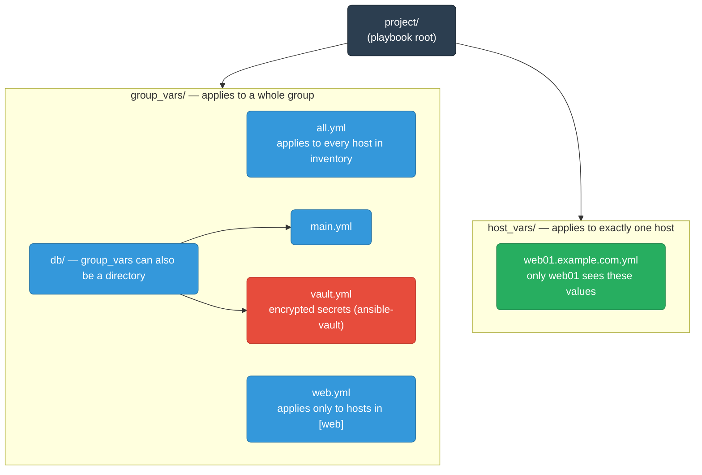
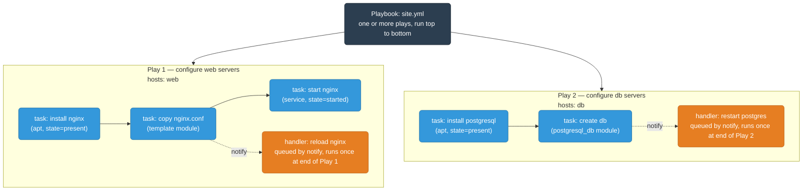

# Ansible Core Concepts

Everything you need to write real playbooks: inventory, plays, tasks, modules, variables, facts, handlers, and Jinja2 templates.

<div class="quiz-progress" data-quiz-progress>
  <span class="quiz-progress-label">0/0 checks</span>
  <span class="quiz-progress-bar"><span class="quiz-progress-fill"></span></span>
</div>

---

## Inventory

The inventory tells Ansible **which hosts** to manage and how to connect to them.

### Static Inventory (INI format)

```ini
# inventory.ini

# Ungrouped host
192.168.1.5

[web]
web01.example.com
web02.example.com ansible_user=ubuntu ansible_port=2222

[db]
db01.example.com
db02.example.com

# Group of groups
[backend:children]
web
db

# Group variables (apply to all hosts in [web])
[web:vars]
ansible_user=ec2-user
nginx_port=80

[all:vars]
ansible_python_interpreter=/usr/bin/python3
```

### Static Inventory (YAML format)

```yaml
# inventory.yml
all:
  vars:
    ansible_python_interpreter: /usr/bin/python3
  children:
    web:
      vars:
        nginx_port: 80
      hosts:
        web01.example.com:
        web02.example.com:
          ansible_user: ubuntu
    db:
      hosts:
        db01.example.com:
        db02.example.com:
```

### Host Variables — host_vars / group_vars

Ansible automatically loads variables from these directories relative to your playbook:



```yaml
# group_vars/web.yml
nginx_version: "1.25"
nginx_port: 443
ssl_cert_path: /etc/ssl/certs/app.crt
```

### Inventory Patterns

```bash
ansible all          # every host in inventory
ansible web          # group named web
ansible web,db       # union of two groups
ansible web:&db      # intersection (in both groups)
ansible web:!db      # in web but NOT in db
ansible "web[0]"     # first host of web group
ansible "10.0.*"     # glob match on hostname
ansible ~web\d+      # regex match
```

<div class="quiz-card">
  <p class="quiz-q">What's the difference between <code>ansible web:&db</code> and <code>ansible web:!db</code>?</p>
  <button class="quiz-reveal">Reveal answer</button>
  <div class="quiz-a" hidden>
    <code>web:&db</code> is an <strong>intersection</strong> — only hosts that belong to both the
    <code>web</code> group and the <code>db</code> group. <code>web:!db</code> is a
    <strong>difference</strong> — every host in <code>web</code> that is <em>not</em> also in
    <code>db</code>. <code>web,db</code> (comma) is different again: a plain <strong>union</strong>
    of both groups' hosts, with no filtering at all.
  </div>
</div>

---

## Playbooks

A playbook is a YAML file containing one or more **plays**. Each play maps a set of hosts to a set of tasks.



### Minimal Playbook

```yaml
---
- name: Configure web servers
  hosts: web
  become: true

  tasks:
    - name: Install nginx
      ansible.builtin.apt:
        name: nginx
        state: present
        update_cache: true

    - name: Start and enable nginx
      ansible.builtin.service:
        name: nginx
        state: started
        enabled: true
```

### Full Playbook Structure

```yaml
---
- name: Deploy application                # play name (shown in output)
  hosts: web                              # target group or host pattern
  become: true                            # sudo escalation
  become_user: root
  gather_facts: true                      # run setup module first (default)
  serial: 2                              # rolling update: 2 hosts at a time
  any_errors_fatal: false                # continue other hosts on failure
  max_fail_percentage: 20               # abort if >20% of hosts fail
  environment:                           # env vars for all tasks
    APP_ENV: production
  vars:
    app_port: 8080
  vars_files:
    - group_vars/web.yml
    - vault/secrets.yml

  pre_tasks:
    - name: Wait for connection
      ansible.builtin.wait_for_connection:
        timeout: 60

  roles:
    - common
    - nginx

  tasks:
    - name: Deploy application jar
      ansible.builtin.copy:
        src: app.jar
        dest: /opt/app/app.jar
        owner: appuser
        mode: "0644"
      notify: Restart app service

  post_tasks:
    - name: Verify app responds
      ansible.builtin.uri:
        url: "http://localhost:{{ app_port }}/health"
        status_code: 200

  handlers:
    - name: Restart app service
      ansible.builtin.service:
        name: myapp
        state: restarted
```

Within a single play, these sections always run in a fixed order, no matter how they're arranged in the YAML file: **`pre_tasks` → `roles` → `tasks` → `post_tasks`**. Any handler notified at any point during that sequence doesn't run immediately — it waits until the very end of the whole play (after `post_tasks`), unless something explicitly forces an earlier flush.

<div class="quiz-card">
  <p class="quiz-q">A play defines pre_tasks, roles, tasks, and post_tasks. A task inside roles notifies a handler. When does that handler actually run?</p>
  <button class="quiz-reveal">Reveal answer</button>
  <div class="quiz-a" hidden>
    Not immediately, and not right after the <code>roles</code> section finishes. Ansible always
    runs <code>pre_tasks</code>, then <code>roles</code>, then <code>tasks</code>, then
    <code>post_tasks</code> in that fixed order within a play — and any handler notified during
    any of those stages waits until the very end of the whole play (after <code>post_tasks</code>)
    to run, unless something explicitly flushes it early with <code>meta: flush_handlers</code>.
  </div>
</div>

---

## Tasks

A task is one unit of work — it calls one module with arguments.

```yaml
tasks:
  - name: Create deploy user            # human-readable name (required, show in output)
    ansible.builtin.user:               # FQCN module name
      name: deploy
      shell: /bin/bash
      groups: docker
      state: present
    register: user_result               # capture output

  - name: Print result
    ansible.builtin.debug:
      var: user_result

  - name: Only run on Ubuntu
    ansible.builtin.apt:
      name: htop
    when: ansible_facts['os_family'] == "Debian"

  - name: Create multiple directories
    ansible.builtin.file:
      path: "{{ item }}"
      state: directory
      mode: "0755"
    loop:
      - /opt/app
      - /opt/logs
      - /opt/config

  - name: Loop over dict
    ansible.builtin.user:
      name: "{{ item.name }}"
      uid: "{{ item.uid }}"
    loop:
      - { name: alice, uid: 2001 }
      - { name: bob, uid: 2002 }

  - name: Task with retries
    ansible.builtin.uri:
      url: http://localhost:8080/health
    register: result
    retries: 5
    delay: 10
    until: result.status == 200

  - name: Ignore errors for optional step
    ansible.builtin.command: /usr/local/bin/optional-setup.sh
    ignore_errors: true

  - name: Run only once across all hosts
    ansible.builtin.command: /usr/local/bin/db-migrate.sh
    run_once: true
    delegate_to: db01.example.com
```

### Task Result Object

`register` captures the module return value:

```yaml
- name: Get file stat
  ansible.builtin.stat:
    path: /etc/app/config.yml
  register: config_stat

- name: Print if file exists
  ansible.builtin.debug:
    msg: "Config exists, size={{ config_stat.stat.size }}"
  when: config_stat.stat.exists
```

Common result keys:

| Key | Meaning |
|-----|---------|
| `result.changed` | Whether module made a change |
| `result.failed` | Whether task failed |
| `result.rc` | Return code (command/shell modules) |
| `result.stdout` | Standard output |
| `result.stderr` | Standard error |
| `result.stdout_lines` | stdout as list of lines |

<div class="quiz-card">
  <p class="quiz-q">A task has <code>run_once: true</code> but no <code>delegate_to</code>. Which host does it actually run on, and why is that risky?</p>
  <button class="quiz-reveal">Reveal answer</button>
  <div class="quiz-a" hidden>
    Whichever host happens to be first in the current batch Ansible is processing — not
    necessarily a host chosen deliberately. That's exactly why <code>run_once</code> is almost
    always paired with <code>delegate_to: db01.example.com</code> (or similar): pinning the single
    execution to a specific, known host instead of leaving it to whichever host Ansible picks.
  </div>
</div>

---

## Modules

Modules are the building blocks. Each is an idempotent action.

### Essential Modules

**File and Package**

```yaml
# apt — Debian/Ubuntu packages
- ansible.builtin.apt:
    name: "{{ packages }}"
    state: present          # present / absent / latest
    update_cache: true
  vars:
    packages:
      - nginx
      - python3-pip

# dnf / yum — RHEL/CentOS
- ansible.builtin.dnf:
    name: httpd
    state: latest

# file — manage files, dirs, symlinks, permissions
- ansible.builtin.file:
    path: /etc/app
    state: directory         # file / directory / link / absent / touch
    owner: app
    group: app
    mode: "0750"

# copy — copy file from control node to remote
- ansible.builtin.copy:
    src: files/nginx.conf
    dest: /etc/nginx/nginx.conf
    owner: root
    mode: "0644"
    backup: true             # keep .bak if file changes

# fetch — copy file FROM remote to control node
- ansible.builtin.fetch:
    src: /var/log/app.log
    dest: ./logs/{{ inventory_hostname }}-app.log
    flat: true

# template — Jinja2 template to remote file
- ansible.builtin.template:
    src: templates/nginx.conf.j2
    dest: /etc/nginx/nginx.conf
    owner: root
    mode: "0644"

# lineinfile — ensure a line exists in a file
- ansible.builtin.lineinfile:
    path: /etc/sysctl.conf
    line: "net.ipv4.ip_forward = 1"
    regexp: "^net.ipv4.ip_forward"
    state: present

# blockinfile — insert/update a block of lines
- ansible.builtin.blockinfile:
    path: /etc/hosts
    block: |
      10.0.1.10 web01
      10.0.1.11 web02
    marker: "# {mark} ANSIBLE MANAGED BLOCK"
```

**Services and System**

```yaml
# service — control systemd/init.d services
- ansible.builtin.service:
    name: nginx
    state: started           # started / stopped / restarted / reloaded
    enabled: true            # enable on boot

# systemd — full systemd control
- ansible.builtin.systemd:
    name: myapp
    state: restarted
    daemon_reload: true      # after unit file change

# user — manage OS users
- ansible.builtin.user:
    name: deploy
    shell: /bin/bash
    home: /home/deploy
    groups: docker,sudo
    state: present
    password: "{{ vault_deploy_password | password_hash('sha512') }}"

# group — manage OS groups
- ansible.builtin.group:
    name: docker
    state: present

# cron — manage cron jobs
- ansible.builtin.cron:
    name: "Daily backup"
    minute: "0"
    hour: "2"
    job: "/usr/local/bin/backup.sh >> /var/log/backup.log 2>&1"
    user: root
```

**Commands and Scripts**

```yaml
# command — run a command (no shell features like | & > )
- ansible.builtin.command:
    cmd: /usr/local/bin/db-init.sh
    creates: /var/lib/app/.initialized   # skip if file exists

# shell — run via /bin/sh (supports pipes, redirects)
- ansible.builtin.shell:
    cmd: "ps aux | grep nginx | wc -l"
  register: nginx_count

# script — copy local script to remote and run it
- ansible.builtin.script:
    cmd: scripts/setup.sh arg1 arg2

# raw — send raw SSH command, no Python needed
- ansible.builtin.raw:
    cmd: yum install -y python3
  when: ansible_facts.get('python') is not defined
```

**Network and Cloud**

```yaml
# uri — HTTP requests
- ansible.builtin.uri:
    url: https://api.example.com/health
    method: GET
    headers:
      Authorization: "Bearer {{ api_token }}"
    status_code: 200
  register: health_response

# get_url — download file from URL
- ansible.builtin.get_url:
    url: https://github.com/org/repo/releases/v1.0/app.tar.gz
    dest: /tmp/app.tar.gz
    checksum: sha256:abc123...

# unarchive — extract tar/zip
- ansible.builtin.unarchive:
    src: /tmp/app.tar.gz
    dest: /opt/app
    remote_src: true          # src is on the remote host
```

---

## Handlers

Handlers are tasks that run **at the end of a play** only if notified. Used for restarts — no need to restart nginx every task, just at the end if any task changed the config.

```yaml
tasks:
  - name: Copy nginx main config
    ansible.builtin.template:
      src: nginx.conf.j2
      dest: /etc/nginx/nginx.conf
    notify: Reload nginx          # triggers handler

  - name: Copy nginx site config
    ansible.builtin.copy:
      src: site.conf
      dest: /etc/nginx/conf.d/site.conf
    notify: Reload nginx          # same handler, only runs once

handlers:
  - name: Reload nginx
    ansible.builtin.service:
      name: nginx
      state: reloaded
```

Key rules:
- Handlers run **once per play**, even if notified multiple times
- Handlers run **in the order defined**, not the order they were notified
- `notify` matches on the handler `name` exactly
- Force handlers to run immediately with `meta: flush_handlers`

```yaml
- name: Force handlers to run now
  ansible.builtin.meta: flush_handlers
```

### The notify → flush lifecycle, one step at a time

<div class="stepper">
  <div class="stepper-panels">
    <div class="stepper-panel active">
      <strong>1. A task changes something and notifies.</strong> <code>Copy nginx main config</code>
      runs and the <code>template</code> module reports <code>changed: true</code>, so its
      <code>notify: Reload nginx</code> fires. The handler does <strong>not</strong> run yet — it's
      only queued.
    </div>
    <div class="stepper-panel">
      <strong>2. A second task notifies the same handler.</strong> <code>Copy nginx site config</code>
      also changes and also notifies <code>Reload nginx</code>. Ansible de-duplicates by handler
      name — the queue still holds exactly one pending <code>Reload nginx</code>, not two.
    </div>
    <div class="stepper-panel">
      <strong>3. A task that reports no change queues nothing.</strong> If a later task in the same
      play runs but reports <code>changed: false</code>, nothing gets added to the queue — handlers
      only fire off the back of an actual change.
    </div>
    <div class="stepper-panel">
      <strong>4. Handlers flush — normally at the very end of the play.</strong> Once every task
      (including <code>post_tasks</code>) in the play has run, Ansible runs each <em>queued</em>
      handler exactly once — in the order the handlers are <strong>defined</strong> under
      <code>handlers:</code>, regardless of which task notified it first or how many times.
    </div>
    <div class="stepper-panel">
      <strong>5. Or flush early with meta: flush_handlers.</strong> Insert
      <code>- ansible.builtin.meta: flush_handlers</code> as a task and every handler notified so
      far runs immediately, right there — useful when a later task in the same play actually
      depends on the handler having already run (e.g. restart a service before health-checking it).
    </div>
  </div>
  <div class="stepper-controls">
    <button class="stepper-prev">← Prev</button>
    <span class="stepper-dots"></span>
    <span class="stepper-label"></span>
    <button class="stepper-next">Next →</button>
  </div>
</div>

<div class="quiz-card">
  <p class="quiz-q">Two tasks both notify Reload nginx, and handlers: defines Reload nginx above Restart app service, which is notified by a task that runs later in the play. Which handler runs first?</p>
  <button class="quiz-reveal">Reveal answer</button>
  <div class="quiz-a" hidden>
    <code>Reload nginx</code> runs first — handlers execute in the order they're defined under
    <code>handlers:</code>, not the order they were notified during the play. Being notified twice
    by two different tasks also doesn't make it run twice; every queued handler runs at most once
    per play.
  </div>
</div>

---

## Variables

Variables can come from many sources, and when the same variable name is set in more than one of them, **precedence** decides which value actually wins. The full ordinal list has 18 rungs, but they collapse into four conceptual tiers — each tier beats everything in the tier below it, and within a tier, a narrower scope beats a broader one.

<div class="tab-group">
  <div class="tab-buttons">
    <button data-tab="defaults" class="active">1. Defaults &amp; inventory</button>
    <button data-tab="playbook">2. Playbook-level</button>
    <button data-tab="play">3. Play, role &amp; task vars</button>
    <button data-tab="runtime">4. Runtime &amp; CLI overrides</button>
  </div>
  <div class="tab-panels">
    <div class="tab-panel active" data-tab-panel="defaults">
      <strong>Lowest tier — set once, meant to be overridden.</strong>
      <code>roles/*/defaults/main.yml</code> is the most-overridden layer in Ansible by design —
      that's the whole point of a role shipping sane defaults. Right above it: whatever the
      <em>inventory</em> itself defines — <code>group_vars/all</code>, then the more specific
      <code>group_vars/&lt;group&gt;</code>, then the most specific <code>host_vars/&lt;host&gt;</code> —
      each narrower scope beats the broader one below it.
    </div>
    <div class="tab-panel" data-tab-panel="playbook">
      <strong>Same names, higher tier.</strong> A <code>group_vars/</code> or
      <code>host_vars/</code> directory sitting next to the <em>playbook</em> (not the inventory)
      wins over the identically-named inventory version — the same all/group/host narrowing order
      applies. Gathered host facts (and any fact cached from a previous run) also sit in this tier,
      just below play-level vars.
    </div>
    <div class="tab-panel" data-tab-panel="play">
      <strong>Everything declared inside the play or role.</strong> <code>vars:</code>,
      <code>vars_prompt</code>, and <code>vars_files</code> on the play, then
      <code>vars/main.yml</code> on the role, then <code>block:</code>-level vars, then vars on the
      individual task, then anything pulled in with <code>include_vars</code> — each one narrower
      in scope than the last, so it wins.
    </div>
    <div class="tab-panel" data-tab-panel="runtime">
      <strong>Highest tier — decided while the play is running.</strong> A <code>set_fact</code> or
      a <code>register</code>-ed result overrides everything below it the moment it's set — that's
      deliberately much higher than the read-only host facts gathered at play start. Role/include
      params come next. <code>-e</code> extra vars on the command line always win, full stop —
      that's what makes them safe for one-off environment overrides.
    </div>
  </div>
</div>

For the exact ordinal ranking (useful when two sources in different tiers still need disambiguating):

| Rank | Source | Tier |
|------|--------|------|
| 1 (lowest) | role `defaults/main.yml` | Defaults & inventory |
| 2 | inventory `group_vars/all` | Defaults & inventory |
| 3 | inventory `group_vars/<group>` | Defaults & inventory |
| 4 | inventory `host_vars/<host>` | Defaults & inventory |
| 5 | playbook `group_vars/all` | Playbook-level |
| 6 | playbook `group_vars/<group>` | Playbook-level |
| 7 | playbook `host_vars/<host>` | Playbook-level |
| 8 | host facts / cached `set_facts` | Playbook-level |
| 9 | play `vars` | Play, role & task vars |
| 10 | play `vars_prompt` | Play, role & task vars |
| 11 | play `vars_files` | Play, role & task vars |
| 12 | role `vars` | Play, role & task vars |
| 13 | block vars | Play, role & task vars |
| 14 | task vars | Play, role & task vars |
| 15 | `include_vars` | Play, role & task vars |
| 16 | `set_fact` / registered vars (this run) | Runtime & CLI overrides |
| 17 | role/include params | Runtime & CLI overrides |
| 18 (highest) | extra vars `-e "key=val"` | Runtime & CLI overrides |

**Extra vars always win** — use `-e` for environment-specific overrides.

<div class="quiz-card">
  <p class="quiz-q">A role ships roles/nginx/defaults/main.yml with nginx_port: 80, and also roles/nginx/vars/main.yml with nginx_port: 8080. With nothing else set anywhere, which value wins, and why do roles even ship both files?</p>
  <button class="quiz-reveal">Reveal answer</button>
  <div class="quiz-a" hidden>
    <code>8080</code> wins — role <code>vars/main.yml</code> sits far above role
    <code>defaults/main.yml</code> in the precedence order (defaults is the lowest tier of all,
    vars is up with play/block/task vars). Roles ship both because they serve opposite purposes:
    <code>defaults/</code> is meant to be overridden by anyone using the role, <code>vars/</code>
    is meant to hold values the role itself depends on and generally shouldn't be casually
    overridden by a caller.
  </div>
</div>

### Variable Types and Usage

```yaml
vars:
  # Scalar
  app_port: 8080
  app_name: "myapp"

  # List
  packages:
    - nginx
    - python3
    - git

  # Dict
  db_config:
    host: db.internal
    port: 5432
    name: appdb

tasks:
  - name: Use scalar
    ansible.builtin.debug:
      msg: "Port is {{ app_port }}"

  - name: Use list
    ansible.builtin.apt:
      name: "{{ packages }}"

  - name: Use dict key
    ansible.builtin.debug:
      msg: "DB at {{ db_config.host }}:{{ db_config.port }}"
      # or: {{ db_config['host'] }}

  - name: Set fact dynamically
    ansible.builtin.set_fact:
      deploy_timestamp: "{{ ansible_date_time.iso8601 }}"
```

### vars_prompt — Interactive Input

```yaml
vars_prompt:
  - name: db_password
    prompt: "Enter database password"
    private: true            # hides input
    confirm: true            # asks twice

  - name: env
    prompt: "Environment (dev/staging/prod)"
    default: dev
```

---

## Facts

Facts are variables about the remote host, gathered automatically at play start via the `setup` module.

```bash
# See all facts for a host
ansible web01 -m setup
ansible web01 -m setup -a "filter=ansible_distribution*"
```

### Commonly Used Facts

```yaml
ansible_facts['distribution']          # "Ubuntu", "CentOS", "Amazon"
ansible_facts['distribution_version']  # "22.04"
ansible_facts['os_family']             # "Debian", "RedHat"
ansible_facts['hostname']              # short hostname
ansible_facts['fqdn']                  # fully qualified
ansible_facts['default_ipv4']['address']  # primary IP
ansible_facts['memtotal_mb']           # total RAM in MB
ansible_facts['processor_count']       # CPU count
ansible_facts['architecture']          # "x86_64"
ansible_facts['env']['HOME']           # env variables
ansible_facts['mounts']               # mounted filesystems
ansible_facts['interfaces']           # network interfaces
```

### Using Facts in Conditionals

```yaml
tasks:
  - name: Install on Debian family
    ansible.builtin.apt:
      name: nginx
    when: ansible_facts['os_family'] == "Debian"

  - name: Install on RedHat family
    ansible.builtin.dnf:
      name: nginx
    when: ansible_facts['os_family'] == "RedHat"

  - name: Apply only if enough RAM
    ansible.builtin.include_role:
      name: elasticsearch
    when: ansible_facts['memtotal_mb'] >= 4096
```

### Custom Facts

Create `/etc/ansible/facts.d/app.fact` on the remote host:

```ini
[app]
version=2.5.1
environment=production
```

Access as: `ansible_local['app']['app']['version']`

### Disabling Fact Gathering

```yaml
- hosts: web
  gather_facts: false          # skip setup module, faster for large fleets

  tasks:
    - name: Quick task that needs no facts
      ansible.builtin.ping:
```

<div class="quiz-card">
  <p class="quiz-q">A play sets gather_facts: false for speed, but one of its tasks still has when: ansible_facts['memtotal_mb'] >= 4096. What happens?</p>
  <button class="quiz-reveal">Reveal answer</button>
  <div class="quiz-a" hidden>
    The task's condition fails or errors — <code>ansible_facts['memtotal_mb']</code> was never
    populated because the <code>setup</code> module (which <code>gather_facts</code> controls)
    never ran. Disabling fact gathering is a real speed win for large fleets, but only for plays
    whose tasks genuinely don't reference any <code>ansible_facts</code> value.
  </div>
</div>

---

## Jinja2 Templates

Ansible uses Jinja2 for variable interpolation and template rendering.

### Template File Example

```jinja2
{# templates/nginx.conf.j2 #}
user {{ nginx_user | default('www-data') }};
worker_processes {{ ansible_facts['processor_count'] }};

error_log /var/log/nginx/error.log warn;
pid /var/run/nginx.pid;

events {
    worker_connections {{ nginx_worker_connections | default(1024) }};
}

http {
    server_name {{ inventory_hostname }};

    
    listen {{ port }};
    

    
    ssl_certificate {{ ssl_cert_path }};
    ssl_certificate_key {{ ssl_key_path }};
    

    location / {
        proxy_pass http://localhost:{{ app_port }};
        proxy_set_header Host $host;
    }
}
```

Note the `| bool` filter on `ssl_enabled` above — that's not decorative. A variable that arrives from `-e ssl_enabled=false` on the command line, or from a `vars_prompt` answer, isn't the Python boolean `False` — it's the literal string `"false"`, and a non-empty string is truthy in Python. `| bool` explicitly coerces that string into a real boolean before `` evaluates it; leaving the filter off is a common way to accidentally render a block you meant to suppress.

<div class="quiz-card">
  <p class="quiz-q">A playbook is run with -e ssl_enabled=false. A template has  (no filter). Does the SSL block get skipped?</p>
  <button class="quiz-reveal">Reveal answer</button>
  <div class="quiz-a" hidden>
    No — it renders anyway. <code>-e ssl_enabled=false</code> hands Jinja2 the string
    <code>"false"</code>, and a non-empty string is truthy in Python, so
    <code></code> evaluates true. That's exactly why the earlier example
    filters it: <code></code>, which explicitly coerces the string to a
    real boolean before the check.
  </div>
</div>

### Common Jinja2 Filters

```yaml
# String manipulation
"{{ 'hello world' | upper }}"             # HELLO WORLD
"{{ app_name | replace('-', '_') }}"
"{{ hostname | truncate(10) }}"

# Default values
"{{ timeout | default(30) }}"
"{{ config | default({}) }}"

# Type conversion
"{{ '5' | int }}"                         # 5 (integer)
"{{ 5 | string }}"                        # "5"
"{{ '[1,2,3]' | from_json }}"

# List operations
"{{ packages | join(', ') }}"
"{{ items | length }}"
"{{ list | sort }}"
"{{ list | unique }}"
"{{ list | select('match', 'web.*') | list }}"

# Dict operations
"{{ config | dict2items }}"
"{{ items | items2dict }}"
"{{ config | combine({'port': 443}) }}"   # merge dicts

# Path / file
"{{ '/etc/nginx/nginx.conf' | dirname }}" # /etc/nginx
"{{ '/etc/nginx/nginx.conf' | basename }}"# nginx.conf

# Hashing (for passwords)
"{{ plain_password | password_hash('sha512') }}"

# Ternary
"{{ 'enabled' if ssl_enabled else 'disabled' }}"

# Ansible-specific
"{{ hostvars['web01']['ansible_host'] }}" # facts from another host
"{{ groups['web'] }}"                      # list of hosts in group
"{{ groups['web'] | first }}"             # first host in group
```

### Conditionals in Playbooks

```yaml
when: condition                           # run task only when true
when:
  - condition1                            # AND
  - condition2

when: condition1 or condition2            # OR
when: not condition                       # NOT
when: var is defined
when: var is not defined
when: var is none
when: list | length > 0
when: "'substring' in string_var"
```

---

## Blocks — Grouping Tasks with Error Handling

`block` groups tasks so a failure partway through is handled as a unit, not task-by-task: if any task inside `block:` fails, Ansible jumps straight to `rescue:` (skipping whatever was left in `block:`) and treats the whole block as recovered if `rescue:` itself succeeds. `always:` runs unconditionally afterward, no matter what — whether `block:` succeeded outright, failed and was rescued, or `rescue:` itself failed — which is exactly why cleanup steps belong there.

```yaml
tasks:
  - name: Deploy with error handling
    block:
      - name: Deploy app
        ansible.builtin.copy:
          src: app.jar
          dest: /opt/app/app.jar

      - name: Restart app
        ansible.builtin.service:
          name: myapp
          state: restarted

    rescue:
      - name: Roll back on failure
        ansible.builtin.copy:
          src: app-previous.jar
          dest: /opt/app/app.jar

      - name: Alert on failure
        ansible.builtin.uri:
          url: "{{ slack_webhook }}"
          method: POST
          body_format: json
          body:
            text: "Deploy failed on {{ inventory_hostname }}"

    always:
      - name: Clean up temp files
        ansible.builtin.file:
          path: /tmp/deploy
          state: absent
```

<div class="quiz-card">
  <p class="quiz-q">The block: task fails, rescue: runs and fixes it. Does always: still run afterward?</p>
  <button class="quiz-reveal">Reveal answer</button>
  <div class="quiz-a" hidden>
    Yes — <code>always:</code> runs unconditionally in every case: <code>block:</code> succeeds
    outright, <code>block:</code> fails and <code>rescue:</code> recovers it, or even if
    <code>rescue:</code> itself fails. It's the one section guaranteed to execute regardless of
    outcome, which is exactly why cleanup steps (like removing a temp deploy directory) belong there.
  </div>
</div>

---

## include and import

`import_*` — static, parsed at playbook load time (compile time). Better for most cases.  
`include_*` — dynamic, evaluated at runtime. Required when the file path uses a variable.

```yaml
# import tasks (static)
- name: Include common setup tasks
  ansible.builtin.import_tasks: tasks/common.yml

# include tasks (dynamic — path from variable)
- name: Include environment tasks
  ansible.builtin.include_tasks: "tasks/{{ env }}.yml"

# import playbook
- name: Import database playbook
  ansible.builtin.import_playbook: db.yml

# import role (static)
- name: Apply nginx role
  ansible.builtin.import_role:
    name: nginx

# include role (dynamic)
- name: Apply role conditionally
  ansible.builtin.include_role:
    name: "{{ selected_role }}"
  when: selected_role is defined
```

<div class="quiz-card">
  <p class="quiz-q">Why does ansible.builtin.include_tasks: "tasks/{{ env }}.yml" have to use include_tasks, not import_tasks?</p>
  <button class="quiz-reveal">Reveal answer</button>
  <div class="quiz-a" hidden>
    <code>import_*</code> is static — resolved when the playbook is parsed, before any variable
    values are known, so it can't handle a filename built from a variable like
    <code>{{ env }}</code>. <code>include_*</code> is dynamic — evaluated at runtime, when
    <code>env</code> already has a value — which is exactly why a variable-driven file path has to
    use <code>include_tasks</code>, not <code>import_tasks</code>.
  </div>
</div>

---

## Read Next

- [cloud-integration.md](./cloud-integration.md) — AWS SSM, GCP IAP, dynamic inventory
- [advanced.md](./advanced.md) — Roles, Vault, collections, performance, testing
