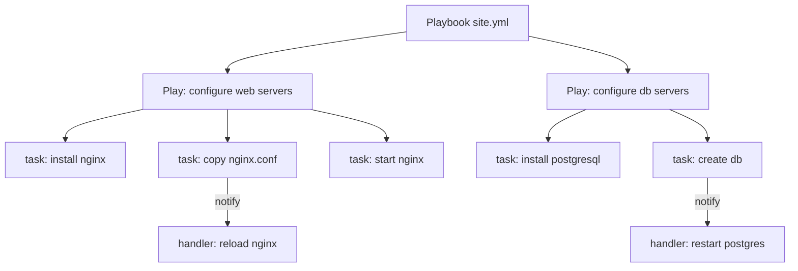

# Ansible Core Concepts

Everything you need to write real playbooks: inventory, plays, tasks, modules, variables, facts, handlers, and Jinja2 templates.

---

## Inventory

The inventory tells Ansible **which hosts** to manage and how to connect to them.

### Static Inventory (INI format)

```ini
# inventory.ini

# Ungrouped host
192.168.1.5

[web]
web01.example.com
web02.example.com ansible_user=ubuntu ansible_port=2222

[db]
db01.example.com
db02.example.com

# Group of groups
[backend:children]
web
db

# Group variables (apply to all hosts in [web])
[web:vars]
ansible_user=ec2-user
nginx_port=80

[all:vars]
ansible_python_interpreter=/usr/bin/python3
```

### Static Inventory (YAML format)

```yaml
# inventory.yml
all:
  vars:
    ansible_python_interpreter: /usr/bin/python3
  children:
    web:
      vars:
        nginx_port: 80
      hosts:
        web01.example.com:
        web02.example.com:
          ansible_user: ubuntu
    db:
      hosts:
        db01.example.com:
        db02.example.com:
```

### Host Variables — host_vars / group_vars

Ansible automatically loads variables from these directories relative to your playbook:

```
project/
├── inventory.ini
├── group_vars/
│   ├── all.yml          # applies to every host
│   ├── web.yml          # applies to [web] group
│   └── db/              # can also be a directory
│       ├── main.yml
│       └── vault.yml    # encrypted secrets
└── host_vars/
    └── web01.example.com.yml   # applies to this host only
```

```yaml
# group_vars/web.yml
nginx_version: "1.25"
nginx_port: 443
ssl_cert_path: /etc/ssl/certs/app.crt
```

### Inventory Patterns

```bash
ansible all          # every host in inventory
ansible web          # group named web
ansible web,db       # union of two groups
ansible web:&db      # intersection (in both groups)
ansible web:!db      # in web but NOT in db
ansible "web[0]"     # first host of web group
ansible "10.0.*"     # glob match on hostname
ansible ~web\d+      # regex match
```

---

## Playbooks

A playbook is a YAML file containing one or more **plays**. Each play maps a set of hosts to a set of tasks.



### Minimal Playbook

```yaml
---
- name: Configure web servers
  hosts: web
  become: true

  tasks:
    - name: Install nginx
      ansible.builtin.apt:
        name: nginx
        state: present
        update_cache: true

    - name: Start and enable nginx
      ansible.builtin.service:
        name: nginx
        state: started
        enabled: true
```

### Full Playbook Structure

```yaml
---
- name: Deploy application                # play name (shown in output)
  hosts: web                              # target group or host pattern
  become: true                            # sudo escalation
  become_user: root
  gather_facts: true                      # run setup module first (default)
  serial: 2                              # rolling update: 2 hosts at a time
  any_errors_fatal: false                # continue other hosts on failure
  max_fail_percentage: 20               # abort if >20% of hosts fail
  environment:                           # env vars for all tasks
    APP_ENV: production
  vars:
    app_port: 8080
  vars_files:
    - group_vars/web.yml
    - vault/secrets.yml

  pre_tasks:
    - name: Wait for connection
      ansible.builtin.wait_for_connection:
        timeout: 60

  roles:
    - common
    - nginx

  tasks:
    - name: Deploy application jar
      ansible.builtin.copy:
        src: app.jar
        dest: /opt/app/app.jar
        owner: appuser
        mode: "0644"
      notify: Restart app service

  post_tasks:
    - name: Verify app responds
      ansible.builtin.uri:
        url: "http://localhost:{{ app_port }}/health"
        status_code: 200

  handlers:
    - name: Restart app service
      ansible.builtin.service:
        name: myapp
        state: restarted
```

---

## Tasks

A task is one unit of work — it calls one module with arguments.

```yaml
tasks:
  - name: Create deploy user            # human-readable name (required, show in output)
    ansible.builtin.user:               # FQCN module name
      name: deploy
      shell: /bin/bash
      groups: docker
      state: present
    register: user_result               # capture output

  - name: Print result
    ansible.builtin.debug:
      var: user_result

  - name: Only run on Ubuntu
    ansible.builtin.apt:
      name: htop
    when: ansible_facts['os_family'] == "Debian"

  - name: Create multiple directories
    ansible.builtin.file:
      path: "{{ item }}"
      state: directory
      mode: "0755"
    loop:
      - /opt/app
      - /opt/logs
      - /opt/config

  - name: Loop over dict
    ansible.builtin.user:
      name: "{{ item.name }}"
      uid: "{{ item.uid }}"
    loop:
      - { name: alice, uid: 2001 }
      - { name: bob, uid: 2002 }

  - name: Task with retries
    ansible.builtin.uri:
      url: http://localhost:8080/health
    register: result
    retries: 5
    delay: 10
    until: result.status == 200

  - name: Ignore errors for optional step
    ansible.builtin.command: /usr/local/bin/optional-setup.sh
    ignore_errors: true

  - name: Run only once across all hosts
    ansible.builtin.command: /usr/local/bin/db-migrate.sh
    run_once: true
    delegate_to: db01.example.com
```

### Task Result Object

`register` captures the module return value:

```yaml
- name: Get file stat
  ansible.builtin.stat:
    path: /etc/app/config.yml
  register: config_stat

- name: Print if file exists
  ansible.builtin.debug:
    msg: "Config exists, size={{ config_stat.stat.size }}"
  when: config_stat.stat.exists
```

Common result keys:

| Key | Meaning |
|-----|---------|
| `result.changed` | Whether module made a change |
| `result.failed` | Whether task failed |
| `result.rc` | Return code (command/shell modules) |
| `result.stdout` | Standard output |
| `result.stderr` | Standard error |
| `result.stdout_lines` | stdout as list of lines |

---

## Modules

Modules are the building blocks. Each is an idempotent action.

### Essential Modules

**File and Package**

```yaml
# apt — Debian/Ubuntu packages
- ansible.builtin.apt:
    name: "{{ packages }}"
    state: present          # present / absent / latest
    update_cache: true
  vars:
    packages:
      - nginx
      - python3-pip

# dnf / yum — RHEL/CentOS
- ansible.builtin.dnf:
    name: httpd
    state: latest

# file — manage files, dirs, symlinks, permissions
- ansible.builtin.file:
    path: /etc/app
    state: directory         # file / directory / link / absent / touch
    owner: app
    group: app
    mode: "0750"

# copy — copy file from control node to remote
- ansible.builtin.copy:
    src: files/nginx.conf
    dest: /etc/nginx/nginx.conf
    owner: root
    mode: "0644"
    backup: true             # keep .bak if file changes

# fetch — copy file FROM remote to control node
- ansible.builtin.fetch:
    src: /var/log/app.log
    dest: ./logs/{{ inventory_hostname }}-app.log
    flat: true

# template — Jinja2 template to remote file
- ansible.builtin.template:
    src: templates/nginx.conf.j2
    dest: /etc/nginx/nginx.conf
    owner: root
    mode: "0644"

# lineinfile — ensure a line exists in a file
- ansible.builtin.lineinfile:
    path: /etc/sysctl.conf
    line: "net.ipv4.ip_forward = 1"
    regexp: "^net.ipv4.ip_forward"
    state: present

# blockinfile — insert/update a block of lines
- ansible.builtin.blockinfile:
    path: /etc/hosts
    block: |
      10.0.1.10 web01
      10.0.1.11 web02
    marker: "# {mark} ANSIBLE MANAGED BLOCK"
```

**Services and System**

```yaml
# service — control systemd/init.d services
- ansible.builtin.service:
    name: nginx
    state: started           # started / stopped / restarted / reloaded
    enabled: true            # enable on boot

# systemd — full systemd control
- ansible.builtin.systemd:
    name: myapp
    state: restarted
    daemon_reload: true      # after unit file change

# user — manage OS users
- ansible.builtin.user:
    name: deploy
    shell: /bin/bash
    home: /home/deploy
    groups: docker,sudo
    state: present
    password: "{{ vault_deploy_password | password_hash('sha512') }}"

# group — manage OS groups
- ansible.builtin.group:
    name: docker
    state: present

# cron — manage cron jobs
- ansible.builtin.cron:
    name: "Daily backup"
    minute: "0"
    hour: "2"
    job: "/usr/local/bin/backup.sh >> /var/log/backup.log 2>&1"
    user: root
```

**Commands and Scripts**

```yaml
# command — run a command (no shell features like | & > )
- ansible.builtin.command:
    cmd: /usr/local/bin/db-init.sh
    creates: /var/lib/app/.initialized   # skip if file exists

# shell — run via /bin/sh (supports pipes, redirects)
- ansible.builtin.shell:
    cmd: "ps aux | grep nginx | wc -l"
  register: nginx_count

# script — copy local script to remote and run it
- ansible.builtin.script:
    cmd: scripts/setup.sh arg1 arg2

# raw — send raw SSH command, no Python needed
- ansible.builtin.raw:
    cmd: yum install -y python3
  when: ansible_facts.get('python') is not defined
```

**Network and Cloud**

```yaml
# uri — HTTP requests
- ansible.builtin.uri:
    url: https://api.example.com/health
    method: GET
    headers:
      Authorization: "Bearer {{ api_token }}"
    status_code: 200
  register: health_response

# get_url — download file from URL
- ansible.builtin.get_url:
    url: https://github.com/org/repo/releases/v1.0/app.tar.gz
    dest: /tmp/app.tar.gz
    checksum: sha256:abc123...

# unarchive — extract tar/zip
- ansible.builtin.unarchive:
    src: /tmp/app.tar.gz
    dest: /opt/app
    remote_src: true          # src is on the remote host
```

---

## Handlers

Handlers are tasks that run **at the end of a play** only if notified. Used for restarts — no need to restart nginx every task, just at the end if any task changed the config.

```yaml
tasks:
  - name: Copy nginx main config
    ansible.builtin.template:
      src: nginx.conf.j2
      dest: /etc/nginx/nginx.conf
    notify: Reload nginx          # triggers handler

  - name: Copy nginx site config
    ansible.builtin.copy:
      src: site.conf
      dest: /etc/nginx/conf.d/site.conf
    notify: Reload nginx          # same handler, only runs once

handlers:
  - name: Reload nginx
    ansible.builtin.service:
      name: nginx
      state: reloaded
```

Key rules:
- Handlers run **once per play**, even if notified multiple times
- Handlers run **in the order defined**, not the order they were notified
- `notify` matches on the handler `name` exactly
- Force handlers to run immediately with `meta: flush_handlers`

```yaml
- name: Force handlers to run now
  ansible.builtin.meta: flush_handlers
```

---

## Variables

Variables can come from many sources. **Precedence** (higher number wins):

```
1.  role defaults (lowest)
2.  inventory group_vars/all
3.  inventory group_vars/<group>
4.  inventory host_vars/<host>
5.  playbook group_vars/all
6.  playbook group_vars/<group>
7.  playbook host_vars/<host>
8.  host facts / set_facts
9.  play vars
10. play vars_prompt
11. play vars_files
12. role vars
13. block vars
14. task vars
15. include_vars
16. set_facts / registered vars
17. role/include params
18. extra vars -e "key=val"    (highest)
```

**Extra vars always win** — use `-e` for environment-specific overrides.

### Variable Types and Usage

```yaml
vars:
  # Scalar
  app_port: 8080
  app_name: "myapp"

  # List
  packages:
    - nginx
    - python3
    - git

  # Dict
  db_config:
    host: db.internal
    port: 5432
    name: appdb

tasks:
  - name: Use scalar
    ansible.builtin.debug:
      msg: "Port is {{ app_port }}"

  - name: Use list
    ansible.builtin.apt:
      name: "{{ packages }}"

  - name: Use dict key
    ansible.builtin.debug:
      msg: "DB at {{ db_config.host }}:{{ db_config.port }}"
      # or: {{ db_config['host'] }}

  - name: Set fact dynamically
    ansible.builtin.set_fact:
      deploy_timestamp: "{{ ansible_date_time.iso8601 }}"
```

### vars_prompt — Interactive Input

```yaml
vars_prompt:
  - name: db_password
    prompt: "Enter database password"
    private: true            # hides input
    confirm: true            # asks twice

  - name: env
    prompt: "Environment (dev/staging/prod)"
    default: dev
```

---

## Facts

Facts are variables about the remote host, gathered automatically at play start via the `setup` module.

```bash
# See all facts for a host
ansible web01 -m setup
ansible web01 -m setup -a "filter=ansible_distribution*"
```

### Commonly Used Facts

```yaml
ansible_facts['distribution']          # "Ubuntu", "CentOS", "Amazon"
ansible_facts['distribution_version']  # "22.04"
ansible_facts['os_family']             # "Debian", "RedHat"
ansible_facts['hostname']              # short hostname
ansible_facts['fqdn']                  # fully qualified
ansible_facts['default_ipv4']['address']  # primary IP
ansible_facts['memtotal_mb']           # total RAM in MB
ansible_facts['processor_count']       # CPU count
ansible_facts['architecture']          # "x86_64"
ansible_facts['env']['HOME']           # env variables
ansible_facts['mounts']               # mounted filesystems
ansible_facts['interfaces']           # network interfaces
```

### Using Facts in Conditionals

```yaml
tasks:
  - name: Install on Debian family
    ansible.builtin.apt:
      name: nginx
    when: ansible_facts['os_family'] == "Debian"

  - name: Install on RedHat family
    ansible.builtin.dnf:
      name: nginx
    when: ansible_facts['os_family'] == "RedHat"

  - name: Apply only if enough RAM
    ansible.builtin.include_role:
      name: elasticsearch
    when: ansible_facts['memtotal_mb'] >= 4096
```

### Custom Facts

Create `/etc/ansible/facts.d/app.fact` on the remote host:

```ini
[app]
version=2.5.1
environment=production
```

Access as: `ansible_local['app']['app']['version']`

### Disabling Fact Gathering

```yaml
- hosts: web
  gather_facts: false          # skip setup module, faster for large fleets

  tasks:
    - name: Quick task that needs no facts
      ansible.builtin.ping:
```

---

## Jinja2 Templates

Ansible uses Jinja2 for variable interpolation and template rendering.

### Template File Example

```jinja2
{# templates/nginx.conf.j2 #}
user {{ nginx_user | default('www-data') }};
worker_processes {{ ansible_facts['processor_count'] }};

error_log /var/log/nginx/error.log warn;
pid /var/run/nginx.pid;

events {
    worker_connections {{ nginx_worker_connections | default(1024) }};
}

http {
    server_name {{ inventory_hostname }};

    
    listen {{ port }};
    

    
    ssl_certificate {{ ssl_cert_path }};
    ssl_certificate_key {{ ssl_key_path }};
    

    location / {
        proxy_pass http://localhost:{{ app_port }};
        proxy_set_header Host $host;
    }
}
```

### Common Jinja2 Filters

```yaml
# String manipulation
"{{ 'hello world' | upper }}"             # HELLO WORLD
"{{ app_name | replace('-', '_') }}"
"{{ hostname | truncate(10) }}"

# Default values
"{{ timeout | default(30) }}"
"{{ config | default({}) }}"

# Type conversion
"{{ '5' | int }}"                         # 5 (integer)
"{{ 5 | string }}"                        # "5"
"{{ '[1,2,3]' | from_json }}"

# List operations
"{{ packages | join(', ') }}"
"{{ items | length }}"
"{{ list | sort }}"
"{{ list | unique }}"
"{{ list | select('match', 'web.*') | list }}"

# Dict operations
"{{ config | dict2items }}"
"{{ items | items2dict }}"
"{{ config | combine({'port': 443}) }}"   # merge dicts

# Path / file
"{{ '/etc/nginx/nginx.conf' | dirname }}" # /etc/nginx
"{{ '/etc/nginx/nginx.conf' | basename }}"# nginx.conf

# Hashing (for passwords)
"{{ plain_password | password_hash('sha512') }}"

# Ternary
"{{ 'enabled' if ssl_enabled else 'disabled' }}"

# Ansible-specific
"{{ hostvars['web01']['ansible_host'] }}" # facts from another host
"{{ groups['web'] }}"                      # list of hosts in group
"{{ groups['web'] | first }}"             # first host in group
```

### Conditionals in Playbooks

```yaml
when: condition                           # run task only when true
when:
  - condition1                            # AND
  - condition2

when: condition1 or condition2            # OR
when: not condition                       # NOT
when: var is defined
when: var is not defined
when: var is none
when: list | length > 0
when: "'substring' in string_var"
```

---

## Blocks — Grouping Tasks with Error Handling

```yaml
tasks:
  - name: Deploy with error handling
    block:
      - name: Deploy app
        ansible.builtin.copy:
          src: app.jar
          dest: /opt/app/app.jar

      - name: Restart app
        ansible.builtin.service:
          name: myapp
          state: restarted

    rescue:
      - name: Roll back on failure
        ansible.builtin.copy:
          src: app-previous.jar
          dest: /opt/app/app.jar

      - name: Alert on failure
        ansible.builtin.uri:
          url: "{{ slack_webhook }}"
          method: POST
          body_format: json
          body:
            text: "Deploy failed on {{ inventory_hostname }}"

    always:
      - name: Clean up temp files
        ansible.builtin.file:
          path: /tmp/deploy
          state: absent
```

---

## include and import

`import_*` — static, parsed at playbook load time (compile time). Better for most cases.  
`include_*` — dynamic, evaluated at runtime. Required when the file path uses a variable.

```yaml
# import tasks (static)
- name: Include common setup tasks
  ansible.builtin.import_tasks: tasks/common.yml

# include tasks (dynamic — path from variable)
- name: Include environment tasks
  ansible.builtin.include_tasks: "tasks/{{ env }}.yml"

# import playbook
- name: Import database playbook
  ansible.builtin.import_playbook: db.yml

# import role (static)
- name: Apply nginx role
  ansible.builtin.import_role:
    name: nginx

# include role (dynamic)
- name: Apply role conditionally
  ansible.builtin.include_role:
    name: "{{ selected_role }}"
  when: selected_role is defined
```

---

## Read Next

- [cloud-integration.md](./cloud-integration.md) — AWS SSM, GCP IAP, dynamic inventory
- [advanced.md](./advanced.md) — Roles, Vault, collections, performance, testing
