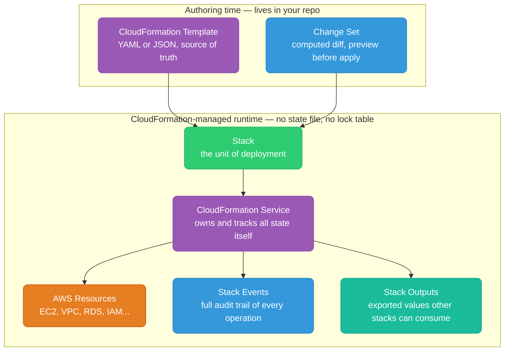
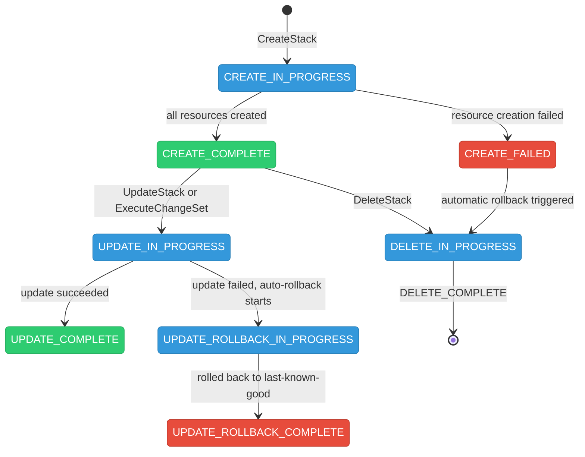
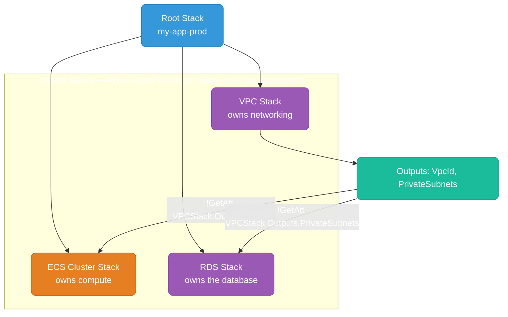
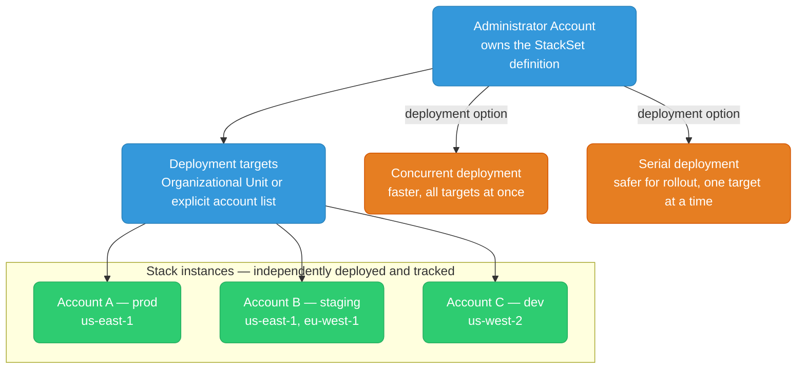

# AWS CloudFormation

CloudFormation is AWS's native IaC service. Unlike Terraform, state is fully managed by AWS — no state files to backup, no DynamoDB lock tables. Deep integration with every AWS service.

<div class="quiz-progress" data-quiz-progress>
  <span class="quiz-progress-label">0/0 checks</span>
  <span class="quiz-progress-bar"><span class="quiz-progress-fill"></span></span>
</div>

---

## Architecture



<div class="quiz-card">
  <p class="quiz-q">Unlike Terraform, CloudFormation has no <code>.tfstate</code> file and no DynamoDB lock table. So what tracks whether a resource is "managed" and what its current values are?</p>
  <button class="quiz-reveal">Reveal answer</button>
  <div class="quiz-a" hidden>The CloudFormation Service itself — it's the thing in the middle of the diagram that owns the Stack's state, not a file sitting in S3 that you have to protect from concurrent writes. There's nothing to back up and nothing to lock; the state, the events audit trail, and the exported Outputs all live inside the managed service.</div>
</div>

---

## Stack Lifecycle



**Rollback behavior:** If any resource fails during stack creation or update, CloudFormation automatically rolls back all changes in that operation. You see `ROLLBACK_COMPLETE` — all changes are undone.

<div class="quiz-card">
  <p class="quiz-q">A <code>CreateStack</code> operation fails after 3 of 5 resources have already been created. You go check the AWS console a minute later — what do you find?</p>
  <button class="quiz-reveal">Reveal answer</button>
  <div class="quiz-a" hidden>Nothing left running. CloudFormation automatically rolls back <em>all</em> changes made during that operation, including the 3 resources that had already succeeded — you don't end up with a half-provisioned stack. The stack shows <code>ROLLBACK_COMPLETE</code>, meaning everything from that attempt was undone, not partially applied.</div>
</div>

---

## Template Structure

```yaml
AWSTemplateFormatVersion: "2010-09-09"
Description: "My application stack"

Parameters:
  Environment:
    Type: String
    AllowedValues: [dev, staging, prod]
    Default: dev
  InstanceType:
    Type: String
    Default: t3.micro

Mappings:
  EnvToAMI:
    us-east-1:
      prod: ami-0abcdef1234567890
      dev:  ami-0fedcba9876543210

Conditions:
  IsProd: !Equals [!Ref Environment, prod]

Resources:
  WebServer:
    Type: AWS::EC2::Instance
    Properties:
      InstanceType: !Ref InstanceType
      ImageId: !FindInMap [EnvToAMI, !Ref AWS::Region, !Ref Environment]
      Tags:
        - Key: Environment
          Value: !Ref Environment

  # Conditional resource — only created in prod
  BackupBucket:
    Type: AWS::S3::Bucket
    Condition: IsProd
    Properties:
      BucketName: !Sub "${AWS::StackName}-backup-${AWS::AccountId}"

Outputs:
  WebServerPublicIP:
    Value: !GetAtt WebServer.PublicIp
    Export:
      Name: !Sub "${AWS::StackName}-WebServerIP"
```

**Intrinsic functions:**

| Function | Use |
|----------|-----|
| `!Ref` | Reference parameter or resource logical ID |
| `!GetAtt` | Get attribute of a resource (`!GetAtt MyBucket.Arn`) |
| `!Sub` | String substitution (`!Sub "arn:aws:s3:::${BucketName}/*"`) |
| `!FindInMap` | Look up value in Mappings |
| `!If` | Conditional value based on Condition |
| `!ImportValue` | Import output exported by another stack |
| `!Join` | Join strings (`!Join [":", [a, b, c]]` → `a:b:c`) |
| `!Select` | Select by index from a list |

<div class="quiz-card">
  <p class="quiz-q">Stack B needs the VPC ID that Stack A's template exports as an Output. Which intrinsic function does Stack B actually use to read it — and why won't <code>!Ref</code> work here?</p>
  <button class="quiz-reveal">Reveal answer</button>
  <div class="quiz-a" hidden><code>!ImportValue</code> — it's specifically for importing an output exported by <em>another</em> stack. <code>!Ref</code> only resolves parameters or resource logical IDs that exist inside the <em>same</em> template being evaluated; it has no way to reach across stack boundaries.</div>
</div>

---

## Change Sets

Change sets are CloudFormation's equivalent of `terraform plan` — preview what will happen before executing.

```mermaid
sequenceDiagram
    participant Dev as Developer or CI
    participant CFN as CloudFormation Service
    participant Res as Live AWS Resources

    Dev->>CFN: CreateChangeSet — new template + existing stack name
    CFN->>CFN: Compute diff, current stack state vs new template
    CFN-->>Dev: Change set ready — list of Add, Modify, Remove entries

    rect rgb(40, 60, 90)
    Note over Dev,CFN: Nothing on AWS has been touched yet
    Dev->>Dev: Review the diff, look for any Replacement = True
    end

    Dev->>CFN: ExecuteChangeSet
    CFN->>Res: Apply the create, update, delete operations
    Res-->>CFN: Resource operations succeed or fail
    CFN-->>Dev: Stack reaches UPDATE_COMPLETE, or auto-rollback begins
```



```bash
# Create a change set
aws cloudformation create-change-set \
  --stack-name my-stack \
  --template-body file://template.yaml \
  --change-set-name my-changes \
  --parameters ParameterKey=Environment,ParameterValue=prod

# Review the change set
aws cloudformation describe-change-set \
  --stack-name my-stack \
  --change-set-name my-changes

# Execute (actually apply)
aws cloudformation execute-change-set \
  --stack-name my-stack \
  --change-set-name my-changes
```

Walking through that same lifecycle one stage at a time:

<div class="stepper">
  <div class="stepper-panels">
    <div class="stepper-panel active">
      <strong>1. Create the change set.</strong> Submit the new template plus
      the existing stack name via <code>create-change-set</code>. CloudFormation
      computes a diff against the live stack — no resources are touched by this
      step, it's pure comparison.
    </div>
    <div class="stepper-panel">
      <strong>2. Review the diff.</strong> <code>describe-change-set</code>
      lists every affected resource as an add, an in-place update, or a
      removal. This is the moment to look specifically for
      <code>Replacement: true</code> entries before going any further.
    </div>
    <div class="stepper-panel">
      <strong>3. Execute the change set.</strong> <code>execute-change-set</code>
      applies exactly the diff that was reviewed — nothing more — to the real
      resources. The stack transitions to <code>UPDATE_COMPLETE</code>, or
      automatically rolls back if a resource operation fails partway through.
    </div>
  </div>
  <div class="stepper-controls">
    <button class="stepper-prev">← Prev</button>
    <span class="stepper-dots"></span>
    <span class="stepper-label"></span>
    <button class="stepper-next">Next →</button>
  </div>
</div>

**Replacement vs Update:** Change sets show if a change requires replacement (resource destroyed and recreated) vs in-place update. A replacement of an RDS instance = data loss risk — the change set warns you.

<div class="quiz-card">
  <p class="quiz-q">Your change set flags an RDS instance property change with <code>Replacement: true</code>. What does that actually mean will happen if you execute it — and why is that the one line in the diff worth stopping on?</p>
  <button class="quiz-reveal">Reveal answer</button>
  <div class="quiz-a" hidden>The existing RDS instance gets destroyed and a brand-new one created in its place, rather than updated in place — for a stateful resource like a database, that's a data-loss risk, not just a blip. The change set exists specifically to surface this <em>before</em> you execute, so you can catch it instead of finding out during a production update.</div>
</div>

---

## Nested Stacks

Break large templates into smaller reusable components using `AWS::CloudFormation::Stack`.



```yaml
Resources:
  VPCStack:
    Type: AWS::CloudFormation::Stack
    Properties:
      TemplateURL: https://s3.amazonaws.com/my-bucket/vpc.yaml
      Parameters:
        CIDR: "10.0.0.0/16"

  ECSStack:
    Type: AWS::CloudFormation::Stack
    Properties:
      TemplateURL: https://s3.amazonaws.com/my-bucket/ecs.yaml
      Parameters:
        VpcId: !GetAtt VPCStack.Outputs.VpcId
        SubnetIds: !GetAtt VPCStack.Outputs.PrivateSubnets
```

**Cross-stack references (alternative to nested stacks):**

```yaml
# Stack A exports
Outputs:
  VpcId:
    Export:
      Name: my-app-prod-VpcId
    Value: !Ref VPC

# Stack B imports
Resources:
  Subnet:
    Properties:
      VpcId: !ImportValue my-app-prod-VpcId
```

Cross-stack references create a hard dependency — you cannot delete Stack A while Stack B imports its value.

<div class="quiz-card">
  <p class="quiz-q">Stack A exports <code>VpcId</code> and Stack B imports it with <code>!ImportValue</code>. You need to delete Stack A — can you, while Stack B is still running?</p>
  <button class="quiz-reveal">Reveal answer</button>
  <div class="quiz-a" hidden>No. Cross-stack references create a hard dependency — CloudFormation blocks the delete (and blocks removing that export) for as long as any other stack still imports the value. You'd have to remove or update Stack B's dependency on that import first.</div>
</div>

---

## StackSets

Deploy a single CloudFormation template across **multiple AWS accounts and/or regions** from one operation.



**Use cases:**
- Deploy security baselines (CloudTrail, GuardDuty, Config Rules) to all accounts
- Enforce IAM password policy across an organization
- Deploy shared networking (Transit Gateway attachments) to all accounts

```bash
aws cloudformation create-stack-set \
  --stack-set-name security-baseline \
  --template-body file://baseline.yaml \
  --capabilities CAPABILITY_NAMED_IAM

aws cloudformation create-stack-instances \
  --stack-set-name security-baseline \
  --deployment-targets OrganizationalUnitIds=["ou-xxxx-yyyyyyy"] \
  --regions us-east-1 eu-west-1
```

<div class="quiz-card">
  <p class="quiz-q">You're rolling a StackSet update out to 40 accounts. Concurrent deployment is faster — so why would you deliberately choose Serial instead?</p>
  <button class="quiz-reveal">Reveal answer</button>
  <div class="quiz-a" hidden>Serial is the safer option specifically for a rollout: deploying one account (or a small batch) at a time means a bad template change or a broken assumption in one account's environment surfaces early, before it's been pushed to all 40. Concurrent trades that safety margin for speed — fine for a well-tested baseline, risky for something you're not fully confident in yet.</div>
</div>

---

## Nested Stacks vs StackSets: Which One?

Both let you reuse the same CloudFormation template in more than one place, but they solve different composition problems — one splits a single deployment into parts, the other replicates one template across many independent targets.

<div class="tab-group">
  <div class="tab-buttons">
    <button data-tab="nested" class="active">Nested Stacks</button>
    <button data-tab="stacksets">StackSets</button>
  </div>
  <div class="tab-panels">
    <div class="tab-panel active" data-tab-panel="nested">
      Break one large template into smaller reusable components (VPC, ECS
      cluster, RDS) using <code>AWS::CloudFormation::Stack</code> — everything
      deploys together as part of a single root stack, in one account and one
      region. Child stacks pass data to each other through Outputs: the VPC
      stack exports <code>VpcId</code> and <code>PrivateSubnets</code>, and
      the ECS/RDS stacks read them via
      <code>!GetAtt VPCStack.Outputs.VpcId</code> — all resolved inside the
      one root <code>CreateStack</code>/<code>UpdateStack</code> operation.
    </div>
    <div class="tab-panel" data-tab-panel="stacksets">
      Deploy that same template as many independent stack instances across
      multiple AWS accounts and/or regions from a single operation, run by an
      administrator account targeting an Organizational Unit or an explicit
      account list. It's the fit for things every account needs — a
      CloudTrail/GuardDuty/Config baseline, a password policy, shared
      Transit Gateway attachments — rolled out Concurrently (faster) or
      Serially (safer, since only some accounts are hit before you can catch
      a bad rollout).
    </div>
  </div>
</div>

---

## Drift Detection

```bash
# Detect drift on a stack
aws cloudformation detect-stack-drift --stack-name my-stack

# Check drift status
aws cloudformation describe-stack-drift-detection-status \
  --stack-drift-detection-id <detection-id>

# See which resources drifted and how
aws cloudformation describe-stack-resource-drifts \
  --stack-name my-stack \
  --stack-resource-drift-status-filters MODIFIED DELETED
```

CFN drift detection compares the current live resource configuration against what the template defines. Drifted resources show `MODIFIED` or `DELETED`.

**Fix:** Remediate by either updating the template to match reality and re-deploying, or manually fixing the resource to match the template.

<div class="quiz-card">
  <p class="quiz-q">Someone manually deletes a resource that CloudFormation manages, outside of any stack update. What does <code>describe-stack-resource-drifts</code> report, and what are your two options to fix it?</p>
  <button class="quiz-reveal">Reveal answer</button>
  <div class="quiz-a" hidden>It reports <code>DELETED</code> status for that resource. To fix it: either update the template to match the new reality and redeploy (e.g. remove that resource so CloudFormation stops expecting it), or manually recreate/fix the resource so it matches what the template still declares — same two remediation paths as any other drift.</div>
</div>

---

## Custom Resources

When CloudFormation doesn't natively support a resource type, use Custom Resources backed by Lambda.

```mermaid
sequenceDiagram
    participant CFN as CloudFormation
    participant Lambda as Lambda Function
    participant Resource as External Resource or API

    CFN->>Lambda: Invoke with Create, Update, or Delete event plus ResourceProperties
    Lambda->>Resource: Create, update, or delete the external thing
    Resource-->>Lambda: Success or failure

    rect rgb(40, 60, 90)
    Note over Lambda,CFN: Response is not a Lambda return value —<br/>it is sent to a pre-signed S3 URL from the event
    Lambda->>CFN: Send response — SUCCESS or FAILED — to PreSignedUrl
    end

    CFN->>CFN: Continue the stack operation based on that response
```



```yaml
Resources:
  # Lambda function that handles the custom logic
  MyCustomResourceFunction:
    Type: AWS::Lambda::Function
    Properties:
      Handler: index.handler
      Runtime: python3.12
      Code:
        ZipFile: |
          import boto3, cfnresponse
          def handler(event, context):
            if event['RequestType'] == 'Create':
              # do something with event['ResourceProperties']
              cfnresponse.send(event, context, cfnresponse.SUCCESS, {'OutputKey': 'value'})

  # The custom resource that triggers the Lambda
  MyCustomResource:
    Type: Custom::MyResource
    Properties:
      ServiceToken: !GetAtt MyCustomResourceFunction.Arn
      MyParam: "some-value"

# Use the output
Outputs:
  CustomOutput:
    Value: !GetAtt MyCustomResource.OutputKey
```

**Common use cases:** DNS record creation in external providers, database schema initialization, Slack/PagerDuty notifications on stack events, resource types not yet in CloudFormation.

<div class="quiz-card">
  <p class="quiz-q">The sequence diagram shows the Lambda sending its response to a "PreSignedUrl" instead of just returning a value from the function. Why does <code>cfnresponse.send(...)</code> exist at all — what happens to the stack operation if the Lambda code forgets to call it?</p>
  <button class="quiz-reveal">Reveal answer</button>
  <div class="quiz-a" hidden>CloudFormation doesn't read a Lambda return value for a custom resource — it reads whatever gets sent to that pre-signed S3 URL that was included in the invocation event. That's the only channel CloudFormation has for learning whether the Create/Update/Delete actually succeeded. If the Lambda finishes its work but never calls <code>cfnresponse.send(...)</code>, CloudFormation never receives SUCCESS or FAILED and the stack operation is left waiting on a response that's never coming.</div>
</div>
