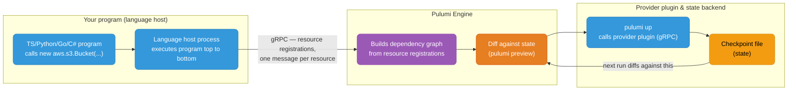
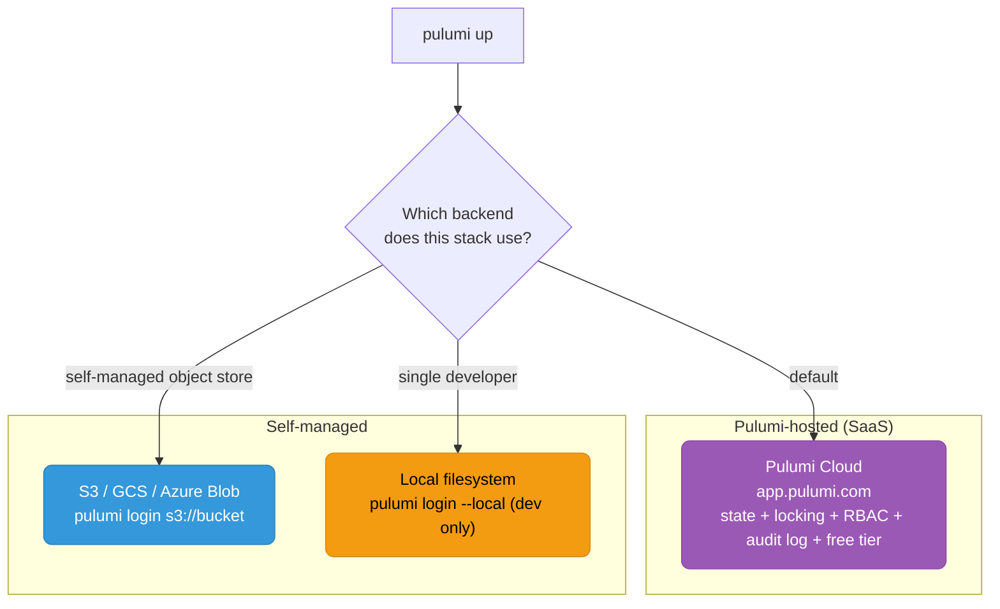
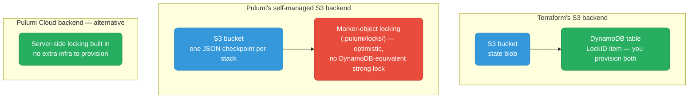
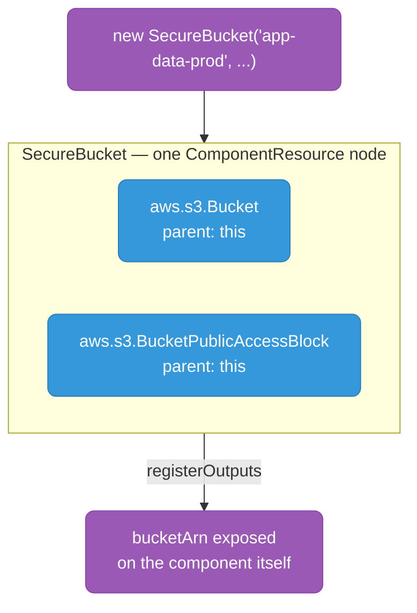
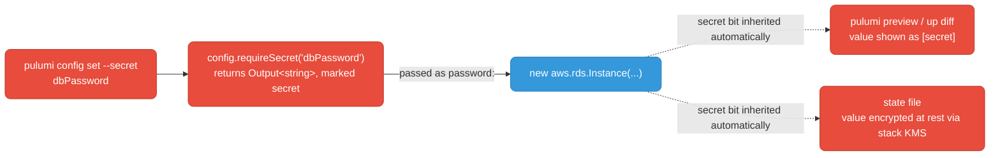

# Pulumi

Infrastructure as Code using real programming languages (TypeScript, Python, Go, C#, Java) instead of a DSL. Same declarative resource-graph model as Terraform, different authoring layer.

<div class="quiz-progress" data-quiz-progress>
  <span class="quiz-progress-label">0/0 checks</span>
  <span class="quiz-progress-bar"><span class="quiz-progress-fill"></span></span>
</div>

---

## 1. What Pulumi Is

Pulumi is not a new paradigm — it's Terraform's declarative resource graph + state model, wired to a general-purpose language runtime instead of HCL. You write a normal program; the Pulumi SDK intercepts resource declarations and builds a dependency graph, computes a diff against state, and calls cloud provider APIs to reconcile.



<div class="stepper">
  <div class="stepper-panels">
    <div class="stepper-panel active">
      <strong>1. Program runs.</strong> The language host executes your TS/Python/Go/C# program top to bottom like any normal script. <code>new aws.s3.Bucket(...)</code> just registers an intent — it does not touch AWS yet.
    </div>
    <div class="stepper-panel">
      <strong>2. Registrations stream to the engine.</strong> Every resource declaration is sent to the Pulumi Engine over gRPC as the program executes, and the engine assembles them into a dependency graph.
    </div>
    <div class="stepper-panel">
      <strong>3. Diff against state.</strong> <code>pulumi preview</code> compares that graph against the last checkpoint and reports what would change — creates, updates, deletes — without calling any cloud API yet.
    </div>
    <div class="stepper-panel">
      <strong>4. Apply.</strong> <code>pulumi up</code> walks the graph in dependency order and calls the relevant provider plugin (also over gRPC) for each resource that needs to change.
    </div>
    <div class="stepper-panel">
      <strong>5. Checkpoint written.</strong> As each resource is reconciled, the engine writes the new checkpoint to state — exactly what the next <code>pulumi preview</code> will diff against.
    </div>
  </div>
  <div class="stepper-controls">
    <button class="stepper-prev">← Prev</button>
    <span class="stepper-dots"></span>
    <span class="stepper-label"></span>
    <button class="stepper-next">Next →</button>
  </div>
</div>

<div class="quiz-card">
  <p class="quiz-q">Because Pulumi runs a normal imperative TypeScript/Python/Go program instead of a declarative DSL, does it skip the dependency-graph-and-state model Terraform relies on?</p>
  <button class="quiz-reveal">Reveal answer</button>
  <div class="quiz-a" hidden>No — Pulumi is not a new paradigm. It's Terraform's declarative resource graph and state model, wired to a general-purpose language runtime instead of HCL. The engine still builds a dependency graph from resource registrations, still diffs it against a checkpoint before every apply, and still calls provider plugins to reconcile. Only the authoring layer changed; the underlying graph-and-state architecture is the same.</div>
</div>

**Key architectural difference from Terraform:**

| | Terraform | Pulumi |
|---|-----------|--------|
| Authoring language | HCL (declarative DSL) | TypeScript, Python, Go, C#, Java, YAML |
| Execution model | HCL parsed → graph built by `terraform` binary | Your program runs, registers resources via gRPC to the Pulumi engine |
| Loops/conditionals | `count`, `for_each`, `dynamic` blocks (limited expressiveness) | Native `for`, `if`, functions, classes — full language power |
| Provider model | Providers are Go binaries speaking Terraform's plugin protocol | Providers are Go binaries speaking Pulumi's plugin protocol (many are auto-generated bridges *from* Terraform providers) |
| State model | `.tfstate` JSON, resource graph + attributes | Checkpoint file, same fundamental shape (resource graph + attributes) |
| Testing | `terraform plan` diff review, `terraform test`, Terratest (external) | Native unit tests with mocks, in the same language as your infra code |

Under the hood, roughly 90% of Pulumi's AWS/Azure/GCP providers are **generated from the equivalent Terraform provider** via a bridge (`pulumi-terraform-bridge`). This matters practically: Pulumi's provider *behavior* (including some bugs) inherits from Terraform's provider, but the provider *ecosystem breadth* still lags Terraform's because niche/community Terraform providers often have no Pulumi equivalent.

---

## 2. State Management

Same conceptual state file as Terraform (resource URNs, inputs, outputs, dependency graph), different backend defaults.



| Backend | Locking | Secrets encryption | Team collab | Notes |
|---------|---------|---------------------|-------------|-------|
| Pulumi Cloud (default) | Built-in (server-side) | Pulumi-managed KMS per stack, or bring-your-own (AWS KMS/Azure Key Vault/GCP KMS/HashiCorp Vault) | Full RBAC, policy packs, audit trail | Free tier for individuals; paid for teams |
| S3 self-managed | **No native locking** — uses `.pulumi/locks/` marker objects, race-prone under heavy concurrent CI without external coordination | You configure the KMS key yourself via `pulumi stack change-secrets-provider` | DIY — no built-in RBAC | Closest analog to Terraform's S3 backend |
| Local | None | Passphrase-based, weakest | None | `pulumi login --local`, single-dev only |

**Comparison to Terraform's S3+DynamoDB pattern:**



If you self-host state in S3 and skip Pulumi Cloud, you lose the locking guarantee Terraform gets from DynamoDB conditional writes. This is the single biggest reason teams that self-manage Terraform state end up on Pulumi Cloud rather than replicating an S3-only setup.

<div class="toggle-switch">
  <div class="toggle-buttons">
    <button data-toggle-opt="cloud" class="active state-ok">Pulumi Cloud (default)</button>
    <button data-toggle-opt="s3" class="state-warn">Self-managed S3</button>
  </div>
  <div class="toggle-panel active" data-toggle-panel="cloud">
    <pre><code># Pulumi Cloud (default)
pulumi login              # opens browser, uses app.pulumi.com
pulumi stack init myorg/myproject/prod</code></pre>
    Locking, RBAC, and secret encryption come for free — no extra infrastructure to provision or maintain.
  </div>
  <div class="toggle-panel" data-toggle-panel="s3">
    <pre><code># Self-managed S3 backend
pulumi login s3://my-pulumi-state-bucket
pulumi stack init prod
pulumi stack change-secrets-provider "awskms://alias/pulumi-secrets?region=us-east-1"</code></pre>
    You provision the bucket and the KMS key yourself, and accept marker-based (not DynamoDB-grade) locking — race-prone under heavy concurrent CI without external coordination.
  </div>
</div>

**State file shape** (conceptually identical to `.tfstate`):

```json
{
  "version": 3,
  "deployment": {
    "resources": [
      {
        "urn": "urn:pulumi:prod::my-project::aws:s3/bucket:Bucket::app-data",
        "type": "aws:s3/bucket:Bucket",
        "inputs": { "bucket": "my-app-data-prod" },
        "outputs": { "arn": "arn:aws:s3:::my-app-data-prod", "id": "my-app-data-prod" },
        "dependencies": []
      }
    ]
  }
}
```

<div class="quiz-card">
  <p class="quiz-q">A team migrates its Terraform S3+DynamoDB backend straight to Pulumi's self-managed S3 backend (<code>pulumi login s3://...</code>). Do they get the same locking guarantee for free?</p>
  <button class="quiz-reveal">Reveal answer</button>
  <div class="quiz-a" hidden>No. Pulumi's self-managed S3 backend has no native locking — it uses <code>.pulumi/locks/</code> marker objects, which is optimistic and race-prone under heavy concurrent CI, with no DynamoDB-equivalent conditional-write lock. The only way to get a real server-side lock "for free" the way DynamoDB provided one is to use the Pulumi Cloud backend instead of self-hosting in S3 alone.</div>
</div>

---

## 3. Core Concepts

| Concept | Terraform equivalent | Description |
|---------|----------------------|--------------|
| **Project** | Root module / repo | A directory with `Pulumi.yaml` — defines runtime (nodejs/python/go) and project name |
| **Stack** | Workspace | An isolated deployment instance of a project (`dev`, `staging`, `prod`) — own state, own config |
| **Config** | `.tfvars` | Per-stack key/value settings (`pulumi config set aws:region us-east-1`), stored in `Pulumi.<stack>.yaml` |
| **Resource** | `resource` block | A cloud object declaration (`new aws.s3.Bucket(...)`) |
| **Input** | Resource argument | A value you pass into a resource — may be a plain value or an `Output<T>` from another resource |
| **Output** | Resource attribute / `depends_on` inference | A value produced by a resource, only known after `pulumi up`. Wrapped in `Output<T>` |

### `Output<T>` — why it exists

Terraform resolves the dependency graph implicitly by parsing HCL references (`aws_s3_bucket.foo.arn` creates an implicit `depends_on`). Pulumi runs your program as an ordinary imperative script *before* any resource actually exists — at the time `new aws.s3.Bucket(...)` returns, the bucket hasn't been created yet, so its ARN literally cannot be a plain string.

`Output<T>` is a promise-like container that:
1. Tracks which resource(s) it depends on (for graph construction)
2. Resolves to the real value only after the engine applies the resource
3. Composes via `.apply()` (like `.then()` on a Promise) so downstream resources can depend on values that don't exist yet

```typescript
import * as aws from "@pulumi/aws";
import * as pulumi from "@pulumi/pulumi";

const bucket = new aws.s3.Bucket("app-data");

// bucket.arn is Output<string>, NOT string — bucket doesn't exist yet at this line
const policy = bucket.arn.apply(arn => JSON.stringify({
  Version: "2012-10-17",
  Statement: [{ Effect: "Allow", Action: "s3:GetObject", Resource: `${arn}/*` }],
}));

// pulumi.all() combines multiple Outputs, like Promise.all()
const summary = pulumi.all([bucket.bucket, bucket.arn]).apply(
  ([name, arn]) => `Bucket ${name} at ${arn}`
);

export const bucketSummary = summary; // exported Outputs become stack outputs
```

**Watching an `Output<T>` resolve, step by step** — using the `bucket.arn` example above:

<div class="stepper">
  <div class="stepper-panels">
    <div class="stepper-panel active">
      <strong>1. The program executes synchronously.</strong> <code>new aws.s3.Bucket("app-data")</code> returns immediately — the bucket does not exist in AWS at this point in time.
    </div>
    <div class="stepper-panel">
      <strong>2. <code>bucket.arn</code> comes back as <code>Output&lt;string&gt;</code>, not <code>string</code>.</strong> It's a promise-like container that already records one fact: this value depends on the bucket resource.
    </div>
    <div class="stepper-panel">
      <strong>3. The engine builds the graph and applies it.</strong> Using the dependency it recorded in step 2, the engine diffs against state and calls the AWS provider to actually create the bucket.
    </div>
    <div class="stepper-panel">
      <strong>4. The provider confirms creation.</strong> Only now does the engine have a real ARN string — it resolves the <code>Output&lt;T&gt;</code>'s underlying value.
    </div>
    <div class="stepper-panel">
      <strong>5. The <code>.apply()</code> callback fires.</strong> <code>arn => JSON.stringify(...)</code> runs with the real ARN, and any resource that depends on <code>policy</code> can now proceed in turn.
    </div>
  </div>
  <div class="stepper-controls">
    <button class="stepper-prev">← Prev</button>
    <span class="stepper-dots"></span>
    <span class="stepper-label"></span>
    <button class="stepper-next">Next →</button>
  </div>
</div>

**Common footgun:** trying to use an `Output<T>` where a plain value is expected (e.g., string concatenation, `if` conditions on unresolved values) fails at compile time in typed languages — which is actually a feature. Terraform's equivalent mistake (referencing an unknown-until-apply value in a context requiring a known value) fails at `plan` time instead, with a less specific error.

<div class="quiz-card">
  <p class="quiz-q">A Terraform config referencing an unknown-until-apply value where a known value is required fails at <code>plan</code> time. When does the equivalent mistake in Pulumi — using an <code>Output&lt;T&gt;</code> where a plain value is expected — get caught?</p>
  <button class="quiz-reveal">Reveal answer</button>
  <div class="quiz-a" hidden>At compile time, in typed languages — before the program even runs, let alone reaches the engine. This is actually a feature: Pulumi's type system statically flags the mistake, versus Terraform's less specific plan-time error surfaced only when the plan runs.</div>
</div>

---

## 4. Side-by-Side: S3 Bucket + IAM Role

The same infrastructure — an encrypted, public-access-blocked S3 bucket plus a Lambda IAM role scoped to it — expressed in each tool. Flip between them to see where the shapes match and where they diverge.

<div class="tab-group">
  <div class="tab-buttons">
    <button data-tab="pulumi-code" class="active">Pulumi (TypeScript)</button>
    <button data-tab="tf-code">Terraform (HCL)</button>
  </div>
  <div class="tab-panels">
    <div class="tab-panel active" data-tab-panel="pulumi-code">
      <pre><code>import * as aws from "@pulumi/aws";
import * as pulumi from "@pulumi/pulumi";

const config = new pulumi.Config();
const environment = config.require("environment"); // pulumi config set environment prod

// S3 bucket
const bucket = new aws.s3.Bucket("app-data", {
  bucket: `my-app-data-${environment}`,
  versioning: { enabled: true },
  serverSideEncryptionConfiguration: {
    rule: { applyServerSideEncryptionByDefault: { sseAlgorithm: "aws:kms" } },
  },
  tags: { Environment: environment, ManagedBy: "pulumi" },
});

// Block public access (separate resource, same as Terraform's aws_s3_bucket_public_access_block)
new aws.s3.BucketPublicAccessBlock("app-data-pab", {
  bucket: bucket.id,
  blockPublicAcls: true,
  blockPublicPolicy: true,
  ignorePublicAcls: true,
  restrictPublicBuckets: true,
});

// IAM role assumable by Lambda, scoped to this bucket
const lambdaRole = new aws.iam.Role("app-lambda-role", {
  assumeRolePolicy: JSON.stringify({
    Version: "2012-10-17",
    Statement: [{
      Action: "sts:AssumeRole",
      Effect: "Allow",
      Principal: { Service: "lambda.amazonaws.com" },
    }],
  }),
});

const lambdaPolicy = new aws.iam.RolePolicy("app-lambda-s3-policy", {
  role: lambdaRole.id,
  policy: bucket.arn.apply(arn => JSON.stringify({
    Version: "2012-10-17",
    Statement: [{
      Effect: "Allow",
      Action: ["s3:GetObject", "s3:PutObject"],
      Resource: `${arn}/*`,
    }],
  })),
});

export const bucketName = bucket.bucket;
export const roleArn = lambdaRole.arn;</code></pre>
    </div>
    <div class="tab-panel" data-tab-panel="tf-code">
      <pre><code>variable "environment" {
  type = string
}

resource "aws_s3_bucket" "app_data" {
  bucket = "my-app-data-${var.environment}"
  tags = {
    Environment = var.environment
    ManagedBy   = "terraform"
  }
}

resource "aws_s3_bucket_versioning" "app_data" {
  bucket = aws_s3_bucket.app_data.id
  versioning_configuration {
    status = "Enabled"
  }
}

resource "aws_s3_bucket_server_side_encryption_configuration" "app_data" {
  bucket = aws_s3_bucket.app_data.id
  rule {
    apply_server_side_encryption_by_default {
      sse_algorithm = "aws:kms"
    }
  }
}

resource "aws_s3_bucket_public_access_block" "app_data" {
  bucket                  = aws_s3_bucket.app_data.id
  block_public_acls       = true
  block_public_policy     = true
  ignore_public_acls      = true
  restrict_public_buckets = true
}

resource "aws_iam_role" "app_lambda_role" {
  assume_role_policy = jsonencode({
    Version = "2012-10-17"
    Statement = [{
      Action    = "sts:AssumeRole"
      Effect    = "Allow"
      Principal = { Service = "lambda.amazonaws.com" }
    }]
  })
}

resource "aws_iam_role_policy" "app_lambda_s3_policy" {
  role = aws_iam_role.app_lambda_role.id
  policy = jsonencode({
    Version = "2012-10-17"
    Statement = [{
      Effect   = "Allow"
      Action   = ["s3:GetObject", "s3:PutObject"]
      Resource = "${aws_s3_bucket.app_data.arn}/*"
    }]
  })
}

output "bucket_name" {
  value = aws_s3_bucket.app_data.bucket
}

output "role_arn" {
  value = aws_iam_role.app_lambda_role.arn
}</code></pre>
    </div>
  </div>
</div>

**Observation:** near line-for-line parity. Pulumi doesn't reduce boilerplate here — the win shows up when logic (loops, conditionals, shared functions across stacks) gets non-trivial.

<div class="quiz-card">
  <p class="quiz-q">For this S3 + IAM role example, does writing it in Pulumi instead of Terraform meaningfully reduce the amount of code?</p>
  <button class="quiz-reveal">Reveal answer</button>
  <div class="quiz-a" hidden>No — this example is near line-for-line parity between the two. Pulumi doesn't reduce boilerplate for simple, mostly-static infrastructure like this. The real win shows up once logic gets non-trivial: loops, conditionals, and shared functions across stacks, where a general-purpose language pulls ahead of a constrained DSL.</div>
</div>

---

## 5. Component Resources (≈ Terraform Modules)

A `ComponentResource` groups child resources into a single reusable, composable unit — the Pulumi analog of a Terraform module, but as an actual class in your language with constructor logic, inheritance, and methods.



`{ parent: this }` is what ties the bucket and its access-block into the component's own node in the graph — `pulumi up`'s diff output shows them nested under `SecureBucket`, not as two unrelated top-level resources.

```typescript
import * as aws from "@pulumi/aws";
import * as pulumi from "@pulumi/pulumi";

interface SecureBucketArgs {
  bucketName: string;
  environment: string;
}

// Analogous to a Terraform module (modules/secure-bucket/)
export class SecureBucket extends pulumi.ComponentResource {
  public readonly bucket: aws.s3.Bucket;
  public readonly bucketArn: pulumi.Output<string>;

  constructor(name: string, args: SecureBucketArgs, opts?: pulumi.ComponentResourceOptions) {
    // Registers this as a component node in the resource graph
    super("custom:resource:SecureBucket", name, {}, opts);

    this.bucket = new aws.s3.Bucket(`${name}-bucket`, {
      bucket: args.bucketName,
      versioning: { enabled: true },
      tags: { Environment: args.environment },
    }, { parent: this }); // parent ties child into this component's graph node

    new aws.s3.BucketPublicAccessBlock(`${name}-pab`, {
      bucket: this.bucket.id,
      blockPublicAcls: true,
      blockPublicPolicy: true,
      ignorePublicAcls: true,
      restrictPublicBuckets: true,
    }, { parent: this });

    this.bucketArn = this.bucket.arn;

    // Declares which outputs belong to this component, for `pulumi up` diff display
    this.registerOutputs({ bucketArn: this.bucketArn });
  }
}

// Usage — loop to create per-environment buckets, real language control flow
const environments = ["dev", "staging", "prod"];
const buckets = environments.map(env =>
  new SecureBucket(`app-data-${env}`, {
    bucketName: `my-app-data-${env}`,
    environment: env,
  })
);
```

Equivalent Terraform module usage:

```hcl
module "app_data_dev" {
  source      = "./modules/secure-bucket"
  bucket_name = "my-app-data-dev"
  environment = "dev"
}

module "app_data_staging" {
  source      = "./modules/secure-bucket"
  bucket_name = "my-app-data-staging"
  environment = "staging"
}
# ... repeated per environment, or wrapped in for_each on a module block (TF 1.x supports this)
```

Terraform 1.x supports `for_each` on module blocks, closing most of this gap. The remaining difference is that Pulumi's component is a real class — you can add methods, extend it, unit test it in isolation, and use standard language tooling (linters, IDE refactoring, type checking) that HCL tooling doesn't match.

<div class="quiz-card">
  <p class="quiz-q">Terraform 1.x added <code>for_each</code> on module blocks, letting you loop over module instances too. So does a Terraform module now do everything Pulumi's ComponentResource does?</p>
  <button class="quiz-reveal">Reveal answer</button>
  <div class="quiz-a" hidden><code>for_each</code> closes most of the looping gap, but Pulumi's component is still a real class in a general-purpose language — you can add methods, extend it via inheritance, unit test it in isolation with mocks, and use standard language tooling (linters, IDE refactoring, type checking) that HCL tooling simply doesn't have an equivalent for. The remaining difference isn't about looping — it's about everything else that comes from being actual code.</div>
</div>

---

## 6. Secrets Handling

```bash
# Set an encrypted config value — ciphertext stored in Pulumi.<stack>.yaml
pulumi config set --secret dbPassword "s3cr3t-value"

# Stack YAML now contains an encrypted blob, safe to commit:
# config:
#   myproject:dbPassword:
#     secure: v1:AAABBB...encrypted...
```

```typescript
const config = new pulumi.Config();
const dbPassword = config.requireSecret("dbPassword"); // returns Output<string>, marked secret

const db = new aws.rds.Instance("app-db", {
  // ... other args
  password: dbPassword, // flows through as Output<T>, never printed in plaintext to CLI/logs
});
```

Pulumi tracks a secret bit through the entire dependency graph — any Output derived from a secret Input is automatically marked secret too, and its value is redacted (`[secret]`) in `pulumi preview`/`pulumi up` diff output and in the state file itself (state is encrypted per-value, not just transport-encrypted).



**Comparison to Terraform:**

| | Terraform | Pulumi |
|---|-----------|--------|
| Native secret type | No first-class secret type; `sensitive = true` only redacts CLI output, **state file stores plaintext** | First-class `Output<T>` secret propagation; secret values are encrypted **at rest in the state file itself** |
| Encryption backend | None built-in — must pair with Vault, SOPS, or AWS Secrets Manager externally | Built-in per-stack KMS (Pulumi-managed or your own KMS/Vault) |
| Propagation | Manual — you must mark every derived value `sensitive` yourself | Automatic — secret-ness propagates through `.apply()` chains |
| Leak risk | State file is a common exfiltration target since `sensitive` doesn't encrypt it | Lower — state ciphertext requires the stack's KMS key to decrypt |

This is a genuine Pulumi advantage. Terraform's `sensitive = true` is a **display** flag, not encryption — anyone with read access to `.tfstate` (S3 bucket, local file, CI artifact) gets plaintext secrets regardless. Mitigating this in Terraform requires external tooling (SOPS-encrypted `tfvars`, Vault dynamic secrets fetched at apply time, or S3 bucket encryption + tight IAM — which protects the blob at rest but not from anyone with legitimate state-read access).

<div class="quiz-card">
  <p class="quiz-q">A Terraform config marks a database password variable <code>sensitive = true</code>. Is the password encrypted in <code>.tfstate</code>?</p>
  <button class="quiz-reveal">Reveal answer</button>
  <div class="quiz-a" hidden>No. <code>sensitive = true</code> is a display flag only — it redacts the value from CLI output, but the state file itself still stores it in plaintext. Anyone with read access to <code>.tfstate</code> (an S3 bucket, a local file, a CI artifact) gets the plaintext password regardless. Pulumi's equivalent — <code>requireSecret()</code> — is different in kind, not just in name: the secret-ness propagates automatically through <code>.apply()</code> chains and the value is encrypted at rest in the state file via the stack's KMS key.</div>
</div>

---

## 7. Testing Pulumi Programs

Because Pulumi programs are real code, they support real unit testing — mock the engine, assert on resource properties, no cloud calls.

```typescript
import * as pulumi from "@pulumi/pulumi";

pulumi.runtime.setMocks({
  newResource: (args: pulumi.runtime.MockResourceArgs): { id: string; state: any } => {
    return { id: `${args.name}-id`, state: { ...args.inputs, arn: `arn:aws:mock:::${args.name}` } };
  },
  call: (args: pulumi.runtime.MockCallArgs) => args.args,
});

describe("SecureBucket", () => {
  it("enables versioning", async () => {
    const { SecureBucket } = await import("../index");
    const comp = new SecureBucket("test", { bucketName: "test-bucket", environment: "test" });

    const versioning = await new Promise((resolve) =>
      comp.bucket.versioning.apply((v: any) => resolve(v))
    );
    expect((versioning as any).enabled).toBe(true);
  });
});
```

```bash
npm test   # runs via jest/mocha — no AWS credentials, no network calls, milliseconds
```

**Comparison to Terraform's testing model:**

| | Terraform | Pulumi |
|---|-----------|--------|
| Native unit tests | `terraform test` (HCL-based `.tftest.hcl`, limited assertion language, launched 1.6+) | Full unit test frameworks (Jest, pytest, Go testing) — arbitrary assertions, mocking, fixtures |
| Plan-based validation | `terraform plan` diff review is the primary "test" — inherently integration-flavored | `pulumi preview` gives the same integration-level diff, in addition to unit tests |
| Property-based/logic testing | Hard — HCL has no real branching to unit test | Natural — a `for` loop or `if` in provisioning code is just code, testable in isolation |
| External test frameworks | Terratest (Go, spins up real infra, slow, costs money) | Same category of tools exist but often unnecessary since unit mocks cover more ground cheaply |

The practical tradeoff: Terraform's `plan` is a strong, simple, universally-understood integration-level test surface. Pulumi lets you push logic bugs (a bad conditional, an off-by-one in a `for` loop generating resource names) out to fast, free unit tests instead of discovering them at `plan`/`preview` time against real state.

<div class="quiz-card">
  <p class="quiz-q">The test above instantiates <code>SecureBucket</code>, which internally calls <code>new aws.s3.Bucket(...)</code>. Why does <code>npm test</code> run in milliseconds with no AWS credentials, instead of actually trying to create a bucket?</p>
  <button class="quiz-reveal">Reveal answer</button>
  <div class="quiz-a" hidden>Because <code>pulumi.runtime.setMocks()</code> is called first — it intercepts every resource registration at the engine level and returns fake data (<code>id</code>, <code>state</code>) instead of dispatching to a real provider plugin. The component code doesn't know or care it's mocked; it calls <code>new aws.s3.Bucket(...)</code> exactly as it would in production, but the engine never makes a network call.</div>
</div>

---

## 8. CI/CD Integration

Same preview-then-apply pattern as Terraform's plan/apply, run non-interactively.

```yaml
# .github/workflows/pulumi.yml
name: Pulumi
on:
  pull_request:
  push:
    branches: [main]

jobs:
  preview:
    if: github.event_name == 'pull_request'
    runs-on: ubuntu-latest
    steps:
      - uses: actions/checkout@v4
      - uses: actions/setup-node@v4
        with: { node-version: '20' }
      - run: npm ci
      - uses: pulumi/actions@v5
        with:
          command: preview          # equivalent to terraform plan
          stack-name: prod
          comment-on-pr: true       # posts diff as PR comment
        env:
          PULUMI_ACCESS_TOKEN: ${{ secrets.PULUMI_ACCESS_TOKEN }}

  deploy:
    if: github.ref == 'refs/heads/main'
    runs-on: ubuntu-latest
    steps:
      - uses: actions/checkout@v4
      - uses: actions/setup-node@v4
        with: { node-version: '20' }
      - run: npm ci
      - uses: pulumi/actions@v5
        with:
          command: up               # equivalent to terraform apply
          stack-name: prod
        env:
          PULUMI_ACCESS_TOKEN: ${{ secrets.PULUMI_ACCESS_TOKEN }}
```

<div class="stepper">
  <div class="stepper-panels">
    <div class="stepper-panel active">
      <strong>1. PR opened.</strong> The <code>preview</code> job runs <code>pulumi preview</code> against the <code>prod</code> stack and posts the diff as a PR comment. No changes are applied yet.
    </div>
    <div class="stepper-panel">
      <strong>2. Reviewer reads the diff, approves, PR merges to main.</strong> Nothing has touched real infrastructure up to this point — only a dry-run comparison.
    </div>
    <div class="stepper-panel">
      <strong>3. Merge triggers the deploy job.</strong> <code>pulumi up</code> runs non-interactively against the same stack the PR previewed against.
    </div>
    <div class="stepper-panel">
      <strong>4. Pulumi Cloud acquires the stack's built-in state lock</strong> before making any changes.
    </div>
    <div class="stepper-panel">
      <strong>5. Lock contention fails fast, not silently.</strong> If a concurrent run is already holding the lock (say, another merge racing in), this run fails immediately with a clear lock-held error — instead of two runs racing to write the same state file.
    </div>
  </div>
  <div class="stepper-controls">
    <button class="stepper-prev">← Prev</button>
    <span class="stepper-dots"></span>
    <span class="stepper-label"></span>
    <button class="stepper-next">Next →</button>
  </div>
</div>

```bash
# Equivalent raw CLI, useful outside GitHub Actions
pulumi preview --stack prod --diff     # dry-run, shows diff, exit code 0 regardless of changes
pulumi up --stack prod --yes           # apply non-interactively (like terraform apply -auto-approve)
pulumi up --stack prod --yes --skip-preview  # skip the implicit preview step for speed
```

Pulumi Cloud's built-in state locking means concurrent CI runs against the same stack fail fast with a clear lock-held error rather than corrupting state — the DynamoDB-lock behavior comes for free instead of requiring you to provision it.

<div class="quiz-card">
  <p class="quiz-q">Two merges to main race and both trigger the deploy job against the same prod stack at almost the same time, using the Pulumi Cloud backend. What happens?</p>
  <button class="quiz-reveal">Reveal answer</button>
  <div class="quiz-a" hidden>One run acquires Pulumi Cloud's built-in state lock and proceeds; the other fails fast with a clear lock-held error instead of both writing to the same state file and corrupting it. This is the DynamoDB-lock behavior Terraform users have to provision themselves — with Pulumi Cloud it comes for free, no extra infrastructure required.</div>
</div>

---

## 9. Decision Framework — Pulumi vs Terraform

| Factor | Favors Pulumi | Favors Terraform |
|--------|----------------|-------------------|
| Team language background | Strong TS/Python/Go engineers, weak/no interest in learning HCL | Team is fine with a dedicated IaC DSL, or is ops-heavy without SWE background |
| Conditional/loop complexity | Non-trivial branching logic, dynamic resource generation from external data (API calls, business logic) | Simple, mostly-static infra where `count`/`for_each`/`dynamic` blocks suffice |
| Existing investment | Greenfield, or already writing infra tooling in TS/Python/Go | Large existing HCL codebase, module library, team HCL expertise — rewrite cost is real |
| Provider ecosystem breadth | Core clouds (AWS/Azure/GCP/K8s) fully covered via bridge | Long tail — niche SaaS providers (Datadog, Cloudflare edge cases, internal/private registries) more likely to exist and be mature in Terraform first |
| Testing requirements | Need unit-testable infra logic, TDD culture on the infra team | `plan`-review process is considered sufficient |
| Secrets-at-rest requirement | Compliance requires state-level secret encryption without external tooling | Willing to pair Terraform with Vault/SOPS for equivalent guarantees |
| Community size / Stack Overflow / hiring pool | — | Larger — more tutorials, more hires already know it, more third-party tooling (Atlantis, Spacelift, tfsec, Checkov maturity) |
| State backend self-hosting | Willing to accept weaker locking on self-managed S3, or pay for Pulumi Cloud | DynamoDB locking is free, well-understood, battle-tested at scale |
| Multi-cloud module reuse across teams with different infra needs | Real language abstraction (inheritance, generics, shared npm/pip packages) scales better for large internal platform teams | Module registry + `for_each` covers most needs without a new language dependency |

**Honest summary:** Pulumi wins on *expressiveness* and *secret-at-rest security* by default. Terraform wins on *ecosystem maturity*, *community size*, and *the safety of a constrained, non-Turing-complete DSL* — you cannot write a runaway loop or a null-pointer-style bug in HCL the way you can in a general-purpose language. For most platform teams already fluent in HCL with a mature module library, migrating to Pulumi is rarely worth the rewrite cost. For teams building complex internal platforms with heavy conditional logic and a strong software engineering culture, Pulumi removes real friction.

<div class="quiz-card">
  <p class="quiz-q">A platform team is already fluent in HCL, has a mature Terraform module library, and mostly provisions simple, static infrastructure. Per the honest summary above, is migrating to Pulumi usually worth it for them?</p>
  <button class="quiz-reveal">Reveal answer</button>
  <div class="quiz-a" hidden>Rarely. For most platform teams already fluent in HCL with a mature module library, migrating to Pulumi is rarely worth the rewrite cost — Terraform's constrained DSL is actually a safety feature (you can't write a runaway loop or null-pointer bug in HCL), and the ecosystem/community/hiring-pool advantages stay with Terraform. Pulumi removes real friction specifically for teams building complex internal platforms with heavy conditional logic and a strong software engineering culture — not as a general replacement.</div>
</div>
