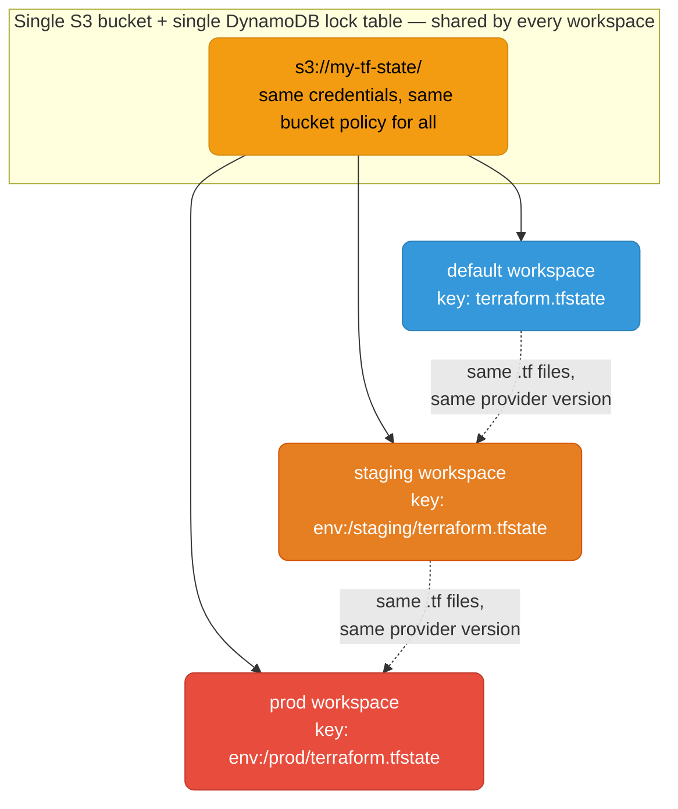
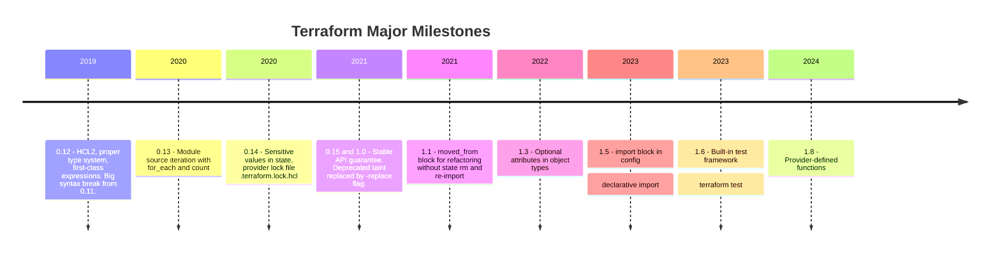
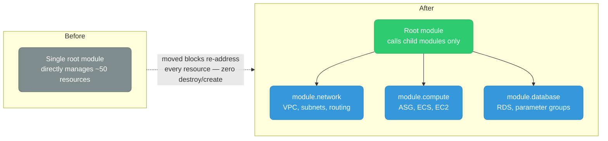

# Terraform Deep-Dive

<div class="quiz-progress" data-quiz-progress>
  <span class="quiz-progress-label">0/0 checks</span>
  <span class="quiz-progress-bar"><span class="quiz-progress-fill"></span></span>
</div>

---

## How Terraform Works

Every Terraform run walks the same loop: read your desired state from HCL, refresh what's actually running, diff the two, then reconcile reality to match the diff.

```mermaid
graph LR
    classDef authored fill:#3498db,stroke:#2980b9,color:#fff,rx:8
    classDef readonly fill:#9b59b6,stroke:#8e44ad,color:#fff,rx:8
    classDef planout fill:#e67e22,stroke:#d35400,color:#fff,rx:8
    classDef mutate fill:#2ecc71,stroke:#27ae60,color:#fff,rx:8
    classDef state fill:#2c3e50,stroke:#1a252f,color:#fff,rx:8

    subgraph LOCAL["Local workspace"]
        HCL["*.tf files<br/>desired state, human-authored"]:::authored
        INIT["terraform init<br/>download providers, init backend"]:::authored
        HCL --> INIT
    end

    subgraph PLANPHASE["Read-only planning — safe to run anytime, never touches real infra"]
        REFRESH["Refresh<br/>read real infra via provider API"]:::readonly
        DIFF["Compute diff<br/>desired HCL vs refreshed reality"]:::readonly
        PLANOUT["Execution plan<br/>+ create, ~ update, - destroy"]:::planout
        REFRESH --> DIFF --> PLANOUT
    end

    subgraph MUTATE["Mutating phase"]
        APPLY["terraform apply<br/>real create/update/destroy API calls"]:::mutate
        STATEFILE["terraform.tfstate<br/>rewritten to record new reality"]:::state
        APPLY --> STATEFILE
    end

    INIT --> REFRESH
    PLANOUT -->|"human or CI approval"| APPLY
    STATEFILE -.->|"next run's refresh reads from here"| REFRESH
```



### The plan → apply lifecycle, one phase at a time

<div class="stepper">
  <div class="stepper-panels">
    <div class="stepper-panel active">
      <strong>1. Refresh.</strong> Both <code>terraform plan</code> and <code>terraform apply</code> start by querying the provider API for the real, current attributes of every resource already tracked in <code>terraform.tfstate</code> — not just trusting what state says. This is why drift (someone hand-editing a resource in the console) shows up automatically.
    </div>
    <div class="stepper-panel">
      <strong>2. Diff.</strong> Terraform compares the freshly-refreshed real state against the desired state described in your <code>.tf</code> files and computes, resource by resource, whether it needs to be created, updated in place, or destroyed.
    </div>
    <div class="stepper-panel">
      <strong>3. Plan output.</strong> The diff is rendered as an execution plan — <code>+</code> create, <code>~</code> update, <code>-</code> destroy. Nothing has touched real infrastructure yet; everything up to this point is read-only, safe to run against production at any time.
    </div>
    <div class="stepper-panel">
      <strong>4. Apply.</strong> Once a human approves the plan (or <code>-auto-approve</code> in CI), Terraform executes it: real API calls to the provider, resource by resource, in dependency order.
    </div>
    <div class="stepper-panel">
      <strong>5. State write.</strong> <code>terraform.tfstate</code> is rewritten to record the new reality. The <em>next</em> plan's refresh step reads from this updated file — the loop closes on itself.
    </div>
  </div>
  <div class="stepper-controls">
    <button class="stepper-prev">← Prev</button>
    <span class="stepper-dots"></span>
    <span class="stepper-label"></span>
    <button class="stepper-next">Next →</button>
  </div>
</div>

<div class="quiz-card">
  <p class="quiz-q">You run terraform plan twice in a row, seconds apart, with no config changes and (as far as you know) nobody else touching the infrastructure. Is the second plan guaranteed to show "No changes," or does it do real work each time?</p>
  <button class="quiz-reveal">Reveal answer</button>
  <div class="quiz-a" hidden>It does real work every single time — plan is never a cached replay of a previous diff. Each invocation refreshes every tracked resource from the provider API and recomputes the diff from scratch against your current HCL. That's exactly why a second plan can surface something new even with an unchanged config: if anything drifted between the two runs (a console edit, an autoscaler, a TTL'd credential), the second refresh will see it and the diff will reflect it.</div>
</div>

---

## Core Commands

| Command | What it does |
|---------|-------------|
| `terraform init` | Download providers, initialize backend |
| `terraform plan` | Show what changes will be made (implicitly refreshes state) |
| `terraform apply` | Apply the plan (prompts for confirmation) |
| `terraform apply -auto-approve` | Apply without prompt (CI use only) |
| `terraform destroy` | Destroy all managed resources |
| `terraform apply -refresh-only` | Sync state with real infra without making changes (replaces deprecated `terraform refresh`) |
| `terraform fmt` | Format HCL files |
| `terraform validate` | Validate config syntax |
| `terraform output` | Show output values |

---

## Workspaces

Workspaces give you isolated state files within the **same backend and same codebase**. Each workspace has its own state.



The dotted arrows above are the whole limitation in one picture: every workspace resolves to the same HCL and the same provider version pin. Only the state *key* changes.

```bash
terraform workspace new staging      # create workspace
terraform workspace select prod      # switch to prod
terraform workspace list             # list all workspaces
terraform workspace show             # current workspace
```

```hcl
# Use workspace name to vary resources
locals {
  instance_type = terraform.workspace == "prod" ? "t3.large" : "t3.micro"
}

resource "aws_instance" "web" {
  instance_type = local.instance_type
  tags = {
    Environment = terraform.workspace
  }
}
```

**Limitation:** Workspaces share the same backend and codebase. For true env isolation (separate AWS accounts, different backend configs), use **separate directories** or **Terragrunt**.

### When NOT to use workspaces

| Use case | Use workspaces? | Better alternative |
|----------|----------------|--------------------|
| Same infra, same account, different env sizes | ✅ Yes | — |
| Different AWS accounts per env | ❌ No | Separate directories + Terragrunt |
| Completely different infra per env | ❌ No | Separate root modules |
| Feature branch infra | ✅ Yes (ephemeral) | — |

**The workspace-per-env anti-pattern:** Many teams use workspaces for prod/staging/dev with the same codebase. This works until prod needs a different module version, different provider config, or different backend credentials. At that point, separate directories win.

<div class="quiz-card">
  <p class="quiz-q">A team runs prod and staging as two workspaces of the same root module. Prod now needs a newer provider version than staging is ready for. Can workspaces accommodate that?</p>
  <button class="quiz-reveal">Reveal answer</button>
  <div class="quiz-a" hidden>No. Every workspace shares the exact same .tf files and the exact same provider version constraint — that's the defining property of a workspace, not an incidental limitation. There is no way to pin a different provider version, different backend credentials, or different module source per workspace. The moment one environment needs to diverge on anything besides variable values, workspaces stop working and the fix is separate directories (or Terragrunt) per environment, each with its own independent codebase and backend config.</div>
</div>

### Workspaces for ephemeral environments (correct use)

```bash
# Create per-PR environment
terraform workspace new "pr-${PR_NUMBER}"
terraform apply -var="suffix=pr-${PR_NUMBER}"

# Destroy after PR merge
terraform workspace select "pr-${PR_NUMBER}"
terraform destroy -auto-approve
terraform workspace select default
terraform workspace delete "pr-${PR_NUMBER}"
```

### Terragrunt — true env isolation

Terragrunt wraps Terraform, giving each environment its own backend config and variable file without duplicating HCL. Where a workspace changes only the state *key*, Terragrunt lets every environment vary independently — different AWS account, different provider pin, different backend bucket — while still sharing the underlying module source.

<div class="toggle-switch">
  <div class="toggle-buttons">
    <button data-toggle-opt="workspaces" class="active state-warn">Workspaces</button>
    <button data-toggle-opt="terragrunt" class="state-ok">Terragrunt</button>
  </div>
  <div class="toggle-panel active" data-toggle-panel="workspaces">
    One backend, one codebase, one provider version — only the state <em>key</em> (and any variable you explicitly branch on <code>terraform.workspace</code>) differs per environment. Zero extra tooling, built into core Terraform. Breaks down the moment an environment needs a different AWS account, a different backend, or a different provider constraint than its siblings.
  </div>
  <div class="toggle-panel" data-toggle-panel="terragrunt">
    A thin wrapper around Terraform: each environment gets its own <code>terragrunt.hcl</code> with its own backend config, its own inputs, and — critically — can point at a completely different AWS account or credentials, while still calling the exact same shared module source. Real isolation, at the cost of an extra binary and DAG runner to operate and keep in sync with your Terraform version.
  </div>
</div>

```
infra/
├── modules/vpc/          # shared module (DRY)
├── prod/
│   ├── terragrunt.hcl    # prod backend + inputs
│   └── vpc/terragrunt.hcl
└── staging/
    ├── terragrunt.hcl    # staging backend + inputs
    └── vpc/terragrunt.hcl
```

```hcl
# staging/terragrunt.hcl
remote_state {
  backend = "s3"
  config = {
    bucket = "my-tf-state-staging"
    key    = "${path_relative_to_include()}/terraform.tfstate"
    region = "us-east-1"
  }
}

inputs = {
  environment = "staging"
  instance_type = "t3.micro"
}
```

```bash
cd staging/vpc
terragrunt apply   # uses staging backend, staging inputs automatically
```

---

## Remote Backend (S3 + DynamoDB)

Every production Terraform config must use a remote backend — local state is never safe in teams.

```hcl
terraform {
  backend "s3" {
    bucket         = "my-company-tf-state"
    key            = "services/api/terraform.tfstate"
    region         = "us-east-1"
    encrypt        = true                       # SSE-S3 or SSE-KMS
    kms_key_id     = "arn:aws:kms:..."          # optional: use CMK
    dynamodb_table = "terraform-state-lock"     # lock table
  }
}
```

**Bootstrap the backend (one-time):**

```bash
# Create the S3 bucket
aws s3api create-bucket --bucket my-company-tf-state --region us-east-1
aws s3api put-bucket-versioning --bucket my-company-tf-state \
  --versioning-configuration Status=Enabled
aws s3api put-bucket-encryption --bucket my-company-tf-state \
  --server-side-encryption-configuration \
  '{"Rules":[{"ApplyServerSideEncryptionByDefault":{"SSEAlgorithm":"AES256"}}]}'
aws s3api put-public-access-block --bucket my-company-tf-state \
  --public-access-block-configuration "BlockPublicAcls=true,IgnorePublicAcls=true,BlockPublicPolicy=true,RestrictPublicBuckets=true"

# Create the DynamoDB lock table
aws dynamodb create-table \
  --table-name terraform-state-lock \
  --attribute-definitions AttributeName=LockID,AttributeType=S \
  --key-schema AttributeName=LockID,KeyType=HASH \
  --billing-mode PAY_PER_REQUEST
```

**State key conventions:**

```
# Per-service, per-environment
services/api/prod/terraform.tfstate
services/api/staging/terraform.tfstate
services/worker/prod/terraform.tfstate
infra/vpc/prod/terraform.tfstate
```

**Migrate from local to remote:**

```bash
# Add backend config to main.tf, then:
terraform init -migrate-state
# Terraform uploads local .tfstate to S3 automatically
```

### State locking flow

The `dynamodb_table` entry in the backend block isn't optional decoration — it's what stops two concurrent runs from corrupting the same state file. Here's what actually happens on every `plan`/`apply`:

<div class="stepper">
  <div class="stepper-panels">
    <div class="stepper-panel active">
      <strong>1. Run starts.</strong> Before reading or writing <code>terraform.tfstate</code>, Terraform first tries to acquire a lock on it — this happens for both <code>plan</code> and <code>apply</code>, not just apply.
    </div>
    <div class="stepper-panel">
      <strong>2. Conditional write to DynamoDB.</strong> Terraform performs a conditional <code>PutItem</code> against the lock table, keyed by <code>LockID</code> = <code>&lt;bucket&gt;/&lt;key&gt;</code>. The condition is "only succeed if no item with this LockID already exists."
    </div>
    <div class="stepper-panel">
      <strong>3. Lock held.</strong> If the write succeeds, Terraform now holds the lock and proceeds to read/refresh state, compute the diff, and (for apply) make changes — exclusively. A second run against the same key, started concurrently, fails its own conditional write immediately with <code>Error acquiring the state lock</code> instead of racing the first run.
    </div>
    <div class="stepper-panel">
      <strong>4. Run finishes — lock released.</strong> On a clean exit, Terraform deletes its DynamoDB lock item, and the next run is free to acquire it.
    </div>
    <div class="stepper-panel">
      <strong>5. Crash — stale lock.</strong> If Terraform is killed mid-run (Ctrl-C, OOM, CI runner terminated), the DynamoDB item is never deleted. Every subsequent run fails to acquire the lock until an operator confirms nothing is really in flight and runs <code>terraform force-unlock &lt;lock-id&gt;</code> to remove the stale item by hand.
    </div>
  </div>
  <div class="stepper-controls">
    <button class="stepper-prev">← Prev</button>
    <span class="stepper-dots"></span>
    <span class="stepper-label"></span>
    <button class="stepper-next">Next →</button>
  </div>
</div>

<div class="quiz-card">
  <p class="quiz-q">Two engineers accidentally run terraform apply against the exact same state key within the same second. Does the second run queue and wait, silently merge with the first, or something else?</p>
  <button class="quiz-reveal">Reveal answer</button>
  <div class="quiz-a" hidden>Neither — it fails fast. The DynamoDB lock table accepts only one conditional PutItem per LockID; whichever run loses the race gets back "Error acquiring the state lock" immediately and does not proceed, retry, or merge. There's no queueing built in — the second engineer has to notice the error and re-run once the first apply finishes and releases the lock.</div>
</div>

---

## `moved` Block — Safe Refactoring

When renaming a resource or moving it to a module, use `moved` to tell Terraform the resource is the same — no destroy + recreate.

```hcl
# Before: resource "aws_instance" "server"
# After:  resource "aws_instance" "web_server"

moved {
  from = aws_instance.server
  to   = aws_instance.web_server
}
```

```hcl
# Moving a resource into a module
moved {
  from = aws_security_group.api
  to   = module.api.aws_security_group.main
}
```

```hcl
# Moving a for_each resource
moved {
  from = aws_iam_user.legacy["alice"]
  to   = aws_iam_user.app_users["alice"]
}
```

**Workflow:**

```bash
# 1. Add moved block to config
# 2. Run plan — should show 0 resources to add/destroy
terraform plan
# Output: # aws_instance.web_server has moved to aws_instance.server
#           No changes. Your infrastructure matches the configuration.

# 3. Apply (updates state file only, no real changes)
terraform apply

# 4. Remove the moved block after apply (it's a one-shot migration)
```

**Why not `terraform state mv`?**
`state mv` modifies state directly without a plan step and leaves no record in code. `moved` blocks are code-reviewable, repeatable, and self-documenting.

<div class="quiz-card">
  <p class="quiz-q">You add a moved block, run terraform plan, and it correctly shows "No changes." Is it safe to delete the moved block from your HCL right now, before you've run apply?</p>
  <button class="quiz-reveal">Reveal answer</button>
  <div class="quiz-a" hidden>No — the plan showing "No changes" only means Terraform understood the rename; the state file itself hasn't been rewritten yet. Deleting the moved block before apply removes the instruction Terraform needs to reconcile the old address with the new one, so the very next plan reverts to seeing a plain destroy + create. The moved block must survive through a real apply first — only after that has run against the state file is it safe to remove it (typically in a follow-up PR).</div>
</div>

---

## `check` Block — Continuous Assertions

`check` blocks validate assumptions about your infrastructure on every plan/apply. Unlike `precondition`/`postcondition`, they warn rather than error.

```hcl
# Assert that the ALB responds with 200 (non-blocking warning)
check "alb_health" {
  data "http" "alb" {
    url = "https://${aws_lb.api.dns_name}/health"
  }

  assert {
    condition     = data.http.alb.status_code == 200
    error_message = "ALB health check returned ${data.http.alb.status_code}"
  }
}

# Assert an S3 bucket is not publicly accessible
check "s3_not_public" {
  assert {
    condition     = aws_s3_bucket_public_access_block.api.block_public_acls == true
    error_message = "S3 bucket must have public access blocked"
  }
}
```

Checks appear in `terraform plan` output as warnings — they do not prevent apply. Use them for invariants you want surfaced every run.

<div class="quiz-card">
  <p class="quiz-q">Your alb_health check block's assert fails — the ALB is returning a 503. Does terraform apply stop?</p>
  <button class="quiz-reveal">Reveal answer</button>
  <div class="quiz-a" hidden>No. A check block only ever produces a warning in the plan/apply output — it never blocks the run, unlike a resource's precondition or postcondition, which fail the entire operation. check blocks exist purely to surface an invariant for a human to notice, not to gate anything; if you need a failing assertion to actually stop an apply, you need precondition/postcondition instead.</div>
</div>

---

## `terraform test` Framework (1.6+)

Write unit/integration tests for Terraform modules in `.tftest.hcl` files.

```
modules/
└── s3-bucket/
    ├── main.tf
    ├── variables.tf
    ├── outputs.tf
    └── tests/
        ├── defaults.tftest.hcl
        └── versioning_enabled.tftest.hcl
```

```hcl
# modules/s3-bucket/tests/defaults.tftest.hcl

# Variables for this test run
variables {
  bucket_name = "test-bucket-abc123"
  environment = "test"
}

# Test 1: verify default outputs
run "default_configuration" {
  command = plan   # plan-only (no real resources created)

  assert {
    condition     = output.bucket_name == "test-bucket-abc123"
    error_message = "Bucket name output incorrect"
  }

  assert {
    condition     = aws_s3_bucket.this.tags["Environment"] == "test"
    error_message = "Environment tag not set correctly"
  }
}

# Test 2: actually create the bucket and verify
run "apply_and_verify" {
  command = apply   # creates real resources

  assert {
    condition     = aws_s3_bucket.this.bucket == "test-bucket-abc123"
    error_message = "Bucket not created with correct name"
  }
}
```

```bash
# Run all tests in the module
terraform test

# Run a specific test file
terraform test -filter=tests/defaults.tftest.hcl

# Output:
# defaults.tftest.hcl... in progress
#   run "default_configuration"... pass
#   run "apply_and_verify"... pass
# Success! 2 passed, 0 failed.
```

**Test isolation:** Each `run` block that uses `apply` creates and destroys real resources in a temporary workspace. Add `-var="environment=test"` or use mock providers to avoid hitting real AWS.

```hcl
# Mock provider for fast plan-only tests (no AWS calls)
mock_provider "aws" {}

run "plan_only_with_mock" {
  command = plan
  # Uses mock provider — instant, free, no AWS credentials needed
}
```

<div class="quiz-card">
  <p class="quiz-q">A .tftest.hcl file has two run blocks: one with command = plan, one with command = apply. No mock_provider is declared. Does running terraform test require real AWS credentials?</p>
  <button class="quiz-reveal">Reveal answer</button>
  <div class="quiz-a" hidden>Yes, for the apply run — without a mock_provider, command = apply creates and then destroys real resources in a temporary workspace, so it needs real, working AWS credentials just like a normal terraform apply would. The plan-only run in the same file is read-only and cheaper, but that doesn't exempt the file as a whole: as soon as one run block uses apply against a real provider, the test run needs credentials. Only declaring mock_provider removes the AWS dependency entirely.</div>
</div>

---

### terraform import

Bring an existing real resource under Terraform management:

```bash
# Classic syntax
terraform import aws_instance.web i-1234567890abcdef0

# Declarative import (Terraform 1.5+) — define in config, then run apply
import {
  to = aws_instance.web
  id = "i-1234567890abcdef0"
}
```

Use when: resource was created manually, you need to adopt it without recreating it. After import, write matching config to avoid plan showing changes.

### terraform state rm

Remove a resource from state without destroying the real resource:

```bash
terraform state rm aws_instance.web
terraform state rm 'module.vpc.aws_subnet.public[0]'  # escape brackets in shell
```

Use when: module refactoring (remove from one module, re-import to another), or stop managing a resource.

### terraform apply -replace

Force destroy + recreate of a specific resource:

```bash
terraform apply -replace="aws_instance.web"
terraform apply -replace="module.ecs.aws_ecs_service.app"
```

Use when: resource is subtly broken but Terraform thinks it's healthy. Replaced the deprecated `terraform taint` command (v0.15.2+).

### State file operations

```bash
terraform state list                          # list all resources in state
terraform state show aws_instance.web         # show details of one resource
terraform state mv aws_instance.old aws_instance.new  # rename/move resource
terraform state pull > backup.tfstate         # backup state
```

---

## Drift Detection and Fix

```bash
# Detect drift: shows resources that changed outside Terraform
terraform plan   # unexpected changes = drift

# Sync state without making changes (inspect what drifted)
terraform apply -refresh-only

# Fix option 1: let Terraform correct it
terraform apply   # Terraform reverts manual change back to desired state

# Fix option 2: accept the manual change
terraform apply -refresh-only   # update state to match reality
# Then update your .tf config to match
```

<div class="quiz-card">
  <p class="quiz-q">You run terraform apply -refresh-only, see a diff, and approve it. Has any real infrastructure changed as a result?</p>
  <button class="quiz-reveal">Reveal answer</button>
  <div class="quiz-a" hidden>No. -refresh-only only rewrites terraform.tfstate to match what's actually running — it never sends any create/update/destroy calls to the provider. Approving that diff just tells Terraform "believe reality, not the old state file." If you actually want the manual change reverted back to match your .tf config, you need a normal terraform apply afterward, not another refresh-only run.</div>
</div>

---

## DB User Management Example

Full example: create multiple DB users with `for_each`, random passwords stored in Secrets Manager.

```hcl
terraform {
  required_providers {
    mysql = {
      source  = "petoju/mysql"
      version = "~> 3.0"
    }
  }
}

locals {
  # Set is stable — adding/removing one user only affects that user
  db_users = toset(["svc_payments", "svc_reporting", "svc_audit"])
}

resource "random_password" "passwords" {
  for_each = local.db_users
  length   = 24
  special  = false
}

resource "mysql_user" "app_users" {
  for_each = local.db_users

  user               = each.key
  host               = "%"
  plaintext_password = random_password.passwords[each.key].result
}

resource "aws_secretsmanager_secret" "db_passwords" {
  for_each = local.db_users
  name     = "db/${each.key}/password"
}

resource "aws_secretsmanager_secret_version" "db_passwords" {
  for_each      = local.db_users
  secret_id     = aws_secretsmanager_secret.db_passwords[each.key].id
  secret_string = random_password.passwords[each.key].result
}
```

**Key points:**
- `for_each` not `count` — keyed by username, safe to remove a user without cascading destroy
- `random_password` IS stored in state — **encrypt your state file** (S3 SSE + KMS)
- Passwords stored in Secrets Manager — apps use IRSA to fetch at runtime, never in environment variables

<div class="quiz-card">
  <p class="quiz-q">If db_users had been written as count = 3 over a list instead of for_each over a set, what breaks when "svc_reporting" (the middle entry) is removed from the list?</p>
  <button class="quiz-reveal">Reveal answer</button>
  <div class="quiz-a" hidden>count addresses resources positionally — mysql_user.app_users[0], [1], [2] — not by name. Removing the middle element shifts every later element down one index, so Terraform sees index [1] now pointing at a different username than before and index [2] no longer existing. The result is a destroy+recreate cascade for every user after the removed one — rotating their passwords and Secrets Manager entries even though only svc_reporting should have been touched. for_each keyed by username has no index to shift; removing one key only ever affects that exact key.</div>
</div>

---

## Version History



```bash
terraform version   # check current version
```

**Current stable:** Terraform 1.x (1.6–1.9 range as of 2025–2026). OpenTofu is the OSS fork maintained by the community after HashiCorp's BSL license change in 2023.

---

## HCL Patterns

### Dynamic blocks

```hcl
# Instead of repeating ingress blocks
resource "aws_security_group" "web" {
  dynamic "ingress" {
    for_each = var.allowed_ports
    content {
      from_port   = ingress.value
      to_port     = ingress.value
      protocol    = "tcp"
      cidr_blocks = ["0.0.0.0/0"]
    }
  }
}
```

### Local values

```hcl
locals {
  common_tags = {
    Project     = var.project
    Environment = terraform.workspace
    ManagedBy   = "terraform"
  }
}

resource "aws_instance" "web" {
  tags = merge(local.common_tags, { Name = "web-server" })
}
```

### Data sources

```hcl
# Reference existing resources not managed by this config
data "aws_vpc" "main" {
  filter {
    name   = "tag:Name"
    values = ["prod-vpc"]
  }
}

resource "aws_subnet" "app" {
  vpc_id = data.aws_vpc.main.id
  # ...
}
```

### Module outputs and dependencies

```hcl
module "vpc" {
  source = "./modules/vpc"
  cidr   = "10.0.0.0/16"
}

module "ecs" {
  source    = "./modules/ecs"
  vpc_id    = module.vpc.vpc_id          # implicit dependency
  subnet_ids = module.vpc.private_subnets
}
```

---

## State Surgery — Advanced State Management

### terraform import (legacy) vs import block (1.5+)

<div class="tab-group">
  <div class="tab-buttons">
    <button data-tab="cliimport" class="active">CLI import (legacy)</button>
    <button data-tab="importblock">import block (1.5+)</button>
  </div>
  <div class="tab-panels">
    <div class="tab-panel active" data-tab-panel="cliimport">
      One resource at a time, run interactively from a terminal. No plan preview beforehand — you find out if the address or ID was wrong only after it's already in state. Nothing lands in version control, so there's no PR review and no record of when or why a resource was adopted.
    </div>
    <div class="tab-panel" data-tab-panel="importblock">
      Declarative: written into a committed <code>.tf</code> file, reviewed in a normal PR, and run through CI like any other change. <code>terraform plan</code> shows exactly what will be imported <em>before</em> anything happens, and <code>-generate-config-out</code> can auto-write the matching HCL straight from the live resource's attributes, removing most of the guesswork.
    </div>
  </div>
</div>

**Old way — CLI import (not in state, not reviewable):**
```bash
# Import existing AWS resource into state (one at a time, no plan preview)
terraform import aws_s3_bucket.my_bucket my-existing-bucket-name
terraform import aws_instance.web i-0123456789abcdef0
# Problem: no dry-run, no code generation, easy to get wrong address
```

**New way — import block (Terraform 1.5+, preferred):**
```hcl
# import.tf — commit this, review in PR, run in CI
import {
  id = "my-existing-bucket-name"
  to = aws_s3_bucket.my_bucket
}

import {
  id = "i-0123456789abcdef0"
  to = aws_instance.web
}
```

```bash
# With import block you get a full plan showing what will be imported
terraform plan   # shows: "will import aws_s3_bucket.my_bucket"

# -generate-config-out: auto-generate HCL from the live resource
terraform plan -generate-config-out=generated.tf
# Produces HCL with all attributes filled from AWS — clean up and commit

terraform apply  # import happens as part of normal apply
```

<div class="quiz-card">
  <p class="quiz-q">You write an import block and run terraform plan. It shows "will import aws_s3_bucket.my_bucket". Is that bucket now under Terraform management?</p>
  <button class="quiz-reveal">Reveal answer</button>
  <div class="quiz-a" hidden>Not yet — plan is only a preview here too, same as any other plan. The resource is actually brought into state during apply, not plan. This is a genuine difference from a moved block, which is pure state metadata with nothing to "execute" — an import block still needs a real apply to run before the resource exists in terraform.tfstate.</div>
</div>

### moved block — safe resource address refactoring

When you rename a resource in HCL or move it into/out of a module, Terraform sees it as destroy+create without a `moved` block.

```hcl
# Renamed resource: aws_instance.old_name → aws_instance.new_name
moved {
  from = aws_instance.old_name
  to   = aws_instance.new_name
}

# Moved into a module: aws_s3_bucket.logs → module.storage.aws_s3_bucket.logs
moved {
  from = aws_s3_bucket.logs
  to   = module.storage.aws_s3_bucket.logs
}

# Moved from one module call to another
moved {
  from = module.app["service-a"]
  to   = module.app["service-b"]
}
```

```bash
# Verify with plan — should show "move" not "destroy+create"
terraform plan
# ~ aws_instance.new_name (moved from aws_instance.old_name)
#   # (no changes to resource, just address change)
```

### terraform state commands — surgical operations

```bash
# List all resources in state
terraform state list
terraform state list | grep aws_security_group

# Show full details of one resource in state
terraform state show aws_s3_bucket.my_bucket
# Outputs all attributes as they exist in state — useful for debugging diffs

# Remove a resource from state WITHOUT destroying it
# (hand off to another workspace, or stop managing it)
terraform state rm aws_s3_bucket.my_bucket

# Move resource between state files (e.g., splitting monolith into modules)
# In source workspace:
terraform state mv aws_s3_bucket.logs module.storage.aws_s3_bucket.logs
# WARNING: modifies state directly with no plan. Take a backup first.

# Pull remote state to local for inspection
terraform state pull > state_backup_$(date +%Y%m%d).json

# Push modified state back (DANGEROUS — use only for corruption recovery)
terraform state push state_backup.json

# Manually take a state lock (useful for maintenance windows)
terraform force-unlock <lock-id>   # release stuck lock after crash
```

### Module refactoring — splitting a monolith



```bash
# Step 1: write new module code
# Step 2: add moved blocks for every resource being re-addressed
# Step 3: terraform plan — verify zero destroy/create, only moves
# Step 4: terraform apply — moves are instantaneous (metadata only)
# Step 5: remove moved blocks in a follow-up PR (they're only needed once)
```

```hcl
# Example: moving 5 resources into a network module
moved { from = aws_vpc.main              to = module.network.aws_vpc.main }
moved { from = aws_subnet.private_a      to = module.network.aws_subnet.private["a"] }
moved { from = aws_subnet.private_b      to = module.network.aws_subnet.private["b"] }
moved { from = aws_internet_gateway.igw  to = module.network.aws_internet_gateway.main }
moved { from = aws_route_table.public    to = module.network.aws_route_table.public }
```

### Targeted apply — breaking the plan cycle

```bash
# Apply only specific resources (bypass unrelated failures)
terraform apply -target=aws_s3_bucket.my_bucket
terraform apply -target=module.network
terraform apply -target=aws_security_group.app -target=aws_security_group.db

# WARNING: targeted apply leaves state inconsistent — dependencies may be stale
# Always follow with a full plan+apply to ensure consistency
# Never use -target in automated pipelines

# Similarly for plan (useful for understanding impact)
terraform plan -target=module.network
```

<div class="quiz-card">
  <p class="quiz-q">Under deadline pressure you run terraform apply -target=module.network to fix one broken resource. It succeeds. Is your state now fully consistent with the rest of your configuration?</p>
  <button class="quiz-reveal">Reveal answer</button>
  <div class="quiz-a" hidden>Not necessarily. A targeted apply only reconciles the target and whatever it depends on — anything else that a full plan would normally have touched (a resource reading an output that changed, an unrelated drift elsewhere) is left exactly as it was, possibly now stale relative to your actual config. -target is meant as an emergency escape hatch, not a routine tool: always follow it with a full, untargeted plan/apply to confirm nothing else needs reconciling, and never wire -target into an automated pipeline.</div>
</div>

### replace — force recreation of a single resource

```bash
# Taint is deprecated since 1.2. Use -replace instead.
terraform apply -replace=aws_instance.web
# Equivalent to: destroy + create in a single apply
# Use when: resource is corrupted, needs AMI refresh, or is in bad state
```

### State lock debugging

```bash
# State is locked when:
# - Another terraform apply is running
# - A previous run crashed without releasing the lock
# - DynamoDB lock table entry is stale

# Check DynamoDB for stuck lock
aws dynamodb get-item \
  --table-name terraform-state-lock \
  --key '{"LockID": {"S": "mybucket/path/to/terraform.tfstate"}}' \
  --region us-east-1

# Release stuck lock (confirm no apply is actually running first)
terraform force-unlock <lock-id>
# Lock ID is in the error message:
# "Error acquiring the state lock: ID: abc-123-def..."
```

<div class="quiz-card">
  <p class="quiz-q">You see "Error acquiring the state lock" and run terraform force-unlock immediately to get unblocked. What's the risk you just skipped checking for?</p>
  <button class="quiz-reveal">Reveal answer</button>
  <div class="quiz-a" hidden>That the lock isn't actually stale — a colleague's apply (or a CI job) might genuinely be in progress right now. force-unlock doesn't verify anything; it just deletes the DynamoDB lock item and lets you proceed. If another run really is mid-apply, you now have two processes writing terraform.tfstate at once, which is exactly the corruption the lock exists to prevent. Always confirm no run is really in flight — check CI status, ask the team — before force-unlocking, not after.</div>
</div>
