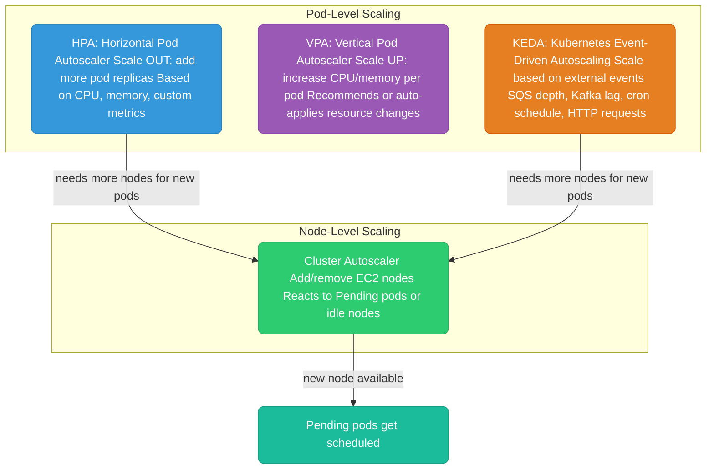
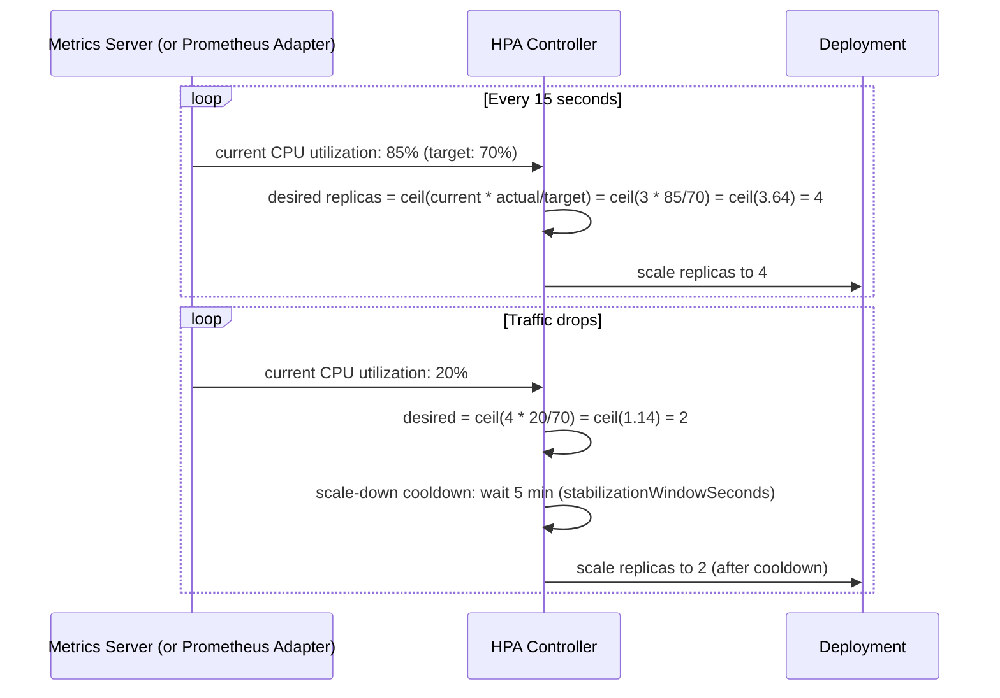
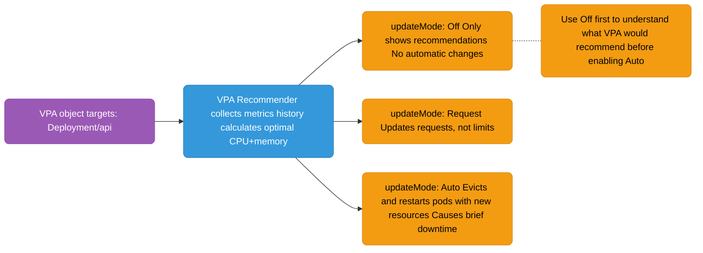
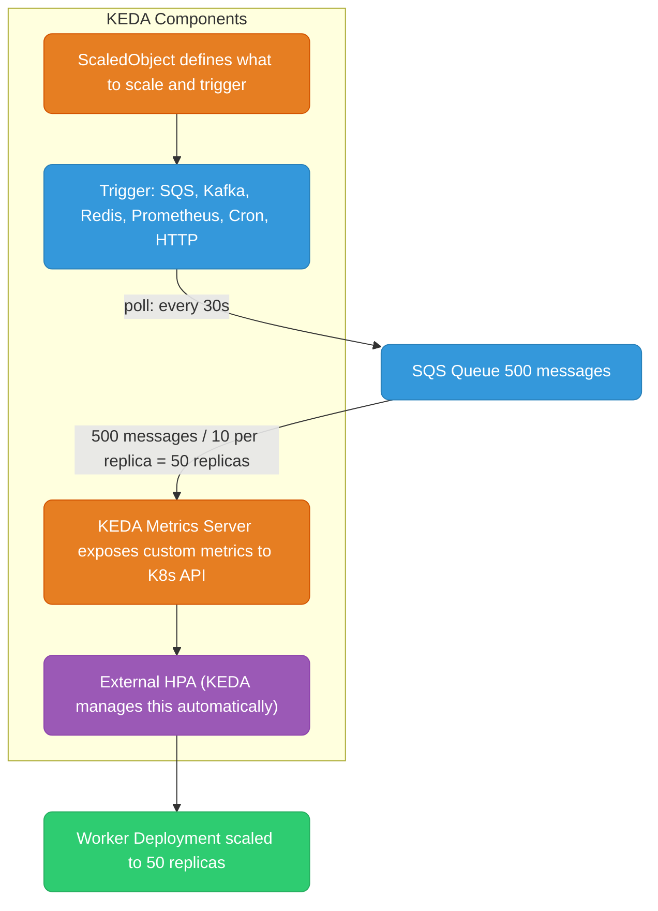

# Kubernetes Autoscaling

Four different autoscalers can act on the same cluster, each watching a different signal and moving a different lever — replica count, per-pod resources, or node count. This guide walks through each one: what it watches, what it changes, and how they hand off to each other when pod-level scaling runs out of room to schedule into. Track how many knowledge checks you've cleared as you go:

<div class="quiz-progress" data-quiz-progress>
  <span class="quiz-progress-label">0/0 checks</span>
  <span class="quiz-progress-bar"><span class="quiz-progress-fill"></span></span>
</div>

---

## Autoscaling Layers



At a glance, side by side:

<div class="tab-group">
  <div class="tab-buttons">
    <button data-tab="hpa" class="active">HPA</button>
    <button data-tab="vpa">VPA</button>
    <button data-tab="keda">KEDA</button>
    <button data-tab="ca">Cluster Autoscaler</button>
  </div>
  <div class="tab-panels">
    <div class="tab-panel active" data-tab-panel="hpa">
      <strong>Scales:</strong> pod replica count (scale OUT). <strong>Trigger:</strong> CPU, memory, or custom metrics measured against a target. <strong>Needs:</strong> Metrics Server, or a custom metrics adapter for non-CPU metrics. Reacts fast on the way up, deliberately slow on the way down.
    </div>
    <div class="tab-panel" data-tab-panel="vpa">
      <strong>Scales:</strong> per-pod CPU/memory <code>requests</code> (scale UP) — never replica count. <strong>Trigger:</strong> historical usage analysis by the VPA Recommender. <strong>Watch out:</strong> fights HPA if both target the same metric on the same workload.
    </div>
    <div class="tab-panel" data-tab-panel="keda">
      <strong>Scales:</strong> pod replica count, same lever as HPA — KEDA creates and drives an HPA automatically. <strong>Trigger:</strong> external events — queue depth, consumer lag, cron, HTTP rate. <strong>Unique:</strong> the only one here that can scale to zero.
    </div>
    <div class="tab-panel" data-tab-panel="ca">
      <strong>Scales:</strong> the number of EC2 nodes in the cluster — not pods. <strong>Trigger:</strong> Pending unschedulable pods (scale out) or sustained idle nodes (scale in). <strong>Needs:</strong> an ASG per node group; respects PodDisruptionBudgets on the way down.
    </div>
  </div>
</div>

<div class="quiz-card">
  <p class="quiz-q">In the diagram above, arrows run from HPA and KEDA into Cluster Autoscaler, but there's no arrow from VPA. Why not?</p>
  <button class="quiz-reveal">Reveal answer</button>
  <div class="quiz-a" hidden>HPA and KEDA both scale OUT — they add new pod replicas, which may not fit on any existing node and show up as Pending, the exact signal Cluster Autoscaler reacts to. VPA never adds replicas; it resizes the CPU/memory request of pods that already exist, so it doesn't produce the unschedulable-pod condition that triggers a node-level scale-out.</div>
</div>

---

## HPA — Horizontal Pod Autoscaler

HPA watches a metric and adjusts the number of pod replicas to keep the metric at the target.



Same loop, one step at a time:

<div class="stepper">
  <div class="stepper-panels">
    <div class="stepper-panel active">
      <strong>1. Observe.</strong> Metrics Server (or the Prometheus Adapter) reports the current metric value to the HPA controller — this poll happens every 15 seconds.
    </div>
    <div class="stepper-panel">
      <strong>2. Compute.</strong> HPA applies the formula: <code>desiredReplicas = ceil(currentReplicas &times; currentMetricValue / targetMetricValue)</code>. At 85% CPU against a 70% target with 3 replicas, that's <code>ceil(3 &times; 85/70) = 4</code>.
    </div>
    <div class="stepper-panel">
      <strong>3. Scale up, no delay.</strong> <code>scaleUp.stabilizationWindowSeconds: 0</code> means HPA applies the new, higher replica count immediately — no waiting to react to rising load.
    </div>
    <div class="stepper-panel">
      <strong>4. Traffic drops.</strong> The metric falls to 20%. Recomputing gives a lower desired replica count, but HPA doesn't act on it yet.
    </div>
    <div class="stepper-panel">
      <strong>5. Scale down, after cooldown.</strong> <code>scaleDown.stabilizationWindowSeconds: 300</code> makes HPA hold the higher replica count for 5 minutes before shrinking — absorbing a temporary dip instead of flapping the replica count on every blip.
    </div>
  </div>
  <div class="stepper-controls">
    <button class="stepper-prev">← Prev</button>
    <span class="stepper-dots"></span>
    <span class="stepper-label"></span>
    <button class="stepper-next">Next →</button>
  </div>
</div>

```yaml
apiVersion: autoscaling/v2
kind: HorizontalPodAutoscaler
metadata:
  name: api-hpa
spec:
  scaleTargetRef:
    apiVersion: apps/v1
    kind: Deployment
    name: api
  minReplicas: 2
  maxReplicas: 20
  metrics:
    # CPU — most common
    - type: Resource
      resource:
        name: cpu
        target:
          type: Utilization
          averageUtilization: 70   # keep CPU at 70% average across all pods
    # Memory (less common — memory doesn't release easily)
    - type: Resource
      resource:
        name: memory
        target:
          type: AverageValue
          averageValue: 400Mi
  behavior:
    scaleDown:
      stabilizationWindowSeconds: 300   # wait 5min before scaling down (avoid flapping)
      policies:
        - type: Percent
          value: 25                     # scale down at most 25% of pods per minute
          periodSeconds: 60
    scaleUp:
      stabilizationWindowSeconds: 0    # scale up immediately
      policies:
        - type: Percent
          value: 100                   # can double pod count per 15s
          periodSeconds: 15
```

**HPA formula:** `desiredReplicas = ceil(currentReplicas × currentMetricValue / targetMetricValue)`

**HPA requires:** Metrics Server installed in the cluster (or custom metrics adapter for non-CPU metrics). EKS ships Metrics Server as an add-on.

<div class="quiz-card">
  <p class="quiz-q">HPA scales up immediately (<code>stabilizationWindowSeconds: 0</code>) but waits 5 minutes before scaling down. Why the asymmetry?</p>
  <button class="quiz-reveal">Reveal answer</button>
  <div class="quiz-a" hidden>Under-provisioning during a real spike risks dropped requests, so reacting instantly on the way up is worth it. But a traffic dip is often temporary — scaling down immediately and then back up a minute later just thrashes the replica count. The scale-down stabilization window waits out the noise before committing to fewer pods, trading a few minutes of extra capacity for avoiding flapping.</div>
</div>

---

## VPA — Vertical Pod Autoscaler

VPA analyzes historical resource usage and recommends (or applies) better `requests` and `limits`.



The three `updateMode` values are mutually exclusive states for the same object — flip between them to compare what each one actually does to a running pod:

<div class="toggle-switch">
  <div class="toggle-buttons">
    <button data-toggle-opt="off" class="active state-ok">Off</button>
    <button data-toggle-opt="request" class="state-warn">Request</button>
    <button data-toggle-opt="auto" class="state-bad">Auto</button>
  </div>
  <div class="toggle-panel active" data-toggle-panel="off">
    Only shows recommendations — no automatic changes to any running pod. Safe to leave on indefinitely; this is how you learn what VPA would do before letting it touch anything.
  </div>
  <div class="toggle-panel" data-toggle-panel="request">
    Updates the pod's <code>requests</code> only, not <code>limits</code>. Still requires the pod to be recreated to pick up the new value — no forced disruption engineered by VPA itself, but no live in-place resize either.
  </div>
  <div class="toggle-panel" data-toggle-panel="auto">
    Evicts and restarts pods immediately with the new CPU/memory values. This is the only mode that actually changes running resource allocations end to end — and the only one that causes brief downtime doing it.
  </div>
</div>

```yaml
apiVersion: autoscaling.k8s.io/v1
kind: VerticalPodAutoscaler
metadata:
  name: api-vpa
spec:
  targetRef:
    apiVersion: apps/v1
    kind: Deployment
    name: api
  updatePolicy:
    updateMode: "Off"    # start with Off: see recommendations without disruption
  resourcePolicy:
    containerPolicies:
      - containerName: api
        minAllowed:
          cpu: 100m
          memory: 128Mi
        maxAllowed:
          cpu: 4
          memory: 4Gi
```

**HPA + VPA conflict:** Don't use both on the same metric. If using HPA on CPU, set VPA to `Off` or use VPA only for memory recommendations. They will fight each other on CPU.

<div class="quiz-card">
  <p class="quiz-q">You're running HPA on CPU for a Deployment. Can you safely add a VPA object targeting CPU on the same Deployment?</p>
  <button class="quiz-reveal">Reveal answer</button>
  <div class="quiz-a" hidden>No. HPA adds or removes replicas to hold CPU utilization at its target, while VPA changes the per-pod CPU request that utilization is measured against — each one keeps undoing the other's signal. Either set VPA's <code>updateMode</code> to <code>Off</code> (recommendations only) or scope VPA to memory while leaving CPU to HPA.</div>
</div>

---

## KEDA — Kubernetes Event-Driven Autoscaling

KEDA extends HPA to scale on any external event source — queue depth, Kafka consumer lag, HTTP request rate, cron schedule.



Walk the same reaction loop step by step:

<div class="stepper">
  <div class="stepper-panels">
    <div class="stepper-panel active">
      <strong>1. ScaledObject defines the target.</strong> It names the Deployment to scale and the trigger to watch — here, an SQS queue.
    </div>
    <div class="stepper-panel">
      <strong>2. The trigger polls the source.</strong> On its configured interval — every 30s in this example — it checks the external system's current value: 500 messages sitting in the queue.
    </div>
    <div class="stepper-panel">
      <strong>3. KEDA converts that into a Kubernetes metric.</strong> Its metrics server does the math — 500 messages / 10 per replica = 50 — and exposes the result to the Kubernetes API as a custom metric.
    </div>
    <div class="stepper-panel">
      <strong>4. The external HPA acts on it.</strong> KEDA creates and manages this HPA automatically — the reader never writes it by hand. It reads the custom metric and scales the Worker Deployment to 50 replicas.
    </div>
    <div class="stepper-panel">
      <strong>5. Queue drains to zero.</strong> Unlike a plain HPA, whose floor is always 1, KEDA can take <code>minReplicaCount</code> all the way to 0 — no idle workers running when there's nothing to do.
    </div>
  </div>
  <div class="stepper-controls">
    <button class="stepper-prev">← Prev</button>
    <span class="stepper-dots"></span>
    <span class="stepper-label"></span>
    <button class="stepper-next">Next →</button>
  </div>
</div>

```yaml
apiVersion: keda.sh/v1alpha1
kind: ScaledObject
metadata:
  name: sqs-worker-scaler
spec:
  scaleTargetRef:
    name: sqs-worker
  minReplicaCount: 0      # KEDA can scale to ZERO (unlike HPA min=1)
  maxReplicaCount: 50
  triggers:
    - type: aws-sqs-queue
      metadata:
        queueURL: https://sqs.us-east-1.amazonaws.com/123456789/my-queue
        queueLength: "10"    # target: 10 messages per worker pod
        awsRegion: us-east-1
      authenticationRef:
        name: keda-aws-credentials   # IRSA or secret ref
---
# Scale on Kafka consumer lag
  triggers:
    - type: kafka
      metadata:
        bootstrapServers: kafka:9092
        consumerGroup: my-consumer-group
        topic: events
        lagThreshold: "100"   # scale up when lag > 100 messages per partition
---
# Scale to zero at night, back up in morning (cron)
  triggers:
    - type: cron
      metadata:
        timezone: Asia/Kolkata
        start: "0 9 * * 1-5"    # 9 AM weekdays
        end: "0 20 * * 1-5"     # 8 PM weekdays
        desiredReplicas: "5"
```

**Scale-to-zero** is KEDA's killer feature. HPA minimum is 1 replica. KEDA can scale to 0 when there's no work and back up when events arrive. Perfect for batch workers, overnight jobs, dev environments.

<div class="quiz-card">
  <p class="quiz-q">Could you configure a plain HorizontalPodAutoscaler to scale a Deployment down to zero replicas when there's no work?</p>
  <button class="quiz-reveal">Reveal answer</button>
  <div class="quiz-a" hidden>No — HPA's minimum is always at least 1 replica; it can't scale a workload out of existence entirely. Scaling all the way to zero, and back up once events arrive, is specifically a KEDA capability, which is why it's the go-to choice for batch workers, overnight jobs, and dev environments that shouldn't burn cost while idle.</div>
</div>

---

## Cluster Autoscaler

Cluster Autoscaler (CA) scales the number of EC2 nodes in the cluster. It reacts to two signals:

```mermaid
graph TD
    classDef ca fill:#2ecc71,stroke:#27ae60,color:#fff,rx:8
    classDef node fill:#34495e,stroke:#2c3e50,color:#fff,rx:8
    classDef asg fill:#e67e22,stroke:#d35400,color:#fff,rx:8
    classDef pod fill:#3498db,stroke:#2980b9,color:#fff,rx:8

    subgraph ScaleOut["Scale OUT: add nodes"]
        PENDING["Pods stuck in Pending InsufficientResource or unschedulable"]:::pod
        CA_OUT["Cluster Autoscaler finds a node group that could fit the pod triggers ASG scale-out"]:::ca
        ASG_OUT["ASG: launches new EC2 node"]:::asg
        NEW_NODE["New node joins cluster Pending pods get scheduled"]:::node
        PENDING --> CA_OUT --> ASG_OUT --> NEW_NODE
    end

    subgraph ScaleIn["Scale IN: remove idle nodes"]
        IDLE["Node utilization < 50% for 10 min (default)"]:::node
        CA_IN["Cluster Autoscaler checks: can all pods fit elsewhere?"]:::ca
        SAFE{Safe to remove?}
        DRAIN["Cordon + drain node Evict pods (respects PDB)"]:::ca
        ASG_IN["ASG: terminate EC2 node"]:::asg
        IDLE --> CA_IN --> SAFE
        SAFE -->|"Yes"| DRAIN --> ASG_IN
        SAFE -->|"No (PDB blocks, non-evictable pod)"| SKIP["Skip this node"]:::node
    end
```



Both directions of that loop, in order:

<div class="stepper">
  <div class="stepper-panels">
    <div class="stepper-panel active">
      <strong>1. Scale out — a pod can't be scheduled.</strong> It's stuck <code>Pending</code> with <code>InsufficientResource</code> — no existing node has room for it.
    </div>
    <div class="stepper-panel">
      <strong>2. CA finds a fit.</strong> It looks across node groups for one whose instance type could fit the pending pod, and triggers that node group's ASG to scale out.
    </div>
    <div class="stepper-panel">
      <strong>3. New node joins.</strong> The ASG launches a new EC2 instance; once it joins the cluster, the pending pod gets scheduled onto it.
    </div>
    <div class="stepper-panel">
      <strong>4. Scale in — a node goes idle.</strong> Sometime later, a node's utilization sits below 50% for the default 10-minute window.
    </div>
    <div class="stepper-panel">
      <strong>5. Safety check.</strong> CA asks whether every pod on that node could be rescheduled elsewhere. If evicting a pod would violate its PodDisruptionBudget, or the pod is otherwise non-evictable, CA skips the node and leaves it running.
    </div>
    <div class="stepper-panel">
      <strong>6. Drain and terminate.</strong> If the check passes, CA cordons and drains the node — respecting PDBs during eviction — and the ASG terminates the underlying EC2 instance.
    </div>
  </div>
  <div class="stepper-controls">
    <button class="stepper-prev">← Prev</button>
    <span class="stepper-dots"></span>
    <span class="stepper-label"></span>
    <button class="stepper-next">Next →</button>
  </div>
</div>

**CA setup in EKS (via Helm):**
```yaml
# values for cluster-autoscaler chart
autoDiscovery:
  clusterName: my-cluster
awsRegion: us-east-1

# Tuning
extraArgs:
  scale-down-delay-after-add: "10m"        # wait 10m after adding before scaling down
  scale-down-unneeded-time: "10m"          # node must be unneeded for 10m before removal
  skip-nodes-with-local-storage: "false"   # allow removing nodes with emptyDir pods
  expander: "least-waste"                   # pick node group that wastes least resources
```

**PodDisruptionBudget interaction:** CA respects PDBs. If draining a node would violate `minAvailable`, CA skips that node. Always set PDBs for production workloads to prevent CA from breaking your availability.

**Karpenter** (AWS alternative to Cluster Autoscaler): provisions nodes in ~30s (vs CA's 2-5 min), uses a declarative `NodePool` model, can provision diverse instance types and Spot/On-Demand mix more intelligently. Increasingly the recommended choice for EKS.

<div class="quiz-card">
  <p class="quiz-q">Cluster Autoscaler decides a node is idle and wants to remove it, but evicting one of its pods would violate that pod's PodDisruptionBudget. What does CA do?</p>
  <button class="quiz-reveal">Reveal answer</button>
  <div class="quiz-a" hidden>It skips that node rather than forcing the eviction. Cluster Autoscaler respects PodDisruptionBudgets — if draining a node would violate <code>minAvailable</code>, CA leaves the node running and looks elsewhere. That's exactly why production workloads should always have a PDB set: without one, nothing stops CA from disrupting availability during scale-in.</div>
</div>
