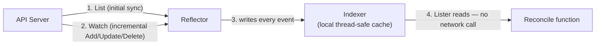

# The Controller Pattern — Informers, Workqueues, and Reconcile Loops

Every one of the ~30 built-in controllers in `kube-controller-manager` — Deployment, ReplicaSet, StatefulSet, Job, endpoint, namespace, garbage collection, all of them — and every operator you've ever installed (cert-manager, the Prometheus Operator, ArgoCD itself) is built on the exact same mechanism. Understand this one pattern and you understand how the entire control plane actually reacts to change, not just what a Deployment or a `kubectl apply` does at a surface level.

  0/0 checks
  

---

## 1. Why Watch, Not Poll

A naive controller would poll the API server every N seconds: "give me every Pod, again." That doesn't scale — thousands of controllers, each re-listing potentially thousands of objects, on a fixed timer regardless of whether anything changed.

Kubernetes' API server instead exposes a **watch** primitive on every list endpoint: open one long-lived HTTP connection, get an initial `List`, then a stream of `Add`/`Update`/`Delete` events for exactly what changes, as it changes, and nothing else. Every controller is built around consuming that stream, not polling.

  
Why does a watch-based design scale better than polling even though both eventually "find out" about the same changes?

  <button class="quiz-reveal">Reveal answer</button>
  
Polling re-fetches the entire object list on a fixed timer regardless of whether anything changed, so cost scales with (number of controllers) x (list size) x (poll frequency) even during total silence. A watch is push-based: the API server sends exactly the deltas that occurred, so cost scales with the actual rate of change, not with how often you'd like to be told about it. Both converge on the same up-to-date view — watch just doesn't pay for the "nothing changed" case over and over.

---

## 2. The Reflector and the Local Cache

A controller doesn't watch the API server directly and react inline — that would mean every controller re-implementing reconnect/resume/backoff logic, and every reconcile function doing a live API call just to read an object it already just got told about. Instead, client-go's `Reflector` does exactly one job: `List` once, then `Watch` from that point forward, and feed every event into a local, thread-safe cache called an **Indexer**.

The critical consequence: **a controller's reconcile logic reads from this local cache (via a `Lister`), never a live API call.** That's what makes thousands of reconciles per second cheap — they're reading memory, not making HTTP requests. The tradeoff is the cache can be milliseconds behind the API server; every controller is written assuming that's fine (see [Level-Triggered vs Edge-Triggered](#4-the-reconcile-loop--level-triggered-vs-edge-triggered) below for why).

---

## 3. SharedInformer — One Watch, Many Consumers

If the Deployment controller, the HPA controller, and a custom operator all separately watched Pods, that's three redundant watch connections and three redundant caches for the same data. A `SharedInformer` (created once via a `SharedInformerFactory`) solves this: one Reflector, one Indexer, and any number of controllers register their own event handlers against that single shared cache.

  
Two different controllers in the same binary both need to react to Pod changes. Does each one need its own informer?

  <button class="quiz-reveal">Reveal answer</button>
  
No — that's exactly what SharedInformerFactory exists to avoid. Both controllers register their event handlers against the same underlying informer (one Reflector, one watch connection, one Indexer). Each handler still fires independently and each controller keeps its own workqueue, but the expensive part — the watch connection and the cache — is shared, not duplicated per-controller.

---

## 4. The Workqueue — Keys, Not Objects

When an informer's event handler fires, it doesn't hand the reconcile function the object itself. It extracts a **key** — `namespace/name` — and pushes that key onto a workqueue. This is deliberate, and it's the detail that makes the whole system self-correcting:

- **Dedup for free.** `client-go`'s workqueue is a set under the hood — enqueueing a key that's already pending, or already being processed, is a no-op (a "dirty" flag marks it for re-processing after the current run finishes, rather than adding a second entry). Ten rapid-fire updates to the same object collapse into a single reconcile, not ten.
- **Always fresh.** Because a worker looks the key up in the cache at process time — not at enqueue time — it always reconciles against the *latest* known state, never a stale snapshot captured back when the event fired. An object updated three times before a worker gets to it is reconciled against the third state directly; the first two are never separately processed.

  

    <button data-tab="naive" class="active">Naive: queue objects</button>
    <button data-tab="real">Real: queue keys</button>
  

  

    

      Three updates to the same Pod in quick succession enqueue three separate object snapshots. A worker processes all three, doing 3x the work, and the middle one is stale before it's even handled — wasted effort reconciling a state that's already been superseded.
    

    

      Three updates to the same Pod enqueue the same key three times, which collapses to one pending entry. A worker processes it once, looks up the <em>current</em> cached state at that moment, and reconciles against whatever the object actually looks like right now — the two superseded intermediate states are never separately reconciled, and don't need to be.
    

  

---

## 4. The Reconcile Loop — Level-Triggered vs Edge-Triggered

This is the single most important mental model in the whole pattern, and the one most often gotten wrong by people writing their first controller.

**Edge-triggered** thinking says: "I got an Update event, so I should apply the specific delta that changed." This is fragile — if you ever miss an event (a restart, a dropped watch, a backoff), your model of the world silently diverges from reality forever, because nothing re-derives it from scratch.

**Level-triggered** thinking says: "I don't care what changed or why I was woken up. I look at the *current desired state* and the *current actual state*, and drive actual toward desired. If they already match, I do nothing." A reconcile function is idempotent and safe to run redundantly — running it on an object where nothing changed should be a harmless no-op, not a bug.

This is why a missed watch event is a non-issue for a well-written controller, but would be a slow, silent corruption bug for a naively edge-triggered one — the next reconcile (triggered by *any* later event, or by periodic resync) re-derives the full state from scratch and self-heals whatever was missed.

  
A controller's watch connection drops for 30 seconds and reconnects, missing an Update event that happened during the gap. Is the controller now permanently out of sync with that object?

  <button class="quiz-reveal">Reveal answer</button>
  
No, as long as the controller is written level-triggered. On reconnect, the Reflector does a fresh List, which brings the cache back in sync with current reality regardless of which individual events were missed in between. And even independent of that, the next time ANY reconcile runs for that object (a later event, or the periodic resync below), it compares current desired vs current actual state directly — it was never relying on having seen every individual delta, so a gap in the event stream doesn't corrupt anything.

### Resync — the periodic safety net

On top of event-driven triggers, a `SharedInformer` also re-enqueues every object it knows about on a fixed **resync period** (commonly 30s–10min), regardless of whether anything actually changed. This exists purely to catch drift that the event pipeline itself never saw — someone manually deleted a Pod a Deployment owns, a bug elsewhere left something inconsistent, a watch gap slipped through. A level-triggered reconcile on an unchanged object is a cheap no-op; on a drifted one, it's exactly the correction that's needed.

---

## Try It Yourself: Live Informer → Workqueue → Reconcile Pipeline

A simplified version of the real pipeline: two objects, each with a desired replica count. Create/Update/Delete to fire events, Run Worker to drain the queue one key at a time, and try the two things that make this pattern self-correcting: rapid-updating the same key before running a worker (dedup), and Simulate Drift + Resync (level-triggered self-healing — the core idea this whole file is about).

  <svg class="viz-canvas" viewBox="0 0 620 140"></svg>
  

    <input class="viz-key-input viz-input" type="text" placeholder="ns/name (e.g. default/web)" style="width:11rem" />
    <input class="viz-n-input viz-input" type="number" placeholder="desired" style="width:5rem" />
    <button class="viz-btn" data-viz-action="create">Create</button>
    <button class="viz-btn" data-viz-action="update">Update</button>
    <button class="viz-btn viz-btn-danger" data-viz-action="delete">Delete</button>
    <button class="viz-btn" data-viz-action="worker">Run Worker</button>
    <button class="viz-btn" data-viz-action="resync">Resync</button>
    <button class="viz-btn viz-btn-danger" data-viz-action="drift">Simulate Drift</button>
    <button class="viz-btn" data-viz-action="reset">Reset</button>
  

  

  

     converged (actual = desired)
     diverged / queued
     just created
  

---

## 5. Leader Election — HA Without Split-Brain

`kube-scheduler` and `kube-controller-manager` are typically run with multiple replicas for availability, but only **one** replica of each should actually be doing work at a time — two schedulers independently binding pods to nodes would race and double-book capacity. Kubernetes solves this the same way it solves everything else: as an object in the API, not a separate coordination service.

A **Lease** object (`coordination.k8s.io/v1`) holds `holderIdentity` (who currently holds it), `leaseDurationSeconds` (how long a holder's claim is valid without renewal), and `renewTime` (last heartbeat). The current leader renews well before the lease expires; every standby replica watches the same Lease and races to acquire it the moment it expires without a renewal.

  

    

      <strong>1. Steady state.</strong> Replica A holds the Lease, renewing <code>renewTime</code> every few seconds — comfortably inside <code>leaseDurationSeconds</code>. Replicas B and C are watching the same Lease, doing nothing.
    

    

      <strong>2. Leader dies.</strong> Replica A crashes or is network-partitioned. No more renewals arrive. The Lease's <code>renewTime</code> stops advancing, but the Lease itself doesn't disappear — it just goes stale.
    

    

      <strong>3. Lease expires.</strong> Once <code>now - renewTime &gt; leaseDurationSeconds</code>, every standby independently notices the same thing: the current holder's claim is no longer valid.
    

    

      <strong>4. Race to acquire.</strong> B and C both attempt to update the Lease object with themselves as <code>holderIdentity</code>. This update goes through the API server's normal optimistic-concurrency check (<code>resourceVersion</code>) — only one write can win.
    

    

      <strong>5. New leader.</strong> Say B's write lands first. B is now the holder and starts renewing. C's write fails (stale <code>resourceVersion</code>), sees B is now the holder, and goes back to watching. No moment existed where two replicas believed they were leader.
    

  

  

    <button class="stepper-prev">← Prev</button>
    
    
    <button class="stepper-next">Next →</button>
  

  
Why is the failover always at least a few seconds, never instant, even in the best case?

  <button class="quiz-reveal">Reveal answer</button>
  
Because standbys can only detect the leader is gone once the Lease has actually expired — they have no other signal (no heartbeat-over-gRPC, no separate health check) — so the wait is bounded below by leaseDurationSeconds since the leader's last successful renewal. This is a deliberate tradeoff: a short duration fails over fast but risks flapping on a brief network blip that wasn't really a crash; a long duration is more tolerant of transient issues but leaves the cluster leaderless for longer during a real failure.

  
Two standbys both notice the Lease expired at the same instant and both PATCH it with themselves as the new holder. What actually prevents both from believing they won?

  <button class="quiz-reveal">Reveal answer</button>
  
The API server's optimistic concurrency control on the object's resourceVersion — the same mechanism that protects any object from lost updates. Both PATCH requests target the same resourceVersion they last observed; whichever reaches etcd first succeeds and bumps the resourceVersion, and the second request is rejected as a conflict because its resourceVersion is now stale. The loser re-reads the object, sees someone else already won, and goes back to watching — there's never a window where both requests could succeed.

Lease objects aren't unique to leader election — kubelet uses the same primitive as its own heartbeat mechanism. Rather than rewriting the entire Node object's `status` (conditions, capacity, allocatable resources, the images list — a much larger object) on every heartbeat interval, kubelet instead renews a lightweight per-node Lease in the `kube-node-lease` namespace. A Lease write is tiny — just a `renewTime` timestamp — so at high node counts this is a real, deliberate reduction in etcd write load, not a stylistic choice. The NodeLifecycle controller watches these Leases alongside Node status to determine node health.

---

## Interview Follow-Ups

**"Why can't a controller just re-list everything on every reconcile instead of maintaining a cache?"** It could, but that's back to the polling problem at the per-reconcile level — every reconcile would pay a live API round-trip, and at any real cluster scale (thousands of reconciles/sec across all controllers) that load would fall entirely on the API server and etcd instead of being absorbed by controllers reading their own memory.

**"What happens if a reconcile function returns an error?"** The workqueue re-adds the key with exponential backoff (`AddRateLimited`), rather than either dropping it (silent data loss) or retrying immediately in a tight loop (thundering herd on a real outage). A successful reconcile calls `Forget()` to reset that backoff state.

**"How does this relate to [CRDs and the Operator pattern](./custom-resources-operators.md)?"** An operator *is* this exact pattern — informer, workqueue, reconcile loop — pointed at a Custom Resource instead of a built-in type like Pod or Deployment. Nothing about the mechanism changes; only what's being watched and what "desired state" means does.

**"Where else does optimistic concurrency via resourceVersion show up?"** Every write to any Kubernetes object, not just Leases — it's the same mechanism `kubectl apply`'s conflict detection relies on, and the same reason a controller's own writes during reconcile can themselves race with a person editing the object by hand.
