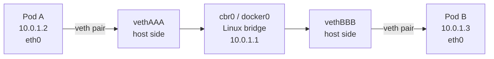
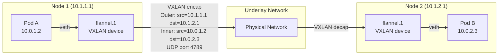
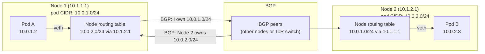
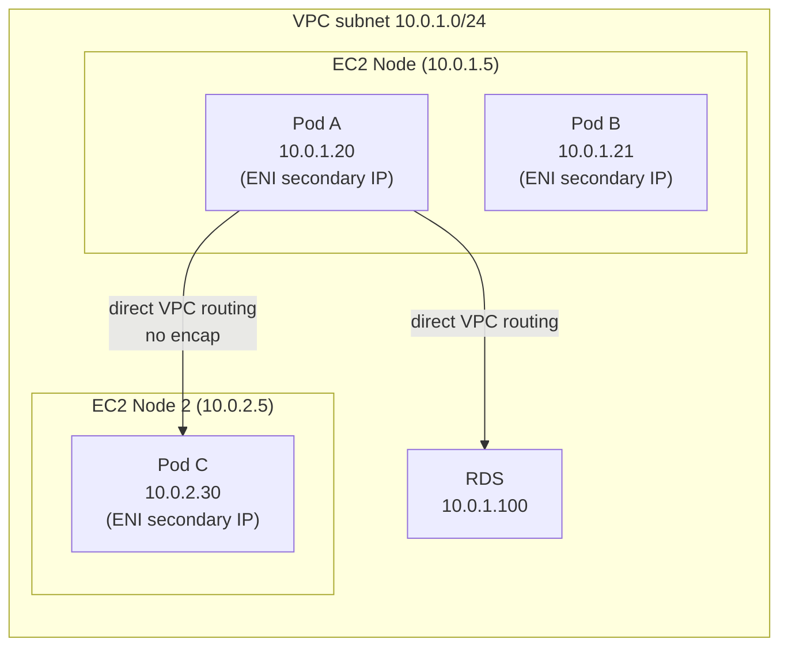

# Cross-Node Pod Networking

The Kubernetes networking model has three rules:
1. Every pod can reach every other pod without NAT
2. Nodes can reach pods without NAT
3. A pod sees its own IP the same way others see it

How this is implemented depends on the CNI plugin. Three patterns: overlay, direct routing, flat (VPC CNI).

Each mode below gets a quick knowledge check — track how many you've cleared as you go:

<div class="quiz-progress" data-quiz-progress>
  <span class="quiz-progress-label">0/0 checks</span>
  <span class="quiz-progress-bar"><span class="quiz-progress-fill"></span></span>
</div>

Before going mode-by-mode, here's how the four stack up side by side:

<div class="tab-group">
  <div class="tab-buttons">
    <button data-tab="samenode" class="active">Same-node</button>
    <button data-tab="vxlan">VXLAN overlay</button>
    <button data-tab="bgp">Calico BGP</button>
    <button data-tab="vpccni">VPC CNI (AWS)</button>
  </div>
  <div class="tab-panels">
    <div class="tab-panel active" data-tab-panel="samenode">
      <strong>Pod-to-pod, same node.</strong> No encapsulation, no routing decision at all &mdash; a Linux bridge (<code>cbr0</code>/<code>docker0</code>) forwards frames between each pod's veth pair based on its MAC table. Doesn't apply once pods land on different nodes.
    </div>
    <div class="tab-panel" data-tab-panel="vxlan">
      <strong>Overlay (Flannel).</strong> Cross-node packets get wrapped in an outer Ethernet/IP/UDP header (VXLAN, port 4789) so they can ride an underlay that has no idea what a pod CIDR is. Costs 50 bytes of overhead per packet &mdash; pod MTU has to shrink to compensate.
    </div>
    <div class="tab-panel" data-tab-panel="bgp">
      <strong>Direct routing (Calico BGP).</strong> Each node announces its own pod CIDR to the rest of the fabric over BGP, so the underlay's own routing table sends packets straight to the right node &mdash; zero encapsulation, full MTU. Needs a BGP-capable underlay or route injection.
    </div>
    <div class="tab-panel" data-tab-panel="vpccni">
      <strong>Flat network (AWS VPC CNI).</strong> Every pod gets a real ENI secondary IP straight from the VPC subnet &mdash; no overlay, no BGP, pods are first-class VPC citizens. Zero overhead, but capped by how many secondary IPs an instance's ENIs can hold.
    </div>
  </div>
</div>

---

## 1. Same-Node: Pod-to-Pod



**Packet walk:**
1. Pod A sends to `10.0.1.3` → kernel looks up routing table → route via `eth0` (default)
2. Packet exits Pod A's netns through the veth pair → appears on host side as `vethAAA`
3. Linux bridge (`cbr0`) sees the packet, looks up MAC table → forwards to `vethBBB`
4. Packet enters Pod B's netns through `vethBBB` → arrives at Pod B's `eth0`

Step through it:

<div class="stepper">
  <div class="stepper-panels">
    <div class="stepper-panel active">
      <strong>1. Pod A sends.</strong> App inside Pod A sends to <code>10.0.1.3</code>. The kernel checks Pod A's own routing table &mdash; default route is via its <code>eth0</code>, the pod-side end of the veth pair.
    </div>
    <div class="stepper-panel">
      <strong>2. Exit through the veth pair.</strong> The packet leaves Pod A's network namespace through the veth pair and shows up on the host side as <code>vethAAA</code> &mdash; an ordinary host-side network interface.
    </div>
    <div class="stepper-panel">
      <strong>3. Bridge forwards.</strong> The Linux bridge (<code>cbr0</code>/<code>docker0</code>) receives it, checks its MAC table, and forwards straight to <code>vethBBB</code>. No L3 routing decision happens here &mdash; it's a plain L2 bridge lookup.
    </div>
    <div class="stepper-panel">
      <strong>4. Delivery.</strong> The packet enters Pod B's netns through <code>vethBBB</code> and arrives at Pod B's <code>eth0</code>.
    </div>
  </div>
  <div class="stepper-controls">
    <button class="stepper-prev">← Prev</button>
    <span class="stepper-dots"></span>
    <span class="stepper-label"></span>
    <button class="stepper-next">Next →</button>
  </div>
</div>

```bash
# Inspect on a node
ip link show type veth          # list all veth pairs
brctl show cbr0                 # list bridge + attached veths
ip route                        # node routing table
```

<div class="quiz-card">
  <p class="quiz-q">On the same node, does traffic between two pods get an L3 routing decision made about it anywhere on the node?</p>
  <button class="quiz-reveal">Reveal answer</button>
  <div class="quiz-a" hidden>No &mdash; once the packet leaves Pod A's netns via the veth pair, the Linux bridge (<code>cbr0</code>/<code>docker0</code>) forwards it to Pod B's veth purely by MAC table lookup. That's an L2 bridging decision, not a routed one; same-node pod traffic never touches the node's IP routing table.</div>
</div>

---

## 2. Cross-Node: Overlay (VXLAN) — Flannel

Used when the underlay network can't route pod CIDRs (most cloud VPCs without CNI help, on-prem).



**VXLAN encapsulation adds:**
- Outer Ethernet header (14 bytes)
- Outer IP header (20 bytes)
- Outer UDP header (8 bytes, dst port 4789)
- VXLAN header (8 bytes)
- **Total overhead: 50 bytes** per packet

**MTU implication:** If the underlay MTU is 1500, pod MTU must be set to **1450** (1500 - 50). Flannel sets this automatically on the `flannel.1` interface. Wrong MTU → packets silently fragmented or dropped.

Step through it:

<div class="stepper">
  <div class="stepper-panels">
    <div class="stepper-panel active">
      <strong>1. Pod A sends.</strong> A normal packet, Pod A (<code>10.0.1.2</code>) to Pod B (<code>10.0.2.3</code>), leaves via the veth pair and hits Node 1's <code>flannel.1</code> VXLAN device.
    </div>
    <div class="stepper-panel">
      <strong>2. Encapsulation.</strong> <code>flannel.1</code> wraps the whole original packet in a new outer header: outer src=Node 1's IP, outer dst=Node 2's IP, UDP port 4789 &mdash; 50 bytes of added overhead.
    </div>
    <div class="stepper-panel">
      <strong>3. Underlay transit.</strong> The encapsulated packet crosses the physical network as an ordinary UDP packet between two node IPs. The underlay never has to know a pod CIDR exists.
    </div>
    <div class="stepper-panel">
      <strong>4. Decapsulation &amp; delivery.</strong> Node 2's <code>flannel.1</code> strips the outer header, recovers the original inner packet, and forwards it over the veth pair to Pod B.
    </div>
  </div>
  <div class="stepper-controls">
    <button class="stepper-prev">← Prev</button>
    <span class="stepper-dots"></span>
    <span class="stepper-label"></span>
    <button class="stepper-next">Next →</button>
  </div>
</div>

```bash
# Check pod MTU
kubectl exec <pod> -- ip link show eth0 | grep mtu

# On the node: inspect the VXLAN interface
ip -d link show flannel.1
ip route | grep flannel    # routes for each remote node's pod CIDR

# Test MTU: ping with DF bit set and large payload
ping -M do -s 1450 10.0.2.3   # if fails → MTU problem
```

<div class="quiz-card">
  <p class="quiz-q">The underlay network MTU is 1500. What pod MTU should Flannel VXLAN use, and why?</p>
  <button class="quiz-reveal">Reveal answer</button>
  <div class="quiz-a" hidden>1450. VXLAN encapsulation adds 50 bytes of overhead (outer Ethernet + IP + UDP + VXLAN headers), so the inner pod packet has to be 50 bytes smaller than the underlay's MTU &mdash; otherwise the encapsulated packet exceeds 1500 bytes and gets silently fragmented or dropped.</div>
</div>

---

## 3. Cross-Node: Direct Routing (Calico BGP)

No encapsulation. Each node announces its pod CIDR to other nodes via BGP. The underlay routes packets between nodes directly.



**Packet walk:**
1. Pod A sends to `10.0.2.3`
2. Node 1 routing table: `10.0.2.0/24 via 10.1.2.1` (learned from BGP)
3. Packet sent to Node 2's IP — **no encapsulation, full MTU available**
4. Node 2 routing table: `10.0.2.3 via vethXXX` → forwarded to Pod B

Step through it:

<div class="stepper">
  <div class="stepper-panels">
    <div class="stepper-panel active">
      <strong>1. Pod A sends.</strong> App inside Pod A sends to <code>10.0.2.3</code>, an IP on Node 2's pod CIDR.
    </div>
    <div class="stepper-panel">
      <strong>2. Local route lookup.</strong> Node 1's routing table already has <code>10.0.2.0/24 via 10.1.2.1</code> &mdash; learned from BGP, not configured by hand.
    </div>
    <div class="stepper-panel">
      <strong>3. Direct node-to-node delivery.</strong> The packet goes straight to Node 2's IP, unmodified &mdash; no encapsulation, no extra headers, full MTU available the whole way.
    </div>
    <div class="stepper-panel">
      <strong>4. Node 2 delivers.</strong> Node 2's own routing table sends it to <code>vethXXX</code>, which hands it to Pod B.
    </div>
  </div>
  <div class="stepper-controls">
    <button class="stepper-prev">← Prev</button>
    <span class="stepper-dots"></span>
    <span class="stepper-label"></span>
    <button class="stepper-next">Next →</button>
  </div>
</div>

**Requirement:** The underlay network must either:
- Support BGP (ToR switches in bare metal)
- Allow route injection (AWS VPC with `--disable-pod-vpc-route-table-management=false`)

```bash
# Check BGP peers (calicoctl)
calicoctl node status

# Inspect Calico routes injected into node
ip route | grep bird   # Bird is the BGP daemon Calico uses

# Check encapsulation mode
calicoctl get felixconfiguration default -o yaml | grep encapsulation
```

<div class="quiz-card">
  <p class="quiz-q">True or false: Calico BGP mode works unmodified on any network, the same way a VXLAN overlay does.</p>
  <button class="quiz-reveal">Reveal answer</button>
  <div class="quiz-a" hidden>False. BGP direct routing needs the underlay to either speak BGP itself (ToR switches in bare metal) or allow route injection (as with AWS VPC route tables) &mdash; it depends on the underlay actually learning and honoring pod-CIDR routes. A VXLAN overlay doesn't need any of that, which is exactly why overlays exist for underlays that can't or won't cooperate.</div>
</div>

---

## 4. VPC CNI Flat Network (AWS)

Every pod gets a **real ENI IP** from the VPC subnet. No overlay, no BGP — pods are first-class citizens in the VPC.



**How it works:**
1. `aws-node` DaemonSet runs on every node
2. It pre-allocates **secondary IPs** on the node's ENIs (or creates additional ENIs)
3. When a pod is created, the CNI plugin assigns one of the pre-allocated IPs to the pod
4. VPC routing table already knows these IPs belong to this EC2 instance

Step through a packet's actual cross-node journey (not the setup steps above):

<div class="stepper">
  <div class="stepper-panels">
    <div class="stepper-panel active">
      <strong>1. Pod A sends.</strong> Pod A addresses the packet straight to Pod C's IP (<code>10.0.2.30</code>) &mdash; a real VPC address, not something translated later.
    </div>
    <div class="stepper-panel">
      <strong>2. Kernel routes via the ENI.</strong> Node 1's routing table sends the packet straight out its ENI, unmodified, addressed to Pod C's IP.
    </div>
    <div class="stepper-panel">
      <strong>3. VPC routing table forwards.</strong> The subnet's route table already knows <code>10.0.2.30</code> belongs to EC2 Node 2's ENI, and delivers it there directly &mdash; ordinary EC2-to-EC2 routing, no CNI-specific handling in the fabric at all.
    </div>
    <div class="stepper-panel">
      <strong>4. Delivery.</strong> Node 2 recognizes the destination as one of its own ENI secondary IPs (bound to Pod C) and hands the packet to Pod C's veth.
    </div>
  </div>
  <div class="stepper-controls">
    <button class="stepper-prev">← Prev</button>
    <span class="stepper-dots"></span>
    <span class="stepper-label"></span>
    <button class="stepper-next">Next →</button>
  </div>
</div>

**Benefits:**
- Zero encapsulation overhead — same performance as EC2-to-EC2
- Pod IP directly reachable from RDS, ElastiCache, on-prem via VPN
- Security Groups work per-pod (with Security Groups for Pods feature)
- No MTU penalty

**Limitation: IP exhaustion**

Each EC2 instance can hold a limited number of ENI secondary IPs (based on instance type):
```bash
# Check how many IPs are available
kubectl describe node <node> | grep eni

# m5.large: 3 ENIs × 10 IPs = 30 pods max (minus 1 per ENI for node = 27)
# Fix 1: use larger instance types
# Fix 2: enable prefix delegation (/28 prefix per ENI slot = 16 IPs per slot)
```

**Prefix delegation** (recommended for large clusters):
```yaml
# Enable in aws-node DaemonSet env vars:
ENABLE_PREFIX_DELEGATION: "true"
WARM_PREFIX_TARGET: "1"
# Each ENI slot now holds a /28 (16 IPs) instead of 1 IP
# m5.large: 3 ENIs × (9 slots × 16 IPs) = 432 pods max
```

```bash
# Check current IP allocation
kubectl get node <node> -o json | jq '.metadata.annotations["vpc.amazonaws.com/node-capacity-suffix-ip-block"]'

# Check aws-node logs for IP allocation issues
kubectl logs -n kube-system -l k8s-app=aws-node --tail=50
```

<div class="quiz-card">
  <p class="quiz-q">Why does enabling prefix delegation let a node run far more pods without adding a single ENI?</p>
  <button class="quiz-reveal">Reveal answer</button>
  <div class="quiz-a" hidden>Each ENI slot that used to hold one secondary IP now holds a whole /28 prefix &mdash; 16 IPs &mdash; instead. Same number of ENIs and slots, 16x more usable addresses per slot, so the pod ceiling per node jumps accordingly (e.g. an m5.large goes from 27 pods to 432).</div>
</div>

---

## 5. MTU Summary

| CNI | Encap overhead | Recommended pod MTU |
|-----|---------------|-------------------|
| Flannel VXLAN | 50 bytes | 1450 |
| Calico IPIP | 20 bytes | 1480 |
| Calico BGP (no encap) | 0 bytes | 1500 |
| AWS VPC CNI | 0 bytes | 9001 (jumbo frames on EC2) |
| Cilium VXLAN | 50 bytes | 1450 |
| Cilium native routing | 0 bytes | 1500 |

```bash
# Check current MTU on a pod
kubectl exec <pod> -- cat /sys/class/net/eth0/mtu

# Test effective MTU with DF bit
kubectl exec <pod> -- ping -M do -s 1440 <other-pod-ip>
# Increase -s until it fails → that's your effective MTU

# Check CNI's configured MTU
cat /etc/cni/net.d/10-flannel.conflist | jq '.plugins[0].mtu'
```

<div class="quiz-card">
  <p class="quiz-q">A pod's MTU is left higher than what its CNI's encapsulation can actually deliver end to end. What's the typical symptom?</p>
  <button class="quiz-reveal">Reveal answer</button>
  <div class="quiz-a" hidden>Packets get silently fragmented or dropped &mdash; not a clean, visible error. This is exactly why the recommended pod MTU in the table above has to account for each CNI's encapsulation overhead rather than just matching the underlay's MTU.</div>
</div>

---

## 6. Live Simulator: Packet Path + MTU

The four walkthroughs above each trace one hardcoded packet. This one's live: pick same-node or cross-node, pick a CNI mode, then try packet sizes on either side of that mode's effective MTU from the table above and watch where the packet actually gets through.

<div class="structure-viz" id="cni-mtu-viz">
  <svg class="viz-canvas" viewBox="0 0 470 120"></svg>
  <div class="viz-controls">
    <button class="viz-btn" data-viz-action="pp-samenode">Same-node</button>
    <button class="viz-btn" data-viz-action="pp-crossnode">Cross-node</button>
    <button class="viz-btn" data-viz-action="mode-vxlan">VXLAN (Flannel)</button>
    <button class="viz-btn" data-viz-action="mode-bgp">BGP (Calico)</button>
    <button class="viz-btn" data-viz-action="mode-vpccni">VPC CNI (AWS)</button>
    <input class="viz-input" type="number" min="1" value="1400" />
    <span>bytes</span>
  </div>
  <div class="viz-status"></div>
  <div class="viz-legend">
    <span><span class="viz-swatch" style="background:#78350f"></span> traversed hop</span>
    <span><span class="viz-swatch" style="background:#7f1d1d"></span> MTU-limited hop</span>
    <span><span class="viz-swatch" style="background:#1e3a8a"></span> not reached / not on path</span>
  </div>
</div>

<script>
(function () {
  var svgNS = 'http://www.w3.org/2000/svg';
  var root = document.getElementById('cni-mtu-viz');
  var svg = root.querySelector('.viz-canvas');
  var status = root.querySelector('.viz-status');
  var input = root.querySelector('.viz-input');
  var ppButtons = Array.prototype.slice.call(root.querySelectorAll('[data-viz-action^="pp-"]'));
  var modeButtons = Array.prototype.slice.call(root.querySelectorAll('[data-viz-action^="mode-"]'));

  var MTU_TABLE = {
    vxlan: { name: 'Flannel VXLAN', crossNodeMtu: 1450 },
    bgp: { name: 'Calico BGP', crossNodeMtu: 1500 },
    vpccni: { name: 'AWS VPC CNI', crossNodeMtu: 9001 }
  };
  var SAME_NODE_MTU = 1500;

  function effectiveMtu(mode, podPair) {
    if (podPair === 'samenode') return SAME_NODE_MTU;
    return MTU_TABLE[mode].crossNodeMtu;
  }

  // Policy: at/under effective MTU -&gt; delivered; up to 2x -&gt; fragmented
  // (DF bit unset, kernel splits into IP fragments); beyond 2x -&gt; dropped
  // (treated as exceeding what fragmentation can reasonably recover).
  function classifyPacket(mode, podPair, size) {
    var mtu = effectiveMtu(mode, podPair);
    var outcome;
    if (size <= mtu) outcome = 'delivered';
    else if (size <= mtu * 2) outcome = 'fragmented';
    else outcome = 'dropped';
    return { outcome: outcome, mtu: mtu };
  }

  function getHops(mode, podPair) {
    if (podPair === 'samenode') {
      return {
        hops: [
          { label: 'Pod A', sub: 'sender' },
          { label: 'Bridge', sub: 'L2 (cbr0)' },
          { label: 'Pod B', sub: 'receiver' }
        ],
        problemIndex: 1
      };
    }
    var byMode = {
      vxlan: [
        { label: 'Pod A', sub: '10.0.1.2' },
        { label: 'flannel.1', sub: '+50B encap' },
        { label: 'Underlay', sub: 'UDP 4789' },
        { label: 'flannel.1', sub: 'decap' },
        { label: 'Pod B', sub: '10.0.2.3' }
      ],
      bgp: [
        { label: 'Pod A', sub: '10.0.1.2' },
        { label: 'Route table', sub: 'BGP-learned' },
        { label: 'Underlay', sub: 'no encap' },
        { label: 'Route table', sub: 'Node 2' },
        { label: 'Pod B', sub: '10.0.2.3' }
      ],
      vpccni: [
        { label: 'Pod A', sub: '10.0.1.20' },
        { label: 'ENI', sub: 'kernel routes' },
        { label: 'VPC routes', sub: 'no CNI' },
        { label: 'ENI', sub: 'ENI match' },
        { label: 'Pod C', sub: '10.0.2.30' }
      ]
    };
    return { hops: byMode[mode], problemIndex: 1 };
  }

  function computeLayout(hopCount) {
    var SLOT_W = 110, SLOT_H = 50, GAP = 50, MARGIN = 40;
    var vbW = hopCount * SLOT_W + (hopCount - 1) * GAP + 2 * MARGIN;
    var positions = [];
    for (var i = 0; i < hopCount; i++) positions.push({ x: MARGIN + i * (SLOT_W + GAP) });
    return { vbW: vbW, positions: positions, SLOT_W: SLOT_W, SLOT_H: SLOT_H };
  }

  var state = { podPair: 'crossnode', mode: 'vxlan' };

  function el(tag, attrs) {
    var e = document.createElementNS(svgNS, tag);
    for (var k in attrs) e.setAttribute(k, attrs[k]);
    return e;
  }

  function setActive(buttons, activeBtn) {
    buttons.forEach(function (b) {
      if (b === activeBtn) {
        b.style.background = 'var(--accent)';
        b.style.color = 'var(--on-accent)';
        b.style.borderColor = 'var(--accent)';
      } else {
        b.style.background = '';
        b.style.color = '';
        b.style.borderColor = '';
      }
    });
  }

  function updateStatus(outcome, mtu, size, validSize, hops, problemIndex) {
    if (!validSize) {
      status.textContent = 'Enter a packet size in bytes.';
      status.className = 'viz-status viz-status-error';
      return;
    }
    var modeName = MTU_TABLE[state.mode].name;
    var topoNote = state.podPair === 'samenode'
      ? 'same-node traffic bypasses CNI encapsulation entirely, so MTU is the plain link MTU regardless of mode'
      : modeName + '’s effective MTU';
    if (outcome === 'delivered') {
      status.textContent = 'Delivered. ' + size + 'B fits within ' + mtu + 'B (' + topoNote + ').';
      status.className = 'viz-status viz-status-ok';
    } else if (outcome === 'fragmented') {
      status.textContent = 'Fragmented. ' + size + 'B exceeds ' + mtu + 'B (' + topoNote + ') — split into multiple IP fragments at "' + hops[problemIndex].label + '" (hop ' + (problemIndex + 1) + ').';
      status.className = 'viz-status viz-status-error';
    } else {
      status.textContent = 'Dropped. ' + size + 'B is more than double ' + mtu + 'B (' + topoNote + ') — never reaches "' + hops[hops.length - 1].label + '"; unrecoverable at "' + hops[problemIndex].label + '" (hop ' + (problemIndex + 1) + ').';
      status.className = 'viz-status viz-status-error';
    }
  }

  function draw() {
    var hopData = getHops(state.mode, state.podPair);
    var hops = hopData.hops;
    var problemIndex = hopData.problemIndex;
    var size = parseInt(input.value, 10);
    var validSize = !isNaN(size) && size > 0;
    var result = validSize
      ? classifyPacket(state.mode, state.podPair, size)
      : { outcome: null, mtu: effectiveMtu(state.mode, state.podPair) };
    var outcome = result.outcome;
    var mtu = result.mtu;

    var layout = computeLayout(hops.length);
    var vbH = 120;
    svg.setAttribute('viewBox', '0 0 ' + layout.vbW + ' ' + vbH);
    while (svg.firstChild) svg.removeChild(svg.firstChild);

    var y = 34;
    hops.forEach(function (hop, i) {
      var pos = layout.positions[i];
      if (i < hops.length - 1) {
        var edgeCls = 'viz-edge';
        if (outcome === 'delivered' || outcome === 'fragmented') edgeCls = 'viz-edge-active';
        else if (outcome === 'dropped' && i < problemIndex) edgeCls = 'viz-edge-active';
        svg.appendChild(el('line', {
          x1: pos.x + layout.SLOT_W, y1: y + layout.SLOT_H / 2,
          x2: pos.x + layout.SLOT_W + 50, y2: y + layout.SLOT_H / 2,
          class: edgeCls
        }));
      }
      var nodeCls = 'viz-node';
      if (outcome === null) {
        nodeCls = 'viz-node';
      } else if (outcome === 'delivered') {
        nodeCls = 'viz-node-highlight';
      } else if (i < problemIndex) {
        nodeCls = 'viz-node-highlight';
      } else if (i === problemIndex) {
        nodeCls = 'viz-node-removing';
      } else {
        nodeCls = outcome === 'fragmented' ? 'viz-node-highlight' : 'viz-node';
      }
      svg.appendChild(el('rect', { x: pos.x, y: y, width: layout.SLOT_W, height: layout.SLOT_H, rx: 8, class: nodeCls }));
      var t = el('text', { x: pos.x + layout.SLOT_W / 2, y: y + layout.SLOT_H / 2 });
      t.textContent = hop.label;
      svg.appendChild(t);
      var sub = el('text', { x: pos.x + layout.SLOT_W / 2, y: y + layout.SLOT_H + 16, class: 'viz-label-dim' });
      sub.textContent = hop.sub;
      svg.appendChild(sub);
      var step = el('text', { x: pos.x + layout.SLOT_W / 2, y: 14, class: 'viz-label-dim' });
      step.textContent = 'hop ' + (i + 1);
      svg.appendChild(step);
    });

    updateStatus(outcome, mtu, size, validSize, hops, problemIndex);
  }

  ppButtons.forEach(function (btn) {
    btn.addEventListener('click', function () {
      state.podPair = btn.getAttribute('data-viz-action').replace('pp-', '');
      setActive(ppButtons, btn);
      draw();
    });
  });

  modeButtons.forEach(function (btn) {
    btn.addEventListener('click', function () {
      state.mode = btn.getAttribute('data-viz-action').replace('mode-', '');
      setActive(modeButtons, btn);
      draw();
    });
  });

  input.addEventListener('input', draw);

  setActive(ppButtons, ppButtons[1]);
  setActive(modeButtons, modeButtons[0]);
  draw();
})();
</script>

---

## 7. Inspecting the Network on a Node

```bash
# All veth pairs (one per pod)
ip link show type veth

# Routing table (how pod CIDRs are reached)
ip route

# ARP/neighbor table
ip neigh

# Pod IP to veth mapping
for veth in $(ls /sys/class/net | grep veth); do
  peer=$(ip link show $veth | grep -o 'veth[0-9a-f]*' | tail -1)
  echo "$veth ↔ $peer"
done

# Which pod owns a veth (Linux netns approach)
nsenter --net=/proc/$(pgrep -f pause)/net ip addr show eth0
```
