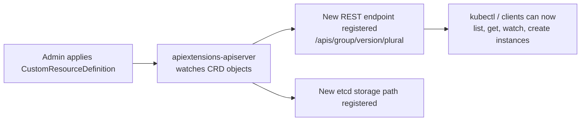
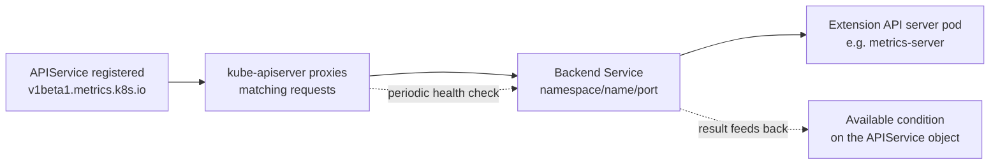
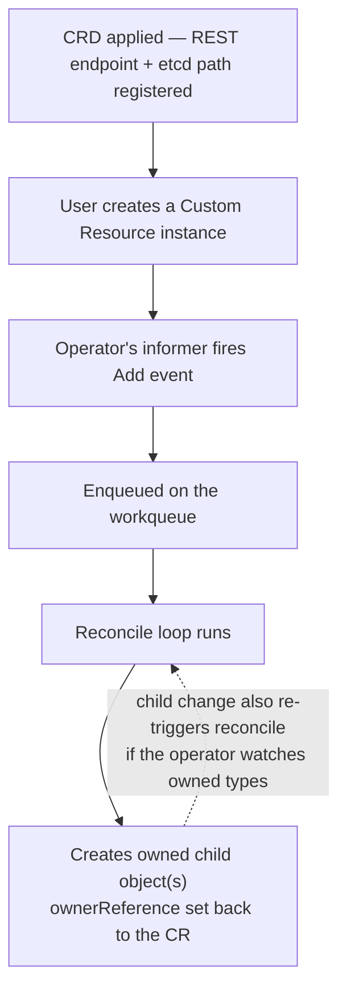

# Custom Resources and the Operator Pattern — Extending the Kubernetes API

[controller-pattern.md](./controller-pattern.md)'s closing line already gave away the mechanism: an operator is an informer, a workqueue, and a level-triggered reconcile loop — pointed at a Custom Resource instead of a Pod or Deployment. That part doesn't change and isn't re-derived here. What *is* different, and what this file actually covers, is everything about how a Custom Resource itself comes into existence as a first-class API type: how the API server learns about a new Kind without a restart, what makes an instance of it valid or invalid, how it survives schema changes across versions, and how it participates in cleanup the same way a Pod does. If you haven't read controller-pattern.md, start there — informers, workqueues, and reconcile loops are assumed knowledge from here on.

  0/0 checks
  

---

## 1. From Built-In Type to Custom Type — How the API Server Learns a New Kind

A `CustomResourceDefinition` is itself an API object (`apiextensions.k8s.io/v1`). Applying one isn't out-of-band configuration — it's a normal `kubectl apply`, processed by an in-process, built-in extension of the API server (`apiextensions-apiserver`) that watches CRD objects and dynamically stands up a new REST path (`/apis/<group>/<version>/namespaces/<ns>/<plural>`) and an etcd storage location for it.

Contrast with a built-in type: Pod, Deployment, and Service have their REST handlers and OpenAPI schema compiled directly into the `kube-apiserver` binary. A CRD gets equivalent treatment — list/get/watch/create/update/delete, RBAC-gated the same way, discoverable via `kubectl api-resources` — entirely from a declarative spec, with no rebuild or restart of the API server itself.

  
Does registering a new CRD require restarting kube-apiserver, the way adding a new built-in type would require rebuilding it?

  <button class="quiz-reveal">Reveal answer</button>
  
No. apiextensions-apiserver is itself a running, built-in part of the API server that watches CustomResourceDefinition objects and dynamically registers the new REST path and storage location the moment one is applied. Built-in types need their handlers compiled into the binary because there's no equivalent dynamic-registration path for them — CRDs exist specifically to skip that requirement.

---

## 2. OpenAPI v3 Schema Validation — the CRD-Specific Gate

Every CRD declares a **structural schema** (`spec.versions[].schema.openAPIV3Schema`, required since `apiextensions.k8s.io/v1`) — types, required fields, enums, minimum/maximum, array length constraints, `x-kubernetes-preserve-unknown-fields` for anything intentionally left open. Every write to an instance of that Kind is checked against it before the object is ever persisted.

[policy-security.md](./policy-security.md)'s admission-chain diagram already has a step for exactly this — its `Schema Validation` node, sitting between mutating and validating webhooks — and a CRD instance goes through that same stage. This is precisely why a CRD doesn't need a bespoke webhook just to reject a string where an integer belongs: the check is declarative, in-process, and unconditional, with no network hop to a webhook server at all.

Schema validation stops at structure, though. It has no way to express a cross-field or cross-resource business rule — "this field is only valid if that other one is set," "no two `Certificate`s in this namespace may request the same DNS name." That gap is exactly what a CRD-specific **validating webhook** exists to fill, the same webhook mechanism `policy-security.md` covers for built-in types, just registered by the CRD's own project (cert-manager registers one; so does the Prometheus Operator).

### Try It Yourself: Live Schema Validation

A toy `Certificate`-like schema — `dnsNames` (array of string, required, at least 1 entry), `issuerRef.name` (string, required), `issuerRef.kind` (optional, enum: `Issuer`/`ClusterIssuer`), `duration` and `renewBefore` (optional, `"<N>h"` pattern). Run each canned scenario and watch which fields the schema itself rejects — and notice the last one, where every field is individually well-formed but the *combination* is still wrong.

  <svg class="viz-canvas" viewBox="0 0 460 180"></svg>
  

    <button class="viz-btn" data-scenario="valid">Valid instance</button>
    <button class="viz-btn viz-btn-danger" data-scenario="missingRequired">Missing required field</button>
    <button class="viz-btn viz-btn-danger" data-scenario="wrongType">Wrong type</button>
    <button class="viz-btn viz-btn-danger" data-scenario="badEnum">Bad enum</button>
    <button class="viz-btn viz-btn-danger" data-scenario="crossFieldGap">renewBefore &gt;= duration</button>
    <button class="viz-btn" data-viz-action="reset">Reset</button>
  

  

  

     field satisfies the schema
     schema violation (or the field a business rule would flag)
  

  
A CRD has no validating webhook registered at all — only its OpenAPI schema. Someone submits an instance with a string in a field typed as an integer. Does it get rejected?

  <button class="quiz-reveal">Reveal answer</button>
  
Yes. Structural schema validation is unconditional and runs regardless of whether any webhook exists — a type mismatch is exactly the kind of thing OpenAPI v3 schema is built to catch on its own, with no webhook involved at all. Webhooks are additive on top of this, not the only gate.

---

## 3. Versions, Conversion, and the Storage Version

A CRD can serve multiple versions at once — `v1alpha1`, `v1beta1`, `v1` — but exactly one is marked `storage: true`, the version etcd actually persists bytes as. Every other served version is a *view*, materialized on read and write via conversion.

  

    <button data-tab="none" class="active">Conversion: None</button>
    <button data-tab="webhook">Conversion: Webhook</button>
  

  

    

      Legal only when every served version is structurally identical — genuinely a no-op, since there's nothing to translate. Simple, but only applicable if you've never actually changed the schema shape between versions, just added a new version number.
    

    

      An HTTPS endpoint the CRD's own project runs. The API server sends it a <code>ConversionReview</code> and gets back the object translated to whichever version was requested. This is genuinely novel compared to built-in types — Pod/Deployment conversion logic ships compiled into kube-apiserver itself; a CRD has no such binary to compile into, so the project has to run this webhook themselves.
    

  

Why this matters operationally: a controller written against `v1beta1`, reconciling objects that are actually stored as `v1`, needs conversion to be transparent — or it silently reads and writes the wrong shape.

  
A CRD serves v1alpha1, v1beta1, and v1 simultaneously, all structurally different from each other. Why is there exactly one storage version instead of three?

  <button class="quiz-reveal">Reveal answer</button>
  
etcd persists one physical byte representation per object. Every other served version has to be derivable FROM that stored representation via conversion — there has to be a single canonical source of truth to convert from, or "what does this object actually look like" stops having one answer. Multiple storage versions would mean multiple, potentially-inconsistent sources of truth for the same object.

---

## 4. Subresources — `/status` and `/scale`

`spec.versions[].subresources.status` splits status updates onto their own endpoint with independent RBAC verbs. This is what makes "users own spec, controllers own status" an *enforceable* boundary rather than just a naming convention — a ServiceAccount can be granted `update` on the `status` subresource without `update` on the resource itself, and vice versa. Without this subresource, spec and status share one `PUT` and RBAC has no way to separate the two concerns.

`spec.versions[].subresources.scale` (`specReplicasPath`, `statusReplicasPath`, `labelSelectorPath`) is what lets `kubectl scale` and HPA target a custom resource generically — HPA never needs to know the CRD's schema at all, only that it declares a scale subresource at those three JSON paths. The control-loop mechanics of HPA itself are [hpa-vpa-internals.md](./hpa-vpa-internals.md)'s territory, not repeated here.

  
Could an operator just skip declaring a status subresource and PUT the whole object — spec and status together — on every reconcile?

  <button class="quiz-reveal">Reveal answer</button>
  
Mechanically, yes — it would still work. But it collapses the RBAC boundary between "who can change desired state" and "who can report actual state" into one undifferentiated write permission, the exact same failure mode you'd get anywhere else in Kubernetes if spec and status weren't separated. It's a real, not cosmetic, loss — not a bug, but a design regression.

---

## 5. CRDs vs. the API Aggregation Layer

A second, less common way to extend the Kubernetes API: `APIService` objects (`apiregistration.k8s.io`) let `kube-apiserver` proxy an entire group/version to a *separate* API server binary you run yourself — full control over serving logic, but you own storage, watch semantics, and RBAC wiring entirely on your own. `metrics-server` is the canonical example.

CRDs are for "I want a new Kind stored the standard way — etcd, watch/list, RBAC, resourceVersion tracking — for free." That's why essentially every operator (cert-manager, the Prometheus Operator, ArgoCD) uses a CRD, not the aggregation layer: they want a normal, watchable, etcd-backed object a reconcile loop can act on, and building a whole separate API server binary just to get that would be reinventing what a CRD already provides.

  
metrics-server uses the aggregation layer instead of a CRD. Why not just make live pod/node metrics a CRD?

  <button class="quiz-reveal">Reveal answer</button>
  
Because its data — live CPU/memory usage — isn't meant to be durably stored in etcd at all; it's fetched fresh from kubelets on every request and is stale the instant it's written down. A CRD forces etcd-backed storage as part of the deal. The aggregation layer lets metrics-server skip storage entirely and just serve live data through the normal API path, which is exactly the shape this data actually has.

An `APIService` object is what actually performs that proxying, and its own shape is worth looking at directly. It's an `apiregistration.k8s.io/v1` object named `<version>.<group>` — `v1beta1.metrics.k8s.io` for metrics-server, not an arbitrary name kube-apiserver has to look up separately. Its `spec.service` points at the backing extension API server's Kubernetes Service by `namespace`/`name`/`port`, and `spec.caBundle` is the CA kube-apiserver uses to TLS-verify that Service before proxying anything to it. There's an escape hatch, `insecureSkipTLSVerify: true`, that skips this check entirely — and in production that's a real security hole, not just sloppiness: without TLS verification, kube-apiserver trusts whatever answers on that Service's ClusterIP, so any workload that can get itself scheduled behind (or spoof) that Service now speaks for a trusted, aggregated slice of the Kubernetes API surface, indistinguishable from a client's perspective from the real backend.

When more than one `APIService` could plausibly serve overlapping discovery — two metrics providers registering related group/versions, or a version migration where an aggregated API's old and new versions are briefly both registered — `spec.groupPriorityMinimum` and `spec.versionPriority` are how the API server picks a winner. Higher priority wins: discovery and routing prefer the highest-priority `APIService` for a given group, and the highest-priority version within that group, rather than erroring out or picking one nondeterministically.

Not everything `kubectl get apiservices` lists is backed by a separate process, either. Built-in group/versions (`v1`, `apps/v1`, and so on) show up in that same list as **local** `APIService` objects — served directly by kube-apiserver itself, with no real proxying happening at all. A genuine extension server like metrics-server is a **remote** `APIService` — an actual Service and Deployment kube-apiserver hands requests off to over the network. This is a common point of confusion when debugging why an aggregated API "looks unavailable": most of what that command lists was never going to have a backend to check in the first place, because it isn't proxying anywhere.

That local/remote split matters for what happens on failure, too. If a remote `APIService`'s backing Service has no healthy endpoints, requests to that group/version don't hang or generically time out — they come back `503 Service Unavailable`, with an error naming the aggregation layer specifically rather than a bare connection failure. The aggregation layer also runs its own periodic health check against the backend and reflects the result as an `Available` condition on the `APIService` object itself — visible via `kubectl get apiservices` (a `False` there is the first place to look) or in detail via `kubectl describe apiservice <name>`. A CRD has no equivalent failure mode at all: there's no separate backend that can go down, because kube-apiserver serves CRD instances itself, the same as any built-in type — the single point of failure the aggregation layer introduces for a remote `APIService` simply doesn't exist for a CRD.

  
An aggregated API's backing Deployment crashes. What's the blast radius, compared to the same failure for a CRD?

  <button class="quiz-reveal">Reveal answer</button>
  
For the aggregated API, only that specific group/version is affected — requests to it return 503 Service Unavailable until the backend recovers, while the rest of the cluster's API surface keeps working normally. A CRD has no equivalent failure mode at all: it's served directly by kube-apiserver, with no separate backend process to crash in the first place, so there's nothing here for it to lose.

---

## 6. Assembling the Operator Pattern

Everything about how the controller actually *behaves* once the CR exists — informer, workqueue, level-triggered reconcile, resync, leader election for HA — is exactly [controller-pattern.md](./controller-pattern.md)'s mechanism, completely unchanged. What's new here is what the controller is watching, and what it does with the things it creates.

When a controller creates a child object on behalf of a CR — a `Secret`, a `Deployment` — it sets an `ownerReference` back to the CR. Kubernetes' built-in garbage-collection controller then cascades deletes automatically once the CR is deleted, the exact same mechanism that deletes Pods when their owning ReplicaSet disappears, just now applied to CR-owned children.

Not every cleanup is expressible that way, though. Deprovisioning a cloud load balancer, revoking a certificate from an external CA — these aren't "delete a Kubernetes object," they're calls to something outside the cluster entirely. For that, an operator adds a **finalizer** string to the CR, which blocks its actual deletion from completing until the operator's own reconcile loop has done that external work and explicitly removed the finalizer.

  
The CR that owns a Secret an operator created gets deleted. Does the operator need its own explicit code to go delete that Secret?

  <button class="quiz-reveal">Reveal answer</button>
  
No — as long as ownerReferences was set correctly when the Secret was created, Kubernetes' built-in garbage collector cascades the delete on its own. This is the same mechanism that deletes Pods when their ReplicaSet is deleted; nothing operator-specific about it. Bespoke cleanup code is only needed for things that AREN'T themselves Kubernetes objects — an external cloud resource, for instance — which is what finalizers are for instead.

---

## 7. Real-World Examples — Three Different Shapes of the Same Pattern

**cert-manager** (`Certificate`, `CertificateRequest`, `Issuer`/`ClusterIssuer`) is the "reconcile toward a running thing" shape — a `Certificate` CR describes desired end-state (a valid TLS cert, landed in a named Secret), and the controller drives toward it through several intermediate CRs along the way.

**Prometheus Operator** (`ServiceMonitor`, `PodMonitor`) is a genuinely different shape worth calling out on its own: these CRs aren't "things to run" at all — they're declarative scrape-target configuration. The operator's controller watches every `ServiceMonitor` in the cluster and regenerates one aggregated Prometheus scrape config from all of them, then reconciles the actual `Prometheus` StatefulSet to pick it up. Not every operator spins up a workload — some exist purely to aggregate config scattered across many small CRs into one place.

**ArgoCD** (`Application`) gets one paragraph here, since [cicd/argocd/README.md](../cicd/argocd/README.md) already covers it in real depth (sync policies, App-of-Apps, ApplicationSet). The short version: `Application` is a CR whose controller diffs live cluster state against manifests rendered from Git and applies the difference — GitOps itself, expressed entirely as reconciling a CRD. See that file for the rest.

### Try It Yourself: cert-manager Issues a Certificate, End to End

  

    

      <strong>1. Certificate CR created.</strong> Desired state: a valid TLS cert for <code>example.com</code>, eventually landed in a named Secret. Nothing has been issued yet.
    

    

      <strong>2. Controller reconciles.</strong> cert-manager's controller sees no valid cert exists for this Certificate yet — desired state and actual state don't match.
    

    

      <strong>3. CertificateRequest created.</strong> The controller creates a CertificateRequest (a CSR wrapped as its own CR) referencing the Certificate's configured Issuer.
    

    

      <strong>4. ACME challenge solved.</strong> For an ACME issuer, an HTTP-01 or DNS-01 challenge is created and solved to prove control of <code>example.com</code> before any cert gets issued.
    

    

      <strong>5. Certificate issued.</strong> The ACME server returns the signed certificate to the CertificateRequest.
    

    

      <strong>6. Written to the Secret.</strong> The controller writes the cert and private key into the target Secret and flips the Certificate's <code>status.conditions</code> to <code>Ready: True</code> — desired and actual now match, reconcile goes quiet until renewal is due.
    

  

  

    <button class="stepper-prev">← Prev</button>
    
    
    <button class="stepper-next">Next →</button>
  

---

## Interview Follow-Ups

**"Why can't a CRD's schema validation replace admission webhooks entirely?"** Schema validation is purely structural — types, required fields, enums, ranges. It has no way to express a cross-field or cross-resource business rule ("this field only makes sense if that other one is set," "no two Certificates in this namespace may request the same DNS name") — exactly the gap a validating webhook exists to fill, as the live demo above shows directly (`renewBefore >= duration` passes schema validation cleanly and still needs something else to catch it).

**"What happens to the Secrets/Deployments an operator created if the owning CR is deleted?"** As long as `ownerReferences` was set correctly, Kubernetes' built-in garbage collector cascades the delete automatically — the same mechanism that removes Pods when their ReplicaSet disappears. Cleanup that can't be expressed as "delete a Kubernetes object" (deprovisioning something external) uses a finalizer instead, which blocks the CR's own deletion until the controller's reconcile loop has done that work.

**"Why does a conversion webhook being down matter more than a normal admission webhook being down?"** An admission webhook only runs on writes. A conversion webhook runs any time the API server needs to serve a stored object in a version other than its storage version — including plain reads. A down conversion webhook can break `kubectl get` on objects that already exist, not just block new writes the way a down admission webhook would.

**"How does this relate to the controller pattern?"** See [controller-pattern.md](./controller-pattern.md) — once the CR exists as a watchable object, everything about how an operator's reconcile loop actually behaves (informer, workqueue, level-triggered reconcile, resync, leader election) is that exact mechanism, unmodified. Nothing here changes it; this file only covered what's different about the object being watched.
