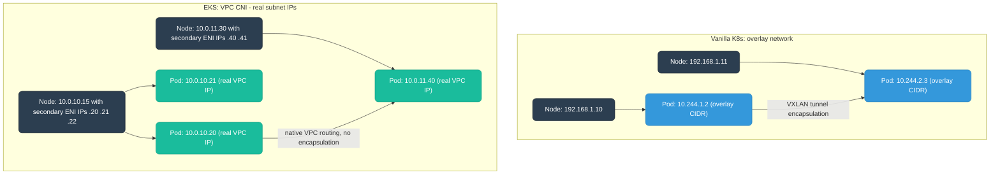
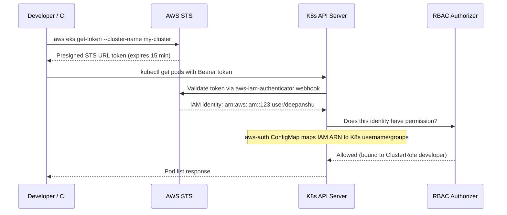
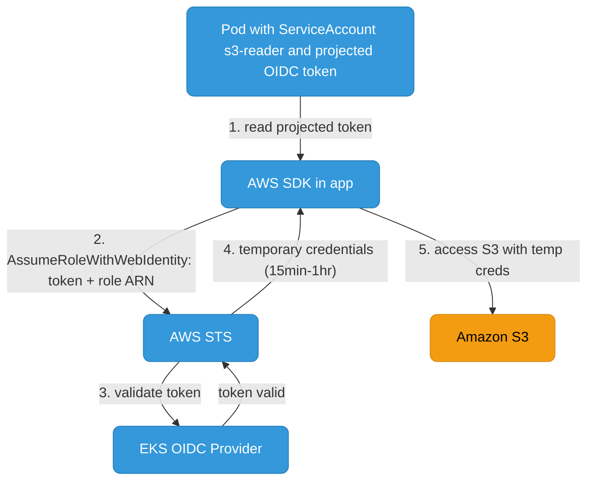

# EKS Architecture

Amazon EKS (Elastic Kubernetes Service) runs Kubernetes with AWS managing the control plane. Understanding where the boundary is between what AWS owns and what you own is critical for networking, security, and debugging.

<div class="quiz-progress" data-quiz-progress>
  <span class="quiz-progress-label">0/0 checks</span>
  <span class="quiz-progress-bar"><span class="quiz-progress-fill"></span></span>
</div>

---

## EKS vs Vanilla Kubernetes

| Aspect | Vanilla K8s | EKS |
|--------|------------|-----|
| Control plane | You run and manage | AWS runs, fully managed, multi-AZ HA |
| etcd | You manage, backup | AWS managed, encrypted at rest |
| API Server endpoint | You expose | `https://<hash>.gr7.<region>.eks.amazonaws.com` |
| Upgrades | Manual | Managed (you trigger, AWS applies) |
| Worker nodes | Any machine | EC2 (managed node groups, self-managed, or Fargate) |
| Node IAM | Manual | Instance profile (managed node group) or IRSA (pod-level) |
| Cluster auth | `kubeconfig` + certs | AWS IAM → `aws eks get-token` → K8s RBAC |
| Networking | CNI of your choice | AWS VPC CNI (pods get real VPC IPs) |
| Load balancers | Cloud controller manager | AWS Load Balancer Controller (ALB/NLB) |

<div class="quiz-card">
  <p class="quiz-q">On EKS, if a control-plane object looks corrupted, can you open a shell on the API Server box and inspect etcd directly the way you might on a self-hosted cluster?</p>
  <button class="quiz-reveal">Reveal answer</button>
  <div class="quiz-a" hidden>No. AWS owns and runs the entire control plane &mdash; API Server, etcd, scheduler, controller-manager &mdash; in its own account, encrypted and backed up, and it's not visible or reachable from yours at all. You debug through the K8s API and CloudWatch control-plane logs, never by touching etcd directly.</div>
</div>

---

## Architecture: AWS-Managed vs Customer-Managed

```mermaid
graph TD
    classDef blue fill:#3498db,stroke:#2980b9,color:#fff,rx:8
    classDef green fill:#2ecc71,stroke:#27ae60,color:#fff,rx:8
    classDef red fill:#e74c3c,stroke:#c0392b,color:#fff,rx:8
    classDef orange fill:#e67e22,stroke:#d35400,color:#fff,rx:8
    classDef purple fill:#9b59b6,stroke:#8e44ad,color:#fff,rx:8
    classDef teal fill:#1abc9c,stroke:#16a085,color:#fff,rx:8
    classDef dark fill:#2c3e50,stroke:#1a252f,color:#fff,rx:8
    classDef yellow fill:#f39c12,stroke:#d68910,color:#000,rx:8
    classDef k8s fill:#326ce5,stroke:#254ea8,color:#fff,rx:8
    classDef aws fill:#ff9900,stroke:#cc7a00,color:#000,rx:8
    subgraph AWSAccount["AWS Managed Account (opaque to you)"]
        subgraph CPVPC["EKS Control Plane VPC (AWS-owned, not visible)"]
            APISERVER["API Server: Multi-AZ HA, auto-scaled by AWS"]:::dark
            ETCD["etcd: AWS managed, KMS encrypted, auto-backed-up"]:::k8s
            SCHEDULER["kube-scheduler: managed by AWS"]:::purple
            CM["kube-controller-manager: managed by AWS"]:::purple
            CCM["AWS Cloud Controller Manager: provisions ELBs and routes"]:::blue
        end
    end

    subgraph YourAccount["Your AWS Account"]
        subgraph YourVPC["Your VPC (10.0.0.0/16)"]
            subgraph ENIBridge["Cross-Account ENI Bridge"]
                ENI_CP["AWS-injected ENI in your subnet (10.0.1.50): how API Server reaches kubelets"]:::teal
            end
            subgraph PubSubnet["Public Subnets (10.0.0.0/24, 10.0.1.0/24)"]
                ALB["AWS Load Balancer (ALB/NLB): terminates external traffic"]:::red
                NAT["NAT Gateway: outbound internet for private nodes"]:::orange
            end
            subgraph PrivSubnet["Private Subnets (10.0.10.0/24, 10.0.11.0/24)"]
                subgraph Node1["EC2 Worker Node 1 (10.0.10.15)"]
                    KUBELET1["kubelet: registers with API Server via cross-account ENI"]:::dark
                    KPROXY1["kube-proxy: iptables/IPVS rules"]:::blue
                    VPCCNI1["aws-node VPC CNI DaemonSet: assigns VPC IPs to pods"]:::teal
                    POD1["Pod: my-app IP 10.0.10.20 (real VPC IP)"]:::teal
                    POD2["Pod: my-app IP 10.0.10.21"]:::blue
                    COREDNS["Pod: coredns IP 10.0.10.22"]:::teal
                end
                subgraph Node2["EC2 Worker Node 2 (10.0.11.30)"]
                    KUBELET2["kubelet"]:::k8s
                    VPCCNI2["aws-node VPC CNI"]:::teal
                    POD3["Pod: my-app IP 10.0.11.40 (real VPC IP)"]:::teal
                    POD4["Pod: aws-load-balancer-controller"]:::purple
                end
            end
        end
        IAM["AWS IAM OIDC Provider: IRSA pod-to-role mapping"]:::blue
        ECR["Amazon ECR: container image registry"]:::yellow
        CW["CloudWatch: Container Insights and control plane logs"]:::yellow
    end

    APISERVER <-->|"HTTPS via cross-account ENI"| ENI_CP
    ENI_CP <-->|"in-VPC traffic"| KUBELET1
    ENI_CP <-->|"in-VPC traffic"| KUBELET2
    ALB -->|"routes to pod IPs"| POD1
    ALB --> POD3
    POD1 -->|"outbound via NAT"| NAT
    VPCCNI1 -->|"assigns secondary ENI IPs"| POD1
    IAM -.->|"OIDC: pod assumes role via projected SA token"| POD4
    ECR -.->|"image pull"| Node1
```



### The Cross-Account ENI — How Control Plane Reaches Nodes

This is the most important networking concept in EKS. The API Server lives in AWS's VPC, but it needs to reach `kubelet` on your nodes (for exec, logs, port-forward). AWS solves this by injecting an **ENI (Elastic Network Interface)** directly into your subnet. This ENI has an IP in your private subnet and is managed entirely by AWS — you can see it in your EC2 console but should not modify it.

When the API Server needs to reach `kubelet` on `10.0.10.15:10250`, it goes through its side of the ENI → your subnet → node's private IP. The traffic never leaves AWS's network, but it crosses account/VPC boundaries via this ENI.

**Cluster endpoint access modes:**

| Mode | API Server reachable from | Use case |
|------|--------------------------|----------|
| Public | Internet (filtered by CIDR allow-list) | Dev, CI from outside VPC |
| Private | Within your VPC only (via ENI) | Production — never expose to internet |
| Public + Private | Both | Transition/hybrid |

<div class="quiz-card">
  <p class="quiz-q">The API Server's traffic to a node's kubelet crosses from AWS's account/VPC into yours via the cross-account ENI. Does that traffic ever touch the public internet?</p>
  <button class="quiz-reveal">Reveal answer</button>
  <div class="quiz-a" hidden>No. The ENI AWS injects into your subnet lets the API Server reach kubelet entirely over AWS's internal network &mdash; it crosses an account/VPC boundary, not a network boundary. That's true even when the cluster endpoint access mode is "Private," since this path never depended on the public endpoint in the first place.</div>
</div>

---

## VPC CNI — Why EKS Pods Get Real VPC IPs

Vanilla Kubernetes uses an overlay network (VXLAN/IPIP) where pod IPs are in a separate CIDR that's NAT'd at the node. EKS uses the **AWS VPC CNI plugin** (`aws-node` DaemonSet) which assigns **real VPC subnet IPs to pods**.



How VPC CNI works:
1. `aws-node` DaemonSet attaches secondary ENIs to each EC2 node (up to `max_ENIs` per instance type)
2. Each secondary ENI gets multiple secondary private IPs
3. When a pod is created, `aws-node` assigns one of these secondary IPs directly to the pod's `eth0`
4. Because these are real VPC IPs, pod-to-pod traffic across nodes uses normal VPC routing — no overlay, no encapsulation

Step through the same sequence one stage at a time:

<div class="stepper">
  <div class="stepper-panels">
    <div class="stepper-panel active">
      <strong>1. Secondary ENIs attached.</strong> The <code>aws-node</code> DaemonSet on each EC2 node attaches secondary ENIs, up to the limit for that instance type (<code>max_ENIs</code>).
    </div>
    <div class="stepper-panel">
      <strong>2. Secondary IPs allocated.</strong> Each secondary ENI is given multiple secondary private IPs, pulled from the node's subnet.
    </div>
    <div class="stepper-panel">
      <strong>3. Pod created, IP assigned.</strong> <code>aws-node</code> hands one of the pre-allocated secondary IPs straight to the new pod's <code>eth0</code> &mdash; no separate overlay address is ever created.
    </div>
    <div class="stepper-panel">
      <strong>4. Native VPC routing.</strong> Because the pod's IP is a real VPC address, cross-node pod-to-pod traffic just follows normal VPC routing tables &mdash; no VXLAN tunnel, no encapsulation, no extra hop.
    </div>
  </div>
  <div class="stepper-controls">
    <button class="stepper-prev">← Prev</button>
    <span class="stepper-dots"></span>
    <span class="stepper-label"></span>
    <button class="stepper-next">Next →</button>
  </div>
</div>

**Implication:** Pod IP exhaustion is a real concern. If your subnet has 256 IPs and nodes pre-allocate secondary IPs, you can run out. Solution: use `/16` or `/18` subnets for worker nodes, enable **custom networking** to use a secondary CIDR (`100.64.0.0/16`), or enable **prefix delegation** (each ENI IP prefix = `/28` = 16 IPs, massively increasing pod density).

<div class="quiz-card">
  <p class="quiz-q">A vanilla Kubernetes cluster with a 100-node overlay network essentially never runs out of pod IPs. An EKS cluster with the same node count can. Why the difference?</p>
  <button class="quiz-reveal">Reveal answer</button>
  <div class="quiz-a" hidden>Overlay pod IPs come from a separate CIDR (e.g. 10.244.0.0/16) sized independently of the physical network. EKS pods get real VPC subnet IPs pre-allocated onto each node's secondary ENIs, so the pod IP pool is bounded by the size of the actual VPC subnet the nodes sit in &mdash; a 256-address subnet really can run out.</div>
</div>

---

## IAM Authentication & IRSA

### Cluster Authentication Flow



The **aws-auth ConfigMap** (legacy) or **EKS Access Entries** (new, recommended) maps IAM principals to Kubernetes RBAC subjects:

```yaml
# aws-auth ConfigMap (legacy approach)
apiVersion: v1
kind: ConfigMap
metadata:
  name: aws-auth
  namespace: kube-system
data:
  mapRoles: |
    - rolearn: arn:aws:iam::123456789:role/eks-node-group-role
      username: system:node:{{EC2PrivateDNSName}}
      groups:
        - system:bootstrappers
        - system:nodes
    - rolearn: arn:aws:iam::123456789:role/ci-deploy-role
      username: ci-deployer
      groups:
        - deployers
```

### IRSA — IAM Roles for Service Accounts

IRSA lets individual pods assume IAM roles without putting AWS credentials in the pod or sharing node IAM permissions across all pods on a node.



Step through the token exchange:

<div class="stepper">
  <div class="stepper-panels">
    <div class="stepper-panel active">
      <strong>1. Read the projected token.</strong> The pod's AWS SDK reads the OIDC token that the kubelet projected into the ServiceAccount volume mount &mdash; no credentials were ever baked into the pod.
    </div>
    <div class="stepper-panel">
      <strong>2. AssumeRoleWithWebIdentity.</strong> The SDK calls AWS STS, presenting that token together with the IAM role ARN from the ServiceAccount's <code>eks.amazonaws.com/role-arn</code> annotation.
    </div>
    <div class="stepper-panel">
      <strong>3. STS validates the token.</strong> STS checks the token against the cluster's EKS OIDC provider &mdash; confirming it's a genuine, unexpired token issued for that exact ServiceAccount.
    </div>
    <div class="stepper-panel">
      <strong>4. Temporary credentials issued.</strong> Once validated, STS hands back short-lived credentials (15 minutes to 1 hour), scoped to whatever the assumed role allows.
    </div>
    <div class="stepper-panel">
      <strong>5. Call the AWS API.</strong> The SDK uses those temporary credentials directly &mdash; e.g. to read from S3 &mdash; with no long-lived secret ever stored in the pod, and no dependency on the node's own IAM role.
    </div>
  </div>
  <div class="stepper-controls">
    <button class="stepper-prev">← Prev</button>
    <span class="stepper-dots"></span>
    <span class="stepper-label"></span>
    <button class="stepper-next">Next →</button>
  </div>
</div>

```yaml
apiVersion: v1
kind: ServiceAccount
metadata:
  name: s3-reader
  namespace: default
  annotations:
    eks.amazonaws.com/role-arn: arn:aws:iam::123456789:role/my-app-s3-read-role
---
spec:
  serviceAccountName: s3-reader
  containers:
    - name: app
      env:
        - name: AWS_REGION
          value: us-east-1
```

The IAM role's trust policy must allow the cluster's OIDC provider to assume it:

```json
{
  "Statement": [{
    "Effect": "Allow",
    "Principal": {
      "Federated": "arn:aws:iam::123456789:oidc-provider/oidc.eks.us-east-1.amazonaws.com/id/XXXX"
    },
    "Action": "sts:AssumeRoleWithWebIdentity",
    "Condition": {
      "StringEquals": {
        "oidc.eks.us-east-1.amazonaws.com/id/XXXX:sub": "system:serviceaccount:default:s3-reader"
      }
    }
  }]
}
```

<div class="quiz-card">
  <p class="quiz-q">A pod uses IRSA to read from S3, but the EC2 node it's scheduled on has an IAM instance profile with no S3 permissions at all. Can the pod still read the S3 bucket?</p>
  <button class="quiz-reveal">Reveal answer</button>
  <div class="quiz-a" hidden>Yes. IRSA credentials come from the pod's own ServiceAccount assuming its own IAM role via STS &mdash; they're completely independent of the node's instance profile. The whole point of IRSA is that a pod's AWS permissions don't have to be, and shouldn't be, inherited from (or shared with) whatever's running on the same node.</div>
</div>

---

## Node Groups: Managed vs Self-Managed vs Fargate

| Feature | Managed Node Group | Self-Managed | Fargate |
|---------|-------------------|--------------|---------|
| AMI updates | AWS handles, you trigger | You manage | AWS handles |
| Node visibility | EC2 instances in your account | EC2 instances | No nodes (serverless) |
| Draining on upgrade | Automatic (respects PDB) | Manual | N/A |
| GPU support | Yes | Yes | No |
| DaemonSets | Yes | Yes | No (sidecar injection only) |
| Spot instances | Yes | Yes | Yes (Fargate Spot) |
| Cost model | EC2 pricing | EC2 pricing | Per-pod vCPU+memory |
| Best for | Most workloads | Custom AMI, kernel config | Batch, small isolated pods |

**Fargate limitation:** No DaemonSets. Since there are no nodes (pods run on AWS micro-VMs), `aws-node` CNI DaemonSet, `kube-proxy` DaemonSet, and monitoring DaemonSets don't run. AWS handles pod networking separately. CloudWatch Container Insights uses sidecar injection via Fluent Bit.

What actually happens when a pod gets scheduled differs a lot more between these three than the table alone shows:

<div class="tab-group">
  <div class="tab-buttons">
    <button data-tab="mng" class="active">Managed Node Group</button>
    <button data-tab="self">Self-Managed</button>
    <button data-tab="fargate">Fargate</button>
  </div>
  <div class="tab-panels">
    <div class="tab-panel active" data-tab-panel="mng">
      <strong>AWS runs the ASG for you.</strong> You pick instance types and scaling config; AWS handles launching EC2 instances, attaching the node IAM role, and bootstrapping <code>kubelet</code> so it joins the cluster. Triggering an AMI upgrade cordons and drains nodes one at a time, respecting PodDisruptionBudgets, instead of you scripting that yourself.
    </div>
    <div class="tab-panel" data-tab-panel="self">
      <strong>You own the launch template.</strong> Full control over the AMI, kernel parameters, and bootstrap user-data &mdash; useful for a hardened or GPU-specific image the EKS-optimized AMIs don't cover. The tradeoff: patching, draining, and replacing nodes safely during an upgrade is entirely on you, with no AWS-managed drain sequencing.
    </div>
    <div class="tab-panel" data-tab-panel="fargate">
      <strong>No EC2 instances at all.</strong> Each pod (or pod group sharing a namespace) runs on its own right-sized AWS micro-VM. Because there's no persistent node, there's nothing for a DaemonSet to schedule onto &mdash; <code>aws-node</code> and <code>kube-proxy</code> simply don't run, and anything that normally relies on a DaemonSet (log/metric shippers) has to switch to sidecar injection instead.
    </div>
  </div>
</div>

<div class="quiz-card">
  <p class="quiz-q">You deploy a monitoring agent as a DaemonSet expecting one copy to run per node, on a set of pods scheduled entirely on Fargate. What happens?</p>
  <button class="quiz-reveal">Reveal answer</button>
  <div class="quiz-a" hidden>It never runs. Fargate pods have no underlying node object for a DaemonSet to attach to &mdash; there are no persistent nodes at all, just per-pod micro-VMs. Fargate-backed workloads need the monitoring agent injected as a sidecar container instead (which is exactly how CloudWatch Container Insights does it there, via Fluent Bit).</div>
</div>

---

## EKS Add-ons

| Add-on | What it does | Why it matters |
|--------|-------------|----------------|
| `vpc-cni` (`aws-node`) | Assigns VPC IPs to pods | Core networking — don't let it get out of date |
| `kube-proxy` | iptables/IPVS service routing | Keeps node service rules in sync |
| `coredns` | In-cluster DNS | `my-svc.my-ns.svc.cluster.local` resolution |
| `aws-ebs-csi-driver` | Provisions EBS volumes for PVCs | Required since K8s 1.23 (in-tree deprecated) |
| `aws-efs-csi-driver` | Shared EFS mounts | Multi-AZ shared storage |
| `adot` | Metrics/traces collection | Feeds X-Ray and CloudWatch |

<div class="quiz-card">
  <p class="quiz-q">On a K8s 1.23+ EKS cluster, a PVC is stuck Pending and you haven't installed anything beyond the default cluster. What's the most likely missing piece?</p>
  <button class="quiz-reveal">Reveal answer</button>
  <div class="quiz-a" hidden>The <code>aws-ebs-csi-driver</code> add-on. The in-tree EBS provisioner was deprecated starting with K8s 1.23, so EBS-backed PVCs need the CSI driver add-on installed explicitly &mdash; it's no longer something the cluster provisions for you out of the box.</div>
</div>

---

## EKS Control Plane Logs

Enable in cluster config. Logged to CloudWatch log group `/aws/eks/<cluster>/cluster`:

| Log type | What it contains | Use for |
|----------|-----------------|---------|
| `api` | All API Server requests | Audit trail, who-did-what |
| `audit` | K8s audit log (create/delete/patch) | Security investigation |
| `authenticator` | IAM auth webhook decisions | Debugging auth failures |
| `controllerManager` | Controller reconciliation events | Debugging object not created |
| `scheduler` | Scheduling decisions and failures | Debugging `Pending` pods |

```bash
aws logs filter-log-events \
  --log-group-name /aws/eks/my-cluster/cluster \
  --log-stream-name-prefix kube-scheduler \
  --filter-pattern "my-pending-pod" \
  --region us-east-1
```
