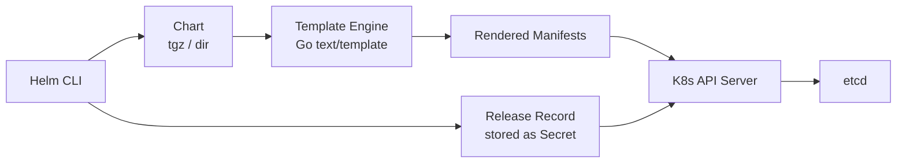
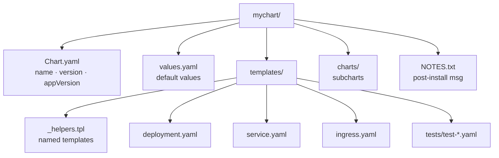
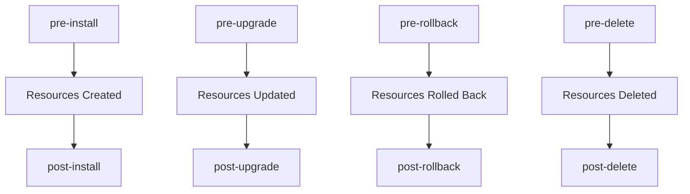
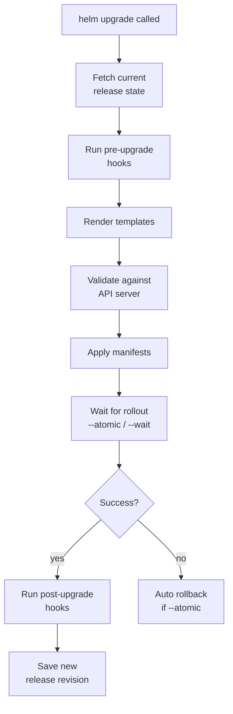

# Helm

## 1. Architecture



---

## 2. Chart Structure



**Chart.yaml essentials:**
```yaml
apiVersion: v2
name: mychart
description: My application chart
type: application      # or library
version: 1.2.3         # chart version (SemVer)
appVersion: "2.0.0"    # app version (informational)
dependencies:
  - name: redis
    version: "18.x.x"
    repository: "https://charts.bitnami.com/bitnami"
    condition: redis.enabled
```

---

## 3. Core Commands

```bash
# Repo management
helm repo add bitnami https://charts.bitnami.com/bitnami
helm repo update
helm search repo nginx
helm search hub nginx                        # Artifact Hub

# Install
helm install <release> <chart> -n <ns>
helm install myapp ./mychart -f prod-values.yaml
helm install myapp oci://registry/chart:1.0.0

# Upgrade
helm upgrade myapp ./mychart --install      # upsert
helm upgrade myapp ./mychart \
  --set image.tag=2.0.0 \
  --atomic \                                # rollback on failure
  --timeout 5m

# Rollback
helm rollback myapp 2                       # to revision 2
helm rollback myapp 0                       # to previous

# Uninstall
helm uninstall myapp -n <ns>
helm uninstall myapp --keep-history         # keep release record

# Inspect
helm list -A
helm status myapp -n <ns>
helm history myapp -n <ns>
helm get values myapp                       # user-supplied values
helm get all myapp                          # everything
```

---

## 4. Templating

```yaml
# values.yaml
replicaCount: 2
image:
  repository: nginx
  tag: "1.25"
service:
  port: 80
```

```yaml
# templates/deployment.yaml

# Values object
replicas: {{ .Values.replicaCount }}

# Release built-ins
name: {{ .Release.Name }}-app
namespace: {{ .Release.Namespace }}
isUpgrade: {{ .Release.IsUpgrade }}

# Chart metadata
chartVersion: {{ .Chart.Version }}

# Embed a file
config: {{ .Files.Get "config/app.conf" | b64enc }}

# Range (loop)
env:
{{- range $k, $v := .Values.envVars }}
  - name: {{ $k }}
    value: {{ $v | quote }}
{{- end }}

# if / else
{{- if .Values.ingress.enabled }}
# ... ingress spec
{{- else }}
# fallback
{{- end }}

# include named template from _helpers.tpl
labels: {{- include "mychart.labels" . | nindent 4 }}

# tpl: render string as template
{{- tpl .Values.configTemplate . }}
```

**_helpers.tpl pattern:**
```yaml
{{- define "mychart.labels" -}}
app.kubernetes.io/name: {{ .Chart.Name }}
app.kubernetes.io/instance: {{ .Release.Name }}
{{- end }}
```

---

## 5. Hooks



```yaml
# Hook job example
metadata:
  annotations:
    "helm.sh/hook": pre-upgrade
    "helm.sh/hook-weight": "-5"          # lower runs first
    "helm.sh/hook-delete-policy": before-hook-creation,hook-succeeded
```

**Hook weights:** lower number = runs first. Multiple hooks at same weight run in name order.

**Delete policies:**
- `before-hook-creation` — delete previous run before this one (default)
- `hook-succeeded` — delete after success
- `hook-failed` — delete after failure

---

## 6. Library Charts and Dependencies

```yaml
# Chart.yaml — declare dependency
dependencies:
  - name: postgresql
    version: "13.x.x"
    repository: "https://charts.bitnami.com/bitnami"
    condition: postgresql.enabled    # toggle via values
    tags:
      - database

# Update dependency lock
helm dependency update ./mychart
# Downloads to charts/ as tarballs
```

**Library chart** (`type: library`): reusable named templates only, never deployed directly.

```yaml
# Chart.yaml of library
apiVersion: v2
name: mylib
type: library
version: 0.1.0
```

```yaml
# Consume it
dependencies:
  - name: mylib
    version: "0.1.x"
    repository: "file://../mylib"
```

---

## 7. Helmfile

```yaml
# helmfile.yaml
repositories:
  - name: bitnami
    url: https://charts.bitnami.com/bitnami

releases:
  - name: redis
    namespace: infra
    chart: bitnami/redis
    version: "18.6.0"
    values:
      - values/redis.yaml

  - name: myapp
    namespace: app
    chart: ./charts/myapp
    values:
      - values/myapp-{{ .Environment.Name }}.yaml
    needs:
      - infra/redis              # deploy after redis

environments:
  staging:
    values:
      - envs/staging.yaml
  production:
    values:
      - envs/production.yaml
```

```bash
helmfile sync                     # apply all releases
helmfile diff                     # show pending changes
helmfile apply                    # diff + sync
helmfile destroy                  # uninstall all
helmfile -e production sync       # target environment
helmfile -l name=myapp sync       # target by label
```

---

## 8. Debugging

```bash
# Render templates locally (no cluster needed)
helm template myapp ./mychart -f values.yaml

# Render single template
helm template myapp ./mychart -s templates/deployment.yaml

# Lint
helm lint ./mychart
helm lint ./mychart -f prod-values.yaml

# Dry-run against cluster (server-side validation)
helm install myapp ./mychart --dry-run --debug

# helm diff plugin (shows what upgrade will change)
helm plugin install https://github.com/databus23/helm-diff
helm diff upgrade myapp ./mychart -f values.yaml

# Inspect rendered values
helm get values myapp -a              # all (including defaults)
helm get manifest myapp               # live rendered manifests

# Upgrade flow
```



---

## 9. OCI Registry — Helm Charts as OCI Artifacts

Helm 3.8+ can push and pull charts from OCI registries (ECR, GCR, Docker Hub) instead of traditional HTTP chart repositories.

```bash
# Login to ECR as OCI registry
aws ecr get-login-password --region us-east-1 | \
  helm registry login \
  --username AWS \
  --password-stdin \
  123456789.dkr.ecr.us-east-1.amazonaws.com

# Push chart to ECR
helm package ./mychart                          # produces mychart-0.1.0.tgz
helm push mychart-0.1.0.tgz \
  oci://123456789.dkr.ecr.us-east-1.amazonaws.com/helm-charts

# Pull and install directly from OCI
helm install myrelease \
  oci://123456789.dkr.ecr.us-east-1.amazonaws.com/helm-charts/mychart \
  --version 0.1.0

# Pull locally to inspect
helm pull \
  oci://123456789.dkr.ecr.us-east-1.amazonaws.com/helm-charts/mychart \
  --version 0.1.0 --untar

# In ArgoCD — reference OCI chart in Application CRD
# source:
#   chart: mychart
#   repoURL: oci://123456789.dkr.ecr.us-east-1.amazonaws.com/helm-charts
#   targetRevision: 0.1.0
```

---

## 10. Chart Testing with helm unittest and ct

**helm unittest** (plugin) — unit test Helm templates without a cluster:

```bash
helm plugin install https://github.com/helm-unittest/helm-unittest

# Test structure:
# mychart/
#   tests/
#     deployment_test.yaml
#     service_test.yaml

# tests/deployment_test.yaml
suite: deployment tests
templates:
  - deployment.yaml
tests:
  - it: should set replica count from values
    set:
      replicaCount: 3
    asserts:
      - equal:
          path: spec.replicas
          value: 3
  - it: should set image tag
    set:
      image.tag: "v2.0.0"
    asserts:
      - equal:
          path: spec.template.spec.containers[0].image
          value: "myapp:v2.0.0"
  - it: should not set resource limits when disabled
    set:
      resources.limits: null
    asserts:
      - notExists:
          path: spec.template.spec.containers[0].resources.limits

# Run tests
helm unittest mychart/
```

**ct (chart-testing)** — lint and integration test in CI:

```bash
# Install ct
brew install chart-testing

# Lint all changed charts
ct lint --config ct.yaml

# ct.yaml
chart-dirs:
  - charts
helm-extra-args: "--timeout 600s"
check-version-increment: true    # fails if chart changed without version bump
validate-maintainers: true

# Integration test (deploys chart to kind cluster)
ct install --config ct.yaml
```

---

## 11. Post-Render — Kustomize Patches on Helm Output

`--post-renderer` lets you pipe Helm's rendered YAML through any program before applying. Most commonly used with Kustomize:

```bash
# Post-renderer script: post-render.sh
#!/bin/bash
cat <&0 > /tmp/helm-output.yaml
kubectl kustomize /path/to/overlay >> /tmp/helm-output.yaml
cat /tmp/helm-output.yaml

chmod +x post-render.sh

# Apply with post-renderer
helm upgrade --install myapp ./mychart \
  --post-renderer ./post-render.sh
```

**Use case — adding annotations Helm chart doesn't expose:**
```yaml
# overlay/kustomization.yaml
resources:
  - /tmp/helm-output.yaml   # dynamically set by the script

patches:
  - target:
      kind: Deployment
      name: myapp
    patch: |-
      - op: add
        path: /metadata/annotations/prometheus.io~1scrape
        value: "true"
      - op: add
        path: /metadata/annotations/prometheus.io~1port
        value: "9090"
```

---

## 12. ArgoCD Integration Patterns

**Helm values from multiple sources (ArgoCD 2.6+):**
```yaml
apiVersion: argoproj.io/v1alpha1
kind: Application
metadata:
  name: payments
  namespace: argocd
spec:
  source:
    repoURL: https://charts.myorg.com
    chart: payments
    targetRevision: 1.4.0
    helm:
      valueFiles:
        - values.yaml
        - values-production.yaml    # overlay for prod
      values: |                     # inline overrides (highest priority)
        image:
          tag: "git-abc1234"
      parameters:
        - name: replicaCount
          value: "5"
```

**Multiple sources (ArgoCD 2.6+) — chart from OCI, values from Git:**
```yaml
spec:
  sources:
    - repoURL: oci://123456789.dkr.ecr.us-east-1.amazonaws.com/helm-charts
      chart: payments
      targetRevision: 1.4.0
      helm:
        valueFiles:
          - $values/environments/production/values.yaml
    - repoURL: https://github.com/myorg/config-repo
      targetRevision: main
      ref: values        # variable name used as "$values" above
```

**Helm release name matching ArgoCD app name:**
```yaml
spec:
  source:
    helm:
      releaseName: payments   # default: ArgoCD app name; override here if needed
```

**ArgoCD + Helmfile (via helmfile ArgoCD plugin):**
```yaml
# Install argocd-helmfile plugin in ArgoCD
# Then reference helmfile.yaml as the source
spec:
  source:
    repoURL: https://github.com/myorg/infra
    path: deployments/payments
    targetRevision: main
    plugin:
      name: helmfile
```

---

## 13. Debugging Template Rendering

```bash
# Render all templates without installing — inspect full YAML output
helm template myrelease ./mychart \
  -f values-production.yaml \
  --set image.tag=v1.2.3 \
  --debug

# Render a single template
helm template myrelease ./mychart \
  --show-only templates/deployment.yaml

# Lint before deploying
helm lint ./mychart -f values-production.yaml
# Checks: syntax, required values, chart metadata

# Diff before upgrade (helm-diff plugin)
helm plugin install https://github.com/databus23/helm-diff
helm diff upgrade myrelease ./mychart -f values-production.yaml
# Shows: exactly what will change (green=add, red=remove), like git diff for K8s

# Get computed values for a deployed release
helm get values myrelease -n payments
helm get values myrelease -n payments --all  # includes default values

# Get the rendered manifests of a deployed release
helm get manifest myrelease -n payments

# Rollback (also useful for debugging what changed)
helm history myrelease -n payments     # list all revisions
helm rollback myrelease 3 -n payments  # roll back to revision 3
```
