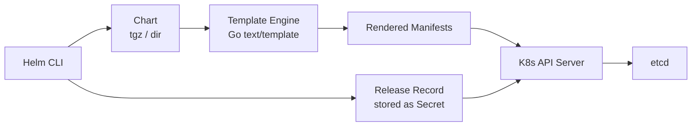
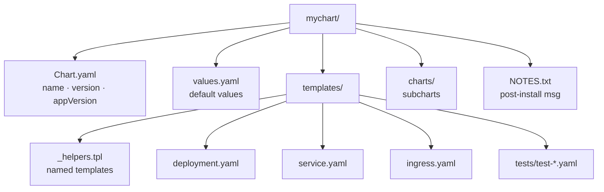
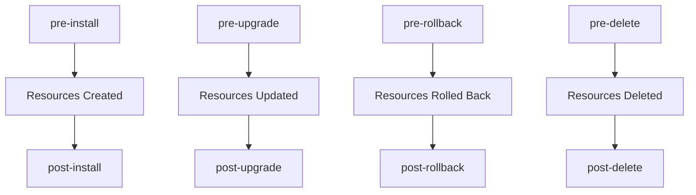
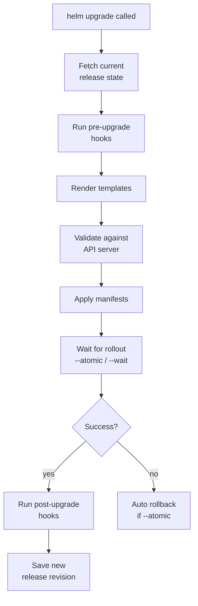

# Helm

A field guide to Helm's chart model, templating engine, release lifecycle, and packaging conventions — from a single `helm install` down through hooks, OCI registries, and CI-friendly chart testing.

Track how many knowledge checks you've cleared as you go:

<div class="quiz-progress" data-quiz-progress>
  <span class="quiz-progress-label">0/0 checks</span>
  <span class="quiz-progress-bar"><span class="quiz-progress-fill"></span></span>
</div>

---

## 1. Architecture



<div class="quiz-card">
  <p class="quiz-q">Where does Helm keep the record of what's currently installed for a release — inside the chart, on disk locally, or somewhere else?</p>
  <button class="quiz-reveal">Reveal answer</button>
  <div class="quiz-a" hidden>Somewhere else: as a Secret stored in the cluster itself, alongside the actual resources it manages. The chart archive/directory is just the template source — it has no idea what's currently deployed. That's why <code>helm list</code> and <code>helm history</code> work against any cluster you point at, not against local files.</div>
</div>

---

## 2. Chart Structure



**Chart.yaml essentials:**
```yaml
apiVersion: v2
name: mychart
description: My application chart
type: application      # or library
version: 1.2.3         # chart version (SemVer)
appVersion: "2.0.0"    # app version (informational)
dependencies:
  - name: redis
    version: "18.x.x"
    repository: "https://charts.bitnami.com/bitnami"
    condition: redis.enabled
```

<div class="quiz-card">
  <p class="quiz-q">You ship a bugfix inside a template — no change to <code>values.yaml</code>'s shape, but the rendered Deployment now behaves differently. Which field in Chart.yaml must you bump: <code>version</code> or <code>appVersion</code>?</p>
  <button class="quiz-reveal">Reveal answer</button>
  <div class="quiz-a" hidden><code>version</code> — it's the chart's own SemVer, and it has to change any time the chart's templates or defaults change, since that's what <code>helm repo</code> tooling and dependency version ranges key off of. <code>appVersion</code> is purely informational — the version string of the application the chart happens to deploy — and only needs bumping when <em>that</em> changes, e.g. a new container image tag.</div>
</div>

---

## 3. Core Commands

```bash
# Repo management
helm repo add bitnami https://charts.bitnami.com/bitnami
helm repo update
helm search repo nginx
helm search hub nginx                        # Artifact Hub

# Install
helm install <release> <chart> -n <ns>
helm install myapp ./mychart -f prod-values.yaml
helm install myapp oci://registry/chart:1.0.0

# Upgrade
helm upgrade myapp ./mychart --install      # upsert
helm upgrade myapp ./mychart \
  --set image.tag=2.0.0 \
  --atomic \                                # rollback on failure
  --timeout 5m

# Rollback
helm rollback myapp 2                       # to revision 2
helm rollback myapp 0                       # to previous

# Uninstall
helm uninstall myapp -n <ns>
helm uninstall myapp --keep-history         # keep release record

# Inspect
helm list -A
helm status myapp -n <ns>
helm history myapp -n <ns>
helm get values myapp                       # user-supplied values
helm get all myapp                          # everything
```

---

## 4. Templating

```yaml
# values.yaml
replicaCount: 2
image:
  repository: nginx
  tag: "1.25"
service:
  port: 80
```

```yaml
# templates/deployment.yaml

# Values object
replicas: {{ .Values.replicaCount }}

# Release built-ins
name: {{ .Release.Name }}-app
namespace: {{ .Release.Namespace }}
isUpgrade: {{ .Release.IsUpgrade }}

# Chart metadata
chartVersion: {{ .Chart.Version }}

# Embed a file
config: {{ .Files.Get "config/app.conf" | b64enc }}

# Range (loop)
env:
{{- range $k, $v := .Values.envVars }}
  - name: {{ $k }}
    value: {{ $v | quote }}
{{- end }}

# if / else
{{- if .Values.ingress.enabled }}
# ... ingress spec
{{- else }}
# fallback
{{- end }}

# include named template from _helpers.tpl
labels: {{- include "mychart.labels" . | nindent 4 }}

# tpl: render string as template
{{- tpl .Values.configTemplate . }}
```

**_helpers.tpl pattern:**
```yaml
{{- define "mychart.labels" -}}
app.kubernetes.io/name: {{ .Chart.Name }}
app.kubernetes.io/instance: {{ .Release.Name }}
{{- end }}
```

<div class="quiz-card">
  <p class="quiz-q">What's the actual difference between <code>include "mychart.labels" .</code> and <code>tpl .Values.configTemplate .</code> — don't they both just "run a template"?</p>
  <button class="quiz-reveal">Reveal answer</button>
  <div class="quiz-a" hidden><code>include</code> invokes a named template that's already defined in the chart itself (typically in <code>_helpers.tpl</code>) — the template text is known at chart-authoring time. <code>tpl</code> takes an arbitrary <em>string</em> — often one that came from <code>values.yaml</code>, so it isn't known until install/upgrade time — and renders it as if it were template source. Use <code>include</code> for reusable snippets you wrote; use <code>tpl</code> when the template text itself is user-supplied data.</div>
</div>

---

## 5. Hooks



That diagram is four independent flows side by side. Zoomed into just one of them — an install — here's the order of operations:

<div class="stepper">
  <div class="stepper-panels">
    <div class="stepper-panel active">
      <strong>1. Hooks sorted by weight.</strong> Every hook object annotated for this event (<code>helm.sh/hook: pre-install</code>) is ordered by its <code>helm.sh/hook-weight</code>, lowest number first. Hooks tied on weight are ordered by name.
    </div>
    <div class="stepper-panel">
      <strong>2. Hooks run one at a time.</strong> Helm waits for each hook resource — almost always a <code>Job</code> — to finish successfully before starting the next. They're sequential, never parallel.
    </div>
    <div class="stepper-panel">
      <strong>3. Chart resources created.</strong> Only once every pre-install hook has succeeded does Helm create the chart's normal templated manifests — Deployments, Services, and the rest.
    </div>
    <div class="stepper-panel">
      <strong>4. Post-install hooks run.</strong> Same weight/name ordering, same one-at-a-time execution — now against a cluster that already has the chart's resources live.
    </div>
    <div class="stepper-panel">
      <strong>5. Delete policy cleans up.</strong> Once a hook resource has run, its <code>helm.sh/hook-delete-policy</code> decides whether it's removed before the next run, after success, after failure, or left in place.
    </div>
  </div>
  <div class="stepper-controls">
    <button class="stepper-prev">← Prev</button>
    <span class="stepper-dots"></span>
    <span class="stepper-label"></span>
    <button class="stepper-next">Next →</button>
  </div>
</div>

```yaml
# Hook job example
metadata:
  annotations:
    "helm.sh/hook": pre-upgrade
    "helm.sh/hook-weight": "-5"          # lower runs first
    "helm.sh/hook-delete-policy": before-hook-creation,hook-succeeded
```

**Hook weights:** lower number = runs first. Multiple hooks at same weight run in name order.

**Delete policies** — the `helm.sh/hook-delete-policy` annotation accepts a comma-separated list, so these combine (the example above uses `before-hook-creation,hook-succeeded` together):

<div class="toggle-switch">
  <div class="toggle-buttons">
    <button data-toggle-opt="before" class="active">before-hook-creation</button>
    <button data-toggle-opt="succeeded">hook-succeeded</button>
    <button data-toggle-opt="failed">hook-failed</button>
  </div>
  <div class="toggle-panel active" data-toggle-panel="before">
    <strong>Default.</strong> Deletes the <em>previous</em> run's leftover hook resource right before creating this run's new one — so a stale Job with the same name from last time doesn't block re-creation.
  </div>
  <div class="toggle-panel" data-toggle-panel="succeeded">
    Deletes the hook resource immediately once it completes successfully. Keeps the cluster tidy for hooks whose logs you don't need afterward.
  </div>
  <div class="toggle-panel" data-toggle-panel="failed">
    Deletes the hook resource only if it fails. Combine with <code>hook-succeeded</code> to always clean up regardless of outcome, or leave it off alone to keep a failed hook's Job around for <code>kubectl logs</code>.
  </div>
</div>

<div class="quiz-card">
  <p class="quiz-q">Two <code>pre-install</code> hooks are defined with the same <code>helm.sh/hook-weight</code>. What decides which one runs first?</p>
  <button class="quiz-reveal">Reveal answer</button>
  <div class="quiz-a" hidden>Name order. Weight only breaks ties down to "same number" — once two hooks share a weight, Helm falls back to sorting them alphabetically by resource name, not by their order in the chart's templates or anything about definition order.</div>
</div>

---

## 6. Library Charts and Dependencies

```yaml
# Chart.yaml — declare dependency
dependencies:
  - name: postgresql
    version: "13.x.x"
    repository: "https://charts.bitnami.com/bitnami"
    condition: postgresql.enabled    # toggle via values
    tags:
      - database

# Update dependency lock
helm dependency update ./mychart
# Downloads to charts/ as tarballs
```

**Library chart** (`type: library`): reusable named templates only, never deployed directly.

<div class="toggle-switch">
  <div class="toggle-buttons">
    <button data-toggle-opt="app" class="active">Application chart</button>
    <button data-toggle-opt="lib">Library chart</button>
  </div>
  <div class="toggle-panel active" data-toggle-panel="app">
    <code>type: application</code> — the default when <code>type</code> is omitted. Renders real Kubernetes manifests and can be installed on its own with <code>helm install</code>. What every chart is unless explicitly marked otherwise.
  </div>
  <div class="toggle-panel" data-toggle-panel="lib">
    <code>type: library</code>. Provides only reusable named templates for other charts to pull in with <code>include</code> — it renders no manifests of its own, so <code>helm install</code> against it directly fails. Declared as an ordinary <code>dependencies</code> entry by the application chart that wants its helpers.
  </div>
</div>

```yaml
# Chart.yaml of library
apiVersion: v2
name: mylib
type: library
version: 0.1.0
```

```yaml
# Consume it
dependencies:
  - name: mylib
    version: "0.1.x"
    repository: "file://../mylib"
```

<div class="quiz-card">
  <p class="quiz-q">You run <code>helm install myrelease ./mylib</code> directly against a chart whose Chart.yaml has <code>type: library</code>. What happens?</p>
  <button class="quiz-reveal">Reveal answer</button>
  <div class="quiz-a" hidden>It fails. A library chart contains only reusable named templates — it has no manifests of its own to install. It only ever does anything useful as a <code>dependencies</code> entry inside an application chart that calls its templates via <code>include</code>.</div>
</div>

---

## 7. Helmfile

```yaml
# helmfile.yaml
repositories:
  - name: bitnami
    url: https://charts.bitnami.com/bitnami

releases:
  - name: redis
    namespace: infra
    chart: bitnami/redis
    version: "18.6.0"
    values:
      - values/redis.yaml

  - name: myapp
    namespace: app
    chart: ./charts/myapp
    values:
      - values/myapp-{{ .Environment.Name }}.yaml
    needs:
      - infra/redis              # deploy after redis

environments:
  staging:
    values:
      - envs/staging.yaml
  production:
    values:
      - envs/production.yaml
```

```bash
helmfile sync                     # apply all releases
helmfile diff                     # show pending changes
helmfile apply                    # diff + sync
helmfile destroy                  # uninstall all
helmfile -e production sync       # target environment
helmfile -l name=myapp sync       # target by label
```

<div class="quiz-card">
  <p class="quiz-q">In the helmfile.yaml above, the <code>myapp</code> release lists <code>needs: [infra/redis]</code>. What does that guarantee?</p>
  <button class="quiz-reveal">Reveal answer</button>
  <div class="quiz-a" hidden>Deploy ordering: <code>myapp</code> is only synced after the <code>redis</code> release (in the <code>infra</code> namespace) has been applied. It says nothing about values or config — it's purely "deploy after," so redis is up before whatever in myapp depends on it starts.</div>
</div>

---

## 8. Debugging

```bash
# Render templates locally (no cluster needed)
helm template myapp ./mychart -f values.yaml

# Render single template
helm template myapp ./mychart -s templates/deployment.yaml

# Lint
helm lint ./mychart
helm lint ./mychart -f prod-values.yaml

# Dry-run against cluster (server-side validation)
helm install myapp ./mychart --dry-run --debug

# helm diff plugin (shows what upgrade will change)
helm plugin install https://github.com/databus23/helm-diff
helm diff upgrade myapp ./mychart -f values.yaml

# Inspect rendered values
helm get values myapp -a              # all (including defaults)
helm get manifest myapp               # live rendered manifests

# Upgrade flow
```



Walked through one step at a time:

<div class="stepper">
  <div class="stepper-panels">
    <div class="stepper-panel active">
      <strong>1. Fetch current state.</strong> Helm reads the last release record (the Secret) plus the live state of the resources it manages on the API server.
    </div>
    <div class="stepper-panel">
      <strong>2. Run pre-upgrade hooks.</strong> Same weight/name ordering as install hooks, executed sequentially, before anything about the release itself changes.
    </div>
    <div class="stepper-panel">
      <strong>3. Render templates.</strong> The chart, combined with the new values, renders into a fresh set of manifests — the same output <code>helm template</code> would produce for this input.
    </div>
    <div class="stepper-panel">
      <strong>4. Validate against the API server.</strong> A server-side check that the new manifests are structurally valid before anything is actually applied.
    </div>
    <div class="stepper-panel">
      <strong>5. Apply, then wait.</strong> Helm applies the diff between old and new manifests. With <code>--wait</code> or <code>--atomic</code>, it blocks here until the new resources report healthy, or until <code>--timeout</code> expires.
    </div>
    <div class="stepper-panel">
      <strong>6. Success or rollback.</strong> Healthy rollout → post-upgrade hooks run and a new release revision is saved. Failed rollout with <code>--atomic</code> set → Helm automatically rolls back to the previous revision instead of leaving the release half-upgraded.
    </div>
  </div>
  <div class="stepper-controls">
    <button class="stepper-prev">← Prev</button>
    <span class="stepper-dots"></span>
    <span class="stepper-label"></span>
    <button class="stepper-next">Next →</button>
  </div>
</div>

<div class="quiz-card">
  <p class="quiz-q">You run <code>helm upgrade</code> <em>without</em> <code>--atomic</code>, and the rollout fails partway through. What state is the release left in?</p>
  <button class="quiz-reveal">Reveal answer</button>
  <div class="quiz-a" hidden>Whatever got applied stays applied — marked as a failed release. The auto-rollback branch in the diagram only fires "if --atomic"; without that flag, Helm doesn't undo anything on failure. You're left to run <code>helm rollback</code> yourself if you want back to the last good revision.</div>
</div>

---

## 9. OCI Registry — Helm Charts as OCI Artifacts

Helm 3.8+ can push and pull charts from OCI registries (ECR, GCR, Docker Hub) instead of traditional HTTP chart repositories.

```bash
# Login to ECR as OCI registry
aws ecr get-login-password --region us-east-1 | \
  helm registry login \
  --username AWS \
  --password-stdin \
  123456789.dkr.ecr.us-east-1.amazonaws.com

# Push chart to ECR
helm package ./mychart                          # produces mychart-0.1.0.tgz
helm push mychart-0.1.0.tgz \
  oci://123456789.dkr.ecr.us-east-1.amazonaws.com/helm-charts

# Pull and install directly from OCI
helm install myrelease \
  oci://123456789.dkr.ecr.us-east-1.amazonaws.com/helm-charts/mychart \
  --version 0.1.0

# Pull locally to inspect
helm pull \
  oci://123456789.dkr.ecr.us-east-1.amazonaws.com/helm-charts/mychart \
  --version 0.1.0 --untar

# In ArgoCD — reference OCI chart in Application CRD
# source:
#   chart: mychart
#   repoURL: oci://123456789.dkr.ecr.us-east-1.amazonaws.com/helm-charts
#   targetRevision: 0.1.0
```

---

## 10. Chart Testing with helm unittest and ct

**helm unittest** (plugin) — unit test Helm templates without a cluster:

```bash
helm plugin install https://github.com/helm-unittest/helm-unittest

# Test structure:
# mychart/
#   tests/
#     deployment_test.yaml
#     service_test.yaml

# tests/deployment_test.yaml
suite: deployment tests
templates:
  - deployment.yaml
tests:
  - it: should set replica count from values
    set:
      replicaCount: 3
    asserts:
      - equal:
          path: spec.replicas
          value: 3
  - it: should set image tag
    set:
      image.tag: "v2.0.0"
    asserts:
      - equal:
          path: spec.template.spec.containers[0].image
          value: "myapp:v2.0.0"
  - it: should not set resource limits when disabled
    set:
      resources.limits: null
    asserts:
      - notExists:
          path: spec.template.spec.containers[0].resources.limits

# Run tests
helm unittest mychart/
```

**ct (chart-testing)** — lint and integration test in CI:

```bash
# Install ct
brew install chart-testing

# Lint all changed charts
ct lint --config ct.yaml

# ct.yaml
chart-dirs:
  - charts
helm-extra-args: "--timeout 600s"
check-version-increment: true    # fails if chart changed without version bump
validate-maintainers: true

# Integration test (deploys chart to kind cluster)
ct install --config ct.yaml
```

<div class="quiz-card">
  <p class="quiz-q">Both <code>helm unittest</code> and <code>ct install</code> are described as chart testing tools here. What's the key difference in what each one needs to run?</p>
  <button class="quiz-reveal">Reveal answer</button>
  <div class="quiz-a" hidden><code>helm unittest</code> tests rendered templates entirely locally — no cluster needed, it's asserting against YAML output. <code>ct install</code> actually deploys the chart to a real (kind) cluster as an integration test — it's checking that the chart installs successfully against a live API server, not just that it renders correctly.</div>
</div>

---

## 11. Post-Render — Kustomize Patches on Helm Output

`--post-renderer` lets you pipe Helm's rendered YAML through any program before applying. Most commonly used with Kustomize:

```bash
# Post-renderer script: post-render.sh
#!/bin/bash
cat <&0 > /tmp/helm-output.yaml
kubectl kustomize /path/to/overlay >> /tmp/helm-output.yaml
cat /tmp/helm-output.yaml

chmod +x post-render.sh

# Apply with post-renderer
helm upgrade --install myapp ./mychart \
  --post-renderer ./post-render.sh
```

**Use case — adding annotations Helm chart doesn't expose:**
```yaml
# overlay/kustomization.yaml
resources:
  - /tmp/helm-output.yaml   # dynamically set by the script

patches:
  - target:
      kind: Deployment
      name: myapp
    patch: |-
      - op: add
        path: /metadata/annotations/prometheus.io~1scrape
        value: "true"
      - op: add
        path: /metadata/annotations/prometheus.io~1port
        value: "9090"
```

<div class="quiz-card">
  <p class="quiz-q">True or false: a <code>--post-renderer</code> script receives the chart's raw templates, before <code>.Values</code> substitution, so it can patch the Go template source directly.</p>
  <button class="quiz-reveal">Reveal answer</button>
  <div class="quiz-a" hidden>False. The post-renderer receives Helm's already-rendered manifests — piped in on stdin, which is why the example script starts with <code>cat &lt;&amp;0 &gt; /tmp/helm-output.yaml</code>. Values have already been substituted and the templates fully resolved by that point; the post-renderer only ever sees final YAML, never template syntax.</div>
</div>

---

## 12. ArgoCD Integration Patterns

**Helm values from multiple sources (ArgoCD 2.6+):**
```yaml
apiVersion: argoproj.io/v1alpha1
kind: Application
metadata:
  name: payments
  namespace: argocd
spec:
  source:
    repoURL: https://charts.myorg.com
    chart: payments
    targetRevision: 1.4.0
    helm:
      valueFiles:
        - values.yaml
        - values-production.yaml    # overlay for prod
      values: |                     # inline overrides (highest priority)
        image:
          tag: "git-abc1234"
      parameters:
        - name: replicaCount
          value: "5"
```

**Multiple sources (ArgoCD 2.6+) — chart from OCI, values from Git:**
```yaml
spec:
  sources:
    - repoURL: oci://123456789.dkr.ecr.us-east-1.amazonaws.com/helm-charts
      chart: payments
      targetRevision: 1.4.0
      helm:
        valueFiles:
          - $values/environments/production/values.yaml
    - repoURL: https://github.com/myorg/config-repo
      targetRevision: main
      ref: values        # variable name used as "$values" above
```

**Helm release name matching ArgoCD app name:**
```yaml
spec:
  source:
    helm:
      releaseName: payments   # default: ArgoCD app name; override here if needed
```

**ArgoCD + Helmfile (via helmfile ArgoCD plugin):**
```yaml
# Install argocd-helmfile plugin in ArgoCD
# Then reference helmfile.yaml as the source
spec:
  source:
    repoURL: https://github.com/myorg/infra
    path: deployments/payments
    targetRevision: main
    plugin:
      name: helmfile
```

<div class="quiz-card">
  <p class="quiz-q">In the multiple-sources example, what does <code>ref: values</code> on the Git source actually do?</p>
  <button class="quiz-reveal">Reveal answer</button>
  <div class="quiz-a" hidden>It names that source so other sources in the same <code>sources:</code> list can reference paths inside it via <code>$values/...</code> — that's how the Helm chart source (pulled from an OCI registry) points at <code>$values/environments/production/values.yaml</code>, a file that actually lives in the separate Git repo. Without the <code>ref</code>, there'd be no way to cross-reference a path from one source into another.</div>
</div>

---

## 13. Debugging Template Rendering

```bash
# Render all templates without installing — inspect full YAML output
helm template myrelease ./mychart \
  -f values-production.yaml \
  --set image.tag=v1.2.3 \
  --debug

# Render a single template
helm template myrelease ./mychart \
  --show-only templates/deployment.yaml

# Lint before deploying
helm lint ./mychart -f values-production.yaml
# Checks: syntax, required values, chart metadata

# Diff before upgrade (helm-diff plugin)
helm plugin install https://github.com/databus23/helm-diff
helm diff upgrade myrelease ./mychart -f values-production.yaml
# Shows: exactly what will change (green=add, red=remove), like git diff for K8s

# Get computed values for a deployed release
helm get values myrelease -n payments
helm get values myrelease -n payments --all  # includes default values

# Get the rendered manifests of a deployed release
helm get manifest myrelease -n payments

# Rollback (also useful for debugging what changed)
helm history myrelease -n payments     # list all revisions
helm rollback myrelease 3 -n payments  # roll back to revision 3
```
