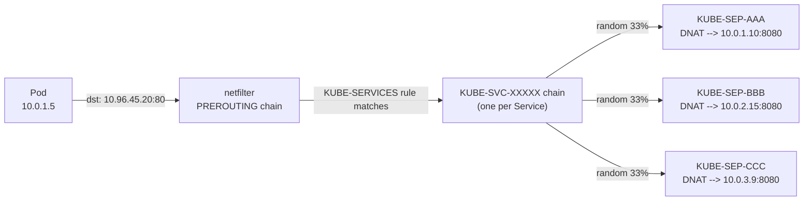
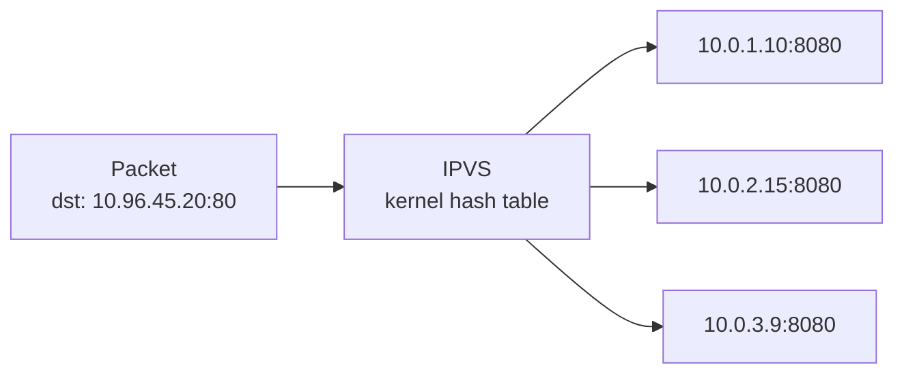
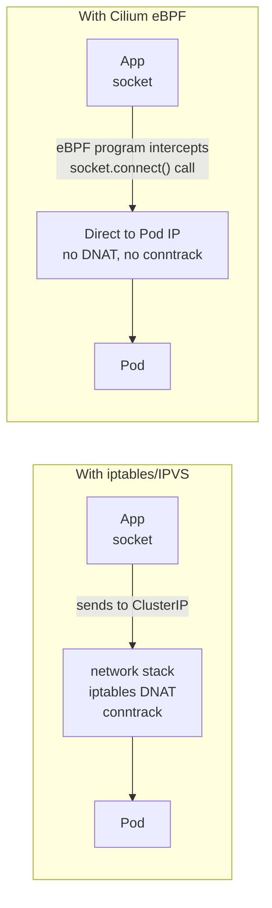

# kube-proxy Modes

kube-proxy runs as a DaemonSet on every node. Its job: watch Services and EndpointSlices from the API server and program the local kernel to implement the ClusterIP virtual IP abstraction.

<div class="quiz-progress" data-quiz-progress>
  <span class="quiz-progress-label">0/0 checks</span>
  <span class="quiz-progress-bar"><span class="quiz-progress-fill"></span></span>
</div>

Three completely different mechanisms end up implementing the same ClusterIP abstraction. Quick orientation before the deep dive on each:

<div class="tab-group">
  <div class="tab-buttons">
    <button data-tab="quick-iptables" class="active">iptables</button>
    <button data-tab="quick-ipvs">IPVS</button>
    <button data-tab="quick-ebpf">Cilium/eBPF</button>
  </div>
  <div class="tab-panels">
    <div class="tab-panel active" data-tab-panel="quick-iptables">
      <strong>Default mode.</strong> Programs netfilter NAT rules in the <code>KUBE-SERVICES</code> chain. Every packet walks the chain linearly &mdash; O(n) per packet &mdash; and gets randomly DNAT'd to a pod. Simple, universally supported, falls over as service count grows.
    </div>
    <div class="tab-panel" data-tab-panel="quick-ipvs">
      <strong>Kernel load balancer.</strong> Uses hash tables instead of rule chains &mdash; O(1) lookup no matter how many Services exist. Adds real load-balancing algorithms (least-connection, hashing) instead of just random.
    </div>
    <div class="tab-panel" data-tab-panel="quick-ebpf">
      <strong>No kube-proxy at all.</strong> Cilium rewrites the destination at the socket layer, before a packet is even constructed &mdash; no DNAT, no conntrack entry, plus L7-aware NetworkPolicy as a bonus.
    </div>
  </div>
</div>

---

## 1. iptables Mode (default)

kube-proxy writes iptables NAT rules in the `KUBE-SERVICES` chain. When a packet is sent to a ClusterIP, netfilter intercepts it in `PREROUTING` and randomly rewrites the destination to one of the pod IPs.



Step through what actually happens to a single packet:

<div class="stepper">
  <div class="stepper-panels">
    <div class="stepper-panel active">
      <strong>1. Pod sends the packet.</strong> The app on Pod 10.0.1.5 sends traffic to the Service's ClusterIP, 10.96.45.20:80. As far as the app knows, that's just a normal destination IP.
    </div>
    <div class="stepper-panel">
      <strong>2. netfilter intercepts it.</strong> The packet hits the <code>PREROUTING</code> chain before any routing decision is made. kube-proxy's <code>KUBE-SERVICES</code> rule matches on destination IP:port.
    </div>
    <div class="stepper-panel">
      <strong>3. Jump to the per-Service chain.</strong> The match sends the packet into <code>KUBE-SVC-XXXXX</code> &mdash; the chain kube-proxy generated for this one Service.
    </div>
    <div class="stepper-panel">
      <strong>4. Random endpoint pick.</strong> The chain is a cascade of probabilistic rules &mdash; with 3 endpoints, roughly 33% of packets match <code>KUBE-SEP-AAA</code>, else 50% of what's left matches <code>KUBE-SEP-BBB</code>, else it falls through to <code>KUBE-SEP-CCC</code>. No memory of previous picks &mdash; this is randomness, not round-robin rotation.
    </div>
    <div class="stepper-panel">
      <strong>5. DNAT + conntrack.</strong> The matched <code>KUBE-SEP</code> rule rewrites the destination to the real pod IP:port, and a conntrack entry is created so the reply packet gets un-NAT'd automatically on the way back.
    </div>
  </div>
  <div class="stepper-controls">
    <button class="stepper-prev">← Prev</button>
    <span class="stepper-dots"></span>
    <span class="stepper-label"></span>
    <button class="stepper-next">Next →</button>
  </div>
</div>

**The O(n) problem:**

Every packet traverses the chain linearly until a matching rule is found. With 10,000 services and ~3 endpoints each → **30,000 iptables rules** evaluated per packet. kube-proxy CPU spikes every time rules are rewritten (any endpoint change = full rewrite of affected chains).

```bash
# Count iptables rules
iptables-save | grep -c KUBE

# Inspect a service's rules
iptables-save | grep KUBE-SVC-$(kubectl get svc my-svc -o jsonpath='{..uid}' | head -c8 | tr '[:lower:]' '[:upper:]')

# Watch conntrack table size (iptables mode creates a conntrack entry per connection)
sysctl net.netfilter.nf_conntrack_count
sysctl net.netfilter.nf_conntrack_max
# If count ≈ max → new connections dropped silently
```

**conntrack issue:** Every new connection through a ClusterIP creates a conntrack entry to remember the DNAT mapping for the return path. At high connection rates, the conntrack table fills → `nf_conntrack: table full, dropping packet`.

<div class="quiz-card">
  <p class="quiz-q">Does iptables mode load-balance across pod endpoints using round-robin?</p>
  <button class="quiz-reveal">Reveal answer</button>
  <div class="quiz-a" hidden>No &mdash; random. Each <code>KUBE-SVC</code> chain is a cascade of probabilistic rules (e.g. 33% / 50% / 100%) that pick an endpoint with no memory of previous picks, not a rotating index. Round-robin and the other real scheduling algorithms only show up once you switch to IPVS mode.</div>
</div>

---

## 2. IPVS Mode

IPVS (IP Virtual Server) is a Linux kernel module originally built for load balancers. It uses **hash tables** instead of linear rule chains → O(1) lookup regardless of service count.



Step through the same journey in IPVS mode:

<div class="stepper">
  <div class="stepper-panels">
    <div class="stepper-panel active">
      <strong>1. Packet arrives.</strong> Same destination as before &mdash; 10.96.45.20:80. Nothing on the wire looks different from iptables mode.
    </div>
    <div class="stepper-panel">
      <strong>2. Hash table lookup.</strong> IPVS looks the virtual service up directly in a kernel hash table &mdash; O(1) regardless of whether the cluster has 10 Services or 10,000.
    </div>
    <div class="stepper-panel">
      <strong>3. Scheduler picks a real server.</strong> Whatever algorithm the Service was configured with &mdash; <code>rr</code>, <code>lc</code>, <code>dh</code>, <code>sh</code>, <code>sed</code>, or <code>nq</code> &mdash; runs to choose one of the registered backends.
    </div>
    <div class="stepper-panel">
      <strong>4. DNAT + conntrack.</strong> Exactly like iptables, the packet gets DNAT'd (Masq mode) and a conntrack entry is created for the return path &mdash; IPVS is faster at the lookup, not exempt from conntrack.
    </div>
  </div>
  <div class="stepper-controls">
    <button class="stepper-prev">← Prev</button>
    <span class="stepper-dots"></span>
    <span class="stepper-label"></span>
    <button class="stepper-next">Next →</button>
  </div>
</div>

**Load balancing algorithms (vs iptables which is only random):**

| Algorithm | Flag | When to use |
|-----------|------|------------|
| Round Robin | `rr` | Default, equal weight |
| Least Connection | `lc` | Route to pod with fewest active connections |
| Destination Hash | `dh` | Sticky by destination IP |
| Source Hash | `sh` | Sticky by source IP (session persistence) |
| Shortest Expected Delay | `sed` | Fewest connections + lowest weight |
| Never Queue | `nq` | Send to idle server, else SED |

```bash
# Enable IPVS mode (edit kube-proxy ConfigMap)
kubectl edit configmap kube-proxy -n kube-system
# Set: mode: "ipvs"
# Set: ipvs.scheduler: "lc"

# Required kernel modules (load before switching)
modprobe ip_vs ip_vs_rr ip_vs_wrr ip_vs_sh nf_conntrack

# Inspect IPVS rules after enabling
ipvsadm -Ln
# TCP  10.96.45.20:80 rr
#   -> 10.0.1.10:8080        Masq    1      0          0
#   -> 10.0.2.15:8080        Masq    1      0          0

# Stats per service
ipvsadm -Ln --stats

# Connection count per backend
ipvsadm -Lnc
```

**When to switch to IPVS:**
- > 1000 Services in the cluster
- kube-proxy CPU usage is high (> 20% sustained)
- Need connection-aware load balancing (least-connection)
- Seeing iptables rule rewrite latency during deployments

<div class="quiz-card">
  <p class="quiz-q">IPVS does O(1) hash table lookups instead of walking a rule chain. Does that mean IPVS mode also eliminates the conntrack bottleneck that hurts iptables mode?</p>
  <button class="quiz-reveal">Reveal answer</button>
  <div class="quiz-a" hidden>No. IPVS still does DNAT (Masq mode) and still creates a conntrack entry per connection for the return path &mdash; it's only faster at the <em>lookup</em> step, not exempt from conntrack. If conntrack table exhaustion is your actual problem, switching to IPVS won't fix it; you need Cilium/eBPF's socket-level rewrite, which skips conntrack entirely.</div>
</div>

---

## 3. Cilium / eBPF — No kube-proxy

Cilium replaces kube-proxy entirely. Instead of iptables or IPVS, it uses **eBPF programs loaded at socket level** — load balancing happens before packets even enter the network stack.



Step through the same packet's journey a third time, now with no kube-proxy in the picture at all:

<div class="stepper">
  <div class="stepper-panels">
    <div class="stepper-panel active">
      <strong>1. App calls connect().</strong> The app on a pod calls <code>connect()</code> targeting the Service's ClusterIP, 10.96.45.20:80 &mdash; same address as always. Nothing about the app's code changes.
    </div>
    <div class="stepper-panel">
      <strong>2. Socket-layer eBPF program intercepts.</strong> Before a packet is ever constructed, a <code>BPF_PROG_TYPE_SOCK_OPS</code> program attached at the socket layer catches the <code>connect()</code> call itself.
    </div>
    <div class="stepper-panel">
      <strong>3. Pod IP substituted directly.</strong> The program looks up a real backend, say 10.0.2.15:8080, in an eBPF map that mirrors the Service's endpoints, and rewrites the destination in place &mdash; before any packet exists on the wire.
    </div>
    <div class="stepper-panel">
      <strong>4. Packet leaves already addressed to the pod.</strong> Because the rewrite happened pre-packet, there's no DNAT step and no conntrack entry to create for the mapping.
    </div>
    <div class="stepper-panel">
      <strong>5. Return path needs no un-NAT.</strong> The kernel already knows the real socket pair &mdash; app socket to pod &mdash; so replies route straight back with nothing to translate.
    </div>
  </div>
  <div class="stepper-controls">
    <button class="stepper-prev">← Prev</button>
    <span class="stepper-dots"></span>
    <span class="stepper-label"></span>
    <button class="stepper-next">Next →</button>
  </div>
</div>

**How it works:**
1. Cilium loads eBPF programs at the **tc (traffic control) ingress/egress hooks** and at the **socket layer** (BPF_PROG_TYPE_SOCK_OPS)
2. When an app calls `connect()` to a ClusterIP, the socket-level eBPF program rewrites the destination to a real pod IP **before** the packet is constructed
3. No DNAT, no conntrack entry needed for the NAT mapping

**Install without kube-proxy:**
```bash
# Helm install with kube-proxy replacement
helm install cilium cilium/cilium \
  --namespace kube-system \
  --set kubeProxyReplacement=true \
  --set k8sServiceHost=<API_SERVER_IP> \
  --set k8sServicePort=6443
```

**Hubble — eBPF-based observability:**
```bash
# Install Hubble UI
cilium hubble enable --ui

# Observe flows in real time
hubble observe --namespace default

# See what's hitting a service
hubble observe --to-service my-svc

# Show dropped packets (NetworkPolicy violations)
hubble observe --verdict DROPPED
```

**L7 NetworkPolicy (Cilium-specific):**
```yaml
# iptables can only filter L3/L4 — Cilium can filter by HTTP path, gRPC method
apiVersion: cilium.io/v2
kind: CiliumNetworkPolicy
spec:
  endpointSelector:
    matchLabels:
      app: api
  ingress:
  - fromEndpoints:
    - matchLabels:
        app: frontend
    toPorts:
    - ports:
      - port: "8080"
      rules:
        http:
        - method: "GET"
          path: "/api/v1/.*"   # only allow GET /api/v1/*
```

<div class="quiz-card">
  <p class="quiz-q">"Cilium replaces kube-proxy entirely" &mdash; does that mean Cilium's eBPF datapath runs alongside kube-proxy as a faster backend, the way IPVS mode does?</p>
  <button class="quiz-reveal">Reveal answer</button>
  <div class="quiz-a" hidden>No. iptables and IPVS are both <em>modes kube-proxy itself runs</em> &mdash; kube-proxy is still the DaemonSet programming the kernel. Cilium with <code>kubeProxyReplacement=true</code> removes kube-proxy from the cluster entirely; its own eBPF programs handle Service load balancing directly, with no DaemonSet standing in for it.</div>
</div>

---

## 4. Comparison

| | iptables | IPVS | Cilium/eBPF |
|--|---------|------|------------|
| Mechanism | netfilter NAT rules | kernel LB hash table | eBPF socket-level |
| Lookup complexity | O(n) per packet | O(1) | O(1), before packet created |
| conntrack | Yes — per connection | Yes — per connection | No (socket-level rewrite) |
| LB algorithms | Random only | rr, lc, dh, sh, sed, nq | Random, Maglev consistent hash |
| NetworkPolicy L7 | No | No | Yes (HTTP, gRPC, Kafka) |
| Observability | iptables counters | ipvsadm stats | Hubble: per-flow visibility |
| Max services | ~5,000 practical | 100,000+ | 100,000+ |
| Production maturity | Very high (default) | High | High (CNCF graduated) |
| kube-proxy needed | Yes | Yes | No |
| When to use | Small clusters, simplicity | Medium-large clusters | Large scale, need L7 policy |

<div class="quiz-card">
  <p class="quiz-q">Cilium's eBPF datapath skips DNAT and conntrack entirely. Does that mean it also gives up real load-balancing algorithms and just picks endpoints at random, like iptables mode?</p>
  <button class="quiz-reveal">Reveal answer</button>
  <div class="quiz-a" hidden>No. Skipping conntrack is about <em>when</em> the rewrite happens (pre-packet, at the socket), not about how the backend gets picked. Cilium supports both random selection and Maglev consistent hashing &mdash; a real scheduling algorithm, and one that stays stable across endpoint churn better than IPVS's hash-based options.</div>
</div>

---

## 5. Debugging

### iptables mode
```bash
# Count rules
iptables-save | wc -l

# Find service rules
iptables-save | grep KUBE-SERVICES

# Check conntrack table pressure
conntrack -S   # shows inserts, found, invalid, ignore, delete stats
conntrack -L | wc -l   # current entries

# Flush conntrack for a specific IP (emergency)
conntrack -D -d 10.96.45.20
```

### IPVS mode
```bash
# Check kernel modules loaded
lsmod | grep ip_vs

# List all virtual services + backends
ipvsadm -Ln

# Connection stats
ipvsadm -Ln --stats

# Verify kube-proxy is in IPVS mode
kubectl get configmap kube-proxy -n kube-system -o yaml | grep mode
```

### Cilium
```bash
# Overall health
cilium status

# Check kube-proxy replacement is active
cilium status | grep KubeProxyReplacement

# Endpoint status
cilium endpoint list

# Observe live traffic
hubble observe -n my-namespace --last 100

# Debug a specific pod's connectivity
cilium policy trace --src-k8s-pod my-namespace/pod-a --dst-k8s-pod my-namespace/pod-b --dport 8080
```
