# kubeadm — Self-Hosted Cluster Bootstrap

`eks-architecture.md` covers the managed-control-plane side of Kubernetes — the boundary where AWS takes over etcd, the API server, and the scheduler and hides all of it behind an endpoint. This file is the other side of that boundary: what `kubeadm` actually does to stand up a self-hosted control plane from nothing, which is everything a managed offering does on your behalf and never shows you. Same primitives underneath (etcd, the API server) — the difference is who's holding the pieces together.

  0/0 checks
  

---

## 1. What kubeadm Actually Does

`kubeadm` is a bootstrapping *tool*, not a long-running daemon and not a control-plane component. It runs, does its work, and exits — nothing in `kubectl get pods -n kube-system` is "kubeadm" itself; it's the things kubeadm configured and walked away from.

Concretely, `kubeadm init` decomposes into a fixed set of **phases**, each independently re-runnable: `kubeadm init phase certs all`, `phase control-plane all`, `phase etcd local`, `phase mark-control-plane`, `phase bootstrap-token`, `phase addon all`, and a few more. `kubeadm init` itself is just these phases run in sequence with one command. The debugging payoff of this decomposition is real: if phase 4 of 6 fails — say cert generation succeeded but the control-plane manifests didn't render — the fix is re-running that one phase, not `kubeadm reset` and starting the entire bootstrap over from a blank node.

  
If `kubeadm init` fails partway through — certs generated fine, but static pod manifest generation fails — what's the correct next step?

  <button class="quiz-reveal">Reveal answer</button>
  
Re-run just the failed phase (e.g. <code>kubeadm init phase control-plane all</code>), not <code>kubeadm reset</code> followed by a full re-init. Phases are idempotent and individually re-runnable by design — that decomposition exists specifically so a partial failure doesn't force you to redo work that already succeeded.

---

## 2. PKI Generation — the Trust Root

The first substantive thing `kubeadm init` does (`phase certs all`) is generate a self-signed root CA at `/etc/kubernetes/pki/ca.{crt,key}`. Every control-plane certificate that matters is then issued from that one root: the API server's serving certificate, the `apiserver-kubelet-client` client certificate the API server uses to authenticate itself back to kubelets, and more. The aggregation layer (used by APIServices like the metrics API) gets its own separate **front-proxy CA**, kept distinct from the main cluster CA specifically so a compromised aggregation extension can't forge identity for the rest of the cluster.

etcd gets an entirely **independent CA hierarchy** of its own — a separate root, separate leaf certs, no shared trust with the main cluster CA. That separation is deliberate: compromising the etcd CA doesn't hand an attacker the ability to mint valid API server or kubelet certs, and vice versa.

Two failure modes here are not the same severity, and it's worth being explicit about the distinction:

- **A routine expired leaf cert** (the API server's serving cert, a kubelet client cert) is the common, boring case. `kubeadm certs check-expiration` shows what's coming due, and `kubeadm certs renew all` reissues everything from the existing CA. Normal maintenance.
- **Losing the CA private key itself** is not a "reissue one cert" problem. Every certificate cluster-wide traces its trust back to a signing key that no longer exists — there's no way to issue a new leaf cert that validates against the old CA once its key is gone, and no way to validate old leaf certs against a freshly generated CA either, since a new CA's public key won't verify signatures made by the old one. Recovery means regenerating the entire PKI hierarchy from scratch and redistributing new certs to every control-plane node, every kubelet, everything — a whole-cluster operation, not a single-component fix.

  
The API server's serving certificate expires and you run <code>kubeadm certs renew all</code>. A week later, someone accidentally deletes <code>/etc/kubernetes/pki/ca.key</code> on the only control-plane node that had it, with no backup. Are these two incidents comparable in severity?

  <button class="quiz-reveal">Reveal answer</button>
  
No. The expired leaf cert is routine maintenance — <code>kubeadm certs renew all</code> reissues it from the still-intact CA and everything keeps working. Losing the CA private key is catastrophic: every cert cluster-wide (API server, kubelets, everything) traces its trust to a key that no longer exists, so nothing can be re-signed against it. Recovery requires regenerating the entire PKI hierarchy and redistributing new certs to every node — not a one-component fix.

---

## 3. Static Pods — Solving the Chicken-and-Egg Problem

Here's the problem `kubeadm` has to solve before anything else can happen: `kube-apiserver`, `kube-scheduler`, `kube-controller-manager`, and etcd all need to run *as containers on a node*, the same way any other workload does. But a normal pod gets scheduled by `kube-scheduler`, which watches the API server for unscheduled pods — and on a brand-new node, neither the scheduler nor the API server exists yet. Nothing can schedule the thing that would do the scheduling.

kubelet's **static-pod mode** breaks the cycle. Independent of any API server, kubelet watches a local directory — `/etc/kubernetes/manifests/*.yaml` — and for every manifest file it finds there, it starts and supervises that container directly via the CRI: no scheduler decision, no API object, no watch involved at all. `kubeadm init` writes exactly these manifests (one each for `kube-apiserver`, `kube-controller-manager`, `kube-scheduler`, and `etcd` if running stacked) as part of `phase control-plane all` and `phase etcd local`. kubelet notices the files and brings the containers up entirely on its own.

Only *after* the API server it started is actually reachable does kubelet do something extra, purely cosmetic: it creates a read-only **mirror pod** object in the API for each static pod it's running, solely so that `kubectl get pods -n kube-system` shows something instead of nothing. The mirror is a reflection, not the real thing.

Two consequences of this design are genuinely non-obvious and worth stating plainly:

- **Static pods skip the admission controller chain entirely at creation time.** That whole authn → authz → mutating webhooks → schema validation → validating webhooks pipeline this repo covers elsewhere (`pod-lifecycle.md`) simply doesn't run here — there's no API request being admitted, because kubelet never went through the API server to create the pod in the first place.
- **`kubectl delete` on a mirror pod does not kill the real container.** The mirror is just kubelet's read-only reflection of a file on disk. Deleting the API object doesn't touch that file, so kubelet notices the mirror is gone, checks the manifest directory, sees the source is still there, and recreates the mirror moments later — the real container was never touched. To actually stop a static pod, the manifest file has to be removed (or edited) from disk.

```mermaid
flowchart TD
    subgraph Normal["Normal pod creation"]
        A1["kubectl apply"] --> A2["API Server: admission chain, persist to etcd"]
        A2 --> A3["kube-scheduler: binds pod to a node"]
        A3 --> A4["kubelet: watches API Server, sees binding"]
        A4 --> A5["CRI: create container"]
    end

    subgraph StaticFlow["Static pod creation"]
        B1["Manifest file in /etc/kubernetes/manifests/"] --> B2["kubelet: reads directory directly"]
        B2 --> B3["CRI: create container"]
        B3 --> B4["kubelet: mirrors as read-only Pod object"]
        B4 --> B5["API Server: now visible via kubectl"]
    end
```

Watching the full `kubeadm init` sequence one step at a time:

  

    

      <strong>1. Preflight checks + config.</strong> kubeadm validates the host (swap disabled, required ports free, container runtime reachable) and resolves the final `InitConfiguration`/`ClusterConfiguration` from flags and defaults before touching anything.
    

    

      <strong>2. PKI generated.</strong> The root CA, front-proxy CA, and every control-plane certificate are written to <code>/etc/kubernetes/pki/</code> — covered in full in section 2 above.
    

    

      <strong>3. Static pod manifests written.</strong> kubeadm writes YAML manifests for <code>kube-apiserver</code>, <code>kube-controller-manager</code>, <code>kube-scheduler</code>, and (if stacked) <code>etcd</code> into <code>/etc/kubernetes/manifests/</code>.
    

    

      <strong>4. kubelet notices and starts the control plane.</strong> Running independently the whole time, kubelet picks up the new manifest files and starts each container via the CRI directly — no API server involved yet, because the one being started is one of these containers.
    

    

      <strong>5. API server healthy: bootstrap objects created.</strong> Once the API server responds, kubeadm creates the bootstrap-token Secret and its RBAC bindings, and installs the CoreDNS Deployment and kube-proxy DaemonSet automatically.
    

    

      <strong>6. CNI is NOT installed automatically.</strong> kubeadm deliberately does not pick a network plugin for you. Every node — including the control-plane node itself — stays <code>NotReady</code> until a CNI manifest (Calico, Cilium, etc.) is applied as a separate, manual step.
    

  

  

    <button class="stepper-prev">← Prev</button>
    
    
    <button class="stepper-next">Next →</button>
  

  

    <button data-tab="normalpod" class="active">Normal Pod</button>
    <button data-tab="staticpod">Static Pod</button>
  

  

    

      <code>kubectl</code> sends the object to the <strong>API server</strong>, which persists it to etcd after admission. <strong>kube-scheduler</strong> watches for unscheduled pods and binds one to a node. <strong>kubelet</strong> on that node watches the API server, sees the binding, and only then asks the <strong>CRI</strong> to create the container. The API object is the source of truth throughout.
    

    

      A YAML file sitting in <code>/etc/kubernetes/manifests/</code> is the source of truth. <strong>kubelet</strong> reads it directly off local disk and asks the <strong>CRI</strong> to create the container — no API server, no scheduler, involved at all. Only afterward does kubelet create a read-only <strong>mirror pod</strong> in the API, purely so the object is visible to <code>kubectl</code>.
    

  

  
Why can't `kube-apiserver` and `kube-scheduler` just be scheduled onto a node the normal way, like any other pod?

  <button class="quiz-reveal">Reveal answer</button>
  
Normal pod scheduling requires a running scheduler watching a running API server. On a brand-new node, neither exists yet — the scheduler that would schedule the API server's pod doesn't exist because the API server (and the scheduler itself) haven't started. It's a genuine chicken-and-egg problem, and kubelet's static-pod mode — reading manifests straight off local disk and starting containers via the CRI with no API server involved — is what breaks the cycle.

  
You run <code>kubectl delete pod kube-apiserver-node1 -n kube-system</code>. Does this stop the API server container?

  <button class="quiz-reveal">Reveal answer</button>
  
No. That API object is a read-only mirror pod — kubelet's reflection of the real static pod, which is actually defined by the manifest file on disk. Deleting the mirror doesn't touch the file, so kubelet notices the mirror is gone, re-checks the manifest directory, sees the source manifest is still there, and recreates the mirror moments later. The real container was never touched. To actually stop it, remove or move the manifest file itself.

---

## 4. Bootstrap Tokens and TLS Bootstrapping (`kubeadm join`)

Section 2 established that every control-plane cert traces back to the CA private key at `/etc/kubernetes/pki/ca.key`. A brand-new node running `kubeadm join` doesn't have that key — it was never distributed there, and for good reason: a node holding the CA key could mint valid certs for anything. So a joining node can't just locally sign its own kubelet client certificate the way `kubeadm init` set up the first control-plane node's certs. It needs a different mechanism entirely to get a trustworthy identity.

That mechanism is a **bootstrap token** — a short-lived credential (24 hours by default) generated by `kubeadm init phase bootstrap-token` or `kubeadm token create`. Its only job is to authenticate the joining node's kubelet *once*, long enough to submit a Certificate Signing Request through the Kubernetes Certificates API. A `node-bootstrapper` ClusterRoleBinding auto-approves CSRs that match the expected pattern (`system:bootstrappers` group, `system:node:<name>` subject) — this is what lets `kubeadm join` complete unattended instead of requiring an administrator to manually approve every node's CSR.

Once that CSR is approved and signed, kubelet holds a real, cluster-CA-signed client certificate — roughly one year validity, auto-rotated well before expiry — and the bootstrap token is never touched again. It did its one job and its short lifetime is a deliberate security property, not an oversight: a leaked bootstrap token is a liability for at most 24 hours, not indefinitely.

  
Is the bootstrap token a joining node's long-term credential for authenticating to the cluster?

  <button class="quiz-reveal">Reveal answer</button>
  
No. It's single-use, valid for 24 hours by default, and exists solely to authenticate the node long enough to submit its initial CSR via the Certificates API. Once that CSR is approved and signed, the node switches to its own real, cluster-CA-signed client certificate (roughly 1-year validity, auto-rotated) and never uses the bootstrap token again.

---

## 5. Control-Plane HA Topologies

Running more than one control-plane node means deciding where etcd lives relative to the API servers, and there are two supported shapes.

**Stacked etcd** puts an etcd member on every control-plane node, running as another static pod alongside that node's own `kube-apiserver`. It's the simpler topology to stand up — `kubeadm init --control-plane-endpoint` and `kubeadm join --control-plane` handle it with no extra etcd cluster to operate — but it couples the two failure domains together: lose one control-plane node and you lose an etcd member *and* an API server replica in the same event, not two independent failures you could otherwise tolerate separately.

**External etcd** runs etcd as a separately operated cluster that every API server talks to over the network, decoupling control-plane node failures from etcd member failures. The cost is operational: now there's a second cluster (etcd itself) to deploy, secure, back up, and upgrade on its own lifecycle.

Whichever topology is chosen, `--control-plane-endpoint` needs to be decided *before* the very first `kubeadm init` — not added later. This is a stable, load-balanced address (a real load balancer, or something like `kube-vip` fronting the control-plane nodes) that every node and every client points at instead of any single control-plane node's own IP. Standing up a single-control-plane cluster without it, then trying to add a second control-plane node later, is the single most common HA setup mistake — there's no clean way to retrofit a stable endpoint underneath a cluster that every existing component already learned a specific node's IP for.

  
In a stacked-etcd HA cluster, one control-plane node goes down hard. What exactly is lost, and why is that different from external etcd?

  <button class="quiz-reveal">Reveal answer</button>
  
Both an etcd member and an API server replica are lost at once, since stacked etcd runs the etcd member as a static pod on the same node as that node's kube-apiserver — the two failure domains are coupled. With external etcd, losing a control-plane node only costs an API server replica; the separately operated etcd cluster is unaffected, because it was never tied to any control-plane node's lifecycle in the first place.

---

## 6. kubeadm vs. Managed Control Planes

Everything covered in sections 2 through 5 — generating and distributing an entire PKI hierarchy, writing and maintaining static pod manifests for the control-plane components, choosing and operating an etcd topology — is exactly what AWS, GCP, and every other managed Kubernetes offering runs on your behalf and hides behind an API endpoint. `eks-architecture.md` describes that boundary from the other side: AWS owns the API server, etcd, scheduler, and controller-manager in its own account, and none of the mechanics in this file are something an EKS user ever touches directly.

One notable asymmetry worth flagging: a self-hosted kubeadm cluster running on bare metal or on-prem typically runs **no Cloud Controller Manager at all**. The CCM's job is bridging Kubernetes concepts (LoadBalancer Services, node lifecycle) to an actual cloud provider's APIs — provisioning an ELB, tagging an instance as deleted when it's terminated — and none of that applies when there's no cloud provider underneath the cluster. A plain kubeadm cluster either runs without a CCM entirely or, on genuine cloud infrastructure, needs one deployed and configured separately — it isn't installed by `kubeadm init` the way CoreDNS and kube-proxy are.

---

## Interview Follow-Ups

**"Why can't kubeadm just run `kube-apiserver` as a regular Deployment like everything else in the cluster?"** Chicken-and-egg — a Deployment needs a scheduler watching a running API server to get scheduled, and neither exists yet on a brand-new node. Static pods break the cycle: kubelet starts them straight off a local manifest file via the CRI, with no scheduler or API server involved at all.

**"If you lose the cluster CA's private key, can you just generate a fresh self-signed cert for the API server and get the cluster working again?"** No. Every other certificate in the cluster — every kubelet's client cert, every leaf cert issued to a control-plane component — traces its trust back to that specific CA key. A freshly generated CA doesn't validate any of those existing certs, so the fix isn't a single new API server cert; it's regenerating the entire PKI hierarchy and redistributing new certs to every node in the cluster.

**"`kubeadm join` gives a new node a bootstrap token good for 24 hours by default — is that the credential the node authenticates with long-term?"** No — it's single-use, purely to authenticate the initial CSR submission through the Certificates API. Immediately after that CSR is approved and signed, the node switches to its own cluster-CA-signed client certificate (roughly 1-year validity, auto-rotated), and the bootstrap token is never used again.

**"How does any of this relate to a managed control plane like EKS?"** It's the exact same set of problems — [`eks-architecture.md`](./eks-architecture.md) covers the other side of this boundary. Everything in this file (PKI generation, static pod manifests, etcd topology choices) is what AWS runs and hides from you behind a managed API endpoint.
