# Kubernetes Networking

Track how many of the knowledge checks below you've cleared as you go:

<div class="quiz-progress" data-quiz-progress>
  <span class="quiz-progress-label">0/0 checks</span>
  <span class="quiz-progress-bar"><span class="quiz-progress-fill"></span></span>
</div>

---

## Services — The Stable Endpoint Abstraction

Pods are ephemeral — they die and get new IPs. A **Service** is a stable virtual IP (ClusterIP) that load-balances to a dynamic set of pods selected by label.

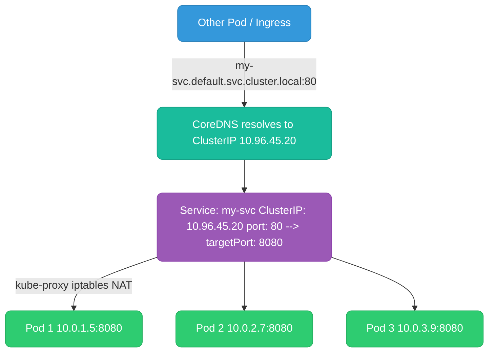
```mermaid
graph TD
    classDef client fill:#3498db,stroke:#2980b9,color:#fff,rx:8
    classDef service fill:#9b59b6,stroke:#8e44ad,color:#fff,rx:8
    classDef pod fill:#2ecc71,stroke:#27ae60,color:#fff,rx:8
    classDef proxy fill:#e67e22,stroke:#d35400,color:#fff,rx:8
    classDef dns fill:#1abc9c,stroke:#16a085,color:#fff,rx:8

    CLIENT["Other Pod / Ingress"]:::client -->|"my-svc.default.svc.cluster.local:80"| DNS["CoreDNS resolves to ClusterIP 10.96.45.20"]:::dns
    DNS --> SVC["Service: my-svc ClusterIP: 10.96.45.20 port: 80 --> targetPort: 8080"]:::service
    SVC -->|"kube-proxy iptables NAT"| P1["Pod 1 10.0.1.5:8080"]:::pod
    SVC --> P2["Pod 2 10.0.2.7:8080"]:::pod
    SVC --> P3["Pod 3 10.0.3.9:8080"]:::pod
```

### Where does the Service / ClusterIP actually live?

**Nowhere physically.** The `Service` object lives in **etcd** (control plane). The ClusterIP (`10.96.45.20`) is a **virtual IP — no process binds to it, no node owns it**. Nothing is listening on that IP.

It exists purely as **iptables NAT rules on every single worker node**, programmed by `kube-proxy`. When a packet is sent to `10.96.45.20:80`, the Linux kernel's netfilter intercepts it in the PREROUTING chain and rewrites the destination to a real pod IP before the packet ever leaves the sending node.

```
Control Plane (etcd):
  Stores the Service object definition
  { name: my-svc, clusterIP: 10.96.45.20, port: 80, targetPort: 8080, selector: app=my-svc }

kube-proxy (DaemonSet on every node):
  Watches API server for Service/EndpointSlice changes
  Translates them into iptables/IPVS rules on the local node

Every worker node's kernel:
  Has iptables rule: "if dst=10.96.45.20:80, DNAT to one of [10.0.1.5, 10.0.2.7, 10.0.3.9]:8080"
  ← THIS is where the ClusterIP "lives"
```

Step through how a Service goes from YAML to a live kernel rule:

<div class="stepper">
  <div class="stepper-panels">
    <div class="stepper-panel active">
      <strong>1. Service object created.</strong> <code>kubectl apply -f service.yaml</code> writes the Service definition to etcd via the API server &mdash; <code>clusterIP: 10.96.45.20</code>, port, and selector. Nothing on the data path has changed yet.
    </div>
    <div class="stepper-panel">
      <strong>2. Endpoints populate.</strong> <code>kube-controller-manager</code> watches for pods matching the selector and writes their IPs into an EndpointSlice &mdash; a separate object from the Service itself.
    </div>
    <div class="stepper-panel">
      <strong>3. kube-proxy programs the node.</strong> Every node's kube-proxy watches the API server for Service/EndpointSlice changes, then translates them into local iptables (or IPVS) rules.
    </div>
    <div class="stepper-panel">
      <strong>4. The rule lives in the kernel.</strong> <code>10.96.45.20:80 → DNAT → one of the pod IPs</code> is now a netfilter rule on every worker node's kernel &mdash; the only place the ClusterIP "exists" as something that actually does anything.
    </div>
  </div>
  <div class="stepper-controls">
    <button class="stepper-prev">← Prev</button>
    <span class="stepper-dots"></span>
    <span class="stepper-label"></span>
    <button class="stepper-next">Next →</button>
  </div>
</div>

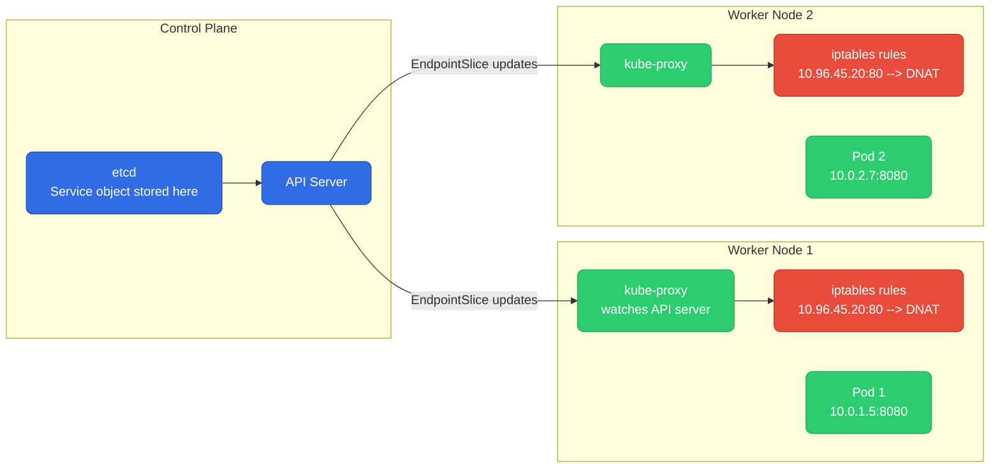
```mermaid
graph LR
    classDef cp fill:#326ce5,stroke:#254ea8,color:#fff,rx:8
    classDef node fill:#2ecc71,stroke:#27ae60,color:#fff,rx:8
    classDef virtual fill:#e74c3c,stroke:#c0392b,color:#fff,rx:8

    subgraph ControlPlane["Control Plane"]
        ETCD["etcd<br/>Service object stored here"]:::cp
        API["API Server"]:::cp
    end

    subgraph Node1["Worker Node 1"]
        KP1["kube-proxy<br/>watches API server"]:::node
        IPT1["iptables rules<br/>10.96.45.20:80 --> DNAT"]:::virtual
        POD1["Pod 1<br/>10.0.1.5:8080"]:::node
        KP1 --> IPT1
    end

    subgraph Node2["Worker Node 2"]
        KP2["kube-proxy"]:::node
        IPT2["iptables rules<br/>10.96.45.20:80 --> DNAT"]:::virtual
        POD2["Pod 2<br/>10.0.2.7:8080"]:::node
        KP2 --> IPT2
    end

    ETCD --> API
    API -->|"EndpointSlice updates"| KP1
    API -->|"EndpointSlice updates"| KP2
```

**Key insight:** The packet never travels to a "Service node". The DNAT happens **on the same node that originated the packet**, before it even hits the network. The ClusterIP is just a convenient fiction that the kernel intercepts and rewrites locally.

### How the target node is decided

No single component explicitly picks a node. The iptables rule selects a **pod IP** — the node is a side-effect of which pod was chosen. The pod IP → node mapping is handled by the CNI routing table.

The packet header changes at each hop — here's the concrete walkthrough:

```
Step 1 — Pod A originates the request
  src: 10.0.1.5:54321   dst: 10.96.45.20:80     ← ClusterIP (nothing listening here)

Step 2 — iptables DNAT fires on Node 1 (BEFORE packet leaves the node)
  src: 10.0.1.5:54321   dst: 10.0.2.7:8080      ← rewritten to real pod IP
  iptables picked Pod 2 (10.0.2.7) randomly from the EndpointSlice

Step 3 — Kernel routing table lookup: where is 10.0.2.7?
  CNI told every node: "10.0.2.0/24 is reachable via Node 2 (192.168.1.12)"
  route: 10.0.2.0/24 → 192.168.1.12

Step 4 — Packet travels to Node 2 over the physical/overlay network
  outer: src=192.168.1.11 (Node 1)  dst=192.168.1.12 (Node 2)
  inner: src=10.0.1.5:54321         dst=10.0.2.7:8080

Step 5 — Node 2 delivers to Pod 2 via its veth pair
  Pod 2 sees: src=10.0.1.5:54321   dst=10.0.2.7:8080  (its own IP)

Step 6 — Response travels back; conntrack on Node 1 reverses the DNAT
  Pod A sees: src=10.96.45.20:80   dst=10.0.1.5:54321  ← looks like ClusterIP replied
```

Click through each hop and watch the header change:

<div class="stepper">
  <div class="stepper-panels">
    <div class="stepper-panel active">
      <strong>1. Pod A originates the request.</strong> <code>src: 10.0.1.5:54321 → dst: 10.96.45.20:80</code> &mdash; the ClusterIP, nothing listening there.
    </div>
    <div class="stepper-panel">
      <strong>2. iptables DNAT fires on Node 1</strong>, before the packet leaves the node. <code>dst</code> is rewritten to <code>10.0.2.7:8080</code> &mdash; Pod 2, picked at random from the EndpointSlice.
    </div>
    <div class="stepper-panel">
      <strong>3. Kernel routing table lookup.</strong> Where is 10.0.2.7? The CNI told every node <code>10.0.2.0/24 → Node 2 (192.168.1.12)</code>.
    </div>
    <div class="stepper-panel">
      <strong>4. Packet travels to Node 2</strong> over the physical/overlay network. Outer header: <code>src=192.168.1.11 → dst=192.168.1.12</code>. Inner header (unchanged since step 2): <code>src=10.0.1.5:54321 → dst=10.0.2.7:8080</code>.
    </div>
    <div class="stepper-panel">
      <strong>5. Node 2 delivers to Pod 2</strong> via its veth pair. Pod 2 sees <code>src=10.0.1.5:54321 → dst=10.0.2.7:8080</code> &mdash; its own real IP, no rewriting from here.
    </div>
    <div class="stepper-panel">
      <strong>6. Response reverses the DNAT.</strong> conntrack on Node 1 remembers the original mapping, so Pod A sees the reply as <code>src=10.96.45.20:80</code> &mdash; it looks like the ClusterIP itself answered.
    </div>
  </div>
  <div class="stepper-controls">
    <button class="stepper-prev">← Prev</button>
    <span class="stepper-dots"></span>
    <span class="stepper-label"></span>
    <button class="stepper-next">Next →</button>
  </div>
</div>

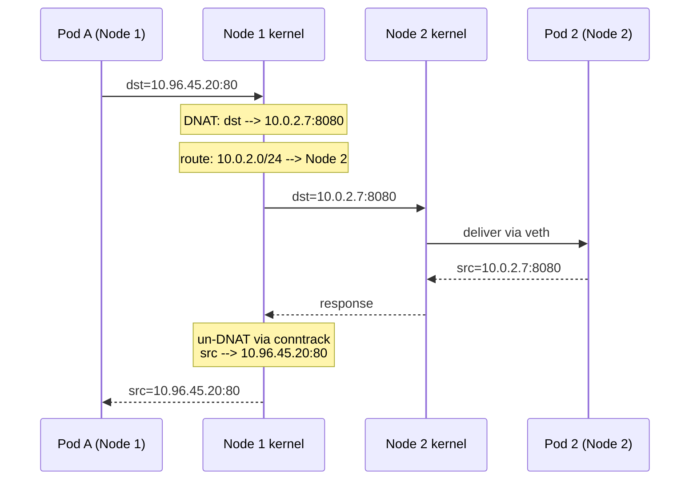
```mermaid
sequenceDiagram
    participant A as Pod A (Node 1)
    participant K1 as Node 1 kernel
    participant K2 as Node 2 kernel
    participant B as Pod 2 (Node 2)

    A->>K1: dst=10.96.45.20:80
    Note over K1: DNAT: dst --> 10.0.2.7:8080
    Note over K1: route: 10.0.2.0/24 --> Node 2
    K1->>K2: dst=10.0.2.7:8080
    K2->>B: deliver via veth
    B-->>K2: src=10.0.2.7:8080
    K2-->>K1: response
    Note over K1: un-DNAT via conntrack<br/>src --> 10.96.45.20:80
    K1-->>A: src=10.96.45.20:80
```

```
1. iptables DNAT on the sending node
   dst=10.96.45.20:80 → randomly selects Pod 2 (10.0.2.7:8080)

2. Kernel looks up 10.0.2.7 in the routing table
   CNI programmed: "10.0.2.0/24 lives on Node 2 via eth0"

3. Packet sent to Node 2's physical IP over the pod network
   (VXLAN tunnel / BGP direct route / WireGuard — depends on CNI)

4. Node 2 receives it, kernel delivers to Pod 2's veth interface
```

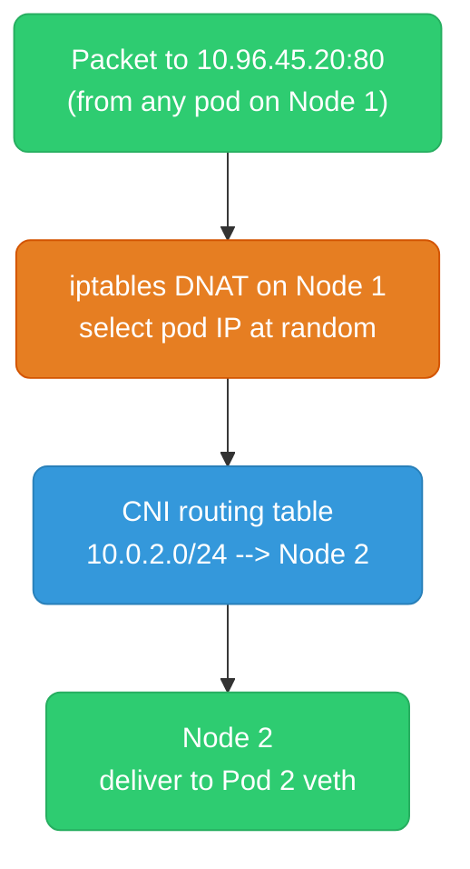
```mermaid
graph TD
    classDef kern fill:#e67e22,stroke:#d35400,color:#fff,rx:8
    classDef cni fill:#3498db,stroke:#2980b9,color:#fff,rx:8
    classDef node fill:#2ecc71,stroke:#27ae60,color:#fff,rx:8

    PKT["Packet to 10.96.45.20:80<br/>(from any pod on Node 1)"]
    DNAT["iptables DNAT on Node 1<br/>select pod IP at random"]:::kern
    ROUTE["CNI routing table<br/>10.0.2.0/24 --> Node 2"]:::cni
    NODE2["Node 2<br/>deliver to Pod 2 veth"]:::node

    PKT --> DNAT --> ROUTE --> NODE2
```

**Who programs what:**

| Component | Responsibility |
|-----------|---------------|
| `kube-proxy` | ClusterIP → pod IP (iptables/IPVS DNAT rules) |
| CNI plugin | Pod IP → node (routing table: which node owns which pod CIDR) |
| `kube-controller-manager` | Keeps EndpointSlices up to date as pods come/go |

The CNI advertises each node's pod subnet to all other nodes — via BGP (Calico), VXLAN overlay (Flannel), or eBPF direct (Cilium). kube-proxy never touches node routing; it only knows ClusterIP → pod IP.

### Full flow: Ingress → Pod

```
1. External request arrives at the Load Balancer (AWS ALB/NLB)

2. LB forwards to NodePort on one of the nodes, say Node A (192.168.1.11:30080)

3. Node A kernel: iptables DNAT fires
   dst=10.96.45.20:80 → picks Pod B (10.0.2.7:8080) at random
   Pod B lives on Node B (192.168.1.12)

4. Node A kernel routing table lookup: "who owns 10.0.2.7?"
   CNI route: 10.0.2.0/24 → Node B (192.168.1.12)
   Packet leaves Node A over the CNI network (VXLAN/BGP)

5. Packet arrives at Node B
   Node B delivers to Pod B via its veth pair

6. Pod B processes, sends response back

7. Response: Node B → Node A
   Node A conntrack reverses the DNAT
   src rewritten back to ClusterIP — caller sees consistent response

Special case: if DNAT had picked Pod A (also on Node A)
   packet never leaves Node A — CNI routes it via local veth only
```

<div class="stepper">
  <div class="stepper-panels">
    <div class="stepper-panel active">
      <strong>1. Request hits the Load Balancer.</strong> External traffic arrives at the AWS ALB/NLB.
    </div>
    <div class="stepper-panel">
      <strong>2. LB forwards to a NodePort.</strong> Say Node A, <code>192.168.1.11:30080</code>.
    </div>
    <div class="stepper-panel">
      <strong>3. Node A's kernel DNATs.</strong> <code>dst=10.96.45.20:80</code> is rewritten to Pod B, <code>10.0.2.7:8080</code> &mdash; which happens to live on Node B.
    </div>
    <div class="stepper-panel">
      <strong>4. Routing table sends it to Node B.</strong> CNI route: <code>10.0.2.0/24 → Node B (192.168.1.12)</code>. The packet leaves Node A over the CNI network.
    </div>
    <div class="stepper-panel">
      <strong>5. Node B delivers to Pod B</strong> via its veth pair.
    </div>
    <div class="stepper-panel">
      <strong>6. Pod B responds</strong>, and the reply retraces the path back to Node B → Node A.
    </div>
    <div class="stepper-panel">
      <strong>7. Node A un-DNATs via conntrack.</strong> The source is rewritten back to the ClusterIP so the caller sees a consistent response. (If DNAT had picked a pod also on Node A, the packet never leaves Node A at all &mdash; CNI routes it via the local veth only.)
    </div>
  </div>
  <div class="stepper-controls">
    <button class="stepper-prev">← Prev</button>
    <span class="stepper-dots"></span>
    <span class="stepper-label"></span>
    <button class="stepper-next">Next →</button>
  </div>
</div>

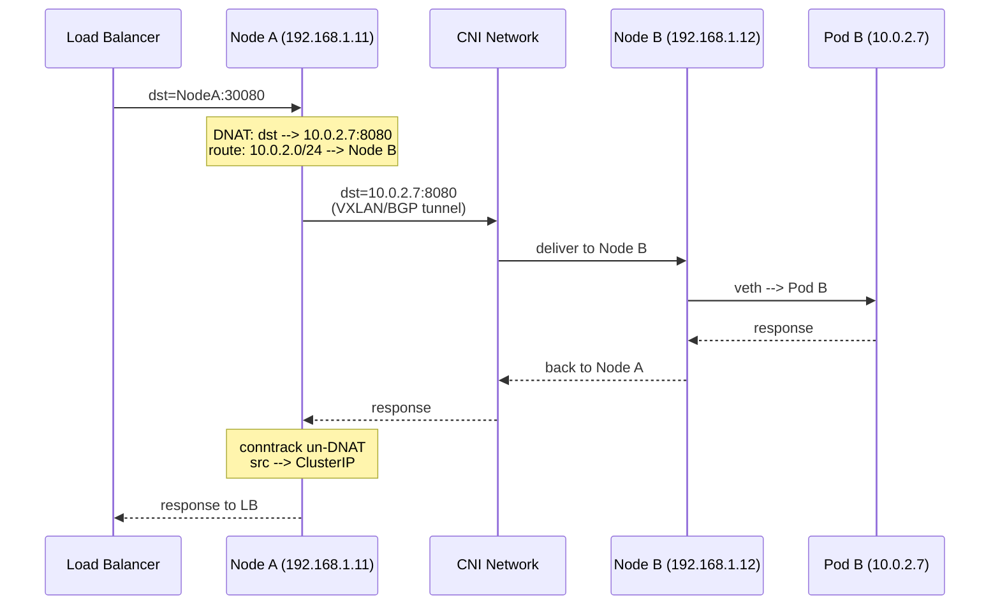
```mermaid
sequenceDiagram
    participant LB as Load Balancer
    participant NA as Node A (192.168.1.11)
    participant CNI as CNI Network
    participant NB as Node B (192.168.1.12)
    participant PB as Pod B (10.0.2.7)

    LB->>NA: dst=NodeA:30080
    Note over NA: DNAT: dst --> 10.0.2.7:8080<br/>route: 10.0.2.0/24 --> Node B
    NA->>CNI: dst=10.0.2.7:8080<br/>(VXLAN/BGP tunnel)
    CNI->>NB: deliver to Node B
    NB->>PB: veth --> Pod B
    PB-->>NB: response
    NB-->>CNI: back to Node A
    CNI-->>NA: response
    Note over NA: conntrack un-DNAT<br/>src --> ClusterIP
    NA-->>LB: response to LB
```

<div class="quiz-card">
  <p class="quiz-q">A packet is sent to a ClusterIP. Which node does the DNAT to a real pod IP happen on?</p>
  <button class="quiz-reveal">Reveal answer</button>
  <div class="quiz-a" hidden>The <strong>same node that sent the packet</strong> &mdash; the iptables rule fires locally in the PREROUTING chain before the packet ever leaves the originating node. The packet never travels to a "Service node"; the ClusterIP is rewritten to a real pod IP first, then routed normally. Nothing is ever listening on the ClusterIP itself.</div>
</div>

---

## ClusterIP Internals — How kube-proxy Programs iptables

ClusterIP is **not** a real IP with a process listening on it. It's a virtual IP that exists only in iptables NAT rules. When a packet hits the ClusterIP, the kernel rewrites the destination to one of the backend pod IPs before sending.

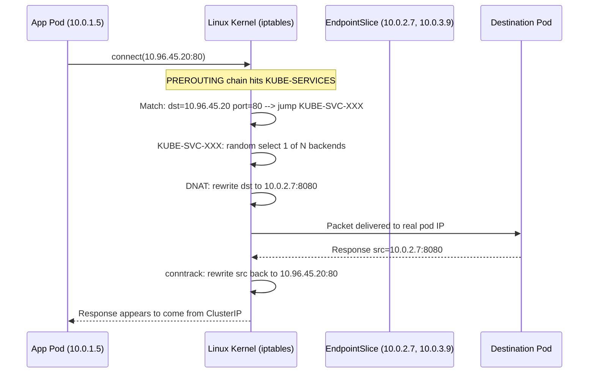
```mermaid
sequenceDiagram
    participant APP as App Pod (10.0.1.5)
    participant KERN as Linux Kernel (iptables)
    participant EP as EndpointSlice (10.0.2.7, 10.0.3.9)
    participant DEST as Destination Pod

    APP->>KERN: connect(10.96.45.20:80)
    Note over KERN: PREROUTING chain hits KUBE-SERVICES
    KERN->>KERN: Match: dst=10.96.45.20 port=80 --> jump KUBE-SVC-XXX
    KERN->>KERN: KUBE-SVC-XXX: random select 1 of N backends
    KERN->>KERN: DNAT: rewrite dst to 10.0.2.7:8080
    KERN->>DEST: Packet delivered to real pod IP
    DEST-->>KERN: Response src=10.0.2.7:8080
    KERN->>KERN: conntrack: rewrite src back to 10.96.45.20:80
    KERN-->>APP: Response appears to come from ClusterIP
```

**iptables chain hierarchy:**

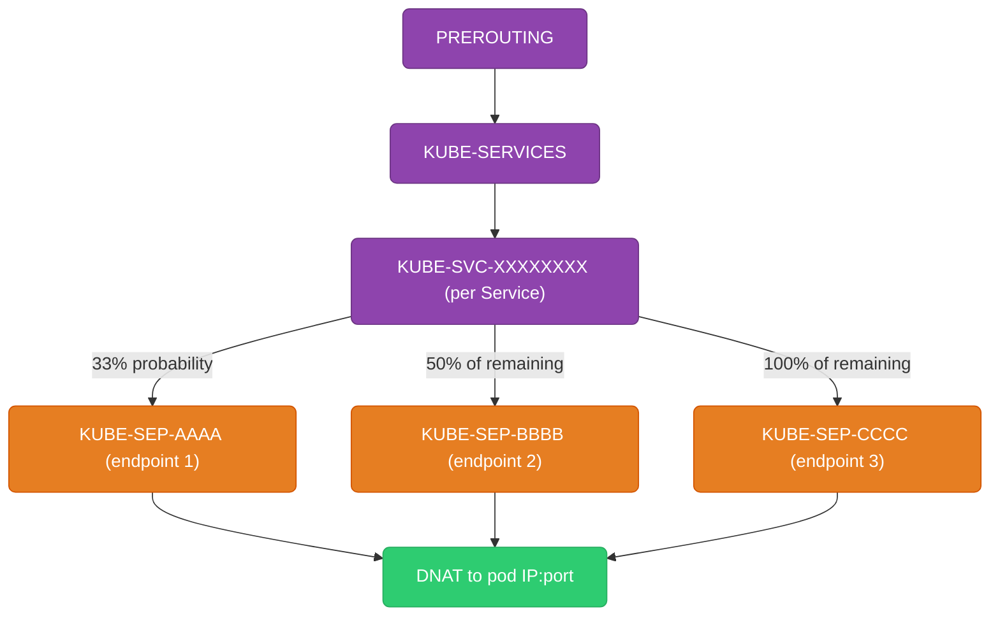
```mermaid
graph TD
    classDef chain fill:#8e44ad,stroke:#6c3483,color:#fff,rx:6
    classDef sep fill:#e67e22,stroke:#d35400,color:#fff,rx:6
    classDef dnat fill:#2ecc71,stroke:#27ae60,color:#fff,rx:6

    PRE["PREROUTING"]:::chain --> SVC["KUBE-SERVICES"]:::chain
    SVC --> XXX["KUBE-SVC-XXXXXXXX (per Service)"]:::chain
    XXX -->|"33% probability"| A["KUBE-SEP-AAAA (endpoint 1)"]:::sep
    XXX -->|"50% of remaining"| B["KUBE-SEP-BBBB (endpoint 2)"]:::sep
    XXX -->|"100% of remaining"| C["KUBE-SEP-CCCC (endpoint 3)"]:::sep
    A --> DNAT["DNAT to pod IP:port"]:::dnat
    B --> DNAT
    C --> DNAT
```

**IPVS mode** (alternative to iptables): creates a virtual server in the kernel's IPVS table instead. Scales better for large clusters (1000s of services) — O(1) lookup vs O(N) iptables scan.

<div class="quiz-card">
  <p class="quiz-q">In iptables mode, how does kube-proxy get a uniform random distribution across N backend pods using rules that must be evaluated in a fixed order?</p>
  <button class="quiz-reveal">Reveal answer</button>
  <div class="quiz-a" hidden>Each <code>KUBE-SEP-*</code> jump gets a decreasing <code>--probability</code>: the first has a 1/N chance of matching, the second 1/(N-1) of whatever's left, and so on until the last rule matches 100% of whatever remains. Evaluated in order, that decreasing-probability chain works out to a uniform random pick across all N backends.</div>
</div>

---

## Service Types

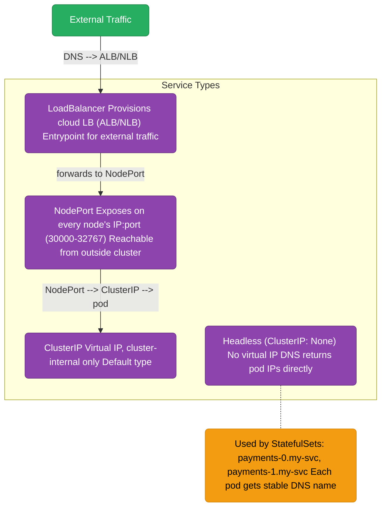
```mermaid
graph TD
    classDef svctype fill:#8e44ad,stroke:#6c3483,color:#fff,rx:6
    classDef infra fill:#2c3e50,stroke:#1a252f,color:#fff,rx:6
    classDef traffic fill:#27ae60,stroke:#1e8449,color:#fff,rx:6
    classDef note fill:#f39c12,stroke:#d68910,color:#000,rx:6

    subgraph Types["Service Types"]
        CIP["ClusterIP Virtual IP, cluster-internal only Default type"]:::svctype
        NP["NodePort Exposes on every node's IP:port (30000-32767) Reachable from outside cluster"]:::svctype
        LB["LoadBalancer Provisions cloud LB (ALB/NLB) Entrypoint for external traffic"]:::svctype
        HS["Headless (ClusterIP: None) No virtual IP DNS returns pod IPs directly"]:::svctype
    end

    EXT["External Traffic"]:::traffic -->|"DNS --> ALB/NLB"| LB
    LB -->|"forwards to NodePort"| NP
    NP -->|"NodePort --> ClusterIP --> pod"| CIP
    HS -.- NOTE["Used by StatefulSets: payments-0.my-svc, payments-1.my-svc Each pod gets stable DNS name"]:::note
```

| Type | Access | Use case |
|------|--------|----------|
| `ClusterIP` | Inside cluster only | Service-to-service communication |
| `NodePort` | `<NodeIP>:<30000-32767>` | Dev/testing, bare-metal clusters |
| `LoadBalancer` | Cloud LB public IP | Production external traffic |
| `Headless` | DNS → pod IPs directly | StatefulSets, service discovery |
| `ExternalName` | CNAME to external DNS | Database in RDS, external service aliasing |

<div class="tab-group">
  <div class="tab-buttons">
    <button data-tab="svc-clusterip" class="active">ClusterIP</button>
    <button data-tab="svc-nodeport">NodePort</button>
    <button data-tab="svc-lb">LoadBalancer</button>
    <button data-tab="svc-extname">ExternalName</button>
  </div>
  <div class="tab-panels">
    <div class="tab-panel active" data-tab-panel="svc-clusterip">
      <strong>Default type.</strong> A virtual IP, reachable only from inside the cluster. No node port, no cloud LB. Used for almost all service-to-service traffic &mdash; the vast majority of Services in a cluster are this type.
    </div>
    <div class="tab-panel" data-tab-panel="svc-nodeport">
      <strong>ClusterIP, plus a port opened on every node.</strong> Allocates a port in the 30000&ndash;32767 range and opens it on <em>every</em> node's IP, cluster-wide &mdash; even nodes with no matching pod forward the connection onward. Reachable from outside the cluster via <code>&lt;any-node-IP&gt;:&lt;nodePort&gt;</code>, mostly used for bare-metal/dev clusters with no cloud LB to provision.
    </div>
    <div class="tab-panel" data-tab-panel="svc-lb">
      <strong>NodePort, plus a provisioned cloud load balancer.</strong> The cloud controller manager asks the cloud provider for a real ALB/NLB that targets the NodePort (or pod IPs directly, depending on the controller). This is the standard way production traffic enters the cluster from the internet.
    </div>
    <div class="tab-panel" data-tab-panel="svc-extname">
      <strong>Not a proxy at all &mdash; a DNS alias.</strong> Returns a CNAME to an external hostname (e.g. an RDS endpoint). No ClusterIP, no selector, no pod backing it &mdash; kube-proxy never touches it. Purely a DNS-level indirection so in-cluster code can address an external dependency by a cluster-local name.
    </div>
  </div>
</div>

<div class="quiz-card">
  <p class="quiz-q">Does a NodePort Service replace the ClusterIP, or add to it?</p>
  <button class="quiz-reveal">Reveal answer</button>
  <div class="quiz-a" hidden>Adds to it. A NodePort Service still gets a ClusterIP &mdash; the NodePort is an additional entry point opened on every node. Traffic still flows NodePort &rarr; ClusterIP &rarr; pod, it doesn't bypass the ClusterIP layer.</div>
</div>

---

## Traffic Policies: internalTrafficPolicy & externalTrafficPolicy

Two Service fields control *which* endpoints kube-proxy is allowed to pick: one for traffic entering from outside the cluster, one for traffic between pods. Both trade **client source IP + one network hop** against **even load distribution**.

### externalTrafficPolicy (NodePort / LoadBalancer)

Applies to traffic arriving via a NodePort or cloud LoadBalancer.

- **`Cluster`** (default): a packet landing on *any* node can be forwarded to a pod on *any* node. If the receiving node has no local pod, kube-proxy DNATs to a remote pod → **extra hop** across nodes. Because the source must be rewritten (SNAT) so the return packet comes back through the same node, the **client IP is lost** (pod sees the node IP). Upside: traffic spreads evenly across all endpoints regardless of where it lands.
- **`Local`**: a node only forwards to pods **running on that same node**. No cross-node hop, **no SNAT**, so the pod sees the real **client source IP**. Downside: if a node has no local pod, traffic to that node is **dropped** (blackholed), and load is only as even as the LB's spread across nodes × pods-per-node.

**healthCheckNodePort** — When `externalTrafficPolicy: Local` is set on a LoadBalancer, kube-proxy opens a dedicated health-check port (auto-assigned in the 30000–32767 range, visible in `.spec.healthCheckNodePort`) that returns HTTP 200 only on nodes that have ≥1 ready local endpoint, else 503. The cloud LB probes this port and **stops sending traffic to nodes with no local pod**, avoiding the blackhole. This is why `Local` needs a spread of pods (e.g. a DaemonSet or good anti-affinity) to keep load balanced.

<div class="toggle-switch">
  <div class="toggle-buttons">
    <button data-toggle-opt="etp-cluster" class="active">Cluster (default)</button>
    <button data-toggle-opt="etp-local" class="state-warn">Local</button>
  </div>
  <div class="toggle-panel active" data-toggle-panel="etp-cluster">
    Any node can forward to any pod. A node with no local pod DNATs to a remote one &mdash; extra network hop, and the source IP must be SNAT'd so the reply routes back through the same node, so the pod sees the <strong>node's IP, not the client's</strong>. Upside: traffic spreads evenly regardless of where pods happen to be scheduled.
  </div>
  <div class="toggle-panel" data-toggle-panel="etp-local">
    A node only forwards to pods running on itself. No cross-node hop, no SNAT, so the pod sees the <strong>real client IP</strong>. Downside: a node with no local pod would blackhole traffic &mdash; avoided by <code>healthCheckNodePort</code>, which tells the cloud LB to stop routing to nodes with zero local endpoints.
  </div>
</div>

### internalTrafficPolicy (ClusterIP)

Applies to pod-to-Service (in-cluster) traffic hitting a ClusterIP.

- **`Cluster`** (default): kube-proxy load-balances across **all** ready endpoints cluster-wide.
- **`Local`**: a pod's traffic to the Service is routed **only to endpoints on the same node**. If there is no local endpoint, the connection **fails** (no fallback to remote). Used for **node-local caches** like NodeLocal DNSCache, or to **cut cross-AZ data-transfer cost** by keeping traffic on-node.

### Client source IP: why Local preserves it

- **Cluster** path: node A receives the packet, must DNAT it to a pod on node B, then **SNAT** the source to node A's IP so the reply returns through A for reverse DNAT via conntrack. The original client IP is overwritten → app sees the node IP.
- **Local** path: node A DNATs to a pod *on node A*; no SNAT is needed because the reply already exits through A. The original **client IP survives** end-to-end.

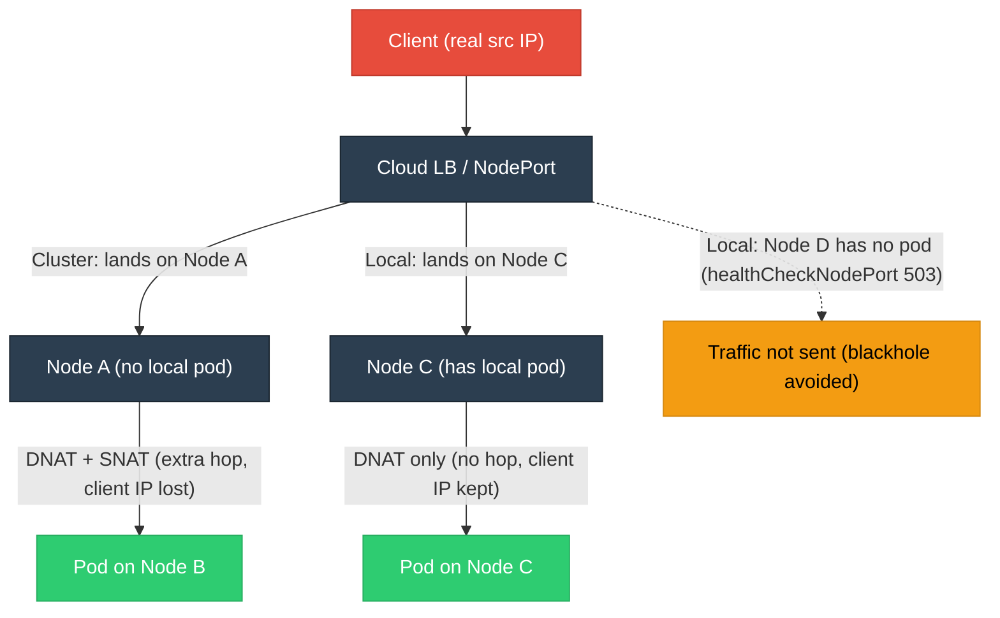
```mermaid
graph TD
    classDef ext fill:#e74c3c,stroke:#c0392b,color:#fff
    classDef node fill:#2c3e50,stroke:#1a252f,color:#fff
    classDef pod fill:#2ecc71,stroke:#27ae60,color:#fff
    classDef drop fill:#f39c12,stroke:#d68910,color:#000

    C["Client (real src IP)"]:::ext --> LB["Cloud LB / NodePort"]:::node
    LB -->|"Cluster: lands on Node A"| NA["Node A (no local pod)"]:::node
    NA -->|"DNAT + SNAT (extra hop, client IP lost)"| PB["Pod on Node B"]:::pod
    LB -->|"Local: lands on Node C"| NC["Node C (has local pod)"]:::node
    NC -->|"DNAT only (no hop, client IP kept)"| PC["Pod on Node C"]:::pod
    LB -.->|"Local: Node D has no pod (healthCheckNodePort 503)"| DROP["Traffic not sent (blackhole avoided)"]:::drop
```

### Cluster vs Local

| Aspect | `Cluster` (default) | `Local` |
|--------|---------------------|---------|
| Extra network hop | Possible (may forward to another node) | Never (same-node only) |
| Client source IP | Lost (SNAT applied) | Preserved (no SNAT) |
| Load distribution | Even across all endpoints | Depends on per-node pod spread; can be skewed |
| No local endpoint | Still served (uses remote pod) | Dropped / connection fails |
| Typical use | General default | Preserve client IP, node-local cache, cut cross-AZ cost |

### Service example (both fields)

```yaml
apiVersion: v1
kind: Service
metadata:
  name: web
spec:
  type: LoadBalancer
  selector:
    app: web
  ports:
    - port: 80
      targetPort: 8080
  externalTrafficPolicy: Local   # preserve client IP for external traffic; LB uses healthCheckNodePort
  internalTrafficPolicy: Cluster # in-cluster callers still load-balance across all endpoints
```

> Combine `externalTrafficPolicy: Local` with a DaemonSet (or pod anti-affinity) so every node that receives external traffic has a local endpoint — otherwise the healthCheckNodePort takes nodes out of rotation and load concentrates on the remaining nodes.

<div class="quiz-card">
  <p class="quiz-q">Why does externalTrafficPolicy: Local need a DaemonSet or good anti-affinity to work well, when Cluster doesn't?</p>
  <button class="quiz-reveal">Reveal answer</button>
  <div class="quiz-a" hidden>Local only forwards to pods on the <em>same</em> node the traffic landed on &mdash; there's no fallback to a remote pod. If pods are clustered on a few nodes, the LB keeps sending traffic to nodes with no local pod (until healthCheckNodePort takes them out of rotation), and load concentrates unevenly on whichever nodes do have a pod. Spreading one pod per node removes that imbalance.</div>
</div>

---

## DNS in Kubernetes

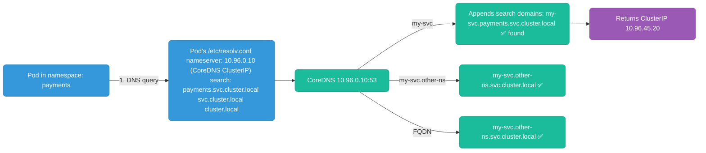
```mermaid
graph LR
    classDef pod fill:#3498db,stroke:#2980b9,color:#fff,rx:6
    classDef dns fill:#1abc9c,stroke:#16a085,color:#fff,rx:6
    classDef svc fill:#9b59b6,stroke:#8e44ad,color:#fff,rx:6

    POD["Pod in namespace: payments"]:::pod -->|"1. DNS query"| RESOLVE["Pod's /etc/resolv.conf nameserver: 10.96.0.10 (CoreDNS ClusterIP) search: payments.svc.cluster.local svc.cluster.local cluster.local"]:::pod

    RESOLVE --> COREDNS["CoreDNS 10.96.0.10:53"]:::dns

    COREDNS -->|"my-svc"| FULL1["Appends search domains: my-svc.payments.svc.cluster.local ✅ found"]:::dns
    COREDNS -->|"my-svc.other-ns"| FULL2["my-svc.other-ns.svc.cluster.local ✅"]:::dns
    COREDNS -->|"FQDN"| FULL3["my-svc.other-ns.svc.cluster.local ✅"]:::dns

    FULL1 --> SVC_IP["Returns ClusterIP 10.96.45.20"]:::svc
```

**DNS name formats:**

| Format | Resolves to | Notes |
|--------|------------|-------|
| `my-svc` | ClusterIP (same namespace) | Search domain appended |
| `my-svc.other-ns` | ClusterIP in other-ns | Cross-namespace |
| `my-svc.other-ns.svc.cluster.local` | ClusterIP (FQDN) | Explicit, always works |
| `payments-0.my-headless-svc.ns.svc.cluster.local` | Pod IP directly | StatefulSet pod DNS |
| `_http._tcp.my-svc.ns.svc.cluster.local` | SRV record | Port discovery |

**ndots:5** — pods have `ndots:5` in resolv.conf. Names with fewer than 5 dots trigger search domain expansion before trying as-is. `api.example.com` (3 dots) tries `api.example.com.payments.svc.cluster.local` first, then falls through. Use FQDN with trailing dot for external names to skip search: `api.example.com.`

<div class="quiz-card">
  <p class="quiz-q">A pod looks up <code>api.example.com</code> (an external domain). Why is the first DNS query it actually sends not for that name?</p>
  <button class="quiz-reveal">Reveal answer</button>
  <div class="quiz-a" hidden><code>ndots:5</code> in resolv.conf means any name with fewer than 5 dots gets the search domains appended and tried first. <code>api.example.com</code> has only 2 dots, so CoreDNS first tries <code>api.example.com.payments.svc.cluster.local</code> (and the other search domains) before falling through to the bare name &mdash; wasted queries and latency. A trailing dot (<code>api.example.com.</code>) or a lower ndots skips this.</div>
</div>

---

## Ingress

Ingress is an HTTP(S) reverse proxy configuration. An Ingress resource defines routing rules; an **Ingress Controller** (nginx, AWS ALB Controller, Traefik) implements them.

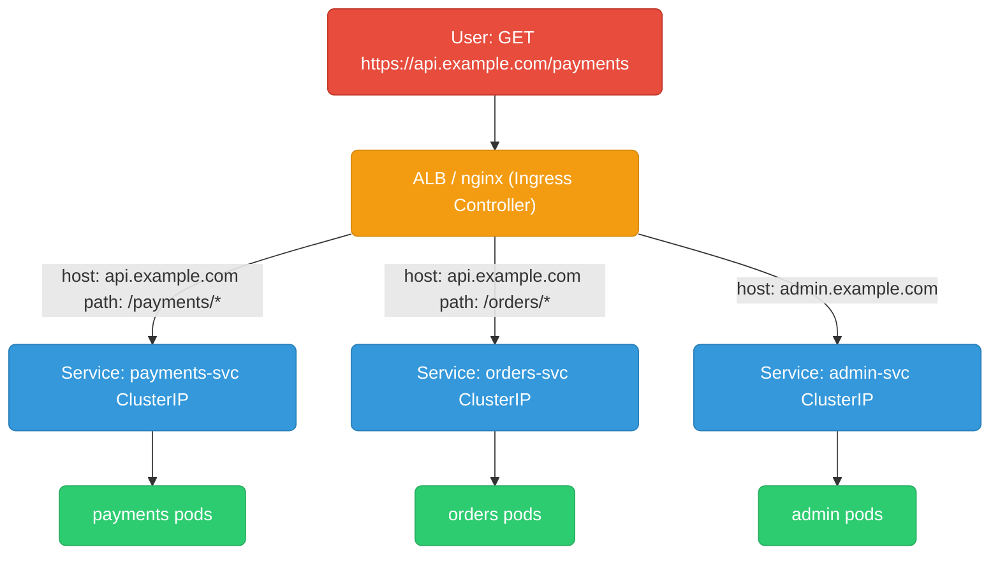
```mermaid
graph TD
    classDef ext fill:#e74c3c,stroke:#c0392b,color:#fff,rx:6
    classDef lb fill:#f39c12,stroke:#d68910,color:#fff,rx:6
    classDef ing fill:#9b59b6,stroke:#8e44ad,color:#fff,rx:6
    classDef svc fill:#3498db,stroke:#2980b9,color:#fff,rx:6
    classDef pod fill:#2ecc71,stroke:#27ae60,color:#fff,rx:6

    USER["User: GET https://api.example.com/payments"]:::ext
    USER --> ALB["ALB / nginx (Ingress Controller)"]:::lb
    ALB -->|"host: api.example.com path: /payments/*"| SVC1["Service: payments-svc ClusterIP"]:::svc
    ALB -->|"host: api.example.com path: /orders/*"| SVC2["Service: orders-svc ClusterIP"]:::svc
    ALB -->|"host: admin.example.com"| SVC3["Service: admin-svc ClusterIP"]:::svc
    SVC1 --> P1["payments pods"]:::pod
    SVC2 --> P2["orders pods"]:::pod
    SVC3 --> P3["admin pods"]:::pod
```

```yaml
apiVersion: networking.k8s.io/v1
kind: Ingress
metadata:
  name: api-ingress
  annotations:
    kubernetes.io/ingress.class: "alb"
    alb.ingress.kubernetes.io/scheme: "internet-facing"
    alb.ingress.kubernetes.io/certificate-arn: "arn:aws:acm:..."
spec:
  rules:
    - host: api.example.com
      http:
        paths:
          - path: /payments
            pathType: Prefix
            backend:
              service:
                name: payments-svc
                port:
                  number: 80
          - path: /orders
            pathType: Prefix
            backend:
              service:
                name: orders-svc
                port:
                  number: 80
  tls:
    - hosts: [api.example.com]
      secretName: api-tls-cert
```

<div class="quiz-card">
  <p class="quiz-q">You apply an Ingress resource but there's no Ingress Controller running in the cluster. What happens?</p>
  <button class="quiz-reveal">Reveal answer</button>
  <div class="quiz-a" hidden>Nothing routes. The Ingress object is accepted by the API server and just sits there &mdash; it's a routing <em>spec</em>, not a running proxy. Something has to watch Ingress resources and actually configure a reverse proxy (nginx, the AWS ALB Controller, Traefik...) for the rules to do anything.</div>
</div>

---

## NetworkPolicy — Pod-Level Firewall

By default, all pods can talk to all pods. NetworkPolicy restricts this at the CNI level (Calico, Cilium enforce policies; vanilla flannel does not).

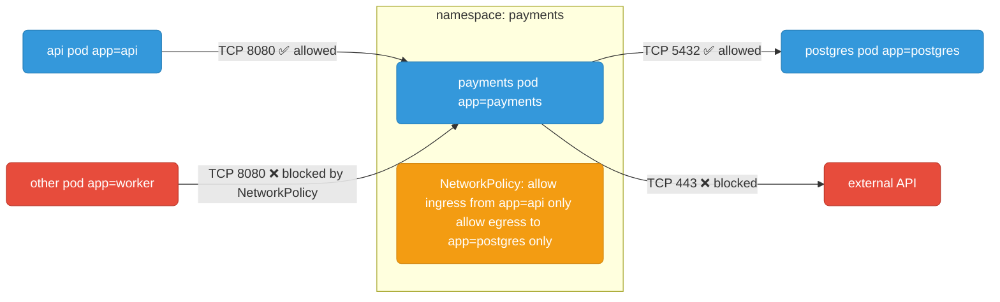
```mermaid
graph LR
    classDef allowed fill:#2ecc71,stroke:#27ae60,color:#fff,rx:6
    classDef blocked fill:#e74c3c,stroke:#c0392b,color:#fff,rx:6
    classDef policy fill:#f39c12,stroke:#d68910,color:#fff,rx:6
    classDef pod fill:#3498db,stroke:#2980b9,color:#fff,rx:6

    subgraph PaymentsNS["namespace: payments"]
        PP["payments pod app=payments"]:::pod
        POLICY["NetworkPolicy: allow ingress from app=api only allow egress to app=postgres only"]:::policy
    end

    API["api pod app=api"]:::pod -->|"TCP 8080 ✅ allowed"| PP
    MALICIOUS["other pod app=worker"]:::blocked -->|"TCP 8080 ❌ blocked by NetworkPolicy"| PP
    PP -->|"TCP 5432 ✅ allowed"| POSTGRES["postgres pod app=postgres"]:::pod
    PP -->|"TCP 443 ❌ blocked"| EXTERNAL["external API"]:::blocked
```

```yaml
apiVersion: networking.k8s.io/v1
kind: NetworkPolicy
metadata:
  name: payments-policy
  namespace: payments
spec:
  podSelector:
    matchLabels:
      app: payments       # this policy applies to payments pods
  policyTypes: [Ingress, Egress]
  ingress:
    - from:
        - podSelector:
            matchLabels:
              app: api    # only allow from api pods
      ports:
        - port: 8080
  egress:
    - to:
        - podSelector:
            matchLabels:
              app: postgres
      ports:
        - port: 5432
    - to:                 # allow DNS (always needed)
        - namespaceSelector: {}
      ports:
        - port: 53
          protocol: UDP
```

**Important:** If you apply a NetworkPolicy to a pod, ALL traffic not explicitly allowed is denied. Don't forget to allow DNS (port 53 UDP) in egress — pods will break without it.

<div class="quiz-card">
  <p class="quiz-q">You write a NetworkPolicy for the payments pod that only allows ingress from app=api and egress to app=postgres — no DNS rule. What happens to that pod's DNS lookups?</p>
  <button class="quiz-reveal">Reveal answer</button>
  <div class="quiz-a" hidden>They break. The moment a NetworkPolicy applies to a pod, everything not explicitly allowed is denied &mdash; and DNS (port 53) isn't in this policy's egress rules. You have to explicitly add a UDP/53 egress rule (usually to <code>namespaceSelector: {}</code>, since CoreDNS lives in another namespace) or the pod can't resolve any names, including the Service names it needs to reach.</div>
</div>

---

## Internet to Pod: The Complete Request Journey

### Full Component Flow

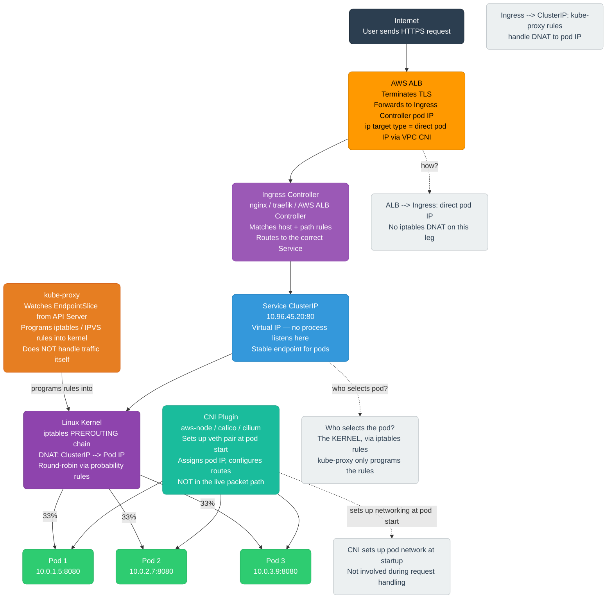
```mermaid
graph TD
    classDef internet fill:#2c3e50,stroke:#1a252f,color:#fff,rx:8
    classDef aws     fill:#ff9900,stroke:#cc7a00,color:#000,rx:8
    classDef ingress fill:#9b59b6,stroke:#8e44ad,color:#fff,rx:8
    classDef svc     fill:#3498db,stroke:#2980b9,color:#fff,rx:8
    classDef proxy   fill:#e67e22,stroke:#d35400,color:#fff,rx:8
    classDef kernel  fill:#8e44ad,stroke:#6c3483,color:#fff,rx:8
    classDef cni     fill:#1abc9c,stroke:#16a085,color:#fff,rx:8
    classDef pod     fill:#2ecc71,stroke:#27ae60,color:#fff,rx:8
    classDef note    fill:#ecf0f1,stroke:#bdc3c7,color:#2c3e50,rx:6

    INTERNET["Internet
User sends HTTPS request"]:::internet

    ALB["AWS ALB
Terminates TLS
Forwards to Ingress Controller pod IP
ip target type = direct pod IP via VPC CNI"]:::aws

    INGRESS["Ingress Controller
nginx / traefik / AWS ALB Controller
Matches host + path rules
Routes to the correct Service"]:::ingress

    SVC["Service ClusterIP
10.96.45.20:80
Virtual IP — no process listens here
Stable endpoint for pods"]:::svc

    PROXY["kube-proxy
Watches EndpointSlice from API Server
Programs iptables / IPVS rules into kernel
Does NOT handle traffic itself"]:::proxy

    KERNEL["Linux Kernel
iptables PREROUTING chain
DNAT: ClusterIP --> Pod IP
Round-robin via probability rules"]:::kernel

    CNI["CNI Plugin
aws-node / calico / cilium
Sets up veth pair at pod start
Assigns pod IP, configures routes
NOT in the live packet path"]:::cni

    POD1["Pod 1
10.0.1.5:8080"]:::pod
    POD2["Pod 2
10.0.2.7:8080"]:::pod
    POD3["Pod 3
10.0.3.9:8080"]:::pod

    N1["ALB --> Ingress: direct pod IP
No iptables DNAT on this leg"]:::note
    N2["Ingress --> ClusterIP: kube-proxy rules
handle DNAT to pod IP"]:::note
    N3["Who selects the pod?
The KERNEL, via iptables rules
kube-proxy only programs the rules"]:::note
    N4["CNI sets up pod network at startup
Not involved during request handling"]:::note

    INTERNET --> ALB
    ALB --> INGRESS
    ALB -. "how?" .-> N1
    INGRESS --> SVC
    SVC -. "who selects pod?" .-> N3
    PROXY -->|"programs rules into"| KERNEL
    SVC --> KERNEL
    KERNEL -->|"33%"| POD1
    KERNEL -->|"33%"| POD2
    KERNEL -->|"33%"| POD3
    CNI -. "sets up networking at pod start" .-> N4
    CNI --> POD1
    CNI --> POD2
    CNI --> POD3
```

Same journey, one hop at a time:

<div class="stepper">
  <div class="stepper-panels">
    <div class="stepper-panel active">
      <strong>1. Internet → ALB.</strong> User's HTTPS request hits the AWS ALB. TLS terminates here.
    </div>
    <div class="stepper-panel">
      <strong>2. ALB → Ingress Controller.</strong> With <code>target-type: ip</code>, the ALB forwards directly to an Ingress Controller pod's IP (via VPC CNI) &mdash; no iptables DNAT on this leg at all.
    </div>
    <div class="stepper-panel">
      <strong>3. Ingress Controller → Service.</strong> The controller matches host + path rules and forwards to the matching Service's ClusterIP.
    </div>
    <div class="stepper-panel">
      <strong>4. Kernel picks the pod.</strong> The packet hits the destination node's PREROUTING chain. iptables rules &mdash; already programmed by kube-proxy, not decided live &mdash; DNAT the ClusterIP to one specific pod IP, roughly uniformly at random.
    </div>
    <div class="stepper-panel">
      <strong>5. Delivery.</strong> The kernel routes the now-rewritten packet to the chosen pod via the CNI-configured routes. CNI itself isn't running anywhere in this path &mdash; it only set up the plumbing when the pod started.
    </div>
  </div>
  <div class="stepper-controls">
    <button class="stepper-prev">← Prev</button>
    <span class="stepper-dots"></span>
    <span class="stepper-label"></span>
    <button class="stepper-next">Next →</button>
  </div>
</div>

### What Happens if kube-proxy Crashes?

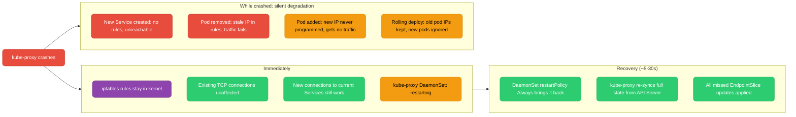
```mermaid
graph LR
    classDef bad    fill:#e74c3c,stroke:#c0392b,color:#fff,rx:8
    classDef ok     fill:#2ecc71,stroke:#27ae60,color:#fff,rx:8
    classDef warn   fill:#f39c12,stroke:#d68910,color:#000,rx:8
    classDef kernel fill:#8e44ad,stroke:#6c3483,color:#fff,rx:8
    classDef time   fill:#2c3e50,stroke:#1a252f,color:#fff,rx:6

    CRASH["kube-proxy crashes"]:::bad

    CRASH --> T1

    subgraph T1["Immediately"]
        K1["iptables rules stay in kernel"]:::kernel
        K2["Existing TCP connections unaffected"]:::ok
        K3["New connections to current Services still work"]:::ok
        K4["kube-proxy DaemonSet: restarting"]:::warn
    end

    CRASH --> T2

    subgraph T2["While crashed: silent degradation"]
        B1["New Service created: no rules, unreachable"]:::bad
        B2["Pod removed: stale IP in rules, traffic fails"]:::bad
        B3["Pod added: new IP never programmed, gets no traffic"]:::warn
        B4["Rolling deploy: old pod IPs kept, new pods ignored"]:::warn
    end

    T1 --> T3

    subgraph T3["Recovery (~5-30s)"]
        R1["DaemonSet restartPolicy Always brings it back"]:::ok
        R2["kube-proxy re-syncs full state from API Server"]:::ok
        R3["All missed EndpointSlice updates applied"]:::ok
    end
```

**Key insight:** kube-proxy writes rules into the kernel and steps aside. The kernel does the actual packet routing. Crashing kube-proxy removes the rule-updater, not the rules themselves — so existing traffic survives but the system can't adapt to changes.

<div class="quiz-card">
  <p class="quiz-q">Along the ALB → Ingress Controller → Service → Pod path, which single hop is the one where iptables DNAT actually happens?</p>
  <button class="quiz-reveal">Reveal answer</button>
  <div class="quiz-a" hidden>Only the Ingress Controller → ClusterIP leg. The ALB → Ingress Controller hop targets a pod IP directly (no DNAT involved), and CNI only sets up plumbing at pod startup &mdash; it isn't in the live packet path either. iptables DNAT is specifically how the ClusterIP gets translated to a real backend pod IP.</div>
</div>

---

## Who Actually Decides Which Pod Gets the Request?

**Not the Service. Not kube-proxy directly. The Linux kernel does — via rules kube-proxy programmed.**

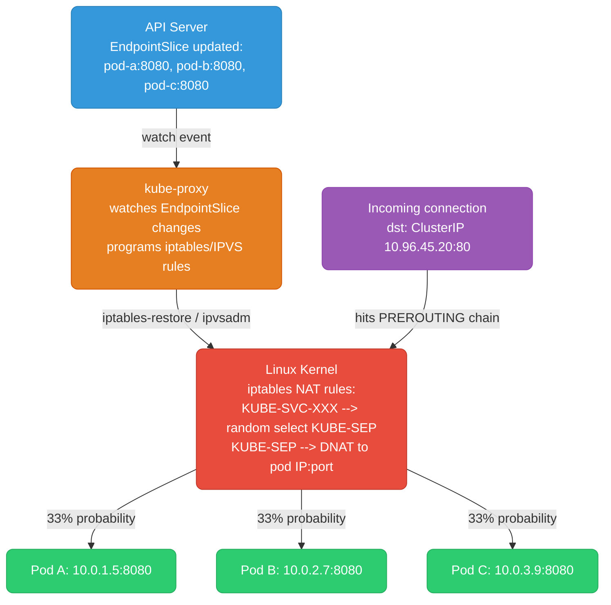
```mermaid
graph TD
    classDef kernel fill:#e74c3c,stroke:#c0392b,color:#fff,rx:8
    classDef proxy fill:#e67e22,stroke:#d35400,color:#fff,rx:8
    classDef ctrl fill:#3498db,stroke:#2980b9,color:#fff,rx:8
    classDef pod fill:#2ecc71,stroke:#27ae60,color:#fff,rx:8
    classDef svc fill:#9b59b6,stroke:#8e44ad,color:#fff,rx:8

    API["API Server
EndpointSlice updated:
pod-a:8080, pod-b:8080, pod-c:8080"]:::ctrl
    KP["kube-proxy
watches EndpointSlice changes
programs iptables/IPVS rules"]:::proxy
    RULES["Linux Kernel
iptables NAT rules:
KUBE-SVC-XXX --> random select KUBE-SEP
KUBE-SEP --> DNAT to pod IP:port"]:::kernel
    CONN["Incoming connection
dst: ClusterIP 10.96.45.20:80"]:::svc
    POD_A["Pod A: 10.0.1.5:8080"]:::pod
    POD_B["Pod B: 10.0.2.7:8080"]:::pod
    POD_C["Pod C: 10.0.3.9:8080"]:::pod

    API -->|"watch event"| KP
    KP -->|"iptables-restore / ipvsadm"| RULES
    CONN -->|"hits PREROUTING chain"| RULES
    RULES -->|"33% probability"| POD_A
    RULES -->|"33% probability"| POD_B
    RULES -->|"33% probability"| POD_C
```

**Selection mechanism:**
- **iptables mode:** `KUBE-SVC-XXX` chain has N `KUBE-SEP-*` jumps with decreasing probability: first rule has `1/N` probability (via `--probability`), second has `1/(N-1)`, last has 100%. Net result: uniform random selection. Stateless — no session affinity by default.
- **IPVS mode:** Kernel's IPVS virtual server with configurable algorithms: round-robin, least-connections, source-hash (for session affinity). O(1) lookup vs O(N) iptables scan — scales better above ~1000 services.

<div class="quiz-card">
  <p class="quiz-q">If kube-proxy is fully stopped but its previously-written iptables rules are still in the kernel, who picks which pod a new connection goes to?</p>
  <button class="quiz-reveal">Reveal answer</button>
  <div class="quiz-a" hidden>The Linux kernel still does &mdash; it evaluates the existing iptables rules on every packet regardless of whether kube-proxy is running. kube-proxy's job is only to <em>program</em> the rules ahead of time; the kernel is what actually applies them per-packet.</div>
</div>

---

## What the CNI Plugin Does (and When)

CNI is not in the request path at all for established connections. It sets up the network plumbing when a pod starts.

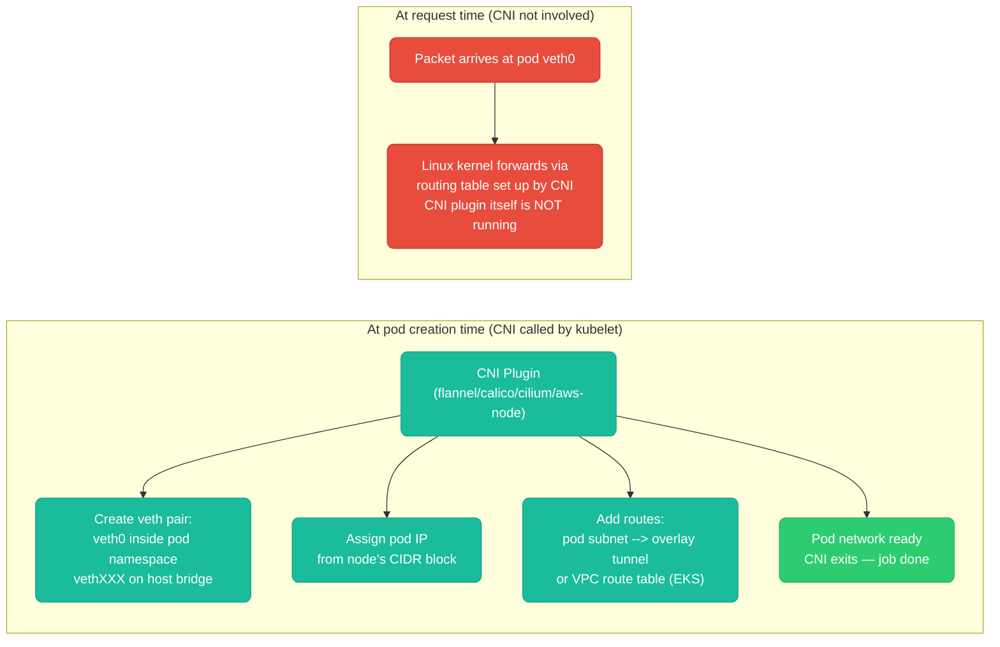
```mermaid
graph LR
    classDef cni fill:#1abc9c,stroke:#16a085,color:#fff,rx:8
    classDef pod fill:#2ecc71,stroke:#27ae60,color:#fff,rx:8
    classDef kernel fill:#e74c3c,stroke:#c0392b,color:#fff,rx:8

    subgraph PodStart["At pod creation time (CNI called by kubelet)"]
        CNI["CNI Plugin
(flannel/calico/cilium/aws-node)"]:::cni
        CNI --> VETH["Create veth pair:
veth0 inside pod namespace
vethXXX on host bridge"]:::cni
        CNI --> IP["Assign pod IP
from node's CIDR block"]:::cni
        CNI --> ROUTE["Add routes:
pod subnet --> overlay tunnel
or VPC route table (EKS)"]:::cni
        CNI --> DONE["Pod network ready
CNI exits — job done"]:::pod
    end

    subgraph RequestTime["At request time (CNI not involved)"]
        PKT["Packet arrives at pod veth0"]:::kernel
        PKT --> KERNEL_FWD["Linux kernel forwards via
routing table set up by CNI
CNI plugin itself is NOT running"]:::kernel
    end
```

**CNI is a one-shot setup tool, not a running daemon in the packet path.** (Exception: Cilium with eBPF bypasses iptables and does handle packets via its kernel programs, but that's a different architecture.)

<div class="quiz-card">
  <p class="quiz-q">A pod has been running and serving traffic for an hour. Is the CNI plugin doing anything for that pod's traffic right now?</p>
  <button class="quiz-reveal">Reveal answer</button>
  <div class="quiz-a" hidden>No (with iptables/IPVS-based CNIs). CNI ran once at pod startup to create the veth pair, assign the pod IP, and program routes, then exited &mdash; it's not a daemon sitting in the packet path. The kernel forwards packets using the routes CNI already installed. (Cilium's eBPF mode is the exception: it does have kernel programs actively handling packets.)</div>
</div>

---

## If kube-proxy Crashes

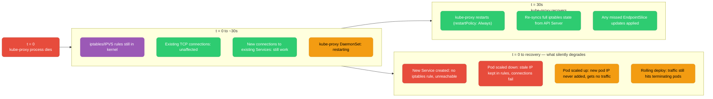
```mermaid
graph LR
    classDef bad   fill:#e74c3c,stroke:#c0392b,color:#fff,rx:8
    classDef ok    fill:#2ecc71,stroke:#27ae60,color:#fff,rx:8
    classDef warn  fill:#f39c12,stroke:#d68910,color:#000,rx:8
    classDef time  fill:#2c3e50,stroke:#1a252f,color:#fff,rx:6
    classDef kern  fill:#9b59b6,stroke:#8e44ad,color:#fff,rx:8

    T0["t = 0
kube-proxy process dies"]:::bad

    T0 --> T1

    subgraph T1["t = 0 to ~30s"]
        K1["iptables/IPVS rules still in kernel"]:::kern
        K2["Existing TCP connections: unaffected"]:::ok
        K3["New connections to existing Services: still work"]:::ok
        K4["kube-proxy DaemonSet: restarting"]:::warn
    end

    T1 --> T2

    subgraph T2["t = 30s
kube-proxy recovers"]
        R1["kube-proxy restarts (restartPolicy: Always)"]:::ok
        R2["Re-syncs full iptables state from API Server"]:::ok
        R3["Any missed EndpointSlice updates applied"]:::ok
    end

    T1 --> T3

    subgraph T3["t = 0 to recovery — what silently degrades"]
        B1["New Service created: no iptables rule, unreachable"]:::bad
        B2["Pod scaled down: stale IP kept in rules, connections fail"]:::bad
        B3["Pod scaled up: new pod IP never added, gets no traffic"]:::warn
        B4["Rolling deploy: traffic still hits terminating pods"]:::warn
    end
```

Step through the timeline:

<div class="stepper">
  <div class="stepper-panels">
    <div class="stepper-panel active">
      <strong>t = 0. kube-proxy process dies.</strong> The DaemonSet pod crashes; Kubernetes schedules a restart per <code>restartPolicy: Always</code>.
    </div>
    <div class="stepper-panel">
      <strong>t = 0 to ~30s: existing rules keep working.</strong> iptables/IPVS rules live in kernel memory, not in the kube-proxy process. Existing TCP connections are unaffected, and new connections to already-existing Services still succeed.
    </div>
    <div class="stepper-panel">
      <strong>Meanwhile: silent degradation.</strong> A new Service gets no rules at all (unreachable). A scaled-down pod's stale IP stays in the rules (connections fail). A scaled-up pod's new IP is never programmed (gets no traffic). Nothing errors loudly &mdash; it just doesn't update.
    </div>
    <div class="stepper-panel">
      <strong>t ≈ 30s: recovery.</strong> kube-proxy restarts, re-syncs full state from the API server, and applies every EndpointSlice update it missed while it was down. No manual intervention needed.
    </div>
  </div>
  <div class="stepper-controls">
    <button class="stepper-prev">← Prev</button>
    <span class="stepper-dots"></span>
    <span class="stepper-label"></span>
    <button class="stepper-next">Next →</button>
  </div>
</div>

**Why existing traffic survives:** iptables rules are programmed into the Linux kernel's netfilter tables — they live in kernel memory, not in the kube-proxy process. Killing kube-proxy removes the programmer, not the rules.

**Why new things break:** kube-proxy watches the API Server for `EndpointSlice` and `Service` changes. While it's down, changes queue up unprocessed. The kernel has no way to know pods changed — it keeps routing to whatever IPs were last programmed.

**In production:** kube-proxy is a `DaemonSet` with `restartPolicy: Always`. Typical restart time is 5–30 seconds. During that window, the degradation above applies. No manual intervention needed unless the node itself is unhealthy.

**Summary:** kube-proxy crash ≠ immediate outage. The kernel rules persist. But the system degrades over time as pods churn — stale endpoints accumulate, new services are unreachable. In production, kube-proxy runs as a DaemonSet with `restartPolicy: Always` so it recovers in seconds.

**Vanilla K8s vs EKS behavior is identical here** — both rely on the same kernel iptables/IPVS mechanism. EKS just manages the kube-proxy DaemonSet as a managed add-on that auto-heals.

<div class="quiz-card">
  <p class="quiz-q">kube-proxy has been crashed for 20 seconds. A pod that was already running when it crashed gets terminated during that window. What happens to traffic still being sent to that pod's old IP?</p>
  <button class="quiz-reveal">Reveal answer</button>
  <div class="quiz-a" hidden>It keeps getting DNAT'd to the now-dead pod's IP and fails. kube-proxy isn't running to notice the EndpointSlice update and reprogram the iptables rule &mdash; the kernel has no way to know the pod is gone, so it keeps routing to whatever was last programmed until kube-proxy recovers and re-syncs.</div>
</div>

---

## What if CoreDNS Crashes?

CoreDNS is the cluster DNS server. Every pod's `/etc/resolv.conf` points to the CoreDNS ClusterIP (`10.96.0.10` typically).

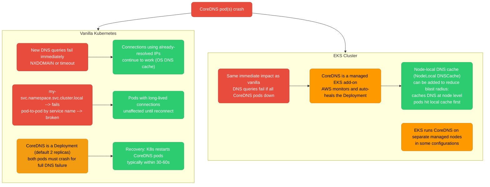
```mermaid
graph TD
    classDef ok fill:#2ecc71,stroke:#27ae60,color:#fff,rx:8
    classDef warn fill:#f39c12,stroke:#d68910,color:#000,rx:8
    classDef bad fill:#e74c3c,stroke:#c0392b,color:#fff,rx:8
    classDef eks fill:#ff9900,stroke:#cc7a00,color:#000,rx:8

    COREDNS_CRASH["CoreDNS pod(s) crash"]:::bad

    subgraph VanillaK8s["Vanilla Kubernetes"]
        V1["New DNS queries fail immediately
NXDOMAIN or timeout"]:::bad
        V2["my-svc.namespace.svc.cluster.local --> fails
pod-to-pod by service name --> broken"]:::bad
        V3["Connections using already-resolved IPs
continue to work (OS DNS cache)"]:::ok
        V4["Pods with long-lived connections
unaffected until reconnect"]:::ok
        V5["CoreDNS is a Deployment (default 2 replicas)
both pods must crash for full DNS failure"]:::warn
        V6["Recovery: K8s restarts CoreDNS pods
typically within 30-60s"]:::ok
        V1 --> V3
        V2 --> V4
        V5 --> V6
    end

    subgraph EKSCluster["EKS Cluster"]
        E1["Same immediate impact as vanilla
DNS queries fail if all CoreDNS pods down"]:::bad
        E2["CoreDNS is a managed EKS add-on
AWS monitors and auto-heals the Deployment"]:::eks
        E3["EKS runs CoreDNS on separate managed nodes
in some configurations"]:::eks
        E4["Node-local DNS cache (NodeLocal DNSCache)
can be added to reduce blast radius:
caches DNS at node level
pods hit local cache first"]:::ok
        E1 --> E2
        E2 --> E4
    end

    COREDNS_CRASH --> VanillaK8s
    COREDNS_CRASH --> EKSCluster
```

### CoreDNS Failure Impact by Connection Type

| Connection type | CoreDNS crashes | Why |
|----------------|----------------|-----|
| Existing TCP connections (DB, gRPC) | ✅ Unaffected | Already connected — no DNS needed |
| New connections using service name | ❌ Fails | Must resolve `my-svc.ns.svc.cluster.local` |
| New connections using pod IP directly | ✅ Works | No DNS lookup needed |
| HTTP/1.1 with `Connection: close` | ❌ Fails on next request | Re-resolves DNS each connection |
| HTTP/2 and gRPC (persistent) | ✅ Survives until reconnect | Multiplexed on one TCP connection |

### CoreDNS Resilience Patterns

```bash
# 1. Always run 2+ CoreDNS replicas (default in K8s)
kubectl get deployment coredns -n kube-system

# 2. Spread CoreDNS pods across nodes with anti-affinity (default)
kubectl get pod -n kube-system -l k8s-app=kube-dns -o wide

# 3. NodeLocal DNSCache DaemonSet — biggest resilience improvement
# Each node runs a local DNS cache at 169.254.20.10
# Pods hit local node cache instead of CoreDNS pods directly
# CoreDNS crash only affects cache misses, not hits

# 4. Set ndots:3 in pod spec to reduce unnecessary search domain queries
# Default ndots:5 causes 5 DNS queries before falling back to bare name
spec:
  dnsConfig:
    options:
      - name: ndots
        value: "3"

# 5. Diagnose CoreDNS issues
kubectl logs -n kube-system -l k8s-app=kube-dns --tail=50
kubectl exec -it <pod> -- nslookup kubernetes.default
kubectl exec -it <pod> -- cat /etc/resolv.conf
```

### EKS-Specific: CoreDNS Add-on

In EKS, CoreDNS is a **managed add-on**. AWS ensures it stays running and applies updates. But "managed" does not mean "immune to crashes" — if all CoreDNS pods crash simultaneously (OOM, node failure), DNS still goes down. The EKS control plane cannot restart application-plane pods (it manages the K8s API server, not your workload pods).

**EKS CoreDNS best practices:**
- Enable **NodeLocal DNSCache** — reduces CoreDNS load by ~60-80% and provides node-level fault tolerance
- Set `minReplicas: 2` in the CoreDNS HPA (EKS auto-scales CoreDNS based on node count)
- Use **PodDisruptionBudget** on CoreDNS to prevent both pods from being evicted simultaneously during node drains

<div class="quiz-card">
  <p class="quiz-q">CoreDNS is completely down. A pod holding an existing gRPC connection to another Service keeps working fine, but a script running fresh <code>curl</code> calls to that same Service name every time starts failing. Why the difference?</p>
  <button class="quiz-reveal">Reveal answer</button>
  <div class="quiz-a" hidden>The gRPC connection is already established &mdash; it resolved the name once, and its persistent, multiplexed HTTP/2 connection doesn't need to re-resolve for each request. Fresh <code>curl</code> calls (especially short-lived HTTP/1.1 with <code>Connection: close</code>) do a new DNS lookup every time, and every one of those fails while CoreDNS is down.</div>
</div>

---

## Why Ingress Exists (LoadBalancer vs Ingress)

### The Problem: One LoadBalancer Per Service

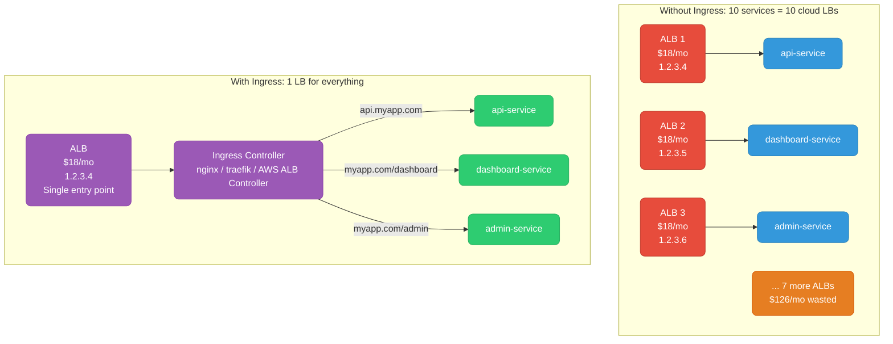
```mermaid
graph TD
    classDef lb    fill:#e74c3c,stroke:#c0392b,color:#fff,rx:8
    classDef svc   fill:#3498db,stroke:#2980b9,color:#fff,rx:8
    classDef cost  fill:#e67e22,stroke:#d35400,color:#fff,rx:8
    classDef ok    fill:#2ecc71,stroke:#27ae60,color:#fff,rx:8
    classDef ing   fill:#9b59b6,stroke:#8e44ad,color:#fff,rx:8

    subgraph Without["Without Ingress: 10 services = 10 cloud LBs"]
        LB1["ALB 1
$18/mo
1.2.3.4"]:::lb --> SVC1["api-service"]:::svc
        LB2["ALB 2
$18/mo
1.2.3.5"]:::lb --> SVC2["dashboard-service"]:::svc
        LB3["ALB 3
$18/mo
1.2.3.6"]:::lb --> SVC3["admin-service"]:::svc
        LBN["... 7 more ALBs
$126/mo wasted"]:::cost
    end

    subgraph WithIngress["With Ingress: 1 LB for everything"]
        ALB["ALB
$18/mo
1.2.3.4
Single entry point"]:::ing
        IC["Ingress Controller
nginx / traefik / AWS ALB Controller"]:::ing
        ALB --> IC
        IC -->|"api.myapp.com"| S1["api-service"]:::ok
        IC -->|"myapp.com/dashboard"| S2["dashboard-service"]:::ok
        IC -->|"myapp.com/admin"| S3["admin-service"]:::ok
    end
```

### LoadBalancer vs Ingress: Feature Comparison

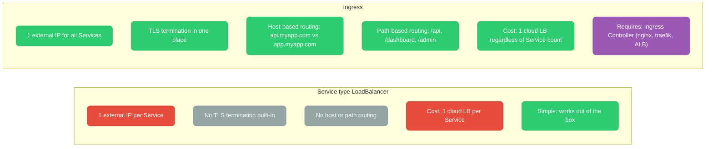
```mermaid
graph LR
    classDef lb   fill:#e74c3c,stroke:#c0392b,color:#fff,rx:8
    classDef ing  fill:#9b59b6,stroke:#8e44ad,color:#fff,rx:8
    classDef feat fill:#2ecc71,stroke:#27ae60,color:#fff,rx:8
    classDef miss fill:#95a5a6,stroke:#7f8c8d,color:#fff,rx:8

    subgraph LBType["Service type LoadBalancer"]
        LB_IP["1 external IP per Service"]:::lb
        LB_TLS["No TLS termination built-in"]:::miss
        LB_ROUTE["No host or path routing"]:::miss
        LB_COST["Cost: 1 cloud LB per Service"]:::lb
        LB_SIMPLE["Simple: works out of the box"]:::feat
    end

    subgraph IngressType["Ingress"]
        ING_IP["1 external IP for all Services"]:::feat
        ING_TLS["TLS termination in one place"]:::feat
        ING_HOST["Host-based routing: api.myapp.com vs app.myapp.com"]:::feat
        ING_PATH["Path-based routing: /api, /dashboard, /admin"]:::feat
        ING_COST["Cost: 1 cloud LB regardless of Service count"]:::feat
        ING_CTRL["Requires: Ingress Controller (nginx, traefik, ALB)"]:::ing
    end
```

### Ingress is Just a Spec — The Controller Implements It

```mermaid
graph TD
    classDef spec  fill:#3498db,stroke:#2980b9,color:#fff,rx:8
    classDef ctrl  fill:#9b59b6,stroke:#8e44ad,color:#fff,rx:8
    classDef cloud fill:#ff9900,stroke:#cc7a00,color:#000,rx:8

    SPEC["Ingress resource (Kubernetes spec)
apiVersion: networking.k8s.io/v1
kind: Ingress
Rules: host/path --> service mapping
Just configuration — does nothing by itself"]:::spec

    SPEC -->|"implemented by"| NGINX["nginx Ingress Controller
Open source, most common
Annotation-heavy for advanced routing"]:::ctrl
    SPEC -->|"implemented by"| TRAEFIK["Traefik
Auto-discovers Ingress resources
Good for dynamic environments"]:::ctrl
    SPEC -->|"implemented by"| ALB_CTRL["AWS Load Balancer Controller
Creates real ALB per Ingress
Native AWS integration (WAF, ACM certs)"]:::cloud
    SPEC -->|"implemented by"| AGIC["Azure Application Gateway
Ingress Controller (AGIC)
Azure-native"]:::cloud
    SPEC -->|"implemented by"| GW["Gateway API (successor)
More expressive, less annotation mess
Separates infra vs app routing concerns"]:::ctrl
```

**The annotation problem:** Each controller extends Ingress with controller-specific annotations. Advanced routing in nginx requires things like:

```yaml
annotations:
  nginx.ingress.kubernetes.io/rewrite-target: /$2
  nginx.ingress.kubernetes.io/use-regex: "true"
  nginx.ingress.kubernetes.io/proxy-body-size: "50m"
  nginx.ingress.kubernetes.io/rate-limit: "100"
  nginx.ingress.kubernetes.io/ssl-redirect: "true"
```

These annotations are nginx-specific. Switching to Traefik means rewriting all annotations. This is why **Gateway API** was created — it expresses advanced routing in proper typed resources (`HTTPRoute`, `TLSRoute`, `GRPCRoute`) instead of freeform annotations, and cleanly separates infrastructure concerns (which LB/controller) from application concerns (which path goes where).

### When to Use What

| | LoadBalancer Service | Ingress | Gateway API |
|--|---------------------|---------|-------------|
| Use case | Single service needing external access (e.g. one gRPC service with static IP) | Multiple HTTP/HTTPS services through one LB | Same as Ingress but with complex routing, multi-team clusters |
| TLS | Manual (external LB handles it) | Controller handles cert from Secret | Native TLS policy resources |
| Cost | High (1 LB per service) | Low (1 LB total) | Low (1 LB total) |
| Complexity | Low | Medium | Higher (newer, less tooling) |
| Non-HTTP protocols | Yes (NLB for TCP/UDP) | HTTP/HTTPS only (mostly) | TCP/UDP via `TCPRoute` |

<div class="quiz-card">
  <p class="quiz-q">What two things does a plain LoadBalancer Service lack that Ingress provides?</p>
  <button class="quiz-reveal">Reveal answer</button>
  <div class="quiz-a" hidden>Host/path-based routing and built-in TLS termination. A LoadBalancer Service gets its own external IP and cloud LB per Service with no routing logic &mdash; Ingress lets many host/path rules share a single LB and terminates TLS in one place, which is also why it's cheaper at scale (one LB instead of one per Service).</div>
</div>

---

## IngressGroup — Sharing One ALB Across Multiple Ingress Resources (EKS)

### The Problem Without IngressGroup

By default, AWS Load Balancer Controller creates **one ALB per Ingress resource**. If you have 5 teams each managing their own Ingress, you get 5 ALBs.

```mermaid
graph TD
    classDef lb   fill:#e74c3c,stroke:#c0392b,color:#fff,rx:8
    classDef ing  fill:#9b59b6,stroke:#8e44ad,color:#fff,rx:8
    classDef svc  fill:#2ecc71,stroke:#27ae60,color:#fff,rx:8
    classDef cost fill:#e67e22,stroke:#d35400,color:#fff,rx:8

    subgraph Without["Without IngressGroup: 1 ALB per Ingress"]
        ALB1["ALB 1
team-payments"]:::lb --> ING1["Ingress: payments-ingress"]:::ing
        ALB2["ALB 2
team-orders"]:::lb --> ING2["Ingress: orders-ingress"]:::ing
        ALB3["ALB 3
team-admin"]:::lb --> ING3["Ingress: admin-ingress"]:::ing
        COST["3 ALBs x $18/mo = $54/mo
+ 3 DNS entries to manage"]:::cost
    end
```

### With IngressGroup: One ALB, Multiple Ingresses

```mermaid
graph TD
    classDef lb    fill:#ff9900,stroke:#cc7a00,color:#000,rx:8
    classDef ctrl  fill:#3498db,stroke:#2980b9,color:#fff,rx:8
    classDef ing   fill:#9b59b6,stroke:#8e44ad,color:#fff,rx:8
    classDef svc   fill:#2ecc71,stroke:#27ae60,color:#fff,rx:8
    classDef ns    fill:#1abc9c,stroke:#16a085,color:#fff,rx:8

    ALB["Single ALB: shared-alb
One DNS, one cert, one $18/mo"]:::lb
    LBC["AWS Load Balancer Controller
Merges all grouped Ingresses
into ALB listener rules"]:::ctrl

    ALB --> LBC

    subgraph NS1["namespace: payments"]
        ING1["Ingress: payments-ingress
group.name: platform-alb
group.order: 10"]:::ing
        SVC1["payments-svc"]:::svc
        ING1 --> SVC1
    end

    subgraph NS2["namespace: orders"]
        ING2["Ingress: orders-ingress
group.name: platform-alb
group.order: 20"]:::ing
        SVC2["orders-svc"]:::svc
        ING2 --> SVC2
    end

    subgraph NS3["namespace: admin"]
        ING3["Ingress: admin-ingress
group.name: platform-alb
group.order: 30"]:::ing
        SVC3["admin-svc"]:::svc
        ING3 --> SVC3
    end

    LBC -->|"api.example.com/payments"| ING1
    LBC -->|"api.example.com/orders"| ING2
    LBC -->|"admin.example.com"| ING3
```

### Ingress YAML with IngressGroup

```yaml
# namespace: payments — team manages only this file
apiVersion: networking.k8s.io/v1
kind: Ingress
metadata:
  name: payments-ingress
  namespace: payments
  annotations:
    kubernetes.io/ingress.class: alb
    alb.ingress.kubernetes.io/group.name: platform-alb       # shared ALB name
    alb.ingress.kubernetes.io/group.order: "10"              # rule priority (lower = higher prio)
    alb.ingress.kubernetes.io/scheme: internet-facing
    alb.ingress.kubernetes.io/target-type: ip
    alb.ingress.kubernetes.io/certificate-arn: arn:aws:acm:...
spec:
  rules:
    - host: api.example.com
      http:
        paths:
          - path: /payments
            pathType: Prefix
            backend:
              service:
                name: payments-svc
                port:
                  number: 80
---
# namespace: orders — different team, different namespace, SAME ALB
apiVersion: networking.k8s.io/v1
kind: Ingress
metadata:
  name: orders-ingress
  namespace: orders
  annotations:
    kubernetes.io/ingress.class: alb
    alb.ingress.kubernetes.io/group.name: platform-alb       # same group = same ALB
    alb.ingress.kubernetes.io/group.order: "20"
spec:
  rules:
    - host: api.example.com
      http:
        paths:
          - path: /orders
            pathType: Prefix
            backend:
              service:
                name: orders-svc
                port:
                  number: 80
```

**What the ALB Controller does:** it watches all Ingress resources across all namespaces, groups them by `group.name`, and synthesizes a single ALB with combined listener rules. Rules are ordered by `group.order` — conflicts between teams are resolved by priority.

### Routing Types You Can Use in IngressGroup

All standard ALB routing works — the grouping is just about which ALB the rules land on:

| Routing type | Annotation / spec | Example |
|-------------|-------------------|---------|
| Host-based | `spec.rules[].host` | `api.example.com` vs `admin.example.com` |
| Path-based | `spec.rules[].http.paths[].path` | `/payments` vs `/orders` |
| Path type | `pathType: Exact / Prefix` | Exact match vs prefix |
| Header-based | `alb.ingress.kubernetes.io/conditions.*` | `X-Version: v2` |
| Query string | `alb.ingress.kubernetes.io/conditions.*` | `?env=canary` |
| Weighted routing | `alb.ingress.kubernetes.io/actions.*` | 90% v1, 10% v2 (canary) |

### Is IngressGroup AWS LBC Only?

```mermaid
graph LR
    classDef aws   fill:#ff9900,stroke:#cc7a00,color:#000,rx:8
    classDef nginx fill:#2ecc71,stroke:#27ae60,color:#fff,rx:8
    classDef gw    fill:#3498db,stroke:#2980b9,color:#fff,rx:8
    classDef note  fill:#ecf0f1,stroke:#bdc3c7,color:#2c3e50,rx:6

    subgraph AWSLBC["AWS LBC: IngressGroup annotation"]
        A1["group.name: platform-alb"]:::aws
        A2["Explicit grouping needed because
each Ingress = 1 real AWS ALB by default"]:::note
    end

    subgraph NGINX["nginx / Traefik: implicit sharing"]
        N1["All Ingresses handled by one nginx process"]:::nginx
        N2["One external LB in front of nginx pod(s)
naturally shared — no annotation needed"]:::note
    end

    subgraph GatewayAPI["Gateway API: the proper standard"]
        G1["HTTPRoute resources reference a shared Gateway"]:::gw
        G2["Works across controllers: nginx, Envoy, Istio, ALB
No annotation mess, team isolation built-in"]:::note
    end
```

**Summary:** IngressGroup is AWS LBC-specific because only AWS LBC creates real external ALBs per Ingress. nginx/Traefik already share infrastructure naturally. Gateway API solves the same multi-team sharing problem in a standardized, controller-agnostic way — which is why it's the future direction.

<div class="quiz-card">
  <p class="quiz-q">Why does IngressGroup exist as an AWS Load Balancer Controller-specific annotation, but nginx/Traefik never needed an equivalent?</p>
  <button class="quiz-reveal">Reveal answer</button>
  <div class="quiz-a" hidden>AWS LBC provisions one real ALB per Ingress resource by default, so sharing one ALB across teams/namespaces needs an explicit opt-in (<code>group.name</code>). nginx/Traefik work the opposite way: all Ingress resources are already handled by one running controller process behind one external LB &mdash; the sharing is automatic, nothing extra needed.</div>
</div>

---

## Good to Know

### Why pods need their own IPs (not just node IPs)

A node has one IP (e.g. `192.168.1.11`). If 50 pods run on it and all share that IP, the only way to address individual pods is port mapping — manually assigning a unique host port per pod (`-p 8081:8080`, `-p 8082:8080`…). That's Docker's original model and it breaks at scale.

Kubernetes gives **every pod its own IP**, so:

```
Pod A: 10.0.1.5:8080    ← directly addressable
Pod B: 10.0.1.6:8080    ← same port, different IP — no conflict
Pod C: 10.0.1.7:8080
```

Pods talk to each other directly by IP with no NAT. No port mapping table to manage. The complexity of managing a separate IP range is the price of a **flat network** where any pod can reach any other pod directly.

### Three separate IP ranges — why

```
Node IPs:    192.168.1.0/24    assigned by VPC/datacenter
Pod IPs:     10.0.0.0/16       assigned by CNI, flat across all nodes
ClusterIPs:  10.96.0.0/12      virtual, assigned by kube-apiserver
```

Non-overlapping ranges let the kernel route unambiguously — "this is a pod, this is a node, this is a service" purely from the IP prefix. If pods shared the node CIDR, physical routers would need to know exactly which pod lives on which node, and they'd clash with the existing network.

### Each node has its own virtual network

The cluster pod CIDR is sliced into per-node subnets by the CNI:

```
Cluster CIDR: 10.0.0.0/16

Node 1: 10.0.1.0/24   → pods on Node 1 get IPs from here
Node 2: 10.0.2.0/24   → pods on Node 2 get IPs from here
Node 3: 10.0.3.0/24   → pods on Node 3 get IPs from here
```

Inside each node, CNI creates a virtual bridge (`cni0`):

```mermaid
graph TD
    classDef nic fill:#e67e22,stroke:#d35400,color:#fff,rx:6
    classDef bridge fill:#3498db,stroke:#2980b9,color:#fff,rx:6
    classDef pod fill:#2ecc71,stroke:#27ae60,color:#fff,rx:6

    NODE["Node 1"]
    ETH["eth0: 192.168.1.11 (physical NIC, talks to other nodes)"]:::nic
    BR["cni0 bridge: 10.0.1.1 (virtual switch for local pods)"]:::bridge
    PA["Pod A: 10.0.1.5"]:::pod
    PB["Pod B: 10.0.1.6"]:::pod
    PC["Pod C: 10.0.1.7"]:::pod

    NODE --> ETH
    NODE --> BR
    BR -->|"veth"| PA
    BR -->|"veth"| PB
    BR -->|"veth"| PC
```

Each pod gets a `veth` pair — one end inside the pod's network namespace, the other plugged into the bridge. Pods on the same node talk via the bridge without leaving the host.

Cross-node traffic is where CNI stitches the isolated per-node networks together:

| CNI | How it connects nodes |
|-----|-----------------------|
| **Flannel** | Wraps packets in UDP (VXLAN tunnel) over eth0 |
| **Calico** | Advertises pod subnets via BGP — packets route natively |
| **Cilium** | Bypasses bridge entirely, routes in kernel with eBPF maps |

```mermaid
graph LR
    classDef pod fill:#2ecc71,stroke:#27ae60,color:#fff,rx:8
    classDef bridge fill:#3498db,stroke:#2980b9,color:#fff,rx:8
    classDef nic fill:#e67e22,stroke:#d35400,color:#fff,rx:8
    classDef cni fill:#9b59b6,stroke:#8e44ad,color:#fff,rx:8

    subgraph Node1["Node 1 (192.168.1.11)"]
        PA["Pod A 10.0.1.5"]:::pod
        PB["Pod B 10.0.1.6"]:::pod
        BR1["cni0 bridge 10.0.1.1"]:::bridge
        ETH1["eth0 192.168.1.11"]:::nic
        PA & PB --> BR1 --> ETH1
    end

    subgraph Node2["Node 2 (192.168.1.12)"]
        PC["Pod C 10.0.2.5"]:::pod
        PD["Pod D 10.0.2.6"]:::pod
        BR2["cni0 bridge 10.0.2.1"]:::bridge
        ETH2["eth0 192.168.1.12"]:::nic
        PC & PD --> BR2 --> ETH2
    end

    ETH1 <-->|"CNI network<br/>(VXLAN / BGP / eBPF)"| ETH2
```

Pod A → Pod C: `cni0 bridge → eth0 → CNI network → eth0 (Node 2) → cni0 bridge → Pod C`. From Pod A's perspective it's just a direct IP connection to `10.0.2.5`.

<div class="quiz-card">
  <p class="quiz-q">Why does Kubernetes use three non-overlapping IP ranges (node, pod, ClusterIP) instead of just handing pods addresses from the node's own subnet?</p>
  <button class="quiz-reveal">Reveal answer</button>
  <div class="quiz-a" hidden>Non-overlapping ranges let the kernel tell "this is a pod / this is a node / this is a virtual service" apart purely from the IP prefix, and let physical routers stay ignorant of individual pods. If pods shared the node's subnet, routing pod traffic would require every router to know exactly which pod lives on which node, clashing with the existing network.</div>
</div>

---

## NetworkPolicy — Advanced Patterns

### AND vs OR in selector logic

The most common NetworkPolicy bug: accidentally writing OR when you mean AND.

<div class="tab-group">
  <div class="tab-buttons">
    <button data-tab="np-or" class="active">OR (two list items)</button>
    <button data-tab="np-and">AND (same list item)</button>
  </div>
  <div class="tab-panels">
    <div class="tab-panel active" data-tab-panel="np-or">
      <pre><code># OR — either condition grants access (two separate list items)
ingress:
  - from:
    - namespaceSelector:
        matchLabels:
          env: prod        # any pod in the prod namespace
    - podSelector:         # OR any pod with app=api in ANY namespace
        matchLabels:
          app: api</code></pre>
    </div>
    <div class="tab-panel" data-tab-panel="np-and">
      <pre><code># AND — pod must satisfy BOTH conditions (same list item, same indent)
ingress:
  - from:
    - namespaceSelector:
        matchLabels:
          env: prod        # pod must be in prod namespace
      podSelector:         # AND must have app=api label
        matchLabels:
          app: api</code></pre>
    </div>
  </div>
</div>

The YAML indentation is the semantic difference. `namespaceSelector` + `podSelector` at the same indent level under the same `- {}` block = AND. Separate `- {}` items = OR.

<div class="quiz-card">
  <p class="quiz-q">In a NetworkPolicy ingress rule, you need "from prod namespace AND app=api" but you put namespaceSelector and podSelector as two separate items in the `from` list instead of the same item. What did you actually write?</p>
  <button class="quiz-reveal">Reveal answer</button>
  <div class="quiz-a" hidden>OR, not AND &mdash; a much more permissive rule than intended. Separate <code>- {}</code> list items under <code>from</code> are independent alternatives (any pod in prod namespace, OR any app=api pod anywhere). Only putting both selectors at the same indent level inside the same list item makes them a combined AND condition.</div>
</div>

### Deny-all templates

Three common patterns, from strictest to most usable:

<div class="tab-group">
  <div class="tab-buttons">
    <button data-tab="deny-ingress" class="active">Deny ingress</button>
    <button data-tab="deny-egress">Deny egress</button>
    <button data-tab="deny-dns">Deny-all + DNS (recommended)</button>
  </div>
  <div class="tab-panels">
    <div class="tab-panel active" data-tab-panel="deny-ingress">
      <pre><code># Deny all ingress to all pods in namespace
apiVersion: networking.k8s.io/v1
kind: NetworkPolicy
metadata:
  name: default-deny-ingress
  namespace: payments
spec:
  podSelector: {}      # {} = all pods
  policyTypes: [Ingress]
  # No ingress rules = deny all</code></pre>
    </div>
    <div class="tab-panel" data-tab-panel="deny-egress">
      <pre><code># Deny all egress from all pods in namespace
apiVersion: networking.k8s.io/v1
kind: NetworkPolicy
metadata:
  name: default-deny-egress
  namespace: payments
spec:
  podSelector: {}
  policyTypes: [Egress]
  # No egress rules = deny all (note: also blocks DNS — add port 53 exception)</code></pre>
    </div>
    <div class="tab-panel" data-tab-panel="deny-dns">
      <pre><code># Recommended default-deny with DNS allowed
apiVersion: networking.k8s.io/v1
kind: NetworkPolicy
metadata:
  name: default-deny-with-dns
  namespace: payments
spec:
  podSelector: {}
  policyTypes: [Ingress, Egress]
  egress:
    - ports:
        - port: 53
          protocol: UDP
        - port: 53
          protocol: TCP   # TCP fallback for large DNS responses</code></pre>
    </div>
  </div>
</div>

### Egress to Kubernetes API server

When you lock down egress, pods that call the K8s API (operators, controllers, admission webhooks, pods using `kubectl`) stop working. The API server ClusterIP is `10.96.0.1:443` by default.

```bash
# Find the API server ClusterIP in your cluster
kubectl get svc kubernetes -n default
# NAME         TYPE        CLUSTER-IP   EXTERNAL-IP   PORT(S)   AGE
# kubernetes   ClusterIP   10.96.0.1    <none>        443/TCP   30d
```

```yaml
# Allow egress to K8s API server
egress:
  - to:
    - ipBlock:
        cidr: 10.96.0.1/32   # API server ClusterIP — get from above
    ports:
      - port: 443
        protocol: TCP
  - ports:                    # DNS always required
    - port: 53
      protocol: UDP
```

### Isolating namespaces from each other

```yaml
# Namespace A: allow only intra-namespace traffic
apiVersion: networking.k8s.io/v1
kind: NetworkPolicy
metadata:
  name: namespace-isolation
  namespace: team-a
spec:
  podSelector: {}
  policyTypes: [Ingress, Egress]
  ingress:
    - from:
      - podSelector: {}   # only pods in THIS namespace (no namespaceSelector = same NS only)
  egress:
    - to:
      - podSelector: {}   # same — only same namespace
    - ports:
      - port: 53
        protocol: UDP
```

### Allow monitoring namespace to scrape all namespaces

```yaml
# In every application namespace: allow Prometheus to scrape metrics
apiVersion: networking.k8s.io/v1
kind: NetworkPolicy
metadata:
  name: allow-prometheus-scrape
  namespace: payments           # repeat per app namespace, or use Kyverno to auto-generate
spec:
  podSelector: {}
  policyTypes: [Ingress]
  ingress:
    - from:
      - namespaceSelector:
          matchLabels:
            kubernetes.io/metadata.name: monitoring
        podSelector:
          matchLabels:
            app: prometheus
      ports:
        - port: 9090             # change to your metrics port
```

### CNI enforcement matrix

Not all CNI plugins enforce NetworkPolicy. Applying a policy to a cluster where the CNI ignores it gives false security.

| CNI | NetworkPolicy enforcement | Notes |
|---|---|---|
| Flannel (vanilla) | ❌ No | Policies accepted but silently ignored |
| Calico | ✅ Yes | Also supports Calico-native GlobalNetworkPolicy (cluster-wide) |
| Cilium | ✅ Yes | Also supports L7 (HTTP path/method) via CiliumNetworkPolicy |
| Weave | ✅ Yes | Deprecated project, use with caution |
| AWS VPC CNI (EKS) | ✅ Yes (with network-policy addon) | Must explicitly enable: `--enable-network-policy-controller` |
| kube-router | ✅ Yes | Uses iptables/IPVS |

**EKS-specific:** VPC CNI network policy enforcement requires the `aws-network-policy-agent` DaemonSet. Without it, NetworkPolicy objects are accepted by the API but not enforced.
```bash
# Check if network policy agent is running
kubectl get ds -n kube-system aws-node
kubectl get ds -n kube-system aws-network-policy-agent
```

### Istio L7 AuthorizationPolicy — beyond L4 NetworkPolicy

NetworkPolicy controls which pods can connect to which other pods (L4 — IP/port). It cannot block based on HTTP path, method, or headers. For L7 control, use Istio's `AuthorizationPolicy`.

```yaml
# Only allow GET requests to /public path — block everything else
apiVersion: security.istio.io/v1beta1
kind: AuthorizationPolicy
metadata:
  name: payments-authz
  namespace: payments
spec:
  selector:
    matchLabels:
      app: payments
  action: ALLOW
  rules:
    - from:
        - source:
            principals: ["cluster.local/ns/frontend/sa/frontend-sa"]  # mTLS identity
      to:
        - operation:
            methods: ["GET"]
            paths: ["/public/*"]
    - from:
        - source:
            principals: ["cluster.local/ns/backend/sa/orders-sa"]
      to:
        - operation:
            methods: ["POST", "PUT"]
            paths: ["/api/payments/*"]
```

**NetworkPolicy + AuthorizationPolicy together:** NetworkPolicy is enforced by the CNI at the kernel level (L4). AuthorizationPolicy is enforced by the Envoy sidecar (L7). Use both: NetworkPolicy as the first line of defense (block pods that shouldn't even connect), AuthorizationPolicy for fine-grained HTTP-level control.

### Common NetworkPolicy mistakes

| Mistake | Symptom | Fix |
|---|---|---|
| Forgetting DNS egress | Everything resolves as NXDOMAIN, no connectivity | Add `egress: port 53 UDP/TCP` |
| OR when AND intended | More permissive than expected | Use same-indent namespaceSelector+podSelector |
| CNI doesn't enforce | Policy exists but traffic not blocked | Check CNI type; EKS needs explicit addon |
| No policy on new namespace | New namespaces are wide-open | Use Kyverno/OPA to auto-apply default-deny on namespace creation |
| Blocking kube-apiserver egress | Operators and admission webhooks fail | Allow egress to API server ClusterIP:443 |
| Forgetting metrics port | Prometheus scrapes fail | Add ingress rule for port 9090 from monitoring NS |
