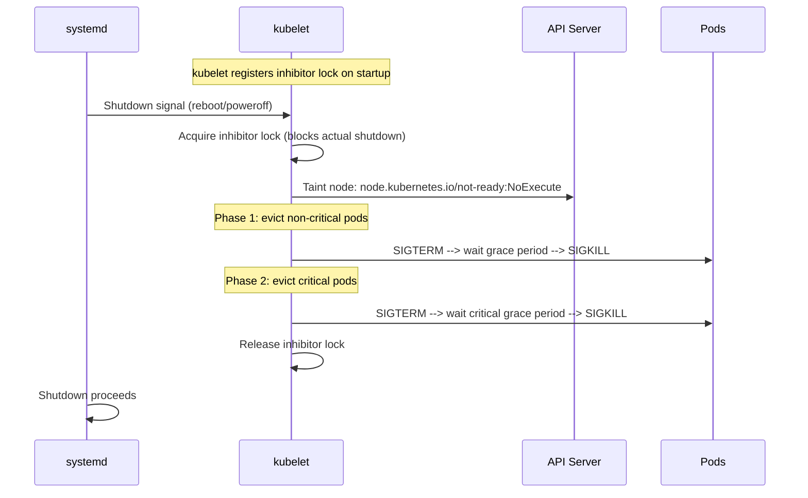
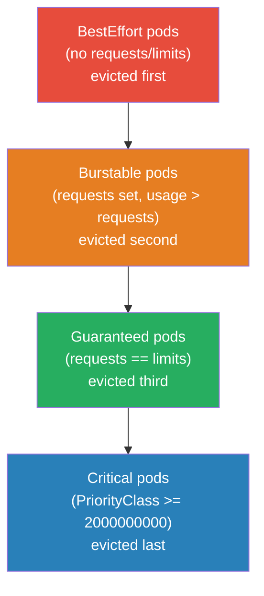
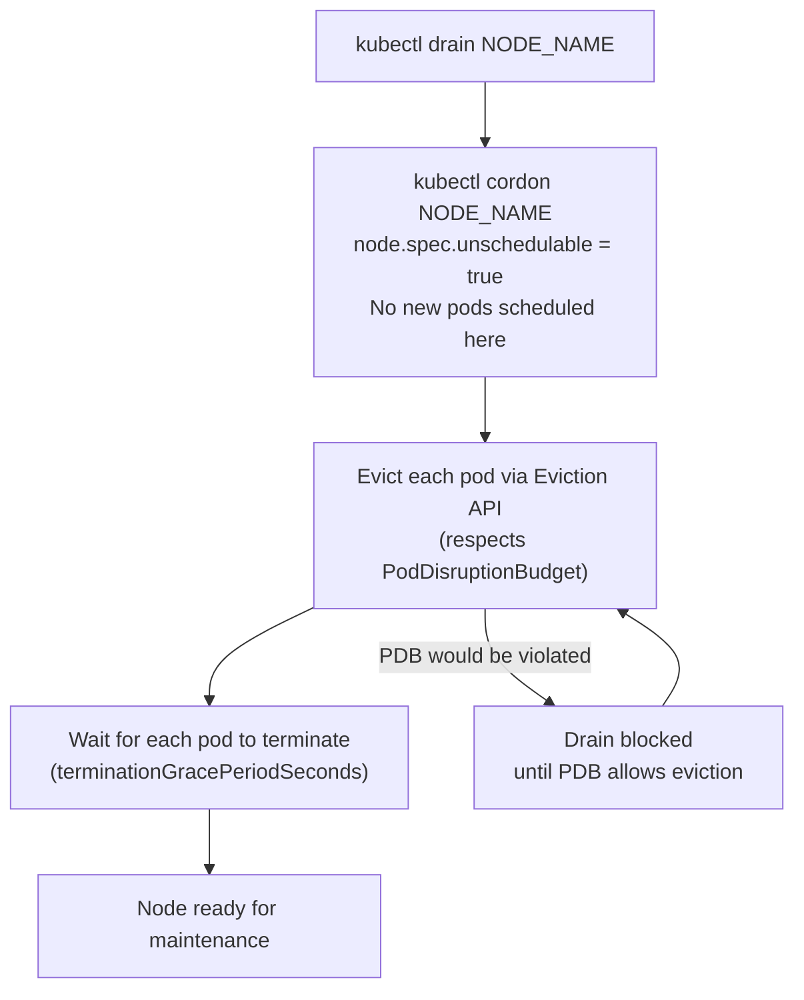
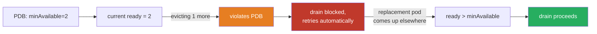

# Node Shutdown and Eviction

How Kubernetes tears a node down — gracefully via kubelet's own inhibitor lock, in a controlled fashion via `kubectl drain`, or the messy way when a node just disappears — and how pods get evicted, in what order, in each case.

<div class="quiz-progress" data-quiz-progress>
  <span class="quiz-progress-label">0/0 checks</span>
  <span class="quiz-progress-bar"><span class="quiz-progress-fill"></span></span>
</div>

---

## 1. Graceful Node Shutdown (kubelet-initiated)

When a node receives a shutdown signal (systemd `shutdown.target`), kubelet intercepts it via a **systemd inhibitor lock** and evicts pods before allowing the OS to proceed.



**kubelet configuration:**
```yaml
# /var/lib/kubelet/config.yaml
shutdownGracePeriod: 30s              # total time for all pods to terminate
shutdownGracePeriodCriticalPods: 10s  # of the above, reserved for critical pods
```

**Timeline with defaults:**
```
t=0s:  Shutdown signal received
t=0s:  kubelet acquires inhibitor, begins eviction
t=0s:  Non-critical pods get SIGTERM (20s window = 30s - 10s)
t=20s: Non-critical pods get SIGKILL (if still running)
t=20s: Critical pods get SIGTERM (10s window)
t=30s: Critical pods get SIGKILL
t=30s: Inhibitor released, OS shuts down
```

Step through the same sequence one phase at a time:

<div class="stepper">
  <div class="stepper-panels">
    <div class="stepper-panel active">
      <strong>1. Shutdown signal received (t=0s).</strong> systemd fires <code>shutdown.target</code>. kubelet, which registered a systemd inhibitor lock on startup, intercepts it immediately &mdash; that lock blocks the actual OS shutdown from proceeding until kubelet releases it.
    </div>
    <div class="stepper-panel">
      <strong>2. Node tainted (t=0s).</strong> kubelet taints the node <code>node.kubernetes.io/not-ready:NoExecute</code> and starts evicting pods itself, in priority order.
    </div>
    <div class="stepper-panel">
      <strong>3. Phase 1 &mdash; non-critical pods (t=0s &rarr; t=20s).</strong> SIGTERM goes out to every non-critical pod, then SIGKILL to anything still running. This phase gets whatever's left after critical pods are carved out: <code>shutdownGracePeriod - shutdownGracePeriodCriticalPods</code> &mdash; 20s with the defaults above.
    </div>
    <div class="stepper-panel">
      <strong>4. Phase 2 &mdash; critical pods (t=20s &rarr; t=30s).</strong> Same SIGTERM &rarr; wait &rarr; SIGKILL pattern, but now only for critical pods (PriorityClass &ge; 2000000000), and only within the reserved <code>shutdownGracePeriodCriticalPods</code> window &mdash; 10s.
    </div>
    <div class="stepper-panel">
      <strong>5. Inhibitor released, shutdown proceeds (t=30s).</strong> Only once both phases finish &mdash; or the total grace period runs out, whichever comes first &mdash; does kubelet release the inhibitor lock and let systemd continue the actual shutdown.
    </div>
  </div>
  <div class="stepper-controls">
    <button class="stepper-prev">← Prev</button>
    <span class="stepper-dots"></span>
    <span class="stepper-label"></span>
    <button class="stepper-next">Next →</button>
  </div>
</div>

```bash
# Check kubelet config for shutdown settings
ssh <node>
cat /var/lib/kubelet/config.yaml | grep -i shutdown

# Verify inhibitor lock is registered
systemd-inhibit --list | grep kubelet

# Watch eviction events during shutdown
kubectl get events --field-selector reason=Evicted -A -w
```

<div class="quiz-card">
  <p class="quiz-q">With <code>shutdownGracePeriod: 30s</code> and <code>shutdownGracePeriodCriticalPods: 10s</code>, is the 10s given to critical pods in addition to the 30s, or part of it?</p>
  <button class="quiz-reveal">Reveal answer</button>
  <div class="quiz-a" hidden>Part of it. <code>shutdownGracePeriodCriticalPods</code> is carved out of the total <code>shutdownGracePeriod</code>, not added on top &mdash; with these defaults, non-critical pods get the first 20s (t=0s&ndash;t=20s) and critical pods get the remaining 10s (t=20s&ndash;t=30s), for 30s total, not 40s.</div>
</div>

---

## 2. Pod Eviction Ordering

During node shutdown (and kubelet-initiated eviction), pods are evicted in priority order:



**PriorityClass determines "critical":**

| PriorityClass | Value | Examples |
|---------------|-------|---------|
| `system-node-critical` | 2000001000 | kubelet, kube-proxy, CNI |
| `system-cluster-critical` | 2000000000 | CoreDNS, metrics-server |
| (user pods) | < 1000000000 | Your workloads |

```yaml
# Protect your pod from early eviction
apiVersion: scheduling.k8s.io/v1
kind: PriorityClass
metadata:
  name: high-priority
value: 1000000
globalDefault: false
---
spec:
  priorityClassName: high-priority
```

<div class="quiz-card">
  <p class="quiz-q">Does giving a pod requests equal to its limits (QoS class Guaranteed) protect it from eviction as well as giving it a PriorityClass &ge; 2000000000 would?</p>
  <button class="quiz-reveal">Reveal answer</button>
  <div class="quiz-a" hidden>No. The eviction order is BestEffort, then Burstable, then Guaranteed, then Critical (PriorityClass &ge; 2000000000) last &mdash; QoS class and PriorityClass are separate axes. A Guaranteed pod is still evicted before any Critical pod; only a sufficiently high PriorityClass lands it in the last-evicted tier.</div>
</div>

---

## 3. Node Drain (Voluntary Eviction)

`kubectl drain` is the controlled, human-initiated version of node shutdown. Used for maintenance, node upgrades, and cluster autoscaler scale-down.



Step through it:

<div class="stepper">
  <div class="stepper-panels">
    <div class="stepper-panel active">
      <strong>1. <code>kubectl drain &lt;node&gt;</code> invoked.</strong> Human- or automation-initiated &mdash; same eviction machinery as a graceful node shutdown, but controlled, and PDB-aware.
    </div>
    <div class="stepper-panel">
      <strong>2. Node cordoned.</strong> <code>kubectl cordon</code> sets <code>node.spec.unschedulable = true</code> first. No new pods land here, but nothing already running is touched yet.
    </div>
    <div class="stepper-panel">
      <strong>3. Pods evicted via the Eviction API.</strong> Each evictable pod gets an eviction request &mdash; not a raw delete &mdash; which explicitly checks any PodDisruptionBudget covering it.
    </div>
    <div class="stepper-panel">
      <strong>4. PDB check: proceed or block.</strong> If evicting this pod would drop its PDB below <code>minAvailable</code>, the request is refused, not queued. Drain keeps retrying automatically until the PDB allows it.
    </div>
    <div class="stepper-panel">
      <strong>5. Wait for termination.</strong> Each evicted pod gets its normal <code>terminationGracePeriodSeconds</code> (or the drain's <code>--grace-period</code> override) to shut down.
    </div>
    <div class="stepper-panel">
      <strong>6. Node ready for maintenance.</strong> Once every evictable pod is gone, drain returns. <code>kubectl uncordon</code> is what makes the node schedulable again afterward &mdash; drain itself never does that automatically.
    </div>
  </div>
  <div class="stepper-controls">
    <button class="stepper-prev">← Prev</button>
    <span class="stepper-dots"></span>
    <span class="stepper-label"></span>
    <button class="stepper-next">Next →</button>
  </div>
</div>

```bash
# Full drain command
kubectl drain <node-name> \
  --ignore-daemonsets \        # DaemonSet pods can't be evicted (managed by DS controller)
  --delete-emptydir-data \     # evict pods using emptyDir (data will be lost)
  --timeout=5m \               # fail if drain takes longer than 5 min
  --grace-period=30            # override pod terminationGracePeriodSeconds

# Uncordon after maintenance
kubectl uncordon <node-name>

# Check what's blocking drain
kubectl get pdb -A             # list PodDisruptionBudgets
kubectl describe pdb <name>    # check minAvailable vs current ready pods
```

**Why drain blocks:**



<div class="quiz-card">
  <p class="quiz-q">A PDB has minAvailable=2 and there are exactly 2 ready replicas. What happens when kubectl drain tries to evict one of them?</p>
  <button class="quiz-reveal">Reveal answer</button>
  <div class="quiz-a" hidden>The eviction is refused, not queued &mdash; drain blocks and keeps retrying automatically until a replacement pod comes up elsewhere and there are enough ready replicas that evicting one wouldn't violate the PDB.</div>
</div>

---

## 4. Non-Graceful Node Shutdown

If a node dies abruptly (power cut, kernel panic, `kill -9 kubelet`), the node object stays in the cluster but kubelet is gone. Pods on that node stay in `Terminating` forever — the API server is waiting for kubelet to confirm deletion, which never comes.

```bash
# Pods stuck Terminating on dead node
kubectl get pods --field-selector spec.nodeName=<dead-node>

# Old manual fix (still works)
kubectl delete pod <pod> --grace-period=0 --force

# Better: delete the node object
kubectl delete node <dead-node>
# → node lifecycle controller adds not-ready/unreachable taint
# → pods get evicted after tolerationSeconds
```

**Kubernetes 1.28+ — out-of-service taint (GA):**
```bash
# Manually taint the dead node
kubectl taint node <dead-node> \
  node.kubernetes.io/out-of-service=nodeshutdown:NoExecute

# Effect: StatefulSet pods and pods with PVCs are immediately force-deleted
# and rescheduled on healthy nodes — even without kubelet confirmation
# This was the #1 StatefulSet recovery pain point before this feature
```

Same underlying goal &mdash; get pods off a node that's going away &mdash; but graceful and non-graceful shutdown look nothing alike from the API server's point of view:

<div class="toggle-switch">
  <div class="toggle-buttons">
    <button data-toggle-opt="graceful" class="active state-ok">Graceful</button>
    <button data-toggle-opt="nongraceful" class="state-bad">Non-graceful</button>
  </div>
  <div class="toggle-panel active" data-toggle-panel="graceful">
    <strong>kubelet is alive and in control.</strong> It intercepts the shutdown via its systemd inhibitor lock, evicts pods itself in priority order (non-critical, then critical) within a bounded grace period, then releases the lock. The API server sees clean, confirmed pod terminations the entire way through &mdash; nothing is ever stuck.
  </div>
  <div class="toggle-panel" data-toggle-panel="nongraceful">
    <strong>kubelet is gone before it can do anything.</strong> No inhibitor lock, no orderly SIGTERM/SIGKILL phases &mdash; the node just disappears. Pods are stuck <code>Terminating</code> because the API server is waiting on a kubelet confirmation that will never arrive. Recovery needs a human or automation to step in: delete the node object, or apply the <code>out-of-service</code> taint, before anything gets rescheduled.
  </div>
</div>

<div class="quiz-card">
  <p class="quiz-q">A node dies from a kernel panic. Why do its pods show <code>Terminating</code> forever instead of being cleaned up automatically?</p>
  <button class="quiz-reveal">Reveal answer</button>
  <div class="quiz-a" hidden>Because kubelet &mdash; the process that would normally confirm pod deletion back to the API server &mdash; is gone. The API server marked the pods for deletion but is still waiting on that confirmation, which never comes until something intervenes manually: deleting the node object, or applying the <code>out-of-service</code> taint.</div>
</div>

---

## 5. Node Lifecycle Taints

The node lifecycle controller automatically adds taints when conditions change. These taints trigger pod eviction via `tolerationSeconds`.

| Condition | Taint key | Auto-tolerationSeconds on pods |
|-----------|-----------|-------------------------------|
| `NotReady` | `node.kubernetes.io/not-ready` | 300s (default) |
| `Unreachable` | `node.kubernetes.io/unreachable` | 300s (default) |
| `MemoryPressure` | `node.kubernetes.io/memory-pressure` | — |
| `DiskPressure` | `node.kubernetes.io/disk-pressure` | — |
| `PIDPressure` | `node.kubernetes.io/pid-pressure` | — |
| `NetworkUnavailable` | `node.kubernetes.io/network-unavailable` | — |

**tolerationSeconds** controls how long a pod tolerates a taint before eviction:

```yaml
# Default toleration on all pods (injected by admission controller):
tolerations:
- key: node.kubernetes.io/not-ready
  operator: Exists
  effect: NoExecute
  tolerationSeconds: 300   # stay on not-ready node for 5 min before evicted

# For fast failover (stateless services):
tolerations:
- key: node.kubernetes.io/not-ready
  operator: Exists
  effect: NoExecute
  tolerationSeconds: 30    # evict in 30s

# For sticky workloads (StatefulSets, cache):
tolerations:
- key: node.kubernetes.io/not-ready
  operator: Exists
  effect: NoExecute
  tolerationSeconds: 600   # give node 10 min to recover before moving pod
```

```bash
# Check node conditions and taints
kubectl describe node <node> | grep -A10 Taints
kubectl describe node <node> | grep -A20 Conditions

# Watch node status changes
kubectl get nodes -w

# See eviction events
kubectl get events -A --field-selector reason=Evicted
kubectl get events -A | grep "Evicting\|Evicted\|Killing"
```

<div class="quiz-card">
  <p class="quiz-q">Of NotReady, Unreachable, MemoryPressure, DiskPressure, PIDPressure, and NetworkUnavailable, which conditions get an automatic tolerationSeconds timer that evicts pods on a delay?</p>
  <button class="quiz-reveal">Reveal answer</button>
  <div class="quiz-a" hidden>Only NotReady and Unreachable &mdash; the admission controller injects a default 300s (5 min) tolerationSeconds for those. MemoryPressure, DiskPressure, PIDPressure, and NetworkUnavailable have no default toleration timer, so the taint alone doesn't automatically evict pods after some delay.</div>
</div>

---

## 6. Kubelet Eviction Thresholds

kubelet watches node resources and evicts pods before the node itself runs out.

```yaml
# kubelet config: /var/lib/kubelet/config.yaml
evictionHard:
  memory.available: "200Mi"     # evict when < 200Mi free
  nodefs.available: "10%"       # evict when < 10% disk
  nodefs.inodesFree: "5%"       # evict when < 5% inodes
  imagefs.available: "15%"      # evict when < 15% image filesystem

evictionSoft:
  memory.available: "500Mi"     # warn when < 500Mi
evictionSoftGracePeriod:
  memory.available: "1m30s"     # only evict if soft threshold exceeded for 90s

evictionMinimumReclaim:
  memory.available: "100Mi"     # reclaim at least 100Mi per eviction round
```

**Eviction order within a QoS class:** pods using the most resources above their requests are evicted first.

<div class="quiz-card">
  <p class="quiz-q">A node's memory.available drops to 480Mi, breaching the evictionSoft threshold of 500Mi for a moment before recovering at 60s. Does kubelet evict a pod?</p>
  <button class="quiz-reveal">Reveal answer</button>
  <div class="quiz-a" hidden>No. evictionSoft only evicts once the threshold has been breached continuously for the full evictionSoftGracePeriod &mdash; 90s here &mdash; so a breach that clears at 60s never triggers eviction. evictionHard has no such grace period: it evicts immediately on breach.</div>
</div>
