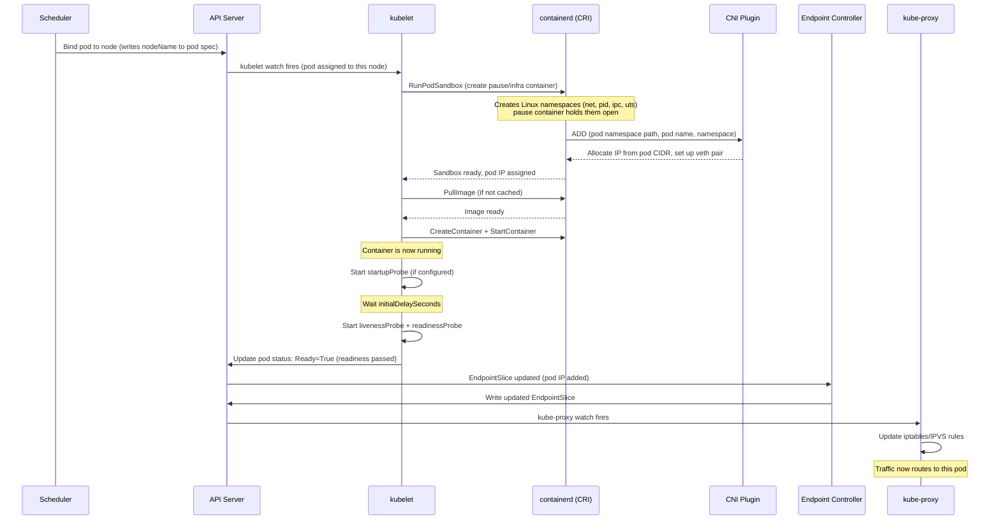
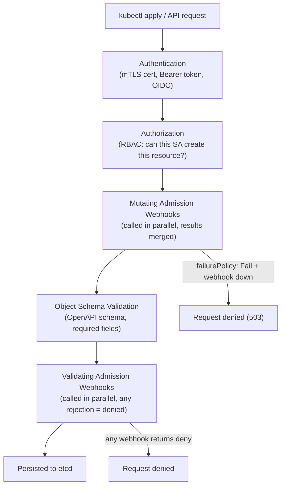
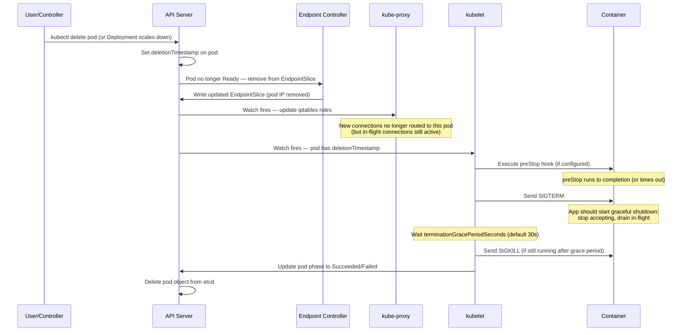
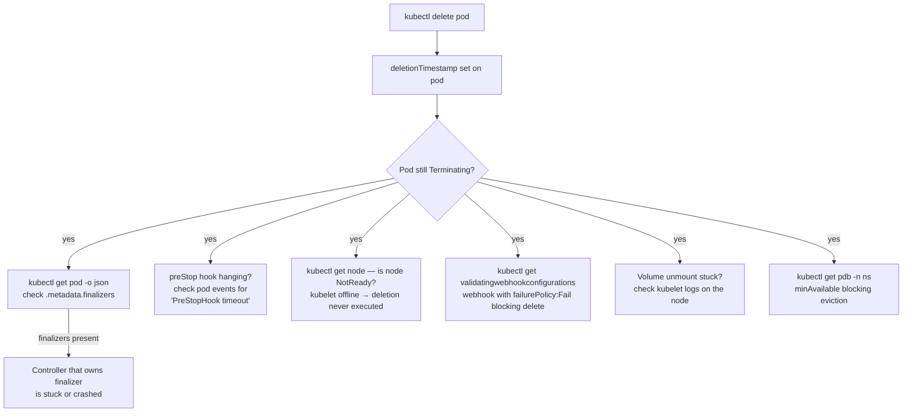

# Pod Lifecycle Internals

---

## 1. Pod Startup Sequence

From scheduler decision to traffic flowing — every step with the responsible component.



### Key details at each step

**pause container (sandbox):**
- Also called the "infra container"
- Its only job: hold the network/pid/ipc namespaces open
- All app containers in the pod **join** its namespaces
- If pause dies, the entire pod is restarted — you lose all namespace state

**CNI call:**
- kubelet calls CNI binary with pod's netns path
- CNI creates a `veth` pair: one end in pod netns (`eth0`), one on host (`vethXXXX`)
- CNI assigns the pod IP to `eth0`
- CNI adds a route on the host for this pod IP → the veth

**Image pull:**
- Happens **after** sandbox creation — pod has its IP before image is pulled
- `imagePullPolicy: Always` → always calls registry (uses cached layer if digest matches)
- `imagePullPolicy: IfNotPresent` → skips pull if image tag is already on node

**Probe ordering:**
```
startupProbe fires first
  ↓ passes (or not configured)
livenessProbe + readinessProbe start in parallel
  ↓ readiness passes
Pod added to Endpoints / traffic flows
```

**The iptables update race:**
- Endpoint controller removes pod from EndpointSlice before SIGTERM is sent during deletion
- But kube-proxy may not have updated rules yet → in-flight requests get `connection refused`
- Fix: `preStop: exec: sleep 5` — delays SIGTERM by 5s, giving kube-proxy time to drain

---

## 2. Admission Controller Chain

Every `kubectl apply` / API call goes through this pipeline before touching etcd:



**Mutating webhooks run first, before validation.** This allows them to inject fields (sidecars, resource defaults, labels) that validators then check.

**Common mutations that happen automatically:**
- `LimitRanger` admission plugin: injects default CPU/memory requests from LimitRange
- Istio: injects `istio-proxy` sidecar container
- cert-manager: injects CA bundles into webhook configs
- AWS pod identity: mutates pods to mount projected service account tokens

**What happens when a webhook crashes:**

| `failurePolicy` | Webhook unreachable | Effect |
|----------------|--------------------|----|
| `Fail` (default) | Returns 503 | **All matching resource operations are blocked** until webhook is back |
| `Ignore` | Returns 503 | Request proceeds without mutation/validation |

```bash
# Check webhook configs
kubectl get mutatingwebhookconfigurations
kubectl get validatingwebhookconfigurations

# Find webhooks with failurePolicy: Fail (dangerous ones)
kubectl get mutatingwebhookconfigurations -o json | \
  jq '.items[] | select(.webhooks[].failurePolicy=="Fail") | .metadata.name'

# Bypass a broken webhook (emergency only)
kubectl delete mutatingwebhookconfiguration <name>
```

**Scoping webhooks with `namespaceSelector`** — best practice to prevent the webhook from blocking its own namespace:
```yaml
webhooks:
- name: my-webhook.example.com
  namespaceSelector:
    matchExpressions:
    - key: kubernetes.io/metadata.name
      operator: NotIn
      values: ["kube-system", "webhook-system"]  # don't intercept these namespaces
```

---

## 3. Server-Side Apply vs Client-Side Apply

### Client-Side Apply (classic `kubectl apply`)

```
kubectl apply -f deployment.yaml
```

1. kubectl reads the local file
2. Gets the live object from API server
3. Gets the last-applied-configuration annotation (stored on the object)
4. 3-way merge: local + last-applied + live
5. Sends a PATCH to the API server

**Problem:** any field not in your YAML is preserved from the live object. If another tool added a field, kubectl doesn't know who owns it — it just merges silently.

```yaml
# The annotation kubectl manages:
metadata:
  annotations:
    kubectl.kubernetes.io/last-applied-configuration: '{"apiVersion":"apps/v1",...}'
```

### Server-Side Apply (`kubectl apply --server-side`)

```
kubectl apply --server-side -f deployment.yaml
```

1. kubectl sends the full object to the API server with a `fieldManager` label
2. API server tracks which field manager owns which fields
3. If two managers claim the same field → **explicit conflict error** (not silent overwrite)

```bash
# Apply with explicit field manager name
kubectl apply --server-side --field-manager=my-ci-pipeline -f deployment.yaml

# Check field ownership on a live object
kubectl get deployment myapp -o json | jq '.metadata.managedFields'
```

**Conflict example:**
```
error: Apply failed with 1 conflict:
- conflict with "helm" using apps/v1:
  .spec.replicas
```
This tells you Helm owns `spec.replicas`. Either:
```bash
# Take ownership (override Helm's value)
kubectl apply --server-side --force-conflicts -f deployment.yaml
# or
# Remove the field from your YAML and let Helm manage it
```

### When to use which

| | Client-Side | Server-Side |
|--|-------------|-------------|
| Default `kubectl apply` | ✅ | Use `--server-side` flag |
| GitOps (ArgoCD, Flux) | Often SSA by default in recent versions | ✅ Preferred |
| Helm | Still CSA | Opt-in with `--enable-server-side-apply` |
| Field ownership tracking | No | Yes |
| Handles large objects | Hits annotation size limit | No limit |

---

## 4. Pod Termination Sequence



**The race condition and the fix:**

The Endpoint controller removes the pod from EndpointSlice and kube-proxy updates iptables — but this takes 1–5 seconds. Meanwhile kubelet has already sent SIGTERM. The pod stops accepting new connections while kube-proxy still routes new connections to it → `connection reset`.

**Fix: preStop sleep:**
```yaml
lifecycle:
  preStop:
    exec:
      command: ["/bin/sh", "-c", "sleep 5"]
```
This delays SIGTERM by 5 seconds, giving kube-proxy time to drain the pod from iptables before the app stops accepting connections.

**terminationGracePeriodSeconds should be >= preStop duration + actual drain time:**
```yaml
spec:
  terminationGracePeriodSeconds: 60  # preStop(5s) + drain(~20s) + buffer
  containers:
  - lifecycle:
      preStop:
        exec:
          command: ["/bin/sh", "-c", "sleep 5"]
```

---

## 5. Why a Pod Won't Die — Complete Troubleshooting Guide

`kubectl delete pod` sets `deletionTimestamp` on the pod object. The kubelet then orchestrates shutdown. If the pod stays in `Terminating` indefinitely, one of these is the cause.

### Diagnostic flow



### 1. Finalizers blocking deletion

A finalizer is a string in `metadata.finalizers`. Kubernetes won't remove the object from etcd until every finalizer is cleared by its owning controller.

```bash
# Check for finalizers
kubectl get pod <name> -n <ns> -o json | jq '.metadata.finalizers'

# Common finalizers:
# "kubernetes.io/pvc-protection"      — storage controller
# "foregroundDeletion"                — cascade delete in progress
# "batch.kubernetes.io/job-tracking"  — job controller
# Custom controllers (ArgoCD, Istio) add their own

# Emergency removal — bypasses the controller's cleanup logic
kubectl patch pod <name> -n <ns> \
  -p '{"metadata":{"finalizers":[]}}' --type=merge
# Warning: only do this if the controller is confirmed dead/broken
# The finalizer exists to run cleanup code — skipping it may leak resources
```

### 2. PodDisruptionBudget blocking eviction

PDB only blocks *eviction* (node drain, rolling update), not `kubectl delete`. But it blocks the drain → the drain blocks the node upgrade → people see pods "stuck". Clarify: `kubectl delete` ignores PDB. `kubectl drain` respects it.

```bash
kubectl get pdb -n <ns>
# NAME           MIN AVAILABLE   MAX UNAVAILABLE   ALLOWED DISRUPTIONS   AGE
# payments-pdb   2               N/A               0                     5d
# ALLOWED DISRUPTIONS = 0 means drain will block

# See why PDB is blocking:
kubectl describe pdb payments-pdb -n <ns>
# "Cannot disrupt pod payments-xxx: would violate PodDisruptionBudget"

# Options:
# 1. Scale up the deployment first so minAvailable is met
# 2. Delete the PDB temporarily (risky)
# 3. Use --disable-eviction on kubectl drain (bypasses PDB entirely, use with care)
kubectl drain <node> --disable-eviction --ignore-daemonsets
```

### 3. PID 1 not forwarding signals — the silent killer

When a container's `CMD` uses shell form, the shell becomes PID 1. Shell does NOT forward signals to child processes by default. SIGTERM goes to the shell, the child never sees it, grace period expires, SIGKILL fires.

```bash
# Check what PID 1 is inside a running pod
kubectl exec <pod> -- ps -p 1
# If PID 1 is "sh" or "bash" → signal forwarding broken
```

```dockerfile
# BROKEN — shell form: /bin/sh -c "java -jar app.jar"
# sh is PID 1, java is a child. SIGTERM → sh → sh exits, java gets SIGKILL
CMD ["sh", "-c", "java -jar app.jar"]

# FIXED — exec form: java is PID 1 directly
CMD ["java", "-jar", "app.jar"]

# FIXED — use tini as a minimal init that forwards signals
FROM debian:bookworm-slim
RUN apt-get install -y tini
ENTRYPOINT ["/usr/bin/tini", "--"]
CMD ["java", "-jar", "app.jar"]
# tini: PID 1, reaps zombies, forwards signals to java

# FIXED — dumb-init alternative
ADD https://github.com/Yelp/dumb-init/releases/download/v1.2.5/dumb-init_1.2.5_x86_64 /usr/bin/dumb-init
RUN chmod +x /usr/bin/dumb-init
ENTRYPOINT ["/usr/bin/dumb-init", "--"]
CMD ["java", "-jar", "app.jar"]
```

**Shell script workaround (when you must use a shell wrapper):**
```bash
#!/bin/sh
# Pass signals to child — exec replaces the shell with the child
exec java -jar /app/app.jar
```

The `exec` call replaces the shell process with java — java becomes PID 1 and receives signals directly.

**Docker STOPSIGNAL:**
```dockerfile
# Override the signal sent on docker stop / kubectl delete
# Default is SIGTERM. Some apps (nginx) use SIGQUIT for graceful drain.
STOPSIGNAL SIGQUIT
```

### 4. Node partition / NotReady

If the node hosting the pod loses connectivity, the API server marks it `NotReady`. The kubelet is offline, so it cannot execute the deletion. Pod stays in `Terminating` until the node recovers or an operator intervenes.

```bash
kubectl get nodes  # node is NotReady

# Option 1: Wait for node recovery (kubelet reconnects and finishes deletion)

# Option 2: Force-delete the pod from etcd (object removed; kubelet may still
# be running the container on the partitioned node until it recovers)
kubectl delete pod <name> -n <ns> --grace-period=0 --force

# Option 3: Apply out-of-service taint — triggers non-graceful pod deletion
# across ALL pods on the node, correctly handles StatefulSet volumes
kubectl taint nodes <node-name> \
  node.kubernetes.io/out-of-service=nodeshutdown:NoExecute
# Remove taint after node is confirmed gone:
kubectl taint nodes <node-name> node.kubernetes.io/out-of-service-
```

`--force --grace-period=0` removes the pod object from etcd immediately. The container may still be running on the node if the kubelet is still alive (rescheduled StatefulSet pods with the same name could conflict with the old container until the node syncs). Use with care for stateful workloads.

### 5. Admission webhook blocking the delete

A validating webhook with `failurePolicy: Fail` intercepts the delete API call. If the webhook is down or returns a rejection, the delete is refused.

```bash
# List webhooks with Fail policy
kubectl get validatingwebhookconfigurations -o json | \
  jq '.items[] | select(.webhooks[].failurePolicy=="Fail") | .metadata.name'

# Check if webhook pods are running
kubectl get pods -n <webhook-namespace>

# Emergency: delete the webhook configuration (re-apply after fixing the webhook)
kubectl delete validatingwebhookconfiguration <name>
```

### 6. Volume unmount hanging

If a CSI or NFS volume is stuck unmounting (network storage timeout, buggy CSI driver), the kubelet hangs in the teardown phase and never completes pod deletion.

```bash
# Check kubelet logs on the affected node (via node-shell or DaemonSet log pod)
# or via EKS/CloudWatch if direct access unavailable
kubectl get events -n <ns> --sort-by='.lastTimestamp' | grep -i volume

# Force-unmount (dangerous) or restart kubelet (will try again)
# For CSI: check the CSI driver pod logs in kube-system
kubectl logs -n kube-system -l app=<csi-driver> --tail=100
```

### Quick reference: force delete vs graceful delete

| Method | What happens | When to use |
|---|---|---|
| `kubectl delete pod` | Sets deletionTimestamp, kubelet runs shutdown sequence | Normal operations |
| `kubectl delete pod --grace-period=0` | Sets deletionTimestamp with 0s grace; kubelet sends SIGKILL immediately | App is hung, grace period too long |
| `kubectl delete pod --grace-period=0 --force` | Removes from etcd immediately, bypasses kubelet | Node is offline, pod stuck in Terminating |
| `kubectl patch pod -p '{"metadata":{"finalizers":[]}}'` | Clears finalizers; object deleted after next sync | Finalizer controller dead |
| Out-of-service taint on node | Triggers non-graceful deletion of all pods on node | Node confirmed dead, need volumes freed |
