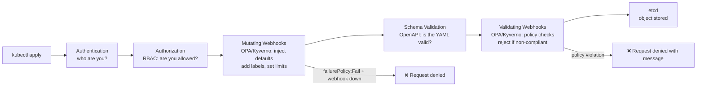
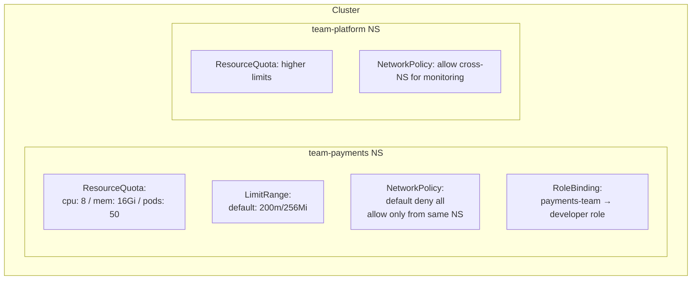

# Kubernetes Policy, Security, and Multi-Tenancy

Most sections below end with a quick knowledge check — try to answer before revealing.

<div class="quiz-progress" data-quiz-progress>
  <span class="quiz-progress-label">0/0 checks</span>
  <span class="quiz-progress-bar"><span class="quiz-progress-fill"></span></span>
</div>

---

## Admission Controllers — The Policy Enforcement Gate

Every `kubectl apply` request passes through the API server pipeline. Admission controllers are the last gate before the object is written to etcd.



Two tools dominate: **OPA/Gatekeeper** (declarative Rego policies) and **Kyverno** (K8s-native YAML policies). Both work as ValidatingWebhookConfiguration + MutatingWebhookConfiguration.

The order matters — mutation happens before validation, not after. Step through what a single `kubectl apply` goes through:

<div class="stepper">
  <div class="stepper-panels">
    <div class="stepper-panel active">
      <strong>1. Authentication.</strong> The API server figures out who's calling — a user's client cert, a service account token, an OIDC identity. If this fails, the request is rejected before anything else even runs.
    </div>
    <div class="stepper-panel">
      <strong>2. Authorization (RBAC).</strong> Now that the API server knows who you are, it checks whether you're allowed to do this specific verb on this specific resource. No policy engine involved yet — this is pure RBAC.
    </div>
    <div class="stepper-panel">
      <strong>3. Mutating webhooks.</strong> OPA/Kyverno get the object first, before it's validated, and can inject defaults, add labels, or set resource limits. Anything they add or change is what gets validated next — this is why mutation runs before validation, not after.
    </div>
    <div class="stepper-panel">
      <strong>4. Schema validation.</strong> The API server checks the (possibly now-mutated) object against the OpenAPI schema for its kind. Malformed YAML dies here, independent of any policy engine.
    </div>
    <div class="stepper-panel">
      <strong>5. Validating webhooks.</strong> OPA/Kyverno get the final, mutated, schema-valid object and decide pass/fail. A rejection here comes back to the caller with a policy-specific error message.
    </div>
    <div class="stepper-panel">
      <strong>6. Persisted to etcd.</strong> Only an object that survived every prior gate gets written. A webhook that's down with <code>failurePolicy: Fail</code> denies the request outright rather than letting it through unchecked.
    </div>
  </div>
  <div class="stepper-controls">
    <button class="stepper-prev">← Prev</button>
    <span class="stepper-dots"></span>
    <span class="stepper-label"></span>
    <button class="stepper-next">Next →</button>
  </div>
</div>

<div class="quiz-card">
  <p class="quiz-q">Why do mutating webhooks run before validating webhooks, instead of after?</p>
  <button class="quiz-reveal">Reveal answer</button>
  <div class="quiz-a" hidden>So that whatever the mutating webhooks inject or change — default labels, resource limits, sidecars — is itself subject to the validating webhooks' checks. If validation ran first, a mutation could introduce something non-compliant after the object had already been approved, and policy checks on injected fields would never happen at all.</div>
</div>

---

## OPA Gatekeeper

OPA (Open Policy Agent) + Gatekeeper implements K8s policy as code using the Rego language.

### Install

```bash
kubectl apply -f https://raw.githubusercontent.com/open-policy-agent/gatekeeper/release-3.14/deploy/gatekeeper.yaml
```

### ConstraintTemplate — defines a policy type

```yaml
# Define a new policy type: "must have required labels"
apiVersion: templates.gatekeeper.sh/v1
kind: ConstraintTemplate
metadata:
  name: requirelabels
spec:
  crd:
    spec:
      names:
        kind: RequireLabels
      validation:
        openAPIV3Schema:
          type: object
          properties:
            labels:
              type: array
              items:
                type: string

  targets:
  - target: admission.k8s.gatekeeper.sh
    rego: |
      package requirelabels

      violation[{"msg": msg}] {
        provided := {label | input.review.object.metadata.labels[label]}
        required := {label | label := input.parameters.labels[_]}
        missing := required - provided
        count(missing) > 0
        msg := sprintf("Missing required labels: %v", [missing])
      }
```

### Constraint — applies the policy to resources

```yaml
# Enforce that all Pods have "app" and "team" labels
apiVersion: constraints.gatekeeper.sh/v1beta1
kind: RequireLabels
metadata:
  name: require-pod-labels
spec:
  match:
    kinds:
    - apiGroups: [""]
      kinds: ["Pod"]
    namespaces: ["production", "staging"]   # only enforce in these namespaces
  parameters:
    labels: ["app", "team"]
```

```bash
# Test: create a pod without labels → should be denied
kubectl run nginx --image=nginx -n production
# Error: [require-pod-labels] Missing required labels: {"app", "team"}

# Audit: find existing violations
kubectl get requirelabels.constraints.gatekeeper.sh -o yaml
# status.violations lists all existing objects that violate
```

<div class="quiz-card">
  <p class="quiz-q">What's the actual difference between a ConstraintTemplate and a Constraint?</p>
  <button class="quiz-reveal">Reveal answer</button>
  <div class="quiz-a" hidden>A ConstraintTemplate defines a reusable policy <em>type</em> — its Rego logic and the schema for its parameters — but enforces nothing by itself. A Constraint is an instance of that type: it picks which kinds/namespaces to apply it to and supplies concrete parameter values. One template ("require these labels") can back many constraints, each targeting different resources with different required labels.</div>
</div>

---

## Kyverno — K8s-Native Policies (No Rego)

Kyverno uses pure YAML — no new language to learn. Policies are Kubernetes resources.

### Install

```bash
helm install kyverno kyverno/kyverno -n kyverno --create-namespace
```

### Validate — reject non-compliant resources

```yaml
apiVersion: kyverno.io/v1
kind: ClusterPolicy
metadata:
  name: require-labels
spec:
  validationFailureAction: Enforce   # Enforce=block, Audit=warn only
  rules:
  - name: check-team-label
    match:
      any:
      - resources:
          kinds: ["Pod"]
          namespaces: ["production"]
    validate:
      message: "Pod must have 'team' label"
      pattern:
        metadata:
          labels:
            team: "?*"   # must exist and be non-empty
```

### Mutate — auto-inject fields

```yaml
apiVersion: kyverno.io/v1
kind: ClusterPolicy
metadata:
  name: add-default-labels
spec:
  rules:
  - name: inject-team-label
    match:
      any:
      - resources:
          kinds: ["Pod"]
    mutate:
      patchStrategicMerge:
        metadata:
          labels:
            +(managed-by): kyverno   # + prefix = only add if missing
```

### Generate — create resources automatically

```yaml
# Auto-create a NetworkPolicy when a new Namespace is created
apiVersion: kyverno.io/v1
kind: ClusterPolicy
metadata:
  name: default-deny-networkpolicy
spec:
  rules:
  - name: default-deny
    match:
      any:
      - resources:
          kinds: ["Namespace"]
    generate:
      apiVersion: networking.k8s.io/v1
      kind: NetworkPolicy
      name: default-deny-all
      namespace: "{{request.object.metadata.name}}"
      data:
        spec:
          podSelector: {}
          policyTypes: ["Ingress", "Egress"]
```

Three rule types, one policy engine — flip between them to see what each one actually does to an object:

<div class="tab-group">
  <div class="tab-buttons">
    <button data-tab="kv-validate" class="active">validate</button>
    <button data-tab="kv-mutate">mutate</button>
    <button data-tab="kv-generate">generate</button>
  </div>
  <div class="tab-panels">
    <div class="tab-panel active" data-tab-panel="kv-validate">
      <strong>Accepts or rejects.</strong> Checks the incoming object against a pattern; a mismatch either blocks the request (<code>validationFailureAction: Enforce</code>) or just logs a warning (<code>Audit</code>). Never changes the object itself.
    </div>
    <div class="tab-panel" data-tab-panel="kv-mutate">
      <strong>Rewrites the object in flight.</strong> Runs as part of the mutating webhook phase, before validation. A <code>+</code> prefix on a field (like <code>+(managed-by)</code>) means "add only if missing" &mdash; it won't clobber a value someone already set.
    </div>
    <div class="tab-panel" data-tab-panel="kv-generate">
      <strong>Creates a separate, related resource.</strong> Triggered by some other object's lifecycle event (here, a Namespace being created) rather than by the object it's validating or mutating. The generated resource isn't the request being admitted &mdash; it's a side effect of it.
    </div>
  </div>
</div>

<div class="quiz-card">
  <p class="quiz-q">A Kyverno mutate rule uses <code>+(managed-by): kyverno</code> on a Pod that already has a <code>managed-by: helm</code> label. What happens to the label?</p>
  <button class="quiz-reveal">Reveal answer</button>
  <div class="quiz-a" hidden>It stays <code>managed-by: helm</code>. The <code>+</code> prefix means "add this field only if it's missing" &mdash; it never overwrites an existing value. Without the <code>+</code>, the mutate rule would unconditionally overwrite the label on every matching object.</div>
</div>

### OPA/Gatekeeper vs Kyverno

| | OPA/Gatekeeper | Kyverno |
|--|---------------|---------|
| Policy language | Rego (new language to learn) | YAML (K8s-native) |
| Mutate support | Limited | Full |
| Generate support | No | Yes |
| Learning curve | High | Low |
| Ecosystem | Large (OPA used beyond K8s) | K8s-only |
| Best for | Complex policies, non-K8s too | K8s-only teams, quick adoption |

---

## Multi-Tenancy — Namespace Isolation

K8s multi-tenancy means multiple teams share one cluster safely. Each team gets namespaces with enforced isolation.



### ResourceQuota per namespace

```yaml
apiVersion: v1
kind: ResourceQuota
metadata:
  name: payments-quota
  namespace: team-payments
spec:
  hard:
    requests.cpu: "8"
    requests.memory: 16Gi
    limits.cpu: "16"
    limits.memory: 32Gi
    pods: "50"
    services: "10"
    persistentvolumeclaims: "5"
    count/deployments.apps: "20"
```

### LimitRange — defaults for pods without requests

```yaml
apiVersion: v1
kind: LimitRange
metadata:
  name: default-limits
  namespace: team-payments
spec:
  limits:
  - type: Container
    default:          # applied if no limits set
      cpu: "500m"
      memory: "256Mi"
    defaultRequest:   # applied if no requests set
      cpu: "100m"
      memory: "128Mi"
    max:              # hard ceiling per container
      cpu: "4"
      memory: "4Gi"
```

### Network isolation per team

```yaml
# Default deny all — add to every namespace
apiVersion: networking.k8s.io/v1
kind: NetworkPolicy
metadata:
  name: default-deny-all
  namespace: team-payments
spec:
  podSelector: {}
  policyTypes: ["Ingress", "Egress"]
---
# Allow intra-namespace traffic
apiVersion: networking.k8s.io/v1
kind: NetworkPolicy
metadata:
  name: allow-same-namespace
  namespace: team-payments
spec:
  podSelector: {}
  ingress:
  - from:
    - podSelector: {}    # any pod in THIS namespace
  egress:
  - to:
    - podSelector: {}
---
# Allow egress to DNS (CoreDNS in kube-system)
apiVersion: networking.k8s.io/v1
kind: NetworkPolicy
metadata:
  name: allow-dns
  namespace: team-payments
spec:
  podSelector: {}
  egress:
  - to:
    - namespaceSelector:
        matchLabels:
          kubernetes.io/metadata.name: kube-system
    ports:
    - port: 53
      protocol: UDP
```

<div class="quiz-card">
  <p class="quiz-q">A namespace has both a <code>default-deny-all</code> NetworkPolicy and an <code>allow-same-namespace</code> NetworkPolicy targeting the same pods. Does the allow policy cancel out the deny policy, or do they combine?</p>
  <button class="quiz-reveal">Reveal answer</button>
  <div class="quiz-a" hidden>They combine — NetworkPolicies are additive, never exclusive. Traffic to/from a pod is allowed if it matches <em>any</em> applicable policy's rules. <code>default-deny-all</code> alone blocks everything because it specifies no allow rules; <code>allow-same-namespace</code> then adds back one specific exception on top of that baseline. Neither policy overrides or replaces the other.</div>
</div>

---

## Pod Security — PSA, seccomp, AppArmor

### Pod Security Admission (PSA) — built-in since K8s 1.25

Replaces the deprecated PodSecurityPolicy. Three levels applied at namespace level.

```yaml
# Label a namespace to enforce Pod Security Standards
apiVersion: v1
kind: Namespace
metadata:
  name: team-payments
  labels:
    pod-security.kubernetes.io/enforce: restricted    # block violations
    pod-security.kubernetes.io/warn: restricted       # warn on violations
    pod-security.kubernetes.io/audit: restricted      # log violations
```

| Level | What it blocks |
|-------|---------------|
| `privileged` | Nothing — all pods allowed |
| `baseline` | Most known privesc: privileged, hostPID, hostNetwork, hostPath |
| `restricted` | Everything in baseline + must run as non-root, no host ports, seccomp required |

Each level is a strict superset of the one below it — flip through what actually changes:

<div class="toggle-switch">
  <div class="toggle-buttons">
    <button data-toggle-opt="privileged" class="active state-bad">privileged</button>
    <button data-toggle-opt="baseline" class="state-warn">baseline</button>
    <button data-toggle-opt="restricted" class="state-ok">restricted</button>
  </div>
  <div class="toggle-panel active" data-toggle-panel="privileged">
    <strong>Wide open.</strong> No restrictions at all — privileged containers, host namespaces, hostPath mounts, anything. This is the PSA equivalent of not having Pod Security enabled. Use it only for namespaces that genuinely need unrestricted host access (a CNI or CSI driver's namespace, for example), never for application workloads.
  </div>
  <div class="toggle-panel" data-toggle-panel="baseline">
    <strong>Blocks known privilege-escalation paths.</strong> No privileged containers, no <code>hostPID</code>/<code>hostIPC</code>/<code>hostNetwork</code>, no <code>hostPath</code> volumes, capabilities restricted to a safe default set. It does <em>not</em> require running as non-root and does not require a seccomp profile &mdash; a baseline-compliant pod can still run as root.
  </div>
  <div class="toggle-panel" data-toggle-panel="restricted">
    <strong>Hardened, current best practice.</strong> Everything baseline blocks, plus: must run as non-root (<code>runAsNonRoot: true</code>), no host ports, <code>allowPrivilegeEscalation: false</code>, and a seccomp profile is required (<code>RuntimeDefault</code> or <code>Localhost</code>). This is the level that pairs with the seccomp config below.
  </div>
</div>

<div class="quiz-card">
  <p class="quiz-q">A namespace enforces the <code>baseline</code> Pod Security Standard. Can a pod in it still run as root?</p>
  <button class="quiz-reveal">Reveal answer</button>
  <div class="quiz-a" hidden>Yes. <code>baseline</code> blocks the well-known privilege-escalation vectors &mdash; privileged mode, host namespaces, hostPath volumes &mdash; but it does not require <code>runAsNonRoot</code> and does not require a seccomp profile. Only <code>restricted</code> forces non-root execution and a seccomp profile. Treating "baseline" as "safe" is the easy mistake &mdash; it's a floor against known bad patterns, not a hardened posture.</div>
</div>

### seccomp — restrict syscalls

```yaml
spec:
  securityContext:
    seccompProfile:
      type: RuntimeDefault   # use container runtime's default profile
      # or: type: Localhost, localhostProfile: profiles/my-profile.json
  containers:
  - name: app
    securityContext:
      allowPrivilegeEscalation: false
      runAsNonRoot: true
      runAsUser: 65534
      readOnlyRootFilesystem: true
      capabilities:
        drop: ["ALL"]    # drop ALL Linux capabilities
        add: ["NET_BIND_SERVICE"]  # add back only what's needed
```

### AppArmor — restrict file/network access

```yaml
# Apply AppArmor profile to a container
metadata:
  annotations:
    container.apparmor.security.beta.kubernetes.io/app: localhost/my-profile
    # or: runtime/default  (use container runtime's default)
    # or: unconfined       (no AppArmor — avoid in production)
```

---

## Full Security Checklist per Namespace

```bash
# 1. Apply PSA restricted label
kubectl label namespace team-payments \
  pod-security.kubernetes.io/enforce=restricted

# 2. Create ResourceQuota
kubectl apply -f quota.yaml -n team-payments

# 3. Create LimitRange (so pods without requests get defaults)
kubectl apply -f limitrange.yaml -n team-payments

# 4. Create default NetworkPolicies (deny-all + allow-same-ns + allow-dns)
kubectl apply -f network-policies.yaml -n team-payments

# 5. Create Kyverno/Gatekeeper policies (require labels, block latest tag)
kubectl apply -f policies.yaml

# 6. RBAC: bind team to Role (not ClusterRole)
kubectl create rolebinding payments-dev \
  --role=developer \
  --group=payments-team \
  -n team-payments

# Verify: check what a team member can do
kubectl auth can-i create deployments \
  --namespace team-payments \
  --as-group payments-team \
  --as bob@company.com
```

The order isn't arbitrary — each step assumes the one before it is already in place. Walk through why:

<div class="stepper">
  <div class="stepper-panels">
    <div class="stepper-panel active">
      <strong>1. PSA restricted label.</strong> Set this first, before any workloads exist in the namespace, so nothing ever gets a chance to run non-compliant. Applying it after pods are already running just means the next thing that tries to reschedule them gets rejected.
    </div>
    <div class="stepper-panel">
      <strong>2. ResourceQuota.</strong> Caps total consumption for the whole namespace before any real workload lands, so a misconfigured deployment can't eat the whole cluster before anyone notices.
    </div>
    <div class="stepper-panel">
      <strong>3. LimitRange.</strong> Comes right after the quota because it's what makes the quota bite on pods that don't specify their own requests/limits &mdash; without it, an unbounded pod could otherwise consume quota unpredictably.
    </div>
    <div class="stepper-panel">
      <strong>4. NetworkPolicies.</strong> Deny-all plus the specific allows (same-namespace, DNS) go in together, since deny-all alone would break intra-namespace traffic and DNS resolution until the allow rules land beside it.
    </div>
    <div class="stepper-panel">
      <strong>5. Kyverno/Gatekeeper policies.</strong> Applied once the namespace's baseline posture (PSA, quota, network) is already correct, so these policies are enforcing team-specific rules (required labels, no <code>:latest</code> tags) on top of a namespace that's already locked down by default.
    </div>
    <div class="stepper-panel">
      <strong>6. RBAC binding.</strong> Deliberately last: the team only gets access to the namespace once every guardrail is already active, so the first thing they can do with their new permissions is deploy into an already-constrained environment &mdash; not a wide-open one.
    </div>
  </div>
  <div class="stepper-controls">
    <button class="stepper-prev">← Prev</button>
    <span class="stepper-dots"></span>
    <span class="stepper-label"></span>
    <button class="stepper-next">Next →</button>
  </div>
</div>
