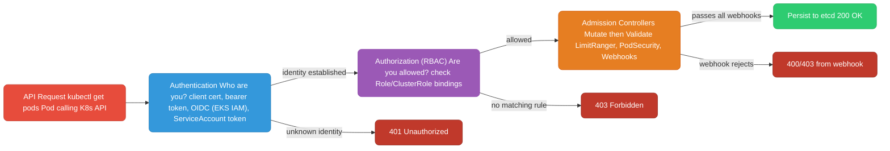
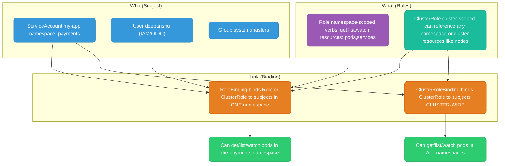
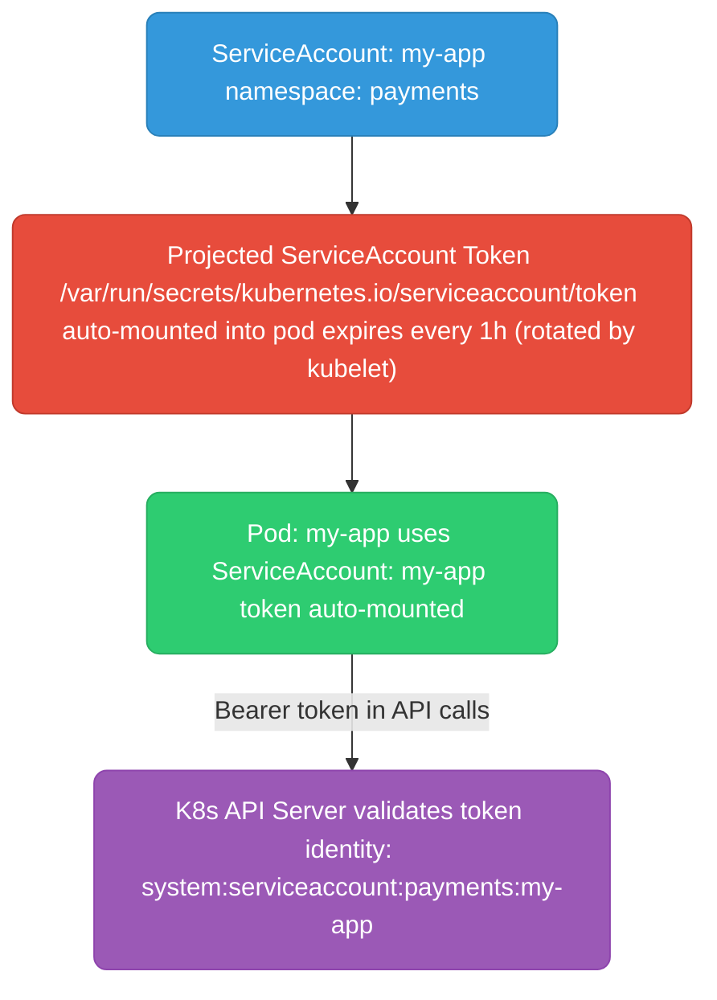
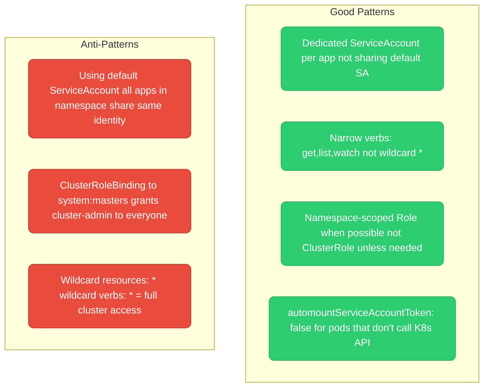

# Kubernetes RBAC

Who's allowed to do what, and how Kubernetes — and EKS on top of it — decides that on every single API call. Track how many knowledge checks below you clear as you go:

<div class="quiz-progress" data-quiz-progress>
  <span class="quiz-progress-label">0/0 checks</span>
  <span class="quiz-progress-bar"><span class="quiz-progress-fill"></span></span>
</div>

---

## Auth Chain: Every Request to the API Server



Same chain, one step at a time:

<div class="stepper">
  <div class="stepper-panels">
    <div class="stepper-panel active">
      <strong>1. Request arrives.</strong> <code>kubectl get pods</code>, a pod calling the API server, a controller reconciling — anything hitting the API starts here.
    </div>
    <div class="stepper-panel">
      <strong>2. Authentication — who are you?</strong> Client cert, bearer token, OIDC (EKS IAM), or a ServiceAccount token gets checked. No matching identity → <code>401 Unauthorized</code>, chain stops here.
    </div>
    <div class="stepper-panel">
      <strong>3. Authorization (RBAC) — are you allowed?</strong> With an identity established, Kubernetes checks every RoleBinding/ClusterRoleBinding for a rule permitting this verb+resource. No matching rule → <code>403 Forbidden</code>, chain stops here.
    </div>
    <div class="stepper-panel">
      <strong>4. Admission control.</strong> Mutating webhooks run first and can rewrite the request, then validating webhooks (LimitRanger, Pod Security, custom webhooks) check it. A rejection here is a 400/403 from the webhook itself — RBAC already said yes.
    </div>
    <div class="stepper-panel">
      <strong>5. Persisted.</strong> Only after clearing all three gates does the object get written to etcd and the caller gets <code>200 OK</code>.
    </div>
  </div>
  <div class="stepper-controls">
    <button class="stepper-prev">← Prev</button>
    <span class="stepper-dots"></span>
    <span class="stepper-label"></span>
    <button class="stepper-next">Next →</button>
  </div>
</div>

<div class="quiz-card">
  <p class="quiz-q">A request gets a 403 Forbidden. Did authentication or authorization fail?</p>
  <button class="quiz-reveal">Reveal answer</button>
  <div class="quiz-a" hidden>
    Authorization. A 403 means Kubernetes successfully identified the caller (authentication passed) but found no RBAC rule allowing that verb+resource. A failed identity check — unknown cert, bad token — fails earlier, at authentication, and returns 401 instead.
  </div>
</div>

---

## RBAC Building Blocks



<div class="quiz-card">
  <p class="quiz-q">The diagram shows a ClusterRole feeding into both a RoleBinding and a ClusterRoleBinding. What determines whether the resulting permission ends up namespace-scoped or cluster-wide?</p>
  <button class="quiz-reveal">Reveal answer</button>
  <div class="quiz-a" hidden>
    The binding, not the role. A ClusterRole's rules are defined once, but a RoleBinding applies them only inside the one namespace it lives in, while a ClusterRoleBinding applies the same rules across every namespace. Same ClusterRole, two very different blast radii depending on which binding references it.
  </div>
</div>

---

## ServiceAccount

A ServiceAccount is a Kubernetes identity for pods. Every pod runs as a ServiceAccount. If you don't specify one, it runs as the `default` ServiceAccount in its namespace.



```yaml
apiVersion: v1
kind: ServiceAccount
metadata:
  name: my-app
  namespace: payments
  annotations:
    # IRSA: also allows pod to assume AWS IAM role
    eks.amazonaws.com/role-arn: arn:aws:iam::123456789:role/my-app-s3-role
automountServiceAccountToken: true   # default — set false if pod doesn't call K8s API
```

<div class="quiz-card">
  <p class="quiz-q">You deploy a pod without setting <code>serviceAccountName</code>. What identity does it run as, and does it get an API token mounted?</p>
  <button class="quiz-reveal">Reveal answer</button>
  <div class="quiz-a" hidden>
    It runs as the <code>default</code> ServiceAccount in its namespace, and yes — <code>automountServiceAccountToken</code> defaults to <code>true</code>, so a token gets auto-mounted even if the pod never calls the Kubernetes API. That's why "every pod shares the default SA" shows up later as an anti-pattern: it's not something you opt into, it's what happens if you do nothing.
  </div>
</div>

---

## Role and ClusterRole

Both are collections of rules — the only difference is scope, and it's a hard boundary, not a preference:

<div class="tab-group">
  <div class="tab-buttons">
    <button data-tab="role" class="active">Role (namespaced)</button>
    <button data-tab="clusterrole">ClusterRole (cluster-scoped)</button>
  </div>
  <div class="tab-panels">
    <div class="tab-panel active" data-tab-panel="role">
      Only works within the namespace it's defined in — <code>pod-reader</code> here only ever applies inside <code>payments</code>.
      <pre><code>apiVersion: rbac.authorization.k8s.io/v1
kind: Role
metadata:
  name: pod-reader
  namespace: payments
rules:
  - apiGroups: [""]            # "" = core API group (pods, services, configmaps)
    resources: ["pods", "pods/log"]
    verbs: ["get", "list", "watch"]
  - apiGroups: ["apps"]        # apps group (deployments, replicasets)
    resources: ["deployments"]
    verbs: ["get", "list"]</code></pre>
    </div>
    <div class="tab-panel" data-tab-panel="clusterrole">
      Works across all namespaces, and is the only option for cluster-scoped resources like nodes — there is no namespace to put a Role in for something that isn't namespaced.
      <pre><code>apiVersion: rbac.authorization.k8s.io/v1
kind: ClusterRole
metadata:
  name: node-reader
rules:
  - apiGroups: [""]
    resources: ["nodes"]       # nodes are cluster-scoped, need ClusterRole
    verbs: ["get", "list", "watch"]
  - apiGroups: ["metrics.k8s.io"]
    resources: ["nodes", "pods"]
    verbs: ["get", "list"]</code></pre>
    </div>
  </div>
</div>

**Verbs reference:**

| Verb | HTTP | Description |
|------|------|-------------|
| `get` | GET + name | Get a specific resource |
| `list` | GET (collection) | List resources |
| `watch` | GET + watch=true | Stream updates |
| `create` | POST | Create resource |
| `update` | PUT | Replace resource |
| `patch` | PATCH | Partial update |
| `delete` | DELETE | Delete resource |
| `deletecollection` | DELETE (collection) | Delete many |
| `*` | all | Wildcard — all verbs |

<div class="quiz-card">
  <p class="quiz-q">Why does listing nodes require a ClusterRole instead of a Role, even if you only ever query it from within one namespace's tooling?</p>
  <button class="quiz-reveal">Reveal answer</button>
  <div class="quiz-a" hidden>
    Nodes are cluster-scoped resources — they don't belong to any namespace at all. A Role's permissions only ever apply inside the one namespace it's created in, so it has no way to grant access to something that isn't namespaced. Only a ClusterRole can reference cluster-scoped resources like nodes.
  </div>
</div>

---

## RoleBinding and ClusterRoleBinding

```yaml
# RoleBinding: grant Role to ServiceAccount IN one namespace
apiVersion: rbac.authorization.k8s.io/v1
kind: RoleBinding
metadata:
  name: my-app-pod-reader
  namespace: payments
subjects:
  - kind: ServiceAccount
    name: my-app
    namespace: payments
  - kind: User             # also works for users
    name: deepanshu
    apiGroup: rbac.authorization.k8s.io
roleRef:
  kind: Role
  name: pod-reader
  apiGroup: rbac.authorization.k8s.io
---
# ClusterRoleBinding: grant ClusterRole across ALL namespaces
apiVersion: rbac.authorization.k8s.io/v1
kind: ClusterRoleBinding
metadata:
  name: monitoring-cluster-reader
subjects:
  - kind: ServiceAccount
    name: prometheus
    namespace: monitoring
roleRef:
  kind: ClusterRole
  name: cluster-reader
  apiGroup: rbac.authorization.k8s.io
```

**Trick: ClusterRole + RoleBinding** — you can bind a ClusterRole via a RoleBinding to scope it to one namespace. Useful for reusable role definitions:

```yaml
# Define once as ClusterRole
kind: ClusterRole
metadata:
  name: app-role    # reusable template

---
# Bind in namespace A
kind: RoleBinding
metadata:
  namespace: payments    # scoped to payments only
roleRef:
  kind: ClusterRole
  name: app-role

---
# Bind in namespace B with same ClusterRole
kind: RoleBinding
metadata:
  namespace: orders      # scoped to orders only
roleRef:
  kind: ClusterRole
  name: app-role
```

<div class="quiz-card">
  <p class="quiz-q">You bind the same ClusterRole via two separate RoleBindings — one in namespace A, one in namespace B. Does a subject bound in namespace A get any permissions in namespace B?</p>
  <button class="quiz-reveal">Reveal answer</button>
  <div class="quiz-a" hidden>
    No. A RoleBinding scopes whatever it references — Role or ClusterRole — to the single namespace the RoleBinding itself lives in. Reusing one ClusterRole as a template across many RoleBindings gives you "same permission set, independently scoped per namespace," not a way to grant cross-namespace access.
  </div>
</div>

---

## RBAC Patterns



<div class="quiz-card">
  <p class="quiz-q">Why is "using the default ServiceAccount for every app in a namespace" flagged as an anti-pattern, even if that ServiceAccount only has narrow permissions?</p>
  <button class="quiz-reveal">Reveal answer</button>
  <div class="quiz-a" hidden>
    Because every app sharing one ServiceAccount shares one identity — and one blast radius. If any pod using it gets compromised, the attacker inherits whatever that ServiceAccount can do, and there's no way to tell from RBAC alone which app made a given API call. A dedicated ServiceAccount per app keeps compromises contained and audit trails meaningful, independent of how narrow the permissions are.
  </div>
</div>

**Debug RBAC issues:**
```bash
# Check what a ServiceAccount can do
kubectl auth can-i get pods \
  --as=system:serviceaccount:payments:my-app \
  -n payments

# List all permissions for a ServiceAccount
kubectl auth can-i --list \
  --as=system:serviceaccount:payments:my-app \
  -n payments

# Describe a RoleBinding to see who has what
kubectl describe rolebinding my-app-pod-reader -n payments

# Check if a specific action is allowed
kubectl auth can-i create deployments --as=system:serviceaccount:payments:my-app -n payments

# Who has cluster-admin? (critical audit check)
kubectl get clusterrolebindings -o json | \
  jq '.items[] | select(.roleRef.name=="cluster-admin") | {name: .metadata.name, subjects: .subjects}'
```

---

## RBAC — Advanced Patterns and EKS

### kubectl auth reconcile

`kubectl apply` on RBAC objects can produce conflicts if a ClusterRole already exists with different rules. `kubectl auth reconcile` is the safe way to apply RBAC — it adds missing rules without removing existing ones:

```bash
# Apply RBAC idempotently (safe for GitOps pipelines)
kubectl auth reconcile -f rbac-manifests/

# Dry-run first
kubectl auth reconcile -f rbac-manifests/ --dry-run=client
```

### Aggregated ClusterRoles

ClusterRoles can be composed from smaller roles using `aggregationRule`. Any ClusterRole with a matching label automatically has its rules merged in. Used by Kubernetes to build `view`, `edit`, `admin` roles from extension API groups:

```yaml
# Base aggregated role — collects rules from labeled sub-roles
apiVersion: rbac.authorization.k8s.io/v1
kind: ClusterRole
metadata:
  name: custom-platform-role
aggregationRule:
  clusterRoleSelectors:
    - matchLabels:
        rbac.example.com/aggregate-to-platform: "true"
rules: []  # auto-populated from matching ClusterRoles

---
# Sub-role that gets merged in automatically
apiVersion: rbac.authorization.k8s.io/v1
kind: ClusterRole
metadata:
  name: platform-secrets-reader
  labels:
    rbac.example.com/aggregate-to-platform: "true"  # triggers aggregation
rules:
  - apiGroups: [""]
    resources: ["secrets"]
    verbs: ["get", "list"]
```

<div class="quiz-card">
  <p class="quiz-q">You create a new ClusterRole labeled <code>rbac.example.com/aggregate-to-platform: "true"</code> after <code>custom-platform-role</code> already exists. Do you need to edit <code>custom-platform-role</code> to pick up the new rules?</p>
  <button class="quiz-reveal">Reveal answer</button>
  <div class="quiz-a" hidden>
    No. <code>aggregationRule</code> continuously watches for ClusterRoles matching its label selector and merges their rules in automatically — that's the whole point of <code>rules: []</code> starting empty. Add a new labeled ClusterRole and the aggregate picks it up on its own; this is exactly how Kubernetes builds its own <code>view</code>/<code>edit</code>/<code>admin</code> roles from extension API groups.
  </div>
</div>

### Token projection and bound service account tokens

Modern K8s (1.21+) uses **projected tokens** — short-lived (1h default), audience-bound, and tied to a specific pod. They replace the old static Secrets-based tokens.

```yaml
# Explicitly configure projected token (usually auto-injected, but here for clarity)
spec:
  volumes:
    - name: token
      projected:
        sources:
          - serviceAccountToken:
              path: token
              expirationSeconds: 3600      # 1 hour
              audience: "https://kubernetes.default.svc"
  containers:
    - name: app
      volumeMounts:
        - name: token
          mountPath: /var/run/secrets/kubernetes.io/serviceaccount
```

```bash
# Decode the token to inspect claims
kubectl exec <pod> -- cat /var/run/secrets/kubernetes.io/serviceaccount/token | \
  cut -d. -f2 | base64 -d 2>/dev/null | jq .
# {
#   "aud": ["https://kubernetes.default.svc"],
#   "exp": 1700000000,
#   "iat": 1699996400,
#   "iss": "https://kubernetes.default.svc",
#   "kubernetes.io": {
#     "namespace": "payments",
#     "pod": { "name": "my-app-xxx", "uid": "..." },
#     "serviceaccount": { "name": "my-app", "uid": "..." }
#   },
#   "sub": "system:serviceaccount:payments:my-app"
# }
```

<div class="quiz-card">
  <p class="quiz-q">What's the key difference between a projected ServiceAccount token and the old static Secret-based token?</p>
  <button class="quiz-reveal">Reveal answer</button>
  <div class="quiz-a" hidden>
    A projected token is short-lived (1h by default), scoped to a specific audience, and tied to the exact pod it was issued for — the kubelet rotates it automatically. The old static token lived forever in a Secret with no audience binding and no pod association, so a leaked copy stayed valid indefinitely and worked anywhere.
  </div>
</div>

### EKS — aws-auth ConfigMap (legacy) vs Access Entries (current)

EKS authenticates using IAM. The mapping from IAM identity → Kubernetes username/groups is configured two ways:

<div class="tab-group">
  <div class="tab-buttons">
    <button data-tab="awsauth" class="active">aws-auth ConfigMap (legacy)</button>
    <button data-tab="accessentries">Access Entries (current)</button>
  </div>
  <div class="tab-panels">
    <div class="tab-panel active" data-tab-panel="awsauth">
      <strong>EKS &lt; 1.30.</strong> Every IAM-to-Kubernetes mapping lives as hand-edited YAML in one ConfigMap.
      <pre><code># kubectl edit configmap aws-auth -n kube-system
apiVersion: v1
kind: ConfigMap
metadata:
  name: aws-auth
  namespace: kube-system
data:
  mapRoles: |
    # Worker node IAM role → system:nodes group (required for nodes to join)
    - rolearn: arn:aws:iam::123456789:role/eks-node-role
      username: system:node:{{EC2PrivateDNSName}}
      groups:
        - system:bootstrappers
        - system:nodes
    # Human IAM role → Kubernetes RBAC group
    - rolearn: arn:aws:iam::123456789:role/devops-team
      username: devops-{{SessionName}}
      groups:
        - platform-admins   # bind this group to a ClusterRole in RBAC
  mapUsers: |
    # Specific IAM user (avoid when possible — use roles)
    - userarn: arn:aws:iam::123456789:user/alice
      username: alice
      groups:
        - developers</code></pre>
      One bad edit — a typo, a merge conflict — and this ConfigMap can lock every human and every node out of the cluster at once.
    </div>
    <div class="tab-panel" data-tab-panel="accessentries">
      <strong>EKS 1.30+, recommended.</strong> Each mapping is its own API object, managed through the EKS API instead of a hand-edited ConfigMap.
      <pre><code># Create an access entry (replaces aws-auth ConfigMap rows)
aws eks create-access-entry \
  --cluster-name my-cluster \
  --principal-arn arn:aws:iam::123456789:role/devops-team \
  --type STANDARD \
  --kubernetes-groups platform-admins

# Associate with an access policy (AWS-managed or custom)
aws eks associate-access-policy \
  --cluster-name my-cluster \
  --principal-arn arn:aws:iam::123456789:role/devops-team \
  --policy-arn arn:aws:eks::aws:cluster-access-policy/AmazonEKSClusterAdminPolicy \
  --access-scope '{"type": "cluster"}'

# List all access entries
aws eks list-access-entries --cluster-name my-cluster</code></pre>
      Access Entries survive <code>aws-auth</code> ConfigMap corruption — a common incident that locks everyone out of the cluster.
    </div>
  </div>
</div>

<div class="quiz-card">
  <p class="quiz-q">The aws-auth ConfigMap gets corrupted by a bad edit — wrong indentation, a typo in an ARN. What happens to cluster access, and how do Access Entries change that risk?</p>
  <button class="quiz-reveal">Reveal answer</button>
  <div class="quiz-a" hidden>
    A broken aws-auth ConfigMap can lock out every IAM identity mapped through it at once — including the humans who'd need to fix it, and the worker nodes trying to join. Access Entries store each mapping as its own EKS API object instead of one shared hand-edited ConfigMap, so there's no single YAML blob whose corruption takes down everyone's access simultaneously.
  </div>
</div>

### IRSA — IAM Roles for Service Accounts

IRSA lets a Kubernetes ServiceAccount assume an AWS IAM role without static credentials. The pod gets a projected token, exchanges it at the STS OIDC endpoint, and receives temporary AWS credentials.

```bash
# 1. Create OIDC provider for your EKS cluster (one-time per cluster)
eksctl utils associate-iam-oidc-provider \
  --cluster my-cluster --approve

# 2. Create IAM role with trust policy scoped to specific ServiceAccount
OIDC_ID=$(aws eks describe-cluster --name my-cluster \
  --query "cluster.identity.oidc.issuer" --output text | cut -d/ -f5)

aws iam create-role \
  --role-name my-app-s3-role \
  --assume-role-policy-document '{
    "Version": "2012-10-17",
    "Statement": [{
      "Effect": "Allow",
      "Principal": {"Federated": "arn:aws:iam::123456789:oidc-provider/oidc.eks.us-east-1.amazonaws.com/id/'"$OIDC_ID"'"},
      "Action": "sts:AssumeRoleWithWebIdentity",
      "Condition": {
        "StringEquals": {
          "oidc.eks.us-east-1.amazonaws.com/id/'"$OIDC_ID"':aud": "sts.amazonaws.com",
          "oidc.eks.us-east-1.amazonaws.com/id/'"$OIDC_ID"':sub": "system:serviceaccount:payments:my-app"
        }
      }
    }]
  }'
```

```yaml
# 3. Annotate the ServiceAccount
apiVersion: v1
kind: ServiceAccount
metadata:
  name: my-app
  namespace: payments
  annotations:
    eks.amazonaws.com/role-arn: arn:aws:iam::123456789:role/my-app-s3-role
    eks.amazonaws.com/token-expiration: "3600"  # optional: shorter token lifetime
```

```bash
# 4. Verify — pod should have these env vars injected by the EKS pod identity webhook:
kubectl exec <pod> -- env | grep AWS
# AWS_ROLE_ARN=arn:aws:iam::123456789:role/my-app-s3-role
# AWS_WEB_IDENTITY_TOKEN_FILE=/var/run/secrets/eks.amazonaws.com/serviceaccount/token
# AWS_DEFAULT_REGION=us-east-1

# If missing: check the pod admission mutation webhook is running
kubectl get mutatingwebhookconfigurations | grep pod-identity
```

Same setup, walked through as one flow — including the runtime exchange the four commands above are all in service of:

<div class="stepper">
  <div class="stepper-panels">
    <div class="stepper-panel active">
      <strong>1. OIDC provider registered.</strong> A one-time, per-cluster step — EKS gets an IAM OIDC identity provider so AWS will trust tokens issued by this cluster's API server at all.
    </div>
    <div class="stepper-panel">
      <strong>2. IAM role trust policy scoped to one ServiceAccount.</strong> The role's <code>AssumeRoleWithWebIdentity</code> trust policy conditions on the token's <code>sub</code> claim equaling <code>system:serviceaccount:payments:my-app</code> — not "anything from this cluster."
    </div>
    <div class="stepper-panel">
      <strong>3. ServiceAccount annotated.</strong> The <code>eks.amazonaws.com/role-arn</code> annotation on the ServiceAccount tells the EKS pod identity webhook which role a pod using it should get.
    </div>
    <div class="stepper-panel">
      <strong>4. Pod starts, token and env vars injected.</strong> The mutating admission webhook (from the auth chain above) injects <code>AWS_ROLE_ARN</code> and <code>AWS_WEB_IDENTITY_TOKEN_FILE</code>, and the kubelet mounts the projected, audience-bound ServiceAccount token at that path.
    </div>
    <div class="stepper-panel">
      <strong>5. Runtime exchange.</strong> The AWS SDK inside the pod reads the projected token and calls <code>sts:AssumeRoleWithWebIdentity</code> against the STS OIDC endpoint. STS validates the token's signature and <code>sub</code>/<code>aud</code> claims against the trust policy, then hands back temporary AWS credentials — no static keys ever touch the pod.
    </div>
  </div>
  <div class="stepper-controls">
    <button class="stepper-prev">← Prev</button>
    <span class="stepper-dots"></span>
    <span class="stepper-label"></span>
    <button class="stepper-next">Next →</button>
  </div>
</div>

<div class="quiz-card">
  <p class="quiz-q">The IAM role's trust policy restricts the <code>sub</code> claim to <code>system:serviceaccount:payments:my-app</code>. What does that condition actually prevent?</p>
  <button class="quiz-reveal">Reveal answer</button>
  <div class="quiz-a" hidden>
    It prevents any other ServiceAccount — a different namespace, or a different name in the same namespace — from assuming that IAM role, even though they're all issued tokens by the same OIDC provider and the same cluster. The trust policy's condition on <code>sub</code> is what ties the AWS side of IRSA to one specific Kubernetes identity instead of "anything in this cluster."
  </div>
</div>

### Common RBAC misconfigurations

| Misconfiguration | Risk | Detection |
|---|---|---|
| `default` SA used for all pods | Blast radius: any compromised pod has the same identity | `kubectl get rolebindings,clusterrolebindings -A -o json \| jq '.items[].subjects[] \| select(.name=="default")'` |
| `cluster-admin` for CI/CD SA | CI pipeline compromise = full cluster takeover | `kubectl get clusterrolebindings -o json \| jq ... \| select(.roleRef.name=="cluster-admin")'` |
| `automountServiceAccountToken: true` on non-API pods | Token in every pod, even ones that don't need K8s API | Set `false` on Deployment spec, override on SA |
| Wildcard verb+resource | `verbs: ["*"] resources: ["*"]` = cluster-admin equivalent | Audit: `kubectl get roles,clusterroles -A -o yaml \| grep '"*"'` |
| RoleBinding to system:authenticated | Every authenticated user (including service accounts) gets the role | Audit ClusterRoleBindings for system:authenticated subject |
| Stale bindings after team changes | Former employees' IAM roles still mapped in aws-auth | Review `aws-auth` ConfigMap quarterly |

<div class="quiz-card">
  <p class="quiz-q">Which single misconfiguration in the table is equivalent to granting cluster-admin, even without ever binding the <code>cluster-admin</code> ClusterRole?</p>
  <button class="quiz-reveal">Reveal answer</button>
  <div class="quiz-a" hidden>
    Wildcard verb + wildcard resource (<code>verbs: ["*"], resources: ["*"]</code>). It doesn't matter that the role isn't named <code>cluster-admin</code> — granting every verb on every resource has the identical effect, and it won't show up in an audit that only greps for bindings to the literal <code>cluster-admin</code> role name.
  </div>
</div>

### RBAC audit one-liners

```bash
# Find all cluster-admin bindings
kubectl get clusterrolebindings -o json | \
  jq -r '.items[] | select(.roleRef.name=="cluster-admin") |
  "\(.metadata.name): \(.subjects // [] | map(.name) | join(", "))"'

# Find all ServiceAccounts with cluster-wide permissions
kubectl get clusterrolebindings -o json | \
  jq -r '.items[] | .subjects[]? | select(.kind=="ServiceAccount") |
  "\(.namespace)/\(.name)"' | sort -u

# What can a given ServiceAccount do across all namespaces?
for ns in $(kubectl get ns -o jsonpath='{.items[*].metadata.name}'); do
  kubectl auth can-i --list \
    --as=system:serviceaccount:payments:my-app \
    -n $ns 2>/dev/null | grep -v "^Resources" | grep -v "^\*"
done
```
