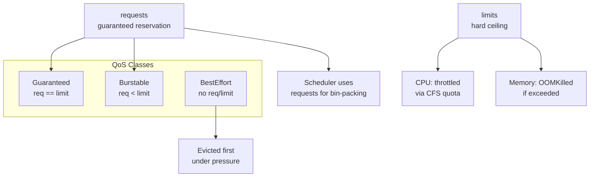
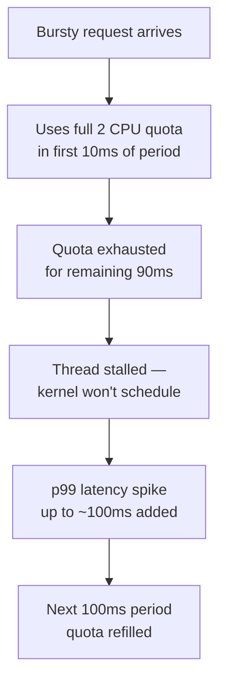
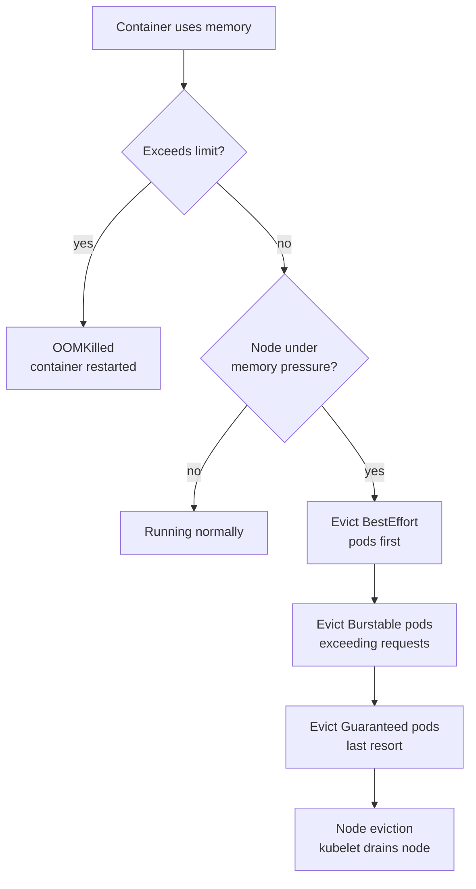
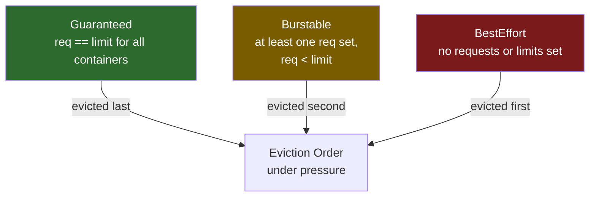
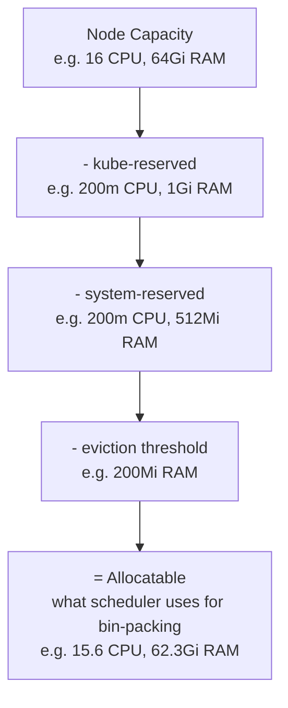

# Resource Requests and Limits

## 1. Requests vs Limits



```yaml
resources:
  requests:
    cpu: "250m"       # scheduler guarantee
    memory: "256Mi"
  limits:
    cpu: "1"          # throttled above this
    memory: "512Mi"   # OOMKilled above this
```

---

## 2. CPU Throttling (CFS Quota)

The Linux CFS (Completely Fair Scheduler) enforces CPU limits via two cgroup knobs:

```
cpu.cfs_period_us = 100000   (100ms period)
cpu.cfs_quota_us  = 200000   (2 CPU × 100ms = 200ms of CPU per period)
```

**Throttle formula:**
```
throttle% = throttled_periods / total_periods × 100
```

**Why 2 CPU limit spikes p99 latency on a 0.1 CPU avg app:**



The average CPU is low (0.1 CPU), but a single burst can consume the entire quota in a fraction of the 100ms window, stalling all threads until the next period refills the quota. This is why **CPU limits cause latency spikes even when average utilization is low**.

**How to inspect throttling:**
```bash
# Check throttle stats in a running container
kubectl exec <pod> -- cat \
  /sys/fs/cgroup/cpu/cpu.stat
# look for: throttled_time, nr_throttled

# Prometheus metric (requires cAdvisor)
container_cpu_cfs_throttled_periods_total
container_cpu_cfs_periods_total
```

---

## 3. Memory Eviction Hierarchy



**OOMKilled** = container-level, only that container restarts.  
**Node eviction** = pod-level, entire pod rescheduled elsewhere.

Eviction thresholds configured in kubelet:
```yaml
# kubelet config
evictionHard:
  memory.available: "200Mi"
  nodefs.available: "10%"
evictionSoft:
  memory.available: "500Mi"
evictionSoftGracePeriod:
  memory.available: "30s"
```

---

## 4. QoS Classes



| QoS Class | Condition | OOM Score Adj | Eviction Priority |
|---|---|---|---|
| Guaranteed | `requests == limits` for every container | -998 (last to be killed) | Last |
| Burstable | Any `requests` set, `requests < limits` | 2–999 (proportional to usage) | Middle |
| BestEffort | No `requests` or `limits` set | 1000 (first to be killed) | First |

```yaml
# Guaranteed example
resources:
  requests:
    cpu: "500m"
    memory: "256Mi"
  limits:
    cpu: "500m"      # must equal request
    memory: "256Mi"  # must equal request
```

---

## 5. LimitRange — Namespace Defaults

LimitRange sets per-pod/container defaults and constraints within a namespace.

```yaml
apiVersion: v1
kind: LimitRange
metadata:
  name: default-limits
  namespace: my-app
spec:
  limits:
    - type: Container
      default:           # applied if limits not set
        cpu: "500m"
        memory: "256Mi"
      defaultRequest:    # applied if requests not set
        cpu: "100m"
        memory: "128Mi"
      max:               # hard ceiling per container
        cpu: "2"
        memory: "1Gi"
      min:               # floor per container
        cpu: "50m"
        memory: "64Mi"
    - type: Pod
      max:
        cpu: "4"
        memory: "2Gi"
    - type: PersistentVolumeClaim
      max:
        storage: "50Gi"
```

---

## 6. ResourceQuota — Namespace Caps

ResourceQuota sets aggregate limits across all resources in a namespace.

```yaml
apiVersion: v1
kind: ResourceQuota
metadata:
  name: ns-quota
  namespace: my-app
spec:
  hard:
    # Compute
    requests.cpu: "10"
    requests.memory: "20Gi"
    limits.cpu: "20"
    limits.memory: "40Gi"
    # Object counts
    pods: "50"
    services: "20"
    persistentvolumeclaims: "10"
    secrets: "50"
    configmaps: "50"
    # Storage
    requests.storage: "100Gi"
    storageclass.storage.k8s.io/fast.requests.storage: "50Gi"
```

```bash
kubectl describe resourcequota ns-quota -n my-app
# shows: hard limit vs current usage
```

---

## 7. Vertical Pod Autoscaler (VPA)

VPA automatically adjusts `requests` (and optionally `limits`) based on historical usage.

```yaml
apiVersion: autoscaling.k8s.io/v1
kind: VerticalPodAutoscaler
metadata:
  name: myapp-vpa
spec:
  targetRef:
    apiVersion: apps/v1
    kind: Deployment
    name: myapp
  updatePolicy:
    updateMode: "Auto"   # Off | Initial | Recreate | Auto
  resourcePolicy:
    containerPolicies:
      - containerName: myapp
        minAllowed:
          cpu: "100m"
          memory: "128Mi"
        maxAllowed:
          cpu: "4"
          memory: "4Gi"
        controlledResources: ["cpu", "memory"]
```

| Mode | Behaviour |
|---|---|
| `Off` | Recommendations only, no changes |
| `Initial` | Sets requests at pod creation, never updates live pods |
| `Recreate` | Evicts and recreates pods to apply new recommendations |
| `Auto` | Same as Recreate today; in-place update when K8s supports it |

**VPA + HPA conflict:** Don't use both targeting CPU/memory on the same deployment. Use VPA for right-sizing, HPA on custom metrics (RPS, queue depth).

---

## 8. Node Allocatable Chain

Not all node capacity is available to pods. The chain from raw capacity to schedulable capacity:

```
Node Capacity (total hardware)
  └─ kube-reserved  (CPU/memory reserved for kubelet, container runtime)
  └─ system-reserved (CPU/memory reserved for OS processes)
  └─ eviction-threshold (kubelet won't schedule here — kept as safety buffer)
  └─ Allocatable (what the scheduler sees — what your pod requests count against)
```



```bash
# Check allocatable vs capacity on a node
kubectl describe node <node> | grep -A6 "Capacity:" 
kubectl describe node <node> | grep -A6 "Allocatable:"

# Example output:
# Capacity:
#   cpu:                16
#   memory:             65536Mi
# Allocatable:
#   cpu:                15600m     ← 400m reserved
#   memory:             63897Mi    ← ~1.6Gi reserved

# Check how much is currently requested
kubectl describe node <node> | grep -A10 "Allocated resources"
# Requests    Limits
# cpu         8200m (52%)    16000m (100%)
# memory      24Gi (38%)     32Gi (50%)
```

**Why pods go Pending even when `kubectl top nodes` shows free capacity:**
`top` shows actual usage. Scheduler uses **requests** for bin-packing. A node can be 10% utilized but 100% requested → new pods pend.

```bash
# See real picture: requested vs allocatable
kubectl get nodes -o custom-columns=\
"NAME:.metadata.name,\
ALLOC-CPU:.status.allocatable.cpu,\
ALLOC-MEM:.status.allocatable.memory"
```

**Configure reserved resources (kubelet config):**
```yaml
# /var/lib/kubelet/config.yaml
kubeReserved:
  cpu: "200m"
  memory: "1Gi"
  ephemeral-storage: "1Gi"
systemReserved:
  cpu: "200m"
  memory: "512Mi"
evictionHard:
  memory.available: "200Mi"
  nodefs.available: "10%"
```

---

## 9. Recommendations

```
✅ Always set requests — scheduler needs them for bin-packing
✅ Always set memory limits — prevents runaway containers OOMKilling neighbours
⚠️  Be careful with CPU limits — causes throttling even at low avg usage
✅ Prefer no CPU limit for latency-sensitive services (set request only)
✅ Match Guaranteed QoS for critical workloads (requests == limits)
✅ Use LimitRange to enforce defaults so new pods aren't BestEffort by accident
✅ Monitor container_cpu_cfs_throttled_periods_total in Prometheus
✅ Use VPA in Off mode first — check recommendations before enabling Auto
```

**Safe pattern for latency-sensitive service:**
```yaml
resources:
  requests:
    cpu: "500m"      # guaranteed reservation
    memory: "512Mi"
  limits:
    # no cpu limit — avoids CFS throttling
    memory: "512Mi"  # must have memory limit
```

**Safe pattern for batch / background job:**
```yaml
resources:
  requests:
    cpu: "100m"
    memory: "256Mi"
  limits:
    cpu: "2"         # OK to throttle batch jobs
    memory: "512Mi"
```

---

## 10. CPU Throttling — The Invisible Performance Killer

A pod can be `Running`, consuming well under its CPU limit in `kubectl top`, and still be severely throttled. This is the most misunderstood resource issue in Kubernetes.

### CFS quota math

The Linux Completely Fair Scheduler enforces CPU limits using **CFS bandwidth control**:
- Every 100ms (the CFS period), each container gets a quota = `cpu_limit × 100ms`
- A container with `limits.cpu: 500m` gets 50ms of CPU per 100ms period
- If it uses all 50ms before the period ends, it is **throttled for the remainder** — sleeping even if the node has idle CPUs

```
limits.cpu: 500m
CFS period:  100ms
CFS quota:   50ms  (500m × 100ms)

Timeline:
  0ms    Container starts running
  50ms   Quota exhausted → container THROTTLED (sleeping)
  100ms  New period begins → quota refilled
  150ms  Quota exhausted again → throttled
```

A container with a spiky workload (GC pause, request burst) hits the quota immediately, introducing 50ms latency spikes that don't show up in average CPU metrics.

### Detecting throttling

```bash
# Prometheus metric — throttle ratio per container
rate(container_cpu_cfs_throttled_seconds_total[5m])
  /
rate(container_cpu_cfs_periods_total[5m])
# > 0.25 (25%) = significant throttling; investigate and right-size
# > 0.50 (50%) = severe; app is spending half its time sleeping waiting for quota

# Check throttling for a specific pod directly from cgroup
NODE=$(kubectl get pod <pod> -o jsonpath='{.spec.nodeName}')
# On the node (or via privileged debug pod):
cat /sys/fs/cgroup/cpu/kubepods/burstable/pod<uid>/<container-id>/cpu.stat
# nr_periods:    100000   ← total CFS periods
# nr_throttled:  40000    ← periods where throttling occurred  
# throttled_time: 2000000000  ← nanoseconds throttled (2 seconds)
# throttle ratio: 40000/100000 = 40% throttled
```

**PromQL alert:**
```yaml
- alert: ContainerCPUThrottling
  expr: |
    rate(container_cpu_cfs_throttled_seconds_total{container!=""}[5m])
    / rate(container_cpu_cfs_periods_total{container!=""}[5m]) > 0.25
  for: 5m
  labels:
    severity: warning
  annotations:
    summary: "{{ $labels.pod }}/{{ $labels.container }} throttled {{ $value | humanizePercentage }}"
```

### Guaranteed vs Burstable — the throttling tradeoff

| QoS | requests == limits | Throttled? | OOM priority |
|---|---|---|---|
| **Guaranteed** | Yes (both set equal) | Yes — throttled at limit, no burst | Last to be OOM-killed |
| **Burstable** | Requests < limits | Only when node is busy OR limit hit | Middle priority |
| **BestEffort** | Neither set | Never throttled (no limit) | First to be OOM-killed |

**The Guaranteed paradox:** Setting `requests == limits` gives you the highest QoS class and OOM protection, but you get hard throttled at exactly `limits.cpu`. No burst headroom for GC spikes or request bursts.

**Recommended pattern for latency-sensitive services:**
```yaml
resources:
  requests:
    cpu: "500m"     # what scheduler reserves — keep this accurate
    memory: "512Mi"
  limits:
    memory: "512Mi"  # keep memory limit — OOM is deterministic
    # NO cpu limit — allows burst to spare node capacity
    # cpu throttling is often worse than OOM for latency-sensitive apps
```

Removing the CPU limit converts the pod to **Burstable** QoS. It can use spare CPU capacity freely. The risk: a noisy neighbor pod with no limit can saturate the node. Mitigate with `LimitRange` defaults and node isolation.

### VPA right-sizing workflow

```bash
# Step 1: Install VPA CRDs and components
kubectl apply -f https://github.com/kubernetes/autoscaler/releases/latest/download/vertical-pod-autoscaler.yaml

# Step 2: Create VPA in Off mode (observe, don't change)
cat <<EOF | kubectl apply -f -
apiVersion: autoscaling.k8s.io/v1
kind: VerticalPodAutoscaler
metadata:
  name: payments-vpa
  namespace: payments
spec:
  targetRef:
    apiVersion: apps/v1
    kind: Deployment
    name: payments
  updatePolicy:
    updateMode: "Off"   # recommendations only — no automatic restarts
EOF

# Step 3: After 24-48h, check recommendations
kubectl describe vpa payments-vpa -n payments
# Output:
#   Recommendation:
#     Container Recommendations:
#       Container Name: payments
#         Lower Bound:  cpu: 100m, memory: 200Mi
#         Target:       cpu: 350m, memory: 380Mi   ← use this for requests
#         Upper Bound:  cpu: 1200m, memory: 900Mi
#         Uncapped Target: cpu: 350m, memory: 380Mi

# Step 4: Apply target as new requests in your deployment
# requests.cpu: 350m, limits.cpu: (remove or set to 2x)
# requests.memory: 380Mi, limits.memory: 380Mi (keep equal for Guaranteed)

# Step 5: Switch to Auto mode for ongoing right-sizing
# updateMode: "Auto"   — VPA evicts and recreates pods with new resources
# WARNING: VPA in Auto mode conflicts with HPA on CPU metric
# If using HPA, use VPA in Off or Recommender-only mode
```

### CPU limit decision matrix

```
Is the workload latency-sensitive (API, gRPC, real-time)?
  └── Yes → Remove CPU limit; set accurate requests; use throttling alert
  └── No  → Set CPU limit; use Guaranteed QoS if memory predictable

Does the workload have GC-heavy language (Java, Go)?
  └── Yes → GC causes burst; remove limit or set limit to 3-5x requests
  └── No  → Set limit closer to requests

Is the node shared with untrusted/noisy tenants?
  └── Yes → Keep CPU limit for isolation; accept some throttling
  └── No  → Remove limit; rely on requests for fair scheduling
```
