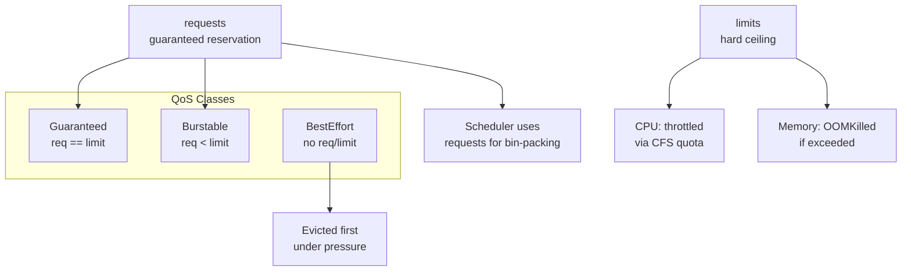
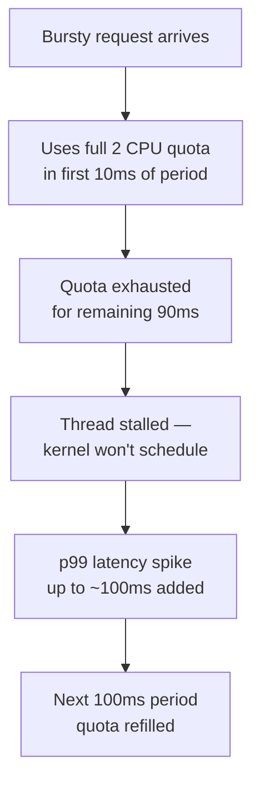
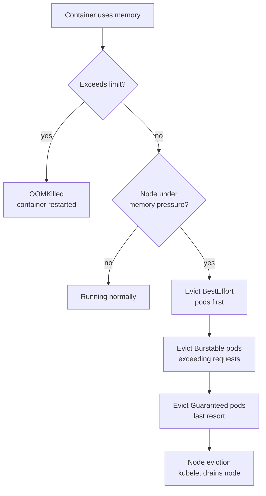
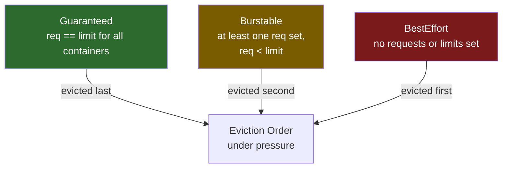
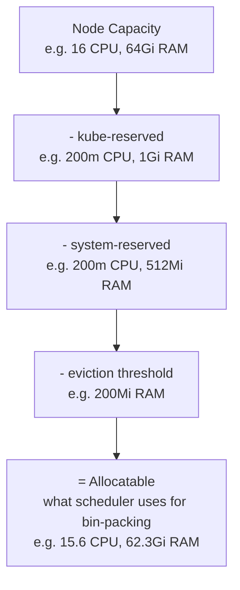
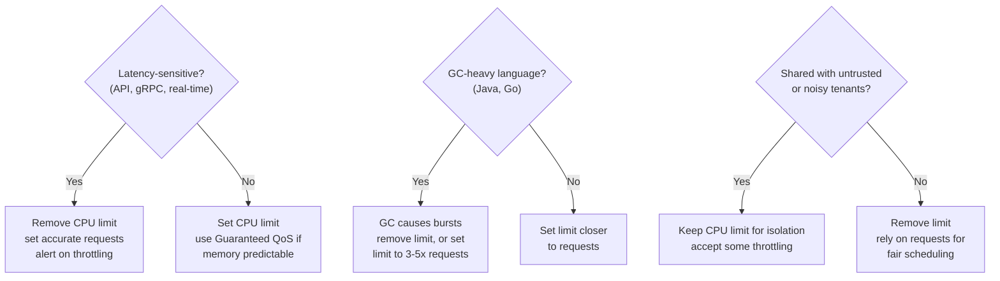

# Resource Requests and Limits

Each major section below ends with a quick knowledge check — try to answer before revealing. Track how many you've cleared:

<div class="quiz-progress" data-quiz-progress>
  <span class="quiz-progress-label">0/0 checks</span>
  <span class="quiz-progress-bar"><span class="quiz-progress-fill"></span></span>
</div>

## 1. Requests vs Limits



```yaml
resources:
  requests:
    cpu: "250m"       # scheduler guarantee
    memory: "256Mi"
  limits:
    cpu: "1"          # throttled above this
    memory: "512Mi"   # OOMKilled above this
```

<div class="quiz-card">
  <p class="quiz-q">A container exceeds its CPU limit vs exceeds its memory limit — what happens in each case?</p>
  <button class="quiz-reveal">Reveal answer</button>
  <div class="quiz-a" hidden>Exceeding the <strong>CPU</strong> limit gets you <strong>throttled</strong> &mdash; the CFS quota runs out and the container is paused until the next period, but nothing crashes. Exceeding the <strong>memory</strong> limit gets the container <strong>OOMKilled</strong> &mdash; it's terminated and restarted. CPU is a soft, compressible ceiling; memory is a hard, incompressible one.</div>
</div>

---

## 2. CPU Throttling (CFS Quota)

The Linux CFS (Completely Fair Scheduler) enforces CPU limits via two cgroup knobs:

```
cpu.cfs_period_us = 100000   (100ms period)
cpu.cfs_quota_us  = 200000   (2 CPU × 100ms = 200ms of CPU per period)
```

**Throttle formula:**
```
throttle% = throttled_periods / total_periods × 100
```

**Why 2 CPU limit spikes p99 latency on a 0.1 CPU avg app:**



The average CPU is low (0.1 CPU), but a single burst can consume the entire quota in a fraction of the 100ms window, stalling all threads until the next period refills the quota. This is why **CPU limits cause latency spikes even when average utilization is low**.

**How to inspect throttling:**
```bash
# Check throttle stats in a running container
kubectl exec <pod> -- cat \
  /sys/fs/cgroup/cpu/cpu.stat
# look for: throttled_time, nr_throttled

# Prometheus metric (requires cAdvisor)
container_cpu_cfs_throttled_periods_total
container_cpu_cfs_periods_total
```

<div class="quiz-card">
  <p class="quiz-q">A container averages just 0.1 CPU of actual usage but has a 2 CPU limit. Can it still get throttled?</p>
  <button class="quiz-reveal">Reveal answer</button>
  <div class="quiz-a" hidden>Yes. Throttling is decided per 100ms CFS period, not on a long-run average &mdash; a single burst can consume the entire 2-CPU quota in the first few milliseconds of a period, stalling the container for the rest of it. Low average CPU tells you nothing about whether a burst inside any given period exhausted the quota.</div>
</div>

---

## 3. Memory Eviction Hierarchy



Step through the escalation in order — it's two separate mechanisms chained together, not one:

<div class="stepper">
  <div class="stepper-panels">
    <div class="stepper-panel active">
      <strong>1. Container exceeds its own limit.</strong> If the container's memory usage crosses its own <code>limits.memory</code>, it's OOMKilled immediately &mdash; regardless of how much memory the rest of the node has free. Only that container restarts.
    </div>
    <div class="stepper-panel">
      <strong>2. Node comes under memory pressure.</strong> Separately from any single container's limit, the kubelet watches overall node memory. Once it crosses the configured eviction threshold, it starts reclaiming by evicting whole pods.
    </div>
    <div class="stepper-panel">
      <strong>3. BestEffort pods evicted first.</strong> Pods with no requests or limits at all have nothing reserved and no protection &mdash; they're the first to go.
    </div>
    <div class="stepper-panel">
      <strong>4. Burstable pods exceeding their requests, next.</strong> If evicting BestEffort pods didn't free enough memory, the kubelet moves on to Burstable pods using more than they requested.
    </div>
    <div class="stepper-panel">
      <strong>5. Guaranteed pods, last resort.</strong> Only if the node is still critically short does the kubelet touch Guaranteed pods &mdash; the class it protects the longest.
    </div>
    <div class="stepper-panel">
      <strong>6. Node eviction.</strong> If reclaiming pod-by-pod still isn't enough, the kubelet drains the node entirely and everything left gets rescheduled elsewhere.
    </div>
  </div>
  <div class="stepper-controls">
    <button class="stepper-prev">← Prev</button>
    <span class="stepper-dots"></span>
    <span class="stepper-label"></span>
    <button class="stepper-next">Next →</button>
  </div>
</div>

**OOMKilled** = container-level, only that container restarts.  
**Node eviction** = pod-level, entire pod rescheduled elsewhere.

Eviction thresholds configured in kubelet:
```yaml
# kubelet config
evictionHard:
  memory.available: "200Mi"
  nodefs.available: "10%"
evictionSoft:
  memory.available: "500Mi"
evictionSoftGracePeriod:
  memory.available: "30s"
```

<div class="quiz-card">
  <p class="quiz-q">A container hits its own memory limit while the node as a whole has plenty of free memory. Is it OOMKilled?</p>
  <button class="quiz-reveal">Reveal answer</button>
  <div class="quiz-a" hidden>Yes &mdash; OOMKill is enforced per-container against that container's own limit, completely independent of node-wide memory pressure. Node-level eviction (BestEffort &rarr; Burstable &rarr; Guaranteed) is a separate mechanism that only kicks in when the <em>node</em> is short on memory, and it removes whole pods, not just one container.</div>
</div>

---

## 4. QoS Classes



| QoS Class | Condition | OOM Score Adj | Eviction Priority |
|---|---|---|---|
| Guaranteed | `requests == limits` for every container | -998 (last to be killed) | Last |
| Burstable | Any `requests` set, `requests < limits` | 2–999 (proportional to usage) | Middle |
| BestEffort | No `requests` or `limits` set | 1000 (first to be killed) | First |

The table above is the reference; flip through the classes to see what each one actually means in practice:

<div class="toggle-switch">
  <div class="toggle-buttons">
    <button data-toggle-opt="guaranteed" class="active state-ok">Guaranteed</button>
    <button data-toggle-opt="burstable" class="state-warn">Burstable</button>
    <button data-toggle-opt="besteffort" class="state-bad">BestEffort</button>
  </div>
  <div class="toggle-panel active" data-toggle-panel="guaranteed">
    <strong>requests == limits, for every container, for both CPU and memory.</strong> Highest priority class &mdash; <code>oomScoreAdj</code> of <code>-998</code>, last to be killed under memory pressure. The tradeoff: you're hard-throttled at exactly <code>limits.cpu</code>, with zero burst headroom for GC pauses or request spikes.
  </div>
  <div class="toggle-panel" data-toggle-panel="burstable">
    <strong>At least one container has a request set, and requests &lt; limits.</strong> Middle priority &mdash; <code>oomScoreAdj</code> somewhere in 2&ndash;999, roughly proportional to how far over its request the container is using. Can burst above its request when the node has spare capacity, but is the second class evicted when the node runs short.
  </div>
  <div class="toggle-panel" data-toggle-panel="besteffort">
    <strong>No requests or limits set at all, for any container.</strong> Lowest priority &mdash; <code>oomScoreAdj</code> of <code>1000</code>, first to be killed the moment the node comes under memory pressure. Nothing is reserved for it and nothing caps it either.
  </div>
</div>

```yaml
# Guaranteed example
resources:
  requests:
    cpu: "500m"
    memory: "256Mi"
  limits:
    cpu: "500m"      # must equal request
    memory: "256Mi"  # must equal request
```

<div class="quiz-card">
  <p class="quiz-q">A pod sets requests == limits for CPU, but leaves memory with no limit at all. What QoS class is it?</p>
  <button class="quiz-reveal">Reveal answer</button>
  <div class="quiz-a" hidden>Burstable, not Guaranteed. Guaranteed requires requests == limits for <em>every</em> container and <em>every</em> resource (both CPU and memory) &mdash; matching on just one resource still leaves it in the middle tier, evicted before any truly Guaranteed pod.</div>
</div>

---

## 5. LimitRange — Namespace Defaults

LimitRange sets per-pod/container defaults and constraints within a namespace.

```yaml
apiVersion: v1
kind: LimitRange
metadata:
  name: default-limits
  namespace: my-app
spec:
  limits:
    - type: Container
      default:           # applied if limits not set
        cpu: "500m"
        memory: "256Mi"
      defaultRequest:    # applied if requests not set
        cpu: "100m"
        memory: "128Mi"
      max:               # hard ceiling per container
        cpu: "2"
        memory: "1Gi"
      min:               # floor per container
        cpu: "50m"
        memory: "64Mi"
    - type: Pod
      max:
        cpu: "4"
        memory: "2Gi"
    - type: PersistentVolumeClaim
      max:
        storage: "50Gi"
```

---

## 6. ResourceQuota — Namespace Caps

ResourceQuota sets aggregate limits across all resources in a namespace.

```yaml
apiVersion: v1
kind: ResourceQuota
metadata:
  name: ns-quota
  namespace: my-app
spec:
  hard:
    # Compute
    requests.cpu: "10"
    requests.memory: "20Gi"
    limits.cpu: "20"
    limits.memory: "40Gi"
    # Object counts
    pods: "50"
    services: "20"
    persistentvolumeclaims: "10"
    secrets: "50"
    configmaps: "50"
    # Storage
    requests.storage: "100Gi"
    storageclass.storage.k8s.io/fast.requests.storage: "50Gi"
```

```bash
kubectl describe resourcequota ns-quota -n my-app
# shows: hard limit vs current usage
```

---

## 7. Vertical Pod Autoscaler (VPA)

VPA automatically adjusts `requests` (and optionally `limits`) based on historical usage.

```yaml
apiVersion: autoscaling.k8s.io/v1
kind: VerticalPodAutoscaler
metadata:
  name: myapp-vpa
spec:
  targetRef:
    apiVersion: apps/v1
    kind: Deployment
    name: myapp
  updatePolicy:
    updateMode: "Auto"   # Off | Initial | Recreate | Auto
  resourcePolicy:
    containerPolicies:
      - containerName: myapp
        minAllowed:
          cpu: "100m"
          memory: "128Mi"
        maxAllowed:
          cpu: "4"
          memory: "4Gi"
        controlledResources: ["cpu", "memory"]
```

| Mode | Behaviour |
|---|---|
| `Off` | Recommendations only, no changes |
| `Initial` | Sets requests at pod creation, never updates live pods |
| `Recreate` | Evicts and recreates pods to apply new recommendations |
| `Auto` | Same as Recreate today; in-place update when K8s supports it |

**VPA + HPA conflict:** Don't use both targeting CPU/memory on the same deployment. Use VPA for right-sizing, HPA on custom metrics (RPS, queue depth).

<div class="quiz-card">
  <p class="quiz-q">Should VPA in Auto mode and HPA both target CPU/memory on the same deployment?</p>
  <button class="quiz-reveal">Reveal answer</button>
  <div class="quiz-a" hidden>No. VPA changes a pod's requests/limits while HPA scales replica count off the same metrics &mdash; running both against CPU/memory on the same deployment means they fight each other. Use VPA for right-sizing and point HPA at a custom metric like RPS or queue depth instead.</div>
</div>

---

## 8. Node Allocatable Chain

Not all node capacity is available to pods. The chain from raw capacity to schedulable capacity:



Step through the same chain one deduction at a time:

<div class="stepper">
  <div class="stepper-panels">
    <div class="stepper-panel active">
      <strong>1. Start with Node Capacity.</strong> The raw hardware total &mdash; e.g. 16 CPU, 64Gi RAM. This is what <code>kubectl describe node</code> shows under <code>Capacity:</code>.
    </div>
    <div class="stepper-panel">
      <strong>2. Subtract kube-reserved.</strong> CPU and memory carved out for the kubelet and container runtime itself, so they always have room to run.
    </div>
    <div class="stepper-panel">
      <strong>3. Subtract system-reserved.</strong> CPU and memory carved out for OS-level processes running outside Kubernetes entirely (sshd, systemd, etc).
    </div>
    <div class="stepper-panel">
      <strong>4. Subtract the eviction threshold.</strong> A safety buffer the kubelet keeps free and refuses to schedule into, so a node doesn't hit hard memory pressure the instant pods fill it up.
    </div>
    <div class="stepper-panel">
      <strong>5. What's left is Allocatable.</strong> The only number the scheduler actually bin-packs pod <code>requests</code> against &mdash; shown under <code>Allocatable:</code> in <code>kubectl describe node</code>.
    </div>
  </div>
  <div class="stepper-controls">
    <button class="stepper-prev">← Prev</button>
    <span class="stepper-dots"></span>
    <span class="stepper-label"></span>
    <button class="stepper-next">Next →</button>
  </div>
</div>

```bash
# Check allocatable vs capacity on a node
kubectl describe node <node> | grep -A6 "Capacity:" 
kubectl describe node <node> | grep -A6 "Allocatable:"

# Example output:
# Capacity:
#   cpu:                16
#   memory:             65536Mi
# Allocatable:
#   cpu:                15600m     ← 400m reserved
#   memory:             63897Mi    ← ~1.6Gi reserved

# Check how much is currently requested
kubectl describe node <node> | grep -A10 "Allocated resources"
# Requests    Limits
# cpu         8200m (52%)    16000m (100%)
# memory      24Gi (38%)     32Gi (50%)
```

**Why pods go Pending even when `kubectl top nodes` shows free capacity:**
`top` shows actual usage. Scheduler uses **requests** for bin-packing. A node can be 10% utilized but 100% requested → new pods pend.

```bash
# See real picture: requested vs allocatable
kubectl get nodes -o custom-columns=\
"NAME:.metadata.name,\
ALLOC-CPU:.status.allocatable.cpu,\
ALLOC-MEM:.status.allocatable.memory"
```

**Configure reserved resources (kubelet config):**
```yaml
# /var/lib/kubelet/config.yaml
kubeReserved:
  cpu: "200m"
  memory: "1Gi"
  ephemeral-storage: "1Gi"
systemReserved:
  cpu: "200m"
  memory: "512Mi"
evictionHard:
  memory.available: "200Mi"
  nodefs.available: "10%"
```

<div class="quiz-card">
  <p class="quiz-q"><code>kubectl top nodes</code> shows a node at 10% actual utilization. Can new pods still fail to schedule there?</p>
  <button class="quiz-reveal">Reveal answer</button>
  <div class="quiz-a" hidden>Yes. The scheduler bin-packs on <strong>requests</strong>, not on what <code>top</code> reports as actual usage. A node can be nearly idle in practice but already 100% requested &mdash; at that point every new pod pends, no matter how much real headroom exists.</div>
</div>

---

## 9. Recommendations

```
✅ Always set requests — scheduler needs them for bin-packing
✅ Always set memory limits — prevents runaway containers OOMKilling neighbours
⚠️  Be careful with CPU limits — causes throttling even at low avg usage
✅ Prefer no CPU limit for latency-sensitive services (set request only)
✅ Match Guaranteed QoS for critical workloads (requests == limits)
✅ Use LimitRange to enforce defaults so new pods aren't BestEffort by accident
✅ Monitor container_cpu_cfs_throttled_periods_total in Prometheus
✅ Use VPA in Off mode first — check recommendations before enabling Auto
```

**Safe pattern for latency-sensitive service:**
```yaml
resources:
  requests:
    cpu: "500m"      # guaranteed reservation
    memory: "512Mi"
  limits:
    # no cpu limit — avoids CFS throttling
    memory: "512Mi"  # must have memory limit
```

**Safe pattern for batch / background job:**
```yaml
resources:
  requests:
    cpu: "100m"
    memory: "256Mi"
  limits:
    cpu: "2"         # OK to throttle batch jobs
    memory: "512Mi"
```

---

## 10. CPU Throttling — The Invisible Performance Killer

A pod can be `Running`, consuming well under its CPU limit in `kubectl top`, and still be severely throttled. This is the most misunderstood resource issue in Kubernetes.

### CFS quota math

The Linux Completely Fair Scheduler enforces CPU limits using **CFS bandwidth control**:
- Every 100ms (the CFS period), each container gets a quota = `cpu_limit × 100ms`
- A container with `limits.cpu: 500m` gets 50ms of CPU per 100ms period
- If it uses all 50ms before the period ends, it is **throttled for the remainder** — sleeping even if the node has idle CPUs

```
limits.cpu: 500m
CFS period:  100ms
CFS quota:   50ms  (500m × 100ms)

Timeline:
  0ms    Container starts running
  50ms   Quota exhausted → container THROTTLED (sleeping)
  100ms  New period begins → quota refilled
  150ms  Quota exhausted again → throttled
```

Step through that same 150ms window:

<div class="stepper">
  <div class="stepper-panels">
    <div class="stepper-panel active">
      <strong>1. 0ms — period starts.</strong> A fresh CFS period begins. The container has its full quota available &mdash; 50ms of CPU time, for a 500m limit.
    </div>
    <div class="stepper-panel">
      <strong>2. 50ms — quota exhausted, throttled.</strong> The container has burned through its entire 50ms allowance. The kernel stops scheduling it &mdash; sleeping &mdash; for the rest of the period, even if the node has idle CPU sitting right there.
    </div>
    <div class="stepper-panel">
      <strong>3. 100ms — new period, quota refilled.</strong> The container gets a fresh 50ms to spend, and resumes running.
    </div>
    <div class="stepper-panel">
      <strong>4. 150ms — throttled again.</strong> If the workload is still busy, it burns through the fresh quota just as fast and gets throttled a second time. This cycle repeats every period for as long as the burst lasts.
    </div>
  </div>
  <div class="stepper-controls">
    <button class="stepper-prev">← Prev</button>
    <span class="stepper-dots"></span>
    <span class="stepper-label"></span>
    <button class="stepper-next">Next →</button>
  </div>
</div>

A container with a spiky workload (GC pause, request burst) hits the quota immediately, introducing 50ms latency spikes that don't show up in average CPU metrics.

### Detecting throttling

```bash
# Prometheus metric — throttle ratio per container
rate(container_cpu_cfs_throttled_seconds_total[5m])
  /
rate(container_cpu_cfs_periods_total[5m])
# > 0.25 (25%) = significant throttling; investigate and right-size
# > 0.50 (50%) = severe; app is spending half its time sleeping waiting for quota

# Check throttling for a specific pod directly from cgroup
NODE=$(kubectl get pod <pod> -o jsonpath='{.spec.nodeName}')
# On the node (or via privileged debug pod):
cat /sys/fs/cgroup/cpu/kubepods/burstable/pod<uid>/<container-id>/cpu.stat
# nr_periods:    100000   ← total CFS periods
# nr_throttled:  40000    ← periods where throttling occurred  
# throttled_time: 2000000000  ← nanoseconds throttled (2 seconds)
# throttle ratio: 40000/100000 = 40% throttled
```

**PromQL alert:**
```yaml
- alert: ContainerCPUThrottling
  expr: |
    rate(container_cpu_cfs_throttled_seconds_total{container!=""}[5m])
    / rate(container_cpu_cfs_periods_total{container!=""}[5m]) > 0.25
  for: 5m
  labels:
    severity: warning
  annotations:
    summary: "{{ $labels.pod }}/{{ $labels.container }} throttled {{ $value | humanizePercentage }}"
```

### Guaranteed vs Burstable — the throttling tradeoff

| QoS | requests == limits | Throttled? | OOM priority |
|---|---|---|---|
| **Guaranteed** | Yes (both set equal) | Yes — throttled at limit, no burst | Last to be OOM-killed |
| **Burstable** | Requests < limits | Only when node is busy OR limit hit | Middle priority |
| **BestEffort** | Neither set | Never throttled (no limit) | First to be OOM-killed |

**The Guaranteed paradox:** Setting `requests == limits` gives you the highest QoS class and OOM protection, but you get hard throttled at exactly `limits.cpu`. No burst headroom for GC spikes or request bursts.

**Recommended pattern for latency-sensitive services:**
```yaml
resources:
  requests:
    cpu: "500m"     # what scheduler reserves — keep this accurate
    memory: "512Mi"
  limits:
    memory: "512Mi"  # keep memory limit — OOM is deterministic
    # NO cpu limit — allows burst to spare node capacity
    # cpu throttling is often worse than OOM for latency-sensitive apps
```

Removing the CPU limit converts the pod to **Burstable** QoS. It can use spare CPU capacity freely. The risk: a noisy neighbor pod with no limit can saturate the node. Mitigate with `LimitRange` defaults and node isolation.

### VPA right-sizing workflow

```bash
# Step 1: Install VPA CRDs and components
kubectl apply -f https://github.com/kubernetes/autoscaler/releases/latest/download/vertical-pod-autoscaler.yaml

# Step 2: Create VPA in Off mode (observe, don't change)
cat <<EOF | kubectl apply -f -
apiVersion: autoscaling.k8s.io/v1
kind: VerticalPodAutoscaler
metadata:
  name: payments-vpa
  namespace: payments
spec:
  targetRef:
    apiVersion: apps/v1
    kind: Deployment
    name: payments
  updatePolicy:
    updateMode: "Off"   # recommendations only — no automatic restarts
EOF

# Step 3: After 24-48h, check recommendations
kubectl describe vpa payments-vpa -n payments
# Output:
#   Recommendation:
#     Container Recommendations:
#       Container Name: payments
#         Lower Bound:  cpu: 100m, memory: 200Mi
#         Target:       cpu: 350m, memory: 380Mi   ← use this for requests
#         Upper Bound:  cpu: 1200m, memory: 900Mi
#         Uncapped Target: cpu: 350m, memory: 380Mi

# Step 4: Apply target as new requests in your deployment
# requests.cpu: 350m, limits.cpu: (remove or set to 2x)
# requests.memory: 380Mi, limits.memory: 380Mi (keep equal for Guaranteed)

# Step 5: Switch to Auto mode for ongoing right-sizing
# updateMode: "Auto"   — VPA evicts and recreates pods with new resources
# WARNING: VPA in Auto mode conflicts with HPA on CPU metric
# If using HPA, use VPA in Off or Recommender-only mode
```

Step through the rollout instead of reading it as one block of bash comments:

<div class="stepper">
  <div class="stepper-panels">
    <div class="stepper-panel active">
      <strong>1. Install VPA.</strong> Apply the VPA CRDs and controller components to the cluster.
    </div>
    <div class="stepper-panel">
      <strong>2. Create the VPA in Off mode.</strong> <code>updateMode: "Off"</code> means recommendations only &mdash; no pod is touched or restarted yet.
    </div>
    <div class="stepper-panel">
      <strong>3. Wait 24–48h, then read the recommendation.</strong> <code>kubectl describe vpa</code> gives a Lower Bound, Target, and Upper Bound per container, built from observed usage.
    </div>
    <div class="stepper-panel">
      <strong>4. Apply the Target as your new requests.</strong> Update the deployment's <code>requests</code> to match the recommendation, and adjust or drop the CPU limit accordingly.
    </div>
    <div class="stepper-panel">
      <strong>5. Switch to Auto mode for ongoing right-sizing.</strong> VPA now evicts and recreates pods on its own as recommendations drift &mdash; but only if nothing else (like HPA on the same CPU/memory metric) is also trying to resize the same deployment.
    </div>
  </div>
  <div class="stepper-controls">
    <button class="stepper-prev">← Prev</button>
    <span class="stepper-dots"></span>
    <span class="stepper-label"></span>
    <button class="stepper-next">Next →</button>
  </div>
</div>

### CPU limit decision matrix



<div class="quiz-card">
  <p class="quiz-q"><code>kubectl top</code> shows a container comfortably under its CPU limit. Does that rule out throttling?</p>
  <button class="quiz-reveal">Reveal answer</button>
  <div class="quiz-a" hidden>No. Throttling is decided inside individual 100ms CFS periods &mdash; a burst can exhaust the quota and get throttled even though the usage <code>top</code> reports, averaged over seconds, looks well under the limit. That gap is exactly why it's the "invisible" performance killer &mdash; check <code>container_cpu_cfs_throttled_periods_total</code> directly instead of trusting average usage.</div>
</div>
