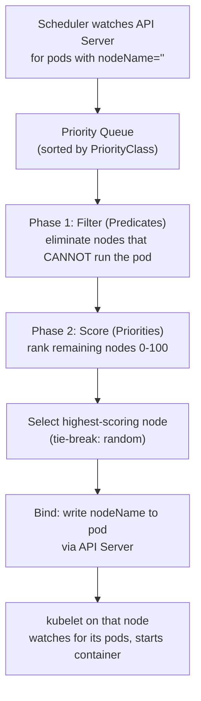
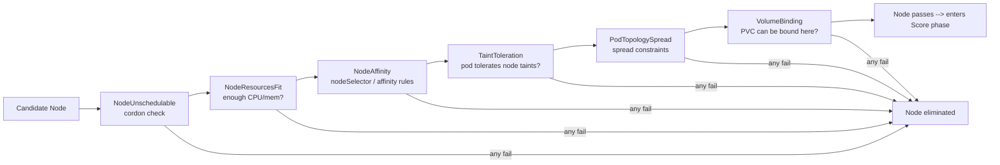
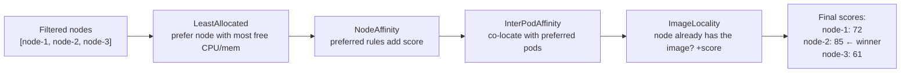
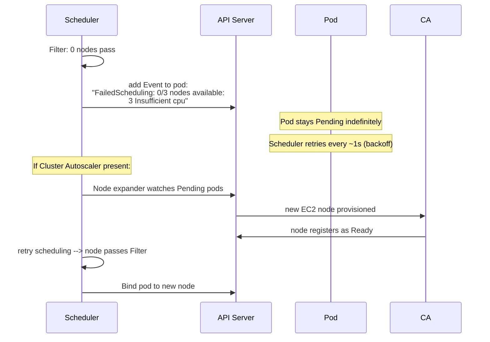
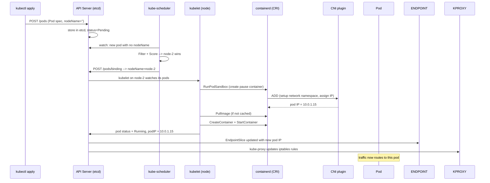

# Kubernetes Scheduler — Deep Internals

A pod that comes in without a `nodeName` doesn't get scheduled by magic — it moves through a strict two-phase pipeline (Filter, then Score), gets bound to whichever node wins, and only then does that node's kubelet take over and actually start it. This guide walks through that whole pipeline, what happens when no node fits, and the taint/toleration/affinity/topology-spread mechanics that feed into it.

<div class="quiz-progress" data-quiz-progress>
  <span class="quiz-progress-label">0/0 checks</span>
  <span class="quiz-progress-bar"><span class="quiz-progress-fill"></span></span>
</div>

---

## How the Scheduler Works

The scheduler has one job: assign a `nodeName` to a Pod that has none. It runs a two-phase algorithm for every unscheduled pod.



<div class="quiz-card">
  <p class="quiz-q">What's the key difference between what the Filter phase does and what the Score phase does?</p>
  <button class="quiz-reveal">Reveal answer</button>
  <div class="quiz-a" hidden>Filter is a hard yes/no per node &mdash; it eliminates any node that <em>cannot</em> run the pod at all, and a node only needs to fail one filter plugin to be dropped entirely. Score never eliminates anything; it only ranks the nodes that already survived Filter, 0-100 each, to pick the best of whatever's left.</div>
</div>

---

## Phase 1: Filter Plugins

Every filter plugin runs for every node. A node is eliminated if **any** filter returns false.



Key filter plugins:

| Plugin | What it checks |
|--------|---------------|
| `NodeResourcesFit` | Node has enough `Allocatable - requested` CPU/memory |
| `NodeAffinity` | Pod's `nodeSelector` and `affinity.nodeAffinity` match node labels |
| `TaintToleration` | Pod's `tolerations` cover all node `taints` with `NoSchedule`/`NoExecute` |
| `PodTopologySpread` | `topologySpreadConstraints` — spread pods across zones/nodes |
| `VolumeBinding` | PVC's storageClass zone matches node's zone |
| `NodeUnschedulable` | Node is not cordoned |

<div class="quiz-card">
  <p class="quiz-q">A node passes 5 of the 6 filter plugins above but fails <code>NodeResourcesFit</code>. Does it proceed to the Score phase?</p>
  <button class="quiz-reveal">Reveal answer</button>
  <div class="quiz-a" hidden>No. A node is eliminated the moment <em>any</em> filter plugin returns false &mdash; it doesn't matter how many others it would have passed. Every filter has to pass for a node to reach Score.</div>
</div>

Dynamic Resource Allocation (DRA) doesn't add a row to the filter-plugin table above — it's a newer, separate scheduler extension point, the `DynamicResources` plugin, that sits alongside Filter/Score rather than inside either phase. That's because it isn't doing a scalar `Allocatable - requested` check the way `NodeResourcesFit` does; it resolves `ResourceClaim`/`DeviceClass` binding instead, matching structured device attributes rather than comparing a single number against capacity. See [ai-infra/gpu-scheduling.md](../ai-infra/gpu-scheduling.md) for the full treatment of DeviceClass, ResourceClaim, and the capability gap it closes over the classic GPU extended-resource model.

---

## Phase 2: Score Plugins

Remaining nodes are scored 0-100 by each plugin. Final score = weighted sum.



| Plugin | Goal |
|--------|------|
| `LeastAllocated` | Spread load — pick the least-used node |
| `MostAllocated` | Bin-pack — fill nodes before using new ones (saves cost) |
| `NodeAffinity` | Honour preferred affinity rules |
| `ImageLocality` | Prefer nodes that already pulled the image (faster start) |
| `TaintToleration` | Nodes with matching tolerations get higher score |

<div class="quiz-card">
  <p class="quiz-q">If both <code>MostAllocated</code> and <code>LeastAllocated</code> were enabled as score plugins at real weight for the same cluster, would they push scheduling decisions in the same direction?</p>
  <button class="quiz-reveal">Reveal answer</button>
  <div class="quiz-a" hidden>No &mdash; they're opposites. <code>LeastAllocated</code> favors the node with the most free capacity (spread load out); <code>MostAllocated</code> favors the node that's already more full (bin-pack, to free up whole nodes elsewhere). The final score is a weighted sum across every enabled plugin, so running both with meaningful weight would just fight each other rather than push toward one clear strategy.</div>
</div>

---

## What Happens When No Node Passes Filter



### FailedScheduling events — what they mean

```bash
kubectl describe pod <pod> -n <namespace>
# Events:
#   Warning  FailedScheduling  0/3 nodes available:
#     3 Insufficient cpu                    → raise CPU requests or add nodes
#     3 node(s) had untolerated taint       → add toleration to pod
#     3 node(s) didn't match node affinity  → fix nodeSelector/affinity
#     1 pod has unbound PVC                 → PVC not bound, check StorageClass
#     3 node(s) didn't match topology       → spread constraints impossible
```

<div class="quiz-card">
  <p class="quiz-q">A pod shows FailedScheduling due to insufficient CPU on all 3 nodes, and there's no Cluster Autoscaler in the cluster. Does the pod eventually get scheduled on its own?</p>
  <button class="quiz-reveal">Reveal answer</button>
  <div class="quiz-a" hidden>No. It stays Pending indefinitely &mdash; the scheduler keeps retrying roughly every second, but retrying doesn't create capacity. Without something that adds nodes (an autoscaler) or something that changes the constraint (requests lowered, a node uncordoned, etc.), the same nodes fail the same filter forever.</div>
</div>

---

## Full Flow: Pod Scheduled to a Node



Same sequence, one step at a time:

<div class="stepper">
  <div class="stepper-panels">
    <div class="stepper-panel active">
      <strong>1. Pod submitted.</strong> <code>kubectl apply</code> POSTs the pod spec to the API server with <code>nodeName=''</code>. It lands in etcd with <code>status=Pending</code> &mdash; nothing is running yet.
    </div>
    <div class="stepper-panel">
      <strong>2. Scheduler picks it up.</strong> kube-scheduler is watching the API server for exactly this &mdash; pods with no <code>nodeName</code> &mdash; and drops it into its priority queue, sorted by <code>PriorityClass</code>.
    </div>
    <div class="stepper-panel">
      <strong>3. Filter phase.</strong> Every filter plugin runs against every node. A node is eliminated the moment any single filter returns false &mdash; <code>NodeResourcesFit</code>, <code>NodeAffinity</code>, <code>TaintToleration</code>, <code>PodTopologySpread</code>, <code>VolumeBinding</code>, and <code>NodeUnschedulable</code> all get a vote.
    </div>
    <div class="stepper-panel">
      <strong>4. Score phase.</strong> Only nodes that survived Filter get scored, 0-100, by each score plugin (<code>LeastAllocated</code>, <code>NodeAffinity</code>, <code>InterPodAffinity</code>, <code>ImageLocality</code>, ...). A node's final score is the weighted sum across every enabled plugin.
    </div>
    <div class="stepper-panel">
      <strong>5. Bind.</strong> The highest-scoring node wins, ties broken randomly. The scheduler doesn't contact the node directly &mdash; it POSTs a <code>Binding</code> object to the API server, which writes <code>nodeName</code> onto the pod.
    </div>
    <div class="stepper-panel">
      <strong>6. kubelet takes over.</strong> The kubelet on the winning node is watching for pods assigned to it. It calls containerd's <code>RunPodSandbox</code>, the CNI plugin sets up the network namespace and assigns a pod IP, the image is pulled if it isn't cached, and the container starts. Pod status flips to <code>Running</code>.
    </div>
    <div class="stepper-panel">
      <strong>7. Service wiring catches up.</strong> Only now does the API server update the relevant <code>EndpointSlice</code> with the new pod IP, and kube-proxy rewrites its iptables rules on every node. Traffic doesn't reach the pod until this last step completes.
    </div>
  </div>
  <div class="stepper-controls">
    <button class="stepper-prev">← Prev</button>
    <span class="stepper-dots"></span>
    <span class="stepper-label"></span>
    <button class="stepper-next">Next →</button>
  </div>
</div>

<div class="quiz-card">
  <p class="quiz-q">Once the scheduler binds a pod to node-2, does traffic immediately start routing to it?</p>
  <button class="quiz-reveal">Reveal answer</button>
  <div class="quiz-a" hidden>No. Binding only writes <code>nodeName</code> &mdash; the kubelet still has to pull/start the container and get its IP from the CNI plugin, and only after the pod is <code>Running</code> does the API server propagate that IP into an EndpointSlice, which kube-proxy then turns into iptables rules. Traffic flows only after that last step.</div>
</div>

### Try It Yourself: Live Filter + Score

Four nodes, 8 CPU each, all empty. Add a pod with a CPU request (leave it blank for a random 1-4) and watch the same two phases from above run for real: **Filter** drops any node that doesn't have enough free CPU, then **Score** ranks whatever's left with `LeastAllocated` &mdash; `score = (capacity - used) / capacity`, highest free-fraction wins, ties broken by lowest node index instead of the real scheduler's random tie-break so this demo stays reproducible. Push a pod too big for every remaining node and it lands in Pending instead of blocking, exactly like the `FailedScheduling` case above. Removing a bound pod frees its capacity immediately, but a pod already sitting in Pending is **not** auto-rescheduled &mdash; the real scheduler only retries on its own trigger, not the instant capacity opens up.

<div class="structure-viz" id="scheduler-live-viz">
  <svg class="viz-canvas" viewBox="0 0 640 220"></svg>
  <div class="viz-controls">
    <input class="viz-input" type="number" min="1" max="8" placeholder="CPU (blank=random 1-4)" />
    <button class="viz-btn" data-viz-action="insert">Add Pod</button>
    <input class="viz-input" type="text" placeholder="pod id e.g. P3" />
    <button class="viz-btn viz-btn-danger" data-viz-action="delete">Delete</button>
    <button class="viz-btn" data-viz-action="reset">Reset</button>
  </div>
  <div class="viz-status"></div>
  <div class="viz-legend">
    <span><span class="viz-swatch" style="background:#1e3a8a"></span> bound capacity</span>
    <span><span class="viz-swatch" style="background:#14532d"></span> just scheduled</span>
    <span><span class="viz-swatch" style="background:#7f1d1d"></span> pending (unschedulable)</span>
  </div>
</div>

<script>
(function () {
  const svgNS = 'http://www.w3.org/2000/svg';
  const root0 = document.getElementById('scheduler-live-viz');
  const svg = root0.querySelector('.viz-canvas');
  const cpuInput = root0.querySelectorAll('.viz-input')[0];
  const idInput = root0.querySelectorAll('.viz-input')[1];
  const status = root0.querySelector('.viz-status');

  const NODE_COUNT = 4;
  const NODE_CAPACITY = 8;

  let nodes, pending, podCounter, flashNodeIndex, flashPendingId, flashTimer;

  function reset() {
    nodes = Array.from({ length: NODE_COUNT }, (_, i) => ({ index: i, capacity: NODE_CAPACITY, used: 0, pods: [] }));
    pending = [];
    podCounter = 0;
    flashNodeIndex = null;
    flashPendingId = null;
  }

  function randomCpu() {
    return 1 + Math.floor(Math.random() * 4); // default 1-4 when left blank
  }

  // Filter + Score, pure (no mutation) -- also reused to check whether a
  // pending pod would now fit after a removal frees capacity.
  function filterAndScore(cpuRequest) {
    const eligible = nodes.filter((n) => n.capacity - n.used >= cpuRequest);
    if (eligible.length === 0) return { eligible };
    // LeastAllocated: score = (capacity - used) / capacity -- higher free-fraction wins.
    // Tie-break: lowest node index. The real scheduler tie-breaks randomly; this
    // demo uses lowest-index instead so it stays deterministic and testable.
    let winner = eligible[0];
    let bestScore = (winner.capacity - winner.used) / winner.capacity;
    let tie = false;
    for (let i = 1; i < eligible.length; i++) {
      const n = eligible[i];
      const s = (n.capacity - n.used) / n.capacity;
      if (s > bestScore) { winner = n; bestScore = s; tie = false; }
      else if (s === bestScore) { tie = true; }
    }
    return { eligible, winner, score: bestScore, tie };
  }

  function el(tag, attrs) {
    const e = document.createElementNS(svgNS, tag);
    for (const k in attrs) e.setAttribute(k, attrs[k]);
    return e;
  }

  function setStatus(msg, kind) {
    status.textContent = msg;
    status.className = 'viz-status' + (kind === 'ok' ? ' viz-status-ok' : kind === 'error' ? ' viz-status-error' : '');
  }

  function scheduleFlashClear() {
    clearTimeout(flashTimer);
    flashTimer = setTimeout(() => { flashNodeIndex = null; flashPendingId = null; draw(); }, 1600);
  }

  function addPod(cpuRequestRaw) {
    let cpu;
    if (cpuRequestRaw === undefined || cpuRequestRaw === null || cpuRequestRaw === '' || isNaN(cpuRequestRaw)) {
      cpu = randomCpu();
    } else {
      cpu = Math.round(Number(cpuRequestRaw));
      if (cpu < 1) cpu = 1;
    }

    const podId = 'P' + ++podCounter;
    const { winner, score, tie } = filterAndScore(cpu);

    if (!winner) {
      pending.push({ id: podId, cpu });
      flashNodeIndex = null;
      flashPendingId = podId;
      setStatus(`Pod ${podId} (${cpu} CPU) is Pending — no node has ${cpu} CPU free.`, 'error');
      return;
    }

    winner.pods.push({ id: podId, cpu });
    winner.used += cpu;
    flashNodeIndex = winner.index;
    flashPendingId = null;
    const freeAfter = winner.capacity - winner.used;
    const tieNote = tie ? ' (tied with another node, tie-broken by lowest node index)' : '';
    setStatus(
      `${podId} (${cpu} CPU) -> Node ${winner.index + 1} (${freeAfter}/${winner.capacity} free, score ${score.toFixed(3)}) — highest free capacity${tieNote}.`,
      'ok'
    );
  }

  function deletePod(podId) {
    if (!podId) { setStatus('Enter a pod id first, e.g. P3.', 'error'); return; }

    for (const node of nodes) {
      const idx = node.pods.findIndex((p) => p.id === podId);
      if (idx !== -1) {
        const [pod] = node.pods.splice(idx, 1);
        node.used -= pod.cpu;
        const freeNow = node.capacity - node.used;
        flashNodeIndex = null;
        flashPendingId = null;

        // Informational only -- does NOT auto-reschedule. Real k8s doesn't
        // retroactively rebind pending pods just because capacity freed up;
        // that needs a fresh scheduling attempt trigger.
        let hint = null;
        for (const p of pending) {
          if (nodes.some((n) => n.capacity - n.used >= p.cpu)) { hint = p; break; }
        }
        const hintNote = hint ? ` Pod ${hint.id} (${hint.cpu} CPU) could now be manually re-added and would likely succeed.` : '';
        setStatus(`Removed ${podId} (${pod.cpu} CPU) from Node ${node.index + 1} — ${freeNow}/${node.capacity} free now.${hintNote}`, 'ok');
        return;
      }
    }

    const pidx = pending.findIndex((p) => p.id === podId);
    if (pidx !== -1) {
      pending.splice(pidx, 1);
      flashPendingId = null;
      setStatus(`Removed ${podId} from Pending.`, 'ok');
      return;
    }

    setStatus(`Pod ${podId} not found.`, 'error');
  }

  function draw() {
    svg.setAttribute('viewBox', '0 0 640 220');
    while (svg.firstChild) svg.removeChild(svg.firstChild);

    const gaugeW = 60, gaugeH = 120, gaugeY = 20, gap = 26, startX = 30;

    nodes.forEach((node, i) => {
      const x = startX + i * (gaugeW + gap);

      // Outline (full capacity).
      svg.appendChild(el('rect', { x, y: gaugeY, width: gaugeW, height: gaugeH, rx: 6, class: 'viz-edge', fill: 'none' }));

      // Filled portion = used, growing up from the bottom.
      const fillH = (node.used / node.capacity) * gaugeH;
      if (fillH > 0) {
        const cls = i === flashNodeIndex ? 'viz-node-new' : 'viz-node';
        svg.appendChild(el('rect', {
          x, y: gaugeY + (gaugeH - fillH), width: gaugeW, height: fillH, rx: 6, class: cls,
        }));
      }

      const title = el('text', { x: x + gaugeW / 2, y: gaugeY - 6, class: 'viz-label-dim' });
      title.textContent = `Node ${i + 1}`;
      svg.appendChild(title);

      const usedLabel = el('text', { x: x + gaugeW / 2, y: gaugeY + gaugeH + 14 });
      usedLabel.textContent = `${node.used}/${node.capacity}`;
      svg.appendChild(usedLabel);

      const maxLines = 6;
      node.pods.slice(0, maxLines).forEach((pod, li) => {
        const t = el('text', { x: x + gaugeW / 2, y: gaugeY + gaugeH + 30 + li * 12, class: 'viz-label-dim' });
        t.textContent = `${pod.id} (${pod.cpu})`;
        svg.appendChild(t);
      });
      if (node.pods.length > maxLines) {
        const t = el('text', { x: x + gaugeW / 2, y: gaugeY + gaugeH + 30 + maxLines * 12, class: 'viz-label-dim' });
        t.textContent = `+${node.pods.length - maxLines} more`;
        svg.appendChild(t);
      }
    });

    // Pending box, to the right of the four node gauges.
    const pendX = startX + NODE_COUNT * (gaugeW + gap) + 10;
    const pendW = 640 - pendX - 20;
    const pendH = gaugeH + 40;
    svg.appendChild(el('rect', { x: pendX, y: gaugeY, width: pendW, height: pendH, rx: 6, class: 'viz-edge', fill: 'none' }));
    const pendTitle = el('text', { x: pendX + pendW / 2, y: gaugeY - 6, class: 'viz-label-dim' });
    pendTitle.textContent = 'Pending';
    svg.appendChild(pendTitle);

    if (pending.length === 0) {
      const t = el('text', { x: pendX + pendW / 2, y: gaugeY + pendH / 2, class: 'viz-label-dim' });
      t.textContent = '(empty)';
      svg.appendChild(t);
    } else {
      const maxLines = 9;
      pending.slice(0, maxLines).forEach((pod, li) => {
        const cls = pod.id === flashPendingId ? 'viz-node-removing' : 'viz-edge';
        svg.appendChild(el('rect', {
          x: pendX + 8, y: gaugeY + 6 + li * 15, width: 12, height: 12, rx: 3, class: cls,
        }));
        const t = el('text', {
          x: pendX + 26, y: gaugeY + 15 + li * 15, 'text-anchor': 'start', class: 'viz-label-dim',
        });
        t.textContent = `${pod.id} (${pod.cpu} CPU)`;
        svg.appendChild(t);
      });
      if (pending.length > maxLines) {
        const t = el('text', {
          x: pendX + 26, y: gaugeY + 15 + maxLines * 15, 'text-anchor': 'start', class: 'viz-label-dim',
        });
        t.textContent = `+${pending.length - maxLines} more`;
        svg.appendChild(t);
      }
    }
  }

  root0.querySelector('[data-viz-action="insert"]').addEventListener('click', () => {
    addPod(cpuInput.value.trim());
    cpuInput.value = '';
    draw();
    scheduleFlashClear();
  });

  root0.querySelector('[data-viz-action="delete"]').addEventListener('click', () => {
    deletePod(idInput.value.trim());
    idInput.value = '';
    draw();
    scheduleFlashClear();
  });

  root0.querySelector('[data-viz-action="reset"]').addEventListener('click', () => {
    reset();
    setStatus('Reset — 4 empty nodes, 8 CPU each.', '');
    draw();
  });

  reset();
  setStatus('4 nodes, 8 CPU each. Add pods (blank CPU = random 1-4) and watch Filter+Score place them, or force one to go Pending.', '');
  draw();
})();
</script>

---

## Taints, Tolerations, and Affinity

### Taints — repel pods from nodes

```bash
# Taint a node (no GPU pods without toleration)
kubectl taint node gpu-node-1 nvidia.com/gpu=present:NoSchedule
#                             key=value:effect
# Effects: NoSchedule | PreferNoSchedule | NoExecute
```

The three effects aren't interchangeable severity levels of the same thing — flip through what each actually does:

<div class="toggle-switch">
  <div class="toggle-buttons">
    <button data-toggle-opt="prefernoschedule" class="active state-ok">PreferNoSchedule</button>
    <button data-toggle-opt="noschedule" class="state-warn">NoSchedule</button>
    <button data-toggle-opt="noexecute" class="state-bad">NoExecute</button>
  </div>
  <div class="toggle-panel active" data-toggle-panel="prefernoschedule">
    <strong>Soft block, new pods only.</strong> The scheduler tries to avoid placing untolerated pods here, but it's not a hard rule &mdash; if nothing else fits, the pod can still land on this node.
  </div>
  <div class="toggle-panel" data-toggle-panel="noschedule">
    <strong>Hard block, new pods only.</strong> A pod without a matching toleration will not be scheduled onto this node, full stop &mdash; but pods already running here before the taint was added are left alone.
  </div>
  <div class="toggle-panel" data-toggle-panel="noexecute">
    <strong>Evicts, doesn't just block.</strong> Untolerated pods already running on this node get evicted, not merely kept off it going forward. A toleration can add <code>tolerationSeconds</code> to delay that eviction instead of tolerating it forever.
  </div>
</div>

### Tolerations — allow pods onto tainted nodes

```yaml
spec:
  tolerations:
  - key: "nvidia.com/gpu"
    operator: "Exists"
    effect: "NoSchedule"
```

### Node Affinity — attract pods to nodes

```yaml
spec:
  affinity:
    nodeAffinity:
      # Hard rule: pod MUST land on a node with this label
      requiredDuringSchedulingIgnoredDuringExecution:
        nodeSelectorTerms:
        - matchExpressions:
          - key: topology.kubernetes.io/zone
            operator: In
            values: ["us-east-1a", "us-east-1b"]

      # Soft rule: prefer nodes with this label, but not required
      preferredDuringSchedulingIgnoredDuringExecution:
      - weight: 100
        preference:
          matchExpressions:
          - key: node.kubernetes.io/instance-type
            operator: In
            values: ["m5.2xlarge"]
```

These two blocks behave like the Filter/Score split from earlier — one is a hard eligibility rule, the other is only a scoring hint:

<div class="tab-group">
  <div class="tab-buttons">
    <button data-tab="required" class="active">Required (hard)</button>
    <button data-tab="preferred">Preferred (soft)</button>
  </div>
  <div class="tab-panels">
    <div class="tab-panel active" data-tab-panel="required">
      <strong><code>requiredDuringSchedulingIgnoredDuringExecution</code></strong> acts like an extra Filter plugin: the pod <em>must</em> land on a node matching one of the <code>nodeSelectorTerms</code>. No match on any node means the pod stays unscheduled, same as failing any other filter.
    </div>
    <div class="tab-panel" data-tab-panel="preferred">
      <strong><code>preferredDuringSchedulingIgnoredDuringExecution</code></strong> acts like an extra Score plugin: matching nodes get a score boost proportional to <code>weight</code>, but a non-matching node is still eligible &mdash; it just ranks lower and can still win if nothing else beats it.
    </div>
  </div>
</div>

### Topology Spread Constraints — spread across zones

```yaml
spec:
  topologySpreadConstraints:
  - maxSkew: 1                          # max diff in pod count between zones
    topologyKey: topology.kubernetes.io/zone
    whenUnsatisfiable: DoNotSchedule   # or ScheduleAnyway
    labelSelector:
      matchLabels:
        app: api
```

<div class="quiz-card">
  <p class="quiz-q">A pod has a toleration that matches a node's taint. Does that mean the scheduler will prefer to place the pod on that node?</p>
  <button class="quiz-reveal">Reveal answer</button>
  <div class="quiz-a" hidden>No. A toleration only removes the block &mdash; it makes the node eligible again, the same way passing a filter does. It doesn't attract or score the pod toward that node. Actually pulling a pod toward a specific node needs a separate mechanism, like node affinity's preferred rules.</div>
</div>
