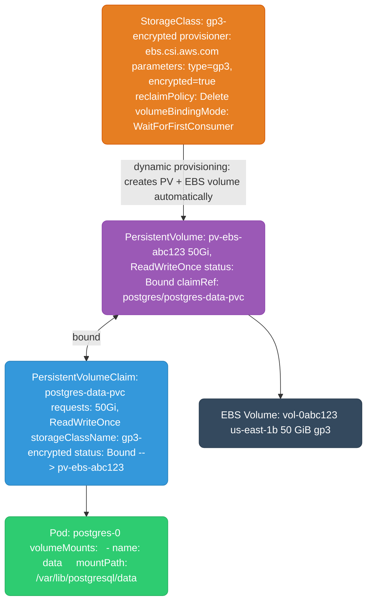
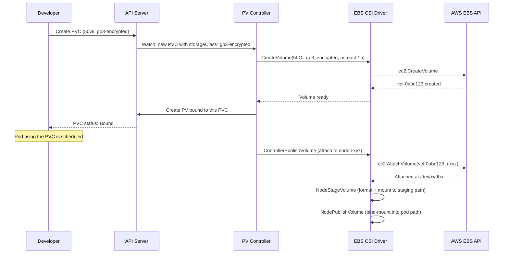
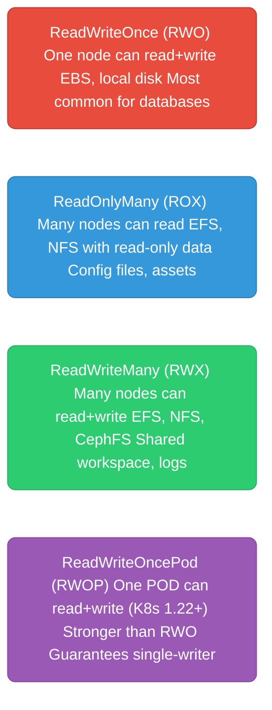
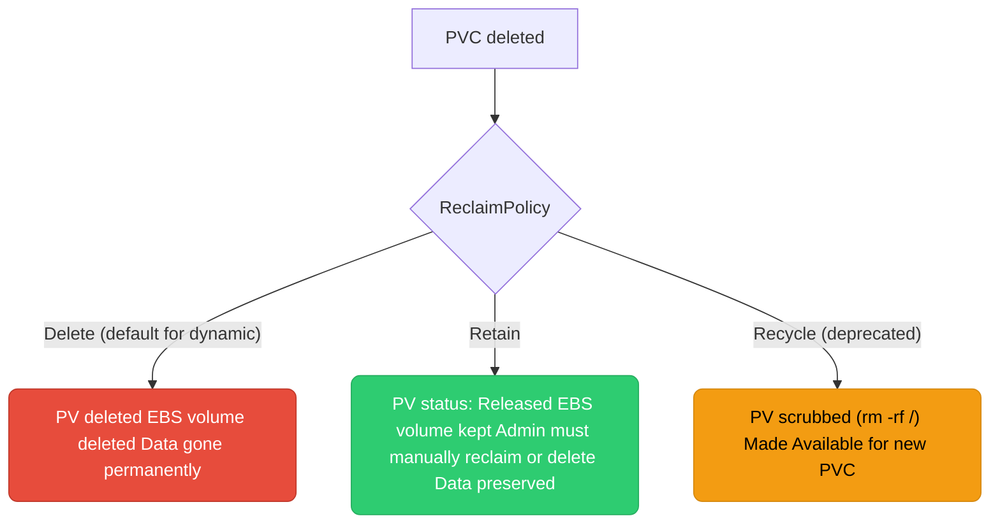
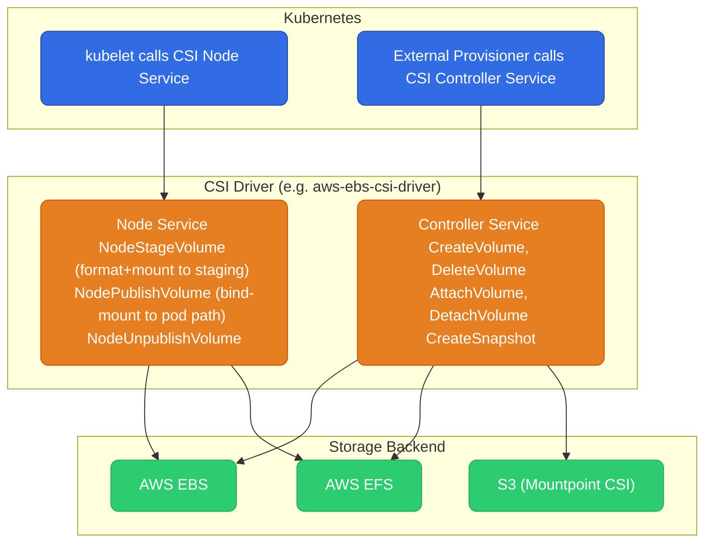
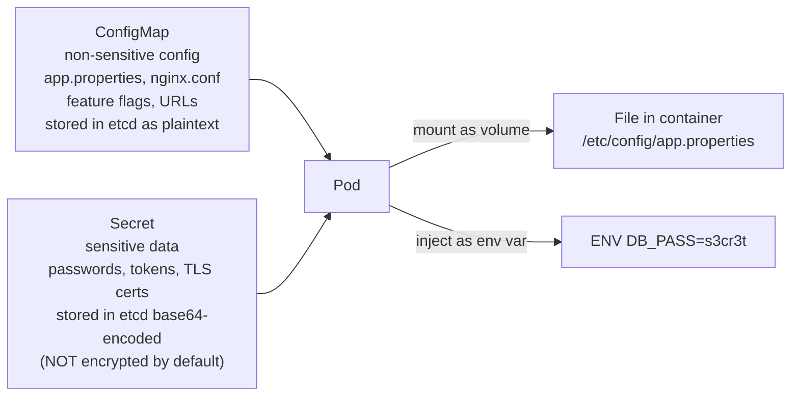

# Kubernetes Storage

Kubernetes storage is three separate objects — StorageClass, PersistentVolume, and PersistentVolumeClaim — plus the CSI driver that actually talks to the disk. This guide walks through how those layers fit together, the tradeoffs in access modes and reclaim policies, and how dynamic provisioning and volume snapshots work end to end.

<div class="quiz-progress" data-quiz-progress>
  <span class="quiz-progress-label">0/0 checks</span>
  <span class="quiz-progress-bar"><span class="quiz-progress-fill"></span></span>
</div>

---

## PV / PVC / StorageClass — The Three-Layer Model



**The three layers:**
- **StorageClass** — describes the type of storage (provisioner, disk type, encryption, reclaim policy). Created once by an admin, used by many PVCs.
- **PersistentVolume (PV)** — represents an actual piece of storage. Can be pre-provisioned by admin or dynamically created by the CSI driver when a PVC is created.
- **PersistentVolumeClaim (PVC)** — a pod's request for storage. Declares size and access mode. Kubernetes binds it to a matching PV.

<div class="quiz-card">
  <p class="quiz-q">In dynamic provisioning, which gets created first — the PV or the PVC?</p>
  <button class="quiz-reveal">Reveal answer</button>
  <div class="quiz-a" hidden>The PVC. A developer creates the PVC referencing a StorageClass; the StorageClass's provisioner then creates the PV (and the underlying disk) automatically in response. The PV isn't pre-existing and waiting to be claimed &mdash; it's manufactured on demand because the PVC asked for it.</div>
</div>

---

## Dynamic Provisioning Flow



**volumeBindingMode: WaitForFirstConsumer** — PV/EBS not provisioned until a pod using the PVC is scheduled. Prevents EBS volumes in the wrong AZ. Always use this for EBS.

Same flow, broken into the four checkpoints that matter — step through it:

<div class="stepper">
  <div class="stepper-panels">
    <div class="stepper-panel active">
      <strong>1. PVC created.</strong> A developer creates a PVC requesting 50Gi with <code>storageClassName: gp3-encrypted</code>. Because <code>volumeBindingMode</code> is <code>WaitForFirstConsumer</code>, nothing is provisioned yet &mdash; the PVC just sits there.
    </div>
    <div class="stepper-panel">
      <strong>2. StorageClass read.</strong> The PV controller sees the PVC references <code>gp3-encrypted</code> and reads that StorageClass's provisioner (<code>ebs.csi.aws.com</code>) and parameters (type, encrypted, reclaim policy) &mdash; but still waits, since no pod has claimed the PVC yet.
    </div>
    <div class="stepper-panel">
      <strong>3. CSI driver called.</strong> Once a pod using the PVC is scheduled onto a node, the controller calls the EBS CSI driver's <code>CreateVolume</code>, which calls <code>ec2:CreateVolume</code> against the AWS API in that node's AZ.
    </div>
    <div class="stepper-panel">
      <strong>4. PV bound.</strong> The CSI driver reports the new EBS volume ready; the controller creates a PV pointing at it and binds it to the PVC. The PVC's status flips to <code>Bound</code>, and <code>NodeStageVolume</code>/<code>NodePublishVolume</code> format and mount it into the pod.
    </div>
  </div>
  <div class="stepper-controls">
    <button class="stepper-prev">← Prev</button>
    <span class="stepper-dots"></span>
    <span class="stepper-label"></span>
    <button class="stepper-next">Next →</button>
  </div>
</div>

<div class="quiz-card">
  <p class="quiz-q">With volumeBindingMode: WaitForFirstConsumer, when does the actual EBS volume get created — at PVC creation, or later?</p>
  <button class="quiz-reveal">Reveal answer</button>
  <div class="quiz-a" hidden>Later &mdash; only once a pod using the PVC has been scheduled onto a node. This is deliberate: it lets Kubernetes provision the EBS volume in the same AZ as the pod, instead of guessing at PVC-creation time and possibly landing the volume in the wrong AZ from the pod.</div>
</div>

---

## Access Modes



| Access Mode | Storage backends | Use case |
|-------------|-----------------|----------|
| `ReadWriteOnce` | EBS, local disk | Single-pod databases (Postgres, MySQL) |
| `ReadOnlyMany` | EFS, NFS, S3 (via CSI) | Shared config, ML model serving |
| `ReadWriteMany` | EFS, NFS, CephFS, Portworx | Shared workspaces, legacy apps |
| `ReadWriteOncePod` | EBS, CSI drivers | Strict single-writer guarantee |

Flip between the four and notice what actually changes at each step — how many nodes, and read vs read+write:

<div class="toggle-switch">
  <div class="toggle-buttons">
    <button data-toggle-opt="rwo" class="active">RWO</button>
    <button data-toggle-opt="rox">ROX</button>
    <button data-toggle-opt="rwx">RWX</button>
    <button data-toggle-opt="rwop">RWOP</button>
  </div>
  <div class="toggle-panel active" data-toggle-panel="rwo">
    <strong>ReadWriteOnce.</strong> One node can mount the volume read+write. Backed by EBS or local disk. The most common mode for databases (Postgres, MySQL) &mdash; note this is a per-<em>node</em> restriction, not per-pod: multiple pods scheduled on that same node can still mount it.
  </div>
  <div class="toggle-panel" data-toggle-panel="rox">
    <strong>ReadOnlyMany.</strong> Many nodes can mount the volume, read-only. Backed by EFS or NFS. Good fit for config files and assets that many pods need to read but none should write.
  </div>
  <div class="toggle-panel" data-toggle-panel="rwx">
    <strong>ReadWriteMany.</strong> Many nodes can mount the volume read+write at once. Backed by EFS, NFS, or CephFS. Used for shared workspaces and logs where multiple writers genuinely need to land in the same place.
  </div>
  <div class="toggle-panel" data-toggle-panel="rwop">
    <strong>ReadWriteOncePod (K8s 1.22+).</strong> Only one <em>pod</em> in the whole cluster can mount it read+write &mdash; stronger than RWO, which only restricts by node. Use this when you need an actual single-writer guarantee, not just "single node."
  </div>
</div>

<div class="quiz-card">
  <p class="quiz-q">What's the actual difference between ReadWriteOnce and ReadWriteOncePod?</p>
  <button class="quiz-reveal">Reveal answer</button>
  <div class="quiz-a" hidden>RWO restricts the volume to a single <em>node</em> &mdash; other pods on that same node can still mount it. RWOP restricts it to a single <em>pod</em>, cluster-wide, which is a strictly stronger guarantee. If you need to be sure only one process anywhere is writing, RWO isn't enough by itself &mdash; RWOP is.</div>
</div>

---

## Reclaim Policies

What happens to the PV (and underlying disk) when the PVC is deleted:



**Production rule:** Use `Retain` for databases in production. Use `Delete` for ephemeral/dev workloads. Never lose data accidentally.

<div class="toggle-switch">
  <div class="toggle-buttons">
    <button data-toggle-opt="delete" class="active state-warn">Delete</button>
    <button data-toggle-opt="retain" class="state-ok">Retain</button>
    <button data-toggle-opt="recycle" class="state-bad">Recycle</button>
  </div>
  <div class="toggle-panel active" data-toggle-panel="delete">
    <strong>Default for dynamic provisioning.</strong> Deleting the PVC deletes the PV and the underlying EBS volume with it. Data is gone permanently &mdash; fine for ephemeral/dev workloads, dangerous for anything you can't regenerate.
  </div>
  <div class="toggle-panel" data-toggle-panel="retain">
    <strong>Safe default for production databases.</strong> Deleting the PVC leaves the PV in <code>Released</code> status and keeps the EBS volume around. Data is preserved, but an admin has to manually reclaim or delete it &mdash; the PV doesn't automatically become available for a new PVC.
  </div>
  <div class="toggle-panel" data-toggle-panel="recycle">
    <strong>Deprecated &mdash; don't use.</strong> The PV gets scrubbed (effectively <code>rm -rf /</code>) and made <code>Available</code> again for a new PVC. Superseded by dynamic provisioning; only mentioned here because you may still see it on old clusters.
  </div>
</div>

<div class="quiz-card">
  <p class="quiz-q">A PV with reclaimPolicy: Retain has its PVC deleted. Is the underlying EBS volume deleted too?</p>
  <button class="quiz-reveal">Reveal answer</button>
  <div class="quiz-a" hidden>No. With Retain, the PV moves to Released status and the EBS volume is kept &mdash; data is preserved. An admin has to step in and manually reclaim or delete it; nothing happens to the disk automatically. That's the opposite of the Delete policy, where the PV and the EBS volume both disappear the moment the PVC is deleted.</div>
</div>

```yaml
apiVersion: storage.k8s.io/v1
kind: StorageClass
metadata:
  name: gp3-retain
provisioner: ebs.csi.aws.com
parameters:
  type: gp3
  encrypted: "true"
reclaimPolicy: Retain             # keep EBS volume after PVC deletion
volumeBindingMode: WaitForFirstConsumer
allowVolumeExpansion: true        # allow resize without recreating
```

---

## CSI (Container Storage Interface)

CSI is the standard interface between Kubernetes and storage vendors. Any storage system (EBS, EFS, Ceph, NetApp, etc.) can implement the CSI spec to work with Kubernetes.



**Why CSI replaced in-tree drivers:** Before CSI, storage drivers were compiled into the Kubernetes binary. Updating a storage driver required a Kubernetes upgrade. CSI drivers are out-of-tree — deployed as pods, updated independently.

**Required CSI drivers in EKS (as add-ons):**
- `aws-ebs-csi-driver` — PVCs backed by EBS (gp3, io2). Required since K8s 1.23 (in-tree deprecated).
- `aws-efs-csi-driver` — PVCs backed by EFS (ReadWriteMany across AZs).
- `mountpoint-s3-csi-driver` — mount S3 buckets as a filesystem (read-heavy workloads, ML data).

<div class="quiz-card">
  <p class="quiz-q">Why did moving storage drivers out-of-tree, into CSI, matter in practice?</p>
  <button class="quiz-reveal">Reveal answer</button>
  <div class="quiz-a" hidden>Before CSI, storage drivers were compiled into the Kubernetes binary itself, so updating a driver meant upgrading Kubernetes. CSI drivers are deployed as ordinary pods and updated independently of the cluster's Kubernetes version &mdash; you can bump the EBS CSI driver without touching the control plane at all.</div>
</div>

---

## Volume Snapshots

```yaml
# Create a snapshot of a PVC
apiVersion: snapshot.storage.k8s.io/v1
kind: VolumeSnapshot
metadata:
  name: postgres-snapshot-2026-01-15
spec:
  volumeSnapshotClassName: csi-aws-vsc
  source:
    persistentVolumeClaimName: postgres-data-pvc

---
# Restore from snapshot into a new PVC
apiVersion: v1
kind: PersistentVolumeClaim
metadata:
  name: postgres-data-restored
spec:
  dataSource:
    name: postgres-snapshot-2026-01-15
    kind: VolumeSnapshot
    apiGroup: snapshot.storage.k8s.io
  accessModes: [ReadWriteOnce]
  resources:
    requests:
      storage: 50Gi
  storageClassName: gp3-retain
```

Use snapshots for: pre-upgrade database backups, cloning production data to staging, disaster recovery checkpoints.

The restore path above is really five steps end to end, and it's easy to lose track of which object triggers which. Step through it:

<div class="stepper">
  <div class="stepper-panels">
    <div class="stepper-panel active">
      <strong>1. VolumeSnapshot created.</strong> A <code>VolumeSnapshot</code> object is created pointing at the source PVC (<code>postgres-data-pvc</code>) via <code>volumeSnapshotClassName: csi-aws-vsc</code>. The source PVC and its pod keep running untouched.
    </div>
    <div class="stepper-panel">
      <strong>2. CSI driver snapshots the volume.</strong> The CSI driver's Controller Service (<code>CreateSnapshot</code>) calls the storage backend's snapshot API against the underlying EBS volume. The <code>VolumeSnapshot</code> object turns <code>ReadyToUse</code> once that completes.
    </div>
    <div class="stepper-panel">
      <strong>3. New PVC references the snapshot.</strong> A brand-new PVC (<code>postgres-data-restored</code>) is created with <code>dataSource</code> pointing at the <code>VolumeSnapshot</code>, instead of being left blank like an ordinary PVC.
    </div>
    <div class="stepper-panel">
      <strong>4. CSI driver provisions a new volume from it.</strong> Same dynamic-provisioning path as an ordinary PVC &mdash; except the new EBS volume the CSI driver creates is seeded from the snapshot's data instead of starting empty.
    </div>
    <div class="stepper-panel">
      <strong>5. New PVC bound.</strong> <code>postgres-data-restored</code> binds to a brand-new PV and EBS volume containing the snapshot's data. The original PVC, its PV, and its EBS volume are completely untouched by any of this.
    </div>
  </div>
  <div class="stepper-controls">
    <button class="stepper-prev">← Prev</button>
    <span class="stepper-dots"></span>
    <span class="stepper-label"></span>
    <button class="stepper-next">Next →</button>
  </div>
</div>

---

## ConfigMap vs Secret



**Key differences:**

| | ConfigMap | Secret |
|--|-----------|--------|
| Data type | Non-sensitive | Sensitive (passwords, tokens, certs) |
| etcd storage | Plaintext | Base64-encoded (NOT encrypted without extra config) |
| K8s RBAC | `get configmaps` | `get secrets` (separate permission) |
| Mounted as | File or env var | File, env var, or imagePullSecret |
| Max size | 1MB | 1MB |

**Base64 ≠ encryption.** A Secret's value is base64-encoded in etcd — anyone with `kubectl get secret -o yaml` can decode it immediately. Real protection requires **encryption at rest**.

<div class="quiz-card">
  <p class="quiz-q">Is the data inside a Kubernetes Secret encrypted by default?</p>
  <button class="quiz-reveal">Reveal answer</button>
  <div class="quiz-a" hidden>No &mdash; it's only base64-encoded in etcd, which is trivially reversible, not encryption. Anyone with kubectl get secret -o yaml access can decode the value immediately. Actual protection requires explicitly configuring encryption at rest on the control plane (or a managed equivalent like EKS/GKE envelope encryption).</div>
</div>

### Encryption at Rest

```yaml
# /etc/kubernetes/encryption-config.yaml (on control plane)
apiVersion: apiserver.config.k8s.io/v1
kind: EncryptionConfiguration
resources:
- resources: ["secrets"]
  providers:
  - aescbc:                          # AES-CBC encryption
      keys:
      - name: key1
        secret: <base64-encoded-32-byte-key>   # generated: head -c 32 /dev/urandom | base64
  - identity: {}                     # fallback: unencrypted (for existing secrets)
```

```bash
# Enable on kube-apiserver
--encryption-provider-config=/etc/kubernetes/encryption-config.yaml

# Encrypt all existing secrets (re-writes them with the new provider)
kubectl get secrets --all-namespaces -o json | kubectl replace -f -

# Verify a secret is encrypted in etcd
ETCDCTL_API=3 etcdctl get /registry/secrets/default/my-secret | hexdump -C | head
# If encrypted: shows random bytes, not recognizable base64
# If not encrypted: shows "k8s:enc:aescbc:v1:key1:" prefix if encrypted
```

**EKS/GKE managed encryption:**
```bash
# EKS: enable envelope encryption with KMS
aws eks create-cluster --name my-cluster \
  --encryption-config '[{"provider":{"keyArn":"arn:aws:kms:..."},"resources":["secrets"]}]'

# GKE: application-layer encryption (CMEK)
gcloud container clusters create my-cluster \
  --database-encryption-key projects/PROJECT/locations/REGION/keyRings/RING/cryptoKeys/KEY
```

### Using Secrets Safely

```yaml
# Mount as file (preferred for large secrets, certificates)
spec:
  volumes:
  - name: tls-cert
    secret:
      secretName: my-tls-secret
  containers:
  - volumeMounts:
    - name: tls-cert
      mountPath: /etc/ssl/certs
      readOnly: true

# Env var (avoid for multi-line secrets, visible in process list)
env:
- name: DB_PASSWORD
  valueFrom:
    secretKeyRef:
      name: db-secret
      key: password

# Never: hardcode in container spec or ConfigMap
# Never: commit Secret YAML with real values to git
# Better: use External Secrets Operator (ESO) → pull from AWS SM/Vault at runtime
```
