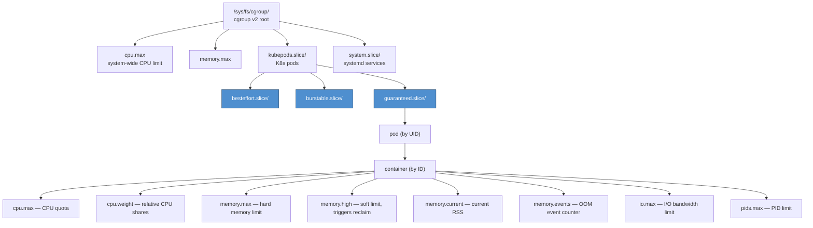

# cgroup v2 — Resource Control

cgroup v2 is the unified hierarchy used by all modern Linux distributions and Kubernetes (>= 1.25 with containerd).

<div class="quiz-progress" data-quiz-progress>
  <span class="quiz-progress-label">0/0 checks</span>
  <span class="quiz-progress-bar"><span class="quiz-progress-fill"></span></span>
</div>

---

## Hierarchy



Every container gets its own leaf directory under exactly one of the three QoS slices — which one it lands in is decided once, at pod admission, from the pod's resource `requests`/`limits`:

<div class="stepper">
  <div class="stepper-panels">
    <div class="stepper-panel active">
      <strong>1. Kubelet reads the pod spec.</strong> Every container's <code>resources.requests</code> and <code>resources.limits</code> for CPU and memory are compared.
    </div>
    <div class="stepper-panel">
      <strong>2. QoS class is assigned.</strong> <code>Guaranteed</code> if every container sets requests == limits for both CPU and memory; <code>BestEffort</code> if no container sets any request or limit at all; <code>Burstable</code> for everything in between.
    </div>
    <div class="stepper-panel">
      <strong>3. Pod lands in the matching slice.</strong> <code>guaranteed.slice</code>, <code>burstable.slice</code>, or <code>besteffort.slice</code> under <code>kubepods.slice/</code> — exactly the branch shown above.
    </div>
    <div class="stepper-panel">
      <strong>4. Per-container cgroup files are written.</strong> Inside <code>pod&lt;uid&gt;/&lt;container-id&gt;/</code>, the kubelet sets <code>cpu.max</code>/<code>cpu.weight</code> from the container's CPU requests/limits and <code>memory.max</code>/<code>memory.high</code> from its memory requests/limits.
    </div>
  </div>
  <div class="stepper-controls">
    <button class="stepper-prev">← Prev</button>
    <span class="stepper-dots"></span>
    <span class="stepper-label"></span>
    <button class="stepper-next">Next →</button>
  </div>
</div>

<div class="quiz-card">
  <p class="quiz-q">A pod's only container sets <code>resources.requests.cpu</code> but no <code>resources.limits.cpu</code>. Which QoS slice does it land in, and does it get a <code>cpu.max</code> quota?</p>
  <button class="quiz-reveal">Reveal answer</button>
  <div class="quiz-a" hidden>
    <code>burstable.slice</code> — a request is set but it can't equal a limit that was never set, so it doesn't qualify as <code>Guaranteed</code>, and it isn't <code>BestEffort</code> either since something was requested. Without a CPU limit there's no quota to enforce, so <code>cpu.max</code> stays <code>max</code> (unlimited) — only <code>cpu.weight</code> gets a meaningful value, from the request.
  </div>
</div>

---

## CPU Control

`cpu.max` and `cpu.weight` answer two different questions about the same resource — "how much, at most" vs. "how much, relative to everyone else" — and a single K8s container spec sets both at once.

<div class="tab-group">
  <div class="tab-buttons">
    <button data-tab="cpumax" class="active">cpu.max — quota (hard limit)</button>
    <button data-tab="cpuweight">cpu.weight — shares (relative)</button>
  </div>
  <div class="tab-panels">
    <div class="tab-panel active" data-tab-panel="cpumax">
      <strong>Absolute ceiling, enforced every period.</strong> Format is <code>quota period</code> in microseconds — <code>50000 100000</code> means 50ms of CPU time out of every 100ms window, i.e. 0.5 cores (500m in K8s notation). Hit the quota and the cgroup is throttled for the rest of that period, <em>even if every other core on the box is sitting idle</em>.
      <pre><code>cat /sys/fs/cgroup/kubepods.slice/.../cpu.max
# 50000 100000
# format: quota period (microseconds)
# 50000/100000 = 0.5 cores = 500m in K8s notation

# Set: 1 CPU out of every 100ms window
echo "100000 100000" > cpu.max

# Unlimited
echo "max 100000" > cpu.max</code></pre>
    </div>
    <div class="tab-panel" data-tab-panel="cpuweight">
      <strong>Relative scheduling priority, only matters under contention.</strong> Range 1-10000, default 100. Never a ceiling — a cgroup with <code>cpu.weight=200</code> only gets double the CPU share of a default-weight cgroup when they're actually competing for the same cores. With spare CPU available, a low-weight cgroup can still use as much as it wants.
      <pre><code>cat cpu.weight
# 100  ← default weight (range 1-10000)

# Double this cgroup's CPU share vs default
echo 200 > cpu.weight</code></pre>
    </div>
  </div>
</div>

### Throttling detection

```bash
cat cpu.stat
# usage_usec 123456789      ← total CPU time consumed
# user_usec  100000000
# system_usec 23456789
# nr_periods  1000           ← scheduler periods elapsed
# nr_throttled 234           ← periods where cgroup was throttled
# throttled_usec 4567890     ← total time throttled

# Throttle % = nr_throttled / nr_periods × 100
# > 5% sustained = CPU limit too low for workload
```

**K8s mapping:**

| K8s field | cgroup file | Formula |
|-----------|-------------|---------|
| `resources.limits.cpu: "500m"` | `cpu.max` | `50000 100000` |
| `resources.requests.cpu: "250m"` | `cpu.weight` | `round(1024 × 0.25)` = 256 |

<div class="quiz-card">
  <p class="quiz-q">A cgroup has cpu.weight=200 (double default) but the box has plenty of idle CPU right now. Does it actually get twice the CPU of a default-weight cgroup at this moment?</p>
  <button class="quiz-reveal">Reveal answer</button>
  <div class="quiz-a" hidden>Not necessarily. cpu.weight only governs relative scheduling <em>under contention</em> — with spare CPU available, both cgroups can use as much as they need with no throttling at all. The 2x share only shows up once they're actually competing for the same cores. cpu.max, not cpu.weight, is what caps usage even when the CPU is otherwise idle.</div>
</div>

---

## Memory Control

```bash
# Hard limit — exceeding this triggers OOM kill
cat memory.max       # e.g. 536870912 (512Mi)

# Soft limit — triggers aggressive reclaim before OOM
cat memory.high      # e.g. 483183820 (~90% of max)

# Current RSS
cat memory.current

# OOM events
cat memory.events
# low 0
# high 14          ← hit memory.high 14 times (reclaim triggered)
# max 0
# oom 0            ← full OOM kills
# oom_kill 0

# Kill entire cgroup on OOM (not just one process)
cat memory.oom.group   # 1 = enabled in K8s containers
```

`memory.high` and `memory.max` aren't two names for the same thing — they trigger two entirely different kernel responses, in sequence, as usage climbs:

<div class="stepper">
  <div class="stepper-panels">
    <div class="stepper-panel active">
      <strong>1. Normal operation.</strong> <code>memory.current</code> sits below <code>memory.high</code>. No throttling, no reclaim pressure from this cgroup's limits.
    </div>
    <div class="stepper-panel">
      <strong>2. Usage crosses memory.high.</strong> The kernel throttles the cgroup's tasks and forces reclaim to push usage back down — this is the "soft limit" behavior. Every time this trips, the <code>high</code> counter in <code>memory.events</code> increments.
    </div>
    <div class="stepper-panel">
      <strong>3a. Reclaim succeeds.</strong> Usage drops back under <code>memory.high</code>. The cgroup keeps running — slower during the reclaim, but nothing was killed.
    </div>
    <div class="stepper-panel">
      <strong>3b. Reclaim can't keep up, usage hits memory.max.</strong> The OOM killer engages. With <code>memory.oom.group=1</code> (the default in K8s containers), every process in the cgroup is killed together rather than picking just one — <code>memory.events</code>' <code>oom</code> and <code>oom_kill</code> counters increment.
    </div>
  </div>
  <div class="stepper-controls">
    <button class="stepper-prev">← Prev</button>
    <span class="stepper-dots"></span>
    <span class="stepper-label"></span>
    <button class="stepper-next">Next →</button>
  </div>
</div>

<div class="quiz-card">
  <p class="quiz-q">A container's memory.events shows "high 14" and "oom 0". Was the container OOM killed?</p>
  <button class="quiz-reveal">Reveal answer</button>
  <div class="quiz-a" hidden>No. <code>high</code> counts how many times the cgroup crossed <code>memory.high</code> and got throttled/reclaimed — a soft-limit event, not a kill. <code>oom</code> at 0 means the hard limit (<code>memory.max</code>) was never actually hit, so no process in the cgroup was killed; it just ran through 14 rounds of forced reclaim.</div>
</div>

---

## Memory Pressure Files (PSI)

PSI (Pressure Stall Information) measures how much time tasks are stalled waiting for a resource. Available for cpu, memory, io.

```bash
cat /proc/pressure/memory
# some avg10=0.50 avg60=1.20 avg300=0.80 total=12345678
# full avg10=0.10 avg60=0.30 avg300=0.20 total=3456789
#
# some = at least one task stalled
# full = ALL tasks stalled (severe — no progress at all)
# avg10/60/300 = % of time stalled over 10s/60s/5m windows

cat /proc/pressure/cpu
cat /proc/pressure/io

# Also per-cgroup:
cat /sys/fs/cgroup/kubepods.slice/pod<uid>/<cid>/memory.pressure
```

Every PSI file reports two severity lines, and mixing them up is the easiest way to misread a pressure alert:

<div class="toggle-switch">
  <div class="toggle-buttons">
    <button data-toggle-opt="some" class="active state-warn">some</button>
    <button data-toggle-opt="full" class="state-bad">full</button>
  </div>
  <div class="toggle-panel active" data-toggle-panel="some">
    <strong>At least one task stalled.</strong> Other tasks in the cgroup may still be making progress on the same resource — this line trips first and more often, and is your early warning that contention is building.
  </div>
  <div class="toggle-panel" data-toggle-panel="full">
    <strong>Every task stalled at once.</strong> Nobody in the cgroup is making progress on this resource, for that instant — no partial credit. Sustained non-zero <code>full</code> means the cgroup is completely stuck, not just slowed down.
  </div>
</div>

**Thresholds to alert on:**

| PSI metric | Warning | Critical |
|------------|---------|---------|
| `memory some avg60` | > 10% | > 30% |
| `memory full avg60` | > 1% | > 5% |
| `io full avg60` | > 5% | > 20% |

<div class="quiz-card">
  <p class="quiz-q">memory.pressure shows "some avg60=25.0" and "full avg60=0.0" for a container. Is any task in that cgroup completely stuck?</p>
  <button class="quiz-reveal">Reveal answer</button>
  <div class="quiz-a" hidden>No. "some" being elevated but "full" at 0 means at least one task is stalling on memory some of the time, but never all tasks at once &mdash; the cgroup as a whole is always making some progress. "full" is the line that means everyone's stuck simultaneously, and it's reading zero here.</div>
</div>

---

## I/O Control

```bash
# Format: MAJ:MIN rbps wbps riops wiops
cat io.max
# 8:0 rbps=10485760 wbps=10485760 riops=max wiops=max
# 10 MB/s read + write, unlimited IOPS

# Set limits (device 8:0)
echo "8:0 rbps=52428800 wbps=52428800" > io.max   # 50MB/s

# I/O usage stats
cat io.stat
# 8:0 rbytes=123456 wbytes=654321 rios=100 wios=200 dbytes=0 dios=0
```

---

## PID Limiting

```bash
# Prevent fork bombs
cat pids.max    # e.g. 1024
cat pids.current

# Set limit
echo 512 > pids.max
```

---

## Hands-on: Inspect a Running Container

```bash
# Find container's cgroup path
CONTAINER_ID=$(docker inspect --format '{{.Id}}' mycontainer)
CGROUP=/sys/fs/cgroup/system.slice/docker-${CONTAINER_ID}.scope

# CPU quota and current throttling
cat $CGROUP/cpu.max
cat $CGROUP/cpu.stat | grep throttled

# Memory usage vs limit
echo "Limit: $(cat $CGROUP/memory.max)"
echo "Usage: $(cat $CGROUP/memory.current)"
echo "OOM events: $(grep oom_kill $CGROUP/memory.events)"

# Is this container under memory pressure right now?
cat $CGROUP/memory.pressure
```

---

## cgroup v1 vs v2

| Feature | v1 | v2 |
|---------|----|----|
| Hierarchy | Multiple trees per subsystem | Single unified tree |
| CPU shares file | `cpu.shares` | `cpu.weight` |
| CPU quota file | `cpu.cfs_quota_us` | `cpu.max` |
| Memory limit | `memory.limit_in_bytes` | `memory.max` |
| PSI support | No | Yes |
| Writeback control | No | Yes |
| K8s default since | < 1.25 | >= 1.25 (containerd) |

```bash
# Check which version is active
stat -f -c %T /sys/fs/cgroup
# cgroup2fs → v2
# tmpfs     → v1 (hybrid if /sys/fs/cgroup/unified exists)
```

<div class="quiz-card">
  <p class="quiz-q">Under cgroup v1, could a single process be governed by completely unrelated hierarchies for its CPU limit and its memory limit? What about under v2?</p>
  <button class="quiz-reveal">Reveal answer</button>
  <div class="quiz-a" hidden>Yes under v1 &mdash; it uses multiple trees, one per subsystem, so CPU and memory controllers could each attach the process to a differently-structured hierarchy. v2 collapses this into a single unified tree: one hierarchy, one path per process, and every controller (cpu, memory, io, pids) applies along that same path.</div>
</div>
