# From chroot to Docker: The Container Evolution

Containers didn't appear out of nowhere in 2013. They are the result of four decades of OS isolation research, each layer solving the gaps left by the previous one. Understanding this progression explains why containers work the way they do.

<div class="quiz-progress" data-quiz-progress>
  <span class="quiz-progress-label">0/0 checks</span>
  <span class="quiz-progress-bar"><span class="quiz-progress-fill"></span></span>
</div>

---

## Evolution Timeline

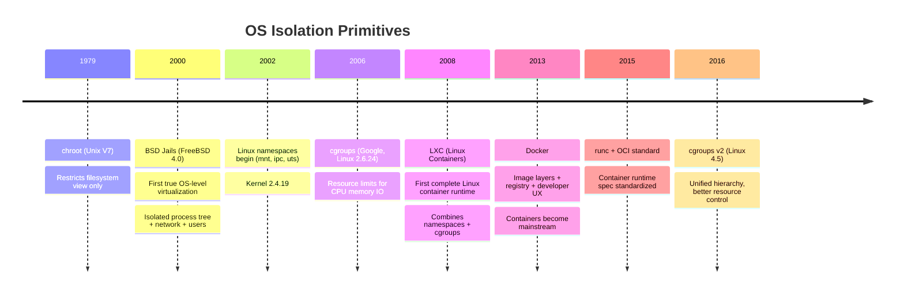

Same timeline, walked through one era at a time — what each one added, and specifically what gap in the previous era it closed:

<div class="stepper">
  <div class="stepper-panels">
    <div class="stepper-panel active">
      <strong>1. chroot (1979).</strong> Added: a process-local view of the filesystem root — everything below <code>/jail</code> looks like <code>/</code> to the jailed process. Problem solved: build isolation and system recovery, nothing more. It never touched process visibility, networking, users, or resource limits, and a root process inside it can simply <code>chroot()</code> again to escape — it was never meant as a security boundary.
    </div>
    <div class="stepper-panel">
      <strong>2. BSD Jails (2000).</strong> Added: a complete isolated environment per jail — own hostname, own IP(s), own process tree, own user namespace. Problem solved: every gap chroot left open. This was the first true OS-level virtualization, proving the idea could work — just FreeBSD-only, with no fine-grained resource limits and no concept of image layers yet.
    </div>
    <div class="stepper-panel">
      <strong>3. Linux namespaces (2002&ndash;2016).</strong> Added: the same isolation-of-visibility idea as Jails, but as separate kernel primitives (mnt, uts, ipc, pid, net, user, cgroup) rolled out one at a time over 14 years. Problem solved: gave Linux its own equivalent of Jails, piece by piece, instead of one bundled feature. It still only isolates what a process can <em>see</em> &mdash; a namespaced process can consume all the CPU and memory it wants.
    </div>
    <div class="stepper-panel">
      <strong>4. cgroups (2008).</strong> Added: limiting, accounting, and enforcement of actual resource usage &mdash; CPU, memory, IO, process count. Problem solved: exactly the gap namespaces left &mdash; controlling what a process can <em>use</em>, not just what it can see.
    </div>
    <div class="stepper-panel">
      <strong>5. LXC (2008).</strong> Added: namespaces + cgroups + a minimal init process, wired together into one usable runtime tool. Problem solved: nobody had to hand-assemble kernel primitives themselves anymore &mdash; effectively reimplementing BSD Jails on Linux. It still had no image layers, no standard image format or registry, and a poor developer experience.
    </div>
    <div class="stepper-panel">
      <strong>6. Docker (2013).</strong> Added: image layers (union FS/overlayfs), the Dockerfile, a registry, and a simple CLI &mdash; the developer workflow around containers. Problem solved: LXC's packaging and distribution gap. Docker didn't replace the kernel primitives underneath; namespaces and cgroups are unchanged, just wrapped in better tooling.
    </div>
    <div class="stepper-panel">
      <strong>7. runc + OCI standard (2015).</strong> Added: a standardized container runtime spec, with Docker's own <code>libcontainer</code> becoming the reference implementation, <code>runc</code>. Problem solved: portability &mdash; a standard spec means any OCI-compliant runtime can run any OCI-compliant image, instead of everything being locked to Docker's own implementation.
    </div>
  </div>
  <div class="stepper-controls">
    <button class="stepper-prev">← Prev</button>
    <span class="stepper-dots"></span>
    <span class="stepper-label"></span>
    <button class="stepper-next">Next →</button>
  </div>
</div>

<div class="quiz-card">
  <p class="quiz-q">Did Docker invent containers?</p>
  <button class="quiz-reveal">Reveal answer</button>
  <div class="quiz-a" hidden>No. Namespaces and cgroups already existed, and LXC had already combined them into a working container runtime five years earlier. Docker's contribution was the developer workflow on top of unchanged kernel primitives: image layers, the Dockerfile, a registry, and a simple CLI.</div>
</div>

---

## chroot (1979)

`chroot` changes the apparent root directory (`/`) for a process and its children. It was designed for build isolation and system recovery — not security.

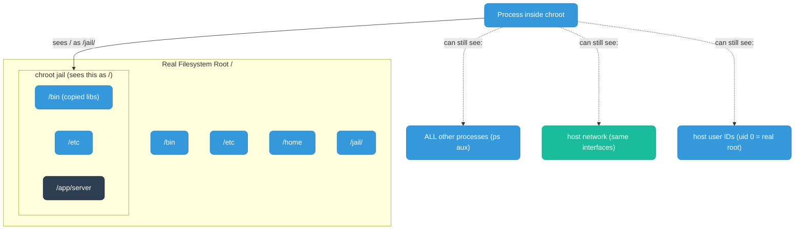

**What chroot does:** Restricts the process's view of the filesystem. Cannot access paths outside the jail root.

**What chroot does NOT do:**
- Process isolation — the jailed process can see and signal all host processes
- Network isolation — shares the host network stack completely
- User isolation — root inside the jail is root on the host
- Resource limits — can consume all CPU/memory

**How to escape:** A root process inside a chroot can call `chroot()` again to escape. It was never a security boundary.

```bash
# Create a minimal chroot jail
mkdir -p /jail/{bin,lib64}
cp /bin/bash /jail/bin/
# Copy required libraries
ldd /bin/bash | grep -o '/lib[^ ]*' | xargs -I{} cp {} /jail/lib64/
chroot /jail /bin/bash   # process now sees /jail as /
```

<div class="quiz-card">
  <p class="quiz-q">A process is running inside a chroot jail as root. Can it see and signal other processes on the host, and can it escape the jail entirely?</p>
  <button class="quiz-reveal">Reveal answer</button>
  <div class="quiz-a" hidden>Yes to both. chroot only restricts the filesystem view &mdash; it does nothing for process, network, or user isolation, and places no resource limits. Root inside the jail is root on the host, and a root process can simply call <code>chroot()</code> again to break out. It was designed for build isolation and system recovery, never as a security boundary.</div>
</div>

---

## BSD Jails (FreeBSD 4.0, 2000)

BSD Jails were the first true OS-level virtualization. They addressed all of chroot's gaps by creating a complete isolated environment per jail — each with its own hostname, IP address(es), process tree, and user namespace.

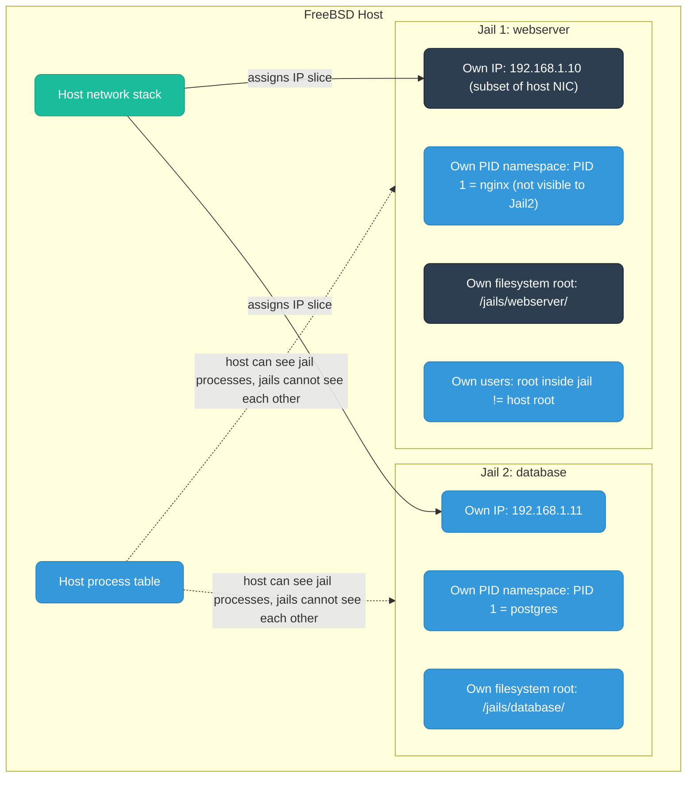

**What Jails added over chroot:**

| Feature | chroot | BSD Jail |
|---------|--------|----------|
| Filesystem isolation | Yes | Yes |
| Process isolation | No | Yes — own PID tree |
| Network isolation | No | Yes — own IP(s) |
| User isolation | No | Yes — root != host root |
| Resource limits | No | Partial (via jail parameters) |
| Platform | Any Unix | FreeBSD only |

**Jail limitations:**
- FreeBSD-only — no Linux equivalent at the time
- No fine-grained resource limits (CPU%, memory caps)
- Shared kernel — all jails use the same kernel version
- No concept of image layers or packaging

BSD Jails proved the concept was sound and inspired the Linux kernel developers to implement equivalent primitives — which became **namespaces** and **cgroups**.

<div class="quiz-card">
  <p class="quiz-q">Did BSD Jails offer fine-grained resource limits — capping a jail's CPU% or memory the way cgroups later would?</p>
  <button class="quiz-reveal">Reveal answer</button>
  <div class="quiz-a" hidden>No, only partial resource control via jail parameters &mdash; no fine-grained CPU% or memory caps. Jails solved filesystem, process, network, and user isolation completely, but the resource-limiting gap was still open. That's exactly the gap cgroups were built to close, years later.</div>
</div>

---

## Linux Namespaces (2002–2016)

Linux implemented isolation through **namespaces** — a kernel feature that creates separate views of system resources. Each namespace type isolates a different dimension. A process can be in different namespaces simultaneously.

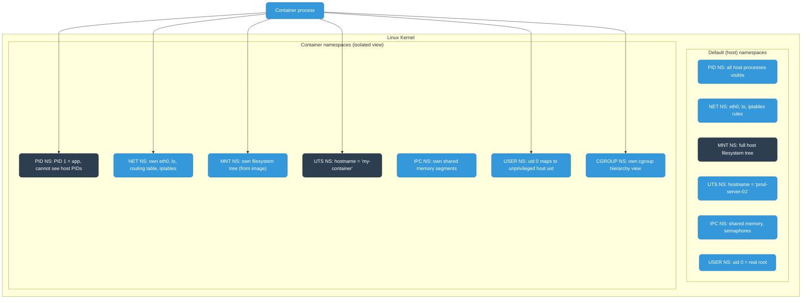

### Namespace Types

| Namespace | Flag | Introduced | What it isolates |
|-----------|------|-----------|-----------------|
| Mount | `CLONE_NEWNS` | 2002 (2.4.19) | Filesystem mount points — container gets its own mount table |
| UTS | `CLONE_NEWUTS` | 2006 (2.6.19) | Hostname and NIS domain name |
| IPC | `CLONE_NEWIPC` | 2006 (2.6.19) | System V IPC, POSIX message queues |
| PID | `CLONE_NEWPID` | 2008 (2.6.24) | Process IDs — PID 1 inside container maps to different PID on host |
| Network | `CLONE_NEWNET` | 2009 (2.6.29) | Network interfaces, routing tables, iptables rules, ports |
| User | `CLONE_NEWUSER` | 2013 (3.8) | User and group IDs — uid 0 inside can map to uid 65534 on host |
| Cgroup | `CLONE_NEWCGROUP` | 2016 (4.6) | cgroup root — container sees its cgroup subtree as root |

### How Namespaces Are Created

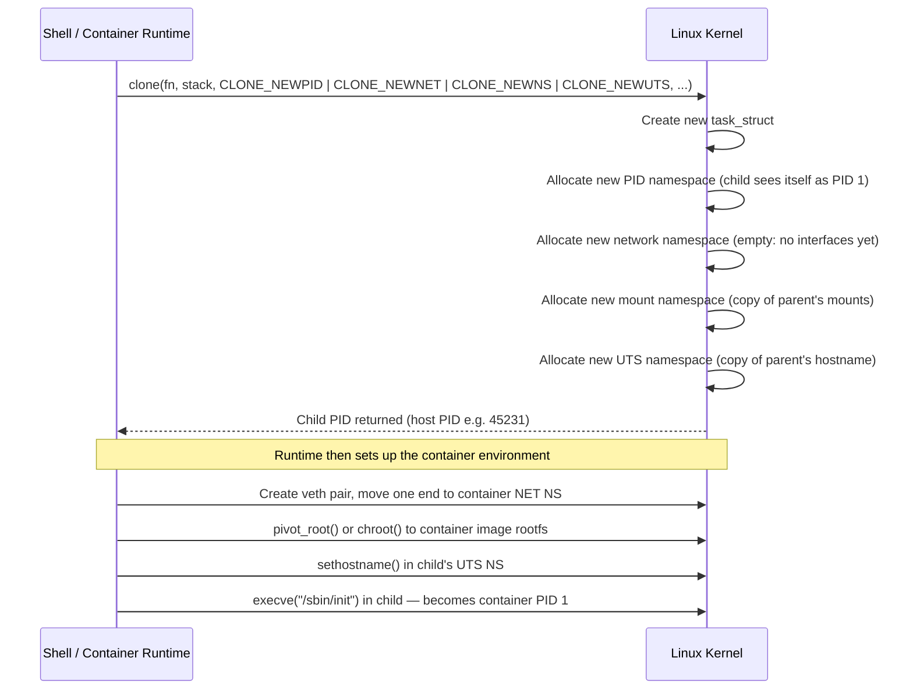

**Key insight:** Namespaces give isolation of visibility. A process in a PID namespace cannot see or signal processes in other PID namespaces. But it can still consume all CPU and memory — that's what cgroups solve.

<div class="quiz-card">
  <p class="quiz-q">A process is isolated in its own PID, network, and mount namespaces. Can it still consume unlimited CPU and memory on the host?</p>
  <button class="quiz-reveal">Reveal answer</button>
  <div class="quiz-a" hidden>Yes. Namespaces control what a process can <em>see</em>, not what it can <em>use</em>. A fully namespaced process with no cgroup attached can still starve the host of CPU or memory &mdash; that resource-usage gap is exactly what cgroups exist to close.</div>
</div>

---

## cgroups (Linux 2.6.24, 2008)

**Control Groups (cgroups)** is a Linux kernel feature developed by Google engineers (Paul Menage, Rohit Seth) that limits, accounts for, and isolates resource usage of process groups.

Where namespaces control what a process **can see**, cgroups control what a process **can use**.

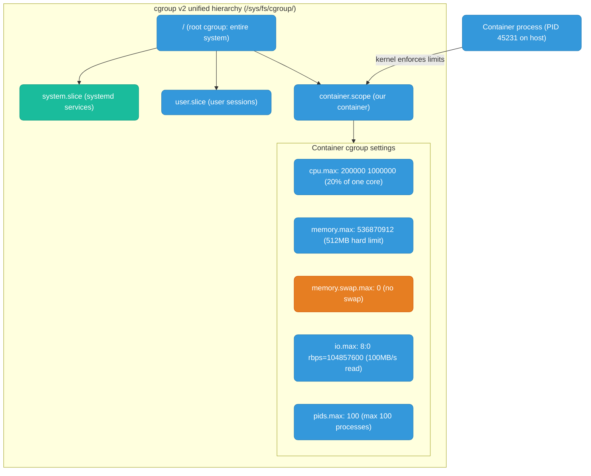

### cgroups v1 vs v2

| | cgroups v1 | cgroups v2 |
|--|-----------|-----------|
| Hierarchy | Multiple separate hierarchies per controller | Single unified hierarchy |
| Introduced | Linux 2.6.24 (2008) | Linux 4.5 (2016), default in modern distros |
| Consistency | Each controller had separate rules | Unified, consistent API |
| Delegation | Complex, fragile | Clean delegation model |
| Memory accounting | Per-process | Per-cgroup subtree (more accurate) |
| IO accounting | blkio controller (block devices only) | io controller (unified, includes buffered writes) |
| Docker/K8s | Used v1 for years | K8s 1.25+ defaults to v2, Docker 20.10+ supports v2 |

**What cgroups enforce in containers:**
- `memory.max` — hard limit, OOM-kill when exceeded
- `cpu.max` — CPU bandwidth limit (Docker `--cpus`)
- `pids.max` — process/thread count (prevents fork bombs)
- `io.max` — disk read/write throughput limits
- `memory.swap.max 0` — disable swap for containers (crash fast, don't degrade)

<div class="quiz-card">
  <p class="quiz-q">What's the key structural difference between cgroups v1 and cgroups v2?</p>
  <button class="quiz-reveal">Reveal answer</button>
  <div class="quiz-a" hidden>v1 used multiple separate hierarchies, one per controller (CPU, memory, IO tracked independently with their own rules). v2 unifies all controllers under a single hierarchy with a consistent API &mdash; which is also why v2's memory and IO accounting is more accurate (per-cgroup subtree instead of per-process, and a unified io controller instead of blkio covering block devices only).</div>
</div>

---

## LXC — Linux Containers (2008)

LXC was the first complete Linux container runtime. It combined namespaces + cgroups + a minimal init process into a usable tool, essentially reimplementing BSD Jails on Linux.

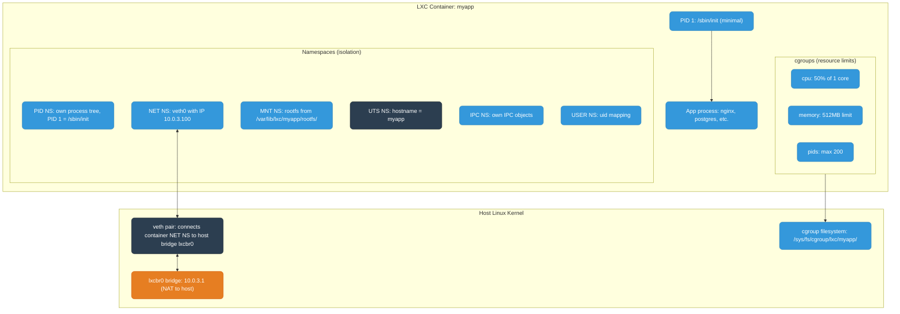

### How LXC Creates a Container (internals)

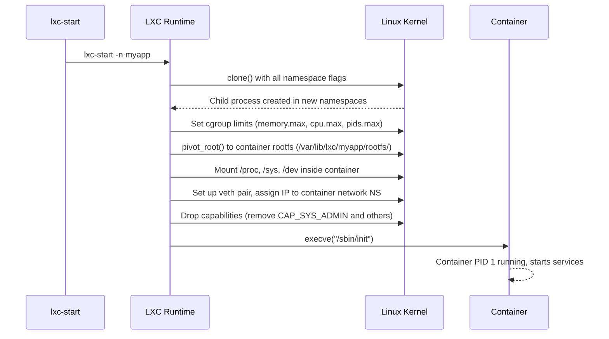

### LXC vs VM

```mermaid
graph TD
    classDef blue fill:#3498db,stroke:#2980b9,color:#fff,rx:8
    classDef green fill:#2ecc71,stroke:#27ae60,color:#fff,rx:8
    classDef red fill:#e74c3c,stroke:#c0392b,color:#fff,rx:8
    classDef orange fill:#e67e22,stroke:#d35400,color:#fff,rx:8
    classDef purple fill:#9b59b6,stroke:#8e44ad,color:#fff,rx:8
    classDef teal fill:#1abc9c,stroke:#16a085,color:#fff,rx:8
    classDef dark fill:#2c3e50,stroke:#1a252f,color:#fff,rx:8
    classDef yellow fill:#f39c12,stroke:#d68910,color:#000,rx:8
    classDef k8s fill:#326ce5,stroke:#254ea8,color:#fff,rx:8
    classDef aws fill:#ff9900,stroke:#cc7a00,color:#000,rx:8
    subgraph VM["Virtual Machine"]
        GUEST_OS["Guest OS Kernel (full Linux/Windows)"]:::blue
        GUEST_APP["Application"]:::blue
        GUEST_LIBS["Guest userspace libraries"]:::blue
        HYPERVISOR["Hypervisor: KVM/VMware/Hyper-V"]:::blue
        HOST_OS["Host OS Kernel"]:::dark
        HW["Hardware"]:::dark
        GUEST_OS --> GUEST_APP
        GUEST_LIBS --> GUEST_APP
        GUEST_OS --> HYPERVISOR
        HYPERVISOR --> HOST_OS
        HOST_OS --> HW
    end

    subgraph LXC_C["LXC Container"]
        C_APP["Application"]:::blue
        C_LIBS["Container userspace (libc, etc.)"]:::blue
        SHARED_KERNEL["SHARED Host Kernel (namespaces + cgroups)"]:::dark
        C_HW["Hardware"]:::dark
        C_APP --> C_LIBS
        C_LIBS --> SHARED_KERNEL
        SHARED_KERNEL --> C_HW
    end
```

| | VM | LXC Container |
|--|----|----|
| Kernel | Own guest kernel | Shares host kernel |
| Boot time | 30s–2min | Milliseconds |
| Memory overhead | 100MB–1GB+ (full OS) | ~1MB (just the process) |
| Isolation | Strong (hypervisor boundary) | Weaker (kernel attack surface shared) |
| Disk image | Full OS image (GBs) | Just app + libs (MBs) |
| Use case | Strong isolation needed (multi-tenant) | Fast, dense, same-trust workloads |

**LXC's limitations that Docker solved:**
- No concept of image layers — each container rootfs was a full copy or copy-on-write manually
- No standard image format or registry
- Complex configuration files (lxc.conf)
- Poor developer experience — not designed for app packaging
- No Dockerfile-equivalent for reproducible builds

<div class="quiz-card">
  <p class="quiz-q">Did LXC have a concept of image layers or a standard registry, the way Docker containers do?</p>
  <button class="quiz-reveal">Reveal answer</button>
  <div class="quiz-a" hidden>No. Each LXC container's rootfs was a full copy or a manually managed copy-on-write filesystem, with no standard image format or registry. LXC combined namespaces and cgroups into the first complete Linux container runtime, but packaging and distribution were exactly the gaps Docker filled next.</div>
</div>

---

## Docker (2013)

Docker didn't invent containers. It invented the **developer workflow** around containers. Initially Docker used LXC as its runtime; it later replaced it with its own `libcontainer` (now `runc`).

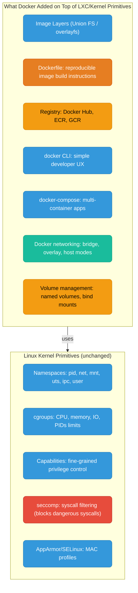

### Image Layers (overlayfs)

This is Docker's killer feature. Images are built in layers — each Dockerfile instruction creates a read-only layer. Containers add a thin read-write layer on top.

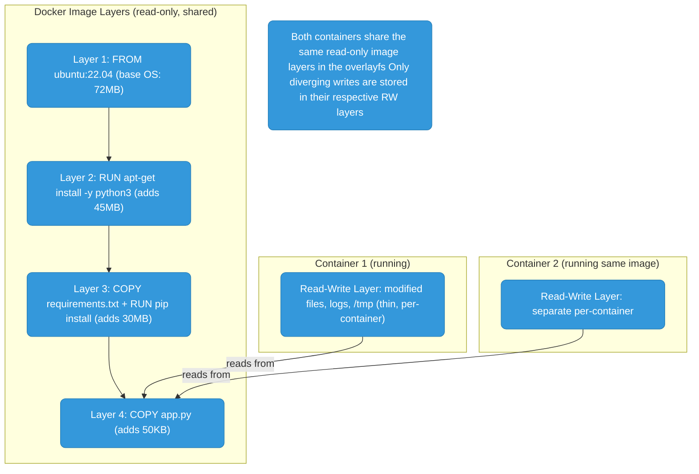

**overlayfs mechanics:** The container's filesystem is a union of:
- `lowerdir` — all image layers stacked (read-only)
- `upperdir` — the container's write layer (read-write)
- `workdir` — overlayfs internal scratch space
- `merged` — the unified view the container sees

When a container reads a file: kernel checks upperdir first, then lowerdir (bottom up). When it writes: the file is **copy-on-write** (COW) from lowerdir to upperdir, then modified. Deleting creates a "whiteout" entry in upperdir.

### Docker Container Creation (what actually happens)

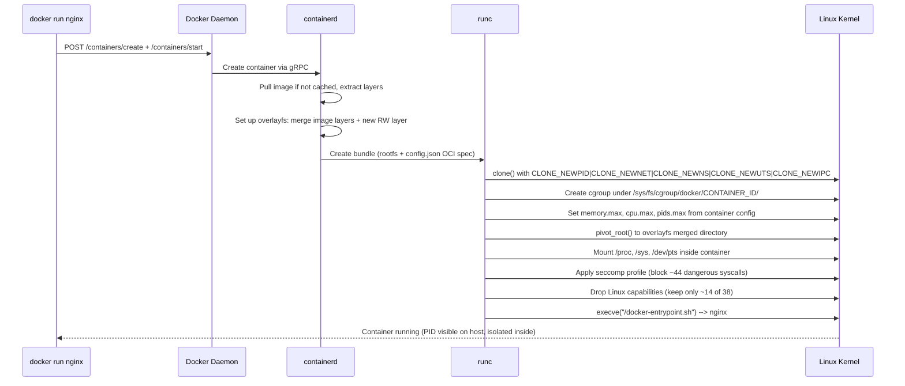

### The Full Stack

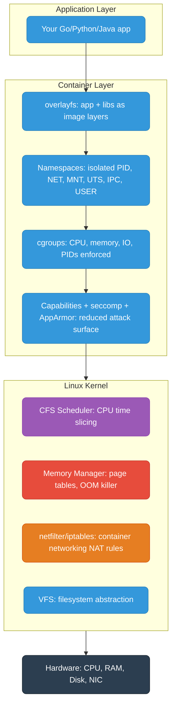

This full stack is why containers are lightweight: there's no hypervisor, no guest OS kernel, no hardware emulation. The app runs directly on the host kernel, just with a restricted view and resource limits enforced by kernel primitives.

<div class="quiz-card">
  <p class="quiz-q">A Docker container writes to a file that only exists in a read-only image layer. What actually happens on disk?</p>
  <button class="quiz-reveal">Reveal answer</button>
  <div class="quiz-a" hidden>Copy-on-write: the file is copied from the image layer (<code>lowerdir</code>) into the container's writable layer (<code>upperdir</code>), then the write happens there. The original image layer is never touched, which is exactly how multiple containers can share the same read-only image layers while each keeps its own independent changes.</div>
</div>

---

## Docker Image Size Optimization

### Why it matters
Larger images = slower CI builds, slower pod startup (image pull), more ECR/registry storage cost, larger attack surface.

### Step 1: Use a minimal base image

```dockerfile
# BAD: ubuntu base is ~70MB, has shell, package manager, utilities
FROM ubuntu:22.04

# BETTER: debian-slim strips docs, locales, apt cache (~30MB)
FROM debian:bookworm-slim

# BEST for Go/Rust: scratch (0MB — just your binary)
FROM scratch

# BEST for most apps: distroless (no shell, no package manager, ~2MB base)
FROM gcr.io/distroless/static-debian12      # static binaries (Go, Rust)
FROM gcr.io/distroless/base-debian12        # glibc dynamic binaries
FROM gcr.io/distroless/java21-debian12      # Java
FROM gcr.io/distroless/nodejs20-debian12    # Node.js
```

Four named, mutually-exclusive starting points — pick one per image, not a mix:

<div class="toggle-switch">
  <div class="toggle-buttons">
    <button data-toggle-opt="ubuntu" class="active state-bad">ubuntu</button>
    <button data-toggle-opt="debianslim" class="state-warn">debian-slim</button>
    <button data-toggle-opt="scratch" class="state-ok">scratch</button>
    <button data-toggle-opt="distroless" class="state-ok">distroless</button>
  </div>
  <div class="toggle-panel active" data-toggle-panel="ubuntu">
    <strong>~70MB.</strong> Full shell, package manager, and utilities included. Convenient for debugging inside the container, but every one of those extras is also attack surface and dead weight you're shipping and pulling on every deploy.
  </div>
  <div class="toggle-panel" data-toggle-panel="debianslim">
    <strong>~30MB.</strong> Strips docs, locales, and the apt cache but keeps a real shell and package manager. A reasonable middle ground when you occasionally still need to <code>exec</code> into the container to poke around.
  </div>
  <div class="toggle-panel" data-toggle-panel="scratch">
    <strong>0MB.</strong> No base at all — just your binary. Only works for fully static binaries (Go with <code>CGO_ENABLED=0</code>, Rust with musl) since there's no libc, no shell, and no way to exec in at all.
  </div>
  <div class="toggle-panel" data-toggle-panel="distroless">
    <strong>~2MB base.</strong> No shell, no package manager, but does include the language runtime/libc a dynamically-linked binary needs (separate variants for static binaries, glibc, Java, Node.js). The best default for most apps that aren't fully static: smaller and safer than debian-slim, without scratch's "static binaries only" restriction.
  </div>
</div>

### Step 2: Multi-stage build (most impactful for compiled languages)

```dockerfile
# Go example — build stage has all tools, final stage has only the binary
FROM golang:1.22-alpine AS builder
WORKDIR /app
COPY go.mod go.sum ./
RUN go mod download                      # cache dependency layer
COPY . .
RUN CGO_ENABLED=0 GOOS=linux go build -ldflags="-s -w" -o server .
#   -s: strip symbol table
#   -w: strip DWARF debug info
#   Result: binary ~30% smaller

FROM gcr.io/distroless/static-debian12   # final image: zero shell, zero tools
COPY --from=builder /app/server /server
EXPOSE 8080
ENTRYPOINT ["/server"]
# Final image size: ~10-15MB vs ~800MB if using golang base directly
```

```dockerfile
# Node.js example
FROM node:20-alpine AS builder
WORKDIR /app
COPY package*.json ./
RUN npm ci --only=production             # install only prod deps

FROM node:20-alpine                      # or distroless/nodejs
WORKDIR /app
COPY --from=builder /app/node_modules ./node_modules
COPY . .
USER node                                # never run as root
CMD ["node", "server.js"]
```

### Step 3: Optimize layer caching (order matters)

```dockerfile
# BAD: COPY . . before dependency install — any source change busts dep cache
FROM golang:1.22-alpine
COPY . .
RUN go mod download

# GOOD: copy dependency files first, source code last
FROM golang:1.22-alpine
COPY go.mod go.sum ./        # only changes when deps change
RUN go mod download           # cached unless go.mod/go.sum change
COPY . .                      # source changes bust only this layer onward
RUN go build -o server .
```

### Step 4: Minimize layers and clean up in one RUN

```dockerfile
# BAD: each RUN is a layer; apt cache stays in image
RUN apt-get update
RUN apt-get install -y curl git
RUN rm -rf /var/lib/apt/lists/*    # too late — previous layer already has the cache

# GOOD: one RUN, clean up in same layer
RUN apt-get update && \
    apt-get install -y --no-install-recommends curl git && \
    rm -rf /var/lib/apt/lists/*
#   --no-install-recommends: skips suggested packages
```

### Step 5: .dockerignore

```dockerignore
# .dockerignore — same syntax as .gitignore
.git
.github
**/*.md
**/*_test.go
**/*.test
node_modules
dist
coverage
*.log
.env
.DS_Store
```

Without `.dockerignore`, `COPY . .` sends everything (including `node_modules`, `.git` history) to the Docker build context — slows builds and bloats cache.

### Step 6: Use specific tags, not `latest`

```dockerfile
# BAD: latest changes silently, breaks reproducibility
FROM node:latest

# GOOD: pinned tag = reproducible builds
FROM node:20.11.1-alpine3.19
```

### Step 7: Don't run as root

```dockerfile
# Create non-root user
RUN addgroup -S appgroup && adduser -S appuser -G appgroup
USER appuser

# distroless already has nonroot user
FROM gcr.io/distroless/static-debian12:nonroot
```

### Summary: checklist

| Technique | Typical saving |
|-----------|---------------|
| Switch from `ubuntu` to `alpine` base | 60-80MB |
| Multi-stage build (Go/Java/Rust) | 200-800MB |
| `-ldflags="-s -w"` on Go binary | 20-30% of binary size |
| `--no-install-recommends` on apt | 10-50MB |
| `.dockerignore` | Build context speed, not final size |
| `npm ci --only=production` | 50-200MB (no devDependencies) |
| `distroless` vs `alpine` final | 5-10MB + no shell (security) |
| Layer ordering (cache deps first) | Build time, not final size |

### Check actual image size

```bash
docker images my-org/app:v1
docker history my-org/app:v1    # size per layer

# dive — interactive layer explorer (install separately)
dive my-org/app:v1
```
