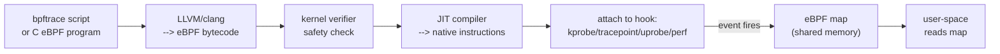

# eBPF and bpftrace

eBPF lets you run sandboxed programs inside the Linux kernel without changing kernel source or loading kernel modules. The kernel verifies the program before running it — no crashes, no kernel panics.

Track how many knowledge checks you've cleared as you go:

<div class="quiz-progress" data-quiz-progress>
  <span class="quiz-progress-label">0/0 checks</span>
  <span class="quiz-progress-bar"><span class="quiz-progress-fill"></span></span>
</div>

---

## How It Works



**Hook types:**

| Hook | What it traces |
|------|---------------|
| `kprobe` | Kernel function entry |
| `kretprobe` | Kernel function return |
| `tracepoint` | Stable kernel trace points (preferred) |
| `uprobe` | User-space function entry |
| `perf_event` | Hardware PMU events |
| `socket filter` | Network packets |

The flowchart above is six steps happening in order every time an eBPF program runs. Step through it:

<div class="stepper">
  <div class="stepper-panels">
    <div class="stepper-panel active">
      <strong>1. Write.</strong> A bpftrace script or a C eBPF program is authored to describe what to trace.
    </div>
    <div class="stepper-panel">
      <strong>2. Compile.</strong> LLVM/clang turns the source into eBPF bytecode.
    </div>
    <div class="stepper-panel">
      <strong>3. Verify.</strong> The kernel verifier checks the bytecode for safety before it's allowed anywhere near execution.
    </div>
    <div class="stepper-panel">
      <strong>4. JIT compile.</strong> Only bytecode the verifier approved gets turned into native instructions by the JIT compiler.
    </div>
    <div class="stepper-panel">
      <strong>5. Attach.</strong> The compiled program attaches to a hook &mdash; <code>kprobe</code>, <code>tracepoint</code>, <code>uprobe</code>, or <code>perf_event</code>.
    </div>
    <div class="stepper-panel">
      <strong>6. Trigger &amp; collect.</strong> The hook's event fires, the program runs, and results land in an eBPF map &mdash; shared memory that the user-space tool then reads.
    </div>
  </div>
  <div class="stepper-controls">
    <button class="stepper-prev">← Prev</button>
    <span class="stepper-dots"></span>
    <span class="stepper-label"></span>
    <button class="stepper-next">Next →</button>
  </div>
</div>

<div class="quiz-card">
  <p class="quiz-q">In the pipeline above, does the kernel verifier run before or after the JIT compiler turns bytecode into native instructions?</p>
  <button class="quiz-reveal">Reveal answer</button>
  <div class="quiz-a" hidden>Before. The flow is compile &rarr; verify &rarr; JIT &rarr; attach: the verifier has to approve the bytecode as safe first, and only then does the JIT compiler turn it into native instructions. Bytecode that fails verification never reaches the JIT stage &mdash; and never runs at all.</div>
</div>

---

## bpftrace One-Liners

One representative one-liner per resource type, side by side — the full set for each is below.

<div class="tab-group">
  <div class="tab-buttons">
    <button data-tab="cpu" class="active">CPU</button>
    <button data-tab="mem">Memory</button>
    <button data-tab="net">Network</button>
    <button data-tab="disk">Disk I/O</button>
  </div>
  <div class="tab-panels">
    <div class="tab-panel active" data-tab-panel="cpu">
      <strong>Top syscall offenders by process.</strong>
      <pre><code>bpftrace -e 'tracepoint:syscalls:sys_enter_* { @[comm, probe] = count(); }'</code></pre>
      Every syscall entry, grouped by process name and probe &mdash; the fastest way to see who's hammering the kernel.
    </div>
    <div class="tab-panel" data-tab-panel="mem">
      <strong>Page fault rate by process.</strong>
      <pre><code>bpftrace -e 'software:page-faults:1 { @[comm] = count(); }'</code></pre>
      Counts page faults per process &mdash; a spike here usually means growing heap, goroutine stacks, or thrashing.
    </div>
    <div class="tab-panel" data-tab-panel="net">
      <strong>Outbound send size histogram.</strong>
      <pre><code>bpftrace -e 'kretprobe:tcp_sendmsg { @bytes = hist(retval); }'</code></pre>
      Histograms the return value of every <code>tcp_sendmsg</code> call &mdash; shows whether a service is sending mostly small chatty writes or large bulk payloads.
    </div>
    <div class="tab-panel" data-tab-panel="disk">
      <strong>Which processes are doing disk I/O.</strong>
      <pre><code>bpftrace -e 'tracepoint:block:block_rq_issue { @[comm, args->rwbs] = count(); }'</code></pre>
      Counts block I/O requests by process and read/write flags &mdash; the block-layer equivalent of the syscall one-liner above.
    </div>
  </div>
</div>

### CPU & Syscalls

```bash
# Count syscalls by process (top offenders)
bpftrace -e 'tracepoint:syscalls:sys_enter_* { @[comm, probe] = count(); }'

# Syscall latency histogram for read()
bpftrace -e '
tracepoint:syscalls:sys_enter_read { @start[tid] = nsecs; }
tracepoint:syscalls:sys_exit_read /@start[tid]/
{ @us = hist((nsecs - @start[tid]) / 1000); delete(@start[tid]); }'

# Who is calling open/openat? (file open tracing)
bpftrace -e 'tracepoint:syscalls:sys_enter_openat { printf("%s %s<br>", comm, str(args->filename)); }'

# CPU time per function in a process (uprobe)
bpftrace -e 'uprobe:/usr/bin/myapp:main.handler { @start[tid] = nsecs; }
             uretprobe:/usr/bin/myapp:main.handler
             { @us[comm] = hist((nsecs - @start[tid])/1000); }'
```

### Memory

```bash
# Who is calling mmap? (heap/goroutine stack growth)
bpftrace -e 'tracepoint:syscalls:sys_enter_mmap { @[comm] = count(); }'

# Page fault rate by process
bpftrace -e 'software:page-faults:1 { @[comm] = count(); }'

# OOM kill events
bpftrace -e 'kprobe:oom_kill_process { printf("OOM kill: %s pid=%d<br>", comm, pid); }'
```

### Network

```bash
# TCP connections being made (who is calling connect?)
bpftrace -e 'kprobe:tcp_connect { printf("%s pid=%d<br>", comm, pid); }'

# TCP retransmits by destination IP
bpftrace -e 'kprobe:tcp_retransmit_skb {
    $sk = (struct sock *)arg0;
    printf("retransmit: %s<br>", ntop($sk->__sk_common.skc_daddr));
}'

# DNS lookups (getaddrinfo via glibc)
bpftrace -e 'uprobe:/lib/x86_64-linux-gnu/libc.so.6:getaddrinfo
{ printf("%s resolving: %s<br>", comm, str(arg0)); }'

# Network send size histogram
bpftrace -e 'kretprobe:tcp_sendmsg { @bytes = hist(retval); }'
```

### Disk I/O

```bash
# Block I/O latency histogram (ms)
bpftrace -e '
kprobe:blk_account_io_start  { @start[arg0] = nsecs; }
kprobe:blk_account_io_done   /@start[arg0]/
{ @ms = hist((nsecs - @start[arg0]) / 1000000); delete(@start[arg0]); }'

# Which processes are doing disk I/O?
bpftrace -e 'tracepoint:block:block_rq_issue { @[comm, args->rwbs] = count(); }'

# File reads by process and filename
bpftrace -e 'tracepoint:syscalls:sys_enter_read {
    printf("%s fd=%d<br>", comm, args->fd);
}'
```

### Go-Specific

```bash
# Trace goroutine creation rate
bpftrace -e 'uprobe:/path/to/binary:runtime.newproc1 { @[comm] = count(); }'

# GC pause duration (Go)
bpftrace -e '
uprobe:/path/to/binary:runtime.gcStart  { @start = nsecs; }
uprobe:/path/to/binary:runtime.gcMarkDone
{ printf("GC pause: %d us<br>", (nsecs - @start)/1000); }'
```

---

## bpftrace Programs (Multi-line)

```bash
# runqlat.bt — CPU run queue latency
# Time from "runnable" to "actually running"
bpftrace - << 'EOF'
tracepoint:sched:sched_wakeup,
tracepoint:sched:sched_wakeup_new {
    @start[args->pid] = nsecs;
}

tracepoint:sched:sched_switch {
    if (@start[args->next_pid]) {
        $delta = (nsecs - @start[args->next_pid]) / 1000;
        @us = hist($delta);
        delete(@start[args->next_pid]);
    }
}

END { clear(@start); }
EOF
# If @us shows p99 > 1ms → CPU scheduler latency is a problem
```

```bash
# tcplife.bt — TCP connection lifetimes
bpftrace - << 'EOF'
kprobe:tcp_set_state {
    $sk = (struct sock *)arg0;
    $state = arg1;
    if ($state == 1) {  // TCP_ESTABLISHED
        @birth[$sk] = nsecs;
        @comm[$sk] = comm;
    }
    if ($state == 7 || $state == 8) {  // FIN_WAIT1 / CLOSE_WAIT
        if (@birth[$sk]) {
            printf("%-16s %d ms<br>", @comm[$sk], (nsecs - @birth[$sk])/1000000);
            delete(@birth[$sk]);
            delete(@comm[$sk]);
        }
    }
}
EOF
```

---

## BCC Tools (pre-built eBPF tools)

```bash
# install: apt install bpfcc-tools

execsnoop-bpfcc            # every exec() system call
opensnoop-bpfcc            # every file open
tcpconnect-bpfcc           # outbound TCP connections
tcpaccept-bpfcc            # inbound TCP connections
tcpretrans-bpfcc           # TCP retransmissions with address
biolatency-bpfcc           # block I/O latency histogram
biosnoop-bpfcc             # per-request block I/O tracing
cachestat-bpfcc            # page cache hit/miss rate
cachetop-bpfcc             # per-process cache stats
runqlat-bpfcc              # CPU run queue latency histogram
profile-bpfcc -F 99 10     # CPU profiling (like perf record -g)
```

---

## eBPF vs Other Tracing Tools

| Tool | Mechanism | Overhead | Safe in prod |
|------|-----------|----------|-------------|
| `strace` | ptrace | 10-100x | No |
| `ltrace` | ptrace | 10-100x | No |
| `perf trace` | tracepoints | 2-5x | Caution |
| `bpftrace` | eBPF | < 5% | Yes |
| BCC tools | eBPF | < 5% | Yes |
| `ftrace` | kernel hooks | < 2% | Yes |

<div class="quiz-card">
  <p class="quiz-q">perf trace has much lower overhead than strace (2-5x vs 10-100x). Does that mean it's safe to run in production, per the table above?</p>
  <button class="quiz-reveal">Reveal answer</button>
  <div class="quiz-a" hidden>No. The table marks <code>perf trace</code> as "Caution," not "Yes" &mdash; despite beating strace/ltrace by a wide margin, it doesn't reach the "Safe in prod" column that bpftrace, BCC tools, and ftrace get (all under 5% overhead). Lower overhead than the worst option on the list isn't the same as safe; only the eBPF-based tools and ftrace clear that bar here.</div>
</div>

---

## Quick Reference

```bash
# List available tracepoints
bpftrace -l 'tracepoint:syscalls:*'
bpftrace -l 'kprobe:tcp_*'

# List probes matching a pattern
bpftrace -l '*open*'

# Run for N seconds then print
bpftrace -e '...' -c 'sleep 10'

# Show map contents every second
bpftrace -e 'interval:s:1 { print(@); clear(@); } ...'
```
