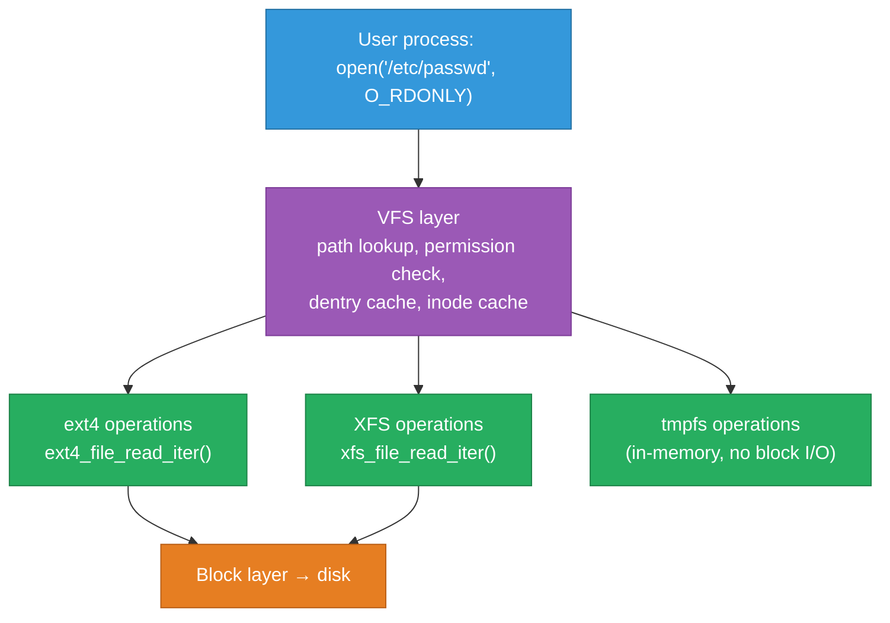
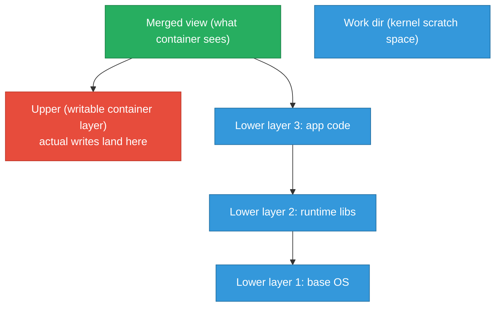

# Linux Filesystem Internals — VFS, ext4, overlayfs, inotify

How the kernel turns a `read()` call into bytes from a block device: the VFS abstraction
layer, how ext4 and XFS store data, the overlayfs copy-on-write layer that Docker and
containerd use for image layers, and the inotify/fanotify APIs that live-reload and security
tools depend on. Includes the real failure modes that show up in production — inode exhaustion,
journal corruption, overlayfs `d_type` mismatches.

<div class="quiz-progress" data-quiz-progress>
  <span class="quiz-progress-label">0/0 checks</span>
  <span class="quiz-progress-bar"><span class="quiz-progress-fill"></span></span>
</div>

---

## 1. The VFS Layer — One Interface for Every Filesystem

The Virtual Filesystem Switch (VFS) is a kernel abstraction that lets user-space programs call
`open()`, `read()`, `write()`, `stat()` without knowing whether the underlying storage is
ext4, XFS, tmpfs, NFS, or procfs. Each concrete filesystem registers handlers for the VFS
operations; the kernel routes calls through those handlers.



**Core VFS objects** (all live in kernel memory):

| Object | What it represents | Key fields |
|---|---|---|
| **superblock** | A mounted filesystem instance | block size, inode count, operations table |
| **inode** | One file or directory (by number, not name) | size, UID/GID, permissions, timestamps, block pointers |
| **dentry** | A name-to-inode mapping in the directory tree | parent dentry, inode pointer, name string |
| **file** | An open file descriptor in a process | current offset, flags, pointer to dentry |

When you call `open("/etc/passwd")`, the kernel walks the dentry tree from `/`, resolving each
path component by looking up dentries (first in the dentry cache, then on disk), ends at the
inode for `passwd`, creates a `file` object, and returns a file descriptor integer that indexes
into the process's file descriptor table.

```bash
# What stat() reads from an inode — all metadata, no file data
stat /etc/passwd
# File: /etc/passwd
# Size: 2847        Blocks: 8          IO Block: 4096   regular file
# Device: fd01h/64769d  Inode: 524297   Links: 1
# Access: (0644/-rw-r--r--)  Uid: (0/ root)   Gid: (0/ root)
# Modify: 2025-01-10 10:23:15.000000000 +0530
```

The **dentry cache** (dcache) is the hot path for path resolution. A `d_lookup()` hit means
no disk I/O at all — the mapping is in kernel memory. On memory-constrained systems, the
kernel shrinks the dcache under pressure, causing more disk reads for path lookups.

```bash
# Dentry and inode cache stats
cat /proc/sys/fs/dentry-state    # nr_dentry  nr_unused  age_limit ...
cat /proc/sys/fs/inode-state     # nr_inodes  nr_free_inodes ...
```

<div class="quiz-card">
  <p class="quiz-q">Two files have the same inode number. What does that mean, and is it possible on the same filesystem?</p>
  <button class="quiz-reveal">Reveal answer</button>
  <div class="quiz-a" hidden>Yes — they are hard links to the same file. An inode represents the actual data and metadata; a dentry (directory entry) is just a name-to-inode mapping. Multiple dentries can point to the same inode (hard links). Both names point to exactly the same data, permissions, and timestamps. Deleting one hard link decrements the inode's link count; the inode (and data) is freed only when the count reaches zero. Hard links cannot span filesystems because inode numbers are only unique within a single filesystem.</div>
</div>

---

## 2. ext4 Internals

ext4 is the default filesystem on most Linux distributions. Its on-disk structure divides the
device into **block groups**, each containing a copy of the superblock (on the first few groups),
a block bitmap, an inode bitmap, an inode table, and data blocks.

**Extent tree** (replaces indirect block pointers from ext2/ext3):

```
Inode → extent header
         └── extent entry: (logical_block, physical_block, length)
             extent entry: (logical_block, physical_block, length)
             ...
         (if file is large: extent index → extent leaf nodes)
```

A single extent can cover up to 128MB of contiguous blocks, making large-file reads very
efficient — one lookup per contiguous run rather than one per block.

**Journal modes** — controlled by `data=` mount option:

| Mode | What's journaled | Data integrity | Performance |
|---|---|---|---|
| `writeback` | Metadata only — data writes may not complete before metadata commit | Data may be stale on crash but metadata is consistent | Fastest |
| `ordered` (default) | Metadata only, but data blocks are written to disk *before* metadata is committed | Safe: no stale data pointers after crash | Middle |
| `journal` | Both metadata and data | Strongest: no data loss even on crash | Slowest (2× writes for data) |

```bash
# Check current journal mode
tune2fs -l /dev/sda1 | grep "Default mount options"
# or
findmnt -o TARGET,OPTIONS / | grep data=

# Temporarily remount with ordered (already default on most distros)
mount -o remount,data=ordered /
```

**Metadata checksums** (ext4 feature `metadata_csum`): Added in kernel 3.5. The superblock,
block group descriptors, journal, and inode tables all carry checksums. A corrupted block is
detected on read rather than silently returning wrong data.

```bash
# Show filesystem features including metadata_csum
tune2fs -l /dev/sda1 | grep features
# Filesystem features: has_journal ext_attr ... metadata_csum

# Check and repair (unmounted only)
fsck.ext4 -f /dev/sda1
```

---

## 3. XFS vs ext4 — When to Pick Each

XFS is a high-performance journaling filesystem designed for large files and parallel I/O
workloads. It's the default on RHEL/CentOS/Fedora.

| Property | ext4 | XFS |
|---|---|---|
| **Allocation unit** | Fixed block size (default 4KB) | Allocation groups (AGs), independent per-AG allocators |
| **Large files** | Good with extents; 1EB max file size | Excellent; 8EB max; data streams inside files |
| **Parallel writes** | Single inode mutex limits concurrent writers | Per-AG locking enables highly parallel allocation |
| **Small files / many inodes** | Good; inline symlinks, fast directory lookups | Slightly higher overhead per inode |
| **Shrinking** | Supported (`resize2fs`) | **Cannot shrink** — only grow |
| **Repair** | `fsck.ext4` — offline only | `xfs_repair` — offline; `xfs_scrub` online |
| **Best for** | General purpose, boot volumes, containers | Databases, media, high-throughput data pipelines |

```bash
# XFS info — shows AG count, block size, inode size
xfs_info /
# meta-data=/dev/sda     isize=512  agcount=4, agsize=...

# Online defragmentation (XFS only)
xfs_fsr /dev/sda1

# ext4 resize (mounted, growing)
resize2fs /dev/sda1
```

---

## 4. overlayfs — How Container Image Layers Work

overlayfs is a union filesystem: it presents a merged view of multiple directories stacked on
top of each other. Docker, containerd, and Podman use it to stack read-only image layers with
a writable container layer on top.



**Copy-up on write:** When a process inside a container modifies a file that exists only in a
lower (read-only) layer, overlayfs copies the entire file up to the upper layer before applying
the write. The lower layer is untouched. This is why the first write to a large file in a
lower layer is slow — the copy-up happens synchronously.

**Whiteout files:** Deleting a file that exists in a lower layer creates a whiteout entry
in the upper layer — a special character device with major:minor 0:0. overlayfs uses this
to hide the lower layer's file in the merged view.

```bash
# Mount an overlayfs manually
mkdir -p /tmp/lower /tmp/upper /tmp/work /tmp/merged
echo "base" > /tmp/lower/file.txt
mount -t overlay overlay \
  -o lowerdir=/tmp/lower,upperdir=/tmp/upper,workdir=/tmp/work \
  /tmp/merged

# Modify the file — triggers copy-up
echo "modified" > /tmp/merged/file.txt

# Original lower is untouched
cat /tmp/lower/file.txt    # → base
# Upper now has the modified copy
cat /tmp/upper/file.txt    # → modified

# Delete the file — creates a whiteout
rm /tmp/merged/file.txt
ls -la /tmp/upper/
# c--------- 1 root root 0, 0 ... file.txt  ← whiteout (char device 0:0)
```

**The `d_type` requirement:** overlayfs requires the underlying filesystem to support
`d_type` (directory entry type) in `readdir()`. ext4 with `dir_index` (enabled by default)
supports this. XFS without `ftype` (pre-4.2 kernel, or formatted without it) does not.
Docker will refuse to start with overlayfs on a filesystem without `d_type`:

```bash
# Check d_type support
xfs_info /var/lib/docker | grep ftype
# naming   =version 2              bsize=4096   ascii-ci=0, ftype=1
# ftype=1 means d_type supported; ftype=0 means overlayfs will fail
```

<div class="quiz-card">
  <p class="quiz-q">A container writes a 500MB file that already exists (with different content) in a lower image layer. Why is this write slower than writing a new 500MB file that doesn't exist in any layer?</p>
  <button class="quiz-reveal">Reveal answer</button>
  <div class="quiz-a" hidden>Because of copy-up. Before overlayfs can apply any write to a lower-layer file, it must first copy the entire file from the lower layer up to the upper (writable) layer. For a 500MB file, this means 500MB of read + 500MB of write (the copy-up) before the actual write of new content. A brand-new file (not present in any lower layer) goes straight to the upper layer with no copy-up step — just the write itself.</div>
</div>

---

## 5. tmpfs and ramfs

**tmpfs** is a filesystem backed by virtual memory — kernel page cache — rather than a block
device. Pages can be swapped out under memory pressure.

```bash
# Mount a 256MB tmpfs at /tmp
mount -t tmpfs -o size=256m tmpfs /tmp

# In Kubernetes — emptyDir with medium: Memory uses tmpfs
# /etc/resolv.conf, /etc/hosts inside pods are often tmpfs mounts
df -hT | grep tmpfs
```

**ramfs** is the precursor to tmpfs — no size limit, pages are never swapped, not recommended
for general use because an unbounded ramfs can fill all kernel memory.

**When to use tmpfs:**
- `/run`, `/tmp` on systemd systems (writable, fast, cleared on reboot)
- `--tmpfs /run` or `--mount type=tmpfs` in containers to give writable dirs without adding
  a layer (avoids copy-up overhead and keeps the container image immutable)
- Kubernetes `emptyDir.medium: Memory` for in-memory scratch space with shared access between
  containers in a pod

---

## 6. inotify and fanotify — File Watch Mechanisms

**inotify** lets a process subscribe to filesystem events on specific files or directories
without polling:

```c
// Kernel API (simplified)
int fd = inotify_init();
int wd = inotify_add_watch(fd, "/etc/app.conf", IN_MODIFY | IN_CLOSE_WRITE);
// read() on fd returns inotify_event structs when events fire
```

```bash
# Watch a file for changes (inotifywait from inotify-tools)
inotifywait -m /etc/app.conf
# /etc/app.conf MODIFY
# /etc/app.conf CLOSE_WRITE,CLOSE

# Watch a directory recursively
inotifywait -mr --event modify,create,delete /var/log/app/
```

**Event coalescing:** The kernel coalesces identical consecutive events for the same
watch+event pair. A very fast writer that modifies a file 1000 times per second won't
generate 1000 `IN_MODIFY` events — the kernel will batch some. Applications that need
to track every byte must use other mechanisms (e.g., journal-based approaches).

**inotify limits** — the most common operational failure:

```bash
# Maximum watches per user (default: 8192 — often too low for containers)
cat /proc/sys/fs/inotify/max_user_watches
# 8192

# Symptom: "inotify: failed to create new inotify fd: too many open files"
# or: "No space left on device" when adding a watch (misleading error)

# Fix:
sysctl fs.inotify.max_user_watches=524288
echo "fs.inotify.max_user_watches=524288" >> /etc/sysctl.d/99-inotify.conf
```

Live-reload tools (webpack, `air` for Go, Tilt, Skaffold) and IDEs each consume inotify
watches. A Kubernetes node running many development pods routinely exhausts the default limit.

**fanotify** is a superset of inotify — it can intercept filesystem events before they
complete (allowing permission decisions) and works filesystem-wide without per-file watches.
It requires `CAP_SYS_ADMIN`. Security tools (Falco, auditd file watches) and antivirus
engines use fanotify because it can intercept opens before the read, allowing blocking.

```bash
# fanotify requires a program — no shell utility; see man fanotify(7) for C API
# Falco uses fanotify (or eBPF) to intercept container syscalls and file events
```

---

## 7. Debugging Filesystem Issues

**inode exhaustion** — `df -i` shows 100% inode use even when disk space remains:

```bash
df -ih
# Filesystem     Inodes IUsed IFree IUse% Mounted on
# /dev/sda1       3.9M  3.9M     0  100% /var/log

# Find the directory with the most inodes
find /var/log -xdev -printf '%h\n' | sort | uniq -c | sort -rn | head -20

# Common culprit: thousands of tiny log/temp files in one directory
ls /var/log/some-app/ | wc -l    # → 4,000,000
```

**Inspect ext4 filesystem metadata:**

```bash
tune2fs -l /dev/sda1           # superblock info: block count, inode count, journal size
debugfs /dev/sda1              # interactive: stat <file>, dump <inode>, ls -l <dir>
e2fsck -n /dev/sda1            # read-only check — reports errors without fixing
```

**XFS tools:**

```bash
xfs_info /dev/sda1             # geometry, feature flags, AG count
xfs_repair -n /dev/sda1        # read-only check
xfs_repair /dev/sda1           # repair (filesystem must be unmounted)
xfs_scrub /                    # online scrub (kernel 4.15+, safe to run live)
```

**overlayfs debugging:**

```bash
# Which storage driver is Docker using?
docker info | grep "Storage Driver"

# Check overlay upper dir for a specific container
docker inspect --format '{{.GraphDriver.Data.UpperDir}}' <container>
# /var/lib/docker/overlay2/<hash>/diff

# Large upper dir = lots of copy-ups or writes inside the container
du -sh /var/lib/docker/overlay2/<hash>/diff
```

<div class="quiz-card">
  <p class="quiz-q">A server reports "No space left on device" but `df -h` shows 60% disk usage. What's the most likely cause and how do you confirm it?</p>
  <button class="quiz-reveal">Reveal answer</button>
  <div class="quiz-a" hidden>Inode exhaustion. The disk has free blocks but all inodes are consumed. Confirm with `df -i` — 100% IUse% on the filesystem in question confirms it. The fix is to find and remove the directory with excessive file count: `find / -xdev -printf '%h\n' | sort | uniq -c | sort -rn | head -20`. Common causes: a logging loop creating thousands of files, package manager leaving temp files, or a crashed process that wrote many small files.</div>
</div>

---

## 8. Common Failure Modes

**Journal corruption recovery (ext4):**

```bash
# Symptom: kernel log shows "EXT4-fs error: ... journal checksum error"
# 1. Unmount the filesystem (or boot from live media)
# 2. Run fsck — it will offer to replay or clear the journal
e2fsck -y /dev/sda1
# If journal is too damaged: clear it, which loses pending transactions
tune2fs -O ^has_journal /dev/sda1
tune2fs -O has_journal /dev/sda1
```

**overlayfs `d_type` failure (Docker):**

```bash
# Error: "devicemapper: Error running deviceCreate" or "overlay: requires d_type support"
# On XFS, verify ftype=1 (cannot be changed on an existing filesystem — must reformat)
xfs_info /var/lib/docker | grep ftype

# Workaround without reformatting: use a different storage driver (e.g., btrfs, vfs)
# Or: move /var/lib/docker to an ext4 volume
```

**Filesystem full during container build (overlayfs copy-up):**

```bash
# Large COPY in a Dockerfile copies files into the upper layer
# If /var/lib/docker is on a small volume, copy-up fills it
df -h /var/lib/docker

# Prune unused layers and images
docker system prune -a
# Move /var/lib/docker to a larger volume via dockerd's --data-root flag
```

---

## Quick Reference

```
VFS cache stats             cat /proc/sys/fs/dentry-state && cat /proc/sys/fs/inode-state
stat an inode               stat <file>  →  inode number, size, permissions, timestamps
ext4 filesystem info        tune2fs -l /dev/sda1
ext4 check (offline)        e2fsck -f /dev/sda1
XFS info                    xfs_info /dev/sda1
XFS online scrub            xfs_scrub /
Inode exhaustion check      df -ih
Find inode-heavy dirs       find / -xdev -printf '%h\n' | sort | uniq -c | sort -rn | head 20
overlayfs upper dir         docker inspect --format '{{.GraphDriver.Data.UpperDir}}' <ctr>
inotify watch limit         cat /proc/sys/fs/inotify/max_user_watches
Raise inotify limit         sysctl fs.inotify.max_user_watches=524288
Watch file for changes      inotifywait -m <file>
Mount tmpfs                 mount -t tmpfs -o size=256m tmpfs /mnt/scratch
d_type check (XFS)          xfs_info /var/lib/docker | grep ftype
```
