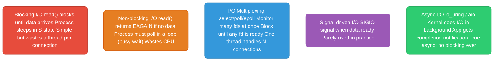
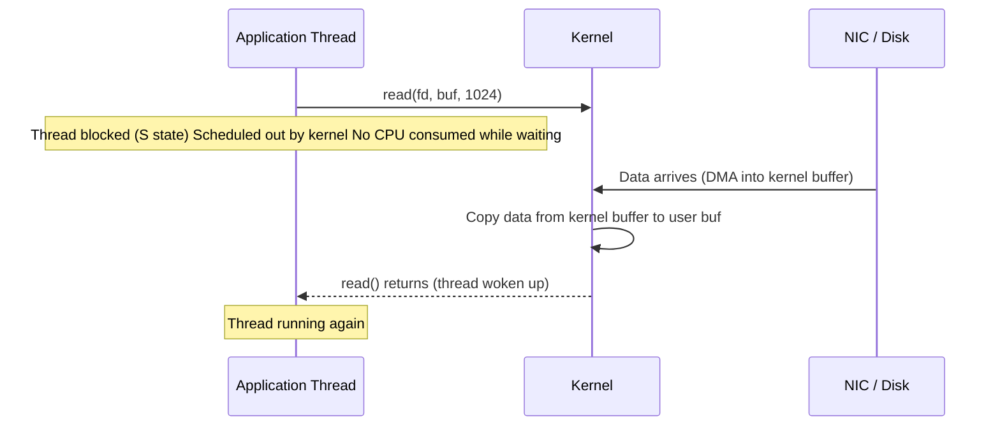
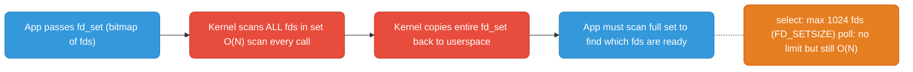
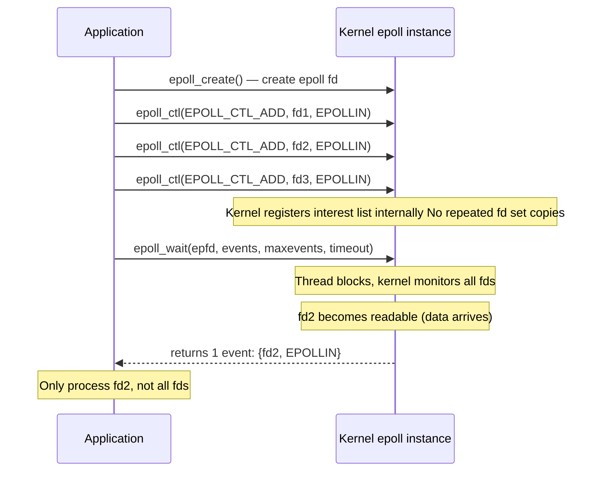
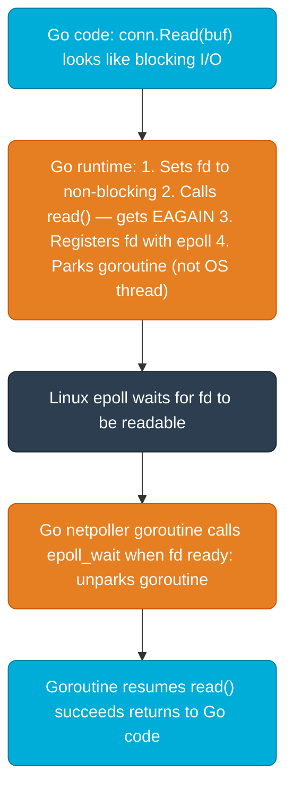
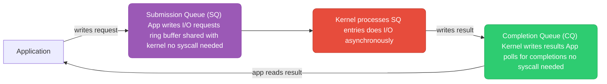

# Linux I/O Models

How applications wait for data — the foundation of every high-performance server.

Each section below ends with a quick check — try to answer before revealing:

<div class="quiz-progress" data-quiz-progress>
  <span class="quiz-progress-label">0/0 checks</span>
  <span class="quiz-progress-bar"><span class="quiz-progress-fill"></span></span>
</div>

---

## The Five I/O Models



<div class="quiz-card">
  <p class="quiz-q">Non-blocking I/O and I/O multiplexing (select/poll/epoll) both let a single thread avoid being stuck on one connection. What's the key difference between them?</p>
  <button class="quiz-reveal">Reveal answer</button>
  <div class="quiz-a" hidden>Non-blocking I/O still busy-waits &mdash; the app loops calling <code>read()</code> and burns CPU checking for data that isn't there yet. I/O multiplexing blocks efficiently instead: the thread sleeps until the kernel says at least one fd is ready, so it costs zero CPU while idle &mdash; same as blocking I/O, but watching many fds at once instead of one.</div>
</div>

---

## Blocking I/O — What Actually Happens



Step through the same wait, one moment at a time:

<div class="stepper">
  <div class="stepper-panels">
    <div class="stepper-panel active">
      <strong>1. read() is called.</strong> The application thread issues <code>read(fd, buf, 1024)</code> and is still running at this point &mdash; no data has arrived yet.
    </div>
    <div class="stepper-panel">
      <strong>2. Thread blocks.</strong> No data is ready, so the kernel puts the thread to sleep (S state) and schedules it out. The thread consumes zero CPU while it waits &mdash; but it also can't do anything else.
    </div>
    <div class="stepper-panel">
      <strong>3. Data arrives.</strong> The NIC or disk DMAs the data into a kernel buffer. The application thread is still asleep and has no idea this happened yet.
    </div>
    <div class="stepper-panel">
      <strong>4. Kernel copies the data.</strong> The kernel copies the data from its own buffer into the buffer the application passed to <code>read()</code>.
    </div>
    <div class="stepper-panel">
      <strong>5. Thread wakes up.</strong> <code>read()</code> returns with the data. The thread is scheduled back onto a CPU and resumes running &mdash; the wait is over.
    </div>
  </div>
  <div class="stepper-controls">
    <button class="stepper-prev">← Prev</button>
    <span class="stepper-dots"></span>
    <span class="stepper-label"></span>
    <button class="stepper-next">Next →</button>
  </div>
</div>

**The problem:** One thread blocked = one thread wasted. For 10,000 concurrent connections, you need 10,000 threads. Each thread costs ~8MB stack → 80GB RAM just for stacks. That's the C10K problem.

<div class="quiz-card">
  <p class="quiz-q">During a blocking <code>read()</code>, is the waiting thread consuming CPU? So what's the actual cost of blocking I/O at scale?</p>
  <button class="quiz-reveal">Reveal answer</button>
  <div class="quiz-a" hidden>No &mdash; the thread is asleep (S state) and burns zero CPU while blocked. The real cost is memory and thread-count, not CPU: each blocked thread still holds its ~8MB stack, so 10,000 concurrent connections need 10,000 threads &asymp; 80GB of stack RAM alone. That's the C10K problem.</div>
</div>

---

## select and poll — The Old Way



**select/poll problems:**
- O(N) scan of all fds on every call — scales poorly past 1000 fds
- `select` hard limit: 1024 fds
- Full fd set copied kernel↔userspace on every call
- App must re-scan entire set to find ready fds

<div class="quiz-card">
  <p class="quiz-q"><code>poll()</code> removes <code>select</code>'s 1024-fd limit. Does that mean <code>poll</code> scales better to thousands of connections?</p>
  <button class="quiz-reveal">Reveal answer</button>
  <div class="quiz-a" hidden>No. <code>poll</code> fixes the hard fd-count ceiling, but the kernel still does an O(N) scan of every fd on every call, and the whole set is still copied kernel&harr;userspace each time. More fds just means more per-call work &mdash; the scaling problem <code>select</code> had, <code>poll</code> still has.</div>
</div>

---

## epoll — The Modern Way

epoll is O(1) for event notification regardless of how many fds you're watching. Used by nginx, Node.js, Redis, Go's netpoller.



One iteration of the event loop, step by step:

<div class="stepper">
  <div class="stepper-panels">
    <div class="stepper-panel active">
      <strong>1. Setup (once).</strong> The app has already called <code>epoll_create()</code> and registered fd1, fd2, fd3 with <code>epoll_ctl(EPOLL_CTL_ADD, ...)</code>. The kernel now holds all three in its interest list.
    </div>
    <div class="stepper-panel">
      <strong>2. epoll_wait() is called.</strong> The thread blocks here. The kernel is watching all registered fds on the thread's behalf &mdash; no busy-waiting, no per-fd scanning by the app.
    </div>
    <div class="stepper-panel">
      <strong>3. An fd becomes ready.</strong> fd2 gets data. The kernel appends fd2 to its internal ready list &mdash; it doesn't need to rescan fd1 or fd3 to know this.
    </div>
    <div class="stepper-panel">
      <strong>4. epoll_wait() returns.</strong> It hands back exactly one event: <code>{fd2, EPOLLIN}</code>. fd1 and fd3 are never mentioned because they're not ready.
    </div>
    <div class="stepper-panel">
      <strong>5. App processes fd2, loops.</strong> Only fd2 gets handled. The app then calls <code>epoll_wait()</code> again for the next event &mdash; this is the event loop.
    </div>
  </div>
  <div class="stepper-controls">
    <button class="stepper-prev">← Prev</button>
    <span class="stepper-dots"></span>
    <span class="stepper-label"></span>
    <button class="stepper-next">Next →</button>
  </div>
</div>

**Why epoll is O(1):**
- Interest list stored in a red-black tree inside kernel — `epoll_ctl` is O(log N)
- Ready list is a separate linked list — when an fd becomes ready the kernel adds it directly
- `epoll_wait` returns only ready fds — app never scans unready ones

**Edge-triggered (EPOLLET) vs level-triggered (default):**
- **Level-triggered (default):** `epoll_wait` returns as long as data is available. Safe but can cause many wakeups.
- **Edge-triggered:** `epoll_wait` returns only when state changes (new data arrives). More efficient but you MUST read until `EAGAIN` or you'll miss data.

```c
// Adding fd with edge-triggered mode
struct epoll_event ev;
ev.events = EPOLLIN | EPOLLET;   // edge-triggered
ev.data.fd = client_fd;
epoll_ctl(epfd, EPOLL_CTL_ADD, client_fd, &ev);
```

<div class="quiz-card">
  <p class="quiz-q">An fd is in edge-triggered (EPOLLET) mode. <code>epoll_wait</code> reports it readable, you call <code>read()</code> once and get less data than's actually available. What happens if you don't call <code>read()</code> again right away?</p>
  <button class="quiz-reveal">Reveal answer</button>
  <div class="quiz-a" hidden>You can miss data. Edge-triggered only notifies on a state <em>change</em> (new data arriving) &mdash; it won't fire again just because unread data is still sitting in the buffer. You must keep calling <code>read()</code> until it returns <code>EAGAIN</code>. Level-triggered (default) doesn't have this trap &mdash; it keeps reporting the fd as ready for as long as any data remains.</div>
</div>

---

## Go's Runtime Netpoller (Built on epoll)

Go doesn't expose epoll directly. Its runtime wraps it transparently — Go code looks blocking but is actually non-blocking underneath.



**The key insight:** One OS thread runs many goroutines. When a goroutine would block on I/O, the runtime parks it and switches to another goroutine on the same OS thread. The OS thread never actually blocks — it's always running some goroutine. This is how Go handles 100,000 concurrent connections with far fewer OS threads than connections.

<div class="quiz-card">
  <p class="quiz-q"><code>conn.Read(buf)</code> in Go looks like an ordinary blocking call. Does the underlying OS thread actually block while it waits for data?</p>
  <button class="quiz-reveal">Reveal answer</button>
  <div class="quiz-a" hidden>No. The runtime sets the fd non-blocking, calls <code>read()</code>, gets <code>EAGAIN</code>, registers the fd with epoll, and parks the <em>goroutine</em> &mdash; not the OS thread. The OS thread is immediately freed to run a different goroutine. The OS thread never blocks; it's always doing something. That's how Go serves far more connections than it has OS threads.</div>
</div>

---

## io_uring — True Async I/O (Linux 5.1+)



One submission/completion cycle, step by step:

<div class="stepper">
  <div class="stepper-panels">
    <div class="stepper-panel active">
      <strong>1. App writes a request.</strong> The application writes an I/O request directly into the Submission Queue ring buffer, which is memory shared with the kernel. No syscall happens yet.
    </div>
    <div class="stepper-panel">
      <strong>2. Requests are submitted.</strong> One syscall can flush many queued SQ entries at once (batching) &mdash; or, in <code>SQPOLL</code> mode, zero syscalls at all, because a kernel thread is already polling the SQ continuously.
    </div>
    <div class="stepper-panel">
      <strong>3. Kernel does the I/O.</strong> The kernel processes SQ entries and performs the actual I/O asynchronously in the background, without the app waiting on it.
    </div>
    <div class="stepper-panel">
      <strong>4. Kernel writes the result.</strong> When an operation finishes, the kernel writes its result into the Completion Queue ring buffer &mdash; again, no syscall.
    </div>
    <div class="stepper-panel">
      <strong>5. App reads the completion.</strong> The app polls the CQ and picks up the result whenever it's convenient &mdash; it was never blocked waiting for it.
    </div>
  </div>
  <div class="stepper-controls">
    <button class="stepper-prev">← Prev</button>
    <span class="stepper-dots"></span>
    <span class="stepper-label"></span>
    <button class="stepper-next">Next →</button>
  </div>
</div>

**Why io_uring is faster than epoll:**
- Zero-copy between app and kernel (shared ring buffers)
- Batched submissions — submit 100 I/O operations with one syscall (or zero with `SQPOLL`)
- Works for files, not just sockets (epoll doesn't work on regular files — `O_NONBLOCK` on files is a lie)
- No context switches in `SQPOLL` mode — kernel thread polls SQ continuously

**In Go:** Go's runtime netpoller is still **epoll-based** (as of Go 1.23) — the standard library does not use io_uring. io_uring is available only through third-party libraries (e.g. `iceber/iouring-go`). Tokio (Rust) can use it heavily. For most workloads Go's epoll-based netpoller is excellent and io_uring is unnecessary.

<div class="quiz-card">
  <p class="quiz-q">epoll can't usefully wait on a regular file becoming "ready" &mdash; <code>O_NONBLOCK</code> on files doesn't really work. Does io_uring have the same limitation?</p>
  <button class="quiz-reveal">Reveal answer</button>
  <div class="quiz-a" hidden>No &mdash; that's one of its main advantages over epoll. io_uring works uniformly for files and sockets, since the kernel actually performs the I/O asynchronously in the background rather than relying on a readiness notification the way epoll does.</div>
</div>

---

## Comparison

The one-line version of each model, side by side — the table below has the full breakdown:

<div class="tab-group">
  <div class="tab-buttons">
    <button data-tab="blocking" class="active">Blocking</button>
    <button data-tab="nonblocking">Non-blocking</button>
    <button data-tab="selectpoll">select/poll</button>
    <button data-tab="epoll">epoll</button>
    <button data-tab="iouring">io_uring</button>
  </div>
  <div class="tab-panels">
    <div class="tab-panel active" data-tab-panel="blocking">
      <code>read()</code> blocks until data arrives. The thread sleeps (S state) &mdash; zero CPU while waiting, but one thread per connection, which is the C10K problem at scale.
    </div>
    <div class="tab-panel" data-tab-panel="nonblocking">
      <code>read()</code> returns <code>EAGAIN</code> immediately if no data is ready. The app must poll in a loop to check again &mdash; it busy-waits, burning CPU for no work done.
    </div>
    <div class="tab-panel" data-tab-panel="selectpoll">
      The app hands the kernel a set of fds; the kernel scans all of them (O(N)) on every call and copies the whole set back. <code>select</code> caps out at 1024 fds; <code>poll</code> removes that cap but keeps the O(N) scan.
    </div>
    <div class="tab-panel" data-tab-panel="epoll">
      The app registers fds once. The kernel keeps an interest list (red-black tree) and a separate ready list, and <code>epoll_wait</code> returns only the fds that are actually ready &mdash; O(1) notification no matter how many fds are being watched.
    </div>
    <div class="tab-panel" data-tab-panel="iouring">
      App and kernel share submission/completion ring buffers directly. No per-call syscall needed on the common path, zero-copy, and &mdash; unlike epoll &mdash; it works for regular files too.
    </div>
  </div>
</div>

| Model | Syscall | Scalability | CPU when idle | Works for files? | Used by |
|-------|---------|-------------|--------------|-----------------|---------|
| Blocking | `read/write` | O(1) per conn, O(N) threads | Low | Yes | Simple servers |
| Non-blocking poll | `read` + busy loop | Poor (CPU waste) | High | Yes | Rarely used directly |
| select | `select` | O(N) fds | Low | Yes | Legacy code |
| poll | `poll` | O(N) fds | Low | Yes | Legacy code |
| epoll | `epoll_wait` | O(1) events | Low | No (sockets only) | nginx, Node.js, Go, Redis |
| io_uring | ring buffer | O(1), zero-copy | Very low | Yes | Tokio, newer Linux services |
