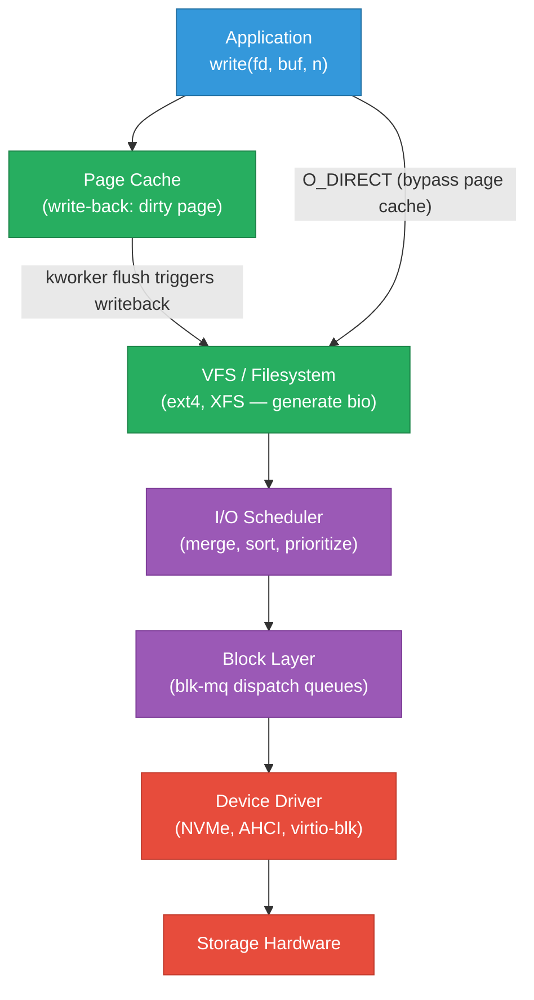

# I/O Schedulers and Storage Tuning

The block I/O call path from `write()` to device, which I/O scheduler to pick for NVMe vs
spinning disk, how to limit noisy-neighbor disk usage with cgroup v2, and how to benchmark
and interpret I/O performance with `fio` and `iostat`. Complements
[io-models.md](./io-models.md) (application-level I/O patterns) and
[filesystem-internals.md](./filesystem-internals.md) (VFS and filesystem layer above).

<div class="quiz-progress" data-quiz-progress>
  <span class="quiz-progress-label">0/0 checks</span>
  <span class="quiz-progress-bar"><span class="quiz-progress-fill"></span></span>
</div>

---

## 1. Block I/O Call Path

A `write()` syscall travels through several layers before reaching the device:



**Key latency contributors by layer:**

| Layer | Source of latency | Measurement |
|---|---|---|
| Page cache miss | Disk read required | `pgmajfault` in /proc/vmstat |
| I/O scheduler queue | Merge + reorder wait | `blktrace` Q→G event |
| Driver queue | Submission to device | `blktrace` G→D event |
| Device | Physical seek/rotation/NVMe queue | `blktrace` D→C event |
| Writeback flush | Dirty page fsync | `iostat` w_await |

---

## 2. I/O Schedulers — Which One and When

```bash
# Check current scheduler for a device
cat /sys/block/nvme0n1/queue/scheduler
# [none] mq-deadline kyber

# Change scheduler (temporary)
echo mq-deadline > /sys/block/sda/queue/scheduler

# Permanent (udev rule)
echo 'ACTION=="add|change", KERNEL=="sda", ATTR{queue/scheduler}="mq-deadline"' \
  > /etc/udev/rules.d/60-scheduler.rules
```

**Scheduler guide:**

| Scheduler | Algorithm | Best for | Why |
|---|---|---|---|
| `none` | Pass-through (FIFO) | NVMe SSDs, cloud block storage | NVMe has internal queues and no seek latency — reordering adds overhead without benefit |
| `mq-deadline` | Deadline-based merge+sort | SATA SSDs, spinning disks in VMs | Prevents request starvation, merges sequential I/O, bounded latency |
| `bfq` (Budget Fair Queueing) | Fair share per process | Desktop, latency-sensitive mixed workloads | Ensures interactive processes aren't starved by background bulk I/O |
| `kyber` | Latency target (read/write targets) | SSDs with mixed workloads | Simpler than BFQ; targets p99 read/write latency |

**Rule of thumb:** NVMe → `none`. SATA SSD in VM → `mq-deadline`. Spinning disk → `mq-deadline` or `bfq`.

---

## 3. I/O Queue Depth

Queue depth determines how many I/O requests are outstanding simultaneously. Too low → device
underutilized. Too high → latency spikes (requests queue up behind each other).

```bash
# NVMe multi-queue: hardware submission queues
ls /sys/block/nvme0n1/mq/

# Software queue depth (requests queued before device)
cat /sys/block/nvme0n1/queue/nr_requests
# 1024 (default for NVMe; typically optimal between 32–256)

# Tune for a database workload (lower depth = lower latency, higher = higher throughput)
echo 64 > /sys/block/nvme0n1/queue/nr_requests

# SATA NCQ depth (hardware)
cat /sys/block/sda/device/queue_depth
# 32 (max NCQ depth; can lower to reduce latency)
echo 16 > /sys/block/sda/device/queue_depth
```

**blk-mq (Multi-Queue Block Layer)** — since Linux 3.13, the block layer is multi-queue:
one software queue per CPU submits to one or more hardware queues. NVMe devices expose up to
65535 hardware queues (one per CPU is typical). This eliminates the single global lock that
was the I/O bottleneck on pre-blk-mq kernels.

---

## 4. blkio cgroup v2 — Limiting Noisy-Neighbor Disk I/O

```bash
# Check if cgroup v2 is active
mount | grep cgroup2

# Set maximum read/write bandwidth for a cgroup
# Format: "major:minor rbps=N wbps=N riops=N wiops=N"
echo "8:0 rbps=104857600 wbps=52428800" > /sys/fs/cgroup/batch-job/io.max
# rbps = 100 MiB/s read, wbps = 50 MiB/s write

# Set I/O weight (relative priority, not absolute limit)
echo "default 100" > /sys/fs/cgroup/interactive/io.weight   # default weight = 100
echo "default 10"  > /sys/fs/cgroup/batch-job/io.weight     # 10× lower priority

# View real-time I/O stats for cgroup
cat /sys/fs/cgroup/batch-job/io.stat
# 8:0 rbytes=... wbytes=... rios=... wios=... dbytes=... dios=...
```

**Kubernetes resource limits** for I/O (requires cgroup v2 + BFQ or kyber scheduler):

```yaml
# K8s doesn't expose io.max directly yet — use LimitRange or custom resource
# For now, use blkio limits at the container runtime level via runc spec
```

---

## 5. ionice — Per-Process I/O Priority

```bash
# Run a command with idle I/O class (yields to everything)
ionice -c 3 rsync -a /source /backup

# Best-effort class, highest priority within that class (0=highest, 7=lowest)
ionice -c 2 -n 0 myapp

# Real-time class (use with extreme care — can starve other I/O)
ionice -c 1 -n 0 critical-db-flush

# Check existing process's I/O class
ionice -p $(pidof myapp)
```

| Class | `-c` | Description |
|---|---|---|
| Real-time | `1` | Gets disk time first; can starve other processes |
| Best-effort | `2` | Default; `-n` 0–7 within class |
| Idle | `3` | Only runs when disk is completely idle |

`ionice` works with BFQ and CFQ schedulers. With `none` (NVMe passthrough), it has no effect.

---

## 6. blktrace + blkparse — Capturing the I/O Lifecycle

`blktrace` records the exact lifecycle of every I/O request from submission to completion:

```bash
# Capture 10 seconds of I/O on nvme0n1
blktrace -d /dev/nvme0n1 -w 10 -o trace

# Parse into human-readable events
blkparse -i trace.blktrace.0

# Combined (capture + parse)
blktrace -d /dev/sda -w 5 | blkparse -i -
```

**Key blktrace event codes:**

| Code | Meaning |
|---|---|
| `Q` | Request queued to scheduler |
| `M` | Merged with an existing request |
| `G` | Get request (allocated from request pool) |
| `D` | Dispatched to driver |
| `C` | Completed (device acknowledged) |

**Latency breakdown:** `Q→C` = total latency; `Q→D` = scheduler+queue time; `D→C` = device service time.

```bash
# High Q→D = scheduler queueing is the bottleneck (reduce queue depth or switch scheduler)
# High D→C = device is slow (spinning disk seek, saturated NVMe, network storage latency)

# Summarize latency with btt (blktrace timing tool)
btt -i trace.blktrace.0
# D2C: avg 0.8ms  — device service time
# Q2C: avg 1.2ms  — total (Q→D add = 0.4ms scheduler overhead)
```

---

## 7. fio — Benchmarking I/O

```bash
# Sequential read throughput (simulates streaming workload)
fio --name=seq-read \
    --filename=/dev/nvme0n1 \
    --rw=read \
    --bs=128k \
    --iodepth=32 \
    --direct=1 \
    --numjobs=4 \
    --time_based --runtime=30 \
    --output-format=normal

# Random 4K read IOPS (simulates database random reads)
fio --name=rand-read \
    --filename=/tmp/testfile \
    --size=10G \
    --rw=randread \
    --bs=4k \
    --iodepth=64 \
    --direct=1 \
    --numjobs=4 \
    --time_based --runtime=60

# Mixed read/write (70/30 — simulates OLTP)
fio --name=mixed-rw \
    --filename=/tmp/testfile \
    --size=10G \
    --rw=randrw \
    --rwmixread=70 \
    --bs=4k \
    --iodepth=32 \
    --direct=1 \
    --numjobs=4 \
    --time_based --runtime=60 \
    --lat_percentiles=1 \
    --percentile_list=50,90,99,99.9
```

**Reading fio output:**

```
READ: bw=1024MiB/s (1073MB/s), iops=262k
      lat (usec): min=45, max=1200, avg=122, stdev=38
      lat percentiles (usec):
        50th: 110, 90th: 165, 99th: 330, 99.90th: 890
```

- `bw` — bandwidth (MiB/s or MB/s)
- `iops` — operations per second
- `lat percentiles` — p99 and p99.9 matter for database SLOs; high p99.9 → occasional spikes

**Queue depth sweep** to find the optimal depth for your device:

```bash
for depth in 1 2 4 8 16 32 64 128; do
  echo -n "iodepth=$depth: "
  fio --name=test --filename=/dev/nvme0n1 --rw=randread --bs=4k \
      --iodepth=$depth --direct=1 --runtime=10 --time_based \
      --output-format=terse | awk -F';' '{print "IOPS=" $8 " lat_avg=" $40 "us"}'
done
```

---

## 8. iostat — Reading Storage Metrics

```bash
# Extended device stats, 1-second interval
iostat -x 1
# Device   r/s   w/s  rMB/s  wMB/s  r_await  w_await  %util
# nvme0n1  5000  1200  19.5   4.7    0.21     0.35     65.2
# sda       150    80   5.8   3.1    3.20    12.50     98.0

# Continuous monitoring with device filter
iostat -x -d nvme0n1 sda 1
```

**Field meanings:**

| Field | What it measures | Danger sign |
|---|---|---|
| `r/s`, `w/s` | Read/write operations per second | — |
| `rMB/s`, `wMB/s` | Read/write bandwidth | Approaching device spec |
| `r_await`, `w_await` | Average latency (ms) from issue to complete | >1ms NVMe, >10ms SSD, >20ms HDD = concern |
| `%util` | % of time device had outstanding I/O | — see below |
| `aqu-sz` | Average request queue size | >1 for NVMe = saturated |

**`%util` is NOT saturation for NVMe.** `%util` measures "was there any I/O in this second?" For an NVMe with 32 parallel queues, 100% util just means there was I/O every millisecond — the device may still have headroom. True saturation for NVMe = rising `r_await`/`w_await` latency, not `%util`. For spinning disks, `%util` ≈ saturation since there's one physical head.

<div class="quiz-card">
  <p class="quiz-q">iostat shows nvme0n1 at 100% util but r_await=0.3ms and w_await=0.4ms. Is the device saturated?</p>
  <button class="quiz-reveal">Reveal answer</button>
  <div class="quiz-a" hidden>No. For NVMe, %util means there was at least one outstanding I/O in every measurement interval — not that the device is at capacity. NVMe devices have internal parallelism (multiple queues, multiple flash dies). A saturated NVMe shows rising await times (>1–2ms for typical enterprise NVMe), not just 100% util. At r_await=0.3ms and w_await=0.4ms, the device is responding quickly — it still has headroom. %util=100% saturating means something for spinning disks (single physical head = one I/O at a time), not for NVMe or SSD. Watch aqu-sz: if it's growing while await rises, you're genuinely saturated.</div>
</div>

---

## 9. Common I/O Failure Patterns

**Write stalls during writeback:** Pages accumulate faster than the kernel can flush. When
dirty pages exceed `vm.dirty_ratio`, processes that write block until flushing catches up.

```bash
# Symptom: process hangs in D state (uninterruptible sleep) during write
ps aux | grep " D "
# Fix: lower dirty ratios, or increase disk throughput
sysctl vm.dirty_ratio=5
sysctl vm.dirty_background_ratio=2
```

**dm-thin provisioning exhaustion (LVM thin pools):** A thin-provisioned volume runs out of
pool space — writes fail with EIO.

```bash
# Check pool usage
lvs -o name,pool_lv,data_percent,metadata_percent
# If data_percent > 90%, extend the pool:
lvextend --poolmetadatasize +1G vg/pool
lvextend -L +100G vg/pool
```

**XFS log space exhaustion:** XFS journal fills up; all writes block until the log is checkpointed.

```bash
# Symptom: xfsaild (XFS ail daemon) stall in kernel log
dmesg | grep -i "xfs\|ail\|log"

# Check log size
xfs_info /dev/sda1 | grep log
# Increase log size on creation: mkfs.xfs -l size=256m /dev/sda1
```

---

## Quick Reference

```
Check scheduler                  cat /sys/block/nvme0n1/queue/scheduler
Change scheduler                 echo none > /sys/block/nvme0n1/queue/scheduler
Tune queue depth                 echo 64 > /sys/block/nvme0n1/queue/nr_requests
cgroup I/O limit (100MiB/s)      echo "8:0 rbps=104857600" > /sys/fs/cgroup/app/io.max
cgroup I/O weight                echo "default 50" > /sys/fs/cgroup/app/io.weight
ionice idle class                ionice -c 3 <command>
Capture block trace              blktrace -d /dev/nvme0n1 -w 10 -o trace
Parse block trace                blkparse -i trace.blktrace.0
Latency summary                  btt -i trace.blktrace.0
Sequential read benchmark        fio --rw=read --bs=128k --iodepth=32 --direct=1
Random 4K IOPS benchmark         fio --rw=randread --bs=4k --iodepth=64 --direct=1
Extended iostat                  iostat -x 1
NVMe saturation signal           r_await > 1ms (not %util)
Dirty page stalls                sysctl vm.dirty_ratio=5
```
