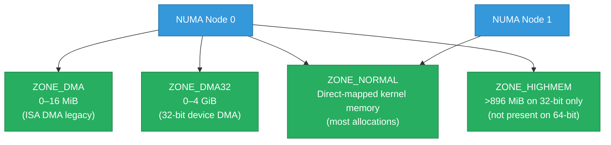

# Kernel Memory Internals — Allocators, Page Cache, and Huge Pages

How the Linux kernel manages physical memory beneath the abstractions that `malloc` and
`mmap` hide: the zone model, the buddy allocator, the slab/SLUB cache, page cache writeback,
TLB shootdowns, and the huge-pages tradeoff. Builds on [memory-tuning.md](./memory-tuning.md)
(which covers `/proc/meminfo` and the OOM killer) and [numa-irq-tuning.md](./numa-irq-tuning.md)
(NUMA node layout).

<div class="quiz-progress" data-quiz-progress>
  <span class="quiz-progress-label">0/0 checks</span>
  <span class="quiz-progress-bar"><span class="quiz-progress-fill"></span></span>
</div>

---

## 1. Physical Memory Layout — Zones and Nodes

The kernel divides physical RAM into **nodes** (NUMA) and within each node into **zones**:



On 64-bit systems, ZONE_HIGHMEM doesn't exist — the entire physical address space is
directly mapped. Most allocations come from ZONE_NORMAL.

```bash
# Per-zone free page counts
cat /proc/zoneinfo | grep -A5 "zone Normal"

# Buddy allocator fragmentation per zone (per order, 0–10)
cat /proc/buddyinfo
# Node 0, zone   Normal   1024  512  256  128  64  32  16   8   4   2   1
# Each column is the count of free blocks of that order (2^order pages)
```

**Memory watermarks** per zone — the kernel allocates pages freely above `high`, starts
kswapd reclaim between `low` and `high`, and invokes direct reclaim below `min`:

```bash
cat /proc/zoneinfo | grep -E "min|low|high|free"
# pages free 12345   min 1000   low 2000   high 3000
```

---

## 2. Buddy Allocator — Page Splitting and Coalescing

The buddy allocator manages free pages in 11 orders (order 0 = 1 page = 4 KiB, order 10 = 1024 pages = 4 MiB). Every free block has a "buddy" — the adjacent same-size block at a predictable address.

**Allocation (request order 2 = 4 pages):**

1. Look for a free order-2 block → if found, return it
2. If none, split an order-3 block into two order-2 buddies; return one, add the other to the order-2 free list
3. Repeat up the order chain until a free block is found

**Deallocation:** When a block is freed, check if its buddy is also free. If so, coalesce into a higher-order block. Recursively coalesce up.

**Fragmentation:** Over time, high-order blocks may not be available even if total free pages are sufficient (they're split into non-contiguous smaller blocks). This is **external fragmentation**.

```bash
# Check fragmentation by order
cat /proc/buddyinfo

# Force memory compaction (migrates pages to reassemble contiguous blocks)
echo 1 > /proc/sys/vm/compact_memory

# Check compaction stats
cat /proc/vmstat | grep compact
# compact_migrate_scanned, compact_free_scanned, compact_isolated
```

**Compaction** moves movable pages (anonymous + file-backed) to free up contiguous regions.
It's triggered automatically when high-order allocation fails, or manually via the above.

<div class="quiz-card">
  <p class="quiz-q">/proc/buddyinfo shows many free pages at orders 0-3 but zero at orders 8-10. A huge page allocation fails. What's happening and how do you fix it?</p>
  <button class="quiz-reveal">Reveal answer</button>
  <div class="quiz-a" hidden>External memory fragmentation: there are plenty of free 4KiB and 32KiB pages but none that form a contiguous 4MiB or 1GiB region needed for huge pages. The buddy allocator can't assemble them because non-movable pages (kernel data, pinned memory) are scattered between free pages, preventing coalescing. Fixes: (1) trigger compaction immediately: `echo 1 > /proc/sys/vm/compact_memory`; (2) allocate huge pages at boot before fragmentation occurs (add `hugepages=N` to kernel cmdline); (3) enable vm.nr_hugepages at system startup before long-running services scatter pages; (4) use 1G huge pages which require a contiguous 1G physical region — these almost always require boot-time reservation.</div>
</div>

---

## 3. Slab / SLUB Allocator

The buddy allocator works in page granularity (4KiB minimum). Most kernel objects are much
smaller (inodes, dentries, socket buffers). The **slab/SLUB allocator** provides a per-object
cache on top of buddy pages.

**SLUB** (the modern replacement for SLAB, default since Linux 2.6.23):

- Maintains per-CPU **slabs** — partial pages being actively carved into objects
- When a slab is exhausted, allocates a new page from buddy and carves it into objects
- When a slab is empty, returns the page to buddy
- Per-CPU caching eliminates lock contention — each CPU has its own object pool

```bash
# Live slab usage — shows top caches by memory
slabtop
# OBJS  ACTIVE   USE OBJ SIZE  SLABS OBJ/SLAB CACHE SIZE NAME
# 65536  63201  96%    0.19K   1638       40      6552K dentry
# 32768  31890  97%    0.62K   2048       16     16384K inode_cache

# Per-cache statistics
cat /proc/slabinfo
# name     <active_objs> <num_objs> <objsize> <objperslab> <pagesperslab>

# Memory used by kernel slab caches (from /proc/meminfo)
grep Slab /proc/meminfo
# Slab:            512000 kB
# SReclaimable:    400000 kB   ← dentries, inodes (can be reclaimed)
# SUnreclaim:      112000 kB   ← kernel internal, cannot be reclaimed

# Drop reclaimable slab caches (dentries, inodes)
echo 2 > /proc/sys/vm/drop_caches
```

**kmalloc vs vmalloc:**

| | `kmalloc` | `vmalloc` |
|---|---|---|
| Physical memory | Contiguous | Non-contiguous (mapped via page table) |
| Virtual memory | Contiguous | Contiguous |
| Size limit | ~4 MiB (order 10) | Limited only by virtual address space |
| TLB pressure | Low | Higher (more PTEs to map) |
| Use case | DMA, performance-critical | Large allocations, modules |

---

## 4. Page Cache — The Heart of File I/O Performance

The **page cache** stores the contents of files in memory. When a process reads a file,
the kernel checks the page cache first; on a miss it reads from disk and populates the cache.
Most writes go to the page cache first (write-back caching) and are flushed to disk
asynchronously by `kworker/flush` threads.

**LRU management:**

The page cache is managed with two LRU lists per zone:
- **Active list** — recently accessed pages (protected from reclaim)
- **Inactive list** — older pages (candidates for reclaim when memory is low)

Pages move: inactive → active on second access (promotes), active → inactive under memory pressure (demotes).

**Dirty page writeback controls:**

```bash
# Key /proc/sys/vm knobs
cat /proc/sys/vm/dirty_ratio          # 20: start writeback when dirty > 20% of RAM
cat /proc/sys/vm/dirty_background_ratio  # 10: start background writeback at 10%
cat /proc/sys/vm/dirty_expire_centisecs # 3000 = 30s: max age of dirty page before flush
cat /proc/sys/vm/dirty_writeback_centisecs # 500 = 5s: how often kworker wakes to flush

# For low-latency systems (databases), reduce dirty ratios to bound flush latency:
sysctl vm.dirty_ratio=5
sysctl vm.dirty_background_ratio=2
```

**fsync semantics:**

| Call | What it guarantees |
|---|---|
| `write()` | Data in page cache (kernel); may not be on disk |
| `fsync()` | Data AND metadata on disk (flushes dirty pages + inode) |
| `fdatasync()` | Data on disk; metadata only if needed for recovery (faster) |
| `sync()` | All dirty pages on disk — system-wide (slow) |
| `O_DIRECT` | Bypasses page cache entirely; write goes to disk via DMA |
| `O_SYNC` | Each write is immediately fsync'd |

For databases: use `fdatasync()` or `O_DIRECT + O_DSYNC` for journal writes. Using
`write()` alone risks data loss on power failure even if the kernel acknowledges the write.

---

## 5. TLB and Huge Pages

**The TLB problem:** The CPU uses a TLB (Translation Lookaside Buffer) to cache virtual →
physical address translations. With 4KiB pages, a 1GiB working set requires 262,144 page
table entries — many won't fit in the TLB, causing page table walks (slow).

**Huge pages** solve this by using larger pages, reducing TLB entries needed:

| Page size | Coverage per TLB entry | Use case |
|---|---|---|
| 4 KiB (default) | 4 KiB | Everything; no wasted space |
| 2 MiB | 2 MiB | Database buffer pools, JVM heaps |
| 1 GiB | 1 GiB | ML model inference, HPC, in-memory databases |

**Explicit HugeTLB** (reserved at boot, never swapped):

```bash
# Reserve 512 × 2MiB huge pages (1 GiB total)
echo 512 > /proc/sys/vm/nr_hugepages
# Or in /etc/sysctl.conf:
# vm.nr_hugepages = 512

# Verify
grep Huge /proc/meminfo
# HugePages_Total:     512
# HugePages_Free:      487
# HugePages_Rsvd:       25
# Hugepagesize:        2048 kB

# Mount hugetlbfs for mmap access
mount -t hugetlbfs hugetlbfs /mnt/huge
```

Applications opt in with `mmap(... MAP_HUGETLB)` or via `libhugetlbfs`.

**Transparent Huge Pages (THP)** — the kernel automatically promotes eligible 4KiB page
ranges to 2MiB huge pages without application changes:

```bash
cat /sys/kernel/mm/transparent_hugepage/enabled
# [always] madvise never

# always: promote automatically (max TLB benefit, but defrag stalls can cause latency spikes)
# madvise: promote only for regions with madvise(MADV_HUGEPAGE)
# never: disable THP

# For latency-sensitive apps (Redis, databases):
echo madvise > /sys/kernel/mm/transparent_hugepage/enabled
echo defer+madvise > /sys/kernel/mm/transparent_hugepage/defrag
# defer: delay defrag to khugepaged, avoiding direct reclaim stalls
```

**THP latency hazard:** When the kernel promotes pages, it must run compaction to assemble
a contiguous 2MiB region. If this happens in the allocation hot path, it causes latency
spikes of 1–100ms. Redis, Cassandra, and latency-sensitive services should use `madvise`
or `never` and explicitly request huge pages where beneficial.

<div class="quiz-card">
  <p class="quiz-q">A Redis instance shows periodic 50ms latency spikes even with no load. THP is set to "always". What's causing the spikes and what's the fix?</p>
  <button class="quiz-reveal">Reveal answer</button>
  <div class="quiz-a" hidden>THP defragmentation stalls. When the kernel tries to promote a 4KiB region to a 2MiB huge page (THP "always" mode), it first needs to find or create a contiguous 2MiB physical region via compaction. This compaction can block the process for tens of milliseconds. Redis is single-threaded for its main event loop, so any such stall is visible as a latency spike even without client load. Fix: set THP to "madvise" (Redis doesn't use madvise, so this effectively disables THP for Redis), or "never". Also set defrag to "defer+madvise" so any remaining THP activity runs asynchronously in khugepaged rather than in the allocation fast path.</div>
</div>

---

## 6. Memory Pressure Signals — PSI

**PSI (Pressure Stall Information)**, available since Linux 4.20, measures how much time
tasks are stalled waiting for memory (or CPU, I/O). Unlike `/proc/meminfo` which is a
snapshot, PSI gives time-aggregated pressure metrics.

```bash
cat /proc/pressure/memory
# some avg10=0.00 avg60=0.00 avg300=0.00 total=0
# full avg10=0.00 avg60=0.00 avg300=0.00 total=0

# "some" = at least one task stalled on memory
# "full" = ALL tasks stalled on memory (near OOM)
# avg10/60/300 = moving averages over 10s/60s/300s (%)
# total = cumulative stall time in microseconds

# Real example under memory pressure:
# some avg10=45.00 avg60=12.00 avg300=3.00 total=8423000
# → 45% of the last 10s, at least one task was stalled waiting for memory
```

**Monitoring PSI in production:**

```bash
# Alert when memory pressure sustained >10% over 60s
while true; do
  psi=$(awk '/^some/ {print $3}' /proc/pressure/memory | cut -d= -f2)
  echo "Memory pressure 60s avg: ${psi}%"
  sleep 10
done
```

**cgroup memory pressure notifications** — subscribe to memory.pressure events from a
specific cgroup to react before OOM:

```bash
# Read pressure for a specific cgroup (cgroup v2)
cat /sys/fs/cgroup/myapp/memory.pressure
```

---

## 7. Practical Diagnostics

```bash
# Full /proc/meminfo walkthrough
grep -E "MemTotal|MemFree|MemAvailable|Buffers|Cached|SwapCached|Active|Inactive|Slab|PageTables|Mapped|AnonPages|Dirty|Writeback" /proc/meminfo
# MemAvailable ≈ free + reclaimable (a better "how much can I allocate" metric than MemFree)
# Dirty = pages modified but not yet written to disk
# Writeback = pages currently being written

# Slab usage
slabtop -s c       # sort by cache size
vmstat -m          # per-slab stats

# Buddy fragmentation
cat /proc/buddyinfo
# Low order 0-2 = fine; zero at orders 8-10 = fragmentation problem

# Unusable fragmentation index (0 = not fragmented, 1000 = completely fragmented)
cat /sys/kernel/debug/extfrag/unusable_index

# Page reclaim stats
cat /proc/vmstat | grep -E "pgpgin|pgpgout|pswpin|pswpout|pgfault|pgmajfault|nr_dirty|nr_writeback"
# pgmajfault = major page faults (required disk I/O) — high = working set exceeds RAM

# Memory pressure
cat /proc/pressure/memory
```

---

## Quick Reference

```
Zone layout                    cat /proc/zoneinfo
Buddy fragmentation            cat /proc/buddyinfo
Force compaction               echo 1 > /proc/sys/vm/compact_memory
Slab usage                     slabtop -s c
Reclaimable slab               grep SReclaimable /proc/meminfo
Drop slab caches               echo 2 > /proc/sys/vm/drop_caches
Dirty page ratio               /proc/sys/vm/dirty_ratio (default 20%)
Dirty background ratio         /proc/sys/vm/dirty_background_ratio (default 10%)
Reserve 2MiB huge pages        echo N > /proc/sys/vm/nr_hugepages
THP mode                       cat /sys/kernel/mm/transparent_hugepage/enabled
Disable THP (for Redis)        echo madvise > /sys/kernel/mm/transparent_hugepage/enabled
Memory pressure                cat /proc/pressure/memory
MemAvailable                   grep MemAvailable /proc/meminfo (better than MemFree)
Major page faults              cat /proc/vmstat | grep pgmajfault
```
