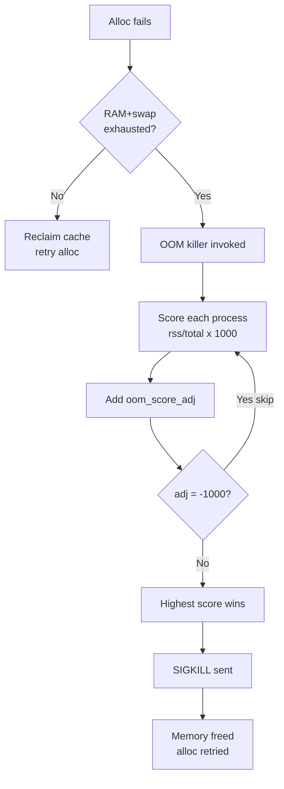
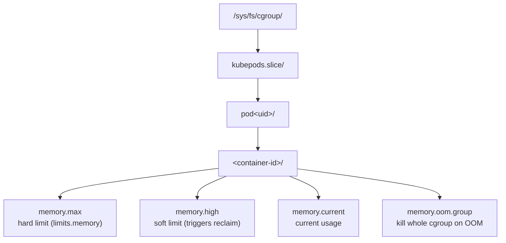
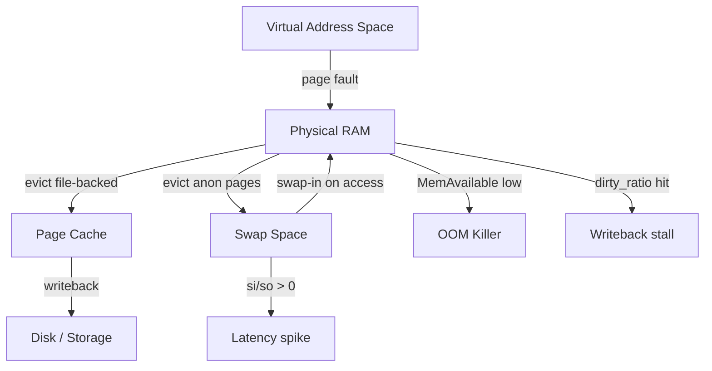

# Memory Tuning

A field-level reference for reading and tuning Linux memory: what the kernel's own counters mean, how the OOM killer picks a victim, when swap helps vs hurts, and how cgroups v2 turn into Kubernetes memory limits. Knowledge checks are sprinkled throughout — track how many you've cleared:

<div class="quiz-progress" data-quiz-progress>
  <span class="quiz-progress-label">0/0 checks</span>
  <span class="quiz-progress-bar"><span class="quiz-progress-fill"></span></span>
</div>

---

## 1. /proc/meminfo — Key Fields

```bash
cat /proc/meminfo
```

```
MemTotal:       16384000 kB   # Total physical RAM
MemFree:          512000 kB   # Completely unused RAM
MemAvailable:    8192000 kB   # Estimated available for new processes
Buffers:          256000 kB   # Block device read cache (metadata)
Cached:          4096000 kB   # Page cache (file data)
SwapCached:        12000 kB   # Swap data also in RAM
Active:          6144000 kB   # Recently used, not easily reclaimable
Inactive:        3072000 kB   # LRU candidates for reclaim
Dirty:             64000 kB   # Modified pages not yet written to disk
Writeback:          8000 kB   # Pages being written to disk now
Slab:             512000 kB   # Kernel data structures
SReclaimable:     256000 kB   # Reclaimable slab (dentries/inodes)
SUnreclaim:       256000 kB   # Unreclaimable slab
```

**Critical distinction — MemFree vs MemAvailable:**

| Field | Meaning |
|-------|---------|
| `MemFree` | Pages with nothing in them — misleadingly low on healthy systems |
| `MemAvailable` | MemFree + reclaimable buffers/cache + part of slab. **Use this** to judge if memory is available for a new process |

> A server with MemFree=100MB but MemAvailable=8GB is healthy. The kernel uses free RAM for caching aggressively.

<div class="quiz-card">
  <p class="quiz-q">A server shows MemFree=100MB and MemAvailable=8GB. Is it low on memory?</p>
  <button class="quiz-reveal">Reveal answer</button>
  <div class="quiz-a" hidden>No. MemAvailable already accounts for reclaimable buffers/cache and part of slab, so 8GB is genuinely available to a new process. MemFree alone is misleading &mdash; the kernel deliberately spends spare RAM on page cache, so a low MemFree on an otherwise healthy box is normal, not a warning sign.</div>
</div>

---

## 2. Swap and Swappiness

```bash
# Show swap usage
swapon --show
free -h

# Swappiness control
sysctl vm.swappiness
sysctl -w vm.swappiness=10
```

**vm.swappiness values:**

| Value | Behaviour |
|-------|-----------|
| `0` | Swap only to avoid OOM; never proactively |
| `10` | Low swap tendency; prefer to reclaim file cache (recommended for DBs) |
| `60` | Default; balanced |
| `100` | Swap aggressively; treat file cache and anon memory equally |

**Persist:**
```bash
echo "vm.swappiness = 10" >> /etc/sysctl.d/99-memory.conf
sysctl -p /etc/sysctl.d/99-memory.conf
```

**When swap is useful vs harmful:**
- Useful: cushion for rarely-accessed JVM heap; allows overcommit for fork-heavy workloads
- Harmful: database buffers getting swapped causes 100ms+ latency spikes; use `swappiness=1` for MySQL/PostgreSQL/Redis

<div class="quiz-card">
  <p class="quiz-q">Does setting vm.swappiness=0 disable swapping entirely?</p>
  <button class="quiz-reveal">Reveal answer</button>
  <div class="quiz-a" hidden>No. Per the table above, <code>0</code> means "swap only to avoid OOM, never proactively" &mdash; the kernel still reclaims file cache first, but it will still swap anonymous memory rather than let the system hit an out-of-memory condition. It's not an on/off switch, it's the low end of a tendency dial.</div>
</div>

---

## 3. OOM Killer

When physical memory + swap is exhausted, the kernel OOM killer selects and kills a process.

**Score calculation:**
```
oom_score = (process_rss / total_memory) × 1000
          + oom_score_adj
```

- Higher score → killed first
- `oom_score_adj` range: -1000 (never kill) to +1000 (always kill first)

```bash
# Check a process's OOM score
cat /proc/1234/oom_score
cat /proc/1234/oom_score_adj

# Protect critical process (e.g., sshd)
echo -1000 > /proc/$(pgrep sshd)/oom_score_adj

# Make process OOM target
echo 500 > /proc/$(pgrep myapp)/oom_score_adj

# Persist via unit file — in [Service] section:
# OOMScoreAdjust=-500
```

**Reading OOM events in dmesg:**
```bash
dmesg -T | grep -i "oom\|killed process\|out of memory"
```

```
Out of memory: Kill process 5432 (java) score 892 or sacrifice child
Killed process 5432 (java) total-vm:4194304kB, anon-rss:3145728kB
```

- `score 892` — oom_score at time of kill
- `anon-rss` — anonymous (heap/stack) RSS
- `total-vm` — virtual address space (larger than physical)



Same sequence, one step at a time:

<div class="stepper">
  <div class="stepper-panels">
    <div class="stepper-panel active">
      <strong>1. Allocation fails.</strong> The kernel first tries to reclaim reclaimable memory (page cache, slab) and retry the allocation. The OOM killer is only invoked once RAM and swap together are actually exhausted, not just fragmented.
    </div>
    <div class="stepper-panel">
      <strong>2. OOM killer invoked.</strong> It walks every process on the system as a candidate victim.
    </div>
    <div class="stepper-panel">
      <strong>3. Score each candidate.</strong> <code>oom_score = (process_rss / total_memory) &times; 1000</code>, then <code>oom_score_adj</code> is added on top. A process using a larger share of RAM starts with a higher base score.
    </div>
    <div class="stepper-panel">
      <strong>4. Exempt processes are skipped.</strong> Anything with <code>oom_score_adj = -1000</code> is never a candidate, no matter how much RSS it holds &mdash; this is how sshd or a monitoring agent gets protected.
    </div>
    <div class="stepper-panel">
      <strong>5. Highest score wins.</strong> The kernel picks the surviving process with the highest score and sends it <code>SIGKILL</code> (or a child, per the dmesg line "score X or sacrifice child").
    </div>
    <div class="stepper-panel">
      <strong>6. Memory freed, alloc retried.</strong> The killed process's memory is released and the original failed allocation is retried.
    </div>
  </div>
  <div class="stepper-controls">
    <button class="stepper-prev">← Prev</button>
    <span class="stepper-dots"></span>
    <span class="stepper-label"></span>
    <button class="stepper-next">Next →</button>
  </div>
</div>

<div class="quiz-card">
  <p class="quiz-q">A process has oom_score_adj set to -1000. Can the OOM killer ever pick it as a victim?</p>
  <button class="quiz-reveal">Reveal answer</button>
  <div class="quiz-a" hidden>No. -1000 exempts it completely from scoring &mdash; it's skipped as a candidate regardless of how much RSS it holds. That's the mechanism behind protecting a critical daemon like sshd: <code>echo -1000 &gt; /proc/$(pgrep sshd)/oom_score_adj</code>.</div>
</div>

---

## 4. Dirty Pages

Dirty pages are modified memory pages not yet flushed to disk. Too many → data loss risk on crash. Too aggressive flushing → I/O spikes.

```bash
# Current dirty page stats
cat /proc/meminfo | grep -i dirty
grep -r "" /proc/sys/vm/dirty*
```

**Tuning parameters:**

| Parameter | Default | Meaning |
|-----------|---------|---------|
| `vm.dirty_ratio` | 20 | % of total memory: if exceeded, processes block waiting for writeback |
| `vm.dirty_background_ratio` | 10 | % of total memory: background writeback starts at this threshold |
| `vm.dirty_expire_centisecs` | 3000 | Pages dirty longer than 30s are written |
| `vm.dirty_writeback_centisecs` | 500 | Flush daemon wakes every 5s |

```bash
# Reduce for databases (minimize write spikes)
sysctl -w vm.dirty_ratio=5
sysctl -w vm.dirty_background_ratio=2

# Force flush all dirty pages now
sync && echo 3 > /proc/sys/vm/drop_caches
```

The two ratios above aren't the same trigger — walk through what actually happens to a page from the moment it's written:

<div class="stepper">
  <div class="stepper-panels">
    <div class="stepper-panel active">
      <strong>1. Write happens.</strong> The page is modified in the page cache and marked dirty. Nothing has hit disk yet — the write returns immediately.
    </div>
    <div class="stepper-panel">
      <strong>2. Flush daemon wakes on schedule.</strong> Every <code>vm.dirty_writeback_centisecs</code> (default 500 = 5s), the kernel's writeback thread checks dirty page state.
    </div>
    <div class="stepper-panel">
      <strong>3. Background threshold hit.</strong> Once total dirty pages exceed <code>vm.dirty_background_ratio</code> (default 10% of RAM), background writeback starts asynchronously — processes doing writes are not blocked.
    </div>
    <div class="stepper-panel">
      <strong>4. Age threshold hit.</strong> Independently, any page dirty longer than <code>vm.dirty_expire_centisecs</code> (default 3000 = 30s) gets written regardless of the ratio thresholds.
    </div>
    <div class="stepper-panel">
      <strong>5. Foreground threshold hit.</strong> If dirty pages keep growing past <code>vm.dirty_ratio</code> (default 20% of RAM), any process attempting a write is blocked synchronously until writeback catches up — this is the I/O stall you feel.
    </div>
    <div class="stepper-panel">
      <strong>6. Pages written, Dirty drops.</strong> Writeback completes, <code>Dirty</code> in <code>/proc/meminfo</code> shrinks, and any blocked writers resume.
    </div>
  </div>
  <div class="stepper-controls">
    <button class="stepper-prev">← Prev</button>
    <span class="stepper-dots"></span>
    <span class="stepper-label"></span>
    <button class="stepper-next">Next →</button>
  </div>
</div>

<div class="quiz-card">
  <p class="quiz-q">vm.dirty_background_ratio is 10 and vm.dirty_ratio is 20. What happens when dirty pages hit 15% of memory?</p>
  <button class="quiz-reveal">Reveal answer</button>
  <div class="quiz-a" hidden>Background writeback is already running (it kicked in at 10%), but writers are not blocked — that only happens at 20% (dirty_ratio). Between the two thresholds, writeback happens asynchronously while processes keep writing at full speed; only crossing dirty_ratio itself makes writes block.</div>
</div>

---

## 5. Transparent Huge Pages (THP)

THP automatically promotes 4KB pages to 2MB huge pages to reduce TLB pressure.

**Benefits:**
- Fewer TLB entries needed for large working sets
- Reduced page table walk overhead
- Beneficial for: in-memory analytics, scientific computing, large JVM heaps

**Problems:**
- `khugepaged` daemon compacts memory in background — causes latency spikes of 10-100ms
- Especially harmful for: Redis, MySQL, PostgreSQL, MongoDB, Cassandra

```bash
# Check current setting
cat /sys/kernel/mm/transparent_hugepage/enabled
# [always] madvise never

# Disable for databases
echo never > /sys/kernel/mm/transparent_hugepage/enabled
echo never > /sys/kernel/mm/transparent_hugepage/defrag
```

**Opt in selectively (recommended approach):**
```c
// In application code, use madvise for specific regions
madvise(ptr, size, MADV_HUGEPAGE);   // request THP
madvise(ptr, size, MADV_NOHUGEPAGE); // opt out
```

Set `/sys/kernel/mm/transparent_hugepage/enabled` to `madvise` — only allocate huge pages when explicitly requested.

The three modes, side by side:

<div class="tab-group">
  <div class="tab-buttons">
    <button data-tab="always" class="active">always</button>
    <button data-tab="madvise">madvise</button>
    <button data-tab="never">never</button>
  </div>
  <div class="tab-panels">
    <div class="tab-panel active" data-tab-panel="always">
      <strong>Kernel default on most distros.</strong> Every eligible mapping gets promoted to huge pages automatically, no application changes needed. <code>khugepaged</code> runs continuously in the background compacting memory to create more huge pages — that compaction is exactly what causes the 10&ndash;100ms latency spikes that make this mode risky for Redis, MySQL, PostgreSQL, MongoDB, and Cassandra.
    </div>
    <div class="tab-panel" data-tab-panel="madvise">
      <strong>Opt-in, per allocation.</strong> Huge pages are only used where an application explicitly calls <code>madvise(ptr, size, MADV_HUGEPAGE)</code> on a region; everything else stays on regular 4KB pages. This is the recommended middle ground — workloads that know they benefit (large JVM heaps, analytics engines) can ask for huge pages on their hot regions without <code>khugepaged</code> silently compacting memory system-wide.
    </div>
    <div class="tab-panel" data-tab-panel="never">
      <strong>Fully disabled.</strong> No huge pages, no <code>khugepaged</code> background compaction, ever. The safe default for latency-sensitive databases willing to eat the (small) extra TLB overhead of 4KB pages in exchange for never risking a multi-millisecond compaction stall.
    </div>
  </div>
</div>

<div class="quiz-card">
  <p class="quiz-q">Why is "never" often the safer choice for a latency-sensitive database, even though huge pages themselves would reduce TLB overhead?</p>
  <button class="quiz-reveal">Reveal answer</button>
  <div class="quiz-a" hidden>It isn't the huge pages that hurt — it's khugepaged, the background daemon that compacts memory to create them, which can stall the system for 10-100ms at unpredictable times under "always". "never" trades away the TLB benefit to avoid that compaction latency entirely; "madvise" is the compromise that keeps the benefit for opted-in regions without the surprise stalls elsewhere.</div>
</div>

---

## 6. Memory cgroups v2 — How K8s Limits Work

Kubernetes uses cgroups v2 to enforce memory limits on pods/containers.



```bash
# Check container memory limits from host
cat /sys/fs/cgroup/kubepods.slice/pod<uid>/<cid>/memory.max

# Current usage
cat /sys/fs/cgroup/kubepods.slice/pod<uid>/<cid>/memory.current

# OOM events for this cgroup
cat /sys/fs/cgroup/kubepods.slice/pod<uid>/<cid>/memory.events
```

**K8s limit mapping:**

| K8s field | cgroup file | Effect |
|-----------|-------------|--------|
| `resources.limits.memory` | `memory.max` | Hard limit; exceeding → OOM kill |
| `resources.requests.memory` | scheduling hint | No cgroup enforcement |
| — | `memory.high` | ~90% of limit; triggers aggressive reclaim before OOM |

**OOMKilled pod:** When a container exceeds `memory.max`, the kernel OOM killer kills the cgroup's processes. K8s reports `OOMKilled` in pod status and restarts the container if `restartPolicy: Always`.

<div class="quiz-card">
  <p class="quiz-q">A container's memory.current climbs past memory.high but stays under memory.max. Is it OOM-killed?</p>
  <button class="quiz-reveal">Reveal answer</button>
  <div class="quiz-a" hidden>No. memory.high isn't a kill threshold &mdash; it's a soft limit that triggers aggressive reclaim, the kernel pushing usage back down. The container is only OOM-killed once it actually tries to exceed memory.max, the hard limit. Crossing memory.high just means reclaim pressure, not termination.</div>
</div>

---

## 7. Practical Commands

```bash
# Overview: total, used, free, shared, buff/cache, available
free -h

# Virtual memory stats every second (key: si/so = swap in/out)
vmstat 1
# si > 0 or so > 0 → active swapping → investigate

# Per-process memory summary (RSS, PSS, Swap)
cat /proc/1234/smaps_rollup

# Sort processes by RSS
ps aux --sort=-%mem | head -20

# Detailed memory map for a process
pmap -x 1234

# Page fault stats
ps -o pid,min_flt,maj_flt -p 1234
# maj_flt > 0 → page faults requiring disk I/O

# Check for memory pressure events
dmesg | grep -i "memory\|oom\|killed"
```

**vmstat key columns:**

| Column | Meaning |
|--------|---------|
| `r` | Runnable processes (if > CPUs → CPU saturated) |
| `b` | Processes blocked on I/O |
| `swpd` | Virtual memory used (total swap) |
| `si` | Swap in (from disk to RAM) — bad if > 0 |
| `so` | Swap out (from RAM to disk) — bad if > 0 |
| `bi` | Blocks read from disk |
| `bo` | Blocks written to disk |



---

## OOM Killer — Score Tuning and Process Protection

The Linux OOM killer picks a victim using an **oom_score** (0–1000). Higher score = more likely to be killed. The score is calculated from memory usage as a percentage of total RAM, with adjustments.

### Reading and tuning OOM scores

```bash
# See the current OOM score for a process
cat /proc/<pid>/oom_score
# 0 = never killed (init/systemd), 1000 = killed first

# See the OOM score adjustment (tunable by root or the process itself)
cat /proc/<pid>/oom_score_adj
# Range: -1000 to +1000
# -1000 = completely exempt from OOM killing (use for critical daemons)
# +1000 = first target when OOM occurs
# 0     = default (no adjustment)

# Protect a critical process (e.g., your monitoring agent)
echo -1000 > /proc/$(pidof prometheus)/oom_score_adj

# Make a low-priority process the first OOM target
echo 1000 > /proc/$(pidof batch-job)/oom_score_adj

# Persist across restarts (systemd unit file)
# [Service]
# OOMScoreAdjust=-1000
```

**Kubernetes and oom_score_adj:**
```
QoS class         oom_score_adj set by kubelet
Guaranteed        -997   (protected, killed last)
Burstable         2 to 999  (proportional to memory usage vs request)
BestEffort        1000   (killed first)
```

The kubelet sets `oom_score_adj` automatically based on QoS class. This is why Guaranteed pods survive node memory pressure while BestEffort pods are the first to go.

<div class="toggle-switch">
  <div class="toggle-buttons">
    <button data-toggle-opt="guaranteed" class="active state-ok">Guaranteed</button>
    <button data-toggle-opt="burstable" class="state-warn">Burstable</button>
    <button data-toggle-opt="besteffort" class="state-bad">BestEffort</button>
  </div>
  <div class="toggle-panel active" data-toggle-panel="guaranteed">
    <strong>oom_score_adj = -997.</strong> Set when every container in the pod has requests equal to limits, for both CPU and memory. Effectively protected &mdash; killed last, only once nothing else survivable is left on the node.
  </div>
  <div class="toggle-panel" data-toggle-panel="burstable">
    <strong>oom_score_adj = 2 to 999.</strong> Set when at least one container has a request below its limit. The exact value is proportional to how much memory the pod is actually using relative to what it requested &mdash; a pod that's ballooned way past its request scores closer to 999, one still near its request scores much lower.
  </div>
  <div class="toggle-panel" data-toggle-panel="besteffort">
    <strong>oom_score_adj = 1000.</strong> Set when no container specifies memory or CPU requests/limits at all. Always the first target under node memory pressure &mdash; the kubelet gives it zero protection.
  </div>
</div>

<div class="quiz-card">
  <p class="quiz-q">Node runs out of memory. Which pod gets killed first: a Burstable pod using 3x its requested memory, or a BestEffort pod using barely any memory at all?</p>
  <button class="quiz-reveal">Reveal answer</button>
  <div class="quiz-a" hidden>The BestEffort pod. Its oom_score_adj is a fixed 1000 regardless of actual usage &mdash; QoS class sets a floor the kubelet never lets it rise above. A Burstable pod's score is proportional to overage, so it can get close to 999, but BestEffort is pinned at the maximum unconditionally.</div>
</div>

### Memory pressure debugging with PSI

Pressure Stall Information (PSI) gives a percentage of time tasks were stalled waiting for memory. Available in kernels 4.20+ and cgroup v2.

```bash
# System-wide memory pressure (requires CONFIG_PSI=y)
cat /proc/pressure/memory
# some avg10=12.50 avg60=5.20 avg300=2.10 total=8732101
# full avg10=0.50  avg60=0.20 avg300=0.10 total=1231456

# "some" = at least one task stalled (memory unavailable for at least one process)
# "full" = ALL tasks stalled (all processes waiting for memory simultaneously)
# avg10/60/300 = percentage over last 10s / 60s / 300s

# Per-cgroup PSI (for specific pods/containers)
cat /sys/fs/cgroup/kubepods/burstable/pod<uid>/memory.pressure
# Same format — shows pressure for that specific cgroup

# A value above 20% on avg60 = significant memory contention
# A value above 5% on "full" = severe pressure, consider adding RAM

# Monitor PSI with a simple threshold alert (bash)
while true; do
  psi=$(awk '/some/{print $2}' /proc/pressure/memory | cut -d= -f2)
  if (( $(echo "$psi > 20" | bc -l) )); then
    echo "ALERT: memory pressure avg10=$psi%"
  fi
  sleep 10
done
```

<div class="toggle-switch">
  <div class="toggle-buttons">
    <button data-toggle-opt="some" class="active">some</button>
    <button data-toggle-opt="full">full</button>
  </div>
  <div class="toggle-panel active" data-toggle-panel="some">
    At least one task on the system was stalled waiting for memory during the window. Other tasks may have kept running fine &mdash; this is the earlier, more sensitive warning signal.
  </div>
  <div class="toggle-panel" data-toggle-panel="full">
    Every runnable task was stalled waiting for memory at the same time &mdash; nothing could make progress. This is the more severe signal: CPU is sitting idle because there's simply no memory to hand out.
  </div>
</div>

<div class="quiz-card">
  <p class="quiz-q">/proc/pressure/memory shows "some avg10=40.00" and "full avg10=0.10". Is the whole system stalled?</p>
  <button class="quiz-reveal">Reveal answer</button>
  <div class="quiz-a" hidden>No. "some" being high means at least one task was stalled a lot of the time, but "full" near zero means it's almost never the case that every task is stalled simultaneously &mdash; other tasks are still making progress. This pattern points at one or two memory-hungry processes under pressure, not a system-wide memory crisis.</div>
</div>

### Swap behavior

```bash
# Check current swap usage
free -h
swapon --show

# vm.swappiness controls tendency to swap (0-200, default 60)
# 0  = avoid swapping until absolutely necessary (memory filled)
# 60 = balanced (kernel's default)
# 100 = swap aggressively to keep file cache warm
# 200 = (kernel 5.8+) swap memory pages even if RAM available (for memory pressure early-warning)

# Check current value
cat /proc/sys/vm/swappiness

# Tune for a latency-sensitive server (prefer keeping process pages in RAM)
sysctl -w vm.swappiness=10
echo "vm.swappiness=10" >> /etc/sysctl.d/99-memory.conf

# Tune for a desktop or batch workload (aggressive swap)
sysctl -w vm.swappiness=80
```

**zswap — compressed swap in RAM (best of both worlds):**
```bash
# zswap compresses evicted pages and stores them in a RAM pool
# before writing to disk. Reduces I/O, improves swap performance.
# Enable:
echo 1 > /sys/module/zswap/parameters/enabled
echo lz4 > /sys/module/zswap/parameters/compressor
echo 20 > /sys/module/zswap/parameters/max_pool_percent  # max 20% of RAM

# Check zswap stats
cat /sys/kernel/debug/zswap/*
```

### Memory pressure debugging workflow

```bash
# 1. Check if OOM kills are happening
dmesg -T | grep -i "oom\|killed process\|out of memory"
# Output: "Out of memory: Kill process 12345 (java) score 891"
# "Killed process 12345 (java) total-vm:2097152kB, anon-rss:1048576kB"

# 2. Identify what's consuming memory
ps aux --sort=-%mem | head -20
cat /proc/meminfo | grep -E "MemTotal|MemFree|MemAvailable|Cached|Buffers|SwapTotal|SwapFree"
# MemAvailable = actual available (includes reclaimable cache) — more accurate than MemFree

# 3. Find memory-hungry cgroups (K8s nodes)
find /sys/fs/cgroup/kubepods -name "memory.current" -exec sh -c 'echo "$1: $(cat $1)" ' _ {} \; | sort -t: -k2 -n | tail -10

# 4. Check for slab cache bloat
slabtop -o | head -20
cat /proc/slabinfo | sort -k3 -rn | head -20
# inode_cache, dentry_cache, kmalloc-* growing = likely a kernel memory leak

# 5. Check transparent huge pages — THP can cause latency spikes
cat /sys/kernel/mm/transparent_hugepage/enabled
# [always] madvise never
# "always" causes compaction stalls. For latency-sensitive:
echo madvise > /sys/kernel/mm/transparent_hugepage/enabled
echo defer+madvise > /sys/kernel/mm/transparent_hugepage/defrag

# 6. Drop caches to reclaim if legitimate need
# (safe to do — kernel will repopulate from disk on next access)
sync && echo 3 > /proc/sys/vm/drop_caches
# 1 = page cache only, 2 = dentries/inodes, 3 = both
# WARNING: causes temporary I/O spike as caches repopulate
```

### GOMEMLIMIT — Go garbage collector and K8s memory limits

Go 1.19+ supports `GOMEMLIMIT` — a soft memory limit that tells the GC to collect more aggressively before reaching the limit. Set it to ~90% of the K8s memory limit to prevent OOMKill.

```yaml
env:
  - name: GOMEMLIMIT
    valueFrom:
      resourceFieldRef:
        resource: limits.memory
        divisor: "1"   # bytes
# This sets GOMEMLIMIT = limits.memory value exactly
# Better: set to 90% via init container or manually:
  - name: GOMEMLIMIT
    value: "460MiB"   # 90% of 512Mi limit
```

Without `GOMEMLIMIT`, Go GC targets 100% heap growth by default. The heap can spike 2x before GC kicks in — easily exceeding K8s memory limits → OOMKill. With `GOMEMLIMIT`, GC collects proactively near the limit.

<div class="quiz-card">
  <p class="quiz-q">A Go service has a 512Mi K8s memory limit but no GOMEMLIMIT set. Why can it get OOMKilled even though its live heap is well under 512Mi?</p>
  <button class="quiz-reveal">Reveal answer</button>
  <div class="quiz-a" hidden>Go's default GC targets 100% heap growth before collecting &mdash; meaning the heap can balloon to roughly 2x its live-object size before a collection cycle kicks in. That transient 2x spike can blow past the 512Mi cgroup limit even though the steady-state live heap would fit comfortably. GOMEMLIMIT tells the GC to collect proactively as it nears the limit, instead of waiting for the 100%-growth target.</div>
</div>
