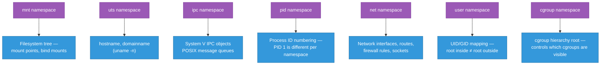
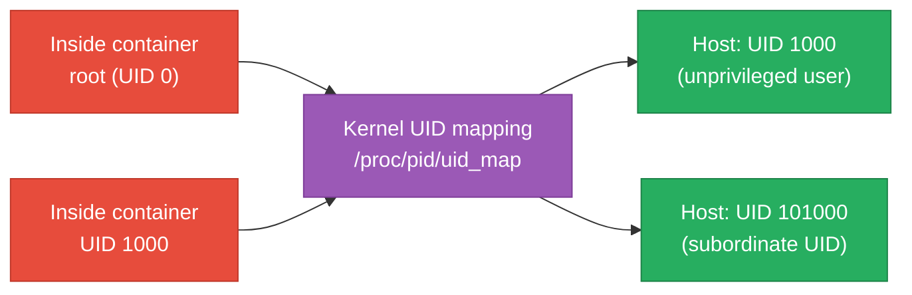
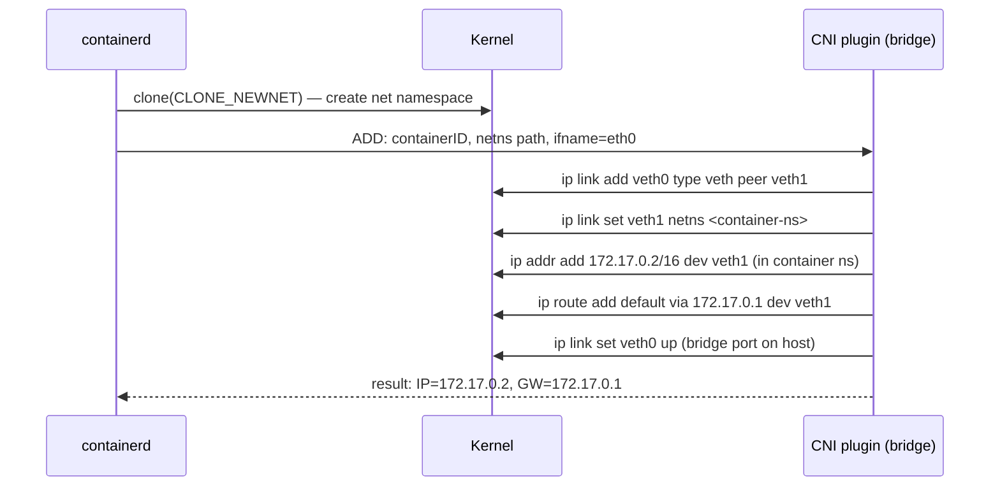

# Linux Namespaces — Isolation Internals and Hands-On Debugging

The kernel feature that makes containers possible, explained from the syscall level up: what
each of the seven namespace types actually isolates, how to create and enter them from the
shell, and what Docker/containerd do under the hood when they run a container. Builds on
[containers-evolution.md](./containers-evolution.md)'s historical narrative — this file covers
the mechanics in depth.

<div class="quiz-progress" data-quiz-progress>
  <span class="quiz-progress-label">0/0 checks</span>
  <span class="quiz-progress-bar"><span class="quiz-progress-fill"></span></span>
</div>

---

## 1. The Seven Namespace Types

Every Linux process inherits a set of namespaces from its parent. A namespace is a kernel
object — a wrapper around a global resource that makes the resource appear private to a group
of processes. Two processes in different namespaces of the same type see completely different
views of that resource.



| Namespace | Kernel constant | Isolates | Added |
|---|---|---|---|
| **mnt** | `CLONE_NEWNS` | Mount table — filesystem tree each process sees | 2002 |
| **uts** | `CLONE_NEWUTS` | `hostname` and `domainname` (from `struct utsname`) | 2006 |
| **ipc** | `CLONE_NEWIPC` | System V semaphores, message queues, shared memory segments | 2006 |
| **pid** | `CLONE_NEWPID` | Process ID space — the first process gets PID 1 | 2008 |
| **net** | `CLONE_NEWNET` | Network interfaces, routing tables, iptables rules, sockets | 2009 |
| **user** | `CLONE_NEWUSER` | UID/GID mapping — unprivileged user appears as root inside | 2012 |
| **cgroup** | `CLONE_NEWCGROUP` | cgroup hierarchy root — prevents container escaping its cgroup subtree | 2016 |

`CLONE_NEWNS` is an unusual name — "NS" instead of "MNT" — because it was the first namespace
type and predates the general abstraction. The kernel constant was never renamed.

<div class="quiz-card">
  <p class="quiz-q">Two containers on the same host both run a process that appears as PID 1 inside the container. What prevents them from interfering with each other's PID 1?</p>
  <button class="quiz-reveal">Reveal answer</button>
  <div class="quiz-a" hidden>Each container has its own pid namespace. The PID numbering inside each namespace is independent — the kernel maintains a mapping from namespace-local PIDs to global PIDs internally, but each container only ever sees its own namespace's view. From the host, both processes have distinct global PIDs (e.g., 1234 and 5678); inside each container, both see themselves as PID 1.</div>
</div>

---

## 2. Inspecting Namespaces — `/proc/[pid]/ns/`

Every process's current namespace memberships are exposed as symlinks in `/proc/[pid]/ns/`.
Each symlink points to a pseudo-file whose inode number is the kernel's namespace ID:

```bash
ls -la /proc/$$/ns/
# lrwxrwxrwx cgroup -> cgroup:[4026531835]
# lrwxrwxrwx ipc    -> ipc:[4026531839]
# lrwxrwxrwx mnt    -> mnt:[4026531840]
# lrwxrwxrwx net    -> net:[4026531992]
# lrwxrwxrwx pid    -> pid:[4026531836]
# lrwxrwxrwx pid_for_children -> pid:[4026531836]
# lrwxrwxrwx user   -> user:[4026531837]
# lrwxrwxrwx uts    -> uts:[4026531838]
```

Two processes share a namespace if and only if their symlinks for that type resolve to the same
inode number. To compare a container's namespaces against the host:

```bash
# Container PID on the host (find with: docker inspect --format '{{.State.Pid}}' <name>)
CPID=12345

# Compare net namespace: same inode = shared, different = isolated
stat -L /proc/$$/ns/net
stat -L /proc/$CPID/ns/net

# List ALL namespaces for a process
lsns -p $CPID
# Output includes: NS TYPE    NPROCS   PID    PPID  COMMAND
#                  4026532... net   3       12345  12344 ...
```

`lsns` (from `util-linux`) lists every namespace on the system — useful for seeing which
containers share a network namespace (multi-container pods do this intentionally).

---

## 3. `unshare` — Creating Namespaces from the Shell

`unshare` creates new namespaces and runs a command inside them. No root required for user
namespaces; other types need `CAP_SYS_ADMIN`.

```bash
# --- Network namespace: isolated stack, no host interfaces ---
unshare --net bash
ip link list            # only: lo (DOWN)
# add routes, start listeners — completely isolated from host

# --- UTS namespace: private hostname ---
unshare --uts bash
hostname my-container   # only visible inside this namespace
hostname                # → my-container
exit
hostname                # → original host name, unchanged

# --- PID namespace: own PID 1 ---
unshare --pid --fork --mount-proc bash
ps aux                  # shows only this shell and its children
# PID 1 is bash — but zombie reaping only works if PID 1 handles SIGCHLD

# --- Full container-like isolation (no user namespace — needs root) ---
unshare --mount --uts --ipc --pid --net --fork --mount-proc bash
```

The `--fork` flag is required with `--pid` because the PID namespace takes effect for
*children* of the calling process, not the caller itself. Without `--fork`, the shell would
still run with its original PID; with it, a forked child becomes PID 1 in the new namespace.

<div class="quiz-card">
  <p class="quiz-q">Why does `unshare --pid bash` alone not make bash appear as PID 1 inside the new namespace?</p>
  <button class="quiz-reveal">Reveal answer</button>
  <div class="quiz-a" hidden>The pid namespace takes effect for children of the process that called unshare/clone with CLONE_NEWPID, not for the calling process itself. Without --fork, bash is still the direct caller and inherits its original PID. With --fork, unshare forks a child that becomes the first process in the new pid namespace and therefore gets PID 1.</div>
</div>

---

## 4. `nsenter` — Entering a Running Container's Namespaces

`nsenter` attaches the calling process to an existing set of namespaces — the reverse of
`unshare`. This is what `docker exec` does under the hood.

```bash
# Get the host PID of the container's PID 1
CPID=$(docker inspect --format '{{.State.Pid}}' my-container)

# Enter all namespaces — effectively "docker exec -it my-container bash" but at the OS level
nsenter --target $CPID --mount --uts --ipc --net --pid -- bash

# Enter only the network namespace (useful to run host tools like tcpdump inside the container's net)
nsenter --target $CPID --net -- tcpdump -i eth0 -nn

# Enter only mnt: see the container's filesystem with host's shell
nsenter --target $CPID --mount -- ls /etc
```

Why enter only the network namespace? You can run tools that aren't installed in the container
(`tcpdump`, `ss`, `strace`) from the host side while seeing the container's network stack. The
process runs with host binaries but in the container's network context.

```bash
# Real-world: capture traffic from a container that has no tcpdump
CPID=$(crictl inspect --output json <containerid> | jq .info.pid)
nsenter --target $CPID --net -- tcpdump -i eth0 -w /tmp/capture.pcap
```

---

## 5. User Namespaces — Rootless Containers

User namespaces are the kernel mechanism that lets an unprivileged user on the host appear as
root (UID 0) inside a container. The mapping between inside UIDs and outside UIDs is configured
via `/proc/[pid]/uid_map` and `/proc/[pid]/gid_map`.

```bash
# A mapping line: inside_uid  outside_uid  count
cat /proc/$(docker inspect --format '{{.State.Pid}}' my-container)/uid_map
# 0    1000    1        ← UID 0 inside = UID 1000 outside, count 1
# 1    100000  65536    ← UIDs 1-65536 inside = 100000-165535 outside
```



**Security model:** A process with UID 0 *inside* a user namespace can do anything to resources
owned by that namespace, but the kernel maps it to an unprivileged UID when checking
host-level permissions. If the container's root tries to kill a host process, the kernel sees
UID 1000 — not root — and denies it.

```bash
# Create a user namespace without root — uid/gid mapping via /etc/subuid
unshare --user --map-root-user bash
whoami               # → root (inside the namespace)
cat /proc/self/uid_map   # → 0  1000  1
id                   # → uid=0(root) gid=0(root) groups=0(root)

# But on the host — this process is still UID 1000
# The "root" status is contained to this namespace's resources
```

Rootless Docker and Podman use user namespaces so the entire daemon runs without host root.
`/etc/subuid` and `/etc/subgid` configure the subordinate UID ranges each user can map.

<div class="quiz-card">
  <p class="quiz-q">A container is running rootless (user namespace enabled) and the container process appears as root (UID 0) inside. Can it read `/etc/shadow` on the host?</p>
  <button class="quiz-reveal">Reveal answer</button>
  <div class="quiz-a" hidden>No. /etc/shadow is owned by root on the host (UID 0) and has mode 640. When the container's "root" (UID 0 inside) tries to access a host file, the kernel maps the access through the uid_map — the container's UID 0 becomes the host's UID 1000 (or whatever the mapping says). The kernel then applies standard DAC checks: UID 1000 has no read permission on a file owned by UID 0 with mode 640.</div>
</div>

---

## 6. Network Namespace Deep Dive

Network namespaces are the most operationally relevant for day-to-day container debugging.
Each one gets its own: loopback interface, set of network interfaces, routing table, iptables
rules, netfilter conntrack table, and socket table.

```bash
# Create a named network namespace (persisted as /run/netns/<name>)
ip netns add mynet

# List namespaces
ip netns list

# Create a veth pair — one end in host, one in the namespace
ip link add veth-host type veth peer name veth-ns
ip link set veth-ns netns mynet

# Configure both ends
ip addr add 10.10.0.1/24 dev veth-host
ip link set veth-host up

ip netns exec mynet ip addr add 10.10.0.2/24 dev veth-ns
ip netns exec mynet ip link set veth-ns up
ip netns exec mynet ip link set lo up

# Verify — ping from host into namespace
ping -c2 10.10.0.2

# Run a command in the namespace
ip netns exec mynet ss -tlnp
```

This is exactly what Docker does for each container, except it uses `containerd-shim` to
create the namespace and a CNI plugin (bridge, macvlan, etc.) to wire the veth pair and
configure routing:



A Kubernetes pod's network namespace is created by the pause container (the "infra" container)
before any application containers start. All containers in a pod share that single net namespace
— they reach each other on `localhost`, which is why port conflicts within a pod cause failures.

---

## 7. How Docker/containerd Wire Namespaces

When you run `docker run`, the actual namespace creation happens in `runc` (the OCI runtime),
invoked by `containerd-shim`:

<div class="stepper">
  <div class="stepper-panels">
    <div class="stepper-panel active">
      <strong>1. containerd receives the request.</strong> It reads the OCI bundle (config.json + rootfs) and invokes <code>containerd-shim-runc-v2</code>. The shim process is what persists even if containerd itself is restarted — it's the container's lifecycle anchor.
    </div>
    <div class="stepper-panel">
      <strong>2. runc calls <code>clone()</code>.</strong> The <code>clone()</code> syscall with all <code>CLONE_NEW*</code> flags creates a new process that starts life in fresh mnt, uts, ipc, pid, net, and (optionally) user namespaces simultaneously. This is an atomic operation — there's no window where the process exists with partial isolation.
    </div>
    <div class="stepper-panel">
      <strong>3. CNI plugin configures the network namespace.</strong> After the net namespace exists, containerd invokes the configured CNI plugin (bridge, macvlan, overlay, etc.) which creates the veth pair, assigns the IP address, and sets up routes — all inside the new net namespace.
    </div>
    <div class="stepper-panel">
      <strong>4. The rootfs is mounted in the mnt namespace.</strong> runc uses <code>pivot_root()</code> (not <code>chroot()</code>) to switch the filesystem root inside the mnt namespace to the container's overlay filesystem. <code>pivot_root</code> is preferred over <code>chroot</code> because it fully replaces <code>/</code> in the namespace — a process can't escape to the old root the way it could with a naive chroot.
    </div>
    <div class="stepper-panel">
      <strong>5. The entrypoint executes as PID 1.</strong> Inside the pid namespace, the container process starts as PID 1. From the host, it has a global PID like 8472. The pid namespace mapping lives in the kernel — <code>/proc/8472/ns/pid</code> on the host points to the same inode as <code>/proc/1/ns/pid</code> inside the container.
    </div>
  </div>
  <div class="stepper-controls">
    <button class="stepper-prev">← Prev</button>
    <span class="stepper-dots"></span>
    <span class="stepper-label"></span>
    <button class="stepper-next">Next →</button>
  </div>
</div>

---

## 8. Namespace Gotchas

**PID 1 and zombie reaping.** In a pid namespace, the process with PID 1 is responsible for
reaping zombies (calling `wait()` for any orphaned child processes). A shell or application
binary is typically not designed to do this, so running your app directly as PID 1 leaves
zombie processes accumulating. Use `tini` or `dumb-init` as PID 1 — this is covered in
[signals.md](./signals.md#signal-forwarding-and-pid-1-in-containers).

**Mount propagation leaking into namespaces.** If a host mount point has `shared` propagation
(`findmnt -o PROPAGATION /`), bind mounts created inside a container's mnt namespace can
propagate back to the host (and to other containers). Docker uses `MS_SLAVE` or `MS_PRIVATE`
propagation on the container root to prevent this — but if you create a container with
`--privileged`, it inherits `shared` propagation and can affect host mounts.

```bash
# Check propagation on host root
findmnt -o TARGET,PROPAGATION /
# TARGET  PROPAGATION
# /       shared          ← potential leak point for privileged containers
```

**User namespace and `CAP_SYS_ADMIN`.** Inside a user namespace, a process can hold
`CAP_SYS_ADMIN` for operations *within that namespace* (mounting filesystems, creating child
namespaces), but the kernel still denies host-level privileged operations. This allows
rootless containers to use overlayfs internally without granting host root — but watch out
for kernel vulnerabilities that allow user namespace capabilities to be leveraged for
privilege escalation (CVE-2022-0185, CVE-2022-25636 are examples of this class).

**Shared namespaces are intentional in pods.** Kubernetes pods share the `net` and `ipc`
namespaces among containers (the pause container creates them). All containers in a pod
communicate via `localhost` and can share System V IPC objects. Each container *does* get
its own `mnt` namespace (different rootfs) and its own `pid` namespace by default (configurable
via `shareProcessNamespace: true` in the pod spec).

<div class="quiz-card">
  <p class="quiz-q">A privileged container (--privileged) creates a bind mount inside itself. Under what condition does that mount become visible on the host?</p>
  <button class="quiz-reveal">Reveal answer</button>
  <div class="quiz-a" hidden>If the mount point on the host has "shared" propagation. With shared propagation, any mount event in the container's mnt namespace propagates to the peer group — which includes the host's mount namespace. Docker normally prevents this by setting MS_SLAVE on the container root, making mount events flow from host to container but not back. --privileged skips most of these restrictions and inherits the host's mount propagation settings, so a bind mount inside a privileged container on a host with shared propagation will appear on the host.</div>
</div>

---

## Quick Reference

```
Inspect process namespaces          ls -la /proc/<pid>/ns/
Compare two processes' namespaces   stat -L /proc/<pid1>/ns/net vs /proc/<pid2>/ns/net
List all namespaces on host         lsns
Create isolated network namespace   unshare --net bash
Create named net namespace          ip netns add <name>
Run command in named namespace      ip netns exec <name> <cmd>
Enter container namespace (net)     nsenter --target <cpid> --net -- <cmd>
Enter all container namespaces      nsenter --target <cpid> --mount --uts --ipc --net --pid -- bash
Get container host PID (Docker)     docker inspect --format '{{.State.Pid}}' <name>
Get container host PID (crictl)     crictl inspect <id> | jq .info.pid
Check UID mapping                   cat /proc/<pid>/uid_map
Check mount propagation             findmnt -o TARGET,PROPAGATION /
```
