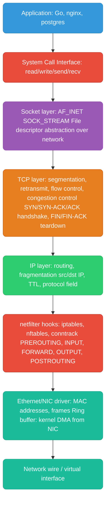
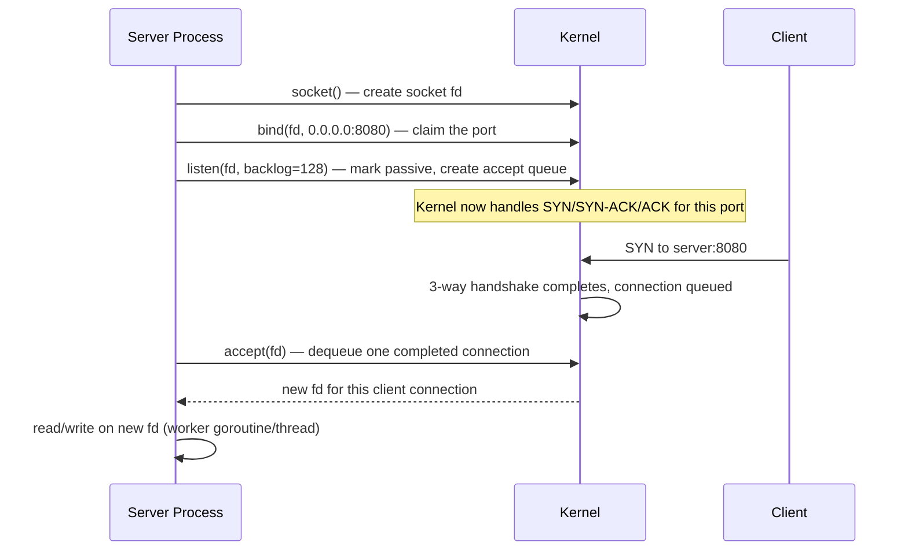
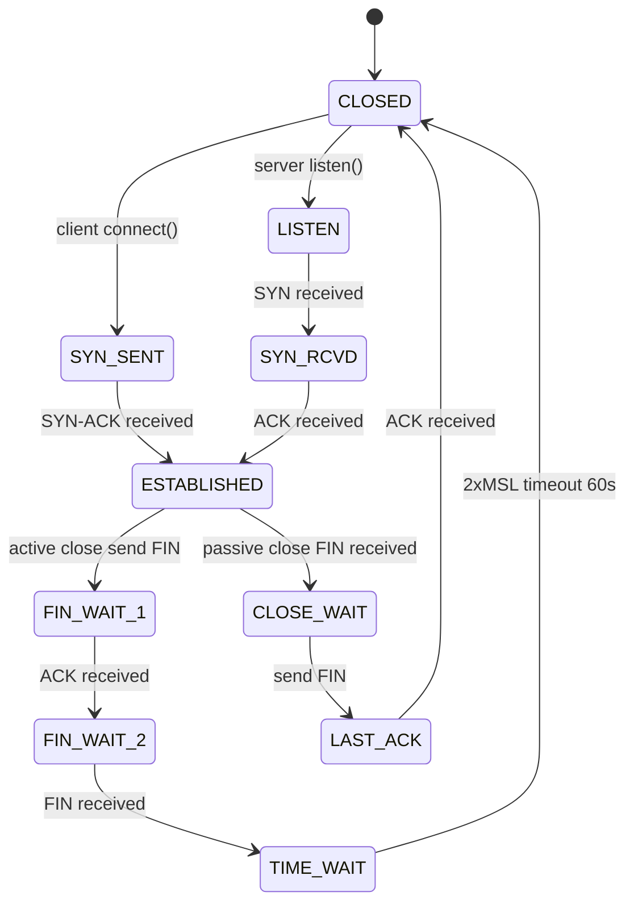
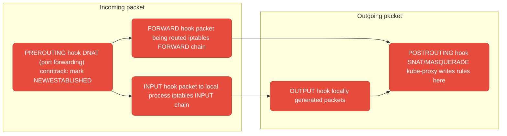

# Linux Kernel TCP/IP Stack

How the Linux kernel moves packets through the TCP/IP stack — sockets, the accept queue, TCP state machine, TIME_WAIT, netfilter/iptables, and connection tuning.

> For the packet RX/TX path, conntrack, network namespaces, veth pairs, and SO_REUSEPORT from a platform-networking angle, see also [`networking/linux-networking.md`](../networking/linux-networking.md).

<div class="quiz-progress" data-quiz-progress>
  <span class="quiz-progress-label">0/0 checks</span>
  <span class="quiz-progress-bar"><span class="quiz-progress-fill"></span></span>
</div>

---

## TCP/IP Stack in the Kernel



**Key layers:**
- **Socket** — the file descriptor your app holds. `fd = socket(AF_INET, SOCK_STREAM, 0)`. All I/O goes through kernel VFS after this.
- **TCP** — reliable, ordered, byte-stream. The kernel manages retransmits, ACKs, flow control (receive window), and congestion control (CUBIC/BBR algorithms).
- **IP** — best-effort delivery, routing decisions per packet based on routing table.
- **netfilter** — hooks at 5 points in the stack. iptables and nftables register rules here. conntrack tracks connection state for stateful firewalls and NAT.

<div class="quiz-card">
  <p class="quiz-q">A packet gets dropped somewhere on the wire. Does the IP layer retransmit it, or does something else?</p>
  <button class="quiz-reveal">Reveal answer</button>
  <div class="quiz-a" hidden>
    IP is best-effort delivery only — it never retransmits. Retransmission,
    ordering, and flow control are entirely TCP's job, one layer up. Drop a
    packet at the IP layer and it's gone unless TCP (or the application)
    notices the gap and resends.
  </div>
</div>

---

## Sockets and the Accept Loop



<div class="stepper">
  <div class="stepper-panels">
    <div class="stepper-panel active">
      <strong>1. socket().</strong> The server process asks the kernel for a
      new socket file descriptor — <code>AF_INET</code>, <code>SOCK_STREAM</code>.
      Nothing on the wire yet.
    </div>
    <div class="stepper-panel">
      <strong>2. bind().</strong> The process claims a local address/port —
      <code>0.0.0.0:8080</code>. Only one process (without
      <code>SO_REUSEPORT</code>) can bind a given port.
    </div>
    <div class="stepper-panel">
      <strong>3. listen().</strong> Marks the socket passive and creates the
      accept queue, sized by <code>backlog</code> — <code>listen(fd, 128)</code>.
    </div>
    <div class="stepper-panel">
      <strong>4. Handshake, entirely in-kernel.</strong> A client's SYN
      arrives; the kernel completes the full 3-way handshake
      (SYN/SYN-ACK/ACK) on the app's behalf and parks the finished connection
      in the accept queue. The app hasn't been woken up yet.
    </div>
    <div class="stepper-panel">
      <strong>5. accept().</strong> The app dequeues one completed connection
      from the accept queue and gets back a brand-new fd — the listening fd
      is untouched and keeps accepting more connections.
    </div>
    <div class="stepper-panel">
      <strong>6. read/write.</strong> The app serves the connection on the
      new fd, typically handed off to a worker thread or goroutine.
    </div>
  </div>
  <div class="stepper-controls">
    <button class="stepper-prev">← Prev</button>
    <span class="stepper-dots"></span>
    <span class="stepper-label"></span>
    <button class="stepper-next">Next →</button>
  </div>
</div>

**The accept queue (backlog):** The kernel completes the 3-way handshake and places fully established connections in the accept queue. `listen(fd, backlog)` sets the queue size. If your app is slow to call `accept()`, the queue fills → new connections get `ECONNREFUSED` or the SYN is silently dropped. Under load: `ss -lnt | grep :8080` — `Recv-Q` shows queued connections.

**`SO_REUSEPORT`:** Multiple processes/threads can bind the same port. The kernel load-balances incoming connections across all listeners. Used by nginx (one socket per worker process) and Go's `net.ListenConfig{Control: ...}`. Eliminates the single `accept()` bottleneck.

<div class="quiz-card">
  <p class="quiz-q">The accept queue is full because your app is slow to call <code>accept()</code>. What happens to the next incoming connection — does the kernel queue it anyway, or does it get rejected?</p>
  <button class="quiz-reveal">Reveal answer</button>
  <div class="quiz-a" hidden>
    It doesn't queue forever. Once the accept queue (sized by
    <code>listen(fd, backlog)</code>) is full, new connections get
    <code>ECONNREFUSED</code> or their SYN is silently dropped. The 3-way
    handshake already completed in-kernel before this point — the app never
    even gets a chance to see them.
  </div>
</div>

---

## TCP States and TIME_WAIT



**TIME_WAIT** is the most misunderstood TCP state. After active close, the socket stays in TIME_WAIT for `2 * MSL` (Maximum Segment Lifetime = 60s on Linux). Purpose:
1. Ensures the final ACK reaches the remote side (if lost, remote retransmits FIN)
2. Prevents old packets from a dead connection being mistaken for a new one

**Why it causes problems:** High-throughput services (proxies, load balancers) cycling many short-lived connections accumulate thousands of TIME_WAIT sockets. Each holds a local port. Port range: 32768-60999 (28231 ports). Exhaust them → `EADDRNOTAVAIL`.

**Fixes:**
```bash
# Check TIME_WAIT count
ss -s | grep TIME-WAIT

# Allow reuse of TIME_WAIT sockets for new connections (safe for clients)
sysctl -w net.ipv4.tcp_tw_reuse=1

# Expand ephemeral port range
sysctl -w net.ipv4.ip_local_port_range="1024 65535"

# Enable TCP timestamps (required for tw_reuse to work safely)
sysctl -w net.ipv4.tcp_timestamps=1
```

> ⚠️ **Do not use `net.ipv4.tcp_tw_recycle`.** It was **removed in kernel 4.12** (2017) and no longer exists. On older kernels it aggressively recycled TIME_WAIT sockets using per-host timestamps, which silently broke connections from clients behind NAT/load balancers (multiple clients sharing a source IP with unsynchronized timestamps got their SYNs dropped). Any blog or Stack Overflow answer still recommending it is stale. Use `tcp_tw_reuse` (safe for outbound/client sockets) instead.

<div class="quiz-card">
  <p class="quiz-q">Which side ends up sitting in <code>TIME_WAIT</code> — the side that closes the connection first (active close), or the side that receives the FIN (passive close)?</p>
  <button class="quiz-reveal">Reveal answer</button>
  <div class="quiz-a" hidden>
    The active closer — whichever side sends the first FIN. It holds the
    socket (and its local port) in <code>TIME_WAIT</code> for
    <code>2 &times; MSL</code> (60s on Linux) so a lost final ACK can be
    recovered and old packets can't be mistaken for a new connection. That's
    exactly why proxies and load balancers, which usually close first, are
    the ones that pile up TIME_WAIT sockets and exhaust ephemeral ports.
  </div>
</div>

---

## netfilter and iptables

netfilter is the Linux kernel framework for packet filtering, NAT, and connection tracking. iptables is the userspace tool that programs netfilter rules.



<div class="stepper">
  <div class="stepper-panels">
    <div class="stepper-panel active">
      <strong>1. PREROUTING.</strong> Every incoming packet hits this hook
      first, before any routing decision. conntrack marks it <code>NEW</code>,
      <code>ESTABLISHED</code>, or <code>RELATED</code>; DNAT (port
      forwarding, kube-proxy's ClusterIP → pod IP rewrite) happens here.
    </div>
    <div class="stepper-panel">
      <strong>2. Routing decision.</strong> The kernel checks the (possibly
      just-rewritten) destination address: is this packet for a process
      running locally, or does it need to go somewhere else?
    </div>
    <div class="stepper-panel">
      <strong>3a. Local delivery — INPUT.</strong> Destined for this box.
      Passes the iptables <code>INPUT</code> chain, then travels up through
      IP → TCP → the socket layer to the waiting process.
    </div>
    <div class="stepper-panel">
      <strong>3b. Being routed — FORWARD.</strong> Destined for another host
      and this box is just a router/gateway. Passes the iptables
      <code>FORWARD</code> chain instead — the packet never travels up
      through the local IP stack above this hook.
    </div>
    <div class="stepper-panel">
      <strong>4. OUTPUT.</strong> Locally generated packets — replies from
      the process that received an INPUT packet, or anything else this box
      originates — hit this hook.
    </div>
    <div class="stepper-panel">
      <strong>5. POSTROUTING.</strong> The last stop before the packet leaves
      the NIC, for both forwarded and locally-generated traffic. SNAT/
      MASQUERADE happens here — this is where kube-proxy rewrites pod IP →
      node IP for traffic leaving the node.
    </div>
  </div>
  <div class="stepper-controls">
    <button class="stepper-prev">← Prev</button>
    <span class="stepper-dots"></span>
    <span class="stepper-label"></span>
    <button class="stepper-next">Next →</button>
  </div>
</div>

<div class="tab-group">
  <div class="tab-buttons">
    <button data-tab="pre" class="active">PREROUTING</button>
    <button data-tab="in">INPUT</button>
    <button data-tab="fwd">FORWARD</button>
    <button data-tab="out">OUTPUT</button>
    <button data-tab="post">POSTROUTING</button>
  </div>
  <div class="tab-panels">
    <div class="tab-panel active" data-tab-panel="pre">
      Hit by every incoming packet before any routing decision. This is where
      DNAT lives — rewrite the destination before the kernel even decides
      whether the packet is for this box or needs forwarding. conntrack
      classifies the packet here too.
    </div>
    <div class="tab-panel" data-tab-panel="in">
      Packet's destination (after any PREROUTING DNAT) is a process on this
      box. iptables <code>INPUT</code> chain rules apply — this is the
      classic "allow SSH, drop everything else" chain on a single host.
    </div>
    <div class="tab-panel" data-tab-panel="fwd">
      Packet is being routed through this box to somewhere else — it's
      acting as a router or NAT gateway. iptables <code>FORWARD</code> chain
      rules apply. Kubernetes nodes forward a huge amount of pod-to-pod
      traffic through here.
    </div>
    <div class="tab-panel" data-tab-panel="out">
      Packets this box generates itself — including replies sent by a local
      process — hit this hook before POSTROUTING.
    </div>
    <div class="tab-panel" data-tab-panel="post">
      Last hook before the packet actually leaves the NIC. SNAT/MASQUERADE
      happens here — kube-proxy's pod IP → node IP rewrite for traffic
      leaving the node lives in this chain.
    </div>
  </div>
</div>

**conntrack:** Tracks the state of every connection (NEW, ESTABLISHED, RELATED, INVALID). Stateful firewall rules use conntrack — "allow ESTABLISHED,RELATED" means replies to outbound connections are automatically allowed without an explicit inbound rule. `cat /proc/net/nf_conntrack` shows current table.

**Kubernetes uses netfilter heavily:** kube-proxy writes DNAT rules in PREROUTING (ClusterIP → pod IP) and MASQUERADE rules in POSTROUTING (pod IP → node IP for external traffic).

<div class="quiz-card">
  <p class="quiz-q">A packet arrives at a Linux box that's acting as a router/NAT gateway, destined for some other host behind it. Does it hit the <code>INPUT</code> chain or the <code>FORWARD</code> chain?</p>
  <button class="quiz-reveal">Reveal answer</button>
  <div class="quiz-a" hidden>
    <code>FORWARD</code>. <code>INPUT</code> is only for packets destined for
    a process running locally on this box. Anything being routed through the
    box — the normal case for a NAT gateway or a Kubernetes node moving pod
    traffic — takes the <code>PREROUTING → FORWARD → POSTROUTING</code> path
    and never touches the local INPUT/OUTPUT chains at all.
  </div>
</div>

---

## Kernel TCP Tuning

Critical settings for high-connection services (nginx, databases, load balancers):

```bash
# /etc/sysctl.conf or applied via sysctl -w

# Accept queue size — how many completed connections kernel queues before app accepts
net.core.somaxconn = 65535           # system max (default: 4096)
net.ipv4.tcp_max_syn_backlog = 65535 # SYN queue size (incomplete handshakes)

# TIME_WAIT handling
net.ipv4.tcp_tw_reuse = 1            # reuse TIME_WAIT sockets for outbound connections
net.ipv4.ip_local_port_range = 1024 65535  # ephemeral port range

# Buffer sizes — critical for throughput
net.core.rmem_max = 134217728        # 128MB max receive buffer
net.core.wmem_max = 134217728        # 128MB max send buffer
net.ipv4.tcp_rmem = 4096 87380 134217728   # min/default/max
net.ipv4.tcp_wmem = 4096 65536 134217728

# Connection keepalive — detect dead connections
net.ipv4.tcp_keepalive_time = 60     # start probes after 60s idle (default: 7200s!)
net.ipv4.tcp_keepalive_intvl = 10    # probe every 10s
net.ipv4.tcp_keepalive_probes = 5    # 5 failed probes → close connection

# File descriptors (sockets are fds)
fs.file-max = 1000000                # system-wide fd limit
```

**Why `somaxconn` matters:** If your service gets a burst of connections and `accept()` can't keep up, the kernel silently drops new SYNs once the accept queue is full. `ss -lnt` shows `Recv-Q` — if it's consistently at your backlog limit, raise `somaxconn` and optimize your accept loop.
