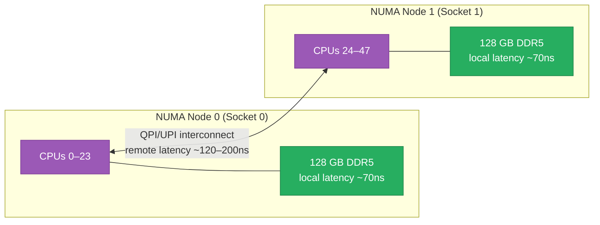

# NUMA, IRQ Affinity, and CPU Isolation

The tools that matter when nanoseconds count: NUMA topology and why remote memory kills
latency, steering hardware interrupts to specific CPUs, isolating cores from the kernel
scheduler, and the real-time scheduler classes that preempt anything else on the box. Relevant
to high-PPS networking, low-latency trading, ML inference servers, and any database that needs
predictable tail latency. Builds on [scheduler.md](./scheduler.md)'s CFS coverage.

<div class="quiz-progress" data-quiz-progress>
  <span class="quiz-progress-label">0/0 checks</span>
  <span class="quiz-progress-bar"><span class="quiz-progress-fill"></span></span>
</div>

---

## 1. NUMA Topology — Local vs Remote Memory

**NUMA (Non-Uniform Memory Access)** describes multi-socket servers where each CPU socket has
its own directly-attached memory bank. Accessing local memory (same socket) is cheap; crossing
the QPI/UPI interconnect to reach another socket's memory is 1.5–3× slower.



A process running on Node 0 that allocates memory on Node 1 pays the remote penalty on every
access. At 10M operations/second, 130ns of extra latency per operation adds 1.3ms of
accumulated overhead per second — enough to blow a p99 SLA.

```bash
# Show NUMA topology
numactl --hardware
# available: 2 nodes (0-1)
# node 0 cpus: 0 1 2 3 4 5 6 7 8 9 10 11 24 25 26 27 28 29 30 31 32 33 34 35
# node 0 size: 128868 MB
# node 0 free: 62143 MB
# node 1 cpus: 12 13 14 15 16 17 18 19 20 21 22 23 36 37 38 39 40 41 42 43 44 45 46 47
# node 1 size: 128966 MB
# node 1 free: 71230 MB
# node distances:
# node   0   1
#   0:  10  21   ← ratio: remote is 2.1× local

numastat -m          # per-node memory allocation stats
numastat <pid>       # NUMA hits vs misses for a specific process

# Check current NUMA balance for a running process
cat /proc/<pid>/numa_maps | head -20
# Shows every VMA and which NUMA node each page was allocated from
```

**NUMA misses** show up in `numastat` as `numa_miss` and `numa_foreign`. A high miss rate
means the process is running on a CPU that doesn't own the memory it's reading — the most
common cause is Linux's automatic NUMA balancing (`vm.numa_balancing=1`) not converging fast
enough, or a process whose threads spread across sockets.

---

## 2. `numactl` — Binding Processes to NUMA Nodes

```bash
# Run a process bound to Node 0, allocating memory only from Node 0
numactl --cpunodebind=0 --membind=0 ./myapp

# Interleave memory allocation across all nodes (good for throughput, bad for latency)
numactl --interleave=all ./myapp

# Bind to specific CPUs within a node
numactl --physcpubind=0-11 --membind=0 ./myapp

# Preferred (soft): try Node 0, fall back to others if needed
numactl --preferred=0 ./myapp

# For a running process: move its memory to a target node
migratepages <pid> 1 0    # migrate process's pages from node 1 to node 0
```

```bash
# Real-world: pin a Kafka broker to NUMA node 0
numactl --cpunodebind=0 --membind=0 \
  java -Xmx16g -Xms16g -jar kafka.jar server.properties

# Real-world: pin a Redis instance to Node 1 (second socket, isolated from Kafka)
numactl --cpunodebind=1 --membind=1 redis-server /etc/redis/redis.conf
```

**Kernel NUMA tuning knobs:**

```bash
# Disable automatic NUMA balancing (reduces migration overhead for latency-sensitive apps)
sysctl vm.numa_balancing=0

# Zone reclaim mode: how aggressively the kernel reclaims memory in local NUMA zone
# 0 = always try remote memory before reclaiming local (better for most apps)
# 1 = reclaim local memory first (better for NUMA-bound apps with mostly local working set)
sysctl vm.zone_reclaim_mode=0
```

<div class="quiz-card">
  <p class="quiz-q">A 16-thread Java application is bound to NUMA Node 0 (12 physical cores with hyperthreading = 24 logical CPUs). Will all 16 threads stay on Node 0?</p>
  <button class="quiz-reveal">Reveal answer</button>
  <div class="quiz-a" hidden>Yes, if bound with --cpunodebind=0, the scheduler will only schedule those threads on the CPUs belonging to Node 0. 16 threads fit within 24 logical CPUs, so no spillover to Node 1. If the app had 28 threads, the scheduler would still restrict them to Node 0's 24 CPUs — the threads would share/queue rather than overflow to Node 1, trading some CPU contention for NUMA locality.</div>
</div>

---

## 3. IRQ Affinity — Steering Hardware Interrupts

When a NIC receives a packet, it fires a hardware interrupt (IRQ) to notify the CPU. By
default, `irqbalance` distributes interrupts across all CPUs. For high-throughput or
low-latency workloads, you want to pin NIC interrupts to specific CPUs — ideally on the same
NUMA node as the NIC's PCIe attachment.

```bash
# List IRQ assignments and their current CPU affinity
cat /proc/interrupts
#            CPU0   CPU1   CPU2   CPU3
#  24:      89023      0      0      0  PCI-MSI  eth0-TxRx-0
#  25:          0  93521      0      0  PCI-MSI  eth0-TxRx-1
#  26:          0      0  78234      0  PCI-MSI  eth0-TxRx-2

# Read the affinity mask for IRQ 24 (bitmask, CPU0 = bit 0)
cat /proc/irq/24/smp_affinity
# 00000001   ← only CPU 0

# Pin IRQ 24 to CPU 0 and CPU 1 only
echo 3 > /proc/irq/24/smp_affinity     # 0x3 = CPUs 0 and 1
# Or use the list form:
echo 0-1 > /proc/irq/24/smp_affinity_list
```

**Multi-queue NICs** expose one IRQ per hardware queue. Align queues to NUMA node CPUs:

```bash
# Show which NUMA node a NIC is attached to
cat /sys/class/net/eth0/device/numa_node
# 0   ← NIC is on NUMA Node 0

# Number of queues
ethtool -l eth0
# Combined: 8   ← 8 TX/RX queue pairs

# Recommended setup: pin each queue's IRQ to a CPU on the same NUMA node
# Queue 0 → CPU 0, Queue 1 → CPU 1, ..., Queue 7 → CPU 7 (all on Node 0)
for i in $(seq 0 7); do
  IRQ=$(grep "eth0-TxRx-$i" /proc/interrupts | awk -F: '{print $1}' | tr -d ' ')
  echo $i > /proc/irq/$IRQ/smp_affinity_list
done

# Stop irqbalance from overriding your settings
systemctl stop irqbalance
# Or use IRQBALANCE_BANNED_CPUS to exclude your latency CPUs from balancing
```

---

## 4. CPU Isolation — Removing CPUs from the Scheduler Pool

For the most demanding workloads, you want dedicated CPUs that the kernel scheduler never
touches. `isolcpus` removes CPUs from the scheduler's general pool at boot time.

```bash
# /etc/default/grub — isolate CPUs 2-5 for application use
GRUB_CMDLINE_LINUX="isolcpus=2-5 nohz_full=2-5 rcu_nocbs=2-5"

# Regenerate grub and reboot
update-grub && reboot

# Verify: isolated CPUs show "Nohz_Full" in flags
cat /sys/devices/system/cpu/isolated
# 2-5

# Verify: no kernel threads on isolated CPUs
ps -eLo psr,pid,comm | awk '$1 >= 2 && $1 <= 5'
# Should be empty (or only your app's threads)
```

- **`isolcpus`** — removes CPUs from the `SCHED_OTHER` domain; kernel won't place normal tasks here
- **`nohz_full`** — disables the scheduler tick on isolated CPUs when only one runnable task is present (eliminates up to 1000 1ms interruptions per second)
- **`rcu_nocbs`** — moves RCU callback processing off isolated CPUs (another source of jitter)

After boot, use `taskset` or `numactl` to place your application on the isolated CPUs:

```bash
# Start app on isolated CPUs 2-5
taskset -c 2-5 ./myapp

# Or with numactl (also pins memory)
numactl --physcpubind=2-5 --membind=0 ./myapp

# Move a running process's threads to isolated CPUs
taskset -cp 2-5 <pid>
```

**`cset`** (cpuset manager from `cpuset` package) builds on kernel cpusets and is easier to
manage than raw `taskset` for complex CPU partitioning:

```bash
cset shield --cpu=2-5 --kthread=on     # create a shield on CPUs 2-5
cset shield --exec -- ./myapp          # run myapp inside the shield
cset shield --reset                    # tear down the shield
```

<div class="quiz-card">
  <p class="quiz-q">You've isolated CPUs 4-7 with `isolcpus=4-7`. Your application is pinned to those CPUs. After 1 hour of operation, a colleague observes occasional 500µs latency spikes on the isolated CPUs. What kernel timer interrupt is the likely cause, and how do you eliminate it?</p>
  <button class="quiz-reveal">Reveal answer</button>
  <div class="quiz-a" hidden>The scheduler tick — without nohz_full, the kernel fires a timer interrupt at HZ frequency (100 or 250 times per second) on every CPU, even isolated ones, to check for scheduling opportunities. 4ms ticks don't explain 500µs spikes, but other sources (RCU callbacks, softirqs from IRQ handling) can. The fix: add nohz_full=4-7 and rcu_nocbs=4-7 to the kernel cmdline. nohz_full disables the scheduler tick on idle-or-one-runnable CPUs, and rcu_nocbs offloads RCU callbacks to non-isolated CPUs — together they remove the two biggest sources of tick jitter.</div>
</div>

---

## 5. `taskset` and `cset` — CPU Affinity at Process Level

```bash
# Pin a new process to CPUs 0 and 1
taskset -c 0,1 ./myapp

# Pin a running process (all threads)
taskset -cp 0,1 <pid>

# Check current affinity mask
taskset -p <pid>
# pid <pid>'s current affinity mask: f   ← 0xf = CPUs 0-3

# Pin individual threads
for tid in $(ls /proc/<pid>/task/); do
  taskset -cp 0 $tid
done
```

**CPU affinity in containers:**

```bash
# Docker: --cpuset-cpus restricts the container to specific CPUs
docker run --cpuset-cpus="0,1" --cpuset-mems="0" nginx

# Kubernetes: guaranteed QoS + CPU manager (static policy) pins pods to CPUs
# Pod spec must set requests == limits for CPU (integer) and memory
resources:
  requests:
    cpu: "2"
    memory: "4Gi"
  limits:
    cpu: "2"
    memory: "4Gi"
# kubelet's CPU manager assigns 2 dedicated physical CPUs (with SMT sibling)
```

---

## 6. Real-Time Scheduler Classes

Linux has three scheduler classes. `SCHED_OTHER` (CFS) is what normal processes use. The RT
classes preempt CFS entirely — an RT task running at any priority will preempt any CFS task.

| Class | Priority range | Preemption | Use case |
|---|---|---|---|
| `SCHED_OTHER` | nice -20 to +19 (CFS) | Fair — yields to other tasks | Everything normal |
| `SCHED_FIFO` | 1–99 (highest wins) | Never preempted by lower RT; runs until it blocks or yields | Hard real-time, audio, industrial |
| `SCHED_RR` | 1–99 | Round-robin within same priority; preempts lower priorities | Soft real-time with fairness among peers |
| `SCHED_DEADLINE` | Per-task deadline params | EDF (Earliest Deadline First) — guaranteed completion by deadline | Periodic real-time with admission control |

```bash
# Set a process to SCHED_FIFO at priority 50
chrt -f 50 ./myapp
# Or change a running process
chrt -f -p 50 <pid>

# Set SCHED_RR at priority 30
chrt -r 30 ./myapp

# Set SCHED_DEADLINE: runtime=1ms, deadline=5ms, period=5ms
chrt -d --sched-runtime 1000000 --sched-deadline 5000000 --sched-period 5000000 -p 0 <pid>

# Check scheduler class for a process
chrt -p <pid>
# pid <pid>'s current scheduling policy: SCHED_FIFO
# pid <pid>'s current scheduling priority: 50
```

**RT throttling** — a safety valve: by default, RT tasks can only consume 95% of CPU time
per 100ms period. This prevents a buggy RT task from starving the entire system.

```bash
# Current throttle: 950000µs per 1000000µs period (95%)
cat /proc/sys/kernel/sched_rt_runtime_us   # 950000
cat /proc/sys/kernel/sched_rt_period_us    # 1000000

# Disable throttling (dangerous — only on dedicated RT systems)
sysctl kernel.sched_rt_runtime_us=-1
```

**`PREEMPT_RT` kernel patch** — for true hard real-time, the mainline kernel still has
some non-preemptible sections (spinlocks, interrupt handlers). The PREEMPT_RT patch
converts these to preemptible sleeping locks, reducing worst-case latency from ~100µs to
~10µs. Many distributions ship an `rt` kernel variant.

```bash
uname -r
# 5.15.0-76-generic          ← standard
# 5.15.0-76-realtime         ← PREEMPT_RT variant
```

---

## 7. When This Matters — Practical Scenarios

**High-PPS NIC receive path:**

```
NIC fires IRQ → CPU handles softirq → NAPI poll loop reads packets
```

If the IRQ fires on a CPU that's remote to the NIC's PCIe attachment, memory for packet
descriptors crosses the QPI interconnect on every packet. At 10Mpps, this is catastrophic.
Fix: pin NIC IRQs to CPUs on the NUMA node that owns the NIC's PCIe root complex (verify with
`cat /sys/class/net/eth0/device/numa_node`).

**Kafka broker tuning:**

```bash
# Kafka is JVM — uses many threads for network, I/O, and compaction
# Bind to a full NUMA node; interleave memory for JVM heap
numactl --cpunodebind=0 --membind=0 \
  java -Xmx32g -Xms32g \
       -XX:+UseNUMA -XX:+UseG1GC \
       -jar kafka.jar server.properties
```

`-XX:+UseNUMA` enables NUMA-aware heap allocation inside the JVM — each GC region is allocated
on the local NUMA node for the thread accessing it.

**ML inference (GPU + NUMA):**

```bash
# GPU is attached to a NUMA node — verify
nvidia-smi topo -m
# GPUs on Node 0 should be served by CPUs on Node 0

# Bind inference process to GPU's NUMA node
CUDA_VISIBLE_DEVICES=0 numactl --cpunodebind=0 --membind=0 python serve.py
```

---

## Quick Reference

```
Show NUMA topology              numactl --hardware
NUMA memory stats               numastat -m
NUMA stats per process          numastat <pid>
Process's NUMA page map         cat /proc/<pid>/numa_maps
Bind process to NUMA node       numactl --cpunodebind=0 --membind=0 <cmd>
Disable NUMA balancing          sysctl vm.numa_balancing=0
List all IRQs + CPU affinities  cat /proc/interrupts
Read IRQ CPU affinity mask      cat /proc/irq/<N>/smp_affinity
Set IRQ CPU affinity            echo <mask> > /proc/irq/<N>/smp_affinity
Stop irqbalance                 systemctl stop irqbalance
NIC NUMA node                   cat /sys/class/net/<if>/device/numa_node
Isolate CPUs (kernel param)     isolcpus=2-5 nohz_full=2-5 rcu_nocbs=2-5
Check isolated CPUs             cat /sys/devices/system/cpu/isolated
Pin process to CPUs             taskset -c 2-5 <cmd>
Pin running process             taskset -cp 2-5 <pid>
SCHED_FIFO at priority 50       chrt -f 50 <cmd>
SCHED_RR at priority 30         chrt -r 30 <cmd>
Check process scheduler         chrt -p <pid>
RT throttle (95% = default)     cat /proc/sys/kernel/sched_rt_runtime_us
```
