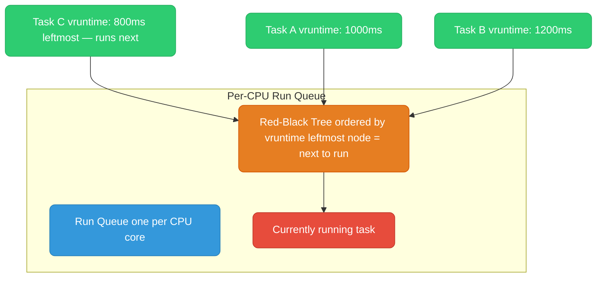
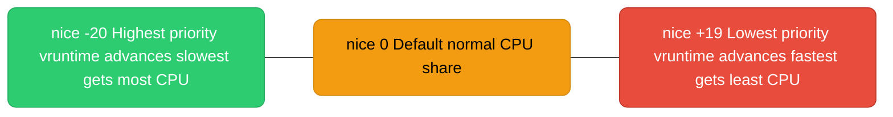
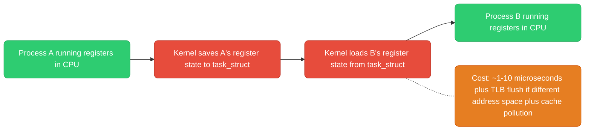
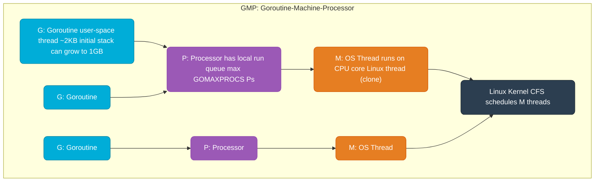

# Linux Scheduler

<div class="quiz-progress" data-quiz-progress>
  <span class="quiz-progress-label">0/0 checks</span>
  <span class="quiz-progress-bar"><span class="quiz-progress-fill"></span></span>
</div>

---

## CFS — Completely Fair Scheduler

Linux's default process scheduler since kernel 2.6.23. Goal: give every runnable process a fair share of CPU time.



**vruntime (virtual runtime):**
- Each task tracks `vruntime` — how much CPU time it has consumed, weighted by priority
- CFS always picks the task with the smallest `vruntime` (leftmost node in the red-black tree)
- Nice value modifies how fast `vruntime` advances: nice -20 (highest priority) → vruntime advances slowly → gets scheduled more often

**Scheduling latency (`sysctl kernel.sched_latency_ns`, default 6ms):** CFS guarantees every runnable task gets CPU within this window. With 10 tasks, each gets 0.6ms per cycle.

The diagram above shows a snapshot of the tree. Step through what actually happens to a task over time:

<div class="stepper">
  <div class="stepper-panels">
    <div class="stepper-panel active">
      <strong>1. Insert.</strong> A runnable task sits in its CPU's red-black tree, keyed by <code>vruntime</code>.
    </div>
    <div class="stepper-panel">
      <strong>2. Pick leftmost.</strong> CFS looks at the leftmost node — the task with the smallest <code>vruntime</code> — and hands it the CPU.
    </div>
    <div class="stepper-panel">
      <strong>3. Run &amp; accumulate.</strong> While it runs, its <code>vruntime</code> climbs in proportion to real CPU time consumed, scaled by nice value — a nice -20 task's <code>vruntime</code> climbs slower for the same wall-clock time.
    </div>
    <div class="stepper-panel">
      <strong>4. Re-insert.</strong> When the task's slice ends — preempted, blocked, or the <code>sched_latency_ns</code> window rolls over — it's pulled out and reinserted into the tree at its new, larger <code>vruntime</code>.
    </div>
    <div class="stepper-panel">
      <strong>5. Repeat.</strong> Whoever is now leftmost — same task or a different one — runs next. Over many cycles this keeps every runnable task's <code>vruntime</code> roughly level, which is the "fair" in Completely Fair Scheduler.
    </div>
  </div>
  <div class="stepper-controls">
    <button class="stepper-prev">← Prev</button>
    <span class="stepper-dots"></span>
    <span class="stepper-label"></span>
    <button class="stepper-next">Next →</button>
  </div>
</div>

<div class="quiz-card">
  <p class="quiz-q">Task B has vruntime 1200ms, Task C has vruntime 800ms. Which one does CFS run next, and why does giving Task C a nice value of -20 help it keep winning that comparison over time?</p>
  <button class="quiz-reveal">Reveal answer</button>
  <div class="quiz-a" hidden>
    Task C runs next — it's the leftmost node in the red-black tree, i.e. the smallest <code>vruntime</code>. A nice -20 value doesn't change which task is picked <em>this</em> instant, but it makes that task's <code>vruntime</code> advance more slowly for the same amount of real CPU time — so it keeps re-qualifying as leftmost and gets scheduled more often going forward.
  </div>
</div>

---

## Nice Values and Priority



```bash
# Start process with lower priority (background batch job)
nice -n 10 ./my-batch-job

# Change priority of running process
renice -n 5 -p <PID>

# Check priority (NI column in top/ps)
ps -o pid,ni,pri,cmd -p <PID>
```

**Real-time priorities** (bypass CFS entirely):
- `SCHED_FIFO` / `SCHED_RR` — fixed priority, preempts CFS tasks. Used by audio daemons, real-time systems.
- `chrt -f 50 ./realtime-app` — run with FIFO scheduling at priority 50

<div class="quiz-card">
  <p class="quiz-q">You renice a process to nice -20 hoping it beats everything else for CPU time, but an audio daemon running under <code>SCHED_FIFO</code> keeps preempting it anyway. Why doesn't the nice value help here?</p>
  <button class="quiz-reveal">Reveal answer</button>
  <div class="quiz-a" hidden>
    Nice values only matter <em>within</em> CFS — they tune how fast a task's <code>vruntime</code> advances relative to other CFS tasks. Real-time policies like <code>SCHED_FIFO</code>/<code>SCHED_RR</code> bypass CFS entirely and preempt any CFS task, regardless of how negative its nice value is. Nice -20 is still just the best seat in the CFS section of the room — <code>SCHED_FIFO</code> isn't in that room at all.
  </div>
</div>

---

## CPU Affinity

Pin a process/thread to specific CPU cores. Useful for: reducing cache misses (L1/L2 cache is per-core), isolating latency-sensitive workloads, NUMA-aware placement.

```bash
# Pin process to cores 0 and 1
taskset -c 0,1 ./my-app

# Pin running process
taskset -c 2,3 -p <PID>

# Check current affinity
taskset -cp <PID>

# In Go: use GOMAXPROCS and runtime.LockOSThread()
# For CPU-intensive goroutines that need to stay on one core
```

**NUMA (Non-Uniform Memory Access):** Multi-socket servers have memory banks local to each CPU socket. Accessing memory on the remote socket takes ~2x longer. `numactl --cpubind=0 --membind=0 ./app` forces both process and memory allocation to NUMA node 0.

<div class="quiz-card">
  <p class="quiz-q">You pin a process to CPU core 0 with <code>taskset</code>, but its memory was allocated on a NUMA node local to a different socket. Did pinning the CPU fix your performance problem?</p>
  <button class="quiz-reveal">Reveal answer</button>
  <div class="quiz-a" hidden>
    Not by itself. Pinning only controls which core runs the process — it says nothing about where its memory lives. If that memory sits on a remote NUMA node, every access still pays the ~2x remote-memory penalty. That's exactly why <code>numactl</code> takes both <code>--cpubind</code> and <code>--membind</code> together, instead of just one.
  </div>
</div>

---

## Context Switches

A context switch is the CPU saving one process's state (registers, instruction pointer, stack pointer) and loading another's.



**Voluntary vs involuntary:**
- **Voluntary:** process calls `sleep()`, `read()` (blocks), `mutex_lock()` (contended)
- **Involuntary:** time slice expires, higher-priority task becomes runnable

<div class="toggle-switch">
  <div class="toggle-buttons">
    <button data-toggle-opt="voluntary" class="active">Voluntary</button>
    <button data-toggle-opt="involuntary">Involuntary</button>
  </div>
  <div class="toggle-panel active" data-toggle-panel="voluntary">
    The process itself gives up the CPU — calling <code>sleep()</code>, blocking on <code>read()</code>, or waiting on a contended <code>mutex_lock()</code>. It has nothing to do right now, so it steps aside.
  </div>
  <div class="toggle-panel" data-toggle-panel="involuntary">
    The kernel takes the CPU away — the task's time slice expired, or a higher-priority task just became runnable and needs the core now. The process wanted to keep running.
  </div>
</div>

```bash
# Count context switches per second (cs column)
vmstat 1

# Per-process context switches
cat /proc/<PID>/status | grep ctxt
# voluntary_ctxt_switches:   1234
# nonvoluntary_ctxt_switches: 56
```

High `nonvoluntary_ctxt_switches` = process is being preempted often = CPU-bound. High `voluntary_ctxt_switches` = process blocks often = I/O-bound.

<div class="quiz-card">
  <p class="quiz-q">A process shows very high <code>nonvoluntary_ctxt_switches</code> and low <code>voluntary_ctxt_switches</code>. Is it CPU-bound or I/O-bound?</p>
  <button class="quiz-reveal">Reveal answer</button>
  <div class="quiz-a" hidden>
    CPU-bound. High nonvoluntary switches mean it keeps getting preempted — it's fighting other runnable tasks for CPU time rather than giving up the CPU voluntarily. A high <em>voluntary</em> count, by contrast, would point to an I/O-bound process that keeps blocking on its own.
  </div>
</div>

---

## Go's Goroutine Scheduler (GMP Model)

Go implements its own user-space scheduler on top of the Linux CFS scheduler.



**How it works:**
- **G (Goroutine):** user-space coroutine with a small stack. Millions can exist.
- **P (Processor):** logical processor, has a local run queue of Gs. Count = `GOMAXPROCS` (default: number of CPU cores).
- **M (Machine):** OS thread. Runs Gs from a P's queue. Usually M count ≈ P count, but can grow if Gs block on syscalls.

**Work stealing:** If P1's queue is empty, it steals half of P2's queue. Keeps all cores busy.

**Goroutine preemption:** Go 1.14+ supports async preemption — a goroutine can be preempted at any safe point (via signals), not just at function calls. Prevents one tight loop from starving other goroutines.

**GOMAXPROCS = 1:** All goroutines run on one OS thread. No parallelism, only concurrency. Useful for debugging race conditions.

The diagram above shows the steady state. Step through what happens as a goroutine gets created, runs, and potentially blocks:

<div class="stepper">
  <div class="stepper-panels">
    <div class="stepper-panel active">
      <strong>1. Spawn.</strong> <code>go func(){...}()</code> creates a new G and drops it onto the local run queue of the calling goroutine's current P.
    </div>
    <div class="stepper-panel">
      <strong>2. Run.</strong> An M (OS thread) holding that P pulls Gs off its local queue and runs them, one at a time, on a real CPU core — the M itself is just another thread the Linux CFS scheduler schedules.
    </div>
    <div class="stepper-panel">
      <strong>3. Blocking syscall.</strong> If the running G makes a blocking syscall, the M carrying it detaches from its P and goes with the G into the kernel. The runtime immediately hands the now-idle P to another M — spinning or freshly created — so the rest of that P's queue keeps running.
    </div>
    <div class="stepper-panel">
      <strong>4. Syscall returns.</strong> The G is runnable again. It rejoins a P's run queue — its old one if available, otherwise wherever there's room — and the M that carried it through the syscall goes idle or becomes a spare.
    </div>
    <div class="stepper-panel">
      <strong>5. Work stealing.</strong> Whenever a P's local queue runs empty before that, it doesn't sit idle — it steals half the Gs from another P's queue instead, so every core stays busy.
    </div>
  </div>
  <div class="stepper-controls">
    <button class="stepper-prev">← Prev</button>
    <span class="stepper-dots"></span>
    <span class="stepper-label"></span>
    <button class="stepper-next">Next →</button>
  </div>
</div>

<div class="quiz-card">
  <p class="quiz-q">You set <code>GOMAXPROCS=1</code>. Can goroutines in your program still run in parallel across multiple CPU cores?</p>
  <button class="quiz-reveal">Reveal answer</button>
  <div class="quiz-a" hidden>
    No. <code>GOMAXPROCS=1</code> means there's only one P, so only one M is ever executing Go code at a time. Goroutines still interleave on that single thread — concurrency — but never run simultaneously on separate cores — no parallelism. That's exactly why it's useful for flushing out race conditions: interleavings still happen, just one at a time and easier to reason about.
  </div>
</div>

```bash
# Set at runtime
export GOMAXPROCS=4

# Or in code
runtime.GOMAXPROCS(runtime.NumCPU())

# View scheduler trace
GODEBUG=schedtrace=1000 ./myapp   # print scheduler state every 1000ms
GODEBUG=scheddetail=1 ./myapp     # verbose goroutine scheduling
```
