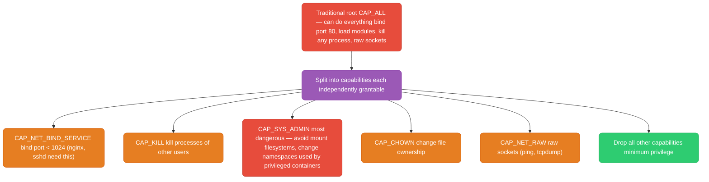
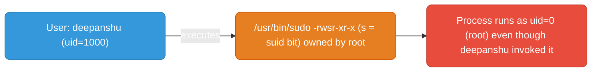
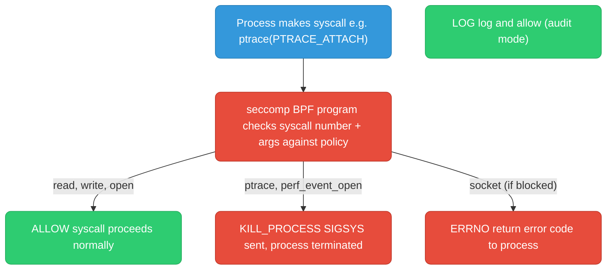
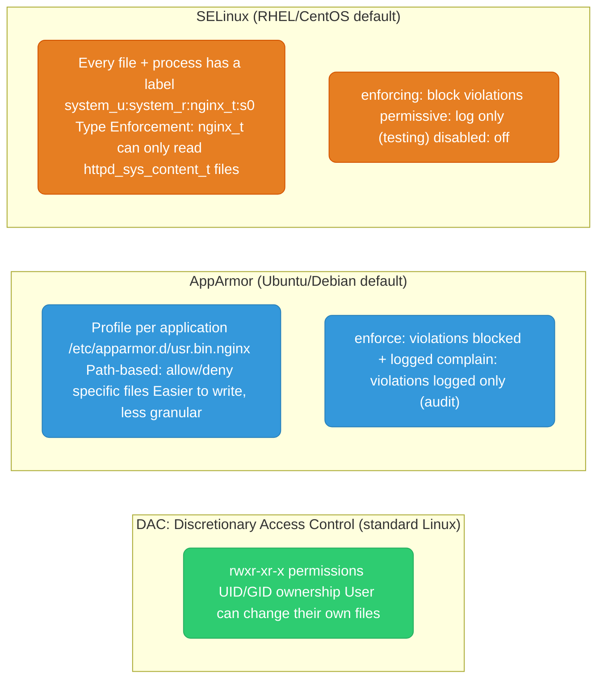
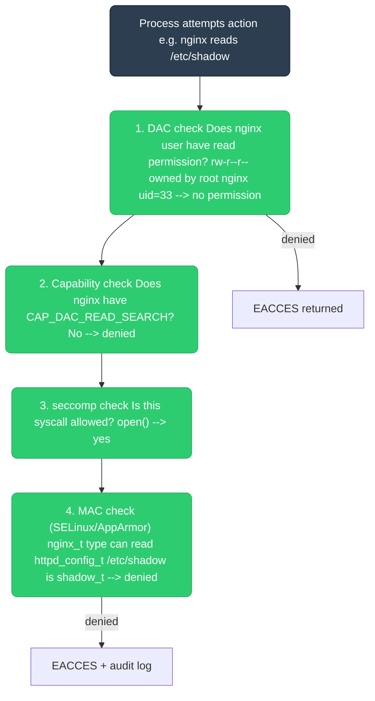

# Linux Security

<div class="quiz-progress" data-quiz-progress>
  <span class="quiz-progress-label">0/0 checks</span>
  <span class="quiz-progress-bar"><span class="quiz-progress-fill"></span></span>
</div>

---

## Capabilities — Fine-Grained Privilege

Historically: root (uid 0) had all-or-nothing privilege. Capabilities split root power into ~40 distinct units. A process can have specific capabilities without being fully root.



### Capability Sets Per Process

Every process has three capability sets:
- **Permitted:** what the process is allowed to have
- **Effective:** what the process currently uses (subset of permitted)
- **Inheritable:** what child processes can inherit

```bash
# Check capabilities of a process
cat /proc/<PID>/status | grep Cap
# CapPrm: 00000000a80425fb   (permitted)
# CapEff: 00000000a80425fb   (effective)
# CapBnd: 000000ffffffffff   (bounding set — max that can ever be set)

# Decode capability hex
capsh --decode=00000000a80425fb

# Check capabilities of a binary
getcap /usr/bin/ping
# /usr/bin/ping = cap_net_raw+ep

# Set capability on binary (instead of setuid root)
setcap cap_net_bind_service+ep /usr/local/bin/myapp
# Now myapp can bind port 80 without running as root

# Drop all capabilities in a process (Docker does this)
capsh --drop=all -- -c "./myapp"
```

### Containers and Capabilities

Docker drops ~14 dangerous capabilities by default. `--privileged` gives back all of them — equivalent to running as root on the host.

```bash
# Default dropped by Docker:
# CAP_SYS_ADMIN, CAP_SYS_RAWIO, CAP_SYS_MODULE, CAP_SYS_PTRACE,
# CAP_NET_ADMIN, CAP_AUDIT_WRITE, etc.

# Add specific capability (instead of --privileged)
docker run --cap-add NET_ADMIN myimage

# Drop all, add only what's needed
docker run --cap-drop ALL --cap-add NET_BIND_SERVICE myimage
```

<div class="toggle-switch">
  <div class="toggle-buttons">
    <button data-toggle-opt="default" class="active state-ok">Default</button>
    <button data-toggle-opt="privileged" class="state-bad">--privileged</button>
    <button data-toggle-opt="minimal" class="state-ok">--cap-drop ALL --cap-add ONE</button>
  </div>
  <div class="toggle-panel active" data-toggle-panel="default">
    Docker's baseline: about 14 dangerous capabilities (<code>CAP_SYS_ADMIN</code>, <code>CAP_SYS_MODULE</code>, <code>CAP_NET_ADMIN</code>, etc.) are already dropped before your container's first process runs. Most apps never notice.
  </div>
  <div class="toggle-panel" data-toggle-panel="privileged">
    Every capability is handed back, plus device access, and seccomp/AppArmor confinement is disabled. Functionally equivalent to root on the host &mdash; a container escape here is a host compromise.
  </div>
  <div class="toggle-panel" data-toggle-panel="minimal">
    Start from zero and add back exactly one capability the app needs (e.g. <code>NET_BIND_SERVICE</code> to bind port 80). Smallest possible blast radius if the container is compromised.
  </div>
</div>

<div class="quiz-card">
  <p class="quiz-q">A process's <code>CapPrm</code> (permitted) and <code>CapEff</code> (effective) bitmasks both read <code>00000000a80425fb</code>. Does that mean the process is currently exercising every one of those capabilities?</p>
  <button class="quiz-reveal">Reveal answer</button>
  <div class="quiz-a" hidden>
    No. Effective is only the subset of permitted that's currently switched on for privilege checks &mdash; a process can hold a capability in its permitted set without having activated it in effective. Matching bitmasks here just mean none have been dropped from effective; it doesn't mean every syscall gated by those capabilities is actively being exercised right now.
  </div>
</div>

---

## setuid / setgid

setuid (SUID) bit: when set on an executable, the process runs with the **file owner's** UID, not the invoking user's UID.



```bash
# Find all SUID binaries on system (security audit)
find / -perm -4000 -type f 2>/dev/null

# Common legitimate SUID binaries:
# /usr/bin/sudo   — escalate to root
# /usr/bin/passwd — write to /etc/shadow (root-owned)
# /usr/bin/ping   — raw socket (now uses capabilities on modern systems)

# Set SUID bit
chmod u+s /path/to/binary
chmod 4755 /path/to/binary    # 4 = suid, 755 = rwxr-xr-x
```

**Security risk:** An exploitable SUID binary running as root = full root compromise. Always audit SUID binaries. Modern approach: use capabilities instead of SUID where possible.

<div class="quiz-card">
  <p class="quiz-q">deepanshu (uid=1000) runs <code>/usr/bin/passwd</code>, which is SUID root. What UID does the resulting process actually run as?</p>
  <button class="quiz-reveal">Reveal answer</button>
  <div class="quiz-a" hidden>
    uid=0 (root) &mdash; the file <em>owner's</em> UID, not the invoking user's. That's the entire point of the SUID bit: it lets deepanshu's <code>passwd</code> process write to the root-owned <code>/etc/shadow</code>, even though deepanshu himself has no permission to touch that file directly.
  </div>
</div>

---

## seccomp — Syscall Filtering

seccomp (Secure Computing Mode) filters which syscalls a process is allowed to make. A process attempting a blocked syscall receives `SIGSYS` (killed) or `EPERM`.



<div class="stepper">
  <div class="stepper-panels">
    <div class="stepper-panel active">
      <strong>1. Syscall attempted.</strong> The process calls into the kernel &mdash; e.g. <code>ptrace(PTRACE_ATTACH)</code>. Nothing seccomp-specific has happened yet; this is a normal syscall entry.
    </div>
    <div class="stepper-panel">
      <strong>2. Kernel hands off to the BPF program.</strong> Before the syscall body runs, the kernel passes the syscall number and its arguments to the loaded seccomp BPF filter.
    </div>
    <div class="stepper-panel">
      <strong>3. Filter evaluates the policy.</strong> The BPF program checks the syscall (and optionally its argument values) against the rules it was loaded with, in order, until one matches.
    </div>
    <div class="stepper-panel">
      <strong>4. Action applied.</strong> <code>ALLOW</code> lets the syscall proceed untouched. <code>ERRNO</code> blocks it and hands the process an error code, no crash. <code>KILL_PROCESS</code> sends <code>SIGSYS</code> and terminates the process immediately. <code>LOG</code> (audit/complain mode) lets it through but records it &mdash; used while building a profile.
    </div>
  </div>
  <div class="stepper-controls">
    <button class="stepper-prev">← Prev</button>
    <span class="stepper-dots"></span>
    <span class="stepper-label"></span>
    <button class="stepper-next">Next →</button>
  </div>
</div>

**Docker's default seccomp profile** blocks ~44 of ~400+ syscalls including: `ptrace`, `perf_event_open`, `clone` (with CLONE_NEWUSER), `mount`, `kexec_load`, `syslog`, `acct`.

```bash
# Run container with custom seccomp profile
docker run --security-opt seccomp=/path/to/profile.json myimage

# Run without seccomp (dangerous)
docker run --security-opt seccomp=unconfined myimage

# Check if seccomp is active
grep Seccomp /proc/<PID>/status
# Seccomp: 2   (0=disabled, 1=strict, 2=filter/BPF)

# Log blocked syscalls without killing (useful for building profiles)
strace -c ./myapp 2>&1 | head -30   # see all syscalls made
```

**Kubernetes:** Pods can specify seccomp profiles via `securityContext.seccompProfile`. Since K8s 1.25, the default is `RuntimeDefault` (container runtime's default profile).

```yaml
spec:
  securityContext:
    seccompProfile:
      type: RuntimeDefault    # use Docker/containerd default profile
      # type: Localhost       # use custom profile from node
      # localhostProfile: profiles/myapp.json
```

<div class="quiz-card">
  <p class="quiz-q">A blocked syscall under seccomp's <code>KILL_PROCESS</code> action and under its <code>ERRNO</code> action both stop the syscall from doing anything. What's the difference in outcome for the calling process?</p>
  <button class="quiz-reveal">Reveal answer</button>
  <div class="quiz-a" hidden>
    <code>ERRNO</code> lets the process keep running &mdash; it just gets an error code back from the syscall, the same as if the kernel had refused it for any other reason, and can handle that however its code is written to. <code>KILL_PROCESS</code> doesn't return control to the process at all: the kernel sends <code>SIGSYS</code> and the process is terminated on the spot.
  </div>
</div>

---

## AppArmor and SELinux — Mandatory Access Control

Both are **MAC (Mandatory Access Control)** systems — they enforce security policies that even root cannot override (without CAP_MAC_ADMIN).



<div class="quiz-card">
  <p class="quiz-q">AppArmor's nginx profile is written against a path, <code>/etc/apparmor.d/usr.bin.nginx</code>. SELinux instead checks a label like <code>httpd_sys_content_t</code>. What's the core difference in how each one decides what's allowed?</p>
  <button class="quiz-reveal">Reveal answer</button>
  <div class="quiz-a" hidden>
    AppArmor is path-based &mdash; its rules reference filesystem paths directly, which is easier to write but can be bypassed or broken by accessing the same file through a different path (a symlink or bind mount). SELinux is label-based &mdash; every file and process carries a security context (type), and policy is written against those types instead of paths, so it keeps working regardless of which path was used to reach the file. That's also why moving a file can break SELinux access (new location, stale label) in a way that doesn't affect AppArmor.
  </div>
</div>

### Quick Reference

<div class="tab-group">
  <div class="tab-buttons">
    <button data-tab="apparmor" class="active">AppArmor</button>
    <button data-tab="selinux">SELinux</button>
  </div>
  <div class="tab-panels">
    <div class="tab-panel active" data-tab-panel="apparmor">
<pre><code># Check status
aa-status

# Set profile to complain mode (log but don't block — for testing)
aa-complain /etc/apparmor.d/usr.bin.nginx

# Set to enforce
aa-enforce /etc/apparmor.d/usr.bin.nginx

# Reload profiles after changes
apparmor_parser -r /etc/apparmor.d/usr.bin.nginx

# Check if a process is confined
cat /proc/&lt;PID&gt;/attr/current
# nginx (enforce)</code></pre>
    </div>
    <div class="tab-panel" data-tab-panel="selinux">
<pre><code># Check mode
getenforce          # Enforcing / Permissive / Disabled
sestatus            # detailed status

# Temporarily switch to permissive (diagnostic — doesn't persist)
setenforce 0

# Check why something was denied
ausearch -m AVC -ts recent
sealert -a /var/log/audit/audit.log

# Common fix: restore default context on misplaced files
restorecon -Rv /var/www/html/

# Check file context
ls -Z /etc/nginx/nginx.conf
# system_u:object_r:httpd_config_t:s0  nginx.conf

# Check process context
ps -eZ | grep nginx
# system_u:system_r:httpd_t:s0  nginx</code></pre>
    </div>
  </div>
</div>

**The #1 SELinux issue:** Moving a file from one location to another loses its SELinux context. `restorecon` fixes it.

### Security Layers Together



<div class="stepper">
  <div class="stepper-panels">
    <div class="stepper-panel active">
      <strong>1. DAC check.</strong> nginx (uid=33) tries to read <code>/etc/shadow</code>, permissions <code>rw-r--r--</code> owned by root. Standard Unix permissions say no &mdash; denied here, but the request keeps getting evaluated by the other layers regardless.
    </div>
    <div class="stepper-panel">
      <strong>2. Capability check.</strong> Does the nginx process hold <code>CAP_DAC_READ_SEARCH</code> (which would let it bypass the DAC check)? No &mdash; still denied.
    </div>
    <div class="stepper-panel">
      <strong>3. seccomp check.</strong> Is the underlying syscall, <code>open()</code>, even allowed to be attempted? Yes &mdash; seccomp isn't blocking the syscall itself, just whether it's permitted to be called at all.
    </div>
    <div class="stepper-panel">
      <strong>4. MAC check (SELinux/AppArmor).</strong> nginx runs labeled <code>nginx_t</code>, which is only allowed to read <code>httpd_sys_content_t</code>. <code>/etc/shadow</code> is labeled <code>shadow_t</code> &mdash; denied again, independently of the DAC result.
    </div>
  </div>
  <div class="stepper-controls">
    <button class="stepper-prev">← Prev</button>
    <span class="stepper-dots"></span>
    <span class="stepper-label"></span>
    <button class="stepper-next">Next →</button>
  </div>
</div>

Defense in depth: even if one layer is misconfigured, others catch it.

<div class="quiz-card">
  <p class="quiz-q">SELinux is switched to permissive mode on a host (logs violations but doesn't block them). Can nginx now read any file on the system regardless of its Unix permissions?</p>
  <button class="quiz-reveal">Reveal answer</button>
  <div class="quiz-a" hidden>
    No. Permissive mode only stops the MAC layer from enforcing &mdash; it still logs what it would have blocked. The DAC and capability checks earlier in the chain run independently and are completely unaffected by SELinux's mode. If nginx's uid still lacks Unix read permission on a file, it's denied there, before MAC is ever consulted.
  </div>
</div>
