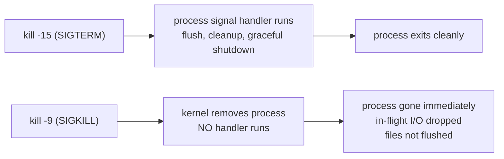
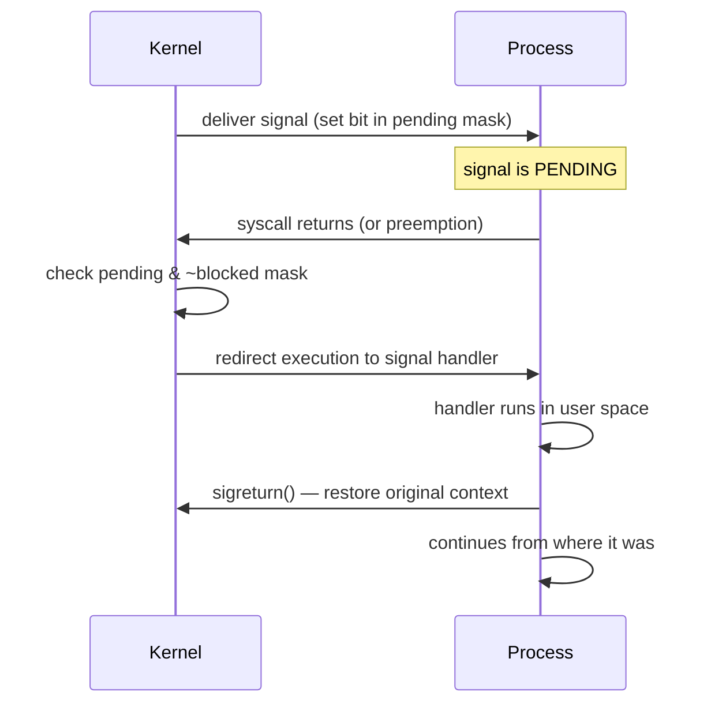
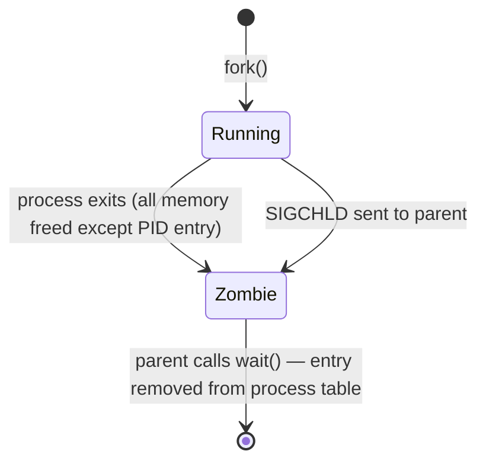

# Linux Signals

A signal is a software interrupt sent to a process by the kernel or another process. It's the primary mechanism for async process notification.

---

## Common Signals

| Signal | Number | Default action | Meaning |
|--------|--------|---------------|---------|
| `SIGHUP` | 1 | Terminate | Terminal hangup; used to reload config |
| `SIGINT` | 2 | Terminate | Keyboard interrupt (Ctrl+C) |
| `SIGQUIT` | 3 | Core dump | Quit with core dump (Ctrl+\\) |
| `SIGKILL` | 9 | Terminate | **Uncatchable.** Kernel kills immediately |
| `SIGUSR1` | 10 | Terminate | User-defined signal 1 |
| `SIGUSR2` | 12 | Terminate | User-defined signal 2 |
| `SIGPIPE` | 13 | Terminate | Write to broken pipe |
| `SIGTERM` | 15 | Terminate | Polite termination request (catchable) |
| `SIGCHLD` | 17 | Ignore | Child process stopped or terminated |
| `SIGSTOP` | 19 | Stop | **Uncatchable.** Pause process |
| `SIGCONT` | 18 | Continue | Resume stopped process |
| `SIGSEGV` | 11 | Core dump | Segmentation fault (invalid memory) |
| `SIGBUS` | 7 | Core dump | Bus error (misaligned memory access) |

---

## SIGTERM vs SIGKILL



**Rule:** Always try SIGTERM first. Give 30s. Then SIGKILL.

```bash
kill -15 <pid>      # SIGTERM — ask politely
sleep 30
kill -9 <pid>       # SIGKILL — force if still alive

# One-liner grace period
kill -15 <pid> && sleep 30 && kill -9 <pid> 2>/dev/null
```

**Why SIGKILL can't be caught:**
SIGKILL and SIGSTOP are handled entirely by the kernel scheduler — the process never gets CPU time to run a handler. This is intentional: it guarantees a way to always terminate a hung process.

---

## Signal Handling Internals



**When is a signal delivered?**
A signal becomes pending when sent. It's delivered when the process next transitions from kernel space to user space (syscall return or interrupt return). A sleeping process (in `select`, `read`, etc.) is woken up early — the syscall returns `EINTR`.

---

## Signal Masks

A process can **block** signals (add to the signal mask). Blocked signals stay pending until unblocked.

```bash
# View current signal masks for a process
cat /proc/1234/status | grep Sig
# SigBlk: 0000000000000000  ← blocked signals (bitmask, each bit = signal number)
# SigIgn: 0000000000001000  ← ignored (bit 12 = SIGPIPE ignored)
# SigCgt: 0000000180000000  ← caught (has handler installed)
# SigPnd: 0000000000000000  ← pending (sent but not yet delivered)

# Decode bitmask: bit N = signal N+1
# 0x1000 = bit 12 = signal 13 = SIGPIPE
python3 -c "mask=0x1000; [print(i+1) for i in range(64) if mask & (1<<i)]"
```

**In Go:**
```go
// Go runtime installs handlers for SIGSEGV, SIGBUS, SIGFPE
// and blocks SIGPROF for its own GC/scheduler use.
// To handle SIGTERM:
ch := make(chan os.Signal, 1)
signal.Notify(ch, syscall.SIGTERM, syscall.SIGINT)
<-ch  // block until signal
// do cleanup
```

---

## SIGCHLD and Zombie Processes

When a child process exits, the kernel sends SIGCHLD to the parent. The parent must call `wait()` or `waitpid()` to collect the exit status — only then is the zombie reaped.



```bash
# Default: SIGCHLD is ignored → parent never calls wait() → zombies accumulate
# Fix: explicitly handle SIGCHLD
# In shell scripts:
trap 'wait' SIGCHLD

# In C: use SA_NOCLDWAIT flag or signal(SIGCHLD, SIG_DFL) with waitpid
# In Go: os/exec.Cmd.Wait() handles this automatically
```

---

## Graceful Shutdown Pattern (Go)

```go
func main() {
    srv := &http.Server{Addr: ":8080"}

    go srv.ListenAndServe()

    quit := make(chan os.Signal, 1)
    signal.Notify(quit, syscall.SIGTERM, syscall.SIGINT)
    <-quit

    ctx, cancel := context.WithTimeout(context.Background(), 30*time.Second)
    defer cancel()
    srv.Shutdown(ctx)  // waits for in-flight requests, then stops
}
```

**Kubernetes graceful shutdown sequence:**
1. Pod gets SIGTERM (from `terminationGracePeriodSeconds` countdown start)
2. App starts draining (stop accepting, finish in-flight)
3. After `terminationGracePeriodSeconds` (default 30s) → SIGKILL
4. Set `preStop` hook if you need extra time before SIGTERM

---

## Sending Signals

```bash
kill -TERM <pid>         # by PID
kill -9 <pid>            # SIGKILL
killall -TERM nginx       # by name (all matching)
pkill -TERM -u www-data   # by user
pkill -f "python app.py"  # match full command line

# Send to process group (all children too)
kill -TERM -<pgid>

# Check what signals a process handles
kill -0 <pid>            # test if process exists (no signal sent)
```

---

## Signal Tracing with strace

```bash
# Watch signals being received
strace -e signal -p 1234

# Output example:
# --- SIGTERM {si_signo=SIGTERM, si_code=SI_USER, si_pid=5678} ---
# rt_sigreturn()  = 0
```

---

## Signal Forwarding and PID 1 in Containers

This is one of the most common sources of "pod won't terminate gracefully" bugs in production.

### The PID 1 problem

In a container, PID 1 has special responsibilities:
1. It receives all signals sent by the container runtime (Docker, containerd)
2. It must reap zombie child processes (call `waitpid`)
3. If PID 1 exits, the entire container exits

When you write a Dockerfile with shell-form CMD, `/bin/sh` becomes PID 1:

```
Container PID table:
  PID 1: /bin/sh -c "java -jar app.jar"   ← receives SIGTERM
  PID 2: java -jar app.jar                ← child of sh, never sees SIGTERM
```

The shell receives SIGTERM but doesn't forward it to the child by default. The child (your app) never gets SIGTERM. Kubernetes waits `terminationGracePeriodSeconds`, then sends SIGKILL to PID 1 (the shell), which kills the entire process group. Your app gets SIGKILL with no chance to flush, drain connections, or save state.

### Shell form vs exec form

```dockerfile
# SHELL FORM — do not use for the main process
# /bin/sh -c is PID 1; your app is a child
CMD java -jar app.jar
CMD ["sh", "-c", "java -jar app.jar"]

# EXEC FORM — your app IS PID 1, receives signals directly
CMD ["java", "-jar", "app.jar"]
ENTRYPOINT ["java", "-jar", "app.jar"]

# How to check: inspect the image
docker inspect <image> | jq '.[0].Config.Cmd'
# Exec form: ["java","-jar","app.jar"]
# Shell form: ["/bin/sh","-c","java -jar app.jar"]
```

### Shell wrapper with exec (when you need a startup script)

Sometimes you need a wrapper script for env var expansion, secret injection, or pre-flight checks. Use `exec` to replace the shell:

```bash
#!/bin/sh
# entrypoint.sh

# Do pre-flight setup
export DB_URL="postgresql://${DB_HOST}:5432/${DB_NAME}"
echo "Starting app, DB_URL=$DB_URL"

# exec REPLACES the shell with the app process
# app becomes PID 1 and receives signals directly
exec java \
  -Xmx${JAVA_MAX_HEAP:-512m} \
  -jar /app/app.jar \
  "$@"          # pass through any CMD arguments
```

```dockerfile
COPY entrypoint.sh /entrypoint.sh
RUN chmod +x /entrypoint.sh
ENTRYPOINT ["/entrypoint.sh"]
CMD ["--config", "/etc/app/config.yaml"]
```

Without `exec`, the shell stays as PID 1 and your app is still a child.

### tini — minimal init for containers

tini is a tiny but correct init that:
- Registers signal handlers and forwards all signals to its child
- Reaps zombie processes (`SIGCHLD` + `waitpid`)
- Is transparent to the application

```dockerfile
# Option 1: Install tini directly
FROM debian:bookworm-slim
RUN apt-get update && apt-get install -y tini && rm -rf /var/lib/apt/lists/*
ENTRYPOINT ["/usr/bin/tini", "--"]
CMD ["java", "-jar", "app.jar"]

# Option 2: Copy tini binary from official image
FROM tini:latest AS tini
FROM debian:bookworm-slim
COPY --from=tini /tini /tini
ENTRYPOINT ["/tini", "--"]
CMD ["java", "-jar", "app.jar"]

# Option 3: Docker built-in --init flag (adds tini automatically)
docker run --init myimage
# Or in compose:
# services:
#   app:
#     init: true
```

```
With tini:
  PID 1: tini -- java -jar app.jar
  PID 2: java -jar app.jar

  SIGTERM → tini receives → forwards SIGTERM to PID 2 (java)
  java runs its shutdown hooks → flushes, drains, exits cleanly
  tini exits → container terminates
```

### dumb-init — alternative to tini

```dockerfile
RUN wget -O /usr/bin/dumb-init \
  https://github.com/Yelp/dumb-init/releases/download/v1.2.5/dumb-init_1.2.5_x86_64 \
  && chmod +x /usr/bin/dumb-init
ENTRYPOINT ["/usr/bin/dumb-init", "--"]
CMD ["python", "-m", "myapp"]

# dumb-init with setsid (creates new process group):
ENTRYPOINT ["/usr/bin/dumb-init", "--setsid", "--"]
# Useful when your app spawns children that also need to receive signals
```

**tini vs dumb-init:**
Both do the same job. tini is included in Docker Engine and is the more widely recommended option. dumb-init is simpler (single Go binary). Choose based on what's already in your base image.

### Docker STOPSIGNAL

By default, `docker stop` / `kubectl delete pod` sends `SIGTERM` to PID 1. You can override this:

```dockerfile
# Send SIGQUIT instead of SIGTERM for graceful nginx shutdown
# nginx uses SIGQUIT for graceful drain (finish in-flight requests)
# SIGTERM to nginx causes immediate close without draining
STOPSIGNAL SIGQUIT

# Common per-app signals:
# nginx:        SIGQUIT (graceful), SIGTERM (fast stop)
# gunicorn:     SIGTERM (graceful), SIGQUIT (graceful with timeout)
# unicorn:      SIGUSR1 (reopen logs), SIGWINCH (graceful worker stop)
# PostgreSQL:   SIGTERM (smart shutdown), SIGINT (fast shutdown)
```

```yaml
# Override in Kubernetes pod spec (takes precedence over Dockerfile STOPSIGNAL)
spec:
  containers:
    - name: nginx
      lifecycle:
        preStop:
          exec:
            command: ["/bin/sh", "-c", "nginx -s quit; while killall -0 nginx; do sleep 1; done"]
      # SIGQUIT will be sent after preStop completes
```

### Verifying graceful shutdown works

```bash
# 1. Check what PID 1 is in your container
kubectl exec <pod> -- ps -p 1
# Should NOT be "sh" or "bash"

# 2. Check signal handlers registered by the process
kubectl exec <pod> -- cat /proc/1/status | grep Sig
# SigCgt (caught signals) should include bit 15 (SIGTERM = bit 14, 0-indexed)
python3 -c "mask=0x...; print([i+1 for i in range(64) if mask&(1<<i)])"

# 3. Test graceful shutdown manually
kubectl exec <pod> -- kill -TERM 1   # send SIGTERM to PID 1
kubectl logs <pod> -f                # watch for graceful shutdown logs
# Should see: "received shutdown signal, draining..." type messages
# Should NOT see: sudden cut-off with no cleanup messages

# 4. Measure actual shutdown time vs terminationGracePeriodSeconds
kubectl get pod <pod> -o json | jq '.spec.terminationGracePeriodSeconds'
# If your app takes 10s to drain, this must be > 10s (recommend 2-3x actual drain time)
```

### Complete graceful shutdown checklist

```
Dockerfile:
  ✓ CMD in exec form (not shell form)
  ✓ ENTRYPOINT is app or tini/dumb-init (not /bin/sh -c)
  ✓ STOPSIGNAL set if app uses non-SIGTERM signal

Kubernetes:
  ✓ terminationGracePeriodSeconds ≥ preStop duration + actual drain time
  ✓ preStop: sleep 5 (gives kube-proxy time to drain the pod from endpoints)
  ✓ readinessProbe fails fast on shutdown start (pod removed from endpoints faster)

Application:
  ✓ SIGTERM handler registered
  ✓ Handler: stop accepting new requests
  ✓ Handler: wait for in-flight requests to complete
  ✓ Handler: flush buffers (logs, metrics, traces)
  ✓ Handler: close DB connections
  ✓ Handler: exit(0)
```
