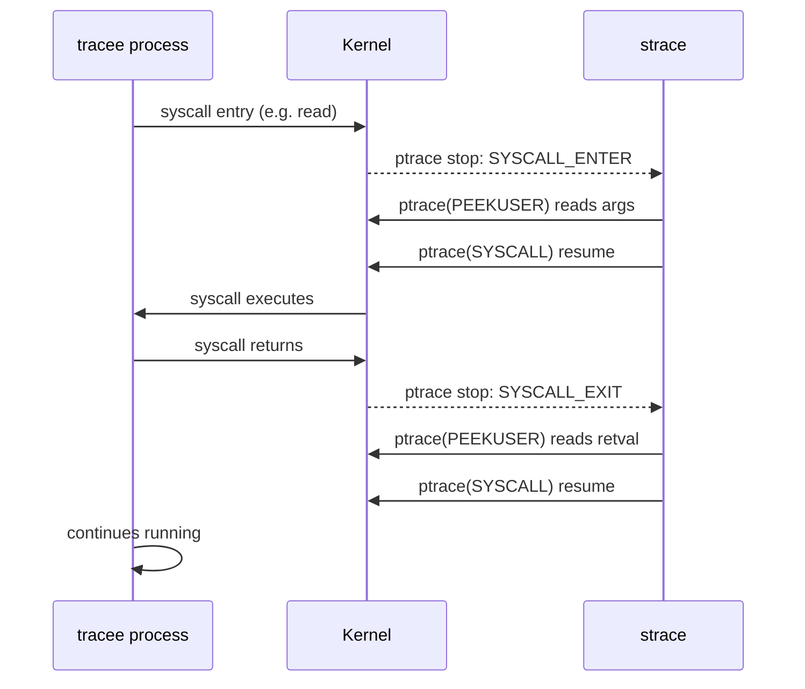
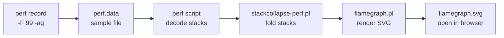
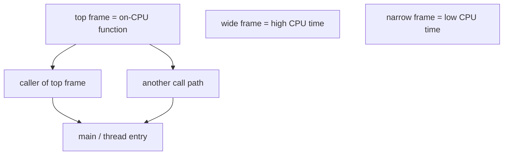

# strace, perf and Profiling

Each major section below closes with a quick knowledge check — track how many you've cleared as you go:

<div class="quiz-progress" data-quiz-progress>
  <span class="quiz-progress-label">0/0 checks</span>
  <span class="quiz-progress-bar"><span class="quiz-progress-fill"></span></span>
</div>

---

## 1. strace — Syscall Interception

strace uses the `ptrace(2)` syscall to intercept every system call made by a process. The kernel pauses the tracee at each syscall entry/exit, allowing strace to inspect arguments and return values.

```bash
# Trace a new process
strace ls /tmp

# Attach to running process by PID
strace -p 1234

# Filter: only open/read/write syscalls
strace -e trace=openat,read,write ls

# Count syscalls (summary table)
strace -c ls /tmp

# Show time spent per syscall
strace -T ls /tmp

# Trace child processes (fork/exec)
strace -f nginx -g daemon off

# Trace with timestamps
strace -t ls          # wall clock time
strace -tt ls         # microseconds
strace -ttt ls        # epoch microseconds

# Write output to file (essential for -f)
strace -f -o trace.txt nginx

# Network syscalls only
strace -e trace=network curl http://example.com

# File syscalls only
strace -e trace=file myapp
```

**Real examples:**

```bash
# Why is my process hung?
strace -p $(pgrep myapp) -e trace=all

# What files does it open at startup?
strace -e openat ./myapp 2>&1 | grep -v ENOENT

# Find slow syscalls (>1ms)
strace -T ./myapp 2>&1 | awk -F'<' '$2+0 > 0.001'

# Count syscalls during a test
strace -c -p 1234   # Ctrl-C to stop and print summary
```



> **Production warning:** strace adds ~10-100x overhead. On live systems, use `-c` for aggregated stats or attach briefly. Use `perf trace` for lower overhead.

<div class="quiz-card">
  <p class="quiz-q">Why does strace impose 10-100x overhead instead of just the cost of one extra process reading syscall info?</p>
  <button class="quiz-reveal">Reveal answer</button>
  <div class="quiz-a" hidden>
    Look at the sequence diagram above: ptrace stops the tracee twice per syscall —
    once at SYSCALL_ENTER and once at SYSCALL_EXIT — and each stop requires a
    context switch to strace and back before the tracee can resume. That's two
    extra round trips through the kernel for every single syscall the process
    makes, not a one-time cost.
  </div>
</div>

---

## 2. perf stat — Hardware Counters

`perf stat` measures hardware performance counters (PMU) via kernel perf_event subsystem.

```bash
# Basic stats for a command
perf stat ls /tmp

# Attach to running PID
perf stat -p 1234

# Run for 5 seconds then report
perf stat -p 1234 sleep 5

# Specific events
perf stat -e cycles,instructions,cache-misses,branch-misses ls

# Repeat 3 times for variance
perf stat -r 3 ./mybenchmark
```

**Example output:**
```
 Performance counter stats for 'ls /tmp':

       2,345,678  cycles                    #  1.23 GHz
       1,890,123  instructions              #  0.81  insn per cycle (IPC)
          12,456  cache-misses              #  2.3% of all cache refs
           8,901  branch-misses             #  0.4% of all branches

       0.001234 seconds time elapsed
```

**Key metrics:**

| Metric | Good | Investigate if |
|--------|------|---------------|
| IPC (insn/cycle) | > 1.5 | < 0.5 (memory-bound?) |
| Cache miss rate | < 1% | > 10% (working set too large) |
| Branch miss rate | < 1% | > 5% (unpredictable branches) |
| Cycles/instruction | < 1 | > 3 (pipeline stalls) |

```bash
# Memory bandwidth events
perf stat -e LLC-loads,LLC-load-misses,LLC-stores ./myapp

# TLB events
perf stat -e dTLB-loads,dTLB-load-misses ./myapp
```

<div class="quiz-card">
  <p class="quiz-q">A perf stat run shows IPC of 0.3. Does that mean the CPU is running too slow (a clock-speed problem)?</p>
  <button class="quiz-reveal">Reveal answer</button>
  <div class="quiz-a" hidden>
    No. IPC measures how many instructions retire per cycle, not clock speed —
    per the table above, &lt; 0.5 points to the CPU spending most cycles
    stalled waiting on something, usually memory (check cache-miss rate next).
    Raising clock speed wouldn't fix a stall the CPU spends waiting on RAM.
  </div>
</div>

---

## 3. perf top — Live Hot Functions

```bash
# Live view of CPU-consuming functions system-wide
perf top

# For specific PID
perf top -p 1234

# Show kernel symbols too
perf top -a

# Specific event (cache misses)
perf top -e cache-misses

# Update every 2 seconds
perf top -d 2
```

**Navigation:** Arrow keys to select, Enter to annotate (assembly view), `q` to quit.

---

## 4. perf record + report — Flame Graph Pipeline

```bash
# Sample at 99Hz for 30s (freq avoids lockstep with 100Hz timer)
perf record -F 99 -g ./myapp

# Sample running process
perf record -F 99 -g -p 1234 sleep 30

# System-wide sampling
perf record -F 99 -ag sleep 30

# View interactive report (TUI)
perf report

# Dump raw text for flame graph
perf report --stdio --no-header -n -q > perf_report.txt
```

**Full flame graph pipeline (Brendan Gregg's method):**

```bash
# 1. Record with stack traces
perf record -F 99 -ag -o perf.data sleep 30

# 2. Export to folded format
git clone https://github.com/brendangregg/FlameGraph
perf script -i perf.data | \
    ./FlameGraph/stackcollapse-perf.pl > out.folded

# 3. Generate SVG
./FlameGraph/flamegraph.pl out.folded > flamegraph.svg

# 4. Open in browser
open flamegraph.svg
```



Step through the same pipeline one stage at a time:

<div class="stepper">
  <div class="stepper-panels">
    <div class="stepper-panel active">
      <strong>1. Record with stack traces.</strong> <code>perf record -F 99 -ag -o perf.data sleep 30</code>
      &mdash; sample at 99Hz (not 100Hz) system-wide (<code>-a</code>) with call graphs (<code>-g</code>) for 30 seconds.
    </div>
    <div class="stepper-panel">
      <strong>2. Export to folded format.</strong> Clone Brendan Gregg's <code>FlameGraph</code> repo, then
      <code>perf script -i perf.data | ./FlameGraph/stackcollapse-perf.pl &gt; out.folded</code> decodes the raw
      samples into one line per unique stack, with a count of how many samples hit it.
    </div>
    <div class="stepper-panel">
      <strong>3. Generate the SVG.</strong> <code>./FlameGraph/flamegraph.pl out.folded &gt; flamegraph.svg</code>
      turns the folded stacks into the interactive, color-coded image.
    </div>
    <div class="stepper-panel">
      <strong>4. Open and read it.</strong> <code>open flamegraph.svg</code> &mdash; then look for the widest
      frames near the top, per the reading guide below.
    </div>
  </div>
  <div class="stepper-controls">
    <button class="stepper-prev">← Prev</button>
    <span class="stepper-dots"></span>
    <span class="stepper-label"></span>
    <button class="stepper-next">Next →</button>
  </div>
</div>

<div class="quiz-card">
  <p class="quiz-q">Why sample at -F 99 instead of a round number like 100Hz?</p>
  <button class="quiz-reveal">Reveal answer</button>
  <div class="quiz-a" hidden>
    Sampling at exactly 100Hz can fall into lockstep with the kernel's own
    100Hz timer tick, so every sample keeps catching the same phase of
    periodic work and skews the profile. 99Hz avoids that alignment so the
    samples land at effectively random points relative to the timer.
  </div>
</div>

---

## 5. Flame Graphs — How to Read



**Axes:**
- **X-axis:** Aggregate CPU time (width = % of samples). Left-to-right order is alphabetical, NOT time sequence.
- **Y-axis:** Stack depth. Bottom = thread entry point, top = on-CPU function.

**What to look for:**

| Pattern | Meaning |
|---------|---------|
| Wide frame at top | Hot function — optimize this |
| Wide tower | Deep call chain all consuming CPU |
| Flat wide plateau | Single function dominating |
| Thin frames | Many different functions, no clear hotspot |

**Brendan Gregg methodology:**
1. Look for the **widest frames near the top** — these are the actual CPU consumers
2. Trace down the stack to find which code path called into the hot function
3. Off-CPU flame graphs (perf + sleep analysis) show blocking time — different tool
4. Differential flame graphs compare before/after a change

<div class="quiz-card">
  <p class="quiz-q">In a flame graph, function A is drawn to the left of function B at the same stack depth. Does that mean A ran before B in time?</p>
  <button class="quiz-reveal">Reveal answer</button>
  <div class="quiz-a" hidden>
    No. Left-to-right order is alphabetical, not chronological — the x-axis
    encodes aggregate CPU time (frame width = % of samples), not a timeline.
    A sitting left of B tells you nothing about which one ran first.
  </div>
</div>

---

## 6. perf trace — Lightweight Syscall Tracer

`perf trace` uses eBPF/tracepoints instead of ptrace — much lower overhead than strace.

```bash
# Trace syscalls for a command
perf trace ls /tmp

# Attach to PID
perf trace -p 1234

# Summary (like strace -c)
perf trace -s -p 1234 sleep 5

# Only specific syscalls
perf trace -e openat,read,write ls

# Filter by pid and syscall
perf trace --pid 1234 -e sendto

# Show timing
perf trace -T ls
```

**strace vs perf trace:**

| | strace | perf trace |
|---|--------|-----------|
| Mechanism | ptrace (per-process) | tracepoints/eBPF (kernel) |
| Overhead | ~10-100x | ~2-5x |
| Attach to running | Yes | Yes |
| Child tracing (-f) | Yes | Yes |
| Production safe | No | Cautious yes |
| Output format | Detailed | Concise |

<div class="quiz-card">
  <p class="quiz-q">The table lists perf trace as "Cautious yes" for production, not an unconditional yes, even though its overhead is ~2-5x versus strace's ~10-100x. Why the caveat?</p>
  <button class="quiz-reveal">Reveal answer</button>
  <div class="quiz-a" hidden>
    Tracepoints/eBPF are much cheaper per syscall than ptrace's double
    context-switch stop, but 2-5x is still real overhead, not zero. On a
    system already close to saturated or latency-sensitive, that multiplier
    can still matter — "cheaper than strace" isn't the same guarantee as
    "safe to run always."
  </div>
</div>

---

## 7. Choosing the Right Tool — strace vs perf vs Flame Graphs

Sections 1-6 covered each tool on its own. Here's the same decision compressed to "which one do I reach for," by use case and overhead:

<div class="tab-group">
  <div class="tab-buttons">
    <button data-tab="strace-tool" class="active">strace</button>
    <button data-tab="perf-tool">perf</button>
    <button data-tab="flamegraph-tool">flame graphs</button>
  </div>
  <div class="tab-panels">
    <div class="tab-panel active" data-tab-panel="strace-tool">
      <strong>Use case:</strong> Deep, per-syscall inspection of a single process &mdash; exact arguments,
      return values, and errors. Reach for it on questions like "why is my process hung" or
      "what files does it open at startup."<br/><br/>
      <strong>Overhead:</strong> ~10-100x, because ptrace stops the tracee at every syscall entry
      <em>and</em> exit. Fine for a brief attach or with <code>-c</code>; don't leave it running against
      live traffic.
    </div>
    <div class="tab-panel" data-tab-panel="perf-tool">
      <strong>Use case:</strong> Everything from a whole-system health check (<code>perf stat</code>'s
      hardware counters &mdash; IPC, cache misses) to a live view of hot functions
      (<code>perf top</code>) to a full CPU profile over a time window
      (<code>perf record</code> + <code>perf report</code>), plus lower-overhead syscall tracing
      via <code>perf trace</code>.<br/><br/>
      <strong>Overhead:</strong> A few percent for counter reads and sampling; <code>perf trace</code>
      runs ~2-5x thanks to tracepoints/eBPF instead of ptrace &mdash; an order of magnitude cheaper
      than strace, and cautiously safe for production.
    </div>
    <div class="tab-panel" data-tab-panel="flamegraph-tool">
      <strong>Use case:</strong> Turning <code>perf record</code>'s raw stack samples into one picture,
      so the widest (hottest) function jumps out instead of scrolling through
      <code>perf report</code> line by line. Best when you need to show, not just find, where the
      CPU time went.<br/><br/>
      <strong>Overhead:</strong> None beyond whatever <code>perf record</code> already cost to capture
      the samples &mdash; the SVG is generated offline, after the run.
    </div>
  </div>
</div>
