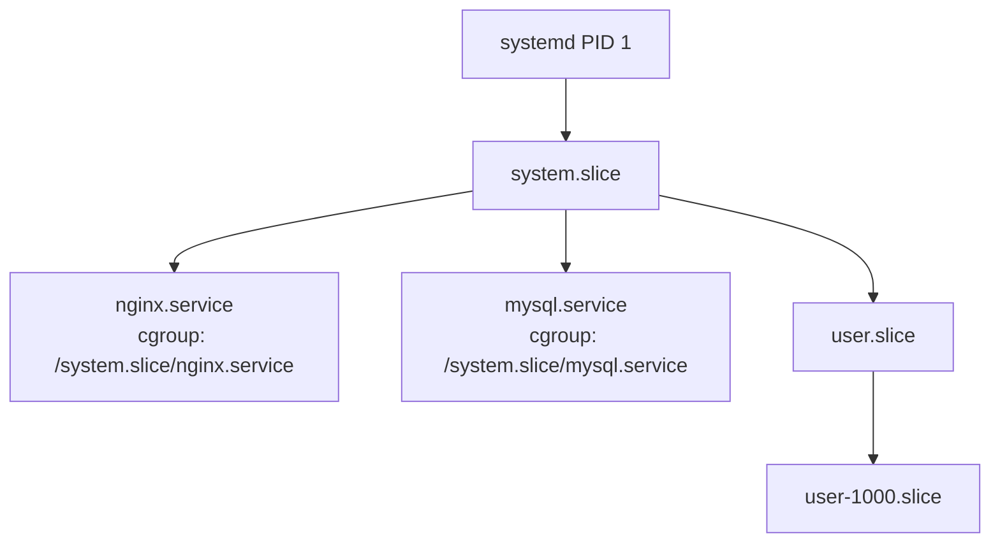
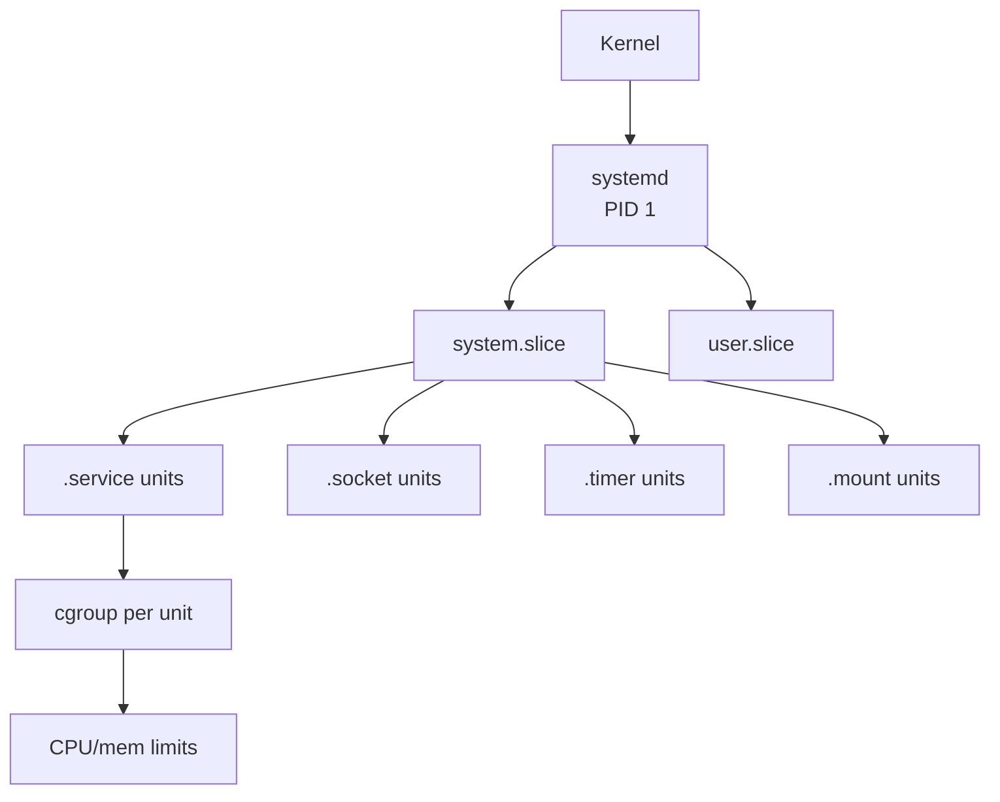
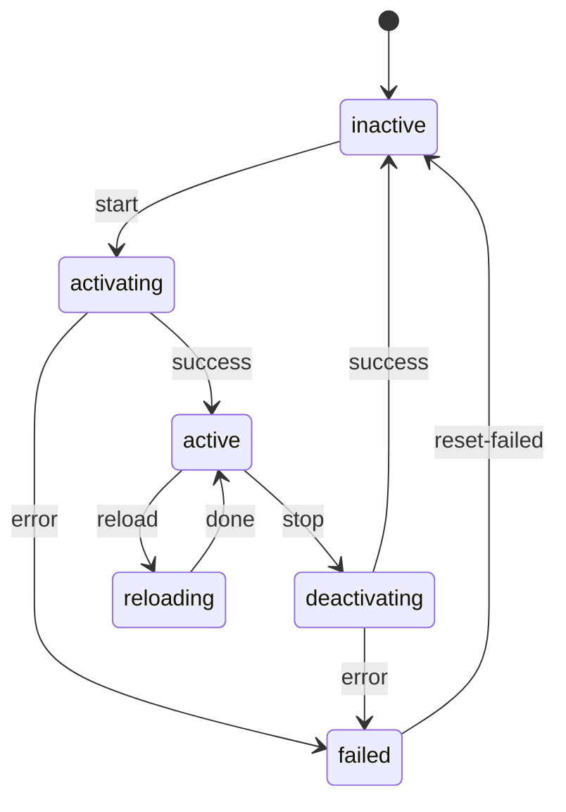
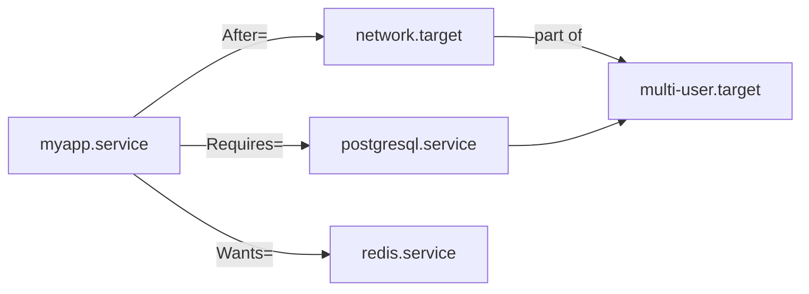

# systemd

<div class="quiz-progress" data-quiz-progress>
  <span class="quiz-progress-label">0/0 checks</span>
  <span class="quiz-progress-bar"><span class="quiz-progress-fill"></span></span>
</div>

## 1. Architecture

systemd is PID 1 — the first process started by the kernel. It initializes userspace, manages services, and reaps orphaned processes.

**Unit types:**

| Type | Extension | Purpose |
|------|-----------|---------|
| service | `.service` | Daemon/process lifecycle |
| socket | `.socket` | Socket activation (inetd-style) |
| timer | `.timer` | Scheduled jobs (cron replacement) |
| mount | `.mount` | Filesystem mount points |
| target | `.target` | Grouping/synchronization point |
| path | `.path` | File/directory change trigger |
| device | `.device` | udev device availability |

**cgroups integration:** Every service gets its own cgroup slice. systemd uses this to track all processes belonging to a unit (including forks), enforce resource limits (CPU/memory), and cleanly kill the entire process tree on stop.





<div class="quiz-card">
  <p class="quiz-q">A service's ExecStart process forks several child workers, and one of those children is still running after the main process is killed. When you run <code>systemctl stop</code>, does systemd still catch that orphaned child?</p>
  <button class="quiz-reveal">Reveal answer</button>
  <div class="quiz-a" hidden>
    Yes. systemd doesn't track a unit by watching the specific PIDs it launched — every process the unit spawns, including forks it never saw directly, lives inside that unit's cgroup. On stop, systemd kills everything in the cgroup, so orphaned children get caught along with the tracked main process.
  </div>
</div>

---

## 2. Unit File Structure

Unit files live in `/etc/systemd/system/` (admin) or `/lib/systemd/system/` (packages).

```ini
[Unit]
Description=My App Server
Documentation=https://example.com/docs
After=network.target postgresql.service
Requires=postgresql.service
Wants=redis.service
ConditionPathExists=/etc/myapp/config.yml

[Service]
Type=simple            # simple|forking|oneshot|notify|idle
ExecStart=/usr/bin/myapp --config /etc/myapp/config.yml
ExecReload=/bin/kill -HUP $MAINPID
ExecStop=/bin/kill -TERM $MAINPID
Restart=on-failure     # no|always|on-failure|on-abnormal
RestartSec=5s
User=myapp
Group=myapp
WorkingDirectory=/var/lib/myapp
Environment=APP_ENV=production
EnvironmentFile=/etc/myapp/env
StandardOutput=journal
StandardError=journal
LimitNOFILE=65536
MemoryMax=512M
CPUQuota=50%
KillMode=mixed         # control-group|process|mixed|none
TimeoutStartSec=30
TimeoutStopSec=30

[Install]
WantedBy=multi-user.target
```

**Key `Type=` values:**

<div class="tab-group">
  <div class="tab-buttons">
    <button data-tab="simple" class="active">simple</button>
    <button data-tab="forking">forking</button>
    <button data-tab="oneshot">oneshot</button>
    <button data-tab="notify">notify</button>
    <button data-tab="idle">idle</button>
  </div>
  <div class="tab-panels">
    <div class="tab-panel active" data-tab-panel="simple">
      <strong>Default.</strong> <code>ExecStart</code> itself is the main process — systemd considers the service started the instant it forks that process, without waiting for any signal back.
    </div>
    <div class="tab-panel" data-tab-panel="forking">
      The <code>ExecStart</code> process is expected to fork and then have its parent exit. systemd waits for that parent to exit before considering startup complete, and tracks the real daemon afterward via <code>PIDFile=</code>.
    </div>
    <div class="tab-panel" data-tab-panel="oneshot">
      Runs once and exits — there's no long-running process to track. Pair with <code>RemainAfterExit=yes</code> if you still want <code>systemctl status</code> to show it as "active" after it finishes (common for timer-triggered jobs).
    </div>
    <div class="tab-panel" data-tab-panel="notify">
      Like <code>simple</code>, but systemd doesn't consider the service up until the process explicitly calls <code>sd_notify(READY=1)</code> — lets a daemon signal "I've finished initializing," not just "I've started."
    </div>
    <div class="tab-panel" data-tab-panel="idle">
      Behaves like <code>simple</code>, but delays running <code>ExecStart</code> until all other active jobs have been dispatched — mainly used to keep a unit's console output from interleaving with the rest of the boot sequence.
    </div>
  </div>
</div>

<div class="quiz-card">
  <p class="quiz-q">You leave <code>Type=simple</code> on a wrapper script whose <code>ExecStart</code> forks a background daemon and then exits immediately. What does systemd conclude happened to the service?</p>
  <button class="quiz-reveal">Reveal answer</button>
  <div class="quiz-a" hidden>
    systemd was tracking the wrapper script's PID as the service's main process. The instant that script exits, systemd marks the unit stopped (or failed) — even though the real daemon is still running in the background, now untracked as far as systemd's lifecycle is concerned. This needs <code>Type=forking</code> with <code>PIDFile=</code> instead, so systemd waits for the parent to exit and tracks the actual child.
  </div>
</div>

---

## 3. Service Lifecycle & systemctl Commands



<div class="stepper">
  <div class="stepper-panels">
    <div class="stepper-panel active">
      <strong>1. inactive.</strong> Nothing running. This is a unit's state before its first start, or after a clean stop.
    </div>
    <div class="stepper-panel">
      <strong>2. activating.</strong> <code>systemctl start</code> triggers this. <code>ExecStart</code> is running — and depending on <code>Type=</code>, systemd may still be waiting here: on the forking parent to exit (<code>forking</code>) or on <code>sd_notify(READY=1)</code> (<code>notify</code>).
    </div>
    <div class="stepper-panel">
      <strong>3. active.</strong> Startup succeeded. <code>systemctl reload</code> sends SIGHUP and briefly detours through <code>reloading</code>, then comes straight back to <code>active</code> — no stop/start cycle, no downtime.
    </div>
    <div class="stepper-panel">
      <strong>4. deactivating.</strong> <code>systemctl stop</code> triggers this; <code>ExecStop</code> is running.
    </div>
    <div class="stepper-panel">
      <strong>5. inactive — or failed.</strong> A clean stop lands back in <code>inactive</code>. Any error along the way, during either <code>activating</code> or <code>deactivating</code>, lands in <code>failed</code> instead — and <code>failed</code> doesn't recover on its own. It takes an explicit <code>systemctl reset-failed</code> to clear it back to <code>inactive</code>.
    </div>
  </div>
  <div class="stepper-controls">
    <button class="stepper-prev">← Prev</button>
    <span class="stepper-dots"></span>
    <span class="stepper-label"></span>
    <button class="stepper-next">Next →</button>
  </div>
</div>

```bash
# Basic control
systemctl start nginx
systemctl stop nginx
systemctl restart nginx
systemctl reload nginx          # send SIGHUP, no downtime
systemctl enable nginx          # create symlink → start at boot
systemctl disable nginx
systemctl mask nginx            # symlink to /dev/null, unoverridable
systemctl unmask nginx

# Inspection
systemctl status nginx          # state, PID, last log lines
systemctl is-active nginx       # exit 0 if active
systemctl is-enabled nginx
systemctl list-units --type=service --state=failed
systemctl list-units --type=service --all
systemctl cat nginx             # show unit file
systemctl show nginx            # all properties as key=value
systemctl edit nginx            # create drop-in override

# Daemon reload after editing unit files
systemctl daemon-reload
```

<div class="quiz-card">
  <p class="quiz-q">You need to pick up a config change with zero downtime for the running process. Should you run <code>systemctl restart</code> or <code>systemctl reload</code>?</p>
  <button class="quiz-reveal">Reveal answer</button>
  <div class="quiz-a" hidden>
    <code>reload</code>. It sends SIGHUP to the already-running process, which stays in <code>active</code> the whole time (dipping through <code>reloading</code> and back). <code>restart</code> tears the unit down through <code>deactivating</code> → <code>inactive</code> before starting it again from <code>activating</code> — a real stop, even if brief.
  </div>
</div>

---

## 4. Dependency Ordering



| Directive | Meaning |
|-----------|---------|
| `After=` | Start order only — wait for listed units to start first |
| `Before=` | Start order only — this unit starts before listed units |
| `Requires=` | Hard dependency — if dependency fails, this unit fails |
| `Wants=` | Soft dependency — dependency failure does not stop this unit |
| `BindsTo=` | Like Requires= + if dependency stops, this stops too |
| `PartOf=` | Propagate stop/restart from parent to this unit |
| `Conflicts=` | Cannot run simultaneously |

> `After=` and `Requires=` are independent. `Requires=A` without `After=A` means both start in parallel but this unit fails if A fails.

<div class="quiz-card">
  <p class="quiz-q">You set <code>Requires=postgresql.service</code> on <code>myapp.service</code> but don't add <code>After=postgresql.service</code>. Does that guarantee postgresql is up and ready before myapp starts?</p>
  <button class="quiz-reveal">Reveal answer</button>
  <div class="quiz-a" hidden>
    No. <code>Requires=</code> only says myapp fails if postgresql fails — it says nothing about order. Without <code>After=</code>, both units are started in parallel, so myapp can attempt to start before postgresql has finished (or even begun) initializing. Ordering and dependency are separate directives; you almost always want both together.
  </div>
</div>

---

## 5. Timers (cron replacement)

Every timer needs a matching `.service` unit with the same base name.

```ini
# /etc/systemd/system/backup.timer
[Unit]
Description=Daily backup timer

[Timer]
OnCalendar=daily              # or: Mon-Fri 09:00
Persistent=true               # run missed jobs after downtime
RandomizedDelaySec=300        # spread load across 5 min window
AccuracySec=1s                # wake precision

[Install]
WantedBy=timers.target
```

```ini
# /etc/systemd/system/backup.service
[Unit]
Description=Daily backup job

[Service]
Type=oneshot
ExecStart=/usr/local/bin/backup.sh
```

```bash
systemctl enable --now backup.timer
systemctl list-timers --all          # next trigger times
```

**OnCalendar syntax:**

```
daily              → 00:00:00 every day
hourly             → *:00:00
Mon-Fri 09:00      → weekdays at 9am
*-*-1 00:00        → 1st of every month
2024-06-15 12:30   → specific datetime
```

<div class="quiz-card">
  <p class="quiz-q">The machine is powered off at the exact moment <code>backup.timer</code> (<code>OnCalendar=daily</code>, <code>Persistent=true</code>) would have fired. What happens once it boots back up?</p>
  <button class="quiz-reveal">Reveal answer</button>
  <div class="quiz-a" hidden>
    Because <code>Persistent=true</code>, systemd notices the scheduled run was missed while the timer was inactive and fires it once as soon as the timer unit starts again — you don't have to wait for the next daily slot. Without <code>Persistent=true</code>, that missed run would just be skipped.
  </div>
</div>

---

## 6. journalctl Flags

```bash
# Follow a unit's logs (like tail -f)
journalctl -u nginx -f

# Logs since last boot
journalctl -b

# Logs from two boots ago
journalctl -b -2

# Time range
journalctl --since "2024-01-01 00:00" --until "2024-01-02 00:00"
journalctl --since "1 hour ago"

# Priority filter (emerg/alert/crit/err/warning/notice/info/debug)
journalctl -p err           # err and above
journalctl -p warning..err  # range

# Combine
journalctl -u nginx -p err --since "today" -f

# Output formats
journalctl -u nginx -o json-pretty    # structured JSON
journalctl -u nginx -o short-iso      # ISO timestamps

# Disk usage
journalctl --disk-usage
journalctl --vacuum-size=500M
```

---

## 7. Boot Analysis with systemd-analyze

```bash
# Total boot time
systemd-analyze

# Per-unit breakdown sorted by time
systemd-analyze blame

# Critical path chain
systemd-analyze critical-chain

# Critical path for a specific unit
systemd-analyze critical-chain nginx.service

# Export SVG boot timeline
systemd-analyze plot > boot.svg

# Check unit file syntax
systemd-analyze verify /etc/systemd/system/myapp.service
```

**Example output:**
```
Startup finished in 1.2s (kernel) + 3.4s (initrd) + 8.9s (userspace) = 13.5s

blame:
  4.201s apt-daily.service
  2.914s dev-sda1.device
  1.630s NetworkManager-wait-online.service
  ...
```

> To speed up boot: mask `apt-daily.service`, disable `NetworkManager-wait-online.service` if not needed, and check for slow `ExecStartPre=` scripts.

<div class="quiz-card">
  <p class="quiz-q"><code>systemd-analyze blame</code> lists a unit taking 4.2s to initialize. Does disabling that unit save 4.2s off total boot time?</p>
  <button class="quiz-reveal">Reveal answer</button>
  <div class="quiz-a" hidden>
    Not necessarily. <code>blame</code> is a per-unit breakdown — it shows how long each unit's own initialization took, not whether that time overlapped with other units starting in parallel. To see what's actually on the serial path holding up total boot time, use <code>systemd-analyze critical-chain</code> instead.
  </div>
</div>
