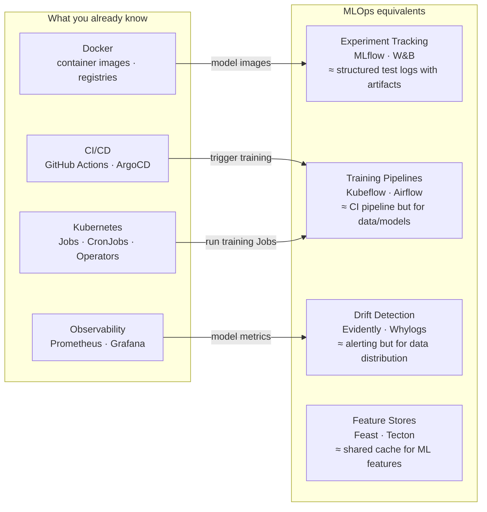

# MLOps — Machine Learning Operations

MLOps applies DevOps/GitOps principles to ML: version control for data and models, automated retraining pipelines, and production monitoring beyond CPU/memory.

  0/0 checks
  

---

## How MLOps Relates to What You Know

  
In the diagram, both CI/CD and Kubernetes feed into Training Pipelines &mdash; one via "trigger training," the other via "run training Jobs." What's the actual division of labor between them?

  <button class="quiz-reveal">Reveal answer</button>
  

    CI/CD decides <strong>when</strong>: it's the event source, the same role it plays
    triggering a deploy. Kubernetes provides <strong>where</strong>: the Jobs/CronJobs/Operators
    that actually execute the training workload once triggered. Neither one replaces the
    other &mdash; the pipeline needs a trigger and a place to run, same as any CI/CD workflow.
  

  
Observability maps to Drift Detection, labeled "model metrics." Why can't the existing Prometheus/Grafana stack just be pointed at a model unmodified?

  <button class="quiz-reveal">Reveal answer</button>
  

    Prometheus/Grafana are built to alert on infrastructure metrics &mdash; CPU, memory,
    latency. A model can look perfectly healthy on all of those while quietly degrading,
    because the failure mode is the production input data drifting away from what the
    model was trained on. That's a statistical-distribution problem, not a resource
    problem, which is why it needs a dedicated tool (Evidently/Whylogs) rather than a new
    Grafana panel &mdash; this is the "production monitoring beyond CPU/memory" the intro
    calls out.
  

---

## Files

| File | Topics |
|------|--------|
| [experiment-tracking.md](./experiment-tracking.md) | MLflow runs/experiments/registry, W&B sweeps, artifact versioning, model promotion |
| [training-pipelines.md](./training-pipelines.md) | Kubeflow Pipelines components/DAGs, Airflow operators, retraining triggers, K8s Jobs |
| [data-drift.md](./data-drift.md) | Evidently reports, feature drift detection, retraining triggers, shadow scoring, A/B testing |
| [feature-stores.md](./feature-stores.md) | Feast architecture, online vs offline store, point-in-time joins, training/serving skew |

---

## The ML Lifecycle (DevOps Analogy)

| DevOps concept | MLOps equivalent |
|---------------|-----------------|
| `git commit` | Log experiment run (params + metrics) |
| Container image tag | Model version in registry |
| Staging environment | Model in "Staging" registry stage |
| Production deploy | Promote model to "Production" stage |
| CI pipeline | Training pipeline (data → model) |
| Smoke test | Model evaluation gate (accuracy > threshold) |
| Rollback | Revert model registry to previous version |
| Dependency lock file | `requirements.txt` + data snapshot hash |
| Feature flag | A/B traffic split between model versions |

  
Per the table, what happens right after a model clears its evaluation gate, and what does that promotion step correspond to on the DevOps side?

  <button class="quiz-reveal">Reveal answer</button>
  

    It gets promoted to the "Production" registry stage &mdash; the direct equivalent of a
    production deploy. "Staging" and "Production" here aren't different artifacts, just
    different labels on the same model version in the registry, the same way an
    environment tag doesn't change what's inside a container image.
  

---

## Learning Path

  

    

      <strong>1. experiment-tracking.md</strong> &mdash; understand how models are versioned. Start here.
    

    

      <strong>2. training-pipelines.md</strong> &mdash; build automated training workflows on K8s.
    

    

      <strong>3. data-drift.md</strong> &mdash; monitor production, trigger retraining.
    

    

      <strong>4. feature-stores.md</strong> &mdash; advanced: shared feature layer for training/serving consistency.
    

  

  

    <button class="stepper-prev">← Prev</button>
    
    
    <button class="stepper-next">Next →</button>
  

