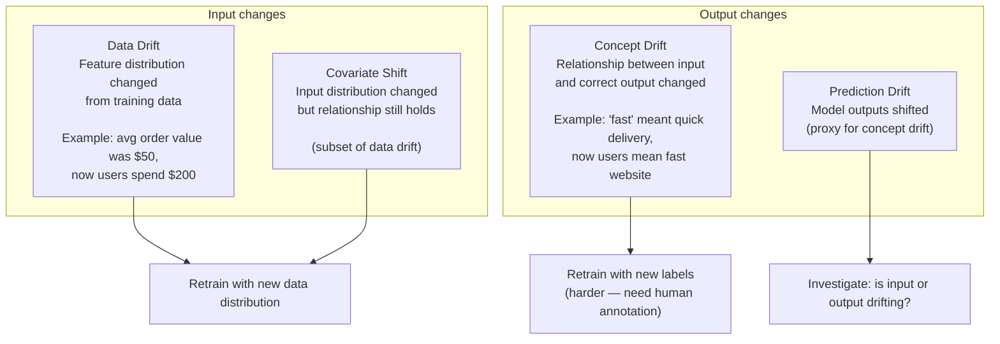
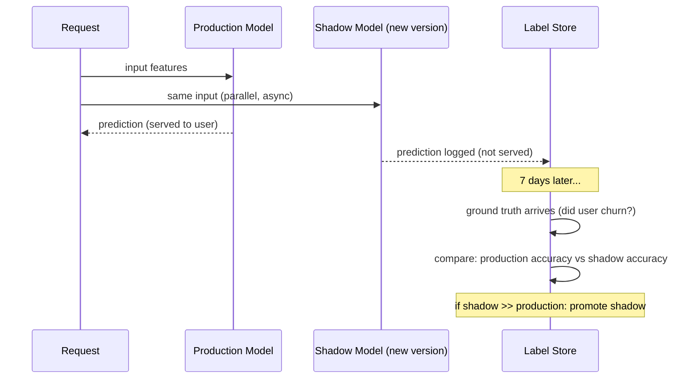
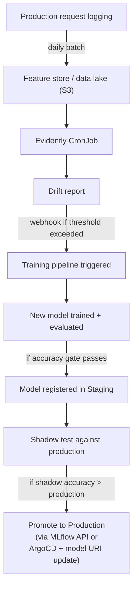

# Data Drift, Model Monitoring & Retraining Triggers

Monitoring a model in production requires more than Prometheus metrics. The model can degrade silently — same CPU/memory, but wrong answers — because the world changed.

<div class="quiz-progress" data-quiz-progress>
  <span class="quiz-progress-label">0/0 checks</span>
  <span class="quiz-progress-bar"><span class="quiz-progress-fill"></span></span>
</div>

---

## Types of Drift



Four named drift types, flip through them:

<div class="toggle-switch">
  <div class="toggle-buttons">
    <button data-toggle-opt="datadrift" class="active">Data Drift</button>
    <button data-toggle-opt="covariate">Covariate Shift</button>
    <button data-toggle-opt="concept">Concept Drift</button>
    <button data-toggle-opt="prediction">Prediction Drift</button>
  </div>
  <div class="toggle-panel active" data-toggle-panel="datadrift">
    <strong>Input changes.</strong> Feature distribution changed from training data &mdash; e.g. average order value was $50, now users spend $200. Fix: retrain with the new data distribution.
  </div>
  <div class="toggle-panel" data-toggle-panel="covariate">
    <strong>Input changes (subset of data drift).</strong> The input distribution changed, but the relationship between input and output still holds. Fix: same as data drift &mdash; retrain with the new data distribution.
  </div>
  <div class="toggle-panel" data-toggle-panel="concept">
    <strong>Output changes.</strong> The relationship between input and correct output changed &mdash; e.g. "fast" used to mean quick delivery, now users mean fast website. Fix: retrain with new labels, which is harder because it needs human annotation.
  </div>
  <div class="toggle-panel" data-toggle-panel="prediction">
    <strong>Output changes (proxy for concept drift).</strong> Model outputs shifted. Fix: investigate whether it's the input or the output that's actually drifting before deciding how to retrain.
  </div>
</div>

<div class="quiz-card">
  <p class="quiz-q">Data drift and concept drift both mean the model's predictions might now be wrong. What's the key difference in how you fix each?</p>
  <button class="quiz-reveal">Reveal answer</button>
  <div class="quiz-a" hidden>Data drift means the input distribution changed but the input-output relationship still holds &mdash; you can retrain with new data using the same old labels/logic. Concept drift means the input-output relationship itself changed, so retraining needs new labels, which is harder because it requires human annotation.</div>
</div>

---

## Evidently — Data and Model Monitoring

Evidently generates HTML reports and JSON metrics comparing a reference dataset (training) against current production data.

### Install

```bash
pip install evidently
```

### Generate a drift report

```python
import pandas as pd
from evidently.report import Report
from evidently.metric_preset import DataDriftPreset, DataQualityPreset
from evidently.metrics import ColumnDriftMetric

# Reference = training data (what the model was trained on)
reference_data = pd.read_parquet("s3://my-data/training/reference.parquet")

# Current = last 24h of production requests (with features logged)
current_data = pd.read_parquet("s3://my-data/production/last_24h.parquet")

# Generate report
report = Report(metrics=[
    DataDriftPreset(),           # checks all features for drift
    DataQualityPreset(),         # null rates, min/max, distribution
    ColumnDriftMetric(column_name="user_age"),     # specific feature
    ColumnDriftMetric(column_name="purchase_amount"),
])

report.run(reference_data=reference_data, current_data=current_data)
report.save_html("drift_report.html")

# Extract metrics programmatically
result = report.as_dict()
drift_score = result["metrics"][0]["result"]["dataset_drift"]
drifted_features = result["metrics"][0]["result"]["number_of_drifted_columns"]
print(f"Drift detected: {drift_score}, drifted features: {drifted_features}")
```

### Run as a K8s CronJob

```yaml
apiVersion: batch/v1
kind: CronJob
metadata:
  name: drift-monitor
  namespace: ml-monitoring
spec:
  schedule: "0 6 * * *"    # daily at 6am
  jobTemplate:
    spec:
      template:
        spec:
          containers:
          - name: drift-check
            image: myrepo/drift-monitor:v1.2
            env:
            - name: REFERENCE_PATH
              value: "s3://my-data/training/reference.parquet"
            - name: CURRENT_PATH
              value: "s3://my-data/production/yesterday.parquet"
            - name: DRIFT_THRESHOLD
              value: "0.3"
            - name: WEBHOOK_URL
              value: "http://pipeline-trigger/webhooks/drift-detected"
          restartPolicy: OnFailure
```

```python
# monitor.py — inside the CronJob container
import sys, requests, pandas as pd
from evidently.report import Report
from evidently.metric_preset import DataDriftPreset

reference = pd.read_parquet(os.environ["REFERENCE_PATH"])
current = pd.read_parquet(os.environ["CURRENT_PATH"])
threshold = float(os.environ["DRIFT_THRESHOLD"])

report = Report(metrics=[DataDriftPreset()])
report.run(reference_data=reference, current_data=current)
result = report.as_dict()

drift_share = result["metrics"][0]["result"]["share_of_drifted_columns"]

if drift_share > threshold:
    print(f"DRIFT DETECTED: {drift_share:.2%} of features drifted")
    requests.post(os.environ["WEBHOOK_URL"], json={
        "drift_score": drift_share,
        "feature": "dataset",
        "timestamp": datetime.utcnow().isoformat(),
    })
    sys.exit(0)   # drift detected but handled — exit 0 (not a job failure)

print(f"No significant drift: {drift_share:.2%}")
```

The daily cycle that CronJob runs, step by step:

<div class="stepper">
  <div class="stepper-panels">
    <div class="stepper-panel active">
      <strong>1. Schedule fires.</strong> The CronJob's schedule (<code>0 6 * * *</code>) triggers a new Job daily at 6am, spinning up the <code>drift-monitor</code> container.
    </div>
    <div class="stepper-panel">
      <strong>2. Load reference and current data.</strong> The container reads <code>REFERENCE_PATH</code> (training data) and <code>CURRENT_PATH</code> (yesterday's production data) from S3.
    </div>
    <div class="stepper-panel">
      <strong>3. Run the drift report.</strong> Evidently's <code>DataDriftPreset</code> compares the two datasets and computes <code>share_of_drifted_columns</code>.
    </div>
    <div class="stepper-panel">
      <strong>4. Compare against threshold.</strong> If <code>drift_share</code> is below <code>DRIFT_THRESHOLD</code> (0.3 here), it logs "No significant drift" and the job ends quietly.
    </div>
    <div class="stepper-panel">
      <strong>5. Fire the webhook.</strong> If the threshold is exceeded, it POSTs to <code>WEBHOOK_URL</code> with the drift score, then exits <code>0</code> &mdash; drift detected and handled is not a job failure.
    </div>
  </div>
  <div class="stepper-controls">
    <button class="stepper-prev">← Prev</button>
    <span class="stepper-dots"></span>
    <span class="stepper-label"></span>
    <button class="stepper-next">Next →</button>
  </div>
</div>

<div class="quiz-card">
  <p class="quiz-q">The drift-monitor CronJob detects drift above threshold, posts to the webhook, then calls sys.exit(0) instead of raising an error. Why exit 0 and not a non-zero failure code?</p>
  <button class="quiz-reveal">Reveal answer</button>
  <div class="quiz-a" hidden>Because detecting drift and successfully notifying the webhook is the job working correctly, not the job failing. A non-zero exit would mark the CronJob run as failed in Kubernetes even though it did exactly what it was supposed to do &mdash; exit 0 keeps monitoring history clean and reserves failures for actual errors like an unreadable S3 path.</div>
</div>

---

## Statistical Tests Used by Evidently

| Test | Metric type | What it detects |
|------|------------|----------------|
| **Kolmogorov-Smirnov** | Continuous (float) | Distribution shift |
| **Chi-squared** | Categorical | Category proportion change |
| **Jensen-Shannon divergence** | Both | Probability distribution distance |
| **Population Stability Index (PSI)** | Both | Industry standard for credit models |
| **Wasserstein distance** | Continuous | Earth mover's distance |

Evidently auto-selects the right test based on column type. You can override:

```python
from evidently.calculations.stattests import ks_stat_test, chi_stat_test

ColumnDriftMetric(
    column_name="user_age",
    stattest=ks_stat_test,
    stattest_threshold=0.05,   # p-value threshold
)
```

<div class="quiz-card">
  <p class="quiz-q">You don't specify a stattest for a ColumnDriftMetric. Does Evidently skip the check, or pick one for you?</p>
  <button class="quiz-reveal">Reveal answer</button>
  <div class="quiz-a" hidden>It picks one for you, based on the column's type &mdash; e.g. Kolmogorov-Smirnov for a continuous feature, chi-squared for a categorical one. You can still override the auto-selected test explicitly, as shown with <code>stattest=ks_stat_test</code>.</div>
</div>

---

## Shadow Scoring — Detecting Concept Drift

Data drift = inputs changed. Concept drift = correct answer for same input changed. You can only detect concept drift with **ground truth labels** — which arrive delayed (e.g., did the customer actually churn?).



```python
# Shadow scoring pattern in FastAPI
@app.post("/predict")
async def predict(features: dict):
    # Serve production model
    prod_prediction = production_model.predict(features)

    # Shadow: run new model async, log results but don't serve
    asyncio.create_task(
        log_shadow_prediction(shadow_model, features, prod_prediction)
    )

    return {"prediction": prod_prediction}

async def log_shadow_prediction(shadow_model, features, prod_pred):
    shadow_pred = shadow_model.predict(features)
    await metrics_store.log({
        "timestamp": datetime.utcnow(),
        "features_hash": hash(str(features)),
        "prod_prediction": prod_pred,
        "shadow_prediction": shadow_pred,
    })
```

<div class="quiz-card">
  <p class="quiz-q">In shadow scoring, why does the shadow model's prediction never get returned to the user?</p>
  <button class="quiz-reveal">Reveal answer</button>
  <div class="quiz-a" hidden>Because it's unproven &mdash; the shadow model is a candidate new version being evaluated, not something trusted to serve traffic yet. Its prediction is logged alongside the production model's, and the two only get compared once delayed ground truth (e.g. did the customer actually churn) arrives, days later.</div>
</div>

---

## A/B Testing Model Versions

Route a percentage of production traffic to the new model version:

```yaml
# KServe canary — 10% to new model
apiVersion: serving.kserve.io/v1beta1
kind: InferenceService
metadata:
  name: churn-model
spec:
  predictor:
    canaryTrafficPercent: 10     # 10% to v2
    model:
      storageUri: "s3://models/churn-v1/"
```

```python
# Track A/B metrics in Prometheus
from prometheus_client import Counter, Histogram

predictions = Counter("model_predictions_total", "Predictions by version",
                       labelnames=["model_version"])
accuracy = Histogram("model_accuracy", "Prediction accuracy by version",
                     labelnames=["model_version"])

# After ground truth arrives:
def record_outcome(version: str, correct: bool):
    predictions.labels(model_version=version).inc()
    accuracy.labels(model_version=version).observe(1.0 if correct else 0.0)
```

```promql
# A/B accuracy comparison
sum(rate(model_accuracy_sum[1h])) by (model_version)
/
sum(rate(model_accuracy_count[1h])) by (model_version)
```

The canary rollout, step by step:

<div class="stepper">
  <div class="stepper-panels">
    <div class="stepper-panel active">
      <strong>1. Deploy the canary.</strong> The new model version goes live behind the same InferenceService, taking a small slice of production traffic &mdash; <code>canaryTrafficPercent: 10</code> here means v2 gets 10% of requests, v1 keeps the rest.
    </div>
    <div class="stepper-panel">
      <strong>2. Track metrics per version.</strong> Every prediction increments a Prometheus counter labeled by <code>model_version</code>; once ground truth arrives, a histogram records 1.0/0.0 for correct/incorrect, also labeled by version.
    </div>
    <div class="stepper-panel">
      <strong>3. Compare with PromQL.</strong> The accuracy query groups by <code>model_version</code>, giving a side-by-side accuracy rate for v1 vs v2 over the same time window.
    </div>
    <div class="stepper-panel">
      <strong>4. Decide.</strong> Whichever version's accuracy wins that comparison is the one worth keeping &mdash; the losing version's traffic share goes back down.
    </div>
  </div>
  <div class="stepper-controls">
    <button class="stepper-prev">← Prev</button>
    <span class="stepper-dots"></span>
    <span class="stepper-label"></span>
    <button class="stepper-next">Next →</button>
  </div>
</div>

<div class="quiz-card">
  <p class="quiz-q">Both the canary rollout and the accuracy comparison label metrics by model_version. Why not just look at the new model's raw accuracy number on its own?</p>
  <button class="quiz-reveal">Reveal answer</button>
  <div class="quiz-a" hidden>Because "is 91% good?" is meaningless without a baseline from the same time window &mdash; traffic composition and conditions shift over time. Labeling every prediction and outcome by model_version lets the PromQL query compare v1 and v2 head-to-head on the same underlying traffic, which is the only way "better" actually means something.</div>
</div>

---

## Monitoring Stack Summary



The same pipeline, one stage at a time:

<div class="stepper">
  <div class="stepper-panels">
    <div class="stepper-panel active">
      <strong>1. Logging.</strong> Every production request's features get logged to a feature store / data lake in S3 &mdash; this becomes the "current" dataset in tomorrow's drift report.
    </div>
    <div class="stepper-panel">
      <strong>2. Daily drift check.</strong> The Evidently CronJob runs once a day, comparing that data against the training reference, and only fires a webhook if the drift share exceeds the threshold.
    </div>
    <div class="stepper-panel">
      <strong>3. Retrain.</strong> The webhook triggers the training pipeline, which trains and evaluates a new model on the new data distribution.
    </div>
    <div class="stepper-panel">
      <strong>4. Gate and stage.</strong> Only if the new model clears its accuracy gate does it get registered in Staging &mdash; a failing model never makes it past this point.
    </div>
    <div class="stepper-panel">
      <strong>5. Shadow test.</strong> The staged model runs as a shadow alongside production, scoring the same live traffic without serving it, until delayed ground truth lets you compare its accuracy against the incumbent.
    </div>
    <div class="stepper-panel">
      <strong>6. Promote.</strong> Only if the shadow's accuracy beats production's does it get promoted &mdash; via the MLflow API or an ArgoCD-driven model URI update.
    </div>
  </div>
  <div class="stepper-controls">
    <button class="stepper-prev">← Prev</button>
    <span class="stepper-dots"></span>
    <span class="stepper-label"></span>
    <button class="stepper-next">Next →</button>
  </div>
</div>

<div class="quiz-card">
  <p class="quiz-q">A new model clears the accuracy gate in the training pipeline and gets registered in Staging. Is it safe to promote it to Production at that point?</p>
  <button class="quiz-reveal">Reveal answer</button>
  <div class="quiz-a" hidden>No &mdash; clearing the accuracy gate only earns it a shadow test against the current production model on live traffic. Promotion only happens after that shadow test shows its accuracy beats production's, once delayed ground truth arrives. Passing the gate is necessary, not sufficient.</div>
</div>

---

## Key Metrics to Alert On

| Metric | How to measure | Alert |
|--------|---------------|-------|
| Feature drift score | Evidently PSI / KS | > 0.25 |
| Prediction distribution shift | Distribution of model outputs | KS p-value < 0.05 |
| Model accuracy (if labels available) | Correct / total | Drop > 5% from baseline |
| Null rate in features | % of null values per feature | Spike > 3× baseline |
| Request volume | Prometheus `rate(predictions_total[5m])` | Drop > 30% (upstream issue) |
| TTFT / latency | vLLM metrics | p99 > SLO |
